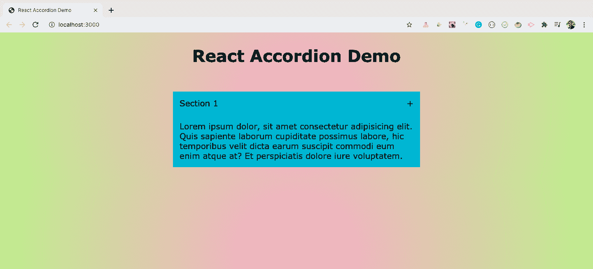
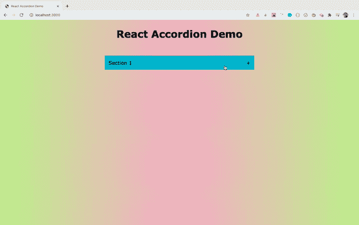
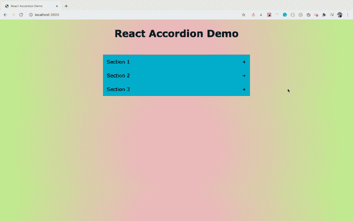

# 如何在 React 中从头开始构建折叠菜单——不需要外部库

> 原文：<https://www.freecodecamp.org/news/build-accordion-menu-in-react-without-external-libraries/>

有许多方法可以使用折叠菜单，比如显示 FAQ 列表、显示各种菜单和子菜单、显示特定公司的位置等等。

在本文中，我们将了解如何在 React 中一步一步地从头开始构建一个折叠菜单，而不使用任何外部库。

我们将使用 React Hooks 语法在 React 中构建这个应用程序。所以如果你是 React 钩子的新手，可以看看我的[React 钩子介绍](https://levelup.gitconnected.com/an-introduction-to-react-hooks-50281fd961fe?source=friends_link&sk=89baff89ec8bc637e7c13b7554904e54)文章来学习钩子的基础知识。

**你可以在这里看到应用程序[的现场演示。](https://react-accordion-demo.netlify.app/)**

所以让我们开始吧。

## 初始项目设置

使用`create-react-app`创建一个新项目

```
npx create-react-app react-accordion-demo 
```

项目创建完成后，删除`src`文件夹中的所有文件，并在`src`文件夹中创建`index.js`、`App.js`和`styles.css`文件。另外，在`src`文件夹中创建一个名为`utils`的新文件夹。

打开`styles.css`文件，将[这里](https://github.com/myogeshchavan97/react-accordion-demo/blob/master/src/styles.css)的内容添加进去。

## 如何创建初始页面

打开`src/App.js`文件，在其中添加以下内容:

```
import React from 'react';

const App = () => {
  const accordionData = {
    title: 'Section 1',
    content: `Lorem ipsum dolor, sit amet consectetur adipisicing elit. Quis sapiente
      laborum cupiditate possimus labore, hic temporibus velit dicta earum
      suscipit commodi eum enim atque at? Et perspiciatis dolore iure
      voluptatem.`
  };

  const { title, content } = accordionData;

  return (
    <React.Fragment>
      <h1>React Accordion Demo</h1>
      <div className="accordion">
        <div className="accordion-item">
          <div className="accordion-title">
            <div>{title}</div>
            <div>+</div>
          </div>
          <div className="accordion-content">{content}</div>
        </div>
      </div>
    </React.Fragment>
  );
};

export default App; 
```

这里，我们使用`accordionData`对象属性来显示折叠内容。

对于`content`属性，我们使用 ES6 模板文字语法(` ` ),这样我们可以将内容分布在多行中，并且我们使用了一些伪 lorem ipsum 文本。

现在，打开`src/index.js`文件，在其中添加以下内容:

```
import React from 'react';
import ReactDOM from 'react-dom';
import App from './App';
import './styles.css';

ReactDOM.render(<App />, document.getElementById('root')); 
```

现在，如果您从终端使用`yarn start`命令运行应用程序，您将看到以下屏幕:



## 如何打开和关闭手风琴菜单

正如你在上面看到的，我们显示了一个单独的部分作为手风琴的一部分。但是默认情况下，手风琴是展开的，我们无法关闭它。因此，让我们添加打开和关闭手风琴的功能。

在组件内添加一个新状态，如下所示:

```
const [isActive, setIsActive] = useState(false); 
```

这里，我们已经定义了`isActive`状态。基于此，我们将隐藏或显示手风琴内容。

同时导入文件顶部的`useState`钩子:

```
import React, { useState } from 'react'; 
```

现在，为带有类`accordion-title`的`div`添加`onClick`处理程序，如下所示:

```
<div className="accordion">
  <div className="accordion-item">
    <div
      className="accordion-title"
      onClick={() => setIsActive(!isActive)}
    >
      <div>{title}</div>
      <div>{isActive ? '-' : '+'}</div>
    </div>
    {isActive && <div className="accordion-content">{content}</div>}
  </div>
</div> 
```

这里，当我们单击`accordion-title` div 时，我们将反转`isActive`状态值。如果`isActive`的值是`false`，我们将它设置为`true`，反之亦然。

我们还使用三元运算符根据`isActive`的值显示了`+`或`-`符号。

如果`isActive`状态值为`true`,那么我们只显示手风琴内容，如下所示:

```
{isActive && <div className="accordion-content">{content}</div>} 
```

现在，如果您检查应用程序，您将看到以下屏幕:



如你所见，最初，手风琴是合上的。当我们点击标题时，手风琴打开，我们可以再次点击它来关闭它。

## 如何在手风琴中添加多个部分

这对于手风琴的单个部分来说效果很好。但是，如果我们有多个部分，用不同的内容一次又一次地复制粘贴同一个 JSX 代码就不好了。

因此，让我们创建一个单独的组件来显示手风琴。然后根据部分的数量，我们将遍历组件以显示多个部分。

在`src`文件夹中新建一个`Accordion.js`文件，并在其中添加以下内容:

```
import React, { useState } from 'react';

const Accordion = ({ title, content }) => {
  const [isActive, setIsActive] = useState(false);

  return (
    <div className="accordion-item">
      <div className="accordion-title" onClick={() => setIsActive(!isActive)}>
        <div>{title}</div>
        <div>{isActive ? '-' : '+'}</div>
      </div>
      {isActive && <div className="accordion-content">{content}</div>}
    </div>
  );
};

export default Accordion; 
```

这里，我们将状态和`accordion-item` div 从`App.js`文件移到了`Accordion.js`。我们使用 ES6 析构语法将动态`title`和`content`属性传递给组件，如下所示:

```
const Accordion = ({ title, content }) => { 
```

现在，打开`App.js`文件，用以下内容替换它:

```
import React from 'react';
import Accordion from './Accordion';

const App = () => {
  const accordionData = [
    {
      title: 'Section 1',
      content: `Lorem ipsum dolor, sit amet consectetur adipisicing elit. Quis sapiente
      laborum cupiditate possimus labore, hic temporibus velit dicta earum
      suscipit commodi eum enim atque at? Et perspiciatis dolore iure
      voluptatem.`
    },
    {
      title: 'Section 2',
      content: `Lorem ipsum, dolor sit amet consectetur adipisicing elit. Mollitia veniam
      reprehenderit nam assumenda voluptatem ut. Ipsum eius dicta, officiis
      quaerat iure quos dolorum accusantium ducimus in illum vero commodi
      pariatur? Impedit autem esse nostrum quasi, fugiat a aut error cumque
      quidem maiores doloremque est numquam praesentium eos voluptatem amet!
      Repudiandae, mollitia id reprehenderit a ab odit!`
    },
    {
      title: 'Section 3',
      content: `Sapiente expedita hic obcaecati, laboriosam similique omnis architecto ducimus magnam accusantium corrupti
      quam sint dolore pariatur perspiciatis, necessitatibus rem vel dignissimos
      dolor ut sequi minus iste? Quas?`
    }
  ];

  return (
    <div>
      <h1>React Accordion Demo</h1>
      <div className="accordion">
        {accordionData.map(({ title, content }) => (
          <Accordion title={title} content={content} />
        ))}
      </div>
    </div>
  );
};

export default App; 
```

这里，我们已经将`accordionData`从一个对象转换为一个对象数组。我们使用数组映射方法遍历它，并将相应的`title`和`content`传递给`Accordion`组件。

现在，如果您检查应用程序，您会看到显示了三个部分，我们可以打开和关闭每个部分，如下所示:



## 如何重构代码

如你所见，只需将 accordion 部分移到一个单独的组件中，并将动态内容作为道具传递，我们就能成功地从头开始创建一个 accordion 的工作版本。

更好的做法是将静态数据保存在单独的文件中。因此，让我们将`accordionData`数组移动到一个不同的文件中，并将其导入到`App.js`中。

在`utils`文件夹中创建一个名为`content.js`的新文件，并在其中添加以下内容:

```
export const accordionData = [
  {
    title: 'Section 1',
    content: `Lorem ipsum dolor, sit amet consectetur adipisicing elit. Quis sapiente
    laborum cupiditate possimus labore, hic temporibus velit dicta earum
    suscipit commodi eum enim atque at? Et perspiciatis dolore iure
    voluptatem.`
  },
  {
    title: 'Section 2',
    content: `Lorem ipsum, dolor sit amet consectetur adipisicing elit. Mollitia veniam
    reprehenderit nam assumenda voluptatem ut. Ipsum eius dicta, officiis
    quaerat iure quos dolorum accusantium ducimus in illum vero commodi
    pariatur? Impedit autem esse nostrum quasi, fugiat a aut error cumque
    quidem maiores doloremque est numquam praesentium eos voluptatem amet!
    Repudiandae, mollitia id reprehenderit a ab odit!`
  },
  {
    title: 'Section 3',
    content: `Sapiente expedita hic obcaecati, laboriosam similique omnis architecto ducimus magnam accusantium corrupti
    quam sint dolore pariatur perspiciatis, necessitatibus rem vel dignissimos
    dolor ut sequi minus iste? Quas?`
  }
]; 
```

现在，打开`App.js`并用以下内容替换它:

```
import React from 'react';
import Accordion from './Accordion';
import { accordionData } from './utils/content';

const App = () => {
  return (
    <div>
      <h1>React Accordion Demo</h1>
      <div className="accordion">
        {accordionData.map(({ title, content }) => (
          <Accordion title={title} content={content} />
        ))}
      </div>
    </div>
  );
};

export default App; 
```

这里，我们刚刚从外部文件导入了静态数据，并将其从`App.js`文件中移除。

所以现在代码看起来很干净，很容易理解，功能和以前一样工作。


## 结束点

我们已经完成了应用程序功能的构建。

**你可以在[这个资源库](https://github.com/myogeshchavan97/react-accordion-demo)中找到这个应用的完整 GitHub 源代码。**

### 感谢阅读！

想从头开始详细学习所有 ES6+特性，包括 let 和 const、promises、各种 promise 方法、数组和对象析构、arrow 函数、async/await、import 和 export 等等吗？

查看我的《掌握现代 JavaScript》一书。这本书涵盖了学习 React 的所有先决条件，并帮助您更好地掌握 JavaScript 和 React。

[](https://modernjavascript.yogeshchavan.dev/)