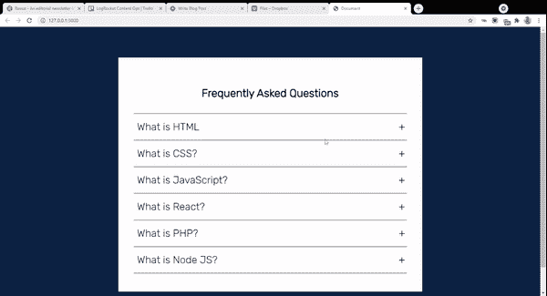
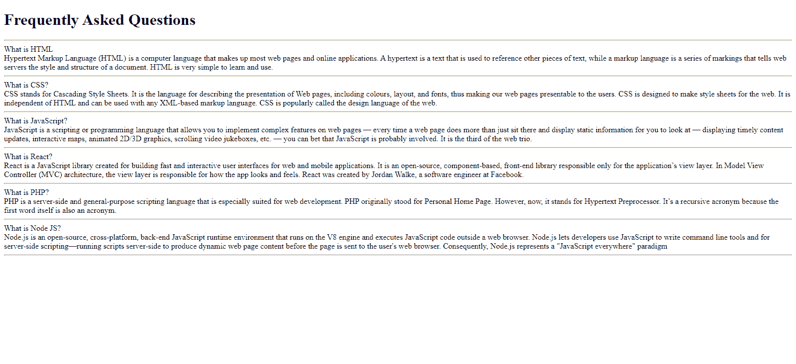
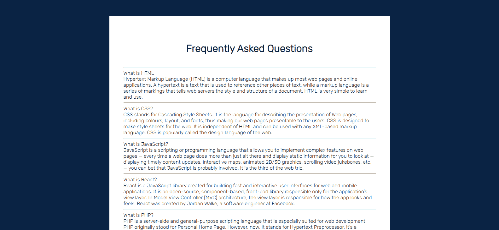
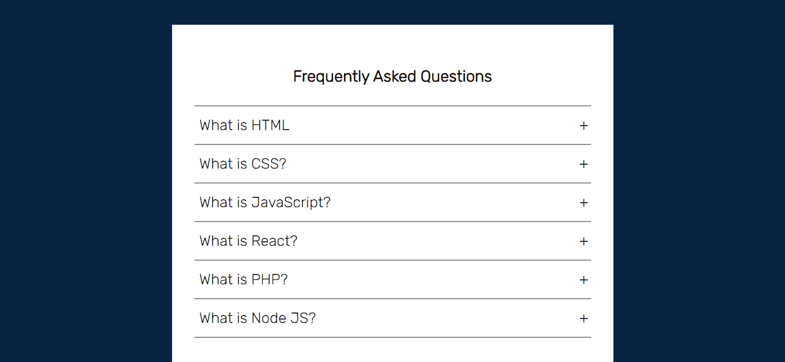
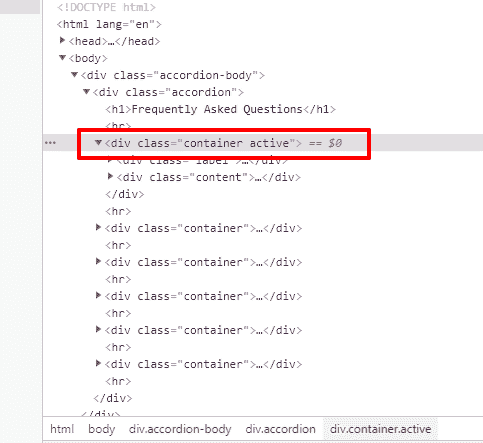

# 如何使用 HTML、CSS 和 JavaScript 构建一个可折叠菜单

> 原文：<https://www.freecodecamp.org/news/build-an-accordion-menu-using-html-css-and-javascript/>

你可以使用 HTML，CSS 和 JavaScript 来创建时尚和动态的网页元素。您可以构建的一个有用的元素是折叠菜单。

当用户单击按钮时，折叠菜单可以展开和折叠。这是一个很好的方法，不用预先显示关于一个主题的所有信息，而是让用户选择只显示他们需要的信息。

在本教程中，我将向您展示如何构建一个简单的折叠式菜单，如下所示:



## 什么是手风琴菜单？

在 UI 设计中，折叠菜单是各种信息的垂直堆叠列表。对于每个列表，都有一个指向相应内容的带标签的标题。默认情况下，每个列表的内容都是隐藏的。点击特定的标签将扩展其内容。

手风琴的一个非常常见的用例是保存一个常见问题列表。点击任何问题都会切换/显示相应的答案。

## 如何使用 HTML、CSS 和 JS 构建一个可折叠菜单

我们将从定义 HTML 标记开始。如果您使用的是类似 VS Code 的 IDE，并且安装了 emmet，那么创建一个新的`index.html`文件，键入`!`，然后按 enter 键。这将为您的项目创建 HTML 样板代码。

或者，你可以将下面的代码复制到你的`index.html`中，或者从 [Codepen](https://codepen.io/ubahthebuilder/pen/gORqxNe) 中获得这个项目的代码。

```
<!DOCTYPE html>
<html lang="en">
<head>
  <meta charset="UTF-8">
  <meta name="viewport" content="width=device-width, initial-scale=1.0">
  <meta http-equiv="X-UA-Compatible" content="ie=edge">
  <title>Document</title>
  <link rel="stylesheet" href="styles.css">
</head>
<body>

  <script src="app.js" type="text/javascript"></script>
</body>
</html> 
```

HTML Page Structure

文件夹结构很简单。我们将创建一个名为 accordion 的文件夹。在这个文件夹中，我们将创建三个文件:`index.html`、`styles.css`和`app.js`。我们还会将所有文件链接到我们的 HTML 标记中，就像你在上面看到的那样。

### 手风琴的 HTML 标记

对于菜单中的每个列表，我们将有两个`div`,一个用于标签，另一个用于内容。

```
<body>
  <div class="accordion-body">
  <div class="accordion">
    <h1>Frequently Asked Questions</h1>
    <hr>
    <div class="container">
      <div class="label">What is HTML</div>
      <div class="content">Hypertext Markup Language (HTML) is a computer language that makes up most web pages and online applications. A hypertext is a text that is used to reference other pieces of text, while a markup language is a series of markings that tells web servers the style and structure of a document. HTML is very simple to learn and use.</div>
    </div>
    <hr>
    <div class="container">
      <div class="label">What is CSS?</div>
      <div class="content">CSS stands for Cascading Style Sheets. It is the language for describing the presentation of Web pages, including colours, layout, and fonts, thus making our web pages presentable to the users. CSS is designed to make style sheets for the web. It is independent of HTML and can be used with any XML-based markup language. CSS is popularly called the design language of the web.
</div>
    </div>
    <hr>
    <div class="container">
      <div class="label">What is JavaScript?</div>
      <div class="content">JavaScript is a scripting or programming language that allows you to implement complex features on web pages — every time a web page does more than just sit there and display static information for you to look at — displaying timely content updates, interactive maps, animated 2D/3D graphics, scrolling video jukeboxes, etc. — you can bet that JavaScript is probably involved. It is the third of the web trio.</div>
    </div>
    <hr>
    <div class="container">
      <div class="label">What is React?</div>
      <div class="content">React is a JavaScript library created for building fast and interactive user interfaces for web and mobile applications. It is an open-source, component-based, front-end library responsible only for the application’s view layer. In Model View Controller (MVC) architecture, the view layer is responsible for how the app looks and feels. React was created by Jordan Walke, a software engineer at Facebook. </div>
    </div>
    <hr>
    <div class="container">
      <div class="label">What is PHP?</div>
      <div class="content">PHP is a server-side and general-purpose scripting language that is especially suited for web development. PHP originally stood for Personal Home Page. However, now, it stands for Hypertext Preprocessor. It’s a recursive acronym because the first word itself is also an acronym.</div>
    </div>
    <hr>
    <div class="container">
      <div class="label">What is Node JS?</div>
      <div class="content">Node.js is an open-source, cross-platform, back-end JavaScript runtime environment that runs on the V8 engine and executes JavaScript code outside a web browser. Node.js lets developers use JavaScript to write command line tools and for server-side scripting—running scripts server-side to produce dynamic web page content before the page is sent to the user's web browser. Consequently, Node.js represents a "JavaScript everywhere" paradigm</div>
    </div>
    <hr>
  </div>
  </div>

  <script src="index.js" type="text/javascript"></script>
</body> 
```

Markup for Accordion Menu

如果没有 CSS，我们的页面看起来会像这样:



How the accordion menu looks without CSS

### 如何用 CSS 设计手风琴样式

当然，我们希望我们的手风琴菜单看起来不错。是时候让 CSS 发挥作用了。我在代码中添加了一些注释来解释每一部分的作用:

```
@import url('https://fonts.googleapis.com/css2?family=Rubik:wght@300&display=swap');

/* Sets the background color of the body to blue. Sets font to Rubik */

body {
  background-color: #0A2344;
  font-family: 'rubik', sans-serif;
}

/* Aligns the heading text to the center. */

h1 {
  text-align: center;
}

/* Sets the width for the accordion. Sets the margin to 90px on the top and bottom and auto to the left and right */

.accordion {
  width: 800px;
  margin: 90px auto;
  color: black;
  background-color: white;
  padding: 45px 45px;
} 
```

应用所有这些风格后，这就是我们的手风琴现在的样子:



Styles added to the accordion menu

现在我们需要开始在内部做一些工作来设置它的功能。首先，我们将每个容器(包含标签和内容)的 position 属性设置为 relative。

这意味着我们现在可以相对于它定位它的子节点。

```
.accordion .container {
  position: relative;
  margin: 10px 10px;
}

/* Positions the labels relative to the .container. Adds padding to the top and bottom and increases font size. Also makes its cursor a pointer */

.accordion .label {
  position: relative;
  padding: 10px 0;
  font-size: 30px;
  color: black;
  cursor: pointer;
} 
```

您现在可以注意到下图中的不同之处:


下一步是在每个列表的末尾添加一个小的“+”号。这将让用户知道他们可以展开该部分来了解/查看更多信息。

我们将使用`::before`选择器来实现这一点。`::before`和`::after`选择器用于将内容放置在指定元素之前或之后。

这里，我们在标签前插入“+”。但是我们将使用偏移属性`top`和`right`将其放置在最右边的角落。

```
 /* Positions the plus sign 5px from the right. Centers it using the transform property. */

.accordion .label::before {
  content: '+';
  color: black;
  position: absolute;
  top: 50%;
  right: -5px;
  font-size: 30px;
  transform: translateY(-50%);
}

/* Hides the content (height: 0), decreases font size, justifies text and adds transition */

.accordion .content {
  position: relative;
  background: white;
  height: 0;
  font-size: 20px;
  text-align: justify;
  width: 780px;
  overflow: hidden;
  transition: 0.5s;
}

/* Adds a horizontal line between the contents */

.accordion hr {
  width: 100;
  margin-left: 0;
  border: 1px solid grey;
} 
```

这会让一切变得更好。还要注意，每个列表的内容现在都是隐藏的。



Accordion menu's content is now hidden

### 向我们的手风琴添加 JavaScript

在这一点上，我们的手风琴几乎是静止的。为了让容器在用户点击时显示内容，我们需要引入一些 JavaScript。

导航到您的脚本`app.js`并键入以下代码:

```
const accordion = document.getElementsByClassName('container');

for (i=0; i<accordion.length; i++) {
  accordion[i].addEventListener('click', function () {
    this.classList.toggle('active')
  })
} 
```

这个脚本将在`container`的`classname`之前访问我们所有的列表。

然后我们将遍历列表。对于每个容器，我们只是想向它注册一个事件侦听器。当它被点击时，我们希望在该元素上切换“活动”类。

现在我们要测试这个效果。点击标签为`What is HTML`的第一个容器，打开您的 DevTools(点击 F12)，并在 elements 选项卡中检查它。

你应该可以找到注册在上面的`active`类:



active class toggled on first menu item

再次点击元素将从其中移除`active`类。

### 如何完成应用程序

我们还需要做最后一件事。我们需要在样式表中创建一个活动类。我们将定义一旦 JavaScript 切换容器上的类，我们希望我们的 accordion 是什么样子。

```
 /* Unhides the content part when active. Sets the height */

.accordion .container.active .content {
  height: 150px;
}

/* Changes from plus sign to negative sign once active */

.accordion .container.active .label::before {
  content: '-';
  font-size: 30px;
} 
```

这是我们的应用程序最终的外观和行为:


Final look

## 包扎

因此，在本教程中，我们使用 HTML、CSS 和 JavaScript 构建了一个折叠式菜单。

感谢跟随。我希望你能从这篇教程中学到一些有用的东西。

如果你对这样的内容感兴趣，[关注我的博客](https://ubahthebuilder.tech)。

祝你一周愉快。