# 如何用 React Native 和 Native Base 搭建一个 Android 新闻 App

> 原文：<https://www.freecodecamp.org/news/build-an-android-news-app-with-react-native-and-native-base/>

我们生活在一个事物不断变化的世界里。因此，如果你想了解最新动态，你需要一个好的新闻应用程序。

为了帮助你学习一些很酷的技术并保持最新，在这篇博文中，我们将使用 React Native 为 Android 构建一个新闻应用程序。它将从不同的新闻频道获取标题，并按类别显示。


这是我们完成后应用程序的外观。所以让我们直接开始吧。

## 如何安装 Expo

那么，什么是世博会？Expo 是一个框架，可以帮助您快速轻松地构建和部署 React Native 应用程序。

让我们安装它。

```
npm install --global expo-cli
```

Installing Expo

在您的终端中运行此命令以安装 Expo CLI。在这里，我们使用`--global`来确保它安装在任何地方。

安装完成后，我们需要创建一个 Expo 项目。

```
expo init News-Application
```

Creating an Expo Project

使用上面的命令初始化项目。它会问你几个问题，比如你的应用程序的名字，你是否想要在你的项目中添加 TypeScript，或者从一个空白的项目开始。只需选择空白，并按下回车键。

然后，它将下载文件夹中的所有包和依赖项。

现在，完成后，导航到项目文件夹。要启动应用程序，输入 **expo start** 。它将在浏览器中打开开发者工具。

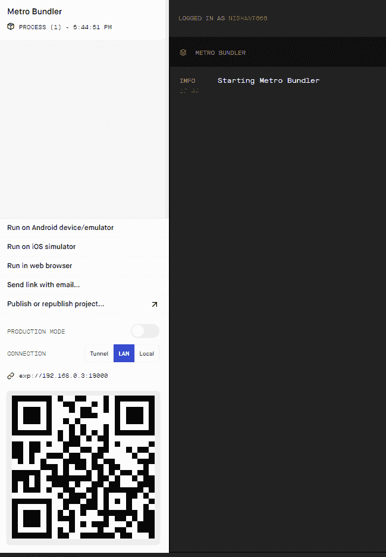

Expo developer tools

这里你会在左边看到许多选项，比如在 Android 设备/模拟器上运行，或者在 iOS 模拟器上运行。我们将在 Web 浏览器上运行应用程序，因此请单击“在 Web 浏览器中运行”选项。

```
import { StatusBar } from 'expo-status-bar';
import React from 'react';
import { StyleSheet, Text, View } from 'react-native';

export default function App() {
  return (
    <View style={styles.container}>
      <Text>Open up App.js to start working on your app!</Text>
      <StatusBar style="auto" />
    </View>
  );
}

const styles = StyleSheet.create({
  container: {
    flex: 1,
    backgroundColor: '#fff',
    alignItems: 'center',
    justifyContent: 'center',
  },
}); 
```

Our App.js

这是我们的 App.js 文件，其中包含默认的样板文件。

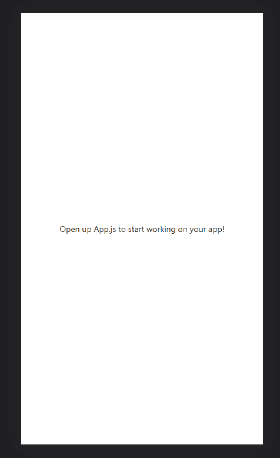

Our output

现在我们的应用程序正在运行。

## 如何使用 React 导航创建不同的屏幕

现在，让我们为我们的应用程序创建各种不同的屏幕。为此，我们将使用 React 导航。所以，我们来装吧。

前往[https://reactnavigation.org/](https://reactnavigation.org/)，点击阅读文件。这将打开文档页面。

让我们使用下面的命令安装 React 导航:

```
npm install @react-navigation/native

expo install react-native-screens react-native-safe-area-context
```

Installing React Navigation

现在，我们的 React 导航已经安装好了。

我们将使用`bottomTabNavigator`。因此，从左侧菜单中，选择 API 参考，导航器，底部选项卡。

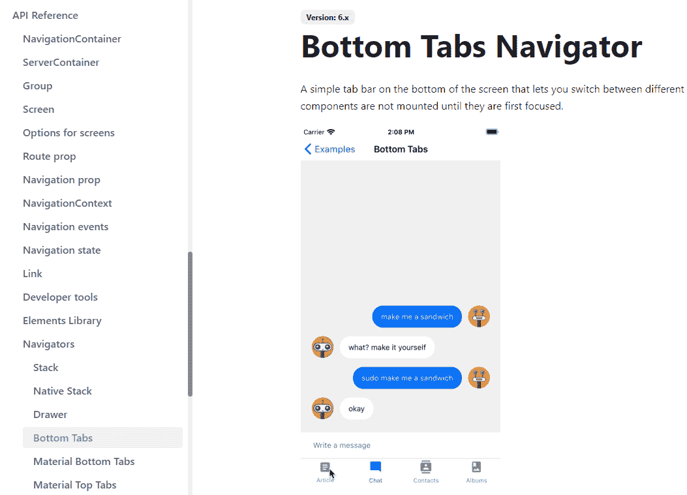

Choose Bottom Tabs

让我们使用下面的命令安装底部的标签:

```
npm install @react-navigation/bottom-tabs
```

Installing the Bottom Tabs

现在，在我们的 App.js 文件中，我们需要导入底部的选项卡来使用它。

所以，像这样导入它:

```
import { createBottomTabNavigator } from '@react-navigation/bottom-tabs'; 
```

Importing Bottom Tabs

现在，让我们导入选项卡屏幕。

```
import { createBottomTabNavigator } from '@react-navigation/bottom-tabs';
import { NavigationContainer } from '@react-navigation/native';
const Tab = createBottomTabNavigator();

function MyTabs() {
  return (
    <Tab.Navigator>
      <Tab.Screen name="Home" component={HomeScreen} />
      <Tab.Screen name="Settings" component={SettingsScreen} />
    </Tab.Navigator>
  );
}
```

Importing Tab Navigator Screens

这就是我们如何创建底部标签。

在我们的例子中，我们需要这样做:

```
<Tab.Navigator>
  <Tab.Screen name="All" component={All} />
  <Tab.Screen name="Business" component={Business} />
  <Tab.Screen name="Health" component={HealthScreen} />
  <Tab.Screen name="Sports" component={SportsScreen} />
  <Tab.Screen name="Tech" component={TechScreen} />
</Tab.Navigator>
```

我们需要为以下选项卡创建这些屏幕:所有新闻、商业新闻、体育新闻、健康新闻和科技新闻。另外，在项目中为每个屏幕创建一个组件。

我们需要像这样将这个`TabNavigtor`包装成一个`NavigationContainer`:

```
<NavigationContainer>
  <Tab.Navigator>
    <Tab.Screen name="All" component={All} />
    <Tab.Screen name="Business" component={Business} />
    <Tab.Screen name="Health" component={HealthScreen} />
    <Tab.Screen name="Sports" component={SportsScreen} />
    <Tab.Screen name="Tech" component={TechScreen} />
  </Tab.Navigator>
</NavigationContainer>
```

我们还需要导入所有这些组件，所以在顶部导入它们。

```
import All from './screens/All';
import Business from './screens/Business';
import HealthScreen from './screens/Health';
import SportsScreen from './screens/Sports';
import TechScreen from './screens/Tech';
```

现在，如果我们把我们编写的所有代码放在一起，我们将得到下面的代码:

```
import React from 'react';
import { createBottomTabNavigator } from '@react-navigation/bottom-tabs';
import { NavigationContainer } from '@react-navigation/native';
import All from './screens/All';
import Business from './screens/Business';
import HealthScreen from './screens/Health';
import SportsScreen from './screens/Sports';
import TechScreen from './screens/Tech';
const Tab = createBottomTabNavigator();

export default function App() {
  return (
    <NavigationContainer>
      <Tab.Navigator>
        <Tab.Screen name="All" component={All} />
        <Tab.Screen name="Business" component={Business} />
        <Tab.Screen name="Health" component={HealthScreen} />
        <Tab.Screen name="Sports" component={SportsScreen} />
        <Tab.Screen name="Tech" component={TechScreen} />
      </Tab.Navigator>
    </NavigationContainer>
  );
} 
```

The Code for the screens

这将是我们的输出:


Our five screens namely All, Business, Health, Sports and Tech

我们这里有五个屏幕，商业、健康、体育和科技。

现在，让我们在这里做一些调整。我们需要改变底部标签的图标。

为此，我们需要为我们的图标获取一个图标库。为此我们将使用 *react-native-elements。*

要安装它，请键入以下命令:

```
npm install react-native-elements
```

Install React Native Elements

这个图标包有很多图标选项可供选择。

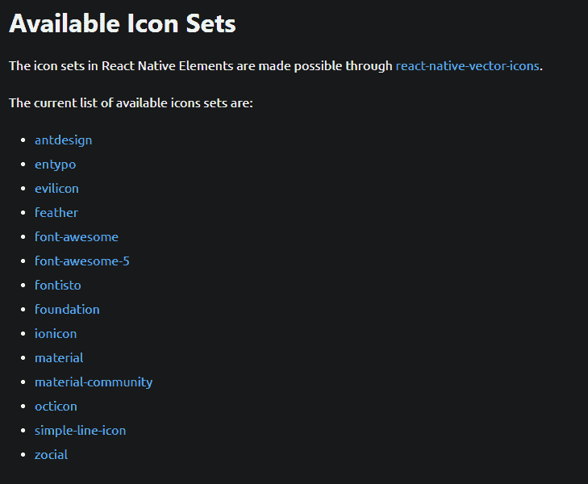

Available Icons in React Native Elements

现在，让我们在底部的选项卡导航器中添加图标。

```
<Tab.Screen name="All" component={All}
          options={{
            tabBarIcon: (props) => (
              <Icon type='feather' name='home' color={props.color} />
            ),
          }} />
```

Adding icon for home page

这里我们为主页添加了名为“home”的图标，为类型添加了羽化图标类。

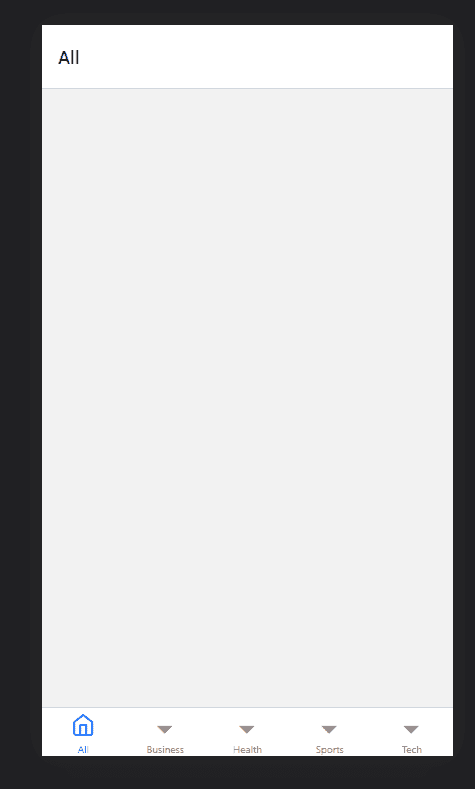

Bottom Tab Navigator with the Home Icon

这将产生上面的输出。同样，让我们对它们重复同样的过程。

```
<Tab.Navigator>
        <Tab.Screen name="All" component={All}
          options={{
            tabBarIcon: (props) => (
              <Icon type='feather' name='home' color={props.color} />
            ),
          }} />

        <Tab.Screen name="Business" component={Business}
          options={{
            tabBarIcon: (props) => (
              <Icon type='feather' name='dollar-sign' color={props.color} />
            ),
          }} />

        <Tab.Screen name="Health" component={HealthScreen}
          options={{
            tabBarIcon: (props) => (
              <Icon type='feather' name='heart' color={props.color} />
            ),
          }} />

        <Tab.Screen name="Sports" component={SportsScreen}
          options={{
            tabBarIcon: (props) => (
              <Icon type='ionicon' name="tennisball-outline" color={props.color} />
            ),
          }} />

        <Tab.Screen name="Tech" component={TechScreen}
          options={{
            tabBarIcon: (props) => (
              <Icon type='ionicon' name="hardware-chip-outline" color={props.color} />
            ),
          }} />
      </Tab.Navigator>
```

All the Bottom Tabs with Icons

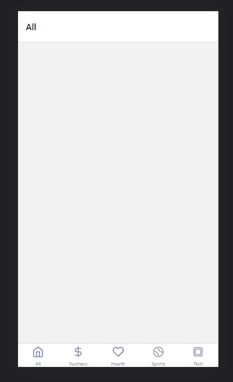

现在，我们的每个不同的选项卡或屏幕都完成了，它们都有自己独特的图标。

## 如何调用新闻 API

现在，让我们从[https://newsapi.org/](https://newsapi.org/)调用新闻 API

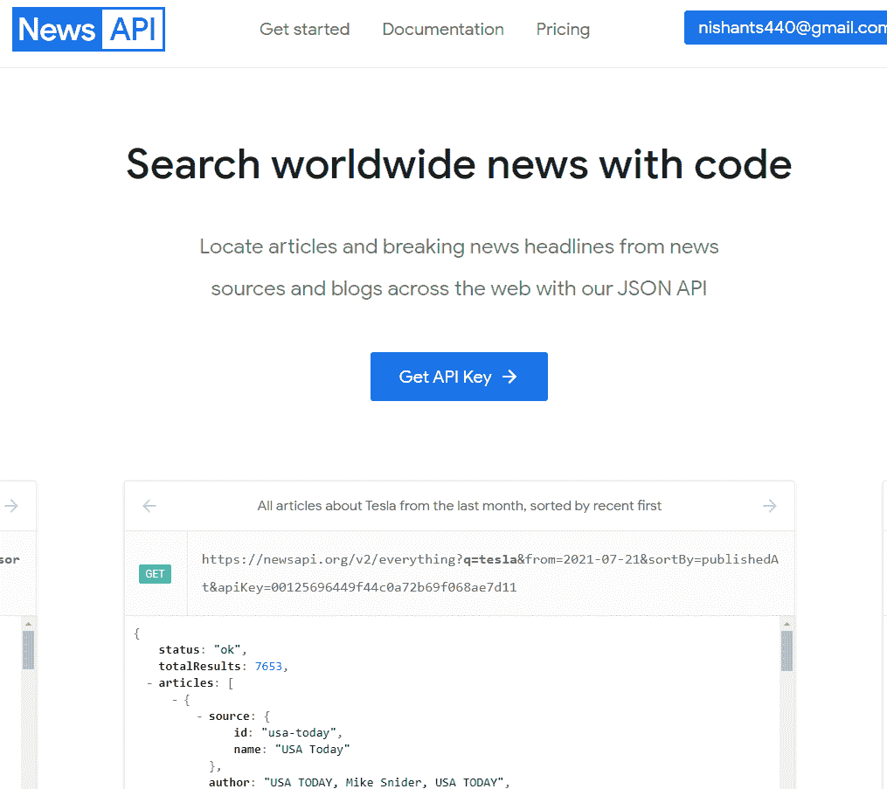

去这个网站注册。它会给你一个 API 密匙。

我们需要一个配置文件来存储所有的新闻常量，所以让我们创建它。

```
export const API_KEY = ``;
export const endpoint = `https://newsapi.org/v2/top-headlines`;
export const country = 'in'
```

Our config.js

我们需要 API_KEY、端点和国家代码。

现在，我们需要为我们的 **GET API 请求创建一个服务。**

创建名为 *services.js.* 的文件

在这里，导入 API_KEY、端点和顶部的国家。

```
import { API_KEY, endpoint, country } from '../config/config';
```

Services.js

然后，我们将编写我们的服务体。

```
export async function services(category = 'general') {
    let articles = await fetch(`${endpoint}?country=${country}&category=${category}`, {
        headers: {
            'X-API-KEY': API_KEY
        }
    });

    let result = await articles.json();
    articles = null;

    return result.articles;
}
```

Our GET API service

因此，我们通过使用端点获取新闻数据，并附加国家和类别。在函数中，我们将类别作为 general 传递，因为这是默认类别。我们还在头中传递 API_key。

然后，我们将响应或输入数据转换成 JSON 格式，并将其存储在一个结果变量中。

最后，我们使用关键字`return`返回它。

以下是整个文件供您参考:

```
import { API_KEY, endpoint, country } from '../config/config';

export async function services(category = 'general') {
    let articles = await fetch(`${endpoint}?country=${country}&category=${category}`, {
        headers: {
            'X-API-KEY': API_KEY
        }
    });

    let result = await articles.json();
    articles = null;

    return result.articles;
}
```

现在，我们需要将这个服务导入到 All.js 文件中。

```
import { services } from '../services/services';
```

Import Services into All.js

我们将需要使用`useState`和`useEffect`挂钩。useEffect 钩子将在 All.js 文件中调用这个服务，而 useState 将创建一个状态来存储来自 API 的响应。

```
import React, { useEffect, useState } from 'react'
import { View } from 'react-native';
import { services } from '../services/services';
export default function All() {
    const [newsData, setNewsData] = useState([])
    useEffect(() => {
        services('general')
            .then(data => {
                setNewsData(data)
            })
            .catch(error => {
                alert(error)
            })
    }, [])
    return (
        <View>

        </View>
    )
} 
```

Using useState and useEffect hooks

在这个文件中，我们将 useEffect 钩子中的服务称为。然后我们将响应存储在 newsData 状态中，这是一个数组。我们还为类别传递一个参数，这个参数是通用的。

这个屏幕将获取所有新闻，所以我们使用常规类别。每隔一个屏幕它都会改变。健康屏幕会显示*健康*，运动屏幕会显示*运动*，以此类推。

现在，我们需要在界面中显示这些数据。为此，我们还需要另一个名为 Native Base 的包。所以，我们来装吧。

键入以下命令以安装本机基础:

```
yarn add native-base styled-components styled-system
expo install react-native-svg react-native-safe-area-context
```

Installing Native Base

在 All.js 中，让我们从 Native Base 导入一些东西:

```
import React, { useEffect, useState } from 'react'
import { View, Text } from 'react-native';
import { NativeBaseProvider, FlatList, ScrollView, Divider, Image, Spinner } from 'native-base';
import { services } from '../services/services';
```

Importing stuff from Native Base

然后在返回中，我们会加上`NativeBaseProvider`。

```
return (
        <NativeBaseProvider>

        </NativeBaseProvider>
    )
```

Adding NativeBaseProvider in the return

然后，让我们添加滚动视图。如果新闻数据超出我们的屏幕高度，这将让用户滚动。

```
<NativeBaseProvider>
            <ScrollView height={850}>

            </ScrollView>
        </NativeBaseProvider>
```

Adding ScrollView

现在，让我们添加`FlatList`来显示我们的新闻数据。

```
<NativeBaseProvider>
            <ScrollView height={850}>
                <FlatList
                    data={newsData}
                    renderItem={({ item }) => (
                       <View>

                       </View> 
                    )}
                    keyExtractor={(item) => item.id}
                />
            </ScrollView>
        </NativeBaseProvider>
```

Using FlatList

FlatList 取一个数据属性，就是我们之前创建的`newsData` 状态，它从`renderItems` *返回一个`item` 。*

这类似于 JavaScript 中的`map`，它遍历一个数组并返回一个项。它还有一个`keyExtractor`,我们用它来使每个项目都是独一无二的。

现在，让我们在视图中显示我们的数据。

在父视图中再创建一个视图，如下所示:

```
<NativeBaseProvider>
            <ScrollView height={850}>
                <FlatList
                    data={newsData}
                    renderItem={({ item }) => (
                       <View>
                           <View>

                           </View>
                       </View> 
                    )}
                    keyExtractor={(item) => item.id}
                />
            </ScrollView>
        </NativeBaseProvider>
```

现在，让我们在子视图中添加一些文本。

```
<NativeBaseProvider>
            <ScrollView height={850}>
                <FlatList
                    data={newsData}
                    renderItem={({ item }) => (
                        <View>
                            <View>
                                <Text>
                                    {item.title}
                                </Text>
                                <Text>
                                    {item.publishedAt}
                                </Text>
                                <Text>
                                    {item.description}
                                </Text>
                            </View>
                        </View>
                    )}
                    keyExtractor={(item) => item.id}
                />
            </ScrollView>
        </NativeBaseProvider>
```

这包含我们的新闻标题、描述和发布日期。

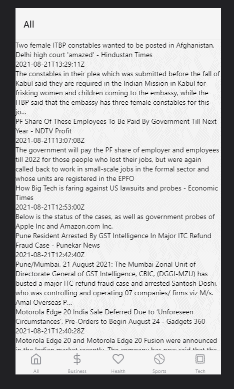

## 如何设计我们的 React 本地新闻应用

这是我们的应用程序现在的样子，带有新闻标题、描述和日期。为了让它看起来更好，我们需要给它一些造型。

从顶部的 React Native 导入`StyleSheet`以使用其样式。

```
import { View, Text, StyleSheet } from 'react-native';
```

Importing StyleSheet from react-native

```
<View>
                            <View style={styles.newsContainer}>
                                <Text style={styles.title}>
                                    {item.title}
                                </Text>
                                <Text style={styles.date}>
                                    {item.publishedAt}
                                </Text>
                                <Text style={styles.newsDescription}>
                                    {item.description}
                                </Text>
                            </View>
                        </View>
```

然后，像这样添加样式。在底部，我们需要创造那些风格。

```
const styles = StyleSheet.create({
    newsContainer: {
        padding: 10
    },
    title: {
        fontSize: 18,
        marginTop: 10,
        fontWeight: "600"
    },
    newsDescription: {
        fontSize: 16,
        marginTop: 10
    },
    date: {
        fontSize: 14
    },
});
```

Our StyleSheet in All.js

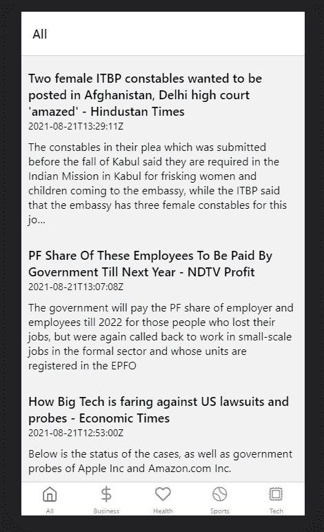

这是获得一些样式后应用程序现在的样子。您也可以向下滚动页面。

现在，我们需要将日期格式改为可读格式，因为我不理解 **'2021-08-21T11:00:40Z '。**

为此，我们将使用有用的 moment.js 包，所以让我们使用下面的命令来安装它:

```
npm install moment --save
```

Install Moment.js to format time

然后，将其导入我们的 All.js 屏幕:

```
<Text style={styles.date}>
  {moment(item.publishedAt).format('LLL')}
</Text>
```

Formating the date and time using moment.js

日期格式如下:

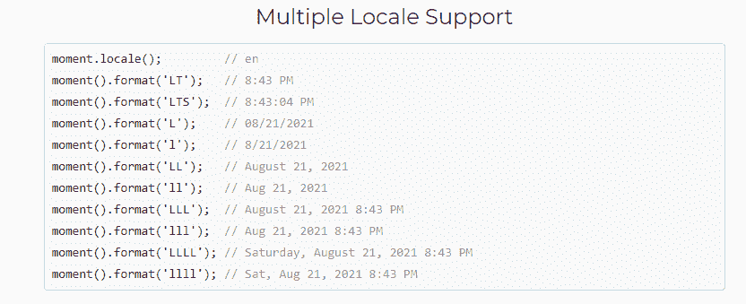

Moment.js time and date formats

目前文档给了我们如此多的格式可供选择。我选择了*‘LLL’*格式。


现在我们的约会更容易被人读懂了。

我们还需要一个分隔线将新闻文章分开，这样它们就不会一起出现。

```
<View>
                            <View style={styles.newsContainer}>
                                <Text style={styles.title}>
                                    {item.title}
                                </Text>
                                <Text style={styles.date}>
                                    {moment(item.publishedAt).format('LLL')}
                                </Text>
                                <Text style={styles.newsDescription}>
                                    {item.description}
                                </Text>
                            </View>
                            <Divider my={2} bg="#e0e0e0" />
                        </View>
```

Adding a divider

因此，在子视图后添加分隔线后，我们的应用程序如下所示:

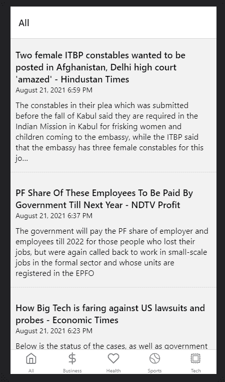

现在我们的新闻标题被分开了，这看起来很棒。

这个新闻 API 也有一个图像。所以，我们来补充一下。

```
<View>
                            <View style={styles.newsContainer}>
                                <Image
                                    width={550}
                                    height={250}
                                    resizeMode={"cover"}
                                    source={{
                                        uri: item.urlToImage,
                                    }}
                                    alt="Alternate Text"
                                />
                                <Text style={styles.title}>
                                    {item.title}
                                </Text>
                                <Text style={styles.date}>
                                    {moment(item.publishedAt).format('LLL')}
                                </Text>
                                <Text style={styles.newsDescription}>
                                    {item.description}
                                </Text>
                            </View>
                            <Divider my={2} bg="#e0e0e0" />
                        </View>
```

因此，我们添加了图像，并使用名为`urlToImage`的键来完成这个*。*


现在我们看到了新闻图片。

## 如何添加一个微调器来显示新闻加载

让我们添加一个微调器，它将在新闻加载时显示。

首先，我们将创建一张支票。如果`newsData`状态的长度大于 1，我们将显示我们的`FlatList`，它包含我们的新闻数据。否则我们将显示装载微调器。

换句话说，如果`newsData`状态的长度小于 1，这意味着它是空的，API 仍在被调用。一旦 API 调用结束，它会将数据存储到`newsData`状态中，状态的长度会变为不止一个。

```
{newsData.length > 1 ? (
                    <FlatList
                        data={newsData}
                        renderItem={({ item }) => (
                            <View>
                                <View style={styles.newsContainer}>
                                    <Image
                                        width={550}
                                        height={250}
                                        resizeMode={"cover"}
                                        source={{
                                            uri: item.urlToImage,
                                        }}
                                        alt="Alternate Text"
                                    />
                                    <Text style={styles.title}>
                                        {item.title}
                                    </Text>
                                    <Text style={styles.date}>
                                        {moment(item.publishedAt).format('LLL')}
                                    </Text>
                                    <Text style={styles.newsDescription}>
                                        {item.description}
                                    </Text>
                                </View>
                                <Divider my={2} bg="#e0e0e0" />
                            </View>
                        )}
                        keyExtractor={(item) => item.id}
                    />
                ) : (
                    <View style={styles.spinner}>
                        <Spinner color="danger.400" />
                    </View>
                )}
```

Adding a Spinner

在我们的样式中，为微调器添加下面的样式代码。

```
spinner: {
        display: 'flex',
        justifyContent: 'center',
        alignItems: 'center',
        height: 400
}
```

Styles for Spinner

以下是代码，供您参考:

```
import React, { useEffect, useState } from 'react'
import { View, Text, StyleSheet } from 'react-native';
import { NativeBaseProvider, FlatList, ScrollView, Divider, Image, Spinner } from 'native-base';
import { services } from '../services/services';
import moment from 'moment'
export default function All() {
    const [newsData, setNewsData] = useState([])
    useEffect(() => {
        services('general')
            .then(data => {
                setNewsData(data)
            })
            .catch(error => {
                alert(error)
            })
    }, [])
    return (
        <NativeBaseProvider>
            <ScrollView height={850}>
                {newsData.length > 1 ? (
                    <FlatList
                        data={newsData}
                        renderItem={({ item }) => (
                            <View>
                                <View style={styles.newsContainer}>
                                    <Image
                                        width={550}
                                        height={250}
                                        resizeMode={"cover"}
                                        source={{
                                            uri: item.urlToImage,
                                        }}
                                        alt="Alternate Text"
                                    />
                                    <Text style={styles.title}>
                                        {item.title}
                                    </Text>
                                    <Text style={styles.date}>
                                        {moment(item.publishedAt).format('LLL')}
                                    </Text>
                                    <Text style={styles.newsDescription}>
                                        {item.description}
                                    </Text>
                                </View>
                                <Divider my={2} bg="#e0e0e0" />
                            </View>
                        )}
                        keyExtractor={(item) => item.id}
                    />
                ) : (
                    <View style={styles.spinner}>
                        <Spinner color="danger.400" />
                    </View>
                )}
            </ScrollView>
        </NativeBaseProvider>
    )
}

const styles = StyleSheet.create({
    newsContainer: {
        padding: 10
    },
    title: {
        fontSize: 18,
        marginTop: 10,
        fontWeight: "600"
    },
    newsDescription: {
        fontSize: 16,
        marginTop: 10
    },
    date: {
        fontSize: 14
    },
    spinner: {
        display: 'flex',
        justifyContent: 'center',
        alignItems: 'center',
        height: 400
    }
});
```

我们的 All.js 屏幕现在完成了。

现在，我们可以在所有其他屏幕上使用相同的代码。我们只需要改变我们在服务的`useEffect`钩子中传递的参数。

因此，对于业务屏幕，我们将使用业务。对于健康，我们会用健康，等等。

```
import React, { useEffect, useState } from 'react'
import { View, Text, StyleSheet } from 'react-native';
import { NativeBaseProvider, FlatList, ScrollView, Divider, Image, Spinner } from 'native-base';
import { services } from '../services/services';
import moment from 'moment'
export default function Business() {
    const [newsData, setNewsData] = useState([])
    useEffect(() => {
        services('business')
            .then(data => {
                setNewsData(data)
            })
            .catch(error => {
                alert(error)
            })
    }, [])
    return (
        <NativeBaseProvider>
            <ScrollView height={850}>
                {newsData.length > 1 ? (
                    <FlatList
                        data={newsData}
                        renderItem={({ item }) => (
                            <View>
                                <View style={styles.newsContainer}>
                                    <Image
                                        width={550}
                                        height={250}
                                        resizeMode={"cover"}
                                        source={{
                                            uri: item.urlToImage,
                                        }}
                                        alt="Alternate Text"
                                    />
                                    <Text style={styles.title}>
                                        {item.title}
                                    </Text>
                                    <Text style={styles.date}>
                                        {moment(item.publishedAt).format('LLL')}
                                    </Text>
                                    <Text style={styles.newsDescription}>
                                        {item.description}
                                    </Text>
                                </View>
                                <Divider my={2} bg="#e0e0e0" />
                            </View>
                        )}
                        keyExtractor={(item) => item.id}
                    />
                ) : (
                    <View style={styles.spinner}>
                        <Spinner color="danger.400" />
                    </View>
                )}
            </ScrollView>
        </NativeBaseProvider>
    )
}

const styles = StyleSheet.create({
    newsContainer: {
        padding: 10
    },
    title: {
        fontSize: 18,
        marginTop: 10,
        fontWeight: "600"
    },
    newsDescription: {
        fontSize: 16,
        marginTop: 10
    },
    date: {
        fontSize: 14
    },
    spinner: {
        display: 'flex',
        justifyContent: 'center',
        alignItems: 'center',
        height: 400
    }
});
```

The Business Screen


向下滚动业务屏幕，你会看到与业务相关的新闻。

您可以对所有其他屏幕进行同样的操作:

```
useEffect(() => {
        services('business')
            .then(data => {
                setNewsData(data)
            })
            .catch(error => {
                alert(error)
            })
}, [])
```

For Business

```
useEffect(() => {
        services('health')
            .then(data => {
                setNewsData(data)
            })
            .catch(error => {
                alert(error)
            })
    }, [])
```

For Health

```
useEffect(() => {
        services('sports')
            .then(data => {
                setNewsData(data)
            })
            .catch(error => {
                alert(error)
            })
    }, [])
```

For Sports

```
useEffect(() => {
        services('technology')
            .then(data => {
                setNewsData(data)
            })
            .catch(error => {
                alert(error)
            })
    }, [])
```

For Tech

## 结论

恭喜你！现在我们的新闻应用程序完成了。

所以继续吧，构建并尝试一下。你可以做很多事情。

你可以在[上查看我的播放列表使用 React Native 和 Native Base](https://youtube.com/playlist?list=PLWgH1O_994O8KP1srByN1OmoiRpLF6lNO) 构建一个新闻应用，它在我的 YouTube 频道上。

随意在这里下载代码:[https://github.com/nishant-666/React-Native-News](https://github.com/nishant-666/React-Native-News)

> 快乐学习。