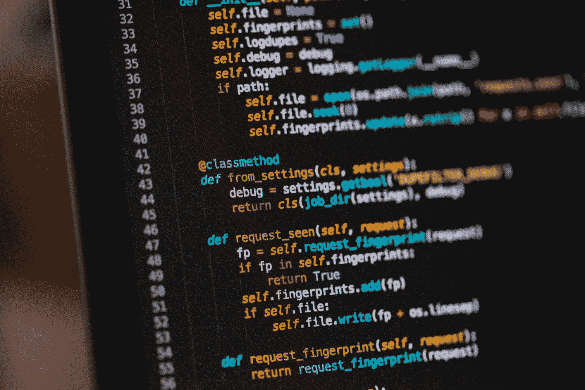
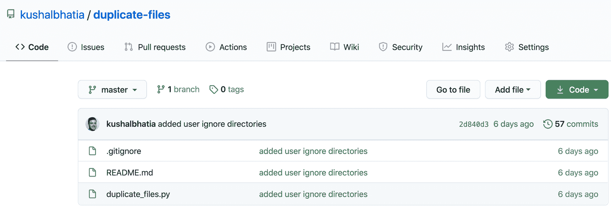
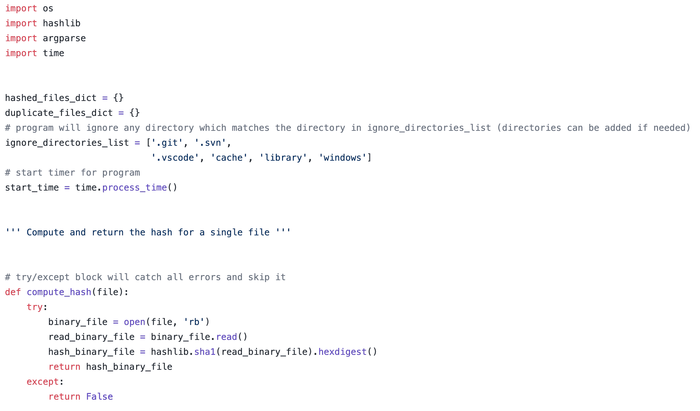

# 作为一名自学成才的软件开发人员，我如何构建一个 IT 自动化项目

> 原文：<https://www.freecodecamp.org/news/build-an-automation-project-as-a-selftaught-developer/>

我一直痴迷于技术是如何工作的，即计算机。但是我的热情被脑海中一个反复回响的声音所阻碍——“你不够聪明，不能学习计算机科学。”

我认为我需要在定量数学方面有很高的技能，并且是一个天才，才能考虑从事计算方面的工作，更不用说从事全职软件开发了。

这一切都在 2020 年 3 月改变了。由于冠状病毒疫情，我失去了在一家领先的数据分析和营销自动化初创公司担任业务发展经理的工作。

就在那时，我决定踏上旅程，最终追求我的梦想，成为一名软件开发人员。

你看，我 2012 年从加州大学洛杉矶分校毕业，获得了政治学学士学位，我被保证会去法学院深造，成为一名律师。

从那以后，我在许多初创公司工作过，担任过许多职务，包括技术客户协调员和业务开发经理。我甚至涉足金融领域，做了几年投资银行分析师。

但是这些工作都不吸引我，我知道我需要一个永久的改变。

## 成为软件开发人员的路线图

我通过使用两个网站开始了我的软件开发之旅: [freeCodeCamp](https://www.freecodecamp.org/) 和[Odin Project](https://www.theodinproject.com/)。通过他们我学会了 HTML，CSS，Git，Bash 和 Github。

这是我第一次真正进入独特的技术世界，在那里我建立了迷你项目，如重建谷歌主页。我会使用 Bash 命令，然后将我的 Git 更改推送到 GitHub。只用几行代码就能看到一些具体的东西变得栩栩如生，这真是令人着迷！

因为 HTML 和 CSS 是标记和样式语言，所以我必须学习一门真正的编程语言。在网上彻底研究(主要是 Reddit)后，我决定用 Java 或 Python。我选择了后者。

我开始阅读两本关于 Python 的入门书籍，这让我对这门美丽的语言感到兴奋。他们分别是由[阿尔·斯威加特](https://twitter.com/AlSweigart)和*埃里克·马特斯主持的*用 Python 自动化枯燥的东西。

这两位作者既精彩又搞笑，我非常喜欢阅读每一章，完成必要的作业。

在这一点上，我知道基础，但是我想学习如何用这些新发现的知识来构建。

因此，我在 Coursera 上注册了一个名为 *[Python 的五门课程专精课程，由伟大的 Charles Severance(又名](https://www.coursera.org/specializations/python)[查克博士](https://twitter.com/drchuck))为大家专精* 。这正是我需要弥合初级和中级 Python 之间的差距。

这个专业花了我将近两个月的时间才完成。我学习了 SQL，互联网协议，JSON，XML，还有各种 Python 库，包括 *[美汤](https://www.crummy.com/software/BeautifulSoup/bs4/doc/)* 和 *[Urllib](https://urllib3.readthedocs.io/en/latest/)* (用于网页抓取)。

查克博士绝对是科技界的传奇，他的课程是 Coursera 上注册人数最多的课程之一也就不足为奇了。

此时，我已经掌握了足够的 HTML、CSS、SQL 和 Python 知识，可以自信地说我是一名中级软件开发人员。

Time to create a meaningful project!

## 我如何(以及为什么)构建我的 IT 自动化项目

然而，在这一点上，我意识到我没有创造出任何有意义的东西来吸引潜在雇主的目光。我在 GitHub 上发布的任何东西，都不会被克隆数百次，被分叉数千次。在某种意义上，我的开源存在是不存在的。

我在互联网上筛选，用 Python 搜索项目想法。当然，我可以创建一个网页抓取器或另一个无聊的 Twitter 机器人，但我想建立一些不同的东西。

绞尽脑汁，我回想起我以前的工作，业务发展经理。在那里，我的任务是在我们的 Salesforce CRM 上找到重复的帐户(有超过一百万条记录！).

我多么希望我能写一个简单的脚本，让我的计算机在几分钟内完成这项工作，而不是几周。

然后我想到——为什么我不建立一个实用程序来检查我计算机上的所有文件并寻找重复的文件呢？普通人的电脑上可能有一大堆文件，其中许多文件被创建了多次，却完全被遗忘了。

想法开始涌现。我想到了金融和医疗保健等行业的许多用例，它们肯定可以利用类似这样的东西来快速查看记录。

我决定跳到 VS 代码中，创建一个. py 文件，并将其命名为 duplicate_files。终于到了戴上我的软件设计师帽子，构建我的杰作的时候了。

Snippets of my Duplicate Files Utility on GitHub

## 构建复制文件实用程序

设计项目最困难的部分之一是决定要使用什么库。

*   我知道我想访问我的电脑上的文件，所以我添加了操作系统库。
*   我知道我想找到每个文件的惟一散列来区分它们，所以我选择了 hashlib 库。
*   我知道我希望用户在运行这个实用程序时提供他们自己的参数，所以我选择了 argparse 库。
*   当然，我想对该工具的总处理时间进行计时，所以我添加了时间库。

设计项目的另一个难点是决定什么样的数据结构工作得最好。经过反复试验，我选择了两个字典和一个列表(这将跨 Windows、macOS 和 Linux 应用用户忽略的目录)。

对我来说极其重要的是，这实际上包含了**“一个简单而强大的程序，在你的 Windows、mac0S 或 Linux 计算机上搜索唯一重复的散列文件”**。

这就是为什么我想使用 Python 必须提供的基本构建模块——循环、条件和**函数**。我没有使用任何你可能在其他项目中看到的复杂的面向对象编程。这个程序简单来说就是三大功能，仅此而已！

我通过添加一个 README 文件来结束我的设计，并且在每次将我的更改推送到 GitHub 时都包含一个. gitignore 文件。我通过 VS 代码调试器彻底测试了这个程序。JSON 文件)，以及安装了所有主要操作系统的多台计算机。

事实上，这个程序是在 Windows 机器上运行的，其中给定的路径中有一个 6GB 的文件。当它到达那个文件时，程序似乎暂时停止了，然后继续并以极快的速度完成。

在该示例中，该路径有 100，000 个文件，并且在五分钟内完成。几个月前，我惊讶于我用基本 HTML 和 CSS 编写的东西是如何显示在网站上的。

今天运行这个程序后，我真的被计算机在只有几行代码的情况下运行的速度和复杂性迷住了！

Naval Ravikant, one of my idols

## 结论

学习如何成为一名软件开发人员，这是一个难以置信的困难，但却是值得的 8 个月(还在继续)。

有一段时间，我想过参加一个训练营。我甚至考虑过计算机科学的硕士课程。

但是有了互联网上优秀的免费和开源材料，我有信心可以自学。

我想对昆西·拉森(Quincy Larson)给予一个大大的欢呼，感谢他激励我开始我的免费代码营之旅。我还要感谢阿尔·斯威加特、埃里克·马特斯、查尔斯·塞弗伦和吉多·范·罗苏姆，他们在我迄今为止的旅程中直接或间接地帮助了我。

我希望这篇文章能完成两件事:

1.  我激励那些不确定自己想从事什么职业或者只是害怕的人走出去开始编码！
2.  雇主会给我一个机会，这样我就可以实现成为软件开发人员的最大梦想之一(尽管是自学成才)。

总结一下:我最崇拜的偶像之一，著名的计算机程序员、投资者和现代哲学家 Naval Ravikant ，有一句话一直让我产生共鸣。

> “学会销售。学习建造。如果你能做到这两点，你将是不可阻挡的。”

嗯，我已经在金融和科技行业建立了销售生涯，现在我已经学会了建立。我将势不可挡。

你可以在 *[Twitter](https://twitter.com/Kushal_Bhatia) 、* *[LinkedIn](https://www.linkedin.com/in/kushalbhatia)* 和 *[GitHub](https://github.com/kushalbhatia) 上找到我。*