# 如何构建和部署您自己的个人作品集网站

> 原文：<https://www.freecodecamp.org/news/build-and-deploy-your-own-personal-portfolio-site/>

你好！我的名字是凯文·鲍威尔。我喜欢教人们如何建立网站，以及如何让网站看起来更好。

我很兴奋地宣布**我刚刚推出了[一门免费课程](https://scrimba.com/g/gportfolio)** ，教你创建自己的*全响应*作品集网站。

学完这门课程后，你将拥有一个外观整洁的作品集网站，它将帮助你获得工作面试和自由职业的机会。给你的朋友和家人看也是一件很酷的事情。

我们将使用 Scrimba 的交互式代码学习平台构建投资组合，然后使用 DigitalOcean 的云服务进行部署。

此外， [DigitalOcean](https://www.digitalocean.com/) 已经慷慨地给每个注册**的人一个免费的信用点**，所以它的启动和运行不会花费你任何东西。

这篇文章是课程本身的分解，让你对所有课程都有所了解。如果您喜欢您所看到的，请确保在 Scrimba 上查看！

### 第一课:简介

在第一课中，您将对本课程有一个概述，这样您就知道会发生什么，在学习本课程之前您应该知道什么，以及在完成本课程后您将获得什么。我也给你一个快速的自我介绍。

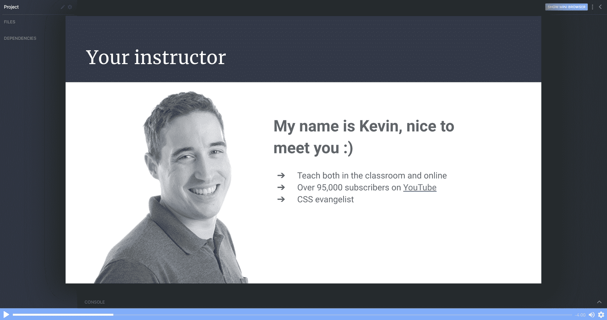

### 第 2 课:设置事物- HTML

在第二部分中，我将带您参观 Scrimba 环境，我们还将设置项目。

所有的图片都已提供，所以你还不需要担心寻找完美的照片。我们可以专注于建立投资组合！

别忘了，你可以在我们的[专用设计页面](https://xd.adobe.com/spec/6ebfeb86-6eeb-4b69-77dc-ecf4c4506bcc-188e/)访问你需要的一切，从文本、颜色到字体等等。

### 第 3 课:标题区域- HTML

终于是时候开始构建投资组合了。在这节课中，我们将创建标题部分。我们将重温在 CSS 中设置类名的 BEM 方法，我想你会发现这使得导航创建起来简单明了。

### 第 4 课:简介部分

接下来是作品集的介绍部分。这是我们自我介绍的地方，放一张我们自己的照片。

最后，我们添加了一个关于我们可以做的主要技能/服务的部分。目前，我们可以用“Lorem ipsum”文本作为占位符来填充它，直到您准备好用自己的文本来填充它。

### 第 5 课:关于我，工作和页脚- HTML

在这一章中，我们将通过最后三个部分来结束我们的 HTML:关于我，我们将更详细地介绍我们自己；工作，我们将添加一些我们的投资组合的例子，我们的页脚。

页脚是链接到电子邮件地址的理想选择，我将向你展示如何用一个`<a>`标签做到这一点。我们也可以在那里添加我们的社交媒体链接。

现在，它看起来有点原始，所有的 CSS 乐趣都在我们面前。

### 第 6 课:设置自定义特性和常规样式

好了，是时候让这个页面看起来很棒了！

在这一部分，我们将学习如何添加自定义属性。

虽然设置 CSS 变量可能需要一些时间，但随着站点的整合，这确实是值得的。它们也非常适合让你在几秒钟内定制网站的颜色和字体，一旦我们结束这个网站，我会看看如何做。

### 第 7 课:设计标题和副标题

设置好所有需要的字体后，我将带你浏览设计和样式标题的字幕。

### 第 8 课:设置简介部分

在接下来的几章中，将会有相当多的实践，所以如果你想再看几次截屏，也不用担心。

我们使用 CSS Grid 来保持一切的响应性，并稍微深入使用`em`单元。

这是 CSS Grid 闪耀的完美例子，我们将学习如何使用像`grid-column-gap`、`grid-template-areas`和`grid-template-columns`这样的属性。

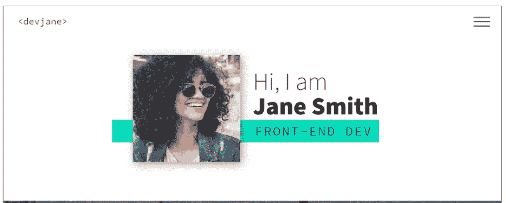

### 第 9 课:设计服务部分的样式

为了增加一点趣味，我来看看如何给站点的这个部分添加一个`background-image`。这是一个很好的方法来打破第二个，避免到处都是纯色背景，我也看到了如何使用`background-blend-mode`来改变图像的颜色，以帮助保持网站的外观一致。

额外的收获是，我们还将学习当鼠标悬停在按钮上或当我们在页面上切换时选择按钮时，如何设计按钮的样式。

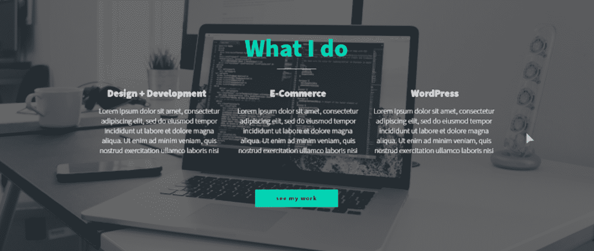

### 第十课:关于我的部分

进步很大！这是最重要的关于我的部分。这一张与简介非常相似，因为我们将使用 CSS Grid，但是将图片移至右侧，并找到一个有用的 CSS `fr`单元示例。

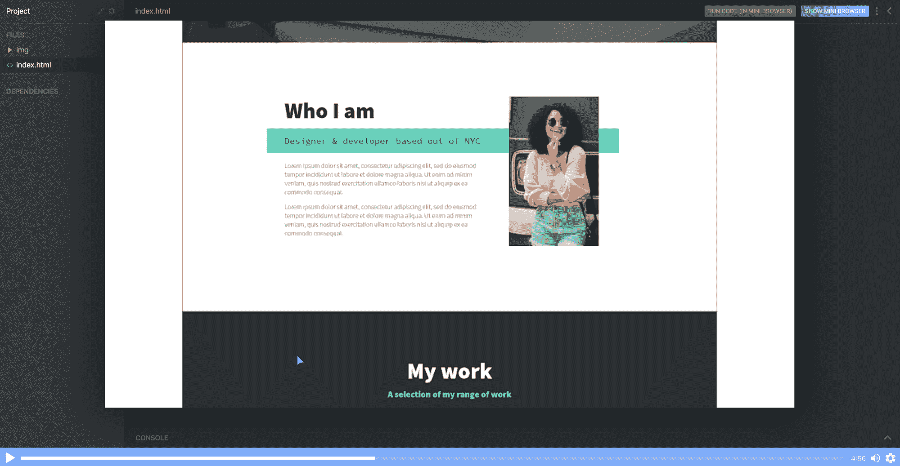

### 第十一课:作品集

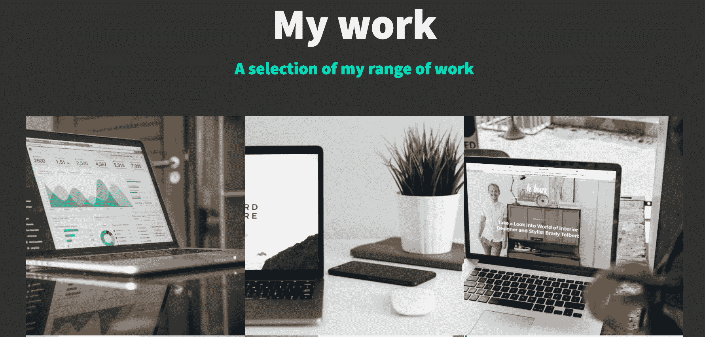

在这个截屏中，我将展示如何建立我们的作品集部分来展示我们的一些伟大作品。我们甚至还将学习如何使用`cubic-bezier()`来达到一些悬停风格的令人印象深刻的效果！

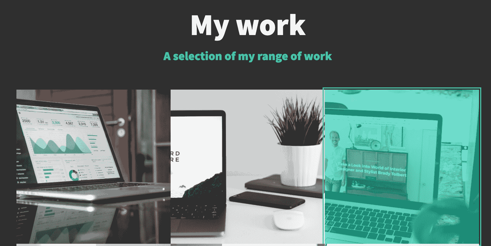

### 第 12 课:用牛逼字体添加社交图标

这将是甜蜜而短暂的，所以你可以休息一下，学习一些快速的技巧和诀窍。

用字体很棒的图标添加社交媒体链接轻而易举。我们可以用一个`<i>`标签，然后添加一个你想添加的图标的类名。

作为一个例子，一旦你在你的标记中链接了字体 Awesome，这里就告诉你如何为 GitHub 添加一个图标。

`<i class="fab fa-github"></i>`

### 第 13 课:页脚的样式

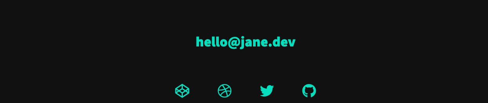

虽然图标已经就位，但我们确实需要在这里添加更多的样式，以使它们按照我们需要的方式进行设置。

稍微使用一下 flexbox，用`list-style: none`把样式从列表中去掉，就相对简单了。

### 第 14 课:设置导航样式

我们把导航留到了最后，因为它通常是需要最长时间来设置和正确完成的简单事情之一。

一旦完成，导航将离开屏幕，但当用户点击汉堡包图标时，导航将滑入屏幕。然而，第一步是把它设计成我们想要的样子，然后我们就可以担心如何让它工作了！

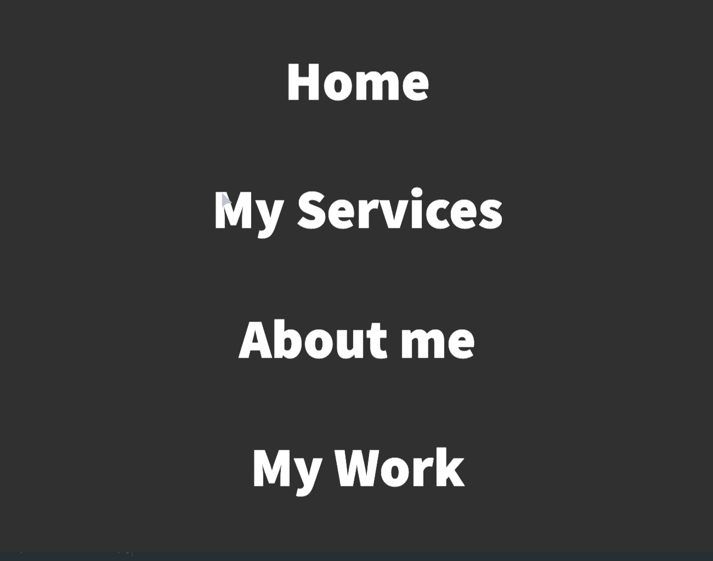

### 第 14 课:制作汉堡

在这个截屏中，您将学习如何添加一个汉堡菜单以转换到导航视图。它不是图标，也不是 svg，而是纯 CSS。

我们将有机会练习`::before`和`::after`伪选择器、转换，因为它不是链接而是`button`，我们还需要定义当我们悬停在汉堡图标上时的不同光标，以指示它可以用`cursor: pointer`点击。

### 第 15 课:添加 JS

用一点 JavaScript，我将带你实现一个非常好的、平滑的从我们的主屏幕到点击汉堡菜单的导航窗口的转换。

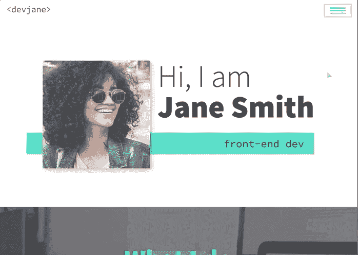

我还看了看我们如何通过使用`scroll-behavior: smooth`在 CSS 中添加平滑滚动。是的，就是这么简单！这也是我今天学到的一条很棒的推文。请随意将您的 til 发送到@scrimba，我相信他们会非常乐意转发它们！

### 第 16 课:创建投资组合项目页面

主页结束后，是时候制作一个模板作品集页面了，它可以为你放入作品集的每个项目提供更多的细节。

我们还将学习如何将它与我们的主页无缝链接，以获得良好的用户体验。

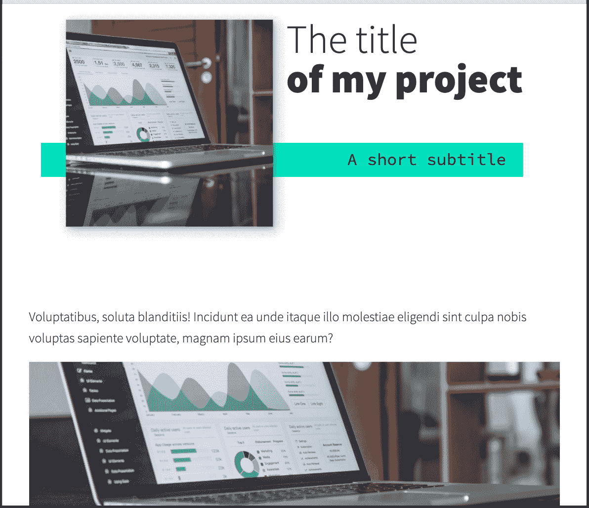

### 第 17 课:自定义您的页面

这就是 CSS 自定义属性的魔力所在！

在这个视频中，我将介绍如何定制自定义属性，在几秒钟内改变您网站的配色方案，以及如何快速轻松地更新字体，使网站成为您自己的网站！

### 第十八课:数字海洋水滴-它们是什么以及如何设置

在这个截屏中，我们将探索数字海洋的水滴。它们是基于 Linux 的虚拟机，每个 droplet 都是您可以使用的新服务器。

这看起来令人望而生畏，但它们非常容易设置，非常可定制，并带有许多有用的功能，如自动防火墙。

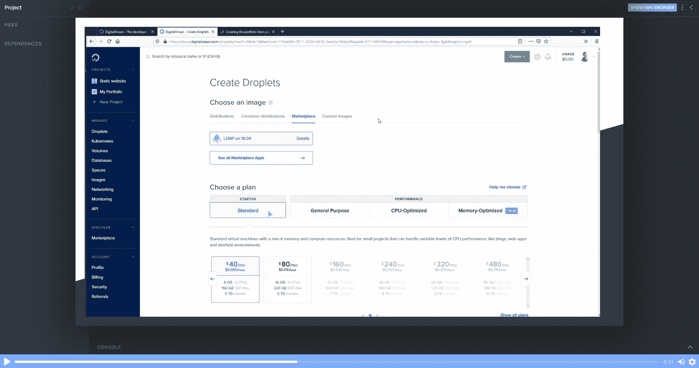

我会告诉你每一个步骤，让你知道如何设置一个水滴。

### 第 19 课:数字海洋水滴-通过 FTP 上传文件

为了完成整个过程，让我向你展示我们如何将我们的作品集上传到我们在前一章创建的 droplet 中，现在它已经在线供其他人查看了！

### 第二十课:总结

就是这样！你的下一步可以是让这个页面全是关于你的，添加所有相关的例子，告诉我们关于你的事情，让它活在数字海洋的一滴中。

一旦你把你的放在一起放到网上，请与我和 Scrimba 的团队分享你的作品！你可以在推特上通过 [@KevinJPowell](https://twitter.com/kevinjpowell) 和 [@scrimba](https://twitter.com/scrimba) 找到我们，我们会很乐意分享你的近况！

### 查看完整的课程

记住，这门课是完全免费的。[现在就去 Scrimba】吧，你可以跟着它一起建一个看起来很棒的网站！](https://scrimba.com/g/gportfolio)