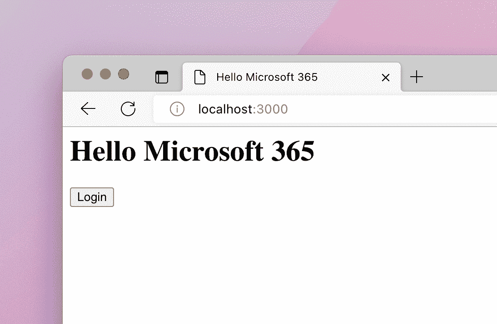
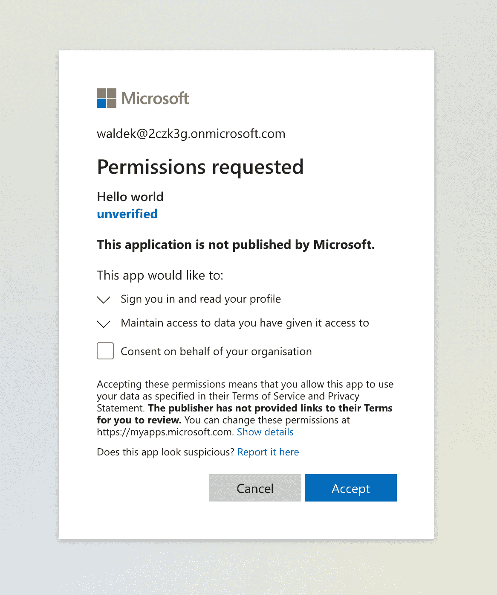

# 如何在 10 分钟内构建您的第一个 Microsoft 365 应用程序

> 原文：<https://www.freecodecamp.org/news/build-microsoft-365-application-in-10-minutes/>

如果你是一名 web 开发人员，并且在一个使用 Microsoft 365 的组织中工作，或者你开发了向客户销售的应用程序，我有一个好消息要告诉你:你可以使用现有的技能来开发与 Microsoft 365 集成的应用程序。

## 微软 365 是什么？

微软 365 是一套应用程序，如微软团队、Outlook、Word 或 SharePoint，供组织用于工作。每天，数百万人使用微软 365 聊天、开会、发送电子邮件、创建文档等等。

但是微软 365 不仅仅是一套应用程序。它也是一个平台，让像您这样的开发人员能够构建应用程序。这些应用程序可以利用存储在微软 365 上的数据和见解，并将它们带入人们的工作流程。

## 你可以在 10 分钟内开发出你的第一个微软 365 应用

以下是一个简短的教程，将向您展示如何建立一个简单的单页应用程序，与微软 365 集成。该应用程序将允许用户使用他们的 Microsoft 365 帐户登录，并查看他们的个人资料信息。


Microsoft 365 application

这看起来并不多，但在构建这个简单的应用程序时，您将学习构建 Microsoft 365 应用程序的基础知识。

### 你需要什么

*   [Node.js LTS](https://nodejs.org) (写这篇文章的时候，是 16.17.1)
*   一个微软 365 开发者租户。你可以从[微软 365 开发者计划](https://developer.microsoft.com/microsoft-365/dev-program)免费获得一个，它将让你访问构建应用所需的所有微软 365 APIs，以及一些开始使用的演示数据
*   你的 10 分钟时间

准备好了吗？我们走吧！

## 在微软云上注册您的应用程序

为您的应用程序创建一个文件夹，用于存储所有应用程序文件。打开终端，将工作目录切换到该文件夹。

在终端中，运行以下命令:

```
npx -p @pnp/cli-microsoft365 -- m365 login --authType browser
```

在您的 web 浏览器中，使用您新创建的 Microsoft 365 开发人员帐户登录:


Sign into your Microsoft 365 developer account

接下来，回到终端，运行以下命令:

```
appId=$(npx -p @pnp/cli-microsoft365 -- m365 aad app add --name "Hello world" --multitenant --redirectUris "http://localhost,http://localhost/index.html" --platform spa --query "appId" -o text)
```

通过这两个命令，您已经使用了 Microsoft 365 的[CLI](https://aka.ms/cli-m365)登录到 Microsoft 365，并在 Microsoft Cloud 上注册了您的新应用程序。

每个与 Microsoft 365 集成的应用程序都必须注册，并提供应用程序的名称和类型(平台)等信息。对于单页应用程序，您还需要指定应用程序的 URL，用于确保用户登录到正确的应用程序。

接下来，将新创建的应用程序的 ID 写入您将在应用程序中引用的文件。在终端中，运行:

```
echo "const appId = '$appId';" > env.js
```

## 创建您的应用

在代码编辑器中打开应用程序文件夹。创建一个名为`index.html`的新文件，并粘贴以下代码:

```
<html>
<head>
  // TODO #1: add libraries
</head>
<body>
  <h1>Hello Microsoft 365</h1>
  <div id="auth"></div>
  <pre></pre>
  <script>
    // TODO #2: add app code
  </script>
</body>
</html>
```

这段代码是一个简单的 HTML 页面，有两个占位符:一个用于构建应用程序的库，另一个用于应用程序的代码。它还包含一个用于显示登录/注销按钮的`div`和一个用于显示用户资料信息的`pre`元素。

## 添加库

用以下代码替换`TODO #1`注释:

```
 <script src="https://alcdn.msauth.net/browser/2.28.3/js/msal-browser.min.js"></script>
  <script src="https://cdn.jsdelivr.net/npm/@microsoft/microsoft-graph-client/lib/graph-js-sdk.js"></script>
  <script src="https://cdn.jsdelivr.net/npm/@microsoft/microsoft-graph-client/lib/graph-client-msalBrowserAuthProvider.js"></script>
  <script src="./env.js"></script>
```

要构建此应用程序，您将使用几个库:

*   [MSAL.js](https://learn.microsoft.com/azure/active-directory/develop/msal-overview?WT.mc_id=m365-78653-wmastyka) 帮助您处理使用 Microsoft 365 帐户登录的用户
*   [Microsoft Graph JavaScript SDK](https://learn.microsoft.com/graph/sdks/sdk-installation#install-the-microsoft-graph-javascript-sdk)简化了调用 Microsoft Graph——访问 Microsoft 365 数据和见解的 API
*   将 MSAL.js 与 Microsoft Graph JS SDK 集成在一起的 MSAL 浏览器授权提供商
*   之前创建的带有您的应用 ID 的`env.js`文件

使用这些库将帮助您更快地构建应用程序，并且您不必担心如何让用户登录、获取访问令牌或正确处理 API 错误的细节。

## 使用用户的 Microsoft 365 帐户登录用户

用以下代码替换`TODO #2`注释:

```
 (() => {
      // TODO #3: create MSAL client

      // TODO #5: handle login/logout

      // TODO #6: create Microsoft Graph client

      // TODO #7: get Microsoft 365 user profile

      function render() {
        // TODO #4: render UI
      }

      render();
    })();
```

这段代码是一个立即调用的函数表达式(IIFE ),它封装了应用程序的代码，并在应用程序加载时运行。它还包含几个占位符，用于您将在接下来的步骤中编写的代码。

用以下代码替换`TODO #3`注释:

```
 const msalConfig = {
        auth: {
          clientId: appId
        }
      };
      const msalClient = new msal.PublicClientApplication(msalConfig);
```

在这个片段中，您将为 MSAL.js 库创建一个新的配置对象，其中包含对您之前创建的应用程序 ID 的引用。

接下来，您将该对象传递给`PublicClientApplication`构造函数，以创建 MSAL 客户端的新实例，您将使用该实例让用户使用他们的 Microsoft 365 帐户登录您的应用程序。

现在，应用程序显示一个空白页面。让我们通过用下面的代码替换`TODO #4`注释来改变这一点:

```
 msalClient
          .handleRedirectPromise()
          .then(response => {
            const accounts = msalClient.getAllAccounts();

            if (accounts.length === 0) {
              document.querySelector('#auth').innerHTML = '<button>Login</button>';
              document.querySelector('#auth button').addEventListener('click', login);
              document.querySelector('pre').innerHTML = '';
            }
            else {
              document.querySelector('#auth').innerHTML = '<button>Logout</button>';
              document.querySelector('#auth button').addEventListener('click', logout);
              // TODO #8: show user profile
            }
          });
```

当用户使用其 Microsoft 365 帐户登录时，您会将他们重定向到 Microsoft 365 登录页面。他们登录后，会被重定向回你的应用。

`handleRedirectPromise`函数将处理微软 365 发送给你的应用程序的信息。当用户来到你的应用程序前还没有登录时，`handleRedirectPromise`功能将通过一个`null`响应来解决。

处理重定向后，您使用 MSAL 检查是否有任何用户登录到您的应用程序。如果没有(`accounts.length === 0`)，则显示登录按钮。如果有用户登录，您将显示注销按钮。稍后，您将添加代码来显示用户的个人资料信息。

登录和注销按钮都缺少它们的点击处理程序，所以让我们通过用下面的代码替换`TODO #5`来添加它们:

```
 function login(e) {
        e.preventDefault();
        msalClient.loginRedirect();
      }

      function logout(e) {
        e.preventDefault();
        msalClient.logoutRedirect();
      }
```

在这两种情况下，您都使用 MSAL 通过将用户重定向到 Microsoft 365 登录/注销页面来登录和注销用户。

在此阶段，您的应用程序应该允许您使用 Microsoft 365 帐户登录和注销。要验证一切正常，请保存您的更改，并在终端中运行:

```
npx lite-server
```

在您的网络浏览器中，导航至`http://localhost:3000`并登录您的应用。您应该会看到以下屏幕:



After signing into your app

当您单击“登录”按钮时，会要求您使用 Microsoft 365 帐户登录。然后，当你点击注销按钮时，你将从微软 365 和应用程序中注销。

构建应用程序的第一部分到此结束，您可以开始使用 Microsoft Graph 从 Microsoft 365 检索数据了。

## 显示 Microsoft 365 用户配置文件

既然您的应用程序支持使用 Microsoft 365 帐户登录和注销，下一步就是添加代码以从 Microsoft 365 检索用户的个人资料信息。

用以下代码替换`TODO #6`注释:

```
 function getGraphClient(account) {
        const authProvider = new MSGraphAuthCodeMSALBrowserAuthProvider.AuthCodeMSALBrowserAuthenticationProvider(msalClient, {
          account,
          scopes: ['user.read'],
          interactionType: msal.InteractionType.Redirect,
        });

        return MicrosoftGraph.Client.initWithMiddleware({ authProvider });
      }
```

此函数将用于登录应用程序的 Microsoft 365 帐户作为参数，并使用它来创建 Microsoft Graph 客户端，您将使用该客户端来调用 Microsoft Graph APIs 并从 Microsoft 365 获取数据。

接下来，让我们用下面的代码替换`TODO #7`注释:

```
 function loadUserProfile(graphClient) {
        graphClient
          .api('/me')
          .get()
          .then(res => {
            document.querySelector('pre').innerHTML = JSON.stringify(res, null, 2);
          });
      }
```

此函数将 Microsoft Graph JavaScript SDK 返回的 Microsoft Graph 客户端实例作为参数，并使用它来调用 Microsoft Graph API。

在这种情况下，您调用的是`/me` Microsoft Graph API，它返回当前登录用户的配置文件信息。然后，检索到的数据显示在页面上的`pre`元素中。

最后一部分是在用户登录应用程序后，将所有功能结合在一起并调用这两个功能。用以下代码替换`TODO #8`注释:

```
 const graphClient = getGraphClient(accounts[0]);
              loadUserProfile(graphClient);
```

就是这样！当您保存更改并返回浏览器时，您会看到它在后台自动刷新，并提示您授予应用程序访问您的个人资料信息的权限。



Setting permissions on the app

授予访问权限后，单击**接受**按钮，您将看到页面上的`pre`元素中显示的个人资料信息。


Profile information

恭喜你！您刚刚构建了第一个连接到 Microsoft 365 的应用程序。

## 这仅仅是开始

您刚刚在 Microsoft 365 上构建了您的第一个应用程序:一个连接到 Microsoft 365 的单页应用程序，显示当前用户的 Microsoft 365 个人资料。这个应用程序是一个简单的例子，向您展示如何开始在 Microsoft 365 上构建应用程序。

你的应用程序可以访问微软 365 中存储的更多[数据和见解，并且你可以构建](https://learn.microsoft.com/graph/api/overview)[许多类型的应用程序](https://learn.microsoft.com/graph/overview)。最棒的是，你可以用你在过去 10 分钟里学到的同样的技术来建造它们。

您刚刚使用 JavaScript 构建了一个 Microsoft 365 应用，但是您可以使用任何编程语言在 Microsoft 365 上构建应用。所有微软 365 应用程序的一个共同点是，它们从微软 365 引入数据和见解，帮助人们一起工作。

好奇想了解更多？看看其他[开发者](https://adoption.microsoft.com/sample-solution-gallery/)和[微软合作伙伴](https://adoption.microsoft.com/partner-solution-gallery/)在微软 365 上构建了什么。如果你想进一步学习，请查看[微软图形基础](https://learn.microsoft.com/training/paths/m365-msgraph-fundamentals/)学习路径。如果您有任何问题，请随时联系我们。