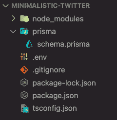
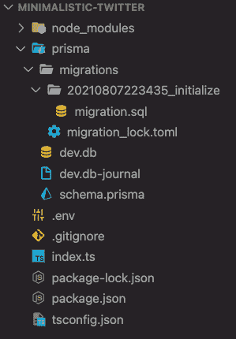
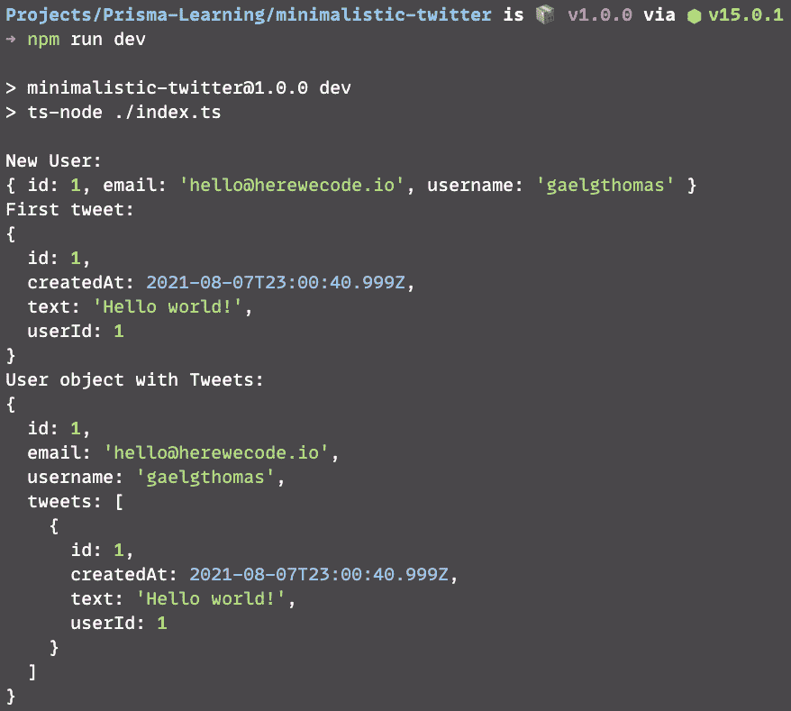

# 如何使用 Prisma 和 SQLite 构建 Node.js 数据库

> 原文：<https://www.freecodecamp.org/news/build-nodejs-database-using-prisma-orm/>

最近我看到了许多关于 Prisma 的推文和文章。这是一个现代的 [ORM](https://blog.bitsrc.io/what-is-an-orm-and-why-you-should-use-it-b2b6f75f5e2a) (对象关系映射工具)，与 node . js 和 TypeScript 一起工作。

是的，这个库将帮助您构建和管理 Node.js 数据库——并且它与 TypeScript 兼容！它将自动生成所有类型的实体。

模式定义很容易被人阅读——不再令人头痛。在接下来的部分中，您将看到它是如何工作的。

此外，ORM 可以很好地与 Next.js、GraphQL 和 Nest 配合使用。Js、Express.js、阿波罗和哈比神。

总而言之，Prisma 是一个现代的 ORM，可以很好地与所有的趋势技术相结合。

这就是为什么我决定尝试它并替换我以前的数据库管理库: [TypeORM](https://typeorm.io/) 。

> “Prisma 通过 PostgreSQL、MySQL 和 SQLite 的开源 ORM 帮助应用程序开发人员更快地构建应用程序并减少错误。”–[Prisma 主页](https://www.prisma.io/)

## 让我们使用 Node、Prisma 和 SQLite 构建一个简单的 Twitter 数据库

该练习了。我将向您展示如何使用 Prisma 构建您的第一个 Node.js 数据库。为了使这个介绍易于理解，我们将使用 Node 和 SQLite。

SQLite 是一个自包含的数据库引擎。这意味着您不需要在计算机上配置数据库。如果您遵循本教程的步骤，该项目将自动运行。

如果将来您想在 PostgreSQL 数据库中使用 Prisma，这里有一个关于使用 Docker-Compose 创建 PostgreSQL 数据库的[教程。](https://herewecode.io/blog/create-a-postgresql-database-using-docker-compose/)

### 先决条件

*   **Node.js (12.2 或更高版本)**

在开始之前，请花时间仔细检查您是否有 12.2 或更高版本的 [Node.js](https://nodejs.org/en/) 。如果没有，只需在开始下一节之前更新您的节点。

> **注意:**如果你想检查你的 Node.js 版本，可以在一个终端中键入:`node -v`。输出将是版本。

*   **SQL 基础知识**

尽管我对这个新库采用了简单的方法，但我建议您具备基本的 SQL 知识，以便完全理解本教程。

> **注意:**你不需要成为专家！这里只有像创建一个表和发出一些请求这样的基本操作是必不可少的。

## 如何建立一个基本的 Twitter 项目

首先，您需要为此项目创建一个新文件夹，并将其移入:

```
$ mkdir minimalistic-twitter
$ cd minimalistic-twitter
```

然后，我们将安装所有的强制依赖项，如 TypeScript 和 Prisma。

```
$ npm init -y
$ npm install prisma typescript ts-node @types/node --save-dev
$ npm install @prisma/client
```

从现在开始，您应该会在存储库中看到一个`node_modules`文件夹和一个`package.json`文件。

在继续进行 Prisma 初始化之前，最后一个配置步骤是在存储库根为 TypeScript 创建一个配置。

为此，您可以创建一个`tsconfig.json`并粘贴以下配置:

```
{
  "compilerOptions": {
    "sourceMap": true,
    "outDir": "dist",
    "strict": true,
    "lib": ["esnext"],
    "esModuleInterop": true
  }
}
```

TypeScript default configuration (tsconfig.json)

我们走吧！是时候在我们的项目中使用 Prisma 了。在`minimalistic-twitter`文件夹中，您可以使用以下命令来提示 Prisma 帮助输出。

```
$ npx prisma
```

现在，构建我们的极简 Twitter 应用程序之前的最后一步是初始化数据库配置。

我们将使用`init`命令和一个`--datasource-provider`参数来设置数据库类型。否则，默认情况下，`init`会创建一个 PostgreSQL 数据库。

```
$ npx prisma init --datasource-provider sqlite
```

当命令执行完毕时，您应该在您的存储库中找到一个`.env`文件和一个`prisma`文件夹，其中包含一个`schema.prisma`文件。

`schema.prisma`文件包含连接到数据库的所有指令。稍后，它还将包含生成数据库表的说明。

`.env`文件包含您的项目需要运行的所有环境变量。对于 Prisma 来说，唯一的变量就是`DATABASE_URL`。它的值被设置为`./dev.db`。

`dev.db`文件将是独立的数据库文件。



Project tree after the project initialization

如果你有相同的输出，恭喜你，这意味着你的项目已经准备好了！🎉

## 如何建立我们的第一个模型——用户

我们的基本 Twitter 数据库将由两个主要实体组成:

*   具有用户信息及其推文的用户实体
*   包含 tweet 内容及其作者的 tweet 实体

首先，我们将关注用户实体的创建。他们每个人都有:

*   身份证
*   唯一的电子邮件(两个用户不能有相同的电子邮件)
*   用户名
*   推文列表

使用 Prisma，如果我们想要定义一个新的模式(模型)，我们需要在`schema.prisma`文件中完成。

为了定义一个实体，我们将使用如下的`model`指令。您可以在您的`schema.prisma`文件中的数据库连接指令之后再现它。

```
// After the database connection

model User {
  // We set an `id` variable
  // With an `Int` type (number)
  // Then, we set the Prisma decorators:
  // - @id (because it's an ID)
  // - @default(autoincrement()) (default value is auto-incremented)
  id Int @id @default(autoincrement())

  // We set an `email` variable
  // With a `String` type
  // Then, we set the Prisma decorator:
  // - @unique (because we want the user to be unique
  // based on the email - two users can't have the same)
  email String @unique

  // We set a `username` variable
  // With a `String` type
  username String

  // We set a `tweets` variable
  // With a `Tweet[]` type (one-to-many relationship)
  // Because each user can have between
  // 0 and an infinite number of tweets
  tweets Tweet[]
}
```

User model with Prisma ORM

你可能注意到了，我们还没有`Tweet`模型。这将是我们的下一步。

## 如何建立我们的第二个模型——推特

现在我们有了用户，我们需要推特。让我们遵循与之前相同的过程，但是这次是针对`Tweet`实体。

他们每个人都有:

*   身份证
*   创建日期
*   一条短信
*   一个用户 Id(推文的作者)

下面，你会发现实体。您可以在您的`schema.prisma`文件中的`User`模型声明之后复制它。

```
// After the database connection

// After the User model

model Tweet {
  // We set an `id` variable
  // With an `Int` type (number)
  // Then, we set the Prisma decorators:
  // - @id (because it's an ID)
  // - @default(autoincrement()) (default value is auto-incremented)
  id Int @id @default(autoincrement())

  // Save the tweet creation time
  createdAt DateTime @default(now())

  // We set a `text` variable
  // With a `String` type
  text String

  // We set a `userId` variable
  // With an `Int` type (number)
  // It will link the `id` of the `User` model
  userId Int

  // We set a `user` variable
  // With a `User` type (many-to-one relationship)
  // Because each tweet has an author
  // This author is a `User`
  // We link the `User` to a `Tweet` based on:
  // - the `userId` in the `Tweet` model
  // - the `id` in the `User` model
  user User @relation(fields: [userId], references: [id])
} 
```

Tweet model with Prisma ORM

## 如何生成我们的第一个数据库迁移

在使用我们的数据库之前，我们需要做的第一件事是生成它。为此，我们将使用 Prisma CLI 的另一个命令。该命令将允许我们创建迁移。

如果我们看一下关于`migrate`命令的文档，我们会看到以下内容:

> “Prisma Migrate 是一个强制性的数据库模式迁移工具，它使您能够:**随着 Prisma 模式的发展，使您的数据库模式与您的 Prisma 模式保持同步*并且维护您的数据库中的现有数据***。”–[Prisma 迁移文档](https://www.prisma.io/docs/concepts/components/prisma-schema/)

这里的想法是保存我们的第一个数据库实现。您可以通过在终端中键入以下命令来完成此操作:

```
npx prisma migrate dev --name initialize
```

**注意:**您可以在`--name`参数后输入您选择的名称。请记住，迁移名称有助于记住您所做的更改。

如果你的迁移命令成功，就意味着`schema.prisma`中的所有指令都是正确的。✅

您的项目树现在应该类似于下图(除了迁移散列)。



Project tree after the migration generation

**注意:**在`migration.sql`文件中，你会找到生成你的数据库的 SQL 查询。

你的数据库准备好了！🚀是时候试试了，加一些用户，让他们发微博。

## 如何测试我们的 Node JS SQLite 项目

那么，用户现在可以发微博了吗？让我们试着在我们的数据库上运行一些查询。我们将在存储库根目录下创建一个`index.ts`文件，并将一些指令写入其中。

首先，我们需要导入并初始化数据库连接。基于 [Prisma Quickstart 文档](https://www.prisma.io/docs/getting-started/quickstart/)，我们创建一个`prisma`变量来与数据库交互，并创建一个函数来编写我们的测试代码:

```
import { PrismaClient } from "@prisma/client";

const prisma = new PrismaClient();

async function main() {}

main()
  .catch((e) => {
    throw e;
  })
  .finally(async () => {
    await prisma.$disconnect();
  }); 
```

我们准备用一些指令填充`main`函数。

```
import { PrismaClient } from "@prisma/client";

const prisma = new PrismaClient();

async function main() {
  // We create a new user
  const newUser = await prisma.user.create({
    data: {
      email: "hello@herewecode.io",
      username: "gaelgthomas", // <- it's also my Twitter username 😄
    },
  });

  console.log("New User:");
  console.log(newUser);

  // We create a new tweet and we link it to our new user
  const firstTweet = await prisma.tweet.create({
    data: {
      text: "Hello world!",
      userId: newUser.id,
    },
  });

  console.log("First tweet:");
  console.log(firstTweet);

  // We fetch the new user again (by its unique email address)
  // and we ask to fetch its tweets at the same time
  const newUserWithTweets = await prisma.user.findUnique({
    where: {
      email: "hello@herewecode.io",
    },
    include: { tweets: true },
  });

  console.log("User object with Tweets:");
  console.dir(newUserWithTweets);
}

main()
  .catch((e) => {
    throw e;
  })
  .finally(async () => {
    await prisma.$disconnect();
  }); 
```

**注意:**如果你想发现你可以使用的不同指令，一个好的 Prisma 文档页面是[CRUD one](https://www.prisma.io/docs/concepts/components/prisma-client/crud)。

运行`index.ts`文件的时间到了。

在这样做之前，打开您的`package.json`文件并搜索`scripts`部分。您将需要添加一个命令来使用`ts-node`启动项目。

如果您愿意，可以用下面的代码替换您的`scripts`部分:

```
"scripts": {
  "dev": "ts-node ./index.ts",
  "test": "echo \"Error: no test specified\" && exit 1"
},
```

然后，在您的终端中，您可以键入下面的命令并阅读输出，以查看是否一切正常:

```
$ npm run dev
```

**注意**:在上面的命令中，我们从 package.json 运行开发脚本。



NPM test output using Prisma

起作用了！你有了第一个用户和推文。👏现在您已经使用 Prisma 建立了第一个数据库，您可以向它添加一些特性。以下是一些想法:

*   在用户实体中添加更多信息(生日、地址、传记等)
*   添加一个赞系统(每条推文可以有赞，每个用户可以有一个赞推文列表)

### **代码可在 Github–Node JS 上用 Prisma 和 SQLite 获得**

如果你想得到完整的代码，可以在我的 GitHub 上找到。

****->****[GitHub:Prisma SQLite 示例](https://github.com/gaelgthomas/prisma-sqlite-example)

**感谢阅读到最后！**

我希望你在下一个项目中使用 Prisma。🎉

我开始更持续地发微博了。如果你想获得更多关于 web 编程的技巧和资源-> [在我的 Twitter 上找到我🐦](https://twitter.com/gaelgthomas)