# 如何在 5 分钟内构建一个带身份验证的 RESTful API 全部从命令行完成(第 1 部分)

> 原文：<https://www.freecodecamp.org/news/build-restful-api-with-authentication-under-5-minutes-using-loopback-by-expressjs-no-programming-31231b8472ca/>

作者:尼哈里卡·辛格

# 如何在 5 分钟内构建一个带身份验证的 RESTful API 全部从命令行完成(第 1 部分)

如果这篇文章的标题让你兴奋，那么我的朋友，你将最终达到 100 的满意度。我将快速浏览一下这篇文章:

1.  **我们将要创建的:** RESTful API，它处理餐馆菜单上的食物日志。后端使用的数据库将是 MongoDB。(你可以使用这个星球上任何一个该死的数据库。下面有一个由[回送](https://loopback.io/)支持的数据库连接器/非数据库连接器的详尽列表。)
2.  **什么是 LoopBack:** 用极其简单的话来说，就是高度可扩展、开源的 Node.js 框架，用来非常快速地创建动态的、端到端的 REST APIs。通过 LoopBack 生成的 API 是 Swagger APIs(世界上最流行的 API 框架，您很快就会明白为什么)。前端可以在你喜欢的任何框架中实现；有棱角或者有反应。
3.  **通过 CLI 创建应用程序:**这是 WOW 的一部分，它删除了所有相关的编程。LoopBack CLI 非常漂亮，所有开发工作的时间都缩短到了几秒钟。在这里，我们将使用 CLI 设置我们的数据库。
4.  **通过 CLI 创建数据模型:**同样，无需编程。所有这一切都通过美丽的 CLI。
5.  **通过 CLI 设置身份验证:**如果您有创建 API 的经验，您就会知道使用身份验证来限制部分 API 有多困难。在服务器端使用 Express+Node.js 设置基于令牌的认证是一件痛苦的事情。品尝回环的仙丹，所有的痛苦都会消失！它是天堂自己的饮料。


#### 分步指南:

**先决条件:**确保你已经安装了 [Node.js](https://nodejs.org/en/) 、 [Robomongo](https://robomongo.org/) 并且 MongoDB 服务器正在运行。

#### **步骤 1:通过 NPM 安装环回 CLI**

打开终端并编写以下命令来安装 LoopBack CLI，以便可以访问“lb”命令。只有通过“lb”命令，我们才能生成应用程序、模型、数据源等。进一步阅读:[https://loopback . io/doc/en/lb2/Command-line-tools . html # using-yeoman](https://loopback.io/doc/en/lb2/Command-line-tools.html#using-yeoman)

```
$ npm install -g loopback-cli
```

请确保您安装这个全局，否则' lb '命令可能无法为您工作。

#### **步骤 2:创建应用程序**

创建一个您希望存储项目的目录。我将把它命名为“餐馆菜单”。确定您已经在终端中打开了此目录，以便通过 LoopBack 生成的所有文件都储存在该文件夹中。

然后输入以下命令:

```
$ lb
```

会问很多问题，就像下图中显示的那样。

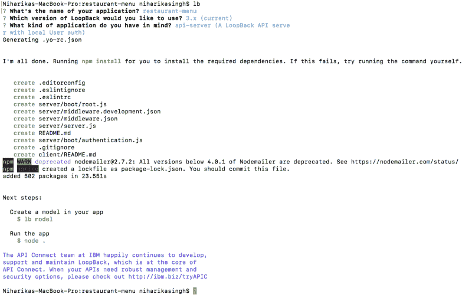

This is what it should look like.

(要在选项之间导航，请使用键盘上的箭头键)

### **API 创建完成！**


我没开玩笑。不相信我？使用以下命令运行应用程序:

```
$ node .
```

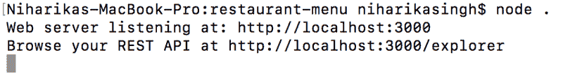

如果您指向 localhost:3000，您会看到类似这样的内容:

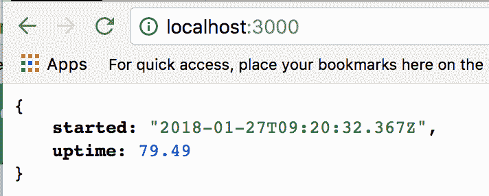

This will only tell you when the API was started and since how many seconds it has been up.

但是，如果你去 localhost:3000/explorer，你会看到华丽的 SwaggerAPI。

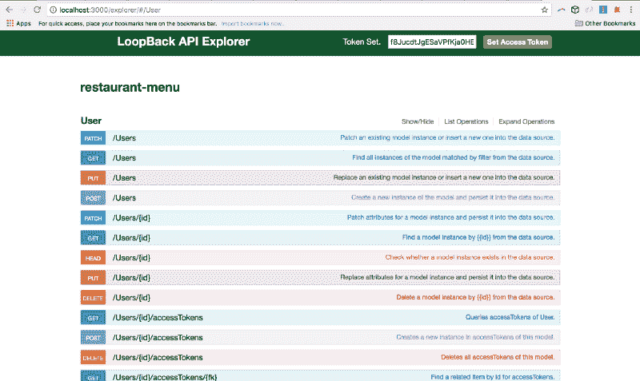

LoopBack 已经为您设置了所有路由:

获取用户、发布用户、放置用户、删除用户、登录、注销、更改密码。几乎一切！否则要花几个小时才能把它编码出来。

在任何文本编辑器中打开此文件夹。我会用 Atom。

#### **步骤 3:连接 MongoDB**

如果您在服务器文件夹中打开`**datasources.json**`,您应该会看到类似这样的内容:

```
{  "db": {    "name": "db",    "connector": "memory"  }}
```

这意味着目前使用的数据源是我们计算机的内存。我们得把这个改成 Mongo。所以让我们安装 mongo 连接器:

```
$ npm install --save loopback-connector-mongodb
```

此外，我希望 mongod 正在运行。这就是你如何知道它正在运行:

```
2018-01-27T15:01:13.278+0530 I NETWORK  [thread1] waiting for connections on port 27017
```

现在，让我们连接连接器！

```
$ lb datasource mongoDS --connector mongoDB
```

这将提出如下许多问题:

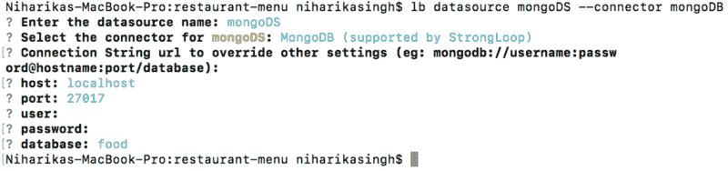

现在修改`**datasources.json**`，因为我们不希望使用内存。我们希望使用 Mongo。

```
{  "db": {    "host": "localhost",    "port": 27017,    "url": "",    "database": "food",    "password": "",    "name": "mongoDS",    "user": "",    "connector": "mongodb"  }}
```

因此，我们的数据库命名为:`**food**`创建。

#### **第四步:创建数据模型**

运行以下命令创建数据模型:

```
$ lb model
```

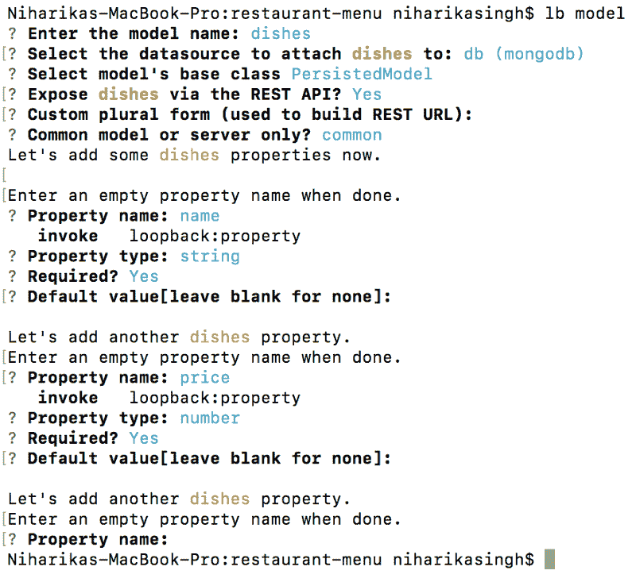

您可以向特定模型添加任意多个属性。要停止输入更多属性，只需按 Enter 键退出 CLI。

在 Common/Models 文件夹中检查`**dishes.json**`。

```
{  "name": "dishes",  "base": "PersistedModel",  "idInjection": true,  "options": {    "validateUpsert": true  },  "properties": {    "name": {      "type": "string",      "required": true    },    "price": {      "type": "number",      "required": true    }  },  "validations": [],  "relations": {},  "acls": [],  "methods": {}}
```

您也可以编辑这个 json 文件的属性。没有必要使用 CLI。

现在让我们使用下面的命令重新运行服务器，并转到 localhost:3000/explorer

```
$ node .
```

现在你会看到两个模型:`**dishes**`和`**user**`

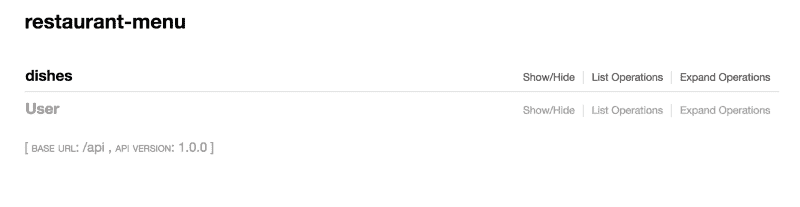

现在来贴一些`dish`。

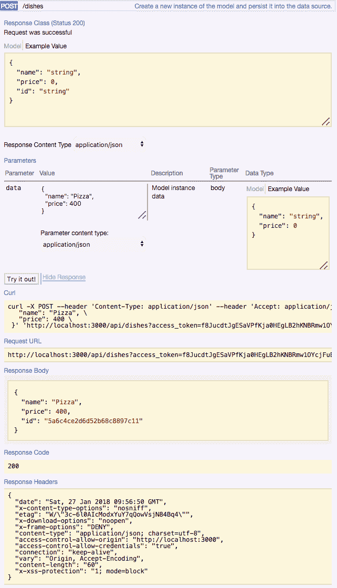

现在让我们得到同样的`dish`。


您也可以处理其他 HTTP 请求！

这些 API 也可以在资源管理器之外访问:

[http://localhost:3000/API/disks](http://localhost:3000/api/dishes)

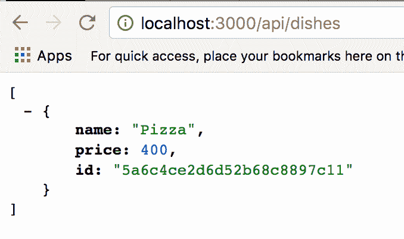

#### 第五步:认证:蛋糕上的樱桃！

要设置身份验证，请运行以下命令:

```
$ lb acl
```

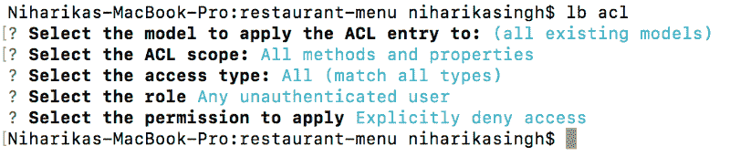

现在，让我们试着得到`**dishes**`。在此之前，请重新运行服务器。

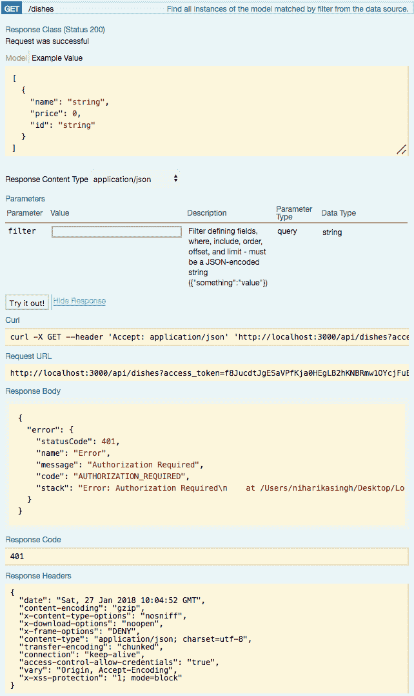

So it doesn’t GET any dishes. As expected. Because we are not logged in. It alerts us by saying Authentication required.

让我们得到认证！为此，我们需要先注册。所以我们在`**users**`发帖。

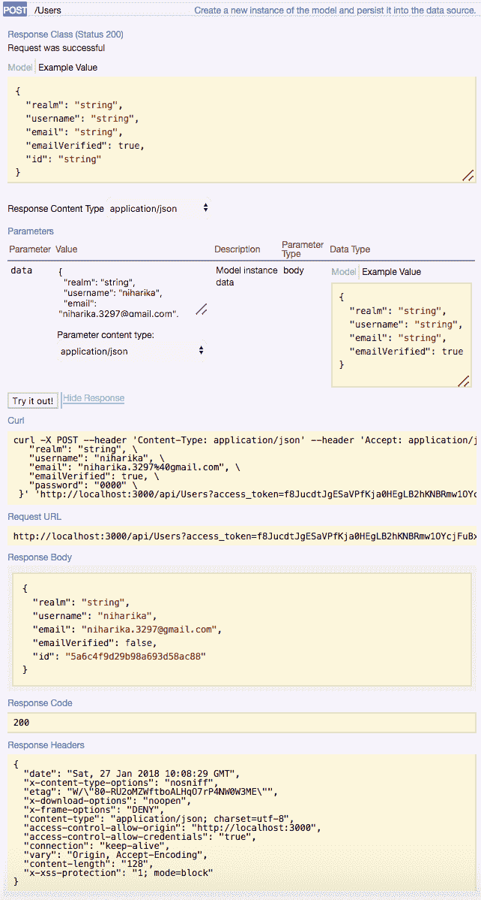

现在，让我们登录。

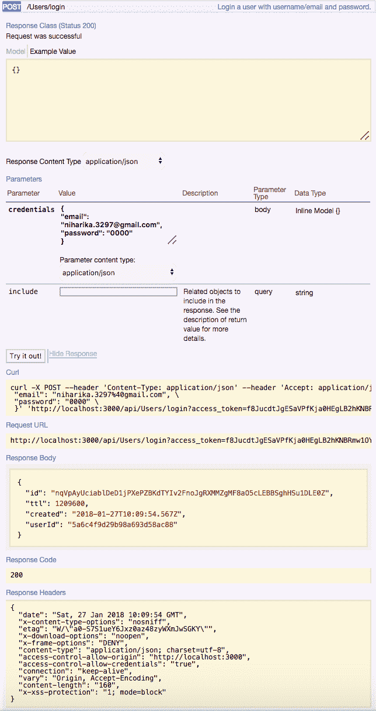

现在，复制响应正文中的 ID，并将其粘贴到页面顶部的访问令牌字段中。


现在我们通过认证了。耶。

现在，让我们再来看一下`**dishes**`。

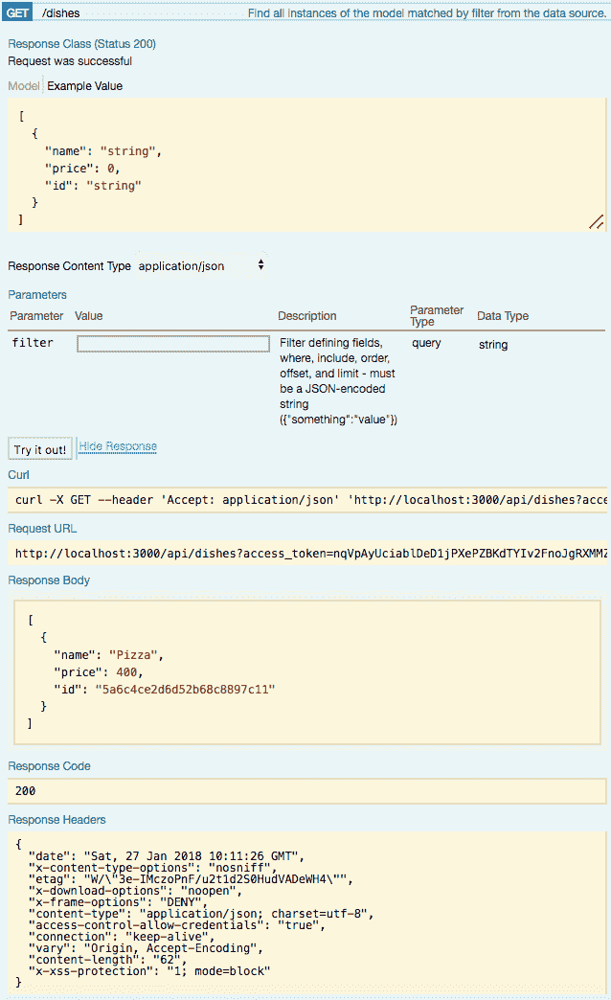

万岁！

如果您成功完成了这一步，恭喜您。真为你骄傲。

接下来的步骤是围绕这个 API 创建一个前端，这将在以后完成。


#### 这篇文章的前端教程可以在这里找到[。在那篇教程中，我使用 ReactJS 围绕这个 API 编织了一个前端。](https://medium.freecodecamp.org/how-to-build-a-restful-api-with-authentication-in-5-minutes-all-from-your-command-line-part-2-dcf29d5de0bb)

再见伙计们！
快乐编码。