# 中级类型脚本和反应手册——如何构建强类型多态组件

> 原文：<https://www.freecodecamp.org/news/build-strongly-typed-polymorphic-components-with-react-and-typescript/>

嘿大家好！😎在这篇详细的指南中，我将向您展示如何用 Typescript 构建**强类型多态 React 组件。**

如果您喜欢在一个 PDF 文档中阅读整个指南，您可以下载附带的免费 PDF 文件。

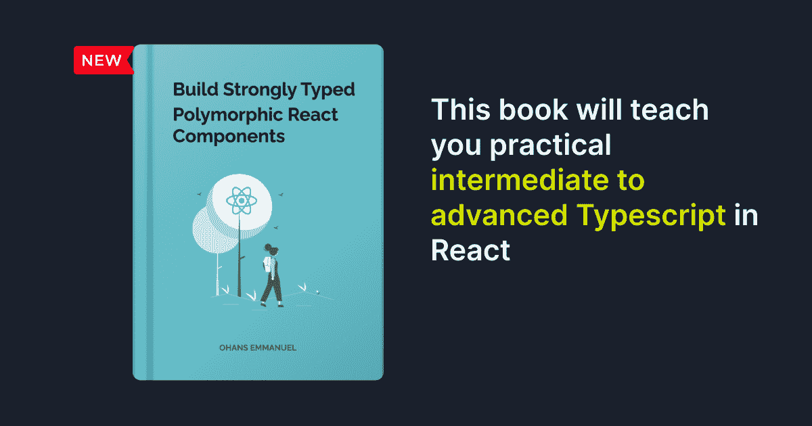

You can [download the eBook for free](https://www.ohansemmanuel.com/books/how-to-build-strongly-typed-polymorphic-react-components).

## 目录

*   [Github 库](#github-repository)
*   [这本书的理想读者](#ideal-audience-for-this-book)
*   [什么是多态组件？](#what-are-polymorphic-components)
*   [现实世界中多态组件的例子](#examples-of-polymorphic-components-in-the-real-world)
*   [Chakra UI 中的多态组件](#polymorphic-components-in-chakra-ui)
*   [材质 UI 的组件属性](#material-ui-s-component-prop)
*   [如何构建你的第一个多态组件](#how-to-build-your-first-polymorphic-component)
*   [这个简单实现的问题](#the-problems-with-this-simple-implementation)
*   [欢迎光临，打字稿](#welcome-typescript)
*   [类型脚本泛型简介](#introduction-to-typescript-generics)
*   [如何约束泛型](#how-to-constrain-generics)
*   [确保多态属性只接受有效的 HTML 字符串](#make-sure-the-as-prop-only-receives-valid-html-element-strings)
*   [如何处理有效的组件属性](#how-to-handle-valid-component-attributes)
*   [如何处理默认多态道具](#how-to-handle-default-as-attributes)
*   [组件应该可以和它的道具一起重用](#the-component-should-be-reusable-with-its-props)
*   [如何为多态类型创建可重用的实用程序](#how-to-create-a-reusable-utility-for-polymorphic-types)
*   [组件应支持引用](#the-component-should-support-refs)
*   [结论和后续步骤](#conclusion-and-next-steps)

## Github 知识库

[Github 库](https://github.com/ohansemmanuel/polymorphic-react-component)包含了本指南中的所有代码实现。

## 这本书的理想读者

如果你不知道 Typescript 的强类型多态 React 组件是什么意思，那也没关系。这是一个很好的指示，表明这正是适合你的指南。

本指南是专门为初学者和中级工程师编写的。这将帮助您以实用的方式学习更高级的 Typescript 概念。

准备好了吗？让我们开始吧。

## 什么是多态组件？

当您学习 React 时，您学习的第一个概念是如何构建可重用的组件。

这是编写一次组件，然后多次重用它们的艺术。

如果你还记得 React 101，经典可重用组件的基本构件是道具和状态——道具是外部的，状态是内部的。

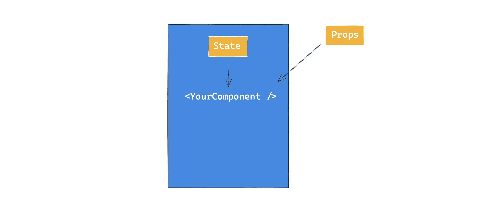

Building blocks of reusable components

可重用性的基本构件对于本文仍然有效。然而，我们将利用 props 来允许组件的用户决定最终呈现什么“元素”。

好吧，等等，别被这个弄糊涂了。

考虑以下 React 组件:

```
const MyComponent = (props) => {
  return (
    <div>
     This is an excellent component with props {JSON.stringify(props)}
   </div>
  );
};
```

通常，您的组件会收到一些道具。您将继续在内部使用这些元素，然后最终呈现一些 React 元素，这些元素将被转换为相应的 DOM 元素。在本例中，是 div 元素。

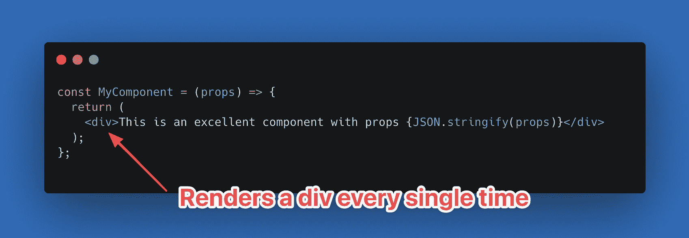

*Rendering a single element*

如果您的组件可以接受 props 来做更多的事情，而不仅仅是提供一些在您的组件中使用的数据，那会怎么样？

与其让`MyComponent`总是渲染一个`div`，不如传入一个道具来决定渲染给`DOM`的最终元素？

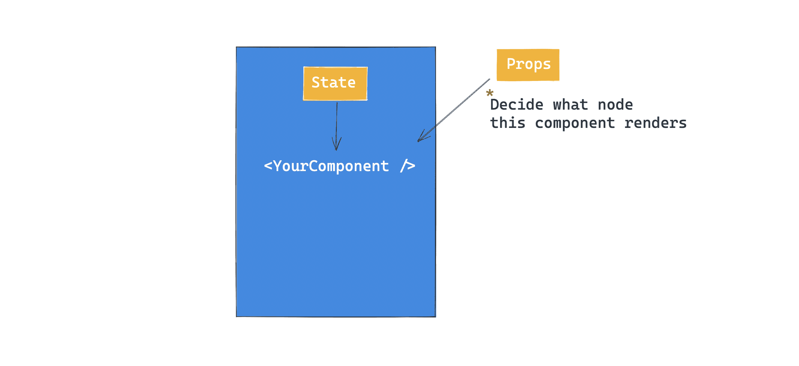

*An illustration on deciding the render UI of a component*

这就是多态组件出现的地方。

根据标准定义，单词*多态*意味着以几种形式出现。在 React 组件的世界中，多态组件是可以用不同的容器元素/节点呈现的组件。

即使这个概念对你来说可能听起来很陌生(如果你是新手的话)，你可能已经使用了多态组件。

## 现实世界中多态组件的例子

开源组件库通常实现某种多态组件。

让我们考虑一些你可能熟悉的。

我可能不会讨论你最喜欢的开源库，但是在你理解了这里的例子之后，请不要犹豫，看看你最喜欢的操作系统库。

### Chakra UI 中的多态组件


*Chakra UI*

对于相当多的生产应用程序来说，Chakra UI 已经成为我的首选组件库。

它易于使用，支持黑暗主题，并且默认可访问(哦，不要忘记微妙的组件动画！).

那么，Chakra UI 是如何实现多态道具的呢？答案是通过暴露一个`as`道具。

属性被传递给一个组件来决定最终要呈现什么样的容器元素。

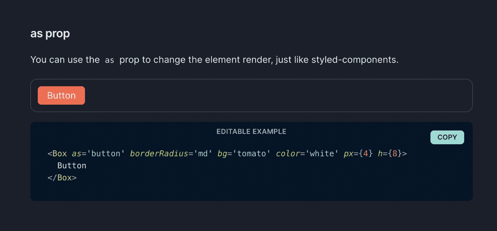

*The chakra UI as prop used with the Box component*

使用`as`道具非常简单。

您将它传递给组件，在本例中是`Box`:

```
<Box as="button"> Hello </Box>
```

该组件将呈现一个按钮元素。

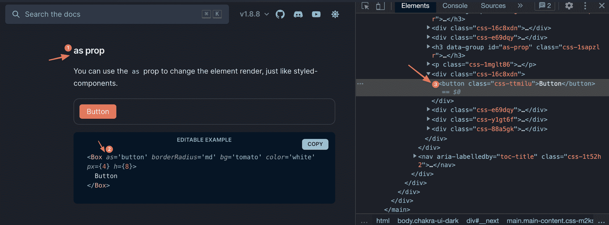

*The Box component rendered as a "button" element*

如果你把`as`道具改成了`h1`:

```
<Box as="h1"> Hello </Box>
```

现在，`Box`组件呈现一个 h1:

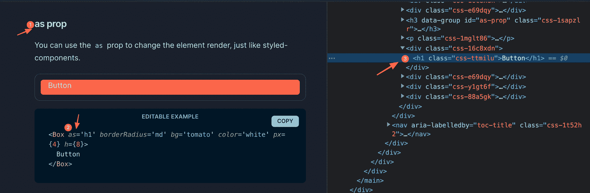

*The Box component rendered as an "h1" element*

那是多态组件在起作用！

这个组件可以渲染成完全独特的元素，只需传递一个道具。

### 材质 UI 的组件属性


*The Material UI component library*

材质 UI 在大多数情况下不需要介绍。多年来，它一直是组件库的主要部分。这是一个强大的组件库，拥有成熟的用户基础。

类似于 chakra UI，Material UI 允许一个叫做`component`的多态道具——你选择如何称呼你的多态道具并不重要(例如 Chakra UI 称之为`as`)。

其用法类似。您将它传递给一个组件，说明您想要呈现什么元素或定制组件。

说够了，这里有一个来自官方文件的例子:

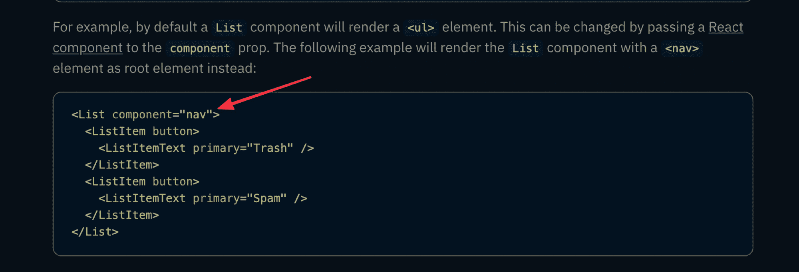

*The Material UI component prop*

```
<List component="nav">
 <ListItem button>
   <ListItemText primary="Trash" />
 </ListItem>
</List>
```

`List`被传递了一个组件属性`nav`，所以当它被渲染时，它将渲染一个`nav`容器元素。

另一个用户可能使用相同的组件，但不是作为导航。他们可能只是想呈现一个待办事项列表:

```
<List component="ol">
...
</List>
```

在这种情况下，List 将呈现一个有序列表`ol`元素。

说到灵活性！你可以在这里看到多态组件 (PDF)的[用例概要。](https://github.com/ohansemmanuel/polymorphic-react-component/blob/master/use-cases.pdf)

正如您将在本手册的以下章节中看到的，多态组件非常强大。除了接受元素类型的道具之外，它们还可以接受自定义组件作为道具。

我们将在本指南的下一节讨论它们。现在，让我们开始构建您的第一个多态组件吧！


[The Build strongly Typed Polymorphic React Components ebook](https://www.ohansemmanuel.com/books/how-to-build-strongly-typed-polymorphic-react-components)

如果你真的想成为一名专业的 Typescript React 开发人员，你可以[下载附带的免费电子书](https://www.ohansemmanuel.com/books/how-to-build-strongly-typed-polymorphic-react-components)。我还会给你发一份免费的电子邮件时事通讯，题目是:**你不知道的 5 个打字秘密。**你可以在这里[得到它。](https://www.ohansemmanuel.com/books/how-to-build-strongly-typed-polymorphic-react-components)

## 如何构建你的第一个多态组件

与您所想的相反，构建您的第一个多态组件非常简单。

下面是一个基本实现:

```
const MyComponent = ({ as, children }) => {
  const Component = as || "span";

  return <Component>{children}</Component>;
};
```

这里要注意的是多态道具`as`——类似于查克拉 UI 的。这是控制多态组件的呈现元素的公开属性。

其次，注意`as`道具不是直接渲染的。以下是错误的:

```
const MyComponent = ({ as, children }) => {
  // wrong render below 👇
  return <as>{children}</as>;
};
```

当在运行时呈现一个[元素类型时，你必须首先将它赋给一个大写的变量，然后呈现这个大写的变量。](https://reactjs.org/docs/jsx-in-depth.html#choosing-the-type-at-runtime)

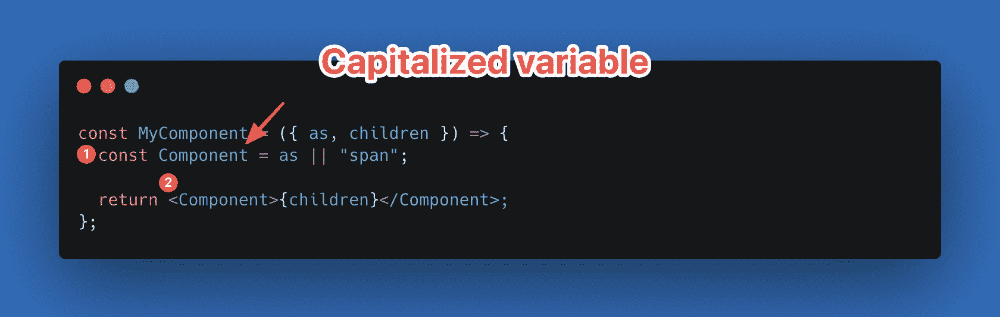

*Using a capitlized variable within a React component*

现在，您可以继续使用该组件，如下所示:

```
<MyComponent as="button">Hello Polymorphic!<MyComponent>
<MyComponent as="div">Hello Polymorphic!</MyComponent>
<MyComponent as="span">Hello Polymorphic!</MyComponent>
<MyComponent as="em">Hello Polymorphic!</MyComponent>
```

注意传递给上面渲染组件的不同的`as`道具。

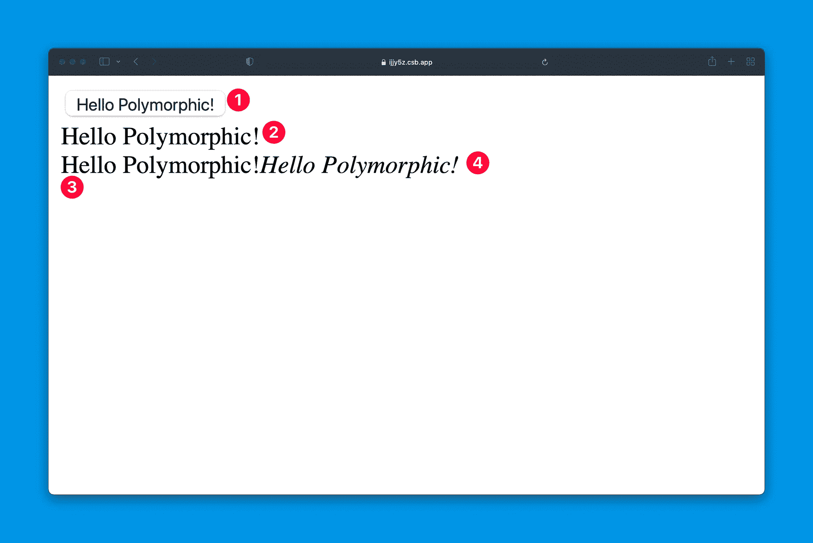

*The different rendered elements of the component *

## 这个简单实现的问题是

上一节中的实现虽然相当标准，但也有不少问题。

让我们来探索其中的一些。

### 1.“as”属性可以接收无效的 HTML 元素。

目前，用户可以继续编写以下内容:

```
<MyComponent as="emmanuel">Hello Wrong Element</MyComponent>
```

这里传的`as`道具是`emmanuel`。

`Emmanuel`是一个不正确的`HTML`元素，但是浏览器也试图呈现这个元素。

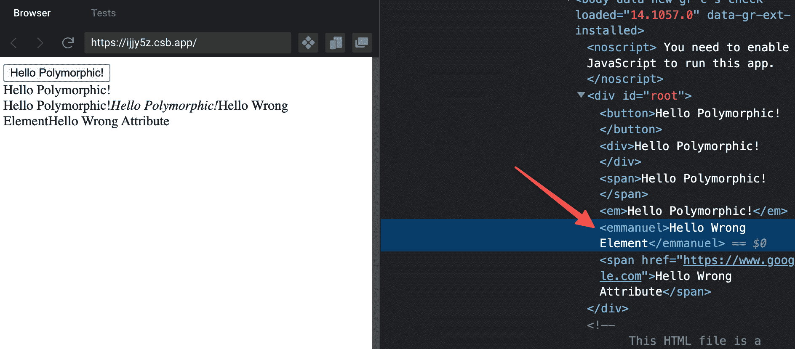

*Rendering a wrong HTML element type*

理想的开发体验是在开发过程中显示出某种错误。例如，用户可能打了一个简单的错别字:`divv`而不是`div`——并且不会得到什么错误的指示。

### 2.可以为有效元素传递不正确的属性。

考虑以下组件用法:

```
<MyComponent as="span" href="https://www.google.com">
   Hello Wrong Attribute
</MyComponent>
```

消费者可以将一个`span`元素传递给`as`道具，以及一个`href`道具。

这在技术上是无效的。

一个`span`元素不(也不应该)接受一个`href`属性。那是无效的`HTML`语法。

然而，现在，我们构建的组件的消费者可以继续编写，他们在开发过程中不会出现任何错误。

### 3.没有属性支持！

再次考虑简单的实现:

```
const MyComponent = ({ as, children }) => {
  const Component = as || "span";

  return <Component>{children}</Component>;
};
```

这个组件接受的道具只有`as`和孩子，没有别的。即使作为元素属性也没有有效的属性支持。也就是说，如果`as`是一个锚元素`a`，我们也应该支持向组件传递一个`href`。

```
<MyComponent as="a" href="...">A link </MyComponent>
```

即使在上面的例子中传递了`href`,组件实现也没有收到其他的支持。只有`as`和孩子被解构。

您最初的想法可能是继续将每个其他属性传递给组件，如下所示:

```
const MyComponent = ({ as, children, ...rest }) => { 
  const Component = as || "span";

  return <Component {...rest}>{children}</Component>;
};
```

这似乎是一个体面的解决方案，但现在它突出了上面提到的第二个问题。错误的属性现在也会传递给组件。

请考虑以下情况:

```
<MyComponent as="span" href="https://www.google.com">
  Hello Wrong Attribute
</MyComponent>
```

并注意最终呈现的标记:

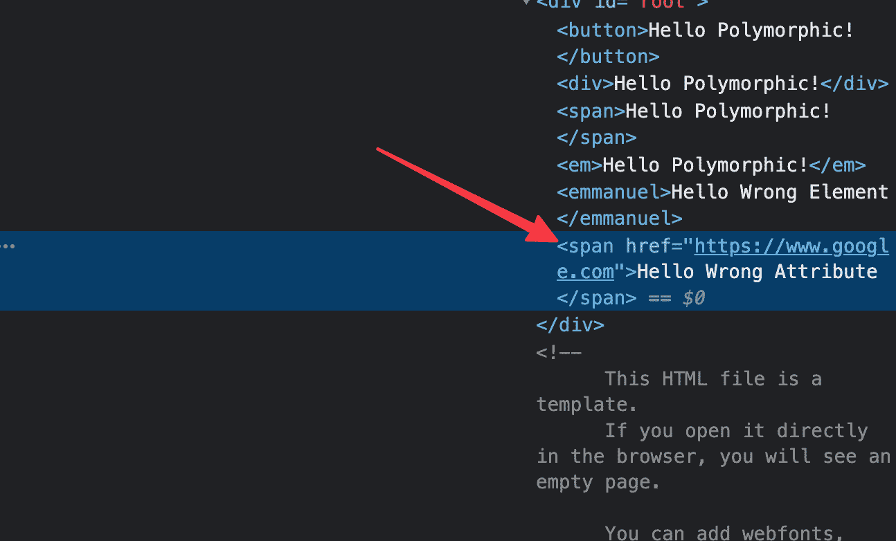

*A span element with an href attribute*

带有`href`的跨度是无效的`HTML`。

我们如何解决这些问题？

需要明确的是，这里没有魔杖可以挥舞。然而，我们将利用 Typescript 来确保您构建强类型多态组件。

完成后，使用您的组件的开发人员将避免上述运行时错误，而是在开发或构建时捕获它们——这要感谢 TypeScript。

### 为什么这样不好？

概括地说，我们的简单实现是不合格的，因为:

*   它提供了糟糕的开发者体验
*   它不是类型安全的。虫子可以(也将会)爬进来。

## 欢迎，打字稿

如果你正在阅读这篇文章，先决条件是你已经知道一些`TypeScript`——至少是基本的。如果你不知道什么是 TypeScript，我强烈建议你先读一下这个[文档](https://www.typescriptlang.org/docs/handbook/typescript-from-scratch.html)。

好了，我们已经建立了一个起点——也就是说，我们将利用 TypeScript 来解决我们刚才讨论的问题。本质上，我们将利用 TypeScript 来构建强类型多态组件。

我们首先要满足的前两个要求包括:

*   `as`属性不应该接收无效的`HTML`元素字符串
*   不应为有效元素传递错误的属性

在下一节中，我们将看到 TypeScript 如何使我们的解决方案更健壮、对开发人员更友好、更适合生产。

## 类型脚本泛型介绍

如果您对 TypeScript 泛型有很深的了解，可以跳过这一节。这只是为不熟悉泛型的读者提供了一个简要的介绍。

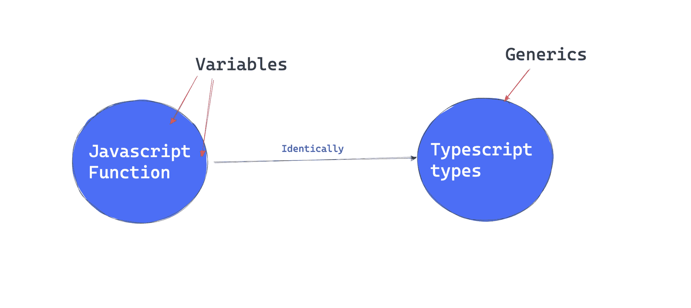

*Illustration: Javascript variables and Typescript generics are identical*

### TypeScript 中的泛型是什么？

如果你是 TypeScript 泛型的新手，它们可能很难理解。但是一旦你掌握了它，你就会看到它的真实面目:一个可以说是参数化你的类型的简单构造。

那么，什么是泛型呢？

你可以用一个简单的心理模型来处理泛型，就是把它们看作你的类型的特殊变量。JavaScript 有变量，TypeScript 有泛型(用于类型)。

我们来看一个经典的例子。

下面是一个`echo`函数，其中`v`代表任意值:

```
const echo = (v) => {
  console.log(v)
  return v
}
```

`echo`函数接收这个值 v，将其记录到控制台，然后将相同的值返回给调用者。没有执行输入转换！

现在，我们可以对不同的输入类型使用该函数:

```
echo(1) // number
echo("hello world") // string
echo({}) // object
```

这非常有效。


*The echo function code block *

只有一个问题。我们根本没有输入这个函数。

让我们在这里洒一些打字稿。🧁

首先，使用关键字`any`以一种简单的方式接受任何输入值`v`:

```
const echo = (v: any) => {
  console.log(v)
  return v
}
```

似乎很管用。

当你这样做的时候，你不会得到任何类型错误。然而，如果你看看你在哪里调用这个函数，你会注意到一件重要的事情:你现在已经失去了所有形式的类型安全。

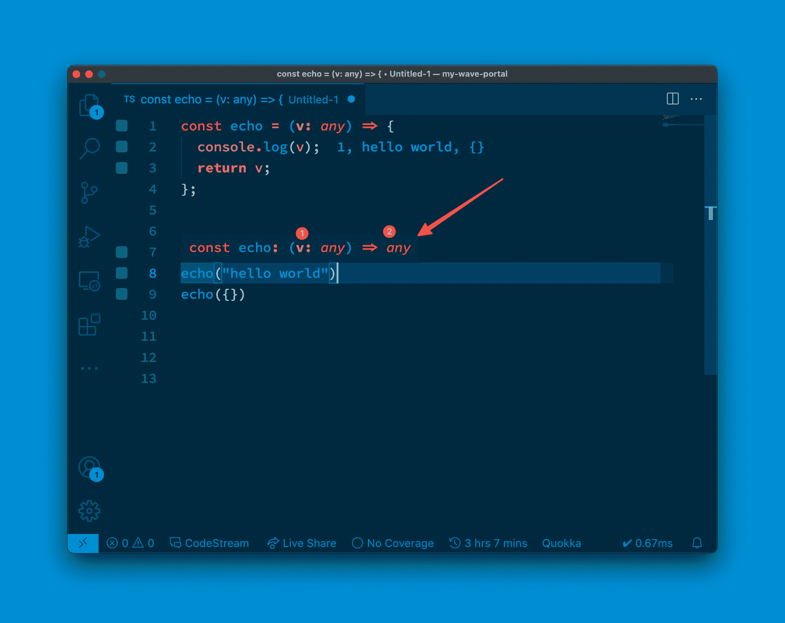

*The any type used in the echo function*

这一点现在可能还不清楚，但是如果您继续执行如下操作:

```
const result = echo("hello world")
let failure = result.hi.me
```

第 2 行将失败，并出现错误。

```
let failure = result.hi.me
```

`result`在技术上是一个`string`，因为 echo 将返回字符串`hello world`，而`"hello world".hi.me`将抛出一个错误。

然而，通过将`v`键入为`any` , `result`同样被键入为`any`。这是因为`echo`返回相同的值。TypeScript 推断返回类型与`v`相同。也就是任何。

因为`result`是类型`any`，所以这里没有类型安全。TypeScript 无法捕捉此错误。这是使用`any`的缺点之一。

好吧，在这里使用`any`是个坏主意。还是回避一下吧。

你还能做什么？

另一个解决方案是明确说明`echo`函数可以接受的类型，如下所示:

```
const echo = (v: string | number | object) => {
  console.log(v);
  return v;
};
```

本质上，您用联合类型来表示 v。

`v`可以是`string`、`number`或`object`。

这很有效。

现在，如果您继续错误地访问 echo 返回类型的属性，您将得到一个适当的错误。举个例子，

```
const result = echo("hi").hi
```

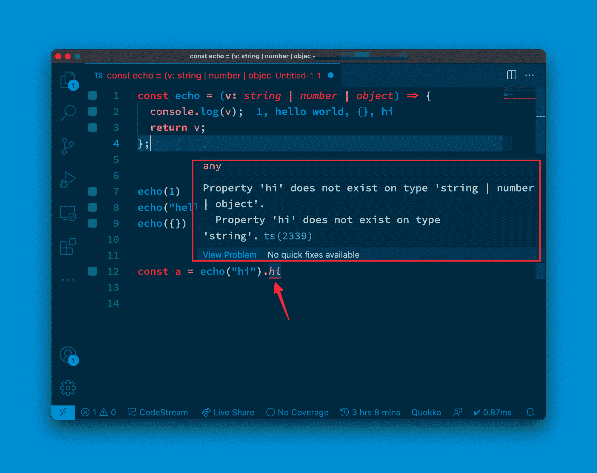

*Property "hi" does not exist error*

您将得到以下错误:属性“hi”在类型“string | number | object”上不存在。

这看起来很完美。

我们用可接受的价值观来代表 v。

然而，如果你想接受更多的值类型呢？您必须不断添加更多的联合类型。

有没有更好的处理方式？例如，根据用户传递给`echo`的内容声明某种变量类型？

首先，让我们用一个我们称之为`Value`的假设类型来代替 union 类型:

```
const echo = (v: Value) => {
  console.log(v);
  return v;
};
```

一旦您这样做了，您将得到下面的 Typescript 错误:

```
Cannot find name 'Value'.ts (2304)
```

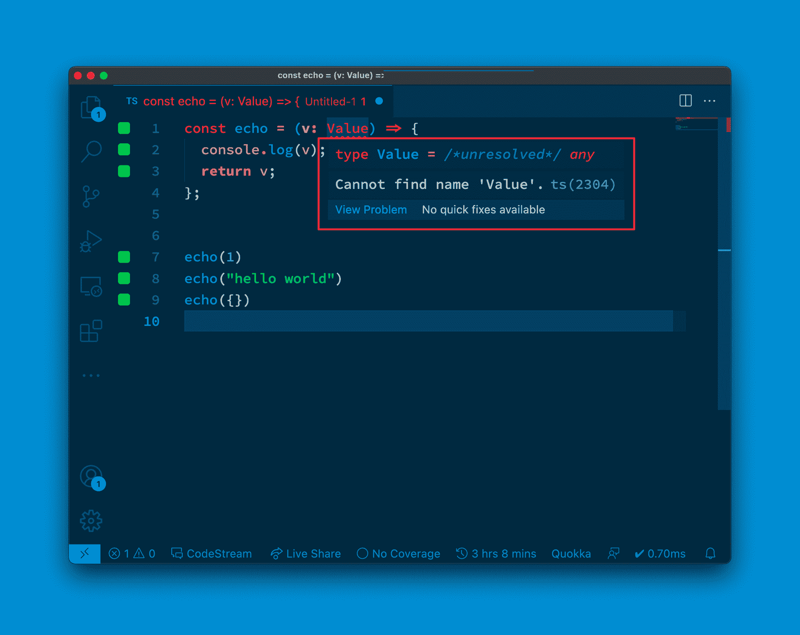

*Cannot find name "Value" error*

这是意料之中的。

然而，这就是泛型的美妙之处。我们可以将这个`Value`类型定义为一个泛型——由调用时传递给 echo 的`v`类型表示的某种变量。

为了完成这个，我们将在`=`符号后面使用尖括号，如下所示:

```
const echo = <Value> (v: Value) => {
  console.log(v);
  return v;
};
```

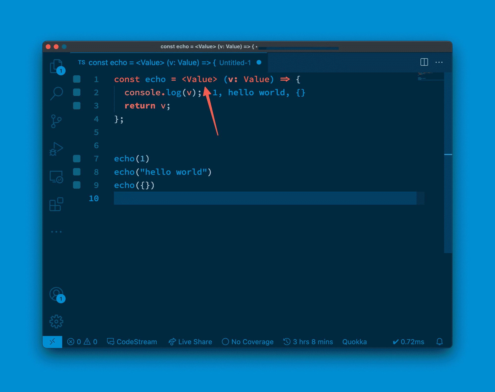

*The "Value" generic*

如果您继续编码，您会注意到不再有 TypeScript 错误。TypeScript 认为这是一个泛型。值类型是泛型。

但是 TypeScript 怎么知道什么是值呢？

这就是泛型的可变形式变得明显的地方。

看看如何调用 echo:

```
echo(1)
echo("hello world")
echo({})
```

泛型`Value`将采用调用时传递给 echo 的任何参数类型。

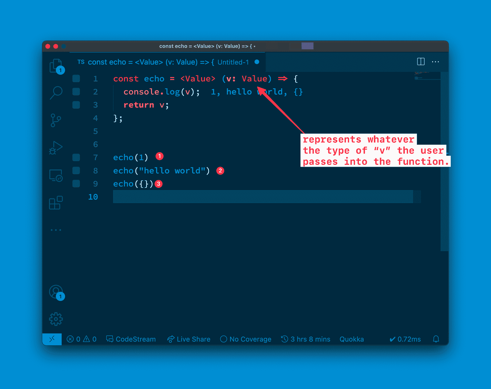

The Value generic represents what the function argument type 

例如，对于`echo(1)`,`Value`的类型将是文字数字`1`。对于`echo("hello world")`,`Value`的类型将是字符串`hello world`。

注意这是如何根据传递给`echo`的参数类型而变化的。

这太棒了。

如果您继续对 echo 的返回类型执行任何操作，您将获得您所期望的所有类型安全——不指定单一类型，而是用一个**泛型**来表示输入，也就是变量类型。

### 如何约束泛型

学习了泛型的基础知识之后，在我们回到多态组件解决方案中利用 TypeScript 之前，还有一个概念需要理解。

让我们考虑回声函数的一个变体。把这个叫做`echoLength`:

```
const echoLength = <Value> (v: Value) => {
  console.log(v.length);
  return v.length;
};
```

该函数不回显输入值 v，而是回显输入值的长度，即`v.length`。

如果您按原样写出了这段代码，Typescript 编译器将会出现一个错误:

```
Property 'length' does not exist on type 'Value'.ts (2339)
```

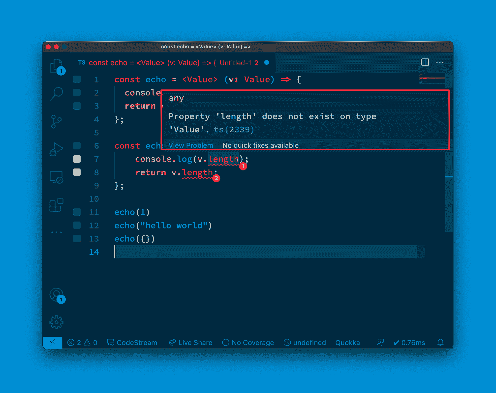

*Property "length" does not exist error*

这是一个相当重要的错误。

`echoLength`参数`v`由泛型`Value`表示——它实际上表示传递给函数的参数的类型。

然而，在函数体中，我们访问的是变量参数的`length`属性。

那么，这里的问题是什么？

问题是，不是每个输入都有一个`length`属性。

泛型`Value`代表函数调用方传递的任何参数类型——但不是每个参数类型都有一个`length`属性。

请考虑以下情况:

```
echoLength("hello world")
echoLength(2)
echoLength({})
```

因为`string`有一个`length`属性，所以`echoLength("hello world")`将按预期工作。

但是，其他两个示例将返回 undefined。数字和对象没有长度属性。所以函数体内的代码不是最安全的类型。

现在，我们如何解决这个问题？

我们需要能够接受一个泛型，但是我们想要确切地指定哪种泛型是有效的。

用更专业的术语来说，我们需要将该函数接受的泛型限制为具有长度属性的类型。

为了实现这一点，我们将利用`extends`关键字。

看一看:

```
const echoLength = <Value extends {length: number}> (v: Value) => {
    console.log(v.length);
    return v.length;
};
```

现在，当您声明`Value`泛型时，添加`extends {length: number}`来表示该泛型将被约束到具有长度属性的类型。

如果您继续像以前一样使用`echoLength`，那么当您传入没有长度属性的值时，您现在应该会得到一个 TypeScript 错误，例如:

```
// these will yield a typescript error
echoLength(2)
echoLength({})
```

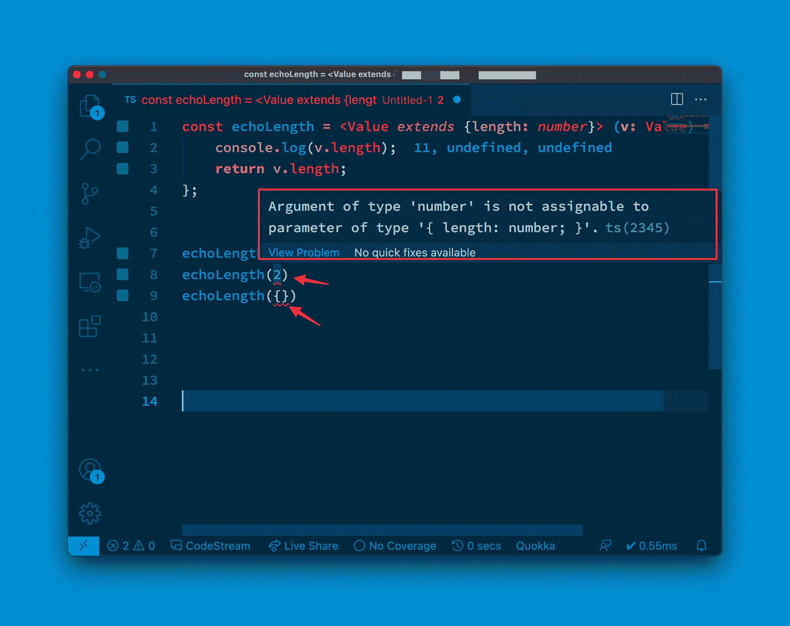

*Argument of type number is not assignable error*

我们在这里所做的是将`Value`类属约束到一个特定的模具。是的，我们需要变量类型。但我们只想要那些符合这种特定模式的，也就是符合某种类型签名的。

可爱！

既然您已经理解了这两个概念，我们现在将回到更新我们的多态组件解决方案，使其更加类型安全——从我们将设置的初始需求开始。

### 确保`as`属性只接收有效的 HTML 元素字符串

这是我们目前的解决方案:

```
const MyComponent = ({ as, children }) => {
  const Component = as || "span";

  return <Component>{children}</Component>;
};
```

为了使本指南的下一节更加实用，我们将把组件的名称从 MyComponent 改为`Text`。也就是说，假设我们正在构建一个多态文本组件。

现在，随着你对泛型的了解，很明显我们最好用泛型类型来表示，这是一个基于用户传入的变量类型。

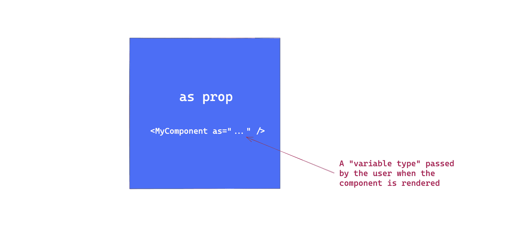

*The as prop: a variable passed by the user when the component is rendered*

让我们继续，并按如下方式迈出第一步:

```
export const Text = <C>({
  as,
  children,
}: {
  as?: C;
  children: React.ReactNode;
}) => {
  const Component = as || "span";

  return <Component>{children}</Component>;
};
```

注意泛型`C`是如何定义的，然后在属性`as`的类型定义中传递。

然而，如果您编写了这个看似完美的代码，您将会看到 TypeScript 用比您想要的更多的弯曲的红线喊出许多错误🤷‍♀️

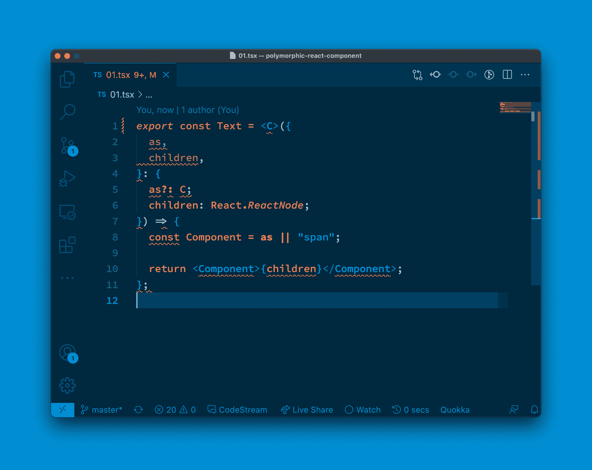

*The JSX generic error code block*

这里发生的是`.tsx`文件中泛型的[语法中的一个缺陷。有两种方法可以解决这个问题。](https://stackoverflow.com/questions/32308370/what-is-the-syntax-for-typescript-arrow-functions-with-generics?)

**1。在泛型声明后添加一个逗号。**

这是声明多个泛型的语法。一旦这样做了，TypeScript 编译器就清楚地理解了您的意图，错误就被消除了。

```
// note the comma after "C" below 👇
export const Text = <C,>({
as,
children,
}: {
as?: C;
 children: React.ReactNode;
}) => {
  const Component = as || "span";

  return <Component>{children}</Component>;
};
```

**2。约束类属。**

第二种选择是在您认为合适的时候约束类属。首先，您可以使用如下的未知类型:

```
// note the extends keyword below 👇
export const Text = <C extends unknown>({
  as,
  children,
}: {
  as?: C;
  children: React.ReactNode;
}) => {
  const Component = as || "span";

  return <Component>{children}</Component>;
};
```

现在，我将坚持解决方案 2，因为它更接近我们的最终解决方案。在大多数情况下，我使用多重通用语法(添加一个逗号)。

好了，接下来呢？

对于我们当前的解决方案，我们得到了另一个 TypeScript 错误:

```
JSX element type 'Component' does not have any construct or call signatures.ts(2604)
```

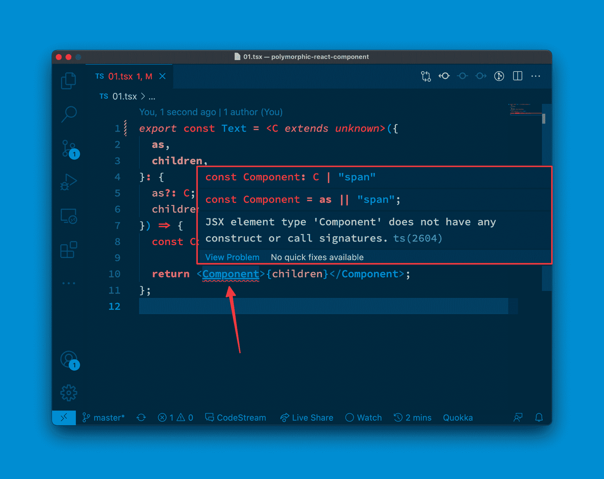

*No construct or call error highlighted*

这类似于我们使用`echoLength`函数时的错误。就像访问一个未知变量类型的 length 属性一样，这里也可以这么说。

试图将任何泛型类型呈现为有效的 React 组件是没有意义的。

我们只需要约束泛型来适应有效的 React 元素类型。

为了实现这一点，我们将利用内部 React 类型:`React.ElementType`，并确保泛型被约束为适合该类型:

```
// look just after the extends keyword 👇
export const Text = <C extends React.ElementType>({
  as,
  children,
}: {
  as?: C;
  children: React.ReactNode;
}) => {
  const Component = as || "span";

  return <Component>{children}</Component>;
};
```

注意，如果你在一个旧版本的 React 上，你可能需要如下导入 React:`**import** **React** **from** **'react'**`**。**

有了这个，我们就不会再有错误了！

现在，如果您继续按如下方式使用这个组件，它会工作得很好:

```
<Text as="div">Hello Text world</Text>
```

然而，如果您传递一个无效的`as`属性，您现在将得到一个适当的 TypeScript 错误。考虑下面的例子:

```
<Text as="emmanuel">Hello Text world</Text>
```

并抛出错误:

```
Type '"emmanuel"' is not assignable to type 'ElementType<any> | undefined'.
```

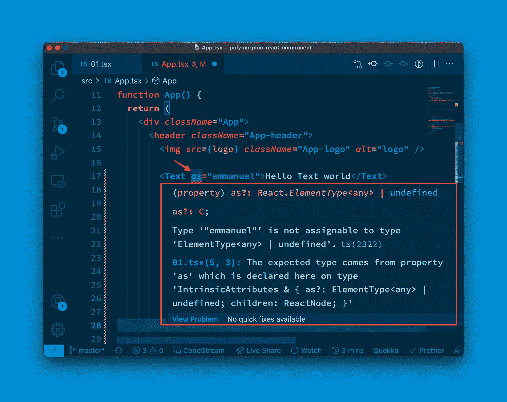

*Type "emmanuel" is not assignable error highlighted*

这太棒了！

我们现在有一个解决方案，不接受对`as`道具的胡言乱语，也将防止讨厌的错别字，例如用`divv`代替`div`。

这是一个更好的开发者体验。

## 如何处理有效的组件属性

在解决第二个用例时，您将会体会到泛型的真正强大之处。

首先，你必须明白我们在这里想要完成什么。

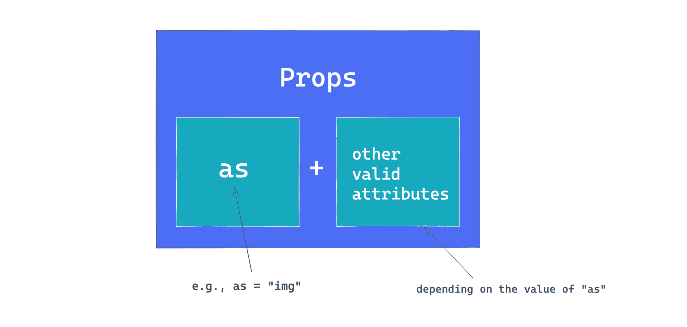

Illustration showing the props: "as" and other valid attributes

一旦我们收到一个通用的 as 类型，我们希望确保传递给我们的组件的其余属性是相关的，基于` ` as 属性。

例如，如果用户传入 img 的一个`as`属性，我们希望 href 同样是一个有效的属性！

为了让您了解我们是如何实现这一目标的，请看一下我们解决方案的当前状态:

```
export const Text = <C extends React.ElementType>({
  as,
  children,
}: {
  as?: C;
  children: React.ReactNode;
}) => {
  const Component = as || "span";

  return <Component>{children}</Component>;
};
```

该组件的道具现在由对象类型表示:

```
{
  as?: C;
  children: React.ReactNode;
} 
```

在伪代码中，我们希望如下所示:

```
{
  as?: C;
  children: React.ReactNode;
 } & {...otherValidPropsBasedOnTheValueOfAs}
```

这个要求足以让人抓住救命稻草。我们不可能编写一个基于`as`的值来确定适当类型的函数，手动列出一个联合类型并不明智。

那么，如果 React 提供了一个类型作为“函数”，根据传递给它的内容返回有效的元素类型，会怎么样呢？

在介绍解决方案之前，让我们先做一点重构。我们把组件的道具拉出来单独成一个类型。

```
// 👇 See TextProps pulled out below
type TextProps<C extends React.ElementType> = {
  as?: C;
  children: React.ReactNode;
}

export const Text = <C extends React.ElementType>({
  as,
  children,
}: TextProps<C>) => { // 👈 see TextProps used
  const Component = as || "span";
  return <Component>{children}</Component>;
};
```

这里重要的是注意泛型是如何传递给`TextProps<C>`的。类似于 JavaScript 中的函数调用——但有尖括号。

现在，来看看解决方案。

这里的魔术棒是利用如下所示的`React.ComponentPropsWithoutRef`类型:

```
type TextProps<C extends React.ElementType> = {
  as?: C;
  children: React.ReactNode;
} & React.ComponentPropsWithoutRef<C>; // 👈 look here

export const Text = <C extends React.ElementType>({
  as,
  children,
}: TextProps<C>) => {
  const Component = as || "span";
  return <Component>{children}</Component>;
};
```

请注意，我们在这里引入了一个交叉点。本质上，我们说，`TextProps`的类型是一个包含`as`和`children`的对象类型，以及其他一些由`React.ComponentPropsWithoutRef`表示的类型。

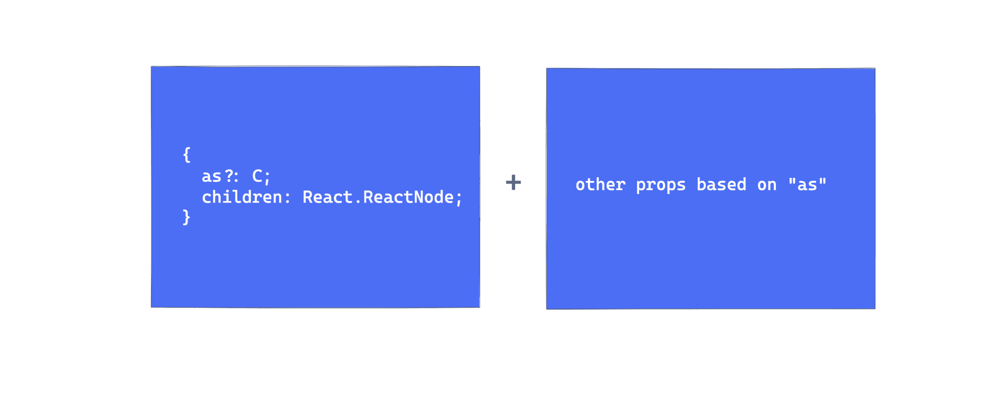

The collection of the component props and other props based on the "as" prop

如果您阅读代码，可能会明白这里发生了什么。

基于由泛型`C`表示的`as`的类型，`React.componentPropsWithoutRef`将返回与传递给 as 属性的`string`属性相关的有效组件属性。

还有更重要的一点需要注意。

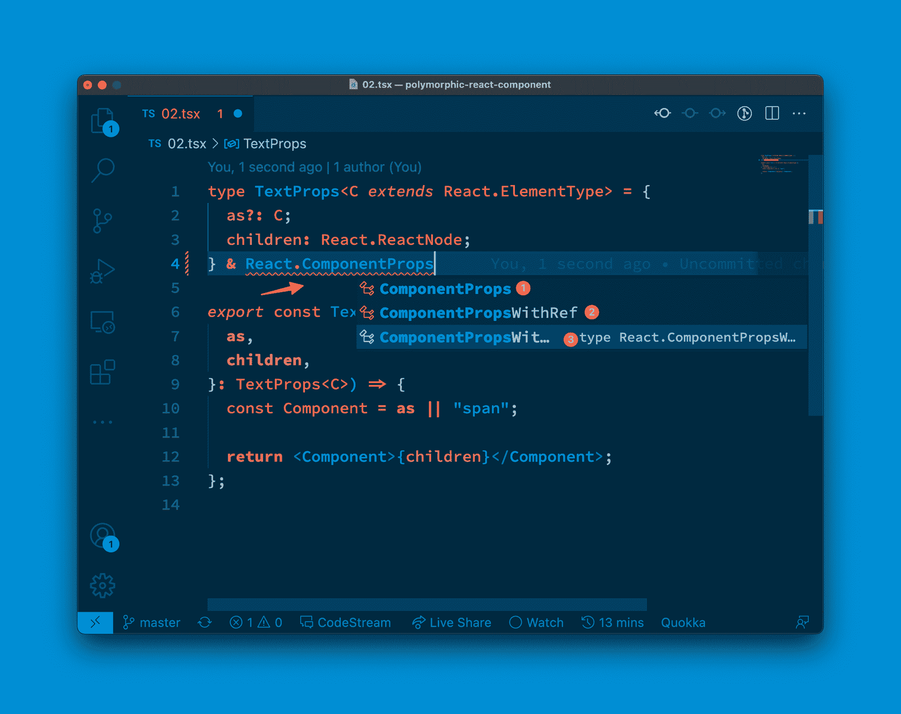

*Exploring the different ComponentProps type variants*

如果你刚开始打字并依赖编辑器的智能感知，你会发现`React.ComponentProps`有三种变体...类型。

1.  `React.ComponentProps`
2.  `React.ComponentPropsWithRef`
3.  `React.ComponentPropsWithoutRef`

如果您尝试使用第一个，ComponentProps，您会看到一个相关说明，内容如下:

> 如果 Ref 被转发，则首选 ComponentPropsWithRef 如果不支持 ref，则首选 ComponentPropsWithoutRef。

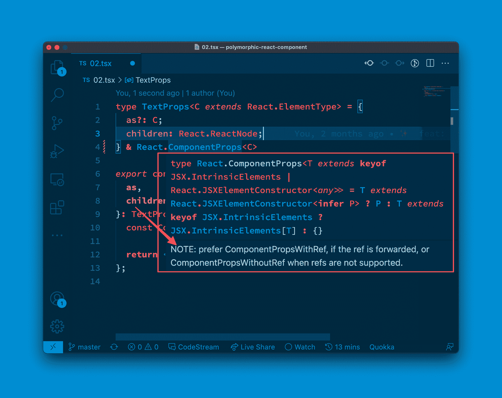

*Note to prefer ComponentPropsWithRef or ComponentPropsWithoutRef*

这正是我们所做的。

现在，我们将忽略支持 ref 属性的用例，坚持使用 ComponentPropsWithoutRef。

现在，让我们试一试解决方案！

如果您继续错误地使用这个组件，例如将一个有效的` ` as prop 与其他不兼容的 prop 一起传递，您将会得到一个错误。

```
<Text as="div" href="www.google.com">Hello Text world</Text>
```

值`div`对于 as 属性完全有效，但是 div 不应该有 href 属性。这是错误的，righty 被 TypeScript 捕获，并显示错误:类型上不存在属性“href”...

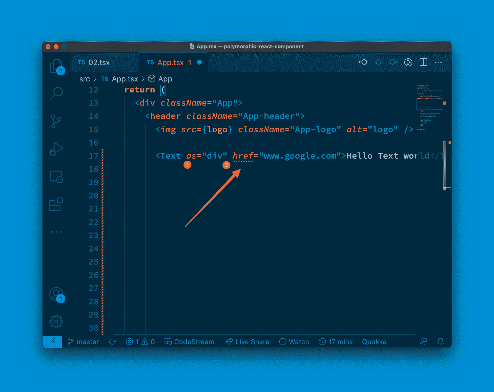

*Property href does not exist error*

这太棒了！我们有一个更好的(健壮的)解决方案。

最后，确保将其他道具向下传递到呈现的元素:

```
type TextProps<C extends React.ElementType> = {
  as?: C;
  children: React.ReactNode;
} & React.ComponentPropsWithoutRef<C>; 

export const Text = <C extends React.ElementType>({
  as,
  children,
  ...restProps, // 👈 look here
}: TextProps<C>) => {
  const Component = as || "span";

  // see restProps passed 👇
  return <Component {...restProps}>{children}</Component>;
};
```

让我们继续前进🙌🏼

## 如何处理默认的`as`属性

考虑我们当前的解决方案:

```
export const Text = <C extends React.ElementType>({
 as,
 children,
...restProps
}: TextProps<C>) => {
 const Component = as || "span"; // 👈 look here

 return <Component {...restProps}>{children}</Component>;
};
```

如果省略了`as`属性，请特别注意缺省元素的位置。

```
const Component = as || "span"
```

这在 JavaScript 世界中得到了恰当的体现，即通过实现，如果`as`是可选的，它将默认为一个 span。

问题是，TypeScript 如何处理这种情况？比如`as`没有通过的时候？我们是否同样传递了一个默认类型？

嗯，答案是否定的。但下面是一个实际的例子。

如果您继续使用文本组件，如下所示:

```
<Text>Hello Text world</Text>
```

请注意，我们在这里没有通过`as`道具。TypeScript 会知道这个组件的有效属性吗？

让我们继续添加一个 href:

```
<Text href="https://www.google.com">Hello Text world</Text>
```

如果你继续这样做，你不会得到任何错误。

那很糟糕。

span 不应接收 href 属性。虽然我们在实现中默认了一个 span，但 TypeScript 并不知道这个默认实现。让我们用一个简单、通用的默认赋值来解决这个问题:

```
type TextProps<C extends React.ElementType> = {
  as?: C;
  children: React.ReactNode;
} & React.ComponentPropsWithoutRef<C>;

/**
* See default below. TS will treat the rendered element as a
span and provide typings accordingly
*/
export const Text = <C extends React.ElementType = "span">({
  as,
  children,
...restProps
}: TextProps<C>) => {
  const Component = as || "span";
  return <Component {...restProps}>{children}</Component>;
};
```

下面突出了重要的一点:

```
<C extends React.ElementType = "span">
```

瞧！我们之前的例子现在应该抛出一个错误，即当您将 href 传递给文本组件而没有使用`as`属性时。

错误应为:类型上不存在属性“href”...

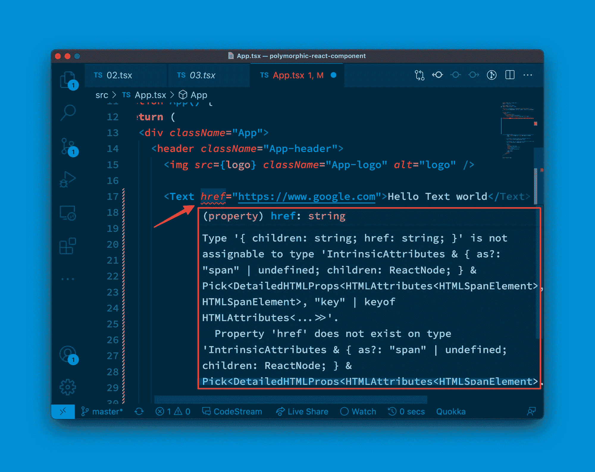

The href is not assignable ... error (as expected)

## 该组件及其属性应该是可重用的

我们当前的解决方案比我们开始时好得多。为自己能走到这一步而感到欣慰。然而，从这里开始只会变得更加有趣。

本节中要满足的用例在现实世界中非常适用。很有可能，如果你正在构建某种组件，那么这个组件也将接受一些特定的道具，这些道具是这个组件独有的。

我们当前的解决方案考虑到了`as`、孩子和其他基于`as`道具的组件道具。但是如果我们想让这个组件处理自己的道具呢？

让我们来做点实际的。

我们将让`Text`组件接收一个`color`道具。这里的`color`将会是任何一种彩虹颜色，或`black`。

我们将继续进行，并表示如下:

```
type Rainbow =
| "red"
| "orange"
| "yellow"
| "green"
| "blue"
| "indigo"
| "violet";
```

接下来，我们必须如下定义`TextProps`对象中的`color`属性:

```
type TextProps<C extends React.ElementType> = {
  as?: C;
  color?: Rainbow | "black"; // 👈 look here
  children: React.ReactNode;
} & React.ComponentPropsWithoutRef<C>;
```

在我们继续之前，让我们进行一点重构。

让我们用一个`Props`对象来表示`Text`组件的实际`props`，并在`TextProps`对象中明确地只输入我们组件特有的道具。

这一点将变得很清楚，正如您将在下面看到的:

```
// new "Props" type
type Props <C extends React.ElementType> = TextProps<C>

export const Text = <C extends React.ElementType = "span">({
as,
children,
...restProps,
}: Props<C>) => {
const Component = as || "span";
return <Component {...restProps}>{children}</Component>;
}; 
```

现在我们来清理一下`TextProps`:

```
// before 
type TextProps<C extends React.ElementType> = {
  as?: C;
  color?: Rainbow | "black"; // 👈 look here
  children: React.ReactNode;
} & React.ComponentPropsWithoutRef<C>;

// after
type TextProps<C extends React.ElementType> = {
  as?: C;
  color?: Rainbow | "black";
};
```

现在，`TextProps`应该只包含我们的`Text`组件特有的道具:`as`和`color`。

我们现在必须更新`Props`的定义，以包含我们从`TextProps`中移除的类型，即`children`和`React.ComponentPropsWithoutRef<C>`。

对于`children`道具，我们将利用`React.PropsWithChildren`道具。


*The PropsWithChildren type injects the children prop*

工作方式很容易理解。您将组件道具传递给它，它将为您注入子道具定义。

让我们在下面利用这一点:

```
type Props <C extends React.ElementType> = 
React.PropsWithChildren<TextProps<C>>
```

注意我们是如何使用尖括号的。

这是传递泛型的语法。本质上，`React.PropsWithChildren`接受你的组件道具作为通用道具，并用子道具来扩充它。太棒了。

对于`React.ComponentPropsWithoutRef<C>`，我们将继续利用这里的交集类型:

```
type Props <C extends React.ElementType> = 
React.PropsWithChildren<TextProps<C>> & 
React.ComponentPropsWithoutRef<C>
```

这是完整的当前解决方案:

```
type Rainbow =
  | "red"
  | "orange"
  | "yellow"
  | "green"
  | "blue"
  | "indigo"
  | "violet";

type TextProps<C extends React.ElementType> = {
  as?: C;
  color?: Rainbow | "black";
};

type Props <C extends React.ElementType> = 
React.PropsWithChildren<TextProps<C>> & 
React.ComponentPropsWithoutRef<C>

export const Text = <C extends React.ElementType = "span">({
  as,
  children,
}: Props<C>) => {
  const Component = as || "span";
  return <Component> {children} </Component>;
};
```

我知道这些感觉很多，但是仔细看看，就会明白了。这实际上只是把你到目前为止学到的所有东西放在一起。应该没有什么特别新的东西。

安全了吗？现在，你变得有点专业了！

完成这个必要的重构后，我们现在可以继续我们的解决方案了。我们现在所拥有的实际上是可行的。我们已经显式地键入了颜色属性，您可以继续使用它，如下所示:

```
<Text color="violet">Hello world</Text>
```

只有一件事让我不太舒服。

`color`也是许多`HTML`标签的有效属性。这是 HTML5 之前的情况。因此，如果我们从类型定义中移除了`color`，它将被接受为任何有效的字符串。

见下文:

```
type TextProps<C extends React.ElementType> = {
  as?: C;
  // remove color from the definition here
};
```

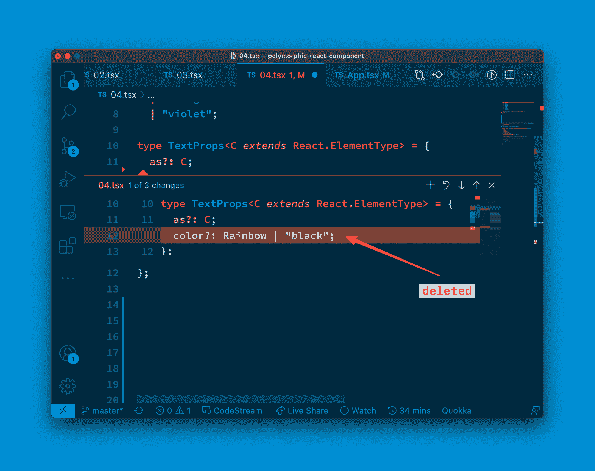

*Removing the color type definition*

现在，如果你继续像以前一样使用`Text`，它同样有效:

```
<Text color="violet">Hello world</Text>
```

这里唯一的区别是它是如何被输入的。`color`现在由下面的定义`color?: string | undefined`表示:

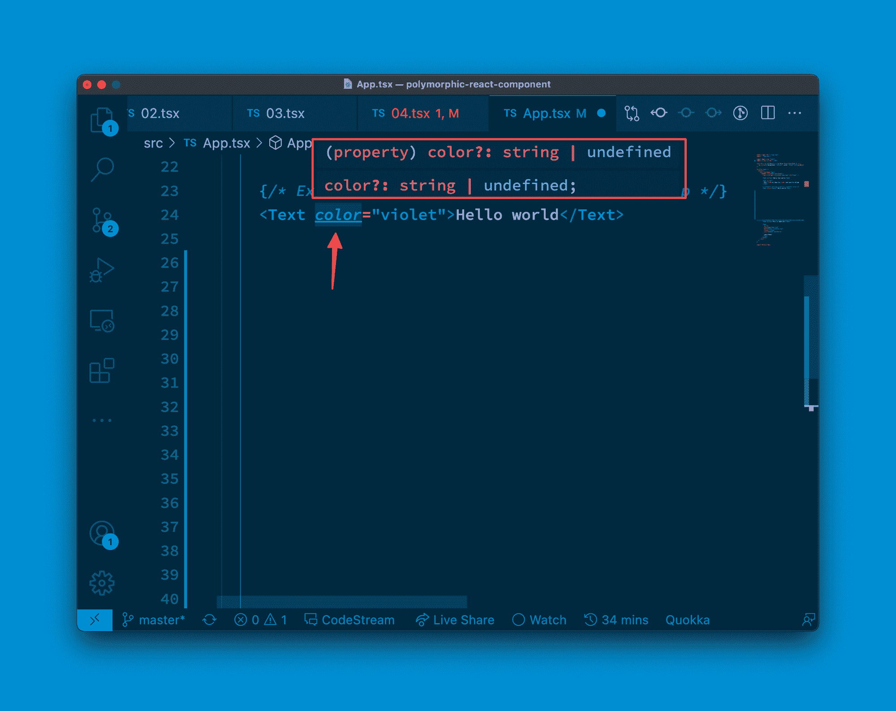

*The default color type*

同样，这不是我们在类型中写的定义！

这是默认的 HTML 类型，其中颜色是大多数 HTML 元素的有效属性。请参见此 [stackoverflow 问题](https://stackoverflow.com/questions/67142430/why-color-appears-as-html-attribute-on-a-div)了解更多背景信息。

现在，有两条路可以走。

首先，您可以保留我们显式声明颜色属性的初始解决方案:

```
type TextProps<C extends React.ElementType> = {
  as?: C;
  color?: Rainbow | "black"; // 👈 look here
};
```

其次，你可以继续下去，可以说提供了更多的安全。要做到这一点，你必须意识到先前的默认颜色定义来自哪里。

它来自定义`React.ComponentPropsWithoutRef<C>`——这是在`as`类型的基础上增加的其他道具。

因此，我们在这里可以做的是从`React.ComponentPropsWithoutRef<C>`中显式地移除组件类型中存在的任何定义。

在实际操作之前，这可能很难理解，所以让我们一步一步来。

如前所述，`React.ComponentPropsWithoutRef<C>`包含基于`as`类型的所有其他有效道具，例如`href`、`color`等等。

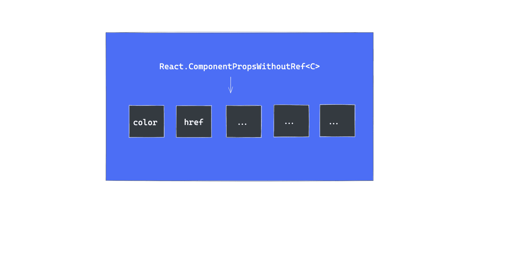

*The ComponentPropsWithoutRef type*

这些类型都有自己的定义，比如`color?: string | undefined`等等。

有可能存在于`React.ComponentPropsWithoutRef<C>`中的一些值也存在于我们的组件 props 类型定义中。

在我们的例子中，`color`存在于两者之中！

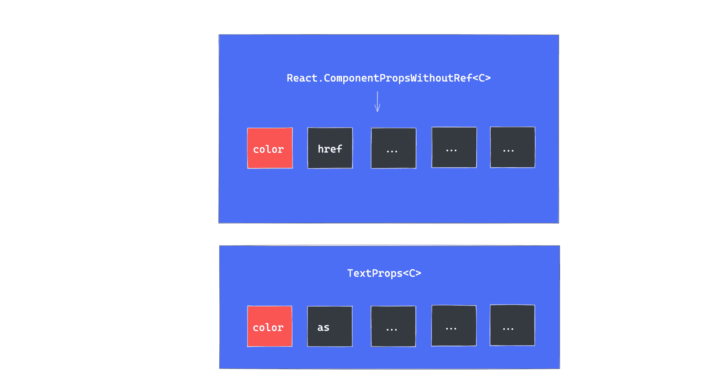

*ComponentPropsWithoutRef and TextProps*

我们将明确移除组件类型定义中存在的任何类型，而不是依赖我们的颜色定义来覆盖来自`React.ComponentPropsWithoutRef<C>`的内容。

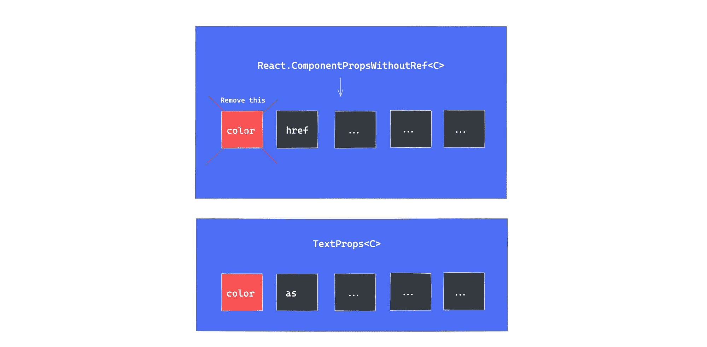

*Removing existing props from ComponentPropsWithoutRef*

因此，如果我们的组件类型定义中存在任何类型，我们将从`React.ComponentPropsWithoutRef<C>`中显式删除它。

我们如何做到这一点？

好吧，这是我们之前有的:

```
type Props <C extends React.ElementType> = 
React.PropsWithChildren<TextProps<C>> & 
React.ComponentPropsWithoutRef<C>
```

而不是只有一个交集类型，我们只是添加来自 React 的所有内容。ComponentPropsWithoutRef <c>，我们会更有选择性。我们将使用 Omit 和 keyof TypeScript 实用程序类型来执行一些 TS 魔术。</c>

看一看:

```
// before 
type Props <C extends React.ElementType> = 
React.PropsWithChildren<TextProps<C>> & 
React.ComponentPropsWithoutRef<C>

// after
type Props <C extends React.ElementType> = 
React.PropsWithChildren<TextProps<C>> &   
Omit<React.ComponentPropsWithoutRef<C>, keyof TextProps<C>>;
```

重要的一点是:

```
Omit<React.ComponentPropsWithoutRef<C>, keyof TextProps<C>>;
```

如果你不知道`Omit`和`keyof`是如何工作的，下面是一个快速总结。

`Omit`接受两个泛型。第一个是对象类型，第二个是您希望从对象类型中“省略”的类型的联合。

这是我最喜欢的例子。考虑如下元音对象类型:

```
type Vowels = {
  a: 'a',
  e: 'e',
  i: 'i',
  o: 'o',
  u: 'u'
}
```

这是键和值的对象类型。

如果我想从`Vowels`中派生出一个叫做`VowelsInOhans`的新类型呢？

嗯，我确实知道 Ohans 这个名字包含两个元音`o`和`a`。

代替手动声明这些:

```
type VowelsInOhans = {
  a: 'a',
  o: 'o'
}
```

我可以继续利用`Omit`如下:

```
type VowelsInOhans = Omit<Vowels, 'e' | 'i' | 'u'>
```

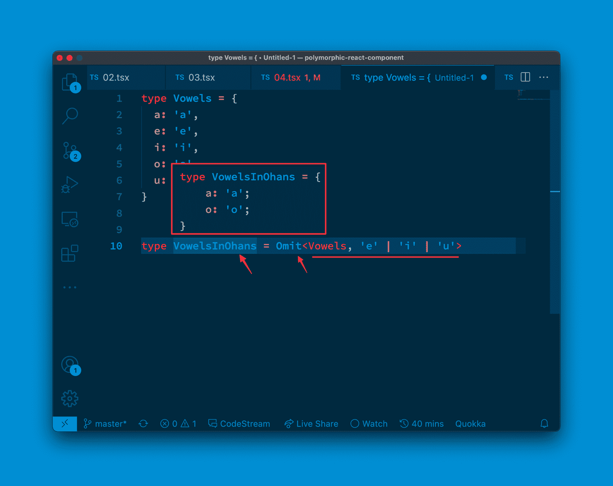

*The VowelsInOhans type using Omit*

`Omit`将从对象类型元音中“省略”e、I 和 u 键。

另一方面，`keyof`像你想象的那样工作。想到 JavaScript 中的`Object.keys`。

给定一个对象类型，`keyof`将返回该对象的键的联合类型。唷！那是满嘴的。

这里有一个例子:

```
type Vowels = {
  a: 'a',
  e: 'e',
  i: 'i',
  o: 'o',
  u: 'u'
}

type Vowel = keyof Vowels 
```

现在，元音将成为元音键的联合类型，即:

```
type Vowel = 'a' | 'e' | 'i' | 'o' | 'u' 
```

如果将这些放在一起，再看一看我们的解决方案，就会发现一切都很完美:

```
Omit<React.ComponentPropsWithoutRef<C>, keyof TextProps<C>>;
```

返回我们的组件道具的键的联合类型。这又被传递到`Omit`以从`React.ComponentPropsWithoutRef<C>`中省略它们。

太棒了。🕺

为了完整起见，让我们继续将颜色属性传递给呈现的元素:

```
xport const Text = <C extends React.ElementType = "span">({
  as,
  color, // 👈 look here
  children,
  ...restProps
}: Props<C>) => {
  const Component = as || "span";

  // 👇 compose an inline style object
  const style = color ? { style: { color } } : {};

  // 👇 pass the inline style to the rendered element
  return (
    <Component {...restProps} {...style}>
      {children}
    </Component>
  );
};
```

## 如何为多态类型创建可重用的实用程序

如果你一直坚持下去，你一定会为自己的进步感到自豪。

我们已经有了一个行之有效的解决方案。

但是现在，让我们更进一步。

我们的解决方案非常适合我们的文本组件。但是如果您更希望有一个可以在您选择的任何组件上重用的解决方案呢？

通过这种方式，您可以为每个用例拥有一个可重用的解决方案。

听起来怎么样？很可爱，我打赌！

让我们开始吧。

首先，这是当前没有注释的完整解决方案:

```
type Rainbow =
  | "red"
  | "orange"
  | "yellow"
  | "green"
  | "blue"
  | "indigo"
  | "violet";

type TextProps<C extends React.ElementType> = {
  as?: C;
  color?: Rainbow | "black";
};

type Props<C extends React.ElementType> = React.PropsWithChildren<
  TextProps<C>
> &
  Omit<React.ComponentPropsWithoutRef<C>, keyof TextProps<C>>;

export const Text = <C extends React.ElementType = "span">({
  as,
  color,
  children,
  ...restProps
}: Props<C>) => {
  const Component = as || "span";

  const style = color ? { style: { color } } : {};

  return (
    <Component {...restProps} {...style}>
      {children}
    </Component>
  );
};
```

简洁实用。

如果我们使它可重复使用，那么它必须适用于任何组件。这意味着移除硬编码的 TextProps 并用一个泛型来表示它——这样任何人都可以传入他们需要的任何组件 Props。

目前，我们用定义道具<c>来表示我们的组件道具。其中 C 表示作为属性传递的元素类型。</c>

我们现在将把它改为:

```
// before
Props<C>

// after 
PolymorphicProps<C, TextProps>
```

`PolymorphicProps`代表我们将很快编写的实用程序类型。但是请注意，它接受两个泛型类型。第二个是问题中的组件道具，即`TextProps`。

让我们继续定义`PolymorphicProps`类型:

```
type PolymorphicComponentProp<
  C extends React.ElementType,
  Props = {}
> = {} // 👈 empty object for now 
```

上面的定义应该是可以理解的。`C`表示`as`传入的元素类型，`Props`表示实际的组件道具，例如`TextProps`。

在继续之前，让我们实际上将之前的`TextProps`分成以下几部分:

```
type AsProp<C extends React.ElementType> = {
  as?: C;
};

type TextProps = { color?: Rainbow | "black" };
```

所以，我们已经把`AsProp`和`TextProps`分开了。平心而论，它们代表了两种不同的东西。这是一个更好的表示。

现在，让我们更改 PolymorphicComponentProp 实用程序定义，以包括`as`道具、组件道具和子道具，就像我们过去所做的那样:

```
type AsProp<C extends React.ElementType> = {
  as?: C;
};

type PolymorphicComponentProp<
  C extends React.ElementType,
  Props = {}
> = React.PropsWithChildren<Props & AsProp<C>>
```

我相信你明白这是怎么回事。

我们现在有了一个交集类型`Props`(代表组件道具)和一个代表`as`道具的 AsProp，这些都被传递到`PropsWithChildren`中以添加子道具定义。

太棒了。

现在，我们需要包含添加了`React.ComponentPropsWithoutRef<C>`定义的位。但是，我们必须记住忽略组件定义中存在的属性。

让我们想出一个可靠的解决方案。

写出一个新的类型，只包含我们想要省略的道具。即`AsProp`的按键以及组件道具。

```
type PropsToOmit<C extends React.ElementType, P> = keyof (AsProp<C> & P);
```

还记得`keyof`实用程序类型吗？

PropsToOmit 现在将包含我们想要省略的属性的联合类型，即由`P`表示的组件的每个属性和由`AsProps`表示的实际多态属性。

我很高兴你还在跟踪。

现在，让我们将所有这些很好地放在`PolymorphicComponentProp`定义中:

```
type AsProp<C extends React.ElementType> = {
  as?: C;
};

// before 
type PolymorphicComponentProp<
  C extends React.ElementType,
  Props = {}
> = React.PropsWithChildren<Props & AsProp<C>>

// after
type PolymorphicComponentProp<
  C extends React.ElementType,
  Props = {}
> = React.PropsWithChildren<Props & AsProp<C>> &
  Omit<React.ComponentPropsWithoutRef<C>, 
   PropsToOmit<C, Props>>;
```

这基本上省略了`React.componentPropsWithoutRef`中正确的类型。你还记得[省略](https://www.typescriptlang.org/docs/handbook/utility-types.html#omittype-keys)的工作原理吗？

虽然看起来很简单，但是您现在有了一个可以在不同项目的多个组件上重用的解决方案！

下面是完整的实现:

```
type PropsToOmit<C extends React.ElementType, P> = keyof (AsProp<C> & P);

type PolymorphicComponentProp<
  C extends React.ElementType,
  Props = {}
> = React.PropsWithChildren<Props & AsProp<C>> &
  Omit<React.ComponentPropsWithoutRef<C>, PropsToOmit<C, Props>>;
```

现在我们可以继续在我们的`Text`组件上使用`PolymorphicComponentProp`,如下所示:

```
export const Text = <C extends React.ElementType = "span">({
  as,
  color,
  children,
  // look here 👇
}: PolymorphicComponentProp<C, TextProps>) => {
  const Component = as || "span";
  const style = color ? { style: { color } } : {};
  return <Component {...style}>{children}</Component>;
};
```

多好啊！

现在，如果您构建另一个组件，您可以像这样键入它:

```
PolymorphicComponentProp<C, MyNewComponentProps>
```

你听到那声音了吗？那是胜利的声音——你已经走了这么远！

## 该组件应该支持引用

到目前为止，你还记得每一次提到`React.ComponentPropsWithoutRef`吗？😅

组件道具…*不带* ref。现在是时候让裁判上场了！

这是我们解决方案的最后也是最复杂的部分。我需要你耐心等待，但我也会尽我所能详细解释每一步。

我们来钻研一下。

首先，你还记得 React 中的 refs 是如何工作的吗？

这里最重要的概念是，你不能将`ref`作为一个道具传递，并期望它像其他道具一样传递到你的组件中。

在功能组件中处理引用的推荐方法是使用`forwardRef`函数。

让我们从实际问题开始。

如果您现在继续传递一个`ref`到我们的`Text`组件，您将得到一个错误，显示属性`'ref'`在类型上不存在...

```
// Create the ref object 
const divRef = useRef<HTMLDivElement | null>(null);
... 
// Pass the ref to the rendered Text component
<Text as="div" ref={divRef}>
  Hello Text world
</Text>
```

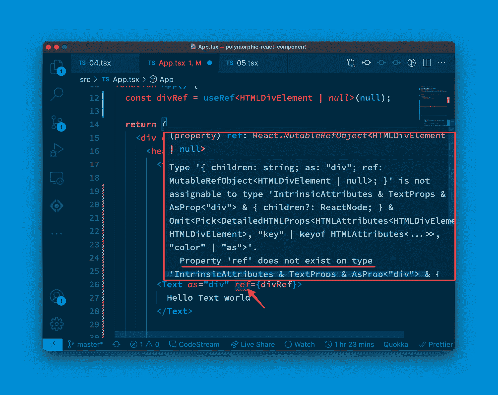

*Property ref does not exist error*

这是意料之中的。

我们支持 refs 的第一步是在如下所示的`Text`组件中使用`forwardRef`:

```
// before 
export const Text = <C extends React.ElementType = "span">({
  as,
  color,
  children,
}: PolymorphicComponentProp<C, TextProps>) => {
  ...
};

// after
import React from "react";

export const Text = React.forwardRef(
  <C extends React.ElementType = "span">({
    as,
    color,
    children,
  }: PolymorphicComponentProp<C, TextProps>) => {
    ...
  }
);
```

这本质上只是将前面的代码包装在`React.forwardRef`中，仅此而已。

现在，`React.forwardRef`有以下签名:

```
React.forwardRef((props, ref) ... )
```

本质上，收到的第二个参数是`ref`对象。

让我们继续处理这个问题:

```
type PolymorphicRef<C extends React.ElementType> = unknown;

export const Text = React.forwardRef(
  <C extends React.ElementType = "span">(
    { as, color, children }: PolymorphicComponentProp<C, TextProps>,
    // 👇 look here
    ref?: PolymorphicRef<C>
  ) => {
    ...
  }
);
```

我们在这里做的是添加第二个参数 ref，并将其类型声明为 PolymorphicRef。

一个暂时只指向`unknown`的类型。

还要注意，PolymorphicRef 接受泛型`C`。这类似于以前的解决方案。div 的 ref 对象与`span`的不同。因此，我们需要考虑作为属性传递的元素类型。

现在让我们把注意力放在`PolymorphicRef`型上。

我需要你和我一起思考。

如何才能得到基于 as prop 的`ref`对象类型？

给你点提示:`React.ComponentPropsWithRef`！

请注意，这里用 ref 表示*。没有*裁判就没有*。*

本质上，如果这是一个键包(事实上就是这样)，它将包含所有基于元素类型的相关组件属性，*加上*ref 对象。

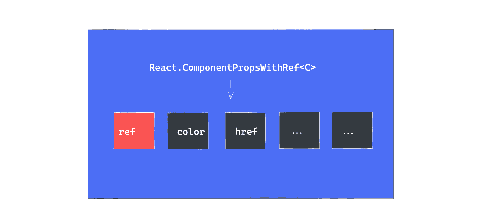

*The ComponentPropsWithRef type*

所以现在，如果我们知道这个对象类型包含了`ref`键，我们也可以通过下面的方法来得到这个引用类型:

```
// before 
type PolymorphicRef<C extends React.ElementType> = unknown;

// after 
type PolymorphicRef<C extends React.ElementType> =
  React.ComponentPropsWithRef<C>["ref"];
```

本质上，`React.ComponentPropsWithRef<C>`返回一个对象类型，例如:

```
{
  ref: SomeRefDefinition, 
  // ... other keys, 
  color: string 
  href: string 
  // ... etc
}
```

为了挑选出 ref 类型，我们这样做:

```
React.ComponentPropsWithRef<C>["ref"];
```

请注意，该语法类似于 JavaScript 中的属性访问器语法，即["ref"]。在 TypeScript 中，我们称之为**类型索引**。

***快速问答*** *:你知道为什么用“Pick”在这里可能不好用，比如* Pick < React。ComponentPropsWithRef < C >，“ref”>*？*

你可以[发推特给我](https://twitter.com/ohansemmanuel)你的答案。

现在我们已经输入了`ref`属性，我们可以继续将它传递给呈现的元素:

```
export const Text = React.forwardRef(
  <C extends React.ElementType = "span">(
    { as, color, children }: PolymorphicComponentProp<C, TextProps>,
    ref?: PolymorphicRef<C>
  ) => {
    //...

    return (
      <Component {...style} ref={ref}> // 👈 look here
        {children}
      </Component>
    );
  }
);
```

我们已经取得了相当大的进步！事实上，如果您像我们之前一样继续检查文本的用法，就不会再有错误了:

```
// create the ref object 
const divRef = useRef<HTMLDivElement | null>(null);
... 
// pass ref to the rendered Text component
<Text as="div" ref={divRef}>
  Hello Text world
</Text>
```

但是我们的解决方案仍然没有我想要的那么强类型化。

让我们继续修改传递给文本的引用，如下所示:

```
// create a "button" ref object 
const buttonRef = useRef<HTMLButtonElement | null>(null);
... 
// pass a button ref to a "div". NB: as = "div"
<Text as="div" ref={buttonRef}>
  Hello Text world
</Text>
```

Typescript 应该在这里抛出一个错误，但它没有。我们正在创建一个“按钮”引用，但是我们将它传递给一个`div`元素。

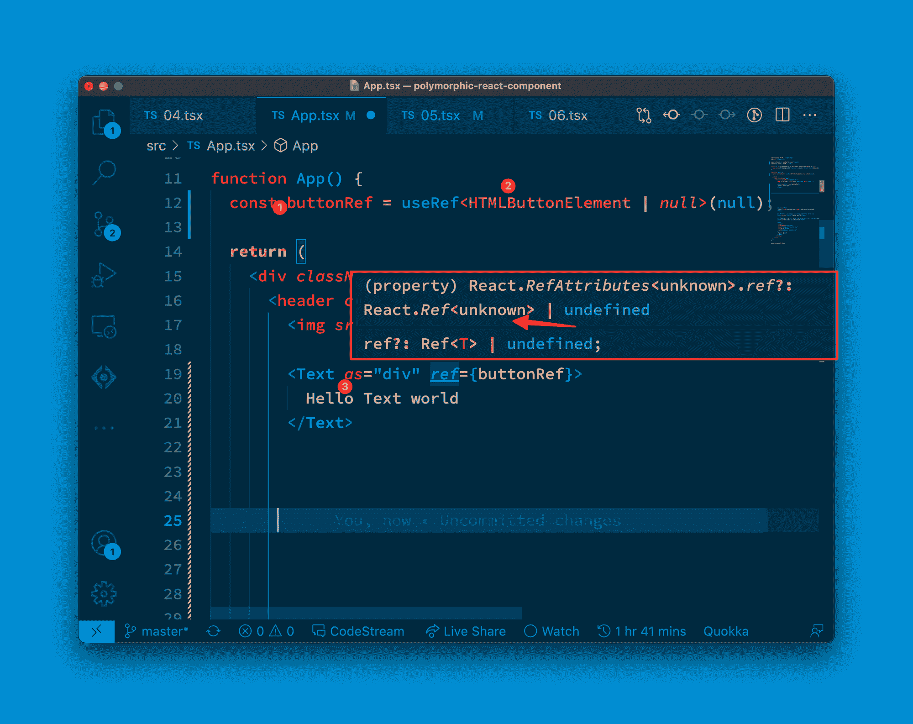

*No error thrown when a wrong element ref is passed*

如果您看一下确切的类型，`ref`它看起来是这样的:

```
React.RefAttributes<unknown>.ref?: React.Ref<unknown>
```

你看到那里的`unknown`了吗？那是打字弱的标志。理想情况下，我们应该将`HTMLDivElement`放在那里，显式地将 ref 对象定义为一个`div`元素 ref。

我们有工作要做。

首先，`Text`组件的其他道具的类型仍然引用了`PolymorphicComponentProp`类型。

我们把这个改成一个新的类型，叫做`PolymorphicComponentPropWithRef`。你猜对了。这将只是`PolymorphicComponentProp`和 ref prop 的联合。

这是:

```
type PolymorphicComponentPropWithRef<
  C extends React.ElementType,
  Props = {}
> = PolymorphicComponentProp<C, Props> & 
{ ref?: PolymorphicRef<C> };
```

注意，这只是前面的`PolymorphicComponentProp`和`{ ref?: PolymorphicRef<C> }`的并集。

现在我们需要改变组件的属性来引用新的`PolymorphicComponentPropWithRef`类型:

```
// before
type TextProps = { color?: Rainbow | "black" };

export const Text = React.forwardRef(
  <C extends React.ElementType = "span">(
    { as, color, children }: PolymorphicComponentProp<C, TextProps>,
    ref?: PolymorphicRef<C>
  ) => {
    ...
  }
);

// now 
type TextProps<C extends React.ElementType> = 
PolymorphicComponentPropWithRef<
  C,
  { color?: Rainbow | "black" }
>;

export const Text = React.forwardRef(
  <C extends React.ElementType = "span">(
    { as, color, children }: TextProps<C>, // 👈 look here
    ref?: PolymorphicRef<C>
  ) => {
    ...
  }
);
```

现在，我们已经更新了`TextProps`来引用`PolymorphicComponentPropWithRef`,它现在作为文本组件的道具被传递。

可爱！

现在只有最后一件事要做了。我们将为`Text`组件提供一个类型注释。它类似于:

```
export const Text : TextComponent = ...
```

其中`TextComponent`是我们将要编写的类型注释。这是:

```
type TextProps<C extends React.ElementType> = 
PolymorphicComponentPropWithRef<
  C,
  { color?: Rainbow | "black" }
>;
```

这本质上是一个接收`TextProps`并返回`React.ReactElement | null`的功能组件。

其中`TextProps`如前所定义:

```
type TextProps<C extends React.ElementType> = 
PolymorphicComponentPropWithRef<
  C,
  { color?: Rainbow | "black" }
>;
```

这样，我们现在有了一个完整的解决方案。

我现在要分享完整的解决方案。乍一看，这似乎令人望而生畏，但是请记住，我们已经一行一行地完成了您在这里看到的所有内容。带着那份自信去读吧。

```
import React from "react";

type Rainbow =
  | "red"
  | "orange"
  | "yellow"
  | "green"
  | "blue"
  | "indigo"
  | "violet";

type AsProp<C extends React.ElementType> = {
  as?: C;
};

type PropsToOmit<C extends React.ElementType, P> = keyof (AsProp<C> & P);

// This is the first reusable type utility we built
type PolymorphicComponentProp<
  C extends React.ElementType,
  Props = {}
> = React.PropsWithChildren<Props & AsProp<C>> &
  Omit<React.ComponentPropsWithoutRef<C>, PropsToOmit<C, Props>>;

// This is a new type utitlity with ref!
type PolymorphicComponentPropWithRef<
  C extends React.ElementType,
  Props = {}
> = PolymorphicComponentProp<C, Props> & { ref?: PolymorphicRef<C> };

// This is the type for the "ref" only
type PolymorphicRef<C extends React.ElementType> =
  React.ComponentPropsWithRef<C>["ref"];

/**
* This is the updated component props using PolymorphicComponentPropWithRef
*/
type TextProps<C extends React.ElementType> = 
PolymorphicComponentPropWithRef<
  C,
  { color?: Rainbow | "black" }
>;

/**
* This is the type used in the type annotation for the component
*/
type TextComponent = <C extends React.ElementType = "span">(
  props: TextProps<C>
) => React.ReactElement | null;

export const Text: TextComponent = React.forwardRef(
  <C extends React.ElementType = "span">(
    { as, color, children }: TextProps<C>,
    ref?: PolymorphicRef<C>
  ) => {
    const Component = as || "span";

    const style = color ? { style: { color } } : {};

    return (
      <Component {...style} ref={ref}>
        {children}
      </Component>
    );
  }
);
```

这就对了。

您已经成功地构建了一个健壮的解决方案来处理 React 中的多态组件。

我知道这不容易，但你做到了。

## 结论和下一步措施

感谢跟随。如果你热衷于不断改进你的打字稿，你可以[下载附带的免费 PDF](https://www.ohansemmanuel.com/books/how-to-build-strongly-typed-polymorphic-react-components) 。

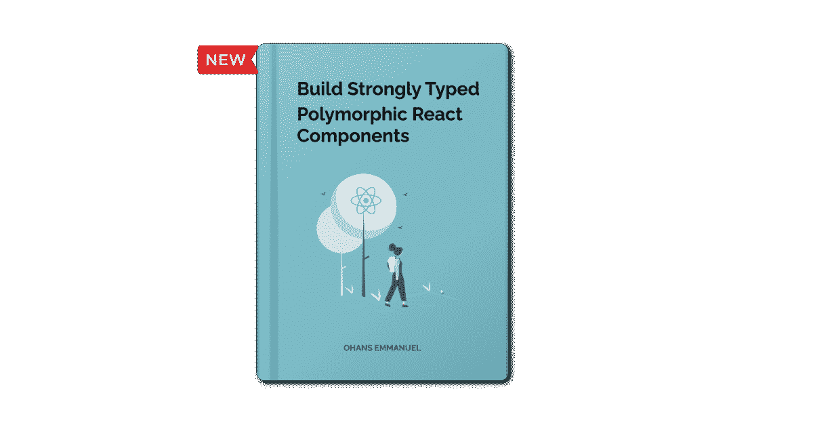

[Download the free PDF](https://www.ohansemmanuel.com/books/how-to-build-strongly-typed-polymorphic-react-components)

我还会给你发一系列电子邮件，包含 5 个打字秘密，让你像专业人士一样思考(和写作)。


[Download the free ebook](https://www.ohansemmanuel.com/books/how-to-build-strongly-typed-polymorphic-react-components) to automatically get my 5-day Typescript secrets newsletter

你可以在这里得到它。

感谢阅读！