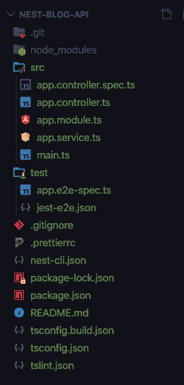
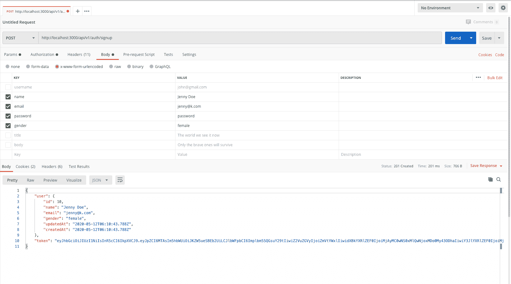
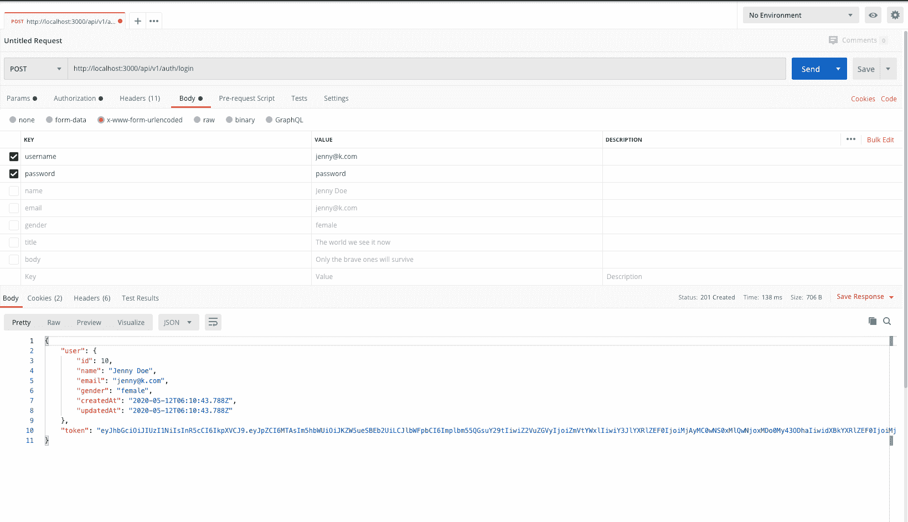
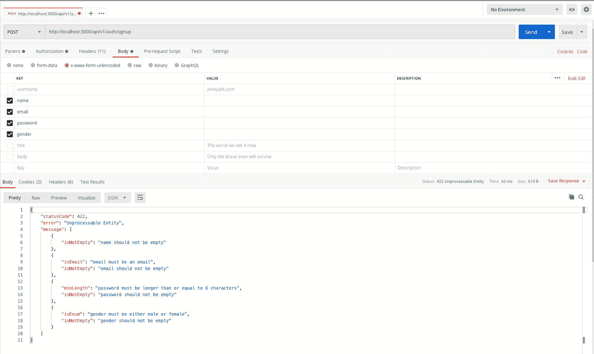
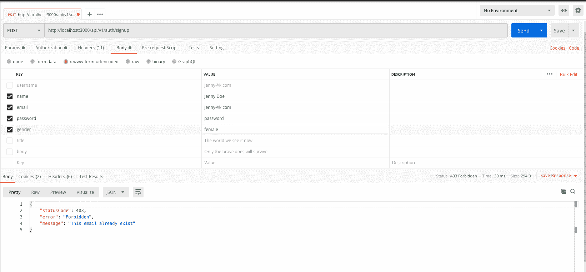
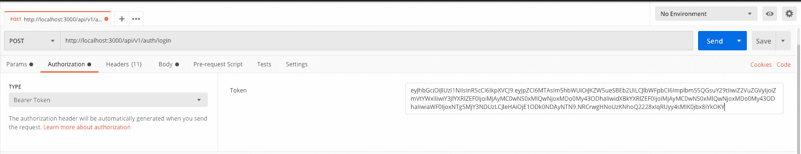
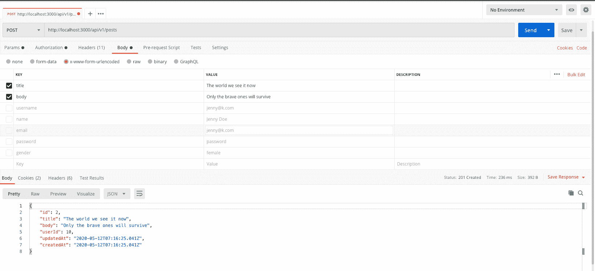
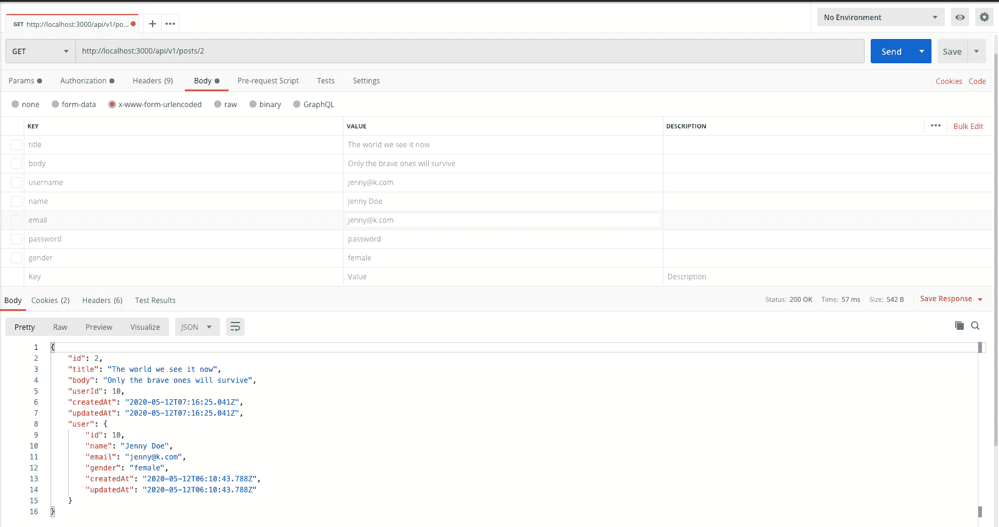
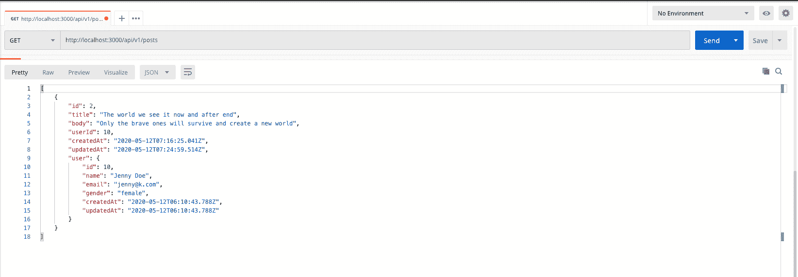
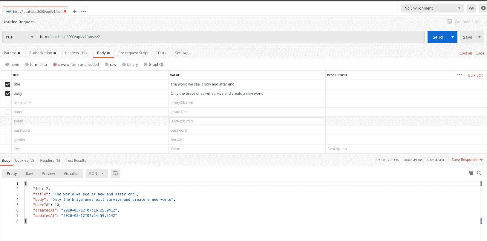

# 如何用 NestJS、Postgres 和 Sequelize 构建 Web APIs 初学者指南

> 原文：<https://www.freecodecamp.org/news/build-web-apis-with-nestjs-beginners-guide/>

NestJS 是一个 MVC 框架，用于构建高效、可伸缩的服务器端应用程序。

它是用 [TypeScript](http://www.typescriptlang.org/) 构建的，并完全支持[TypeScript](http://www.typescriptlang.org/)(但仍然允许开发人员用纯 JavaScript 编码)。它还结合了面向对象编程、函数式编程和函数式反应编程的元素。

Nest 的主要优势之一是它提供了一个开箱即用的应用程序架构，允许开发人员和团队创建高度可测试、可伸缩、松散耦合且易于维护的应用程序。

## 我们正在建造的东西

在本帖中，我将带你走完 Nest 的入门之旅。我们将建立一个迷你博客，这是一个 Web RESTful API 应用程序。

这个简单的迷你博客应用程序将涵盖:

*   建立 Sequelize 和 Postgres 数据库
*   使用 Passport 进行身份验证(登录和注册)
*   验证用户输入
*   JWT 的路线保护
*   创建、阅读、更新和删除博客文章

## 先决条件

阅读本教程时，了解 TypeScript 和 JavaScript 非常重要。有 Angular 经验者优先，但不用担心——这篇文章将解释你需要了解的关于 Nest 的每一个概念。

您将需要安装 [Postman](https://www.postman.com/) ，因为我们将使用它来测试我们的 API 端点。还要确保你的机器上安装了 [Node.js](https://nodejs.org/) ( > = 8.9.0)。[最后，你可以在这里找到最终项目 GitHub repo 的链接](https://github.com/onwuvic/nest-blog-api)。

## 积木

在我们开始之前，我们将讨论一些抽象/概念，它们将帮助您了解在项目之间将特定的业务逻辑放在哪里。

Nest 与 Angular 非常相似——所以如果你熟悉 Angular 的概念，对你来说会很简单。

尽管如此，我会假设你没有这些概念的知识，并向你解释。

### 控制器

控制器负责监听进入应用程序的请求。然后，它制定出发出的响应。

例如，当您对`/posts`进行 API 调用时，控制器将处理这个请求并返回您指定的适当响应。

```
import { Controller, Get } from '@nestjs/common';

@Controller('posts')
export class PostsController {
    @Get()
    findAll(): string {
        return 'This action returns all posts';
    }

    @Get(:id)
    findOne(@Param('id') id: number): string {
        return 'This action returns one post';
    }
}
```

posts.controller.ts

这只是 TypeScript/JavaScript 中一个带有`@Controller`装饰器的基本类声明。所有的嵌套控制器必须有装饰器，这是**要求**在嵌套中定义一个基本控制器。

Nest 允许您在`@Controller()`装饰器中指定您的路线作为参数。这有助于您对一组相关路线进行分组，并最大限度地减少代码重复。对`/posts`的任何请求都将由这个控制器处理。

在类方法级别，您可以指定哪个方法应该处理`GET`、`POST,`、`DELETE`、`PUT/PATCH` HTTP 请求。

在我们的例子中，带有`@Get()`装饰器的`findAll()`方法处理所有的`GET` HTTP 请求以获取所有的博客文章。而带有`@Get(': id')`装饰器的`findOne()`方法将处理一个`GET /posts/1`请求。

### 提供者

提供者被设计成将任何形式的复杂性和逻辑抽象到一个单独的类中。提供者可以是服务、存储库、工厂或助手。

提供者是普通的 TypeScript/JavaScript 类，在它们的类声明之前有一个`@Injectable()`装饰器。就像 Angular 中的服务一样，您可以创建提供者并将其注入到其他控制器或其他提供者中。

服务提供者的一个很好的用例是创建一个 PostService，将所有与数据库的通信抽象到这个服务中。这样可以保持整洁美观。

```
import { Injectable } from '@nestjs/common';
import { Post } from './interfaces/post.interface';

@Injectable()
export class PostsService {
    private readonly posts: Post[] = [];

    create(post: Post) {
        this.posts.push(post);
    }

    findAll(): Post[] {
        return this.posts;
    }
}
```

posts.service.ts

```
export interface Post {
    title: string;
    body: string;
}
```

post.interface.ts

这只是一个带有`@Injectable()`装饰器的普通 TypeScript 类(这是 Nest 知道自己是提供者的方式)。`Post`只是一个用于类型检查的接口。

这里，我们使用一个简单的数据结构来存储数据。在实际项目中，该服务将与数据库进行通信。

### 模块

模块是带有`@Module()`装饰的 JavaScript/TypeScript 类。
`@Module()`装饰器提供了元数据，Nest 用它来组织应用程序结构。

模块是 Nest 的一个非常重要的方面，每个应用程序必须至少提供一个模块:应用程序根模块。根模块是 Nest 用来构建应用程序图的起点。

post 服务、控制器、post 实体以及与 post 相关的所有东西都应该被分组到一个模块中(PostsModule)。下面，我们定义了后置模块。

```
import { Module } from '@nestjs/common';
import { PostsController } from './posts.controller';
import { PostsService } from './posts.service';

@Module({
    controllers: [PostsController],
    providers: [PostsService],
})
export class PostsModule {}
```

posts.module.ts

然后，我们将这个模块导入到根模块`AppModule`:

```
import { Module } from '@nestjs/common';
import { PostsModule } from './posts/posts.module';

@Module({
    imports: [PostsModule],
})
export class AppModule {}
```

app.module.ts

`@Module()`装饰器接受一个对象，该对象的属性描述了模块:

*   本模块需要的其他模块。
*   默认情况下，模块封装提供者。不可能注入既不是当前模块的直接部分也不是从导入的模块导出的提供者。要使当前的模块提供程序对应用程序中的其他模块可用，必须在这里导出它们。我们也可以导出我们导入的模块。
*   在该模块中定义的必须被实例化的控制器集合。
*   `****providers:****`简而言之，我们在该模块中的所有服务和提供商都在这里。

### 拦截机

拦截器是一组专门的中间件，可以让您窥视进入应用程序的请求。您可以在请求到达控制器之前或者在控制器处理完请求之后、请求作为响应到达客户端之前查看请求。您可以在拦截器中处理数据。

### 防护装置

Guard 也是一种特殊的中间件，主要用于身份验证和授权。它只返回布尔值 true 或 false。

守卫有一个 ****单一的职责** :** 他们根据特定的条件(如权限、角色、ACL 等)决定给定的请求是否将由路由处理器处理。)在运行时出现。

守卫也应该实现`CanActivate`接口。

### 管

管道也是一种特殊的中间件，位于客户端和控制器之间。它们主要用于在数据到达控制器之前进行验证和转换。

### DTO(数据传输对象)

数据传输对象是定义如何通过网络发送数据的对象。它们也用于验证和类型检查。

### 接口

TypeScript 接口仅用于类型检查，它们不会向下编译成 JavaScript 代码。

## 装置

安装 NestJs CLI。Nest 附带了一个非常棒的 CLI，可以轻松地搭建 Nest 应用程序。在您的终端或 cmd 运行中:

`npm i -g @nestjs/cli`

现在，您已经在您的计算机中全局安装了 Nest。

在您的终端或 cmd 上，将 cd 放入您想要创建应用程序的目录，并运行以下命令:

`nest new nest-blog-api`
`cd nest-blog-api`


在任何浏览器上导航至`[http://localhost:3000](http://localhost:3000/)`。你应该看到`Hello World`。太棒了。您已经创建了您的第一个 Nest 应用程序。我们继续。

****注:截至本文撰写时，** i **f 运行**** `****npm run start:dev****` ****抛出** an **错误，将您的**** `****package.json file****` ****中的**** `****typescript:3.4.2****` ****改为**** `****typescript:3.7.2****` ****然后删除**** `****node_modules and package-lock.json****` ****重新运行****

您的文件夹结构应该如下所示:



Nest folder structure

## 序列和数据库设置

我们将从安装以下依赖项开始。确保您的终端或 cmd 当前位于您的项目根目录中。然后运行以下命令:

`npm install -g sequelize
npm install --save sequelize sequelize-typescript pg-hstore pg
npm install --save-dev @types/sequelize
npm install dotenv --save`

现在，创建一个数据库模块。运行`nest generate module /core/database`。

### 数据库接口

在数据库文件夹中，创建一个`interfaces`文件夹，然后在其中创建一个`dbConfig.interface.ts`文件。这是数据库配置界面。

每个数据库环境应该可选地具有以下属性。复制并粘贴以下代码:

```
export interface IDatabaseConfigAttributes {
    username?: string;
    password?: string;
    database?: string;
    host?: string;
    port?: number | string;
    dialect?: string;
    urlDatabase?: string;
}

export interface IDatabaseConfig {
    development: IDatabaseConfigAttributes;
    test: IDatabaseConfigAttributes;
    production: IDatabaseConfigAttributes;
}
```

src/core/database/interfaces/dbConfig.interface.ts

### 数据库配置

现在，让我们创建一个数据库环境配置。在数据库文件夹中，创建一个`database.config.ts`文件。复制并粘贴以下代码:

```
import * as dotenv from 'dotenv';
import { IDatabaseConfig } from './interfaces/dbConfig.interface';

dotenv.config();

export const databaseConfig: IDatabaseConfig = {
    development: {
        username: process.env.DB_USER,
        password: process.env.DB_PASS,
        database: process.env.DB_NAME_DEVELOPMENT,
        host: process.env.DB_HOST,
        port: process.env.DB_PORT,
        dialect: process.env.DB_DIALECT,
    },
    test: {
        username: process.env.DB_USER,
        password: process.env.DB_PASS,
        database: process.env.DB_NAME_TEST,
        host: process.env.DB_HOST,
        port: process.env.DB_PORT,
        dialect: process.env.DB_DIALECT,
    },
    production: {
        username: process.env.DB_USER,
        password: process.env.DB_PASS,
        database: process.env.DB_NAME_PRODUCTION,
        host: process.env.DB_HOST,
        dialect: process.env.DB_DIALECT,
    },
};
```

*src/core/database/database.config.ts*

环境将决定应该使用哪种配置。

### 。环境文件

在我们的项目根文件夹中，创建`.env`和`.env.sample`文件。将以下代码复制并粘贴到这两个文件中:

```
DB_HOST=localhost
DB_PORT=5432
DB_USER=database_user_name
DB_PASS=database_password
DB_DIALECT=postgres
DB_NAME_TEST=test_database_name
DB_NAME_DEVELOPMENT=development_database_name
DB_NAME_PRODUCTION=production_database_name
JWTKEY=random_secret_key
TOKEN_EXPIRATION=48h
BEARER=Bearer
```

.env

用正确的信息填充这些值——仅在`.env`文件上——并确保将其添加到`.gitignore`文件中，以避免在线推送。`.env.sample`是为那些想下载你的项目并使用它的人准备的，这样你就可以把它推到网上。

****提示:** **你的用户名、密码和数据库名应该是你用来设置 Postgres 的。用您的数据库名创建一个 Postgres 数据库。****

Nest 提供了一个现成的`@nestjs/config`包来帮助加载我们的`.env`文件。要使用它，我们首先安装所需的依赖项。

运行`npm i --save @nestjs/config`。

将`@nestjs/config`导入您的应用程序根模块:

```
import { Module } from '@nestjs/common';
import { ConfigModule } from '@nestjs/config';

@Module({
    imports: [
        ConfigModule.forRoot({ isGlobal: true }),
    ]
})
export class AppModule { }
```

src/app.module.ts

将`ConfigModule.forRoot({ isGlobal: true })`设置为`isGlobal: true`将使`.env`属性在整个应用程序中可用。

### 数据库提供商

让我们创建一个数据库提供者。在数据库文件夹中，创建一个名为`database.providers.ts`的文件。

核心目录将包含我们所有的核心设置、配置、共享模块、管道、防护和中间件。

在`database.providers.ts`文件中，复制并粘贴以下代码:

```
import { Sequelize } from 'sequelize-typescript';
import { SEQUELIZE, DEVELOPMENT, TEST, PRODUCTION } from '../constants';
import { databaseConfig } from './database.config';

export const databaseProviders = [{
    provide: SEQUELIZE,
    useFactory: async () => {
        let config;
        switch (process.env.NODE_ENV) {
        case DEVELOPMENT:
           config = databaseConfig.development;
           break;
        case TEST:
           config = databaseConfig.test;
           break;
        case PRODUCTION:
           config = databaseConfig.production;
           break;
        default:
           config = databaseConfig.development;
        }
        const sequelize = new Sequelize(config);
        sequelize.addModels(['models goes here']);
        await sequelize.sync();
        return sequelize;
    },
}];
```

src/core/database/database.providers.ts

在这里，应用程序决定我们当前运行的环境，然后选择环境配置。

我们所有的模型都将添加到`sequelize.addModels([User, Post])`功能中。目前，没有模型。

**最佳实践**:将所有字符串值保存在一个常量文件中并将其导出是一个好主意，这样可以避免拼写错误。你也可以在一个地方改变事情。

在核心文件夹中，创建一个`constants`文件夹，并在其中创建一个`index.ts`文件。粘贴以下代码:

```
export const SEQUELIZE = 'SEQUELIZE';
export const DEVELOPMENT = 'development';
export const TEST = 'test';
export const PRODUCTION = 'production'; 
```

src/core/constants/index.ts

让我们将数据库提供者添加到数据库模块中。复制并粘贴以下代码:

```
import { Module } from '@nestjs/common';
import { databaseProviders } from './database.providers';

@Module({
    providers: [...databaseProviders],
    exports: [...databaseProviders],
})
export class DatabaseModule { }
```

src/core/database/database.module.ts

我们导出了数据库提供者`exports: [...databaseProviders]`，使需要它的其他应用程序可以访问**。**

**现在，让我们将数据库模块导入到我们的应用程序根模块中，使它可用于我们所有的服务。**

```
`import { Module } from '@nestjs/common';
import { ConfigModule } from '@nestjs/config';
import { DatabaseModule } from './core/database/database.module';

@Module({
    imports: [
        ConfigModule.forRoot({ isGlobal: true }),
        DatabaseModule,
    ]
})
export class AppModule { }`
```

**src/app.module.ts**

### **设置全局端点前缀**

**对于不同的版本，我们可能希望所有的 API 端点都以`api/v1`开始。我们不想给所有的控制器都加上这个前缀。幸运的是，Nest 提供了一种设置全局前缀的方法。**

**在`main.ts`文件中，添加`app.setGlobalPrefix('api/v1');`**

```
`import { NestFactory } from '@nestjs/core';
import { AppModule } from './app.module';

async function bootstrap() {
    const app = await NestFactory.create(AppModule);
    // global prefix
    app.setGlobalPrefix('api/v1');
    await app.listen(3000);
}
bootstrap();`
```

**src/main.ts**

## **用户模块**

**让我们添加一个用户模块来处理所有与用户相关的操作，并跟踪谁在创建什么帖子。**

**运行`nest generate module /modules/users`。
这将自动把这个模块添加到我们的根模块`AppModule`。**

### **生成用户服务**

**运行`nest generate service /modules/users`。
这将自动将该服务添加到用户模块。**

### **设置用户数据库模式模型**

**在`modules/users`中，创建一个名为`user.entity.ts`的文件，然后复制并粘贴以下代码:**

```
`import { Table, Column, Model, DataType } from 'sequelize-typescript';

@Table
export class User extends Model<User> {
    @Column({
        type: DataType.STRING,
        allowNull: false,
    })
    name: string;

    @Column({
        type: DataType.STRING,
        unique: true,
        allowNull: false,
    })
    email: string;

    @Column({
        type: DataType.STRING,
        allowNull: false,
    })
    password: string;

    @Column({
        type: DataType.ENUM,
        values: ['male', 'female'],
        allowNull: false,
    })
    gender: string;
}`
```

**src/modules/users/user.entity.ts**

**这里，我们指定用户表将包含什么。`@column() decorator`提供了表中每一列的信息。用户表将有`name` `email` `password`和`gender`作为列。我们从`sequelize-typescript`引进了所有的序列装饰器。要阅读更多关于[排序和打字稿的内容，请查看](https://github.com/RobinBuschmann/sequelize-typescript#readme)。**

### **用户 DTO**

**让我们创建我们的用户 DTO ( ****数据传输对象**** )模式。在用户文件夹中，创建一个`dto`文件夹。然后在其中创建一个`user.dto.ts`文件。将以下代码粘贴到:**

```
`export class UserDto {
    readonly name: string;
    readonly email: string;
    readonly password: string;
    readonly gender: string;
}`
```

**src/modules/users/dto/user.dto.ts**

### **用户存储库提供商**

**现在，创建一个用户 ****存储库**** 提供者。在用户的文件夹中，创建一个`users.providers.ts`文件。该提供程序用于与数据库通信。**

```
`import { User } from './user.entity';
import { USER_REPOSITORY } from '../../core/constants';

export const usersProviders = [{
    provide: USER_REPOSITORY,
    useValue: User,
}];`
```

**src/modules/users/users.providers.ts**

**将此`**export** const USER_REPOSITORY = 'USER_REPOSITORY';`添加到常量`index.ts`文件中。**

**另外，将用户提供者添加到用户模块中。注意，我们将用户服务添加到了我们的`exports`数组中。这是因为我们需要在用户模块之外使用它。**

```
`import { Module } from '@nestjs/common';
import { UsersService } from './users.service';
import { usersProviders } from './users.providers';

@Module({
    providers: [UsersService, ...usersProviders],
    exports: [UsersService],
})
export class UsersModule {}`
```

**src/modules/users/users.module.ts**

**让我们将用户操作封装在 UsersService 中。复制并粘贴以下代码:**

```
`import { Injectable, Inject } from '@nestjs/common';
import { User } from './user.entity';
import { UserDto } from './dto/user.dto';
import { USER_REPOSITORY } from '../../core/constants';

@Injectable()
export class UsersService {

    constructor(@Inject(USER_REPOSITORY) private readonly userRepository: typeof User) { }

    async create(user: UserDto): Promise<User> {
        return await this.userRepository.create<User>(user);
    }

    async findOneByEmail(email: string): Promise<User> {
        return await this.userRepository.findOne<User>({ where: { email } });
    }

    async findOneById(id: number): Promise<User> {
        return await this.userRepository.findOne<User>({ where: { id } });
    }
}`
```

**src/modules/users/users.service.ts**

**在这里，我们注入了用户存储库来与数据库通信。**

*   **该方法在用户表中创建新用户，并返回新创建的用户对象。**
*   **`findOneByEmail(email: string)`该方法用于通过电子邮件从用户表中查找用户，并返回用户。**
*   **`findOneById(id: number)`该方法用于通过用户 Id 从用户表中查找用户，并返回用户。**

**我们将在后面使用这些方法。**

**最后，让我们将用户模型添加到文件`sequelize.addModels([User]);`中。**

```
`import { Sequelize } from 'sequelize-typescript';
import { SEQUELIZE, DEVELOPMENT, TEST, PRODUCTION } from '../constants';
import { databaseConfig } from './database.config';
import { User } from '../../modules/users/user.entity';

export const databaseProviders = [{
    provide: SEQUELIZE,
    useFactory: async () => {
        let config;
        switch (process.env.NODE_ENV) {
            case DEVELOPMENT:
                config = databaseConfig.development;
                break;
            case TEST:
                config = databaseConfig.test;
                break;
            case PRODUCTION:
                config = databaseConfig.production;
                break;
            default:
                config = databaseConfig.development;
        }
        const sequelize = new Sequelize(config);
        sequelize.addModels([User]);
        await sequelize.sync();
        return sequelize;
    },
}];`
```

**src/core/database/database.providers.ts**

## **授权模块**

### **生成授权模块**

**这个模块将处理用户认证(登录和注册)。
跑`nest generate module /modules/auth`。
这将自动把这个模块添加到我们的根模块`AppModule`**

### **生成授权服务**

**运行`nest generate service /modules/auth`。
这将自动将该服务添加到 Auth 模块。**

### **生成授权控制器**

**运行`nest g co /modules/auth`。
这将自动将该控制器添加到认证模块。
****注:**** `****g****` ****是****`****generate****`**`****co****`****是**** `****controller****` **的别名。******

**我们将使用[护照](https://github.com/jaredhanson/passport)来处理我们的认证。使用@nestjs/passport 模块将这个库与一个 ****Nest**** 应用程序集成起来非常简单。**

**我们将为此应用程序实现两种身份验证策略:**

*   ******本地护照策略:**** 该策略将用于登录用户。它将验证用户提供的电子邮件/用户名和密码是否有效。如果用户凭证有效，它将返回一个令牌和用户对象，如果无效，它将抛出一个异常。**
*   ******JWT 护照策略:**** 该策略将用于保护受保护资源。只有具有有效令牌的经过身份验证的用户才能访问这些资源或端点。**

### **本地护照策略**

**跑
`npm install --save @nestjs/passport passport passport-local`
`npm install --save-dev @types/passport-local`
`npm install bcrypt --save`**

**在 auth 文件夹中创建一个`local.strategy.ts`文件，并添加以下代码:**

```
`import { Strategy } from 'passport-local';
import { PassportStrategy } from '@nestjs/passport';
import { Injectable, UnauthorizedException } from '@nestjs/common';
import { AuthService } from './auth.service';

@Injectable()
export class LocalStrategy extends PassportStrategy(Strategy) {
    constructor(private readonly authService: AuthService) {
        super();
    }

    async validate(username: string, password: string): Promise<any>{
        const user = await this.authService.validateUser(username, password);

        if (!user) {
         throw new UnauthorizedException('Invalid user credentials');
        }
        return user;
    }
}`
```

**src/modules/auth/local.strategy.ts**

**在这里，我们导入了`Strategy, PassportStrategy and AuthService.`,我们扩展了`PassportStrategy`,在 passport-local 用例中创建了`LocalStrategy.`,没有配置选项，所以我们的构造函数简单地调用了`super()`,没有任何选项对象。**

**我们必须实现`validate()`方法。对于本地策略，Passport 期望一个带有以下签名的`validate()`方法:`validate(username: string, password:string): any`。**

**大多数验证工作都是在我们的`AuthService`中完成的(在我们的`UserService`的帮助下)，所以这个方法非常简单。**

**我们在`AuthService`中调用`validateUser()`方法(我们还没有编写这个方法)，它检查用户是否存在以及密码是否正确。`authService.validateUser()`如果无效则返回 null，如果有效则返回用户对象。**

**如果找到用户并且凭证有效，则用户被返回，因此 Passport 可以完成其任务(例如，在`Request`对象上创建`user`属性)，并且请求处理管道可以继续。如果没有找到，我们抛出一个异常，让我们的[异常层](https://docs.nestjs.com/exception-filters)处理它。**

**现在，将`PassportModule, UserModule`和`LocalStrategy`添加到我们的 AuthModule 中。**

```
`import { Module } from '@nestjs/common';
import { PassportModule } from '@nestjs/passport';
import { AuthService } from './auth.service';
import { AuthController } from './auth.controller';
import { UsersModule } from '../users/users.module';
import { LocalStrategy } from './local.strategy';

@Module({
    imports: [
        PassportModule,
        UsersModule,
    ],
    providers: [
        AuthService,
        LocalStrategy,
    ],
    controllers: [AuthController],
})
export class AuthModule {}`
```

**src/modules/auth/auth.module.ts**

### **AuthService(认证服务)**

**让我们实现`validateUser()`方法。**

```
`import { Injectable } from '@nestjs/common';
import * as bcrypt from 'bcrypt';
import { UsersService } from '../users/users.service';

@Injectable()
export class AuthService {
    constructor(private readonly userService: UsersService) { }

    async validateUser(username: string, pass: string) {
        // find if user exist with this email
        const user = await this.userService.findOneByEmail(username);
        if (!user) {
            return null;
        }

        // find if user password match
        const match = await this.comparePassword(pass, user.password);
        if (!match) {
            return null;
        }

        // tslint:disable-next-line: no-string-literal
        const { password, ...result } = user['dataValues'];
        return result;
    }

    private async comparePassword(enteredPassword, dbPassword) {
        const match = await bcrypt.compare(enteredPassword, dbPassword);
        return match;
    }
}`
```

**src/modules/auth/auth.service.ts**

**在这里，我们用提供的电子邮件检查用户是否存在。然后我们检查数据库中的密码是否与用户提供的相匹配。如果这些检查中的任何一个失败了，我们返回`null,`如果没有，我们返回用户对象。**

**这个私有方法比较用户输入的密码和用户数据库密码，并返回一个布尔值。如果密码匹配，则返回 true。如果不是，则返回 false。**

### **JWT 护照战略**

**运行
`npm install @nestjs/jwt passport-jwt`
`npm install @types/passport-jwt --save-dev`**

**在 auth 文件夹中创建一个`jwt.strategy.ts`文件，并添加以下代码:**

```
`import { ExtractJwt, Strategy } from 'passport-jwt';
import { PassportStrategy } from '@nestjs/passport';
import { Injectable, UnauthorizedException } from '@nestjs/common';
import { UsersService } from '../users/users.service';

@Injectable()
export class JwtStrategy extends PassportStrategy(Strategy) {
    constructor(private readonly userService: UsersService) {
        super({
             jwtFromRequest: ExtractJwt.fromAuthHeaderAsBearerToken(),
             ignoreExpiration: false,
             secretOrKey: process.env.JWTKEY,
        });
    }

    async validate(payload: any) {
        // check if user in the token actually exist
        const user = await this.userService.findOneById(payload.id);
        if (!user) {
            throw new UnauthorizedException('You are not authorized to perform the operation');
        }
        return payload;
    }
}`
```

**src/modules/auth/jwt.strategy.ts**

**这里，我们在添加了一些选项对象的`super()`内部扩展了`PassportStrategy.`。在我们的案例中，这些选项是:**

*   **`jwtFromRequest:`提供从`Request`中提取 JWT 的方法。我们将使用在 API 请求的授权头中提供不记名令牌的标准方法。**
*   **为了明确起见，我们选择默认的`false`设置，它将确保 JWT 没有过期的责任委托给 Passport 模块。这意味着，如果我们的路由提供了过期的 JWT，请求将被拒绝，并发送一个`401 Unauthorized`响应。Passport 方便地为我们自动处理这个问题。**
*   **这是我们令牌的密钥。这将使用我们的`.env`文件中的密钥。**
*   **对于 jwt 策略，Passport 首先验证 JWT 的签名并解码 JSON。然后它调用我们的`validate()`方法，将解码后的 JSON 作为它的单个参数传递。根据 JWT 签名的工作方式，我们可以保证收到一个有效的令牌，这个令牌是我们以前签名并颁发给有效用户的。我们确认是否存在具有用户有效负载 id 的用户。如果用户存在，我们返回用户对象，Passport 将把它作为属性附加到`Request`对象上。如果用户不存在，我们抛出一个异常。**

**现在，将`JwtStrategy`和`JwtModule`添加到`AuthModule.`中:**

```
`import { Module } from '@nestjs/common';
import { PassportModule } from '@nestjs/passport';
import { JwtModule } from '@nestjs/jwt';
import { AuthService } from './auth.service';
import { AuthController } from './auth.controller';
import { UsersModule } from '../users/users.module';
import { LocalStrategy } from './local.strategy';
import { JwtStrategy } from './jwt.strategy';

@Module({
    imports: [
        PassportModule,
        UsersModule,
        JwtModule.register({
            secret: process.env.JWTKEY,
            signOptions: { expiresIn: process.env.TOKEN_EXPIRATION },
        }),
    ],
    providers: [
        AuthService,
        LocalStrategy,
        JwtStrategy
    ],
    controllers: [AuthController],
})
export class AuthModule { }`
```

**src/modules/auth/auth.module.ts**

**我们使用`register()`配置`JwtModule`，传入一个配置对象。**

**让我们在`AuthService`中添加登录和创建新用户所需的其他方法:**

```
`import { Injectable } from '@nestjs/common';
import * as bcrypt from 'bcrypt';
import { JwtService } from '@nestjs/jwt';
import { UsersService } from '../users/users.service';

@Injectable()
export class AuthService {
    constructor(
        private readonly userService: UsersService,
        private readonly jwtService: JwtService,
    ) { }

    async validateUser(username: string, pass: string) {
        // find if user exist with this email
        const user = await this.userService.findOneByEmail(username);
        if (!user) {
            return null;
        }

        // find if user password match
        const match = await this.comparePassword(pass, user.password);
        if (!match) {
            return null;
        }

        // tslint:disable-next-line: no-string-literal
        const { password, ...result } = user['dataValues'];
        return result;
    }

    public async login(user) {
        const token = await this.generateToken(user);
        return { user, token };
    }

    public async create(user) {
        // hash the password
        const pass = await this.hashPassword(user.password);

        // create the user
        const newUser = await this.userService.create({ ...user, password: pass });

        // tslint:disable-next-line: no-string-literal
        const { password, ...result } = newUser['dataValues'];

        // generate token
        const token = await this.generateToken(result);

        // return the user and the token
        return { user: result, token };
    }

    private async generateToken(user) {
        const token = await this.jwtService.signAsync(user);
        return token;
    }

    private async hashPassword(password) {
        const hash = await bcrypt.hash(password, 10);
        return hash;
    }

    private async comparePassword(enteredPassword, dbPassword) {
        const match = await bcrypt.compare(enteredPassword, dbPassword);
        return match;
    }
}`
```

**src/modules/auth/auth.service.ts**

**导入并注入 JwtService。**

*   **`login(user):`该方法用于登录用户。它获取用户信息，用它生成一个令牌，然后返回令牌和用户对象。**
*   **`create(user):`该方法用于创建新用户。它获取用户信息，散列用户密码，将用户保存到 DB，从新返回的用户中删除密码，用用户对象生成令牌，然后返回令牌和用户对象。**
*   **这个私有方法生成一个令牌，然后返回它。**
*   **这个私有方法散列用户密码并返回散列密码。**

**我们稍后将使用所有这些功能。**

### **授权控制器**

**现在，让我们创建我们的`signup`和`login`方法:**

```
`import { Controller, Body, Post, UseGuards, Request } from '@nestjs/common';
import { AuthGuard } from '@nestjs/passport';
import { AuthService } from './auth.service';
import { UserDto } from '../users/dto/user.dto';

@Controller('auth')
export class AuthController {
    constructor(private authService: AuthService) {}

    @UseGuards(AuthGuard('local'))
    @Post('login')
    async login(@Request() req) {
        return await this.authService.login(req.user);
    }

    @Post('signup')
    async signUp(@Body() user: UserDto) {
        return await this.authService.create(user);
    }
}`
```

**src/modules/auth/auth.controller.ts**

**当我们到达这个端点时，POST `api/v1/auth/login`将调用`@UseGuards(AuthGuard('local'))`。这将获取用户电子邮件/用户名和密码，然后在我们的本地策略类上运行 validate 方法。`login(@Request() req)`将生成一个 JWT 令牌并返回它。**

**POST `api/v1/auth/signup`端点将调用`**this**.authService.create(user)`方法，创建用户，并返回一个 JWT 令牌。**

### **让我们试一试…**

**打开您的 Postman 应用程序，并确保它正在运行。向`http://localhost:3000/api/v1/auth/signup`发送 POST 请求，输入你的身体数据创建用户。您应该得到一个令牌和返回的用户对象。**

****

**现在我们有了一个用户，让我们让用户登录。向`http://localhost:3000/api/v1/auth/login`发送发布请求，只需输入您的用户名和密码。您应该得到一个令牌和返回的用户对象。**

****

## **确认**

**请注意，我们没有验证任何用户输入。现在，让我们为我们的应用程序添加验证。**

**运行`npm i class-validator class-transformer --save`。**

**在核心文件夹中，创建一个 pipes 文件夹，然后创建`validate.pipe.ts`文件。复制并粘贴以下代码:**

```
`import { Injectable, ArgumentMetadata, BadRequestException, ValidationPipe, UnprocessableEntityException } from '@nestjs/common';

@Injectable()
export class ValidateInputPipe extends ValidationPipe {
   public async transform(value, metadata: ArgumentMetadata) {
      try {
        return await super.transform(value, metadata);
      } catch (e) {
         if (e instanceof BadRequestException) {
            throw new UnprocessableEntityException(this.handleError(e.message.message));
         }
      }
   }

   private handleError(errors) {
        return errors.map(error => error.constraints);
   }
}`
```

**src/core/pipes/validate.pipe.ts**

**让我们通过在应用程序级别绑定`ValidateInputPipe`来用`dto`自动验证我们所有的端点。在`main.ts`文件中，添加以下内容:**

```
`import { NestFactory } from '@nestjs/core';
import { AppModule } from './app.module';
import { ValidateInputPipe } from './core/pipes/validate.pipe';

async function bootstrap() {
    const app = await NestFactory.create(AppModule);
    // global endpoints prefix
    app.setGlobalPrefix('api/v1');
    // handle all user input validation globally
    app.useGlobalPipes(new ValidateInputPipe());
    await app.listen(3000);
}
bootstrap();`
```

**src/main.ts**

**现在，让我们更新我们的用户`dto`文件:**

```
`import { IsNotEmpty, MinLength, IsEmail, IsEnum } from 'class-validator';

enum Gender {
    MALE = 'male',
    FEMALE = 'female',
}

export class UserDto {
    @IsNotEmpty()
    readonly name: string;

    @IsNotEmpty()
    @IsEmail()
    readonly email: string;

    @IsNotEmpty()
    @MinLength(6)
    readonly password: string;

    @IsNotEmpty()
    @IsEnum(Gender, {
        message: 'gender must be either male or female',
    })
    readonly gender: Gender;
}`
```

**src/modules/users/dto/user.dto.ts**

**在这里，我们从`class-validator.`导入这些装饰器**

*   **确保该字段不为空。**
*   **`@IsEmail():`检查输入的电子邮件是否是有效的电子邮件地址。**
*   **`@MinLength(6):`确保密码字符不少于六位。**
*   **`@IsEnum:`确保只允许指定的值(在本例中，男性和女性)。**

**类别验证器有大量的验证装饰器——看看它们。**

******让我们验证一下……******

****

**没有传递任何值，我得到了下面的验证错误。我们的验证正在进行。这种验证对所有带有 dto(数据传输对象)的端点都是自动的。**

### **唯一用户帐户**

**让我们添加一个防护措施，防止用户用同一个电子邮件注册两次，因为电子邮件在模式级别是唯一的。**

**在核心文件夹中，创建一个 guards 文件夹，然后创建一个`doesUserExist.guard.ts`文件。复制并粘贴以下代码:**

```
`import { CanActivate, ExecutionContext, Injectable, ForbiddenException } from '@nestjs/common';
import { Observable } from 'rxjs';
import { UsersService } from '../../modules/users/users.service';

@Injectable()
export class DoesUserExist implements CanActivate {
    constructor(private readonly userService: UsersService) {}

    canActivate(
      context: ExecutionContext,
    ): boolean | Promise<boolean> | Observable<boolean> {
        const request = context.switchToHttp().getRequest();
        return this.validateRequest(request);
    }

    async validateRequest(request) {
        const userExist = await this.userService.findOneByEmail(request.body.email);
        if (userExist) {
            throw new ForbiddenException('This email already exist');
        }
        return true;
    }
}`
```

**src/core/guards/doesUserExist.guard.ts**

**现在，让我们将这个保护添加到我们在`AuthController.`中的注册方法中:**

```
 `import { Controller, Body, Post, UseGuards, Request } from '@nestjs/common';
import { AuthGuard } from '@nestjs/passport';
import { AuthService } from './auth.service';
import { UserDto } from '../users/dto/user.dto';
import { DoesUserExist } from '../../core/guards/doesUserExist.guard';

@Controller('auth')
export class AuthController {
    constructor(private authService: AuthService) { }

    @UseGuards(AuthGuard('local'))
    @Post('login')
    async login(@Request() req) {
        return await this.authService.login(req.user);
    }

    @UseGuards(DoesUserExist)
    @Post('signup')
    async signUp(@Body() user: UserDto) {
        return await this.authService.create(user);
    }
}`
```

**src/modules/auth/auth.controller.ts**

**让我们尝试使用数据库中已经存在的电子邮件创建一个用户:**

****

## **发布模块**

**运行`nest g module /modules/posts`。
这将自动把这个模块添加到我们的根模块`AppModule`。**

### **生成发布服务**

**运行`nest g service /modules/posts`。
这将自动将该服务添加到 Post 模块。**

### **生成后控制器**

**运行`nest g co /modules/posts`、
这将自动将该控制器添加到 Post 模块。**

### **过帐实体**

**在 posts 文件夹中创建一个`post.entity.ts`文件。复制并粘贴以下代码:**

```
`import { Table, Column, Model, DataType, ForeignKey, BelongsTo } from 'sequelize-typescript';
import { User } from '../users/user.entity';

@Table
export class Post extends Model<Post> {
    @Column({
        type: DataType.STRING,
        allowNull: false,
    })
    title: string;

    @Column({
        type: DataType.TEXT,
        allowNull: false,
    })
    body: string;

    @ForeignKey(() => User)
    @Column({
        type: DataType.INTEGER,
        allowNull: false,
    })
    userId: number;

    @BelongsTo(() => User)
    user: User;
}`
```

**src/modules/posts/post.entity.ts**

**这里唯一的新东西是指定 userId 列是用户表的 Id 的`@ForeignKey(() => User)`和指定 Post 表和用户表之间关系的`@BelongsTo(() => User)`。**

### **后 DTO(数据传输对象)**

**在 posts 文件夹中，创建一个`dto`文件夹，然后在其中创建一个`post.dto.ts`文件。复制并粘贴以下代码:**

```
`import { IsNotEmpty, MinLength } from 'class-validator';

export class PostDto {
    @IsNotEmpty()
    @MinLength(4)
    readonly title: string;

    @IsNotEmpty()
    readonly body: string;
}`
```

**src/modules/posts/dto/post.dto.ts**

**这里，我们的 post 主体对象必须有一个标题，并且主体和标题长度不能少于 4。**

### **邮政提供商**

**在 posts 文件夹中创建一个`posts.providers.ts`文件。复制并粘贴以下代码:**

```
`import { Post } from './post.entity';
import { POST_REPOSITORY } from '../../core/constants';

export const postsProviders = [{
    provide: POST_REPOSITORY,
    useValue: Post,
}];`
```

**src/modules/posts/posts.providers.ts**

**将此`**export** const POST_REPOSITORY = 'POST_REPOSITORY';`添加到常量`index.ts`文件中。**

**将我们的帖子提供者添加到我们的帖子模块文件中:**

```
`import { Module } from '@nestjs/common';
import { PostsService } from './posts.service';
import { PostsController } from './posts.controller';
import { postsProviders } from './posts.providers';

@Module({
    providers: [PostsService, ...postsProviders],
    controllers: [PostsController],
})
export class PostsModule { }`
```

**src/modules/posts/posts.module.ts**

**现在，将我们的 Post 实体添加到我们的数据库提供者中。将 Post 实体导入到`database.providers.ts`文件中，将 Post 添加到这个方法中:**

**`sequelize.addModels([User, Post]);`**

### **邮政服务方法**

**将以下内容复制并粘贴到 Post service 文件中:**

```
`import { Injectable, Inject } from '@nestjs/common';
import { Post } from './post.entity';
import { PostDto } from './dto/post.dto';
import { User } from '../users/user.entity';
import { POST_REPOSITORY } from '../../core/constants';

@Injectable()
export class PostsService {
    constructor(@Inject(POST_REPOSITORY) private readonly postRepository: typeof Post) { }

    async create(post: PostDto, userId): Promise<Post> {
        return await this.postRepository.create<Post>({ ...post, userId });
    }

    async findAll(): Promise<Post[]> {
        return await this.postRepository.findAll<Post>({
        	include: [{ model: User, attributes: { exclude: ['password'] } }],
    	});
    }

    async findOne(id): Promise<Post> {
        return await this.postRepository.findOne({
        	where: { id },
        	include: [{ model: User, attributes: { exclude: ['password'] } }],
    	});
    }

    async delete(id, userId) {
        return await this.postRepository.destroy({ where: { id, userId } });
    }

    async update(id, data, userId) {
        const [numberOfAffectedRows, [updatedPost]] = await this.postRepository.update({ ...data }, { where: { id, userId }, returning: true });

        return { numberOfAffectedRows, updatedPost };
    }
}`
```

**src/modules/posts/posts.service.ts**

**这里，我们正在注入我们的 Post 存储库，以便与我们的数据库进行通信。**

*   **`create(post: PostDto, userId):`它接受帖子对象和创建帖子的用户的 id。它将文章添加到数据库中，并返回新创建的文章。`PostDto`用于验证。**
*   **`findAll():`这将从数据库中获取所有帖子，并包括/立即加载创建帖子的用户，同时排除用户密码。**
*   **这将查找并返回 id 为的文章。它还包括/eager load 创建它的用户，同时排除用户密码。**
*   **这将从数据库中删除 id 为、userId 为的文章。只有创建帖子的用户才能删除帖子。这将返回受影响的行数。**
*   **`update(id, data, userId):`这将更新一个现有的帖子，其中`id`是帖子的 id，`data`是要更新的数据，`userId`是最初创建者的 id。这将返回已更新的行数和新更新的对象。**

### **后控制器方法**

**将以下内容复制并粘贴到 Post 控制器文件中:**

```
`import { Controller, Get, Post, Put, Delete, Param, Body, NotFoundException, UseGuards, Request } from '@nestjs/common';
import { AuthGuard } from '@nestjs/passport';
import { PostsService } from './posts.service';
import { Post as PostEntity } from './post.entity';
import { PostDto } from './dto/post.dto';

@Controller('posts')
export class PostsController {
    constructor(private readonly postService: PostsService) { }

    @Get()
    async findAll() {
        // get all posts in the db
        return await this.postService.findAll();
    }

    @Get(':id')
    async findOne(@Param('id') id: number): Promise<PostEntity> {
        // find the post with this id
        const post = await this.postService.findOne(id);

        // if the post doesn't exit in the db, throw a 404 error
        if (!post) {
            throw new NotFoundException('This Post doesn\'t exist');
        }

        // if post exist, return the post
        return post;
    }

    @UseGuards(AuthGuard('jwt'))
    @Post()
    async create(@Body() post: PostDto, @Request() req): Promise<PostEntity> {
        // create a new post and return the newly created post
        return await this.postService.create(post, req.user.id);
    }

    @UseGuards(AuthGuard('jwt'))
    @Put(':id')
    async update(@Param('id') id: number, @Body() post: PostDto, @Request() req): Promise<PostEntity> {
        // get the number of row affected and the updated post
        const { numberOfAffectedRows, updatedPost } = await this.postService.update(id, post, req.user.id);

        // if the number of row affected is zero, 
        // it means the post doesn't exist in our db
        if (numberOfAffectedRows === 0) {
            throw new NotFoundException('This Post doesn\'t exist');
        }

        // return the updated post
        return updatedPost;
    }

    @UseGuards(AuthGuard('jwt'))
    @Delete(':id')
    async remove(@Param('id') id: number, @Request() req) {
        // delete the post with this id
        const deleted = await this.postService.delete(id, req.user.id);

        // if the number of row affected is zero, 
        // then the post doesn't exist in our db
        if (deleted === 0) {
            throw new NotFoundException('This Post doesn\'t exist');
        }

        // return success message
        return 'Successfully deleted';
    }
}`
```

***src/modules/posts/posts.controller.ts***

**大多数 CRUD 操作功能都是在我们的`PostService.`中完成的**

*   **`findAll():`这处理对`api/v1/posts`端点的`GET`请求。它返回我们数据库中的所有帖子。**
*   **`findOne(@Param(‘id’) id: number):`它处理对`api/v1/posts/1`端点的`GET`请求，以获取单个帖子，其中 1 是帖子的 id。如果没有找到文章，就会抛出 404 错误，如果找到了文章，就会返回 post 对象。**
*   **`create(@Body() post: PostDto, @Request() req):`它处理对`api/v1/posts`端点的`POST`请求，以创建一个新帖子。**
*   **`@UseGuards(AuthGuard(‘jwt’))`用于保护航线(还记得我们的 JWT 战略)。只有登录的用户才能创建帖子。**
*   **`update(@Param(‘id’) id: number, @Body() post: PostDto, @Request() req):`它处理对`api/v1/posts`端点的`PUT`请求，以更新现有的帖子。这也是一条受保护的路线。如果`numberOfAffectedRows`为零，这意味着没有找到具有参数 id 的帖子。**
*   **`remove(@Param(‘id’) id: number, @Request() req):`它处理删除现有帖子的`DELETE`请求。**

## **让我们试试我们的 CRUD 操作…**

### **创建帖子**

**登录并添加您的令牌，因为创建发布路由是一个受保护的路由。**

******

Creating a post.** 

### **读一个帖子**

**此路由不受保护，因此无需令牌即可访问。**

**

Fetching a Single Post** 

###  **阅读所有帖子**

**此路由不受保护，因此也可以在没有令牌的情况下访问。**

**

fetching all posts** 

### **更新单个帖子**

**这个路由是受保护的，所以我们需要一个令牌，只有创建者才能更新它。**

**

updating a single post** 

### **删除帖子**

**此路由受到保护，因此我们需要一个令牌，只有创建者才能删除它。**

**

Deleting a post** 

# ****结论****

**Nest.js 为您提供了一种用 Node 构建服务器端应用程序的更结构化的方法。**

**如需了解更多信息，请点击查看 NestJS 官方网站。**

**最后，我希望这篇文章对你有用！到最终项目 GitHub repo 的[链接在这里](https://github.com/onwuvic/nest-blog-api)。**

**你可以通过 [LinkedIn](https://www.linkedin.com/in/victoronwuzor/) 和 [Twitter](https://twitter.com/victoronwuzor) 与我联系。**