# 使用 Svelte 和 GraphCMS 从头开始构建您的开发人员组合和博客——完整指南

> 原文：<https://www.freecodecamp.org/news/build-your-developer-portfolio-from-scratch-with-sveltekit-and-graphcms/>

开发者作品集是向潜在雇主展示你当前技能水平的好方法。

本指南将从 hello world 转到一个功能全面的作品集项目，用图片和源代码链接展示您当前的项目。你还将建立一个附带的博客，在那里你可以详细描述你一路上所学到的东西。

你好👋，我的名字是 [Scott](https://scottspence.com) ，我从 2016 年 7 月开始写博客，记录我的 web 开发之旅。

我是 freeCodeCamp 的校友——我在 2016 年开始了我的 freeCodeCamp 之旅——自 2018 年 3 月以来一直是一名专业开发人员。

我曾经写过[如何从零开始建立一个盖茨比的博客](https://www.freecodecamp.org/news/build-a-developer-blog-from-scratch-with-gatsby-and-mdx/)并且想带你再次做同样的事情，这次是用苗条的身材！

这是一个相当广泛的指南(33 节！)所以我添加了一个目录来帮助你浏览这篇文章:

*   [我们要建造什么](#what-we-re-going-to-build)
*   这本指南是给谁的？
*   [堆栈(我们将使用什么技术)](#the-stack-what-technology-we-ll-be-using-)
*   什么是苗条？
*   [什么是 SvelteKit？](#what-is-sveltekit)
*   [什么是 Vite？](#what-is-vite)
*   [什么是 GraphQL？](#what-is-graphql)
*   [什么是 GraphCMS？](#what-is-graphcms)
*   [如何设置 GraphCMS](#how-to-set-up-graphcms)
*   [如何查询内容](#how-to-query-content)
*   [如何创建你的苗条计划](#how-to-create-your-svelte-project)
*   [如何在索引页面显示 GraphQL 数据](#how-to-show-graphql-data-on-the-index-page)
*   [如何为索引页面添加标记](#how-to-add-markup-for-the-index-page)
*   [如何打造第一个纤薄组件](#how-to-build-the-first-svelte-component)
*   [如何塑造苗条身材](#how-to-style-in-svelte)
*   [如何利用顺风和 DaisyUI 进行造型](#how-to-style-with-tailwind-and-daisyui)
*   [如何设计项目组件的样式](#how-to-style-the-projects-component)
*   [如何使用 SvelteKit `__layout`文件](#how-to-use-the-sveltekit-__layout-file)
*   [如何建立列出项目的登陆页面](#how-to-build-the-landing-page-with-projects-listed)
*   [如何使用 SvelteKit 路由](#how-to-use-sveltekit-routing)
*   [如何建立博客](#how-to-build-the-blog)
*   [如何构建导航栏和页脚组件](#how-to-build-the-navbar-and-footer-components)
*   [如何添加主题开关](#how-to-add-a-theme-switch)
*   [如何添加关于页面](#how-to-add-the-about-page)
*   如何制作网站地图
*   [Robots.txt](#robots-txt)
*   [RSS 源生成](#rss-feed-generation)
*   [电子邮件注册 Revue](#email-signup-with-revue)
*   [使用 Vercel 进行持续部署](#continuous-deployment-with-vercel)
*   [谷歌搜索控制台](#google-search-console)
*   [资源](#resources)
*   [我们完成了什么](#what-we-have-accomplished)

## **我们要建造什么**

我们将使用在 2021 年 Stack Overflow 开发者调查中最受欢迎的框架——Svelte——来构建一个功能全面的组合和博客。

将 Svelte 与 GraphCMS 结合使用意味着您可以控制站点内容的添加和删除，而无需对 Git 进行任何修改。

特点:

*   列出项目的登录页面
*   博客
*   主题开关
*   网站地图
*   RSS 源生成
*   Robots.txt
*   使用 Vercel 进行持续部署
*   构建集成以发布和构建基于内容更改的网站

还有一个可选的电子邮件注册部分，其中提到了资源，但对于我们即将开始的这个项目来说，它不是必不可少的。您可以在最后找到相关资源。

像这样的指南通常不包括的一件事是实际的部署和让你的网站出现在像 Google 这样的搜索引擎上。但在这里，我将经历整个过程，这样你就可以在最后拥有一些令你骄傲的东西。

如果你想在分析方面更进一步，那么看看我的指导，用隐私第一的分析提供商 Fathom Analytics 配置一个苗条的项目。但是我没有把它包括在这里，因为它是一个付费功能，不在免费范围之内。

### **先决条件**

本指南为读者提供了一些假设:

*   理解 HTML、CSS 和 JavaScript(web 开发的三位一体)
*   GitHub 帐户或类似帐户(GitLab 或 Bitbucket)。不是必需的，但是一些主机服务要求你连接一个 Git 库。
*   一个开发环境，你机器上安装的 Node.js 版本 14+，一个终端，一个类似 VS 代码的文本编辑器。
*   如果你没有配置的话，可以选择像 [GitHub codespaces](https://github.com/features/codespaces) 或者 [Gitpod](https://www.gitpod.io/) 这样的浏览器。

如果你还没有建立开发环境，也没必要担心——你可以使用 Gitpod 通过以下链接建立一个环境:[http://git pod . io/# https://github . com/spences 10/sveltekit-skeleton](http://gitpod.io/#https://github.com/spences10/sveltekit-skeleton)

这将使您开始使用 SvelteKit 框架，它是在您使用 CLI 创建新的 SvelteKit 项目时创建的。

我将使用微软的 [Visual Studio 代码](https://code.visualstudio.com/) (VS 代码)以及 VS 代码集成 Git 客户端。

在每一部分的结尾都会有一个 Git commit。这是可选的，但有助于你养成定期承诺的习惯。当您想在最后部署项目时，这也很有用。

## 这本指南是给谁的？

如果你正在学习 freeCodeCamp 的课程，并且想要展示你目前的技能水平，这个指南将是一个很好的补充。

这个指南会给你所有你需要的，让你有信心开始用它做你自己的项目。

## 堆栈(我们将使用什么技术)

虽然我已经提到了很多我们将要使用的技术，但我还是想借此机会列出我们在阅读本指南时将要使用的技术。

*   SvelteKit——我们将用来创建页面和组件的框架
*   顺风+daisyUI–我们将如何设计项目
*   顺风 CSS 排版，以照顾样式的文本内容
*   标记为将降价内容转换为 HTML
*   graph CMS——我们将在这里存储项目细节和博客文章的内容
*   graph QL-request–用于从 GraphCMS API 查询数据

## 什么是苗条？

Svelte 是一个组件框架，它允许你用你习惯的 HTML、CSS 和 JavaScript 编写页面和组件。它是一个开源的前端编译器，由 Rich Harris 创建，由 Svelte 核心团队成员维护。

注意是编译器。这意味着所有的 HTML、CSS 和 JavaScript 都预先构建到独立的 JavaScript 模块中，从而减少了客户端(浏览器)的负载。

它是编译的，而不是像 React 或 Vue 那样将 JavaScript 运行时传送到浏览器。这将产生一个更精简的项目，并被传送到浏览器中。

## 什么是 SvelteKit？

SvelteKit 是一个框架，它以 Svelte 语言为核心，并添加了一些特性。这些包括基于文件的路由、端点和布局等等。

SvelteKit 中的端点是可以用 JavaScript 编写来创建 HTTP 方法(get、post、delete)的模块，可以通过 SvelteKit fetch API 在 SvelteKit 中访问这些方法。稍后将详细介绍。

## Vite 是什么？

Vite 是用来编译 SvelteKit 项目的构建工具。维特是由 Vue 的创造者尤雨溪创造的。Vite 是框架无关的，是对 SvelteKit 工具集的一个很好的补充。

## **什么是 GraphQL？**

GraphQL 是一种用于 API 的查询语言，为用户和客户提供了在需要时请求所需数据的灵活性。

GraphQL 查询如下所示:

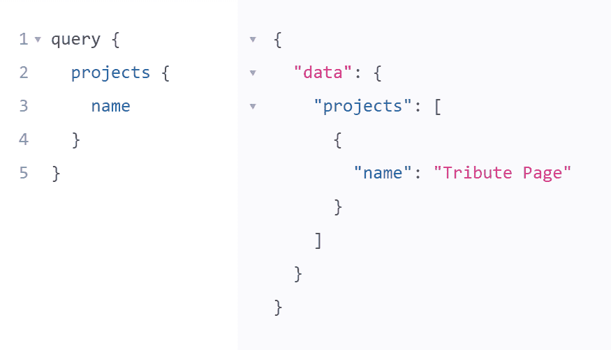

A GraphQL query displaying the query on the left and the results on the right

左边是项目模型中 name 字段的`query`，右边是结果查询中返回的`"data"`。

JavaScript Object Notation (JSON)中返回的查询是客户端可以使用的内容(浏览器、移动应用、店内展示或冰箱)。

## **什么是 GraphCMS？**

GraphCMS 是一个基于 GraphQL 的无头内容管理系统(CMS ),它将让您为您的内容交付建立一个后端。

您可以在几分钟内完成这项工作，只需从提供的模板中单击一个按钮，或者您可以使用简单的用户界面(UI)构建自己的模式。

## **如何设置 GraphCMS**

GraphCMS 的团队为此创建了一个模板，因此设置后端只需一键部署。

您需要首先登录到 [GraphCMS](https://auth.graphcms.com/) 。您可以使用 GitHub 帐户登录或通过其他方式进行鉴定。

登录后，您将看到您的 GraphCMS 仪表板。如果这是你第一次使用 GraphCMS，你可以向下滚动到“创建新项目”部分的“开发者作品集&博客”。选择“开发者作品集&博客”，点击“+创建项目”。

然后，系统会提示我们为项目命名。我准备称之为“作品集和博客”，描述暂时可以留空。您可以选择离您最近的数据中心来托管您的项目。我在英国，所以我会选择英国的数据中心。

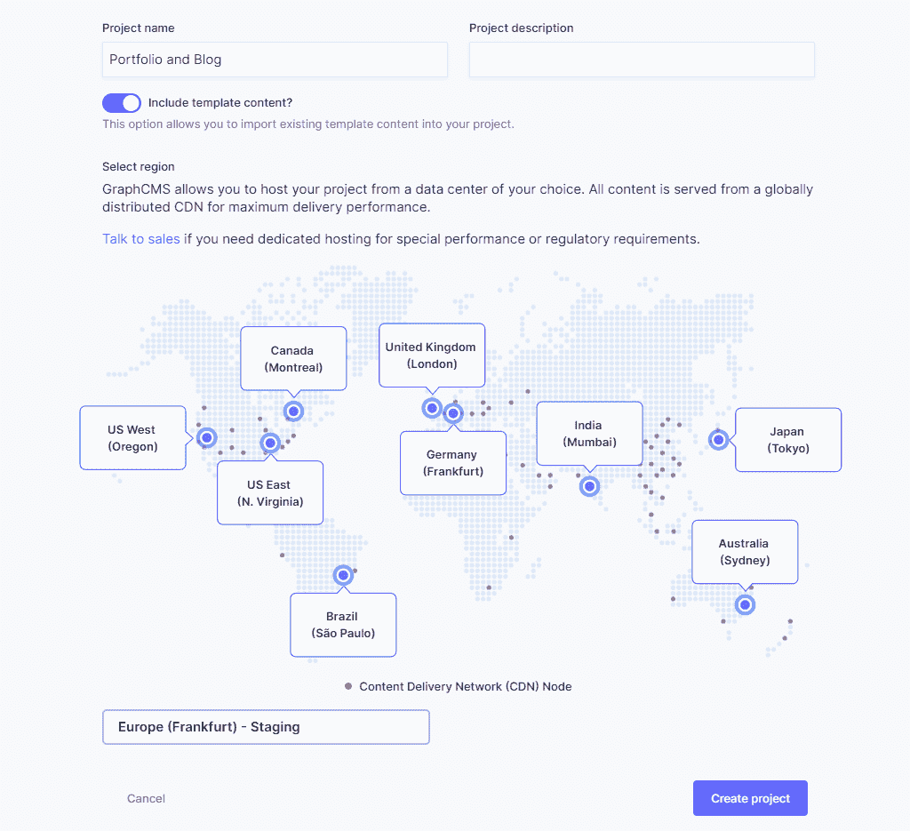

Pick your data centre

请注意，如果您正在添加自己的内容，请切换“包括模板内容？”开着。

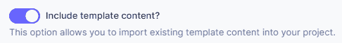

Leave this toggled if you are going to add your content at a later date.

顺便提一下，GraphCMS 的所有内容都是由全球分布的 CDN 提供的，因此不在指定数据中心附近的用户不必担心延迟。

点击页面底部的“创建项目”按钮。

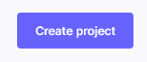

一旦项目配置完成，您将看到您想要使用的计划。选择社区“永远免费”计划。

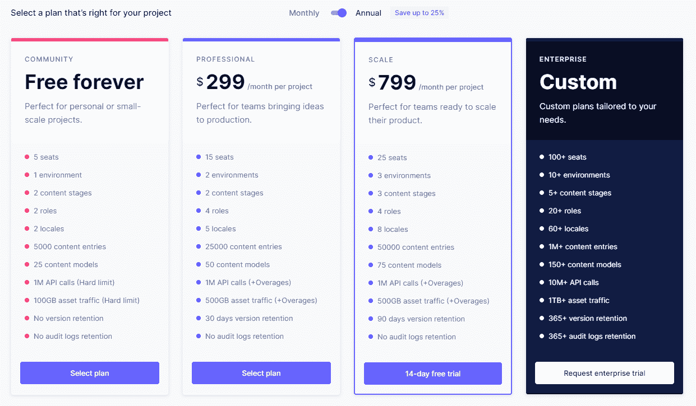

又会有一个提示问你要不要邀请队友。只需选择“稍后邀请”。

GraphCMS 仪表板将如下所示。所有的项目部分都在左边的面板上。在下一部分，我们将看看这些。

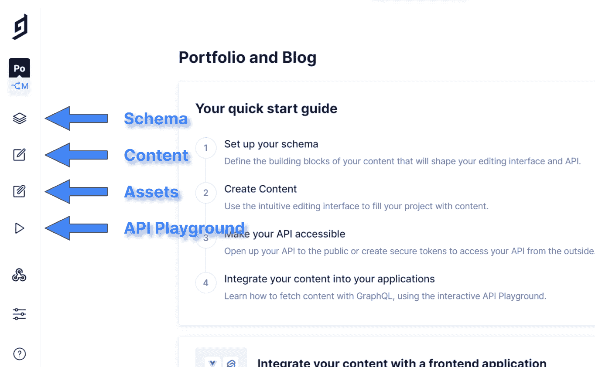

The GraphCMS dashboard with arrows pointing to the Schema, Content, Assets and API Playground sections.

## 如何查询内容

让我们制作第一个 GraphQL 查询。这将是添加到 CMS 的项目模型中的所有项目的列表。

转到 API playground，在 GraphQL playground 中的“New Query”选项卡中输入以下 GraphQL 查询。

```
query GetProjects {
  projects {
    name
    slug
    description
    demo
    sourceCode
    image {
      url
    }
  }
}
```

*Query all projects in the GraphCMS project model*

该查询选择了`projects`模型，然后选择了该模型中包含的每个字段。

## **如何创建你的苗条计划**

如果你正在使用 Gitpod，你可以跳到创建一个`.env`文件。如果您正在本地设置，那么让我们开始吧。从终端，我们可以用下面的`npm`命令创建我们的项目:

```
npm init svelte@next my-developer-portfolio
```

在 CLI 中，我将选择以下选项:

```
? Which Svelte app template? › - Use arrow-keys. Return to submit.
    SvelteKit demo app
❯   Skeleton project
? Use TypeScript? › No
? Add ESLint for code linting? › No
? Add Prettier for code formatting? › Yes
```

我将遵循 CLI 中的其余说明。如果您看一下 CLI 的输出，您还会注意到我们将很快利用的几个其他功能。下面是我的输出结果:

```
Your project is ready!
✔ Prettier
  https://prettier.io/docs/en/options.html
  https://github.com/sveltejs/prettier-plugin-svelte#options

Install community-maintained integrations:
  https://github.com/svelte-add/svelte-adders

Next steps:
  1: cd my-developer-portfolio
  2: npm install (or pnpm install, etc)
  3: git init && git add -A && git commit -m "Initial commit" (optional)
  4: npm run dev -- --open

To close the dev server, hit Ctrl-C

Stuck? Visit us at https://svelte.dev/chat
```

请注意“安装社区维护的集成”部分，我们稍后将使用其中一个来添加顺风。

现在要将目录(CD)更改为项目文件夹，初始化 Git 存储库，并安装依赖项:

```
# cd into project directory
cd my-developer-portfolio
# initialise a new git repo and make first commit
git init && git add -A && git commit -m "Initial commit"
# install dependencies
npm install # or 'npm i' for shorthand
```

我将打开我的文本编辑器并签出该项目。我已经安装了 VS 代码，所以使用`code`命令将打开它，`.`指定了当前目录:

```
code .
```

Open VS Code

是时候检查一切是否如预期的那样启动和运行了，所以让我们启动开发服务器:

```
# start the dev server
npm run dev
```

既然我们已经验证了一切都按预期运行，那么是时候创建一个`.env`文件了。这是 GraphQL API URL 将要存在的地方。如果您愿意，可以使用文本编辑器用户界面(UI)创建该文件。我将从项目的根目录使用以下命令来创建文件:

```
# Ctrl-c to stop the dev server
touch .env
echo VITE_GRAPHQL_API= >> .env
```

来自终端的命令是创建一个`.env`文件，然后将`VITE_GRAPHQL_API=`添加到该文件中。

在`.env`文件中，添加来自 GraphCMS 项目的“内容 API”URL。

可以从边栏访问设置面板:


GraphCMS project settings

然后是“API 访问”:

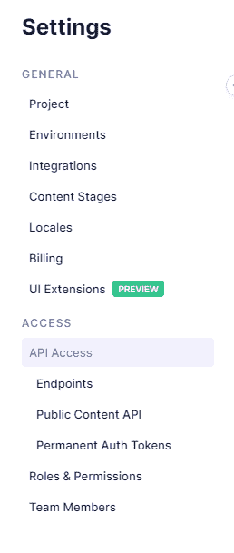

然后点击“内容 API”URL。这会将它复制到剪贴板上:

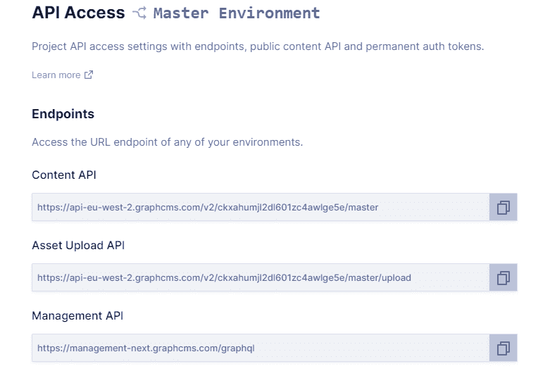

Select the content API URL

现在将它添加到`.env`文件中。它现在应该看起来像这样:

```
VITE_GRAPHQL_API=https://api-region.graphcms.com/v2/projectid/master
```

## 如何在索引页面上显示 GraphQL 数据

让我们向 GraphQL API 发出第一个请求！

首先，为了获取页面上的一些数据，我们将从索引页面向 GraphQL API 发出请求。

为此，我们需要安装几个依赖项，`graphql-request`和`graphql`。`graphql-request`是我们将用来向 GraphQL API 发送 GraphQL 查询的工具。`graphql`是 GraphQL 语言的 JavaScript 实现。

```
npm i -D graphql-request graphql
```

注意安装命令中的`-D`。这是因为 Svelte 不需要任何运行时依赖，因为它在将代码发送到浏览器之前会预先编译代码。

让我们首先添加一个带有模块`<script context="module">`上下文的脚本块，并从`graphql-request`导入`gql`标签和`GraphQLClient`。

我们还将定义一个 SvelteKit 加载函数。这是为了让我们可以在页面挂载(加载)之前从 API 获取数据。

```
<script context="module">
  import { gql, GraphQLClient } from 'graphql-request'

  export const load = async () => {

  }
</script> 
```

`src/routes/index.svelte` Define a SvelteKit load function to use a GraphQL client

在 SvelteKit `load`函数中，我们可以定义一个新的 GraphQL 客户端。客户端接受一个 URL(graph CMS API URL)和一个 options 对象。

我们将放入之前创建的`VITE_GRAPHQL_API`。注意，变量以`VITE_`开头，这意味着 Vite 可以使用这个变量。我们需要用`import.meta.env`导入它，它看起来应该很像这样:

```
<script context="module">
  import { gql, GraphQLClient } from 'graphql-request'

  export const load = async () => {
    const client = new GraphQLClient(
      import.meta.env.VITE_GRAPHQL_API
    )
</script> 
```

`src/routes/index.svelte`

既然已经定义了客户机，我们可以用它向 GraphCMS GraphQL API 传递查询。

以我们之前为查询所有项目所做的查询为例，我们可以将其添加到一个`query`变量中，以便与我们定义的 GraphQL 客户端一起使用。

该查询在反斜线`gql`中使用 GraphQL `gql`语言标记。然后我们可以从 GraphQL 客户端得到的`await`响应中析构项目:

```
<script context="module">
  import { gql, GraphQLClient } from 'graphql-request'

  export const load = async () => {
    const client = new GraphQLClient(
      import.meta.env.VITE_GRAPHQL_API
    )

    const query = gql`
      query GetProjects {
        projects {
          name
          slug
          description
          demo
          sourceCode
          image {
            url
          }
        }
      }
    `

    const { projects } = await client.request(query)
  }
</script> 
```

`src/routes/index.svelte`

既然客户机已经有了查询，我们可以从客户机`projects`的响应中返回数据，并将它们作为供页面使用的道具返回。

来自 GraphQL API 的数据现在可以作为`load`函数的返回中的`props`传递给页面:

```
<script context="module">
  import { gql, GraphQLClient } from 'graphql-request'

  export const load = async () => {
    const client = new GraphQLClient(
      import.meta.env.VITE_GRAPHQL_API
    )

    const query = gql`
      query GetProjects {
        projects {
          name
          slug
          description
          demo
          sourceCode
          image {
            url
          }
        }
      }
    `

    const { projects } = await client.request(query)

    return {
      props: {
        projects,
      },
    }
  }
</script> 
```

`src/routes/index.svelte`

现在数据被返回，我们需要把它带入页面。

我们可以在页面上的`<script>`标签中这样做。是的，有两组脚本标签——第一组`<script context="module">`在页面加载(或挂载)前运行 SvelteKit `load`函数，然后常规的`<script>`标签定义`index.svelte`文件上需要的任何 JavaScript，并接受`props`即`projects`。

在这里的最后一部分，我们接受从`load`函数返回的`projects`，在`<script>`标签中有`export let projects`。现在可以在页面中使用该变量了。

为了便于说明，我将变量`projects`添加到标签`<pre>`中，并用`{JSON.stringify(projects, null, 2)}`将结果字符串化。这是暂时的，以便我们可以验证和可视化进入页面的数据。

```
<script context="module">
  import { gql, GraphQLClient } from 'graphql-request'

  export const load = async () => {
    const client = new GraphQLClient(
      import.meta.env.VITE_GRAPHQL_API
    )

    const query = gql`
      query GetProjects {
        projects {
          name
          slug
          description
          demo
          sourceCode
          image {
            url
          }
        }
      }
    `

    const { projects } = await client.request(query)

    return {
      props: {
        projects,
      },
    }
  }
</script>

<script>
  export let projects
</script>

<pre>{JSON.stringify(projects, null, 2)}</pre> 
```

`src/routes/index.svelte`

是时候启动开发服务器了，看看现在情况如何:

```
npm run dev
```

下面的输出看起来非常类似于我们之前在 GraphQL playground 中创建的项目 GraphQL 的输出:

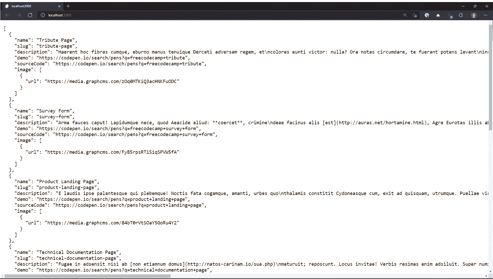

localhost output after running `npm run dev`

我知道我已经帮你走完了每一步。这是为了突出我们正在做的不同部分。

对于项目的其余部分，这将是一个类似的模式。

以下步骤将如下所示:

1.  创建一个 GraphQL 查询来定义所需的数据。
2.  将查询提供给 GraphQL 客户端。
3.  在页面中处理从客户端返回的数据。

### 重构 GraphQL 客户端

因为我们将在不止一个页面中使用 GraphQL 客户端，所以是时候将它移到自己的文件中，以便它可以在整个项目中重用。

Svelte 有一个`lib`文件夹来存放在整个项目中重复使用的文件，但是还没有一个文件夹(或者目录，如果你喜欢这个术语的话)——所以是时候创建一个了。我们可以为 GraphQL 客户端创建一个`graphql-client.js`文件:

```
# make the folder
mkdir src/lib
# create the file
touch src/lib/graphql-client.js
```

现在将客户机从索引页面移到新创建的`src/lib/graphql-client.js`文件:

```
import { GraphQLClient } from 'graphql-request'
const GRAPHQL_ENDPOINT = import.meta.env.VITE_GRAPHQL_API

export const client = new GraphQLClient(GRAPHQL_ENDPOINT) 
```

`src/lib/graphql-client.js`

在`src/routes/index.svelte`中，我可以删除客户端的初始化，并从 lib 文件夹中新创建的文件导入客户端。

区别就在这里。如果您不熟悉 Git diff，那么这些行旁边的`+`和`-`意味着这些行被添加(`+`)或删除(`-`):

```
<script context="module">
+  import { client } from '$lib/graphql-client'
-  import { gql, GraphQLClient } from 'graphql-request'
+  import { gql } from 'graphql-request'

  export const load = async () => {
-   const client = new GraphQLClient(import.meta.env.VITE_GRAPHQL_API)

    const query = gql`
      query GetProjects {
        projects {
          name
          slug
          description
          demo
          sourceCode
          image {
            url
          }
        }
      }
    `

    const { projects } = await client.request(query)

    return {
      props: {
        projects,
      },
    }
  }
</script>

<script>
  export let projects
</script>

<pre>{JSON.stringify(projects, null, 2)}</pre>
```

完成后，我们可以开始在索引页面中使用重构的客户端。

在进入下一节之前，让我们提交对 Git 的更改:

```
git add .
git commit -m "Show GraphQL data on index page"
```

## 如何为索引页添加 M **arkup**

到目前为止，我们实际上只在 pre 标记中显示了来自 API 端点的数据。是时候通过将 GraphQL API 返回的数据分成索引页面上的几个部分来改变这种情况了。

所以让我们从移除`<pre>`标签开始，为页面标题添加一个`<h1>`，然后在一个`<div>`中，我们可以使用一个苗条的表达式通过苗条的`{#each}`来循环数据。

each 表达式接受`projects`对象。然后你可以使用一个变量，比如说`project`，你可以引用这个变量的各种属性。

这里有一个例子可以说明这一点:

```
{#each projects as project}
  <div>
    
    <a href={`/projects/${project.slug}`}>
      <div>
        <h2>{project.name}</h2>
        <p>
          {project.description.slice(0, 80)}...
        </p>
      </div>
    </a>
  </div>
{/each}
```

为了更进一步，我们可以从循环的那个部分分解属性，这样就不需要引用来自`project`的特定属性。

请注意，`image.url`在这里也被解结构了。

所以我们可以用这个来代替`{#each projects as project}``{#each projects as { name, slug, description, image }}`。

下面是`src/routes/index.svelte`文件现在的样子:

```
<script context="module">
  import { client } from '$lib/graphql-client'
  import { gql } from 'graphql-request'

  export const load = async () => {
    const query = gql`
      query GetProjects {
        projects {
          name
          slug
          description
          tags
          demo
          sourceCode
          image {
            url
          }
        }
      }
    `
    const { projects } = await client.request(query)

    return {
      props: {
        projects,
      },
    }
  }
</script>

<script>
  export let projects
</script>

<h1>Recent Projects by Me</h1>

<div>
  {#each projects as { name, slug, description, image }}
    <div>
      
      <a href={`/projects/${slug}`}>
        <div>
          <h2>{name}</h2>
          <p>
            {description.slice(0, 80)}...
          </p>
        </div>
      </a>
    </div>
  {/each}
</div> 
```

`src/routes/index.svelte`

## 如何构建第一个苗条的组件

我们现在要做的是制作我们的第一个细长组件。这将是我们在最后一个代码块中制作的项目卡。

这样我们就可以在项目的其他部分重用这些代码。因此，这将是我们在索引页面上显示每个项目所做的`{#each}`循环中的所有内容，这里的这一部分:

```
<div>
  
  <a href={`/projects/${slug}`}>
    <div>
      <h2>{name}</h2>
      <p>
        {description.slice(0, 80)}...
      </p>
    </div>
  </a>
</div>
```

让我们创建一个`lib`文件夹，并在该文件夹中放置一个`project-card.svelte`组件:

```
# make components folder
mkdir src/lib/components
# create the component file
touch src/lib/components/project-card.svelte
```

在该文件中，我们现在可以为项目卡添加标记:

```
<div>
  
  <a href={`/projects/${slug}`}>
    <div>
      <h2>{name}</h2>
      <p>
        {description.slice(0, 80)}...
      </p>
    </div>
  </a>
</div>
```

`src/lib/project-card.svelte`

此时的标记包含图像 URL、项目名称和描述的变量。目前这是行不通的，因为这些变量在任何地方都没有被引用。

在一些`<script>`标签中，我们可以定义组件所期望的变量。

```
<script>
  export let url = ''
  export let name = ''
  export let slug = ''
  export let description = ''
</script>

<div>
  
  <a href={`/projects/${slug}`}>
    <div>
      <h2>{name}</h2>
      <p>
        {description.slice(0, 80)}...
      </p>
    </div>
  </a>
</div> 
```

`src/lib/project-card.svelte`

现在组件已经准备好接受项目的变量，我们可以将它们传递到索引页面上的组件中。

```
<script context="module">
  import ProjectCard from '$lib/components/project-card.svelte'
  import { client } from '$lib/graphql-client'
  import { gql } from 'graphql-request'

  export const load = async () => {
    const query = gql`
      query GetProjects {
        projects {
          name
          slug
          description
          tags
          demo
          sourceCode
          image {
            url
          }
        }
      }
    `
    const { projects } = await client.request(query)

    return {
      props: {
        projects,
      },
    }
  }
</script>

<script>
  export let projects
</script>

<h1>Recent Projects by Me</h1>

<div>
  {#each projects as { name, slug, description, image }}
    <ProjectCard {name} {description} url={image[0].url} {slug} />
  {/each}
</div> 
```

`src/routes/index.svelte`

组件被导入到`<script>`标签之间，然后循环中的单个变量被传递给它。

让我们快速看一下被传递的变量。它们可以这样定义:

```
<ProjectCard
  name={name}
  description={description}
  url={image[0].url}
  slug={slug}
/>
```

因为组件上预期的属性与被传递的属性相同，所以不需要标记属性。这是我们可以利用的:

```
<ProjectCard {name} {description} url={image[0].url} {slug} />
```

注意,`image`属性是一个数组(因为项目可以拍摄多个图像),所以我们引用该数组的第一个索引。

让我们在进入下一部分之前提交这个:

```
git add .
git commit -m "Add first component"
```

## 如何塑造苗条的身材

由于 Svelte 是 HTML 的超集，这意味着您可以像在 HTML 文件中一样样式化您的`.svelte`文件。

在文件底部添加一些`<style>`标签意味着您可以对页面上的元素进行样式化:

```
<p>Hello Svelte</p>

<style>
  p {
    color: red;
    font-size: 2rem;
  }
</style>
```

这将使用红色字体和 2rem 的字体大小对该文件中的所有`<p>`元素进行样式化。

通过这种方式，您可以获得很大的控制权，允许您单独为该文件指定 stiles。

这只是一个例子，这不是我将如何做这个项目的风格。我选择了顺风 CSS。

## 如何用顺风和 DaisyUI 设计风格

造型是一个非常固执己见的个人话题，所以我要做的可能不符合你的想法。

出于这个原因，我将保持最少的造型，尽量不要太关注它。

我将使用 [Tailwind CSS](https://tailwindcss.com/) 和 [daisyUI](https://daisyui.com/) 来提高我创建组件和样式的速度。如果这不适合你，你可以按照上一节的建议继续设计。

我将使用`svelte-add`来配置项目以使用 TailwindCSS。我前面提到的细长加法器项目通过一个`npm`命令为您完成所有配置:

```
npx svelte-add@latest tailwindcss
# install configured dependencies
npm i
```

`svelte-add`命令将项目配置为使用 Tailwind。它还在`src/routes`中添加了一个名为`__layout.svelte`的文件——我们很快就会谈到这个。现在我们知道它就在那里，我们将在接下来的部分中使用它。

我还将使用几个 TailwindCSS 插件——这些是 daisyUI 和 TailwindCSS 排版插件。

daisyUI 是一个很好的预制组件资源，你可以从网站上挑选出一些组件。这就是我将要为页眉和页脚组件做的事情。

顺风 CSS 排版对于我们从 API 获取的内容的样式非常有用。这是来自顺风实验室团队的一组很棒的默认值。

我将通过终端安装它们:

```
npm i -D @tailwindcss/typography daisyui
```

然后我可以在`tailwind.config.cjs`文件中配置它们:

```
plugins: [
  require('@tailwindcss/typography'),
  require('daisyui'),
],
```

The `tailwind.config.cjs` plugins config.

TailwindCSS 排版插件需要一些额外的配置来移除最大宽度。完整的`tailwind.config.cjs`看起来是这样的:

```
const config = {
  content: ['./src/**/*.{html,js,svelte,ts}'],

  theme: {
    extend: {
      typography: {
        DEFAULT: {
          css: {
            maxWidth: null,
          },
        },
      },
    },
  },

  plugins: [require('@tailwindcss/typography'), require('daisyui')],
}

module.exports = config 
```

`tailwind.config.cjs`

让我们启动开发服务器并验证安装。项目字体现在会有所不同。

提交更改，我们将进入下一部分:

```
git add .
git commit -m "Add Tailwind CSS and daisyUI"
```

## 如何设计项目组件的样式

好了，现在我可以为`src/components/project-card.svelte`文件添加一些样式了。

这使用了几个顺风类，可能会和我们从 daisyUI 得到的预打包类有所不同:

```
<script>
  export let url = ''
  export let name = ''
  export let slug = ''
  export let description = ''
</script>

<div class="relative group card shadow-2xl col-span-2">
  
  <a href={`/projects/${slug}`}>
    <div
      class="absolute bottom-0 left-0 right-0 lg:opacity-0 group-hover:opacity-100 bg-primary p-4 duration-300 text-primary-content"
    >
      <h2 class="font-bold lg:text-xl">{name}</h2>
      <p class="text-sm lg:text-xl">
        {description.slice(0, 80)}...
      </p>
    </div>
  </a>
</div> 
```

在包含 div 上，我们添加了一个`relative`位置，然后使用 Tailwind `group`类在包含描述内容的 div 上应用`group-hover`。

因为包含 div 上有一个`relative`位置，所以我们可以用`bottom-0`、`left-0`和`right-0`将描述 div 放置在包含 div 的底部，这样它就跨越了包含 div 的底部。

`lg:`类是这样的，当用户在较小的屏幕上时，不管鼠标悬停与否，div 都会显示。

让我们把它提交到下一部分:

```
git add .
git commit -m "Style Projects component"
```

## 如何使用 SvelteKit `__layout`文件

对于全球风格，我们可以使用特殊的 SvelteKit `__layout.svelte`文件。我们可以使用它来控制全局样式，还可以获得您想要传递给项目中使用的任何页面或组件的外部信息。

现在，让我们为响应屏幕尺寸添加一些容器类:

```
<script>
  import '../app.css'
</script>

<main class="container max-w-3xl mx-auto px-4 mb-20">
  <slot />
</main> 
```

`src/routes/__layout.svelte`

将它提交给 Git，然后进入下一部分:

```
git add .
git commit -m "Add layout container CSS classes"
```

## **如何建立列出项目的登陆页面**

让我们从登录页面开始。在登录页面上，我们想要显示一些关于作者和项目的信息。

我们已经在`src/routes/index.svelte`页面上定义并使用了项目查询。我们还想从`author`模型中获取数据，用于索引页面。

我们需要做的是在`src/routes/index.svelte`页面的 load 函数中为作者创建另一个 GraphQL 查询。现在让我们跳到 GraphCMS GraphQL 领域，并对其进行定义:

```
query GetAuthors {
  authors {
    name
    intro
    bio
    slug
    picture {
      url
    }
  }
}
```

好，我们有一个项目查询和一个作者查询。现在开始用这两个查询获取数据！

为了实现这一点，我们将使用 JavaScript `[Promise.all](https://developer.mozilla.org/en-US/docs/Web/JavaScript/Reference/Global_Objects/Promise/all)`方法从两个端点获取数据，并将它们返回给项目使用。

```
<script context="module">
  import ProjectCard from '$lib/components/project-card.svelte'
  import { client } from '$lib/graphql-client'
  import { gql } from 'graphql-request'

  export const load = async () => {
    const authorsQuery = gql`
      query GetAuthors {
        authors {
          name
          intro
          bio
          slug
          picture {
            url
          }
        }
      }
    `
    const projectsQuery = gql`
      query GetProjects {
        projects {
          name
          slug
          description
          tags
          demo
          sourceCode
          image {
            url
          }
        }
      }
    `
    const [authorReq, projectsReq] = await Promise.all([
      client.request(authorsQuery),
      client.request(projectsQuery),
    ])
    const { authors } = authorReq
    const { projects } = projectsReq

    return {
      props: {
        projects,
        authors,
      },
    }
  }
</script>

<script>
  export let projects
  export let authors
</script>

<h1 class="font-bold text-center mb-20 text-5xl">
  Welcome to my Portfolio
</h1>

{#each authors as { name, intro, picture: { url } }}
  <div class="flex mb-40 items-end">
    <div class="mr-6">
      <h2 class="text-3xl mb-4 font-bold tracking-wider">{name}</h2>
      <p class="text-xl mb-4">{intro}</p>
    </div>

    
  </div>
{/each}

<div
  class="grid gap-10 md:grid-cols-4 md:px-10 lg:grid-cols-6 lg:-mx-52"
>
  {#each projects as { name, slug, description, image }}
    <ProjectCard {name} {description} url={image[0].url} {slug} />
  {/each}
</div> 
```

`src/routes/index.svelte`

哇！现在这里有很多。

这两个 GraphQL 查询确实在 load 函数中占用了大量空间。让我们花点时间在这里重构它们，这样它们就可以用在其他地方。这也将有助于清理这个页面，因为 GraphQL 查询占据了大部分文件，它现在变得有点忙。

### 如何重构 GraphQL 查询

让我们抓住文件顶部的两个查询，这两个:

```
const authorsQuery = gql`
  query GetAuthors {
    authors {
      name
      intro
      bio
      slug
      picture {
        url
      }
    }
  }
`
const projectsQuery = gql`
  query GetProjects {
    projects {
      name
      slug
      description
      tags
      demo
      sourceCode
      image {
        url
      }
    }
  }
` 
```

The two GraphQL queries on the `src/routes/index.svelte` file

并将它们添加到自己的 JavaScript 文件中。让我们现在创建它:

```
# create the graphql-queries.js file
touch src/lib/graphql-queries.js
```

然后我们可以从`src/routes/index.svelte`文件中提取查询，并将它们添加到那里:

```
import { gql } from 'graphql-request'

export const authorsQuery = gql`
  query GetAuthors {
    authors {
      name
      intro
      bio
      slug
      picture {
        url
      }
    }
  }
`

export const projectsQuery = gql`
  query GetProjects {
    projects {
      name
      slug
      description
      tags
      demo
      sourceCode
      image {
        url
      }
    }
  }
` 
```

注意，他们现在在`const`前面有`export`。这样它们可以从这个文件中导出，用于`src/routes.index.svelte`文件。

在`src/routes.index.svelte`中，我现在可以导入这些查询，通过删除 load 函数中查询的所有干扰来稍微清理一下文件。现在应该是这样的:

```
<script context="module">
  import ProjectCard from '$lib/components/project-card.svelte'
  import { client } from '$lib/graphql-client'
  import { authorsQuery, projectsQuery } from '$lib/graphql-queries'

  export const load = async () => {
    const [authorReq, projectsReq] = await Promise.all([
      client.request(authorsQuery),
      client.request(projectsQuery),
    ])
    const { authors } = authorReq
    const { projects } = projectsReq

    return {
      props: {
        projects,
        authors,
      },
    }
  }
</script>

<script>
  export let projects
  export let authors
</script>

<svelte:head>
  <title>My Portfolio project</title>
</svelte:head>

<h1 class="font-bold text-center mb-20 text-5xl">
  Welcome to my Portfolio
</h1>

{#each authors as { name, intro, picture: { url } }}
  <div class="flex mb-40 items-end">
    <div class="mr-6">
      <h2 class="text-3xl mb-4 font-bold tracking-wider">{name}</h2>
      <p class="text-xl mb-4">{intro}</p>
    </div>

    
  </div>
{/each}

<div
  class="grid gap-10 md:grid-cols-4 md:px-10 lg:grid-cols-6 lg:-mx-52"
>
  {#each projects as { name, slug, description, image }}
    <ProjectCard {name} {description} url={image[0].url} {slug} />
  {/each}
</div> 
```

哇哦。这个`<svelte:head>`在这里做什么？

细长的头部 API 允许我们将 HTML 元数据添加到项目中——因此，像上面例子中的页面标题这样的标签，还有谷歌、脸书和推特的元标签。还有[货币化](https://webmonetization.org/)。

这个实现将为浏览器选项卡提供一个标题“我的投资组合项目”。

除了这里添加的 head 组件之外，我们还使用来自`authors`查询的数据在 GraphCMS 上显示来自 authors 模型的数据。

将更改提交给 Git:

```
git add .
git commit -m "Landing page with projects listed"
```

好的，很好——我们已经完成了登陆页面的排序。

## 如何使用 SvelteKit 路由

现在我们有了一个很好的登录页面，上面有项目链接。但是点击链接会把我们带到 404 页面。那是因为那个页面的路由还不存在。

让我们现在就创建它。我们将使用 SvelteKit [基于文件的路由](https://kit.svelte.dev/docs#routing-pages)来完成这项工作。

我们需要创建一个文件，该文件将从项目卡中取出`slug`,并将其用作项目的路径。我们可以先制作文件:

```
# make the projects folder
mkdir src/routes/projects
# create the [slug].svelte file
touch src/routes/projects/'[slug]'.svelte 
```

在`src/routes/projects/[slug].svelte`中，我们可以定义一个接收上下文变量的 SvelteKit 加载函数。让我们先来看看在上下文变量中我们得到了什么:

```
<script context="module">
  export const load = async context => {
    console.log('=====================')
    console.log('context', context)
    console.log('=====================')
    return {}
  }
</script>
```

刷新 [`localhost:3000/projects/survey-form`](http://localhost:3000/projects/survey-form) 的进路会在终端给出如下输出:

```
=====================
context {
  url: URL {
    href: 'http://localhost:3000/projects/survey-form',
    origin: 'http://localhost:3000',
    protocol: 'http:',
    username: '',
    password: '',
    host: 'localhost:3000',
    hostname: 'localhost',
    port: '3000',
    pathname: '/projects/survey-form',
    search: '',
    searchParams: URLSearchParams {},
    hash: ''
  },
  params: { slug: 'survey-form' },
  props: {},
  session: [Getter],
  fetch: [AsyncFunction: fetch],
  stuff: {}
}
=====================
```

这里我们感兴趣的是`params.slug`属性，我们可以用它来查询 GraphQL API。

让我们转到 GraphCMS 项目中的 GraphQL 领域。在这里，我们将进行一个查询来过滤一个项目，其中的`slug`与 SvelteKit load 函数返回的内容相匹配:

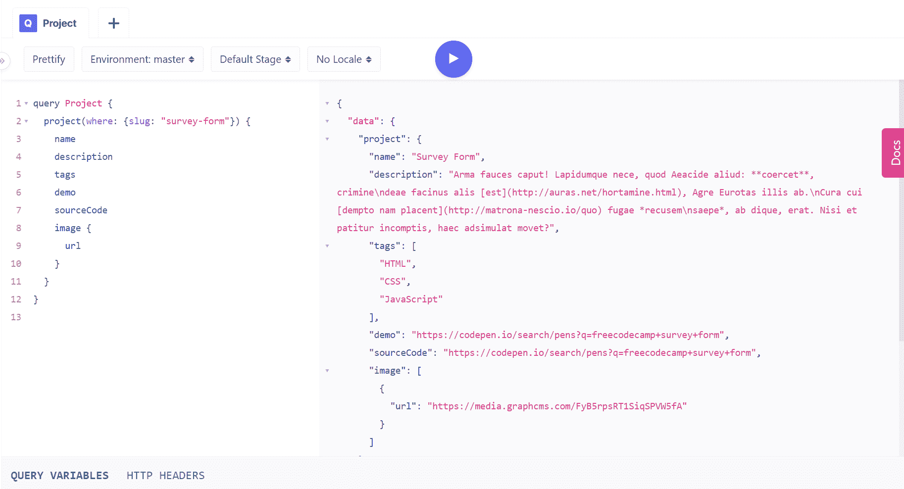

GraphQL query to query for project where slug matches "survey-form"

在图中，我定义了一个查询来过滤`slug`字段，其中`"survey-form"`被传递给查询。

这对于一个查询来说很好，但是我们需要一种方法来为我们拥有的每个单独的项目段将变量传递给查询。现在让我们来看看在 GraphQL 中使用变量。

我将在查询名称的末尾添加一些括号，在这些括号中，我将定义一个变量`query GetProject($slug: String!) {`。`$`表示它是一个变量，而`: String!`表示变量的数据类型。

因为 GraphQL 是强类型的，所以需要对其进行定义，以便 GraphQL 知道如何使用该变量。结尾的感叹号`!`表示该变量是查询工作所必需的。

现在我可以用这个变量代替我之前使用的硬编码的`"survey-form"`:

```
query GetProject($slug: String!) {
  project(where: {slug: $slug}) {
    name
    description
    tags
    demo
    sourceCode
    image {
      url
    }
  }
}
```

如果我现在尝试运行该查询，我会得到以下错误:

```
{
  "errors": [
    {
      "message": "variable 'slug' must be defined"
    }
  ],
  "data": null,
}
```

因此，为了让它在 GraphQL 平台上运行，我可以使用“查询变量”面板，您可能已经在上一张图片中注意到了。单击它将打开面板，我可以在那里添加变量值:

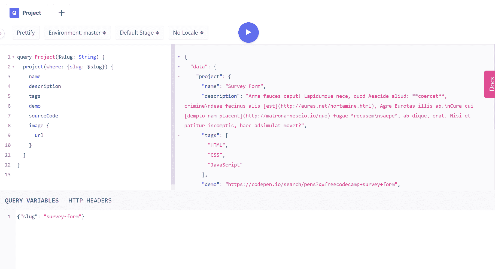

现在，使用查询面板中定义的 slug 变量，我可以运行查询了。

好的，太好了！我如何在项目中使用它？

很棒的问题！我希望有一种方法将查询变量和查询一起传递给 GraphQL 客户端。

我们可以像对索引页面那样做。现在这是相同的重复模式——这一次我们将接受在我定义的查询中使用的`slug`变量。

在我们开始之前，让我们将项目查询添加到`src/lib/graphql-queries.js`文件中:

```
import { gql } from 'graphql-request'

export const authorsQuery = gql`
  query GetAuthors {
    authors {
      name
      intro
      bio
      slug
      picture {
        url
      }
    }
  }
`

export const projectsQuery = gql`
  query GetProjects {
    projects {
      name
      slug
      description
      tags
      demo
      sourceCode
      image {
        url
      }
    }
  }
`

export const projectQuery = gql`
  query GetProject($slug: String!) {
    project(where: { slug: $slug }) {
      name
      slug
      description
      tags
      demo
      sourceCode
      image {
        url
      }
    }
  }
`
```

因此，这个文件中有一些重复，现在，`name`、`slug`、`description`、`tags`、`demo`、`sourceCode`和`image.url`在`Projects`和`Project`查询中重复出现。

我们可以在这里使用一个 [GraphQL 片段](https://graphql.org/learn/queries/#fragments)来重用模型上的字段。它看起来是这样的:

```
const PROJECT_FRAGMENT = gql`
  fragment ProjectDetails on Project {
    name
    slug
    description
    tags
    demo
    sourceCode
    image {
      url
    }
  }
`
```

现在所有的字段都在一个查询中，这个片段被命名为`ProjectDetails`，这就是`on``Project`模型。现在可以通过将`ProjectDetails`扩展(`...`)到查询中，在`Projects`和`Project`查询中使用:

```
import { gql } from 'graphql-request'

export const authorsQuery = gql`
  query GetAuthors {
    authors {
      name
      intro
      bio
      slug
      picture {
        url
      }
    }
  }
`

const PROJECT_FRAGMENT = gql`
  fragment ProjectDetails on Project {
    name
    slug
    description
    tags
    demo
    sourceCode
    image {
      url
    }
  }
`

export const projectsQuery = gql`
  ${PROJECT_FRAGMENT}
  query GetProjects {
    projects {
      ...ProjectDetails
    }
  }
`

export const projectQuery = gql`
  ${PROJECT_FRAGMENT}
  query GetProject($slug: String!) {
    project(where: { slug: $slug }) {
      ...ProjectDetails
    }
  }
`
```

在我们继续之前，我现在需要做的一件事是为项目描述的降价内容使用一个依赖项。

这是为了获取项目描述的 Markdown 内容，并将其转换为 HTML，以便可以在页面上显示。我将在这里使用`marked`:

```
npm i -D marked
```

既然已经定义了查询，我们可以在`src/routes/projects/[slug].svelte`文件中使用它:

```
<script context="module">
  import { client } from '$lib/graphql-client'
  import { projectQuery } from '$lib/graphql-queries'
  import { marked } from 'marked'

  export const load = async ({ params }) => {
    const { slug } = params
    const variables = { slug }
    const { project } = await client.request(projectQuery, variables)

    return {
      props: {
        project,
      },
    }
  }
</script>

<script>
  export let project
</script>

<svelte:head>
  <title>My Portfolio | {project.name}</title>
</svelte:head>

<div class="sm:-mx-5 md:-mx-10 lg:-mx-20 xl:-mx-38 mb-5">
  
</div>

<h1 class="text-4xl font-semibold mb-5">{project.name}</h1>

<div class="mb-5 flex justify-between">
  <div>
    {#if project.tags}
      {#each project.tags as tag}
        <span
          class="badge badge-primary mr-2 hover:bg-primary-focus cursor-pointer"
          >{tag}</span
        >
      {/each}
    {/if}
  </div>
</div>

<div
  class="mb-5 prose flex prose-a:text-primary hover:prose-a:text-primary-focus"
>
  <a class="mr-5" href={project.demo}>Demo</a>
  <a href={project.sourceCode}>Source Code</a>
</div>

<article class="prose prose-xl">
  {@html marked(project.description)}
</article> 
```

`src/routes/projects/[slug].svelte`

在`src/routes/projects/[slug].svelte`文件中，除了使用`params: { slug }`将 slug 值传递给 GraphQL 客户端以获取与该 slug 相关的数据之外，我们所做的几乎与使用`src/routes/index.svelte`文件相同。

`{@html}`用于将内容显示为 HTML。如果您不信任 HTML 的来源，请谨慎使用——但是在我们的例子中，我们知道我们可以信任 HTML，因为我们把它放在那里！😊

在继续之前，让我们把它提交给 Git:

```
git add .
git commit -m "Add project page using SvelteKit routing"
```

### 如何构建项目索引页面

现在为项目创建一个索引。它很像登录页面，但这次只是列出项目。

我将为项目路线创建一个索引:

```
touch src/routes/projects/index.svelte
```

现在导航到`localhost:3000/projects`将显示该文件。

重复用于在索引页面上获得项目列表但没有作者信息的模式的时间:

```
<script context="module">
  import ProjectCard from '$lib/components/project-card.svelte'
  import { client } from '$lib/graphql-client'
  import { projectsQuery } from '$lib/graphql-queries'

  export const load = async () => {
    const { projects } = await client.request(projectsQuery)

    return {
      props: {
        projects,
      },
    }
  }
</script>

<script>
  export let projects
</script>

<svelte:head>
  <title>My Portfolio projects</title>
</svelte:head>

<h1 class="font-bold mb-20 text-center text-5xl">
  Recent Projects by Me
</h1>

<div
  class="grid gap-10 md:grid-cols-4 md:px-10 lg:grid-cols-6 lg:-mx-52"
>
  {#each projects as { name, slug, description, image }, index}
    <ProjectCard
      {name}
      {description}
      url={image[0].url}
      {index}
      {slug}
    />
  {/each}
</div> 
```

不错！现在导航到`localhost:3000/projects`给我们一个专门的项目页面。

让我们继续重复我们在博客索引页面和个人博客文章中学到的这些模式。

在继续之前提交当前的更改:

```
git add .
git commit -m "Add projects index page"
```

## **如何建立博客**

博客时间到了。这与项目的方法非常相似，但是让我们再来一遍这个过程。

1.  创建一个 GraphQL 查询来定义所需的数据。
2.  将查询提供给 GraphQL 客户端。
3.  在页面中处理从客户端返回的数据。

对文章进行 GraphQL 查询。因为我们将遵循与项目相同的模式(查询所有项目并过滤特定项目)，所以我们可以为我们想要获得的数据创建一个 GraphQL 片段，包括所有帖子和单个帖子。

```
const POST_FRAGMENT = gql`
  fragment PostDetails on Post {
    title
    slug
    date
    content
    tags
    coverImage {
      url
    }
    authors {
      name
    }
  }
`
```

然后，我们可以使用与之前相同的模式，在 Post 和 Post 查询中使用该片段:

```
export const postsQuery = gql`
  ${POST_FRAGMENT}
  query GetPosts {
    posts {
      ...PostDetails
    }
  }
`

export const postQuery = gql`
  ${POST_FRAGMENT}
  query GetPost($slug: String!) {
    post(where: { slug: $slug }) {
      ...PostDetails
    }
  }
`
```

将`POST_FRAGMENT`、`postsQuery`和`postQuery`添加到`src/lib/graphql-queries.js`文件后，我们可以创建一个发布路径，然后添加一个`[slug].svelte`文件和一个`index.svelte`文件。

```
mkdir src/routes/posts
touch src/routes/posts/{'[slug]'.svelte,index.svelte}
```

让我们先处理文章索引页面，然后我们可以使用 slug 文件处理单个文章。

第一部分我们已经做了几次，定义一个 SvelteKit 加载函数，然后使用 GraphQL 客户端查询文章:

```
<script context="module">
  import { client } from '$lib/graphql-client'
  import { postsQuery } from '$lib/graphql-queries'
  import { marked } from 'marked'

  export const load = async () => {
    const { posts } = await client.request(postsQuery)

    return {
      props: {
        posts,
      },
    }
  }
</script>

<script>
  export let posts
</script>

<svelte:head>
  <title>Portfolio | Blog</title>
</svelte:head>
```

`src/routes/posts/index.svelte`

现在我们需要为页面添加标记。使用 daisyUI card 类，我们可以定义一个非常漂亮的卡片，然后遍历 post 标签，最后链接到 post 页面。

```
<h1 class="text-4xl mb-10 font-extrabold">Blog posts</h1>

{#each posts as { title, slug, content, coverImage, tags }}
  <div class="card text-center shadow-2xl mb-20">
    <figure class="">
      
    </figure>
    <div class="card-body prose">
      <h2 class="title">{title}</h2>
      {@html marked(content).slice(0, 150)}
      <div class="flex justify-center mt-5 space-x-2">
        {#each tags as tag}
          <span class="badge badge-primary">{tag}</span>
        {/each}
      </div>
      <div class="justify-center card-actions">
        <a href={`/posts/${slug}`} class="btn btn-outline btn-primary"
          >Read &rArr;</a
        >
      </div>
    </div>
  </div>
{/each} 
```

`src/routes/posts/index.svelte`

又到了重复这个模式的时候了！

SvelteKit 使用 GraphQL 客户端加载函数，传递来自页面参数的 post 查询和变量:

```
<script context="module">
  import { client } from '$lib/graphql-client'
  import { postQuery } from '$lib/graphql-queries'
  import { marked } from 'marked'

  export const load = async ({ params }) => {
    const { slug } = params
    const variables = { slug }
    const { post } = await client.request(postQuery, variables)

    return {
      props: {
        post,
      },
    }
  }
</script>

<script>
  export let post

  const { title, date, tags, content, coverImage } = post
</script>

<svelte:head>
  <title>Blog | {title}</title>
</svelte:head>
```

`src/routes/posts/[slug].svelte`

然后，对于页面上的标记，利用这里的 Tailwind CSS 排版类获得漂亮的标记:

```
<div class="sm:-mx-5 md:-mx-10 lg:-mx-20 xl:-mx-38 mb-5">
  
</div>

<div class="prose prose-xl">
  <h1>{title}</h1>
</div>

<p class="text-secondary text-xs tracking-widest font-semibold">
  {new Date(date).toDateString()}
</p>

<div class="mb-5 flex justify-between">
  <div>
    {#if tags}
      <div class="mt-5 space-x-2">
        {#each tags as tag}
          <span class="badge badge-primary">{tag}</span>
        {/each}
      </div>
    {/if}
  </div>
</div>

<article div class="prose prose-lg">
  {@html marked(content)}
</article>
```

`src/routes/posts/[slug].svelte`

现在提交我们的更改:

```
git add .
git commit -m "Add posts index page and slug page"
```

好了，现在我们在网站上有很多页面要看，但是还没有办法浏览它们。

## 如何构建导航栏和页脚组件

我现在要从 daisyUI 为[页脚](https://daisyui.com/components/footer)和[导航条](https://daisyui.com/components/navbar)抓取一些预制组件。让我们先创建文件，然后再跳到 daisyUI 站点获取它们:

```
touch src/lib/components/{footer.svelte,navbar.svelte}
```

该命令中的花括号为我们创建了这两个文件。

### 如何制作页脚组件

首先，我们可以做页脚组件。我将在 daisyUI 组件页脚部分使用第二个`footer footer-center`组件。看起来是这样的:


下面是该组件的标记:

```
<footer class="p-10 footer bg-base-200 text-base-content footer-center">
  <div class="grid grid-flow-col gap-4">
    <a class="link link-hover">About us</a> 
    <a class="link link-hover">Contact</a> 
    <a class="link link-hover">Jobs</a> 
    <a class="link link-hover">Press kit</a>
  </div> 
  <div>
    <div class="grid grid-flow-col gap-4">
      <a>
        <svg  width="24" height="24" viewBox="0 0 24 24" class="fill-current">
          <path d="M24 4.557c-.883.392-1.832.656-2.828.775 1.017-.609 1.798-1.574 2.165-2.724-.951.564-2.005.974-3.127 1.195-.897-.957-2.178-1.555-3.594-1.555-3.179 0-5.515 2.966-4.797 6.045-4.091-.205-7.719-2.165-10.148-5.144-1.29 2.213-.669 5.108 1.523 6.574-.806-.026-1.566-.247-2.229-.616-.054 2.281 1.581 4.415 3.949 4.89-.693.188-1.452.232-2.224.084.626 1.956 2.444 3.379 4.6 3.419-2.07 1.623-4.678 2.348-7.29 2.04 2.179 1.397 4.768 2.212 7.548 2.212 9.142 0 14.307-7.721 13.995-14.646.962-.695 1.797-1.562 2.457-2.549z"></path>
        </svg>
      </a> 
      <a>
        <svg  width="24" height="24" viewBox="0 0 24 24" class="fill-current">
          <path d="M19.615 3.184c-3.604-.246-11.631-.245-15.23 0-3.897.266-4.356 2.62-4.385 8.816.029 6.185.484 8.549 4.385 8.816 3.6.245 11.626.246 15.23 0 3.897-.266 4.356-2.62 4.385-8.816-.029-6.185-.484-8.549-4.385-8.816zm-10.615 12.816v-8l8 3.993-8 4.007z"></path>
        </svg>
      </a> 
      <a>
        <svg  width="24" height="24" viewBox="0 0 24 24" class="fill-current">
          <path d="M9 8h-3v4h3v12h5v-12h3.642l.358-4h-4v-1.667c0-.955.192-1.333 1.115-1.333h2.885v-5h-3.808c-3.596 0-5.192 1.583-5.192 4.615v3.385z"></path>
        </svg>
      </a>
    </div>
  </div> 
  <div>
    <p>Copyright © 2021 - All right reserved by ACME Industries Ltd</p>
  </div>
</footer> 
```

`src/lib/components/footer.svelte`

这里要注意一点:如果你不喜欢 SVG 直接出现在 HTML 中，它们可以被抽象成自己的组件并导入到页脚文件中。因为 Svelte 是 HTML 的超集，这使得将大文件分解成可管理的组件成为可能。

让我们现在这样做，以减少文件大小，使其更容易解析。因此，首先我将创建图标文件:

```
touch src/lib/components/{twitter-icon.svelte,you-tube-icon.svelte,facebook-icon.svelte}
```

现在我可以从页脚组件中移除`<svg>`标签，并将它们添加到各自的文件中。

这是 Twitter 的样子。您可以对其余组件重复此操作:

```
<svg

  width="24"
  height="24"
  viewBox="0 0 24 24"
  class="fill-current"
>
  <path
    d="M24 4.557c-.883.392-1.832.656-2.828.775 1.017-.609 1.798-1.574 2.165-2.724-.951.564-2.005.974-3.127 1.195-.897-.957-2.178-1.555-3.594-1.555-3.179 0-5.515 2.966-4.797 6.045-4.091-.205-7.719-2.165-10.148-5.144-1.29 2.213-.669 5.108 1.523 6.574-.806-.026-1.566-.247-2.229-.616-.054 2.281 1.581 4.415 3.949 4.89-.693.188-1.452.232-2.224.084.626 1.956 2.444 3.379 4.6 3.419-2.07 1.623-4.678 2.348-7.29 2.04 2.179 1.397 4.768 2.212 7.548 2.212 9.142 0 14.307-7.721 13.995-14.646.962-.695 1.797-1.562 2.457-2.549z"
  />
</svg>
```

`src/lib/components/twitter-icon.svelte`

在我们的项目中使用它之前，我们还需要做一些修改。

在页脚元素中，将背景从`bg-base-200`改为`bg-primary`，将`text-base-content`改为`text-primary-content`。

```
<footer
  class="p-10 footer bg-primary text-primary-content footer-center"
>
```

接下来是要添加到下一部分的链接:

```
<div class="grid grid-flow-col gap-4">
  <a class="link link-hover" href="/projects">Portfolio</a>
  <a class="link link-hover" href="/posts">Blog</a>
  <a class="link link-hover" href="/about">About</a>
</div>
```

你现在可以添加到社会服务提供者的硬链接。虽然它们在社会模型中是可用的。

对于文件末尾的版权部分，我将添加一些 JavaScript 来获取当前年份，因此不必担心再次更新。

```
<p>
  Copyright &copy; {`${new Date().getFullYear()}`} - All right reserved
  by ME
</p>
```

下面是调整后的文件:

```
<script>
  import FacebookIcon from './facebook-icon.svelte'
  import TwitterIcon from './twitter-icon.svelte'
  import YouTubeIcon from './you-tube-icon.svelte'
</script>

<footer
  class="p-10 footer bg-primary text-primary-content footer-center"
>
  <div class="grid grid-flow-col gap-4">
    <a class="link link-hover" href="/projects">Portfolio</a>
    <a class="link link-hover" href="/posts">Blog</a>
    <a class="link link-hover" href="/about">About</a>
  </div>
  <div>
    <div class="grid grid-flow-col gap-4">
      <a href="https://twitter.com">
        <TwitterIcon />
      </a>
      <a href="https://youtube.com">
        <YouTubeIcon />
      </a>
      <a href="https://facebook.com">
        <FacebookIcon />
      </a>
    </div>
  </div>
  <div>
    <p>
      Copyright &copy; {`${new Date().getFullYear()}`} - All right reserved
      by ME
    </p>
  </div>
</footer> 
```

有了导入的 SVG，文件中的很多干扰都被去除了，阅读起来也更好了。

现在我们已经有了我们的页脚组件，我们想让它在路线(页面)变化中保持不变。`__layout.svelte`文件是最好的地方，所以让我们把它添加到那里:

```
<script>
  import Footer from '$lib/components/footer.svelte'
  import '../app.css'
</script>

<main class="container max-w-3xl mx-auto px-4 mb-20">
  <slot />
</main>
<Footer /> 
```

`src/routes/__layout.svelte`

让我们将页脚组件提交给 Git，然后进入下一部分:

```
git add .
git commit -m "Add footer component"
```

### 如何制作导航条组件

现在对于 navbar 组件，我将使用 daisyUI 组件 navbar 部分的倒数第二个组件。看起来是这样的:

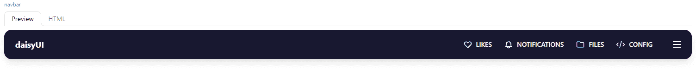

这个例子中有很多我不会用到的 SVG，所以我会把它们去掉。如果你愿意，你可以保留它们，但是为了可读性，我将把它们去掉。真正需要的只是投资组合页面、博客页面和关于页面的链接。

下面是去掉 SVG 后的标记:

```
<div
  class="navbar mb-2 shadow-lg bg-neutral text-neutral-content rounded-box"
>
  <div class="flex-1 px-2 mx-2">
    <span class="text-lg font-bold">Portfolio and Blog</span>
  </div>
  <div class="flex-none hidden px-2 mx-2 lg:flex">
    <div class="flex items-stretch">
      <a class="btn btn-ghost btn-sm rounded-btn" href="/projects">
        Portfolio
      </a>
      <a class="btn btn-ghost btn-sm rounded-btn" href="/posts"
        >Blog</a
      >
      <a class="btn btn-ghost btn-sm rounded-btn" href="/about"
        >About</a
      >
    </div>
  </div>
</div> 
```

请注意，我在这里添加了`href`标签来指向项目中的各个页面。

我们应该将它添加到与`__layout.svelte`文件的页脚相同的位置，这样我们就可以在构建这个组件的过程中看到变化:

```
<script>
  import Footer from '$lib/components/footer.svelte'
  import Navbar from '$lib/components/navbar.svelte'
  import '../app.css'
</script>

<Navbar />
<main class="container max-w-3xl mx-auto px-4 mb-20">
  <slot />
</main>
<Footer />
```

现在还有更多的变化要添加进来:我将把`mb-2`增加到`mb-16`，同时我将移除`rounded-box`并用一个粘性类代替它，这样导航条就可以在长页面中持续滚动`sticky top-0 z-10`。

最后要做的一件事是将`<span>`标签中的“Portfolio and Blog”替换为`a`标签，这样我们就可以通过点击返回主页:

```
<a class="text-lg font-bold" href="/">Portfolio and Blog</a>
```

文件现在看起来是这样的:

```
<div
  class="navbar mb-16 shadow-lg bg-neutral text-neutral-content sticky top-0 z-10"
>
  <div class="flex-1 px-2 mx-2">
    <a class="text-lg font-bold" href="/">Portfolio and Blog</a>
  </div>

  <div class="flex-none hidden px-2 mx-2 lg:flex">
    <div class="flex items-stretch">
      <a class="btn btn-ghost btn-sm rounded-btn" href="/projects">
        Portfolio
      </a>
      <a class="btn btn-ghost btn-sm rounded-btn" href="/posts"
        >Blog</a
      >
      <a class="btn btn-ghost btn-sm rounded-btn" href="/about"
        >About</a
      >
    </div>
  </div>
</div> 
```

非常好！但是等等——更小的屏幕尺寸呢？您可能已经注意到，如果您在较小的屏幕上，投资组合、博客和关于的链接会丢失。

在链接`flex-none hidden px-2 mx-2 lg:flex`上包含 div 的类中，这将隐藏元素，直到屏幕尺寸达到大断点(`lg:`)，然后显示将被设置为`flex`。

让我们从下拉部分使用一些额外的 daisyUI 类来显示屏幕尺寸何时低于`lg:`

```
<div class="dropdown dropdown-left lg:hidden">
  <div tabindex="0" class="m-1 btn">Links</div>
  <ul
    tabindex="0"
    class="bg-neutral rounded-box shadow text-neutral-content p-2 w-52 menu dropdown-content "
  >
    <a class="btn btn-ghost btn-sm rounded-btn" href="/projects">
      Portfolio
    </a>
    <a class="btn btn-ghost btn-sm rounded-btn" href="/posts">
      Blog
    </a>
    <a class="btn btn-ghost btn-sm rounded-btn" href="/about">
      About
    </a>
  </ul>
</div>
```

所以当屏幕尺寸低于`lg:`顺风断点高于`dropdown`时，类将被显示。

完整的文件如下所示:

```
<div
  class="navbar mb-16 shadow-lg bg-neutral text-neutral-content sticky top-0 z-10"
>
  <div class="flex-1 px-2 mx-2">
    <a class="text-lg font-bold" href="/">Portfolio and Blog</a>
  </div>

  <div class="dropdown dropdown-left lg:hidden">
    <div tabindex="0" class="m-1 btn">Links</div>
    <ul
      tabindex="0"
      class="bg-neutral rounded-box shadow text-neutral-content p-2 w-52 menu dropdown-content "
    >
      <a class="btn btn-ghost btn-sm rounded-btn" href="/projects">
        Portfolio
      </a>
      <a class="btn btn-ghost btn-sm rounded-btn" href="/posts">
        Blog
      </a>
      <a class="btn btn-ghost btn-sm rounded-btn" href="/about">
        About
      </a>
    </ul>
  </div>

  <div class="flex-none hidden px-2 mx-2 lg:flex">
    <div class="flex items-stretch">
      <a class="btn btn-ghost btn-sm rounded-btn" href="/projects">
        Portfolio
      </a>
      <a class="btn btn-ghost btn-sm rounded-btn" href="/posts"
        >Blog</a
      >
      <a class="btn btn-ghost btn-sm rounded-btn" href="/about"
        >About</a
      >
    </div>
  </div>
</div> 
```

太棒了。我们现在为手机用户提供了一个很好的导航菜单。

是时候提交我们对 Git 所做的更改了:

```
git add .
git commit -m "Add navbar component"
```

页脚和导航栏排序，现在让我们移动到主题开关。

## **如何添加主题开关**

所有的现代网站都有一个主题开关，所以让我们看看如何在我们的网站上实现它。saadeghi(daisyUI 的创建者)已经为我们制作了一个非常好的包来解决这个问题，这个包叫做 [`theme-change`](https://github.com/saadeghi/theme-change) ，所以我们现在应该安装它:

```
npm i -D theme-change
```

现在我们可以像这样在`__layout.svelte`文件中使用它:

```
<script>
  import Footer from '$lib/components/footer.svelte'
  import Navbar from '$lib/components/navbar.svelte'
  import { onMount } from 'svelte'
  import { themeChange } from 'theme-change'
  import '../app.css'

  onMount(async () => {
    themeChange(false)
  })
</script>

<Navbar />
<main class="container max-w-3xl mx-auto px-4 mb-20">
  <slot />
</main>
<Footer />
```

那么，让我们来分析一下，看看这里发生了什么。`onMount`是当页面在浏览器中可见时运行的代码(一旦它被加载/挂载)。一旦页面加载完毕，我们就开始初始化`themeChange`。这将改变所需主题的`data-act-class`。

目前没有办法设置它，所以现在让我们在`src/app.html`文件中更改它:

```
<!DOCTYPE html>
<html lang="en" data-theme="dracula">
  <head>
    <meta charset="utf-8" />
    <meta name="description" content="" />
    <link rel="icon" href="/favicon.png" />
    <meta
      name="viewport"
      content="width=device-width, initial-scale=1"
    />
    %svelte.head%
  </head>
  <body>
    <div id="svelte">%svelte.body%</div>
  </body>
</html> 
```

``src/app.html``

在这里，我们用`data-theme="dracula"`为整个项目添加了默认的主题`html`。你可以用 daisyUI 提供的所有主题来玩这个——试着把`dracula`改成`corporate`,看看它会有什么变化！

好的，那很好，但是我如何改变它？好的——我们现在就开始吧。我不会用更多的代码来填充这篇文章，我会链接到 GitHub 仓库，它已经在 [SvelteKit 主题开关](https://github.com/spences10/sveltekit-theme-switch/blob/main/src/lib/theme-select.svelte)中为我们打包好了。该组件是一个 HTML select 元素，其中列出了所有的 daisyUI 主题。

复制该文件的内容并将其添加到一个还不存在的`theme-select.svelte`组件中——所以，现在让我们创建它:

```
touch src/lib/components/theme-select.svelte
```

从包含 div 中移除`class="mb-8"`,并在 select 元素中添加一些额外的样式。区别在于:

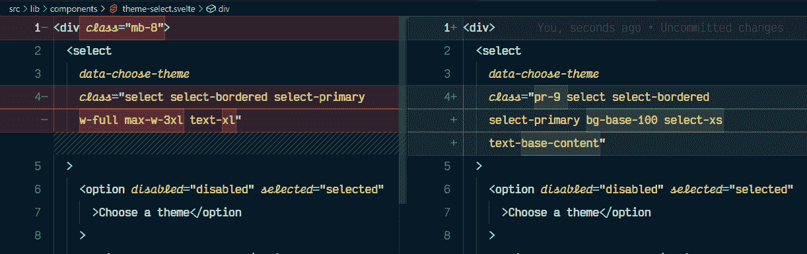

现在我们有了一个主题选择组件，我们应该把它添加到整个项目中可以访问的地方。你觉得应该放在哪里？你猜对了——`navbar.svelte`文件:

```
<script>
  import ThemeSelect from './theme-select.svelte'
</script>

<div
  class="navbar mb-16 shadow-lg bg-neutral text-neutral-content sticky top-0 z-10"
>
  <div class="flex-1 px-2 mx-2">
    <a class="text-lg font-bold" href="/"> Portfolio and Blog </a>
  </div>

  <div class="dropdown dropdown-left lg:hidden">
    <div tabindex="0" class="m-1 btn">Links</div>
    <ul
      tabindex="0"
      class="bg-neutral rounded-box shadow text-neutral-content p-2 w-52 menu dropdown-content "
    >
      <a class="btn btn-ghost btn-sm rounded-btn" href="/projects">
        Portfolio
      </a>
      <a class="btn btn-ghost btn-sm rounded-btn" href="/posts">
        Blog
      </a>
      <a class="btn btn-ghost btn-sm rounded-btn" href="/about">
        About
      </a>
    </ul>
  </div>

  <div class="flex-none hidden px-2 mx-2 lg:flex">
    <div class="flex items-stretch">
      <a class="btn btn-ghost btn-sm rounded-btn" href="/projects">
        Portfolio
      </a>
      <a class="btn btn-ghost btn-sm rounded-btn" href="/posts">
        Blog
      </a>
      <a class="btn btn-ghost btn-sm rounded-btn" href="/about">
        About
      </a>
      <div class="px-4">
        <ThemeSelect />
      </div>
    </div>
  </div>
</div> 
```

所以在这里，我们导入了`ThemeSelect`组件，并在页面列表的末尾添加了一个包含主题选择的 div。

如果您愿意，也可以将其添加到移动视图中。

将更改提交给 Git:

```
git add .
git commit -m "Add theme select to navbar"
```

## 如何添加“关于”页面

让我们在导航栏中添加我们链接到的关于页面。

```
touch src/routes/about.svelte
```

在这个页面中，我们可以使用我们为主页创建的`authorsQuery`来显示作者信息。以下是完整的文件:

```
<script context="module">
  import { client } from '$lib/graphql-client'
  import { authorsQuery } from '$lib/graphql-queries'
  import { marked } from 'marked'

  export const load = async () => {
    const { authors } = await client.request(authorsQuery)

    return {
      props: {
        authors,
      },
    }
  }
</script>

<script>
  export let authors
  const {
    name,
    intro,
    bio,
    picture: { url },
  } = authors[0]
</script>

<svelte:head>
  <title>My Portfolio project | About {name}</title>
</svelte:head>

<h1 class="font-bold text-center mb-20 text-5xl">About Me</h1>

<div class="flex mb-40 items-end">
  <div class="mr-6">
    <h2 class="text-3xl mb-4 font-bold tracking-wider">{name}</h2>
    <p class="text-xl mb-4">{intro}</p>
  </div>

  
</div>

<article div class="prose prose-lg">
  {@html marked(bio)}
</article>
```

`src/routes/about.svelte`

现在将这些更改提交给 Git:

```
git add .
git commit -m "Add about page"
```

## 如何制作网站地图

可选的:让搜索引擎知道你的网站上有什么。网站地图将帮助网络爬虫知道你的网站的内容。

如果你想了解更多的细节，我已经就如何用 SvelteKit 创建一个网站地图发了一篇内容广泛的帖子。

这是一个 SvelteKit 端点，将返回一个 XML 文件，详细说明网站的内容。

如果您想创建一个，那么为它创建一个文件:

```
touch src/routes/sitemap.xml.js
```

以下是完整的文件:

```
import { client } from '$lib/graphql-client'
import { gql } from 'graphql-request'

const website = 'https://www.myporfolioproject.com'

export const get = async () => {
  const query = gql`
    query Posts {
      posts {
        title
        slug
      }
    }
  `
  const { posts } = await client.request(query)
  const pages = [`about`]
  const body = sitemap(posts, pages)

  const headers = {
    'Cache-Control': 'max-age=0, s-maxage=3600',
    'Content-Type': 'application/xml',
  }
  return {
    headers,
    body,
  }
}

const sitemap = (
  posts,
  pages
) => `<?xml version="1.0" encoding="UTF-8" ?>
<urlset

  xmlns:news="https://www.google.com/schemas/sitemap-news/0.9"
  xmlns:xhtml="https://www.w3.org/1999/xhtml"
  xmlns:mobile="https://www.google.com/schemas/sitemap-mobile/1.0"
  xmlns:image="https://www.google.com/schemas/sitemap-image/1.1"
  xmlns:video="https://www.google.com/schemas/sitemap-video/1.1"
>
  <url>
    <loc>${website}</loc>
    <changefreq>daily</changefreq>
    <priority>0.7</priority>
  </url>
  ${pages
    .map(
      page => `
  <url>
    <loc>${website}/${page}</loc>
    <changefreq>daily</changefreq>
    <priority>0.7</priority>
  </url>
  `
    )
    .join('')}
  ${posts
    .map(
      post => `
  <url>
    <loc>${website}/posts/${post.slug}</loc>
    <changefreq>daily</changefreq>
    <priority>0.7</priority>
  </url>
  `
    )
    .join('')}
</urlset>` 
```

`src/routes/sitemap.xml.js`

这是生成站点地图的简化版本。如果你想要完整版本，那么你可以查看项目的[源代码。](https://github.com/GraphCMS/graphcms-sveltekit-portfolio-and-blog-starter)

关于这个文件的更多细节。类似于我们如何在 SvelteKit 中拥有页面和组件，我们也可以拥有端点。SvelteKit 中的端点可以处理 HTTP 方法，如 get、post 和 delete。

这里有一个关于文件符号的快速注释:`.xml.js`可能看起来有点奇怪。这是为了让 SvelteKit 能够理解端点的返回类型。在这种情况下，我们希望返回 XML，但是也可以使用其他类型，比如 JSON。

在这个函数中，我们定义了一个`get`函数，为帖子添加了一个 GraphQL 查询，然后从查询中返回帖子，以便在 XML 中使用。

### 如何使用 SvelteKit 端点

现在我们已经在`src/routes/sitemap.xml.js`中定义了端点，我们可以立即访问数据。通过在浏览器中转到该路由，我们可以看到从该端点返回的数据。

从浏览器中，转到`localhost:3000/sitemap.xml`——这将为我们提供来自 GraphCMS 项目上的 GraphQL API 的数据。

## **Robots.txt**

**可选**:让搜索引擎机器人知道索引什么。这告诉像 Googlebot 这样的网络爬虫在你的网站上应该索引什么，不应该索引什么。

您可能不想索引的页面可能是管理面板或设置页面。

robots.txt 可以放在静态文件夹中。让我们现在创建文件:

```
touch static/robots.txt
```

`static/robots.txt`

在这个项目的情况下，谷歌机器人完全可以抓取它。所以我们的`robots.txt`文件可以是这样的:

```
# https://www.robotstxt.org/robotstxt.html
User-agent: *
Disallow:
```

`static/robots.txt`

这是说，网络爬虫索引网站上的一切。

## **RSS 源生成**

可选的:让用户在他们的 RSS 应用程序中显示对你网站的修改。同样，我将把这留给您来实现。与创建站点地图的方式非常相似，您可以实现一个 SvelteKit 端点来生成 RSS 提要所需的 XML。

```
touch src/routes/rss.xml.js
```

下面是一个示例文件:

```
import { client } from '$lib/graphql-client'
import { gql } from 'graphql-request'

const name = 'My Portfolio'
const website = 'https://myportfolio.com'

export const get = async () => {
  const query = gql`
    query Posts {
      posts {
        title
        slug
      }
    }
  `
  const { posts } = await client.request(query)
  const body = xml(posts)

  const headers = {
    'Cache-Control': 'max-age=0, s-maxage=3600',
    'Content-Type': 'application/xml',
  }
  return {
    headers,
    body,
  }
}

const xml =
  posts => `<rss xmlns:dc="https://purl.org/dc/elements/1.1/" xmlns:content="https://purl.org/rss/1.0/modules/content/" xmlns:atom="https://www.w3.org/2005/Atom" version="2.0">
  <channel>
    <title>${name}</title>
    <link>${website}</link>
    <description>This is my portfolio!</description>
    ${posts
      .map(
        post =>
          `
        <item>
          <title>${post.title}</title>
          <description>This is my portfolio!</description>
          <link>${website}/posts/${post.slug}/</link>
          <pubDate>${new Date(post.date)}</pubDate>
          <content:encoded>${post.previewHtml} 
            <div style="margin-top: 50px; font-style: italic;">
              <strong>
                <a href="${website}/posts/${post.slug}">
                  Keep reading
                </a>
              </strong>  
            </div>
          </content:encoded>
        </item>
      `
      )
      .join('')}
  </channel>
</rss>` 
```

`src/routes/rss.xml.js`

这里面有很多东西要解开，所以我做了一篇关于在你的减肥网站上建立 RSS 订阅源的文章。这将为您提供设置所需的所有信息。

## **电子邮件注册 Revue**

**可选的**:如果你想在端点上更进一步，你可以使用 Revue API 添加一个时事通讯注册页面。如果你想走那条路，我已经[在帖子](https://scottspence.com/posts/email-form-submission-with-sveltekit)中详细说明了。

如果你想走这条路，WebJeda 也有一个关于在一个 SvelteKit 项目中收集 Google 表单数据的很棒的[视频。](https://www.youtube.com/watch?v=mBXEnakkUIM)

## **使用 Vercel 进行持续部署**

如果您一直关注这一点(顺便谢谢您🙏)，您可能想知道为什么我们一直在每一节的末尾进行 Git 提交。所有这些都导致了这一部分。

我将使用 [Vercel](https://vercel.com) 进行部署。如果你还没有账户，你可以[向你喜欢的提供商注册](https://vercel.com/signup)——我会用 GitHub。

如果您想现在就部署您的站点，您可以使用 Vercel CLI:

```
npx vercel
```

不需要安装 CLI，因为 npx 命令已经为您完成了所有工作。您将通过 CLI 逐步完成部署。

以下是运行命令并为每个问题选择默认值(enter)后的输出:

```
? Set up and deploy “~/repos/my-developer-portfolio”? [Y/n] y
? Which scope do you want to deploy to? Scott Spence
? Link to existing project? [y/N] n
? What’s your project’s name? my-developer-portfolio
? In which directory is your code located? ./
Auto-detected Project Settings (SvelteKit):
- Build Command: svelte-kit build
- Output Directory: public
- Development Command: svelte-kit dev --port $PORT
? Want to override the settings? [y/N] n
🔗 Linked to spences10/my-developer-portfolio (created .vercel and added it to .gitignore)
🔍 Inspect: https://vercel.com/spences10/my-developer-portfolio/78bRRjiweZsipYbu8Q4Bg9JRmvGR [2s]
```

现在从 CLI 转到用`🔍 Inspect`表示的 URL，我可以看到在 Vercel 上构建的项目。太好了，我们的网站开始运行了！这是一次性部署，所以如果将来有变化，我需要再次使用 CLI。

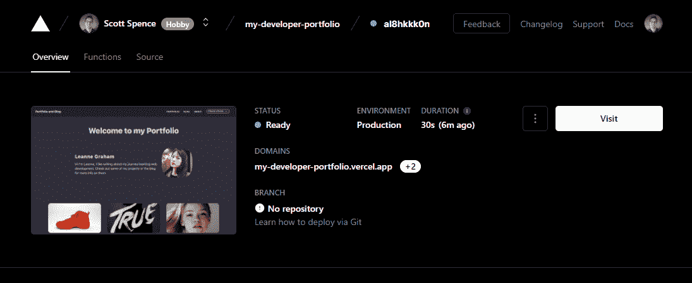

Vercel deployment preview page

您可能已经注意到在 Vercel 上的 deploy preview 页面上有一个部分写着“No repository”。

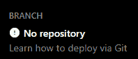

我们可以添加一个 GitHub 存储库，以便将来对项目所做的任何更改都可以在推送到 GitHub 时进行构建。

因此，首先我们需要将我们的项目添加到 GitHub——现在就开始吧。如果你已经登录了 GitHub，你可以点击 GitHub 右上角的加号图标进入[新的资源库链接](https://github.com/new)。

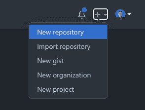

New repository link

在新页面中，添加项目的详细信息:

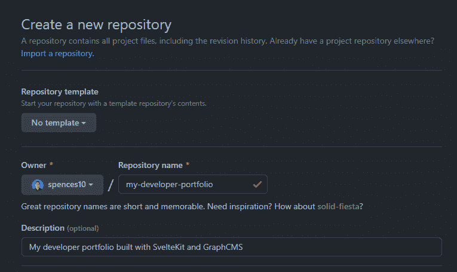

New GitHub project with description

然后单击“创建存储库”按钮:

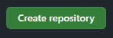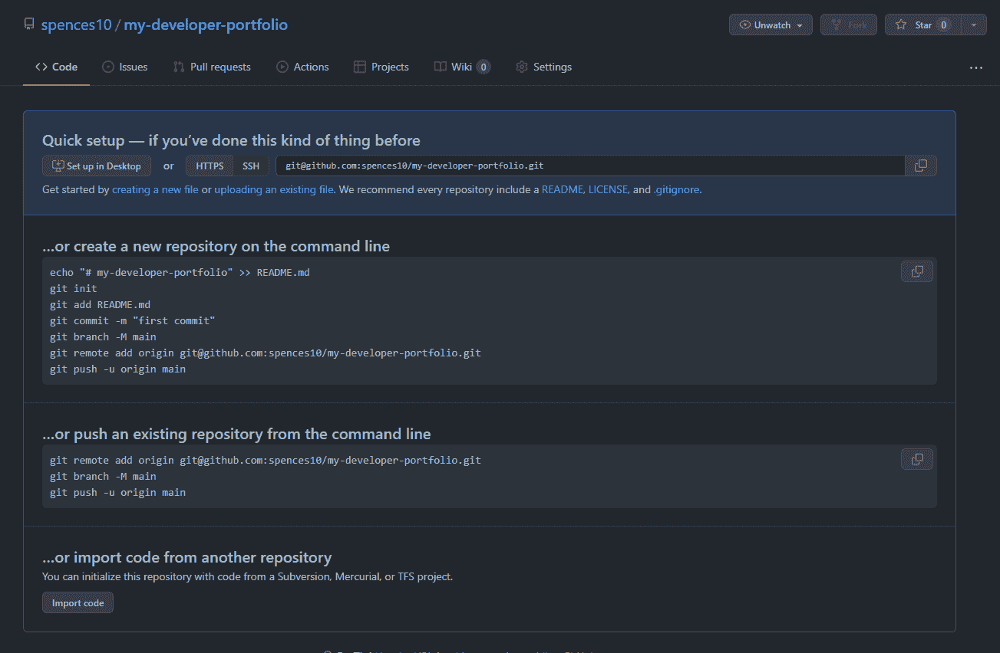

下一个屏幕将给出您需要的 Git 命令。由于项目已经创建，我可以使用第二组命令:

```
git remote add origin git@github.com:spences10/my-developer-portfolio.git
git branch -M main
git push -u origin main
```

请注意，如果您正在跟进，您将需要使用存储库页面上给你的命令，而不是使用这里提到的命令，因为那将指向我的 GitHub `spences10`。

既然回购是在 GitHub 上创建的，我可以将它连接到 Vercel。在“部署预览”页面中，我可以通过单击标题中的项目名称来选择项目:


这将把我带到项目仪表板:

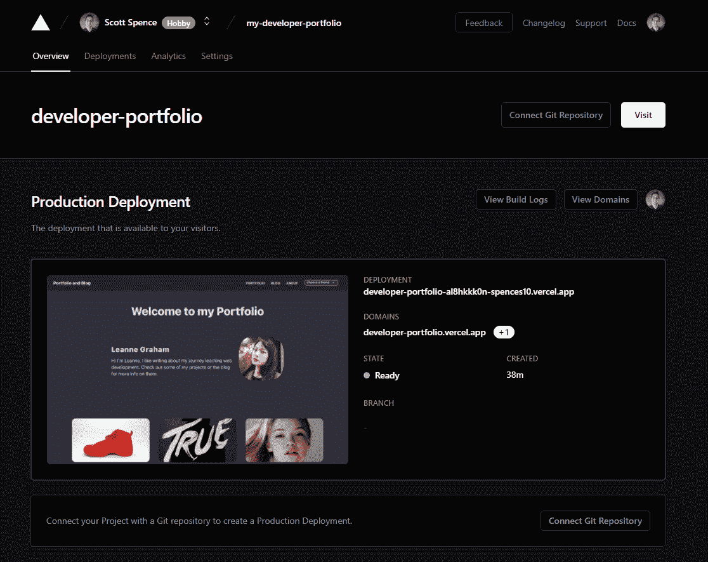

Vercel project dashboard

在这里，我可以单击“连接 Git 存储库”按钮，这将把我带到项目设置中的 Git 部分:

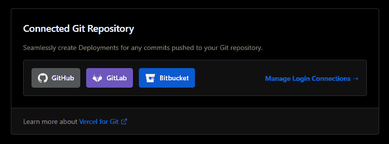

Connect a Git repository in the Vercel settings menu

点击 GitHub 会弹出一个项目列表:

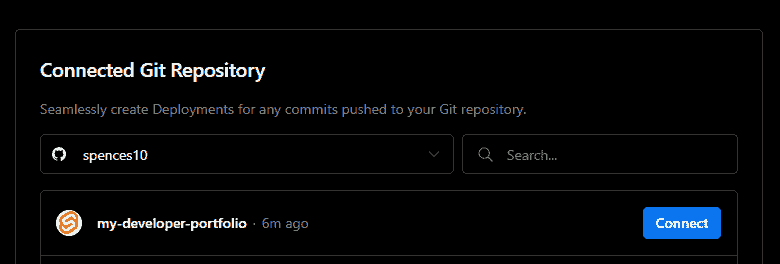

Select the GitHub repository to link

单击“连接”按钮将连接存储库。您可能也注意到了这里的“域”设置。您可以在这里配置您的域，或者用一个`.vercel.app`域更改当前名称。

这里要注意的另一件事是设置中的“环境变量”部分。这需要在这里添加`VITE_GRAPHQL_API`环境变量:

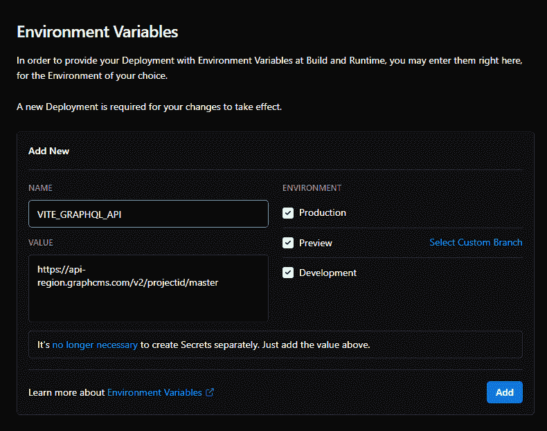

Add VITE_GRAPHQL_API environment variable to the Vercel settings

现在，任何时候 GitHub 有任何变化，Vercel 都会建立这个网站。

## 如何发布和构建内容更改

当只有内容发生变化时，不必将变化推送到 GitHub 来创建项目的新版本，您可以通过 GraphCMS 集成来完成。

从 GraphCMS 中的设置面板，转到集成部分:

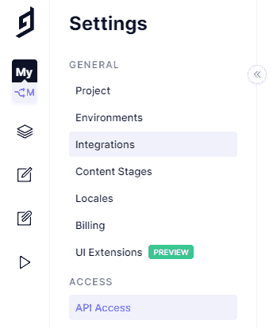

Select the integrations section in the settings panel

单击 Vercel 集成—还有针对 Netlify 和 Gatsby 云的集成:

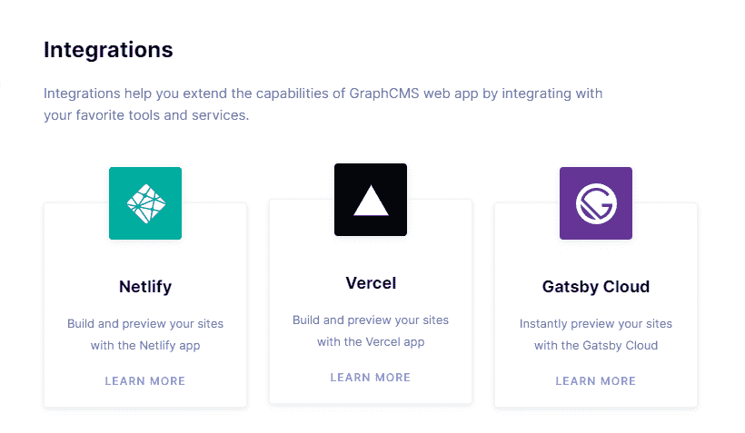

Click on the Vercel integration

点击“启用”进行 Vercel 集成:

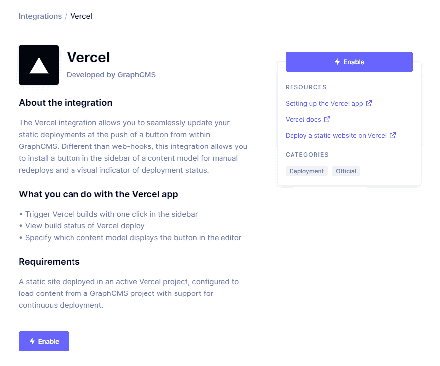

Enable the Vercel integration

出现提示时，单击“连接到 Vercel”按钮:

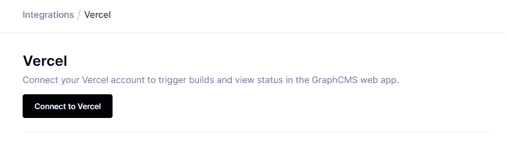

点击“授权 GraphCMS”在 Vercel 上为您进行部署:

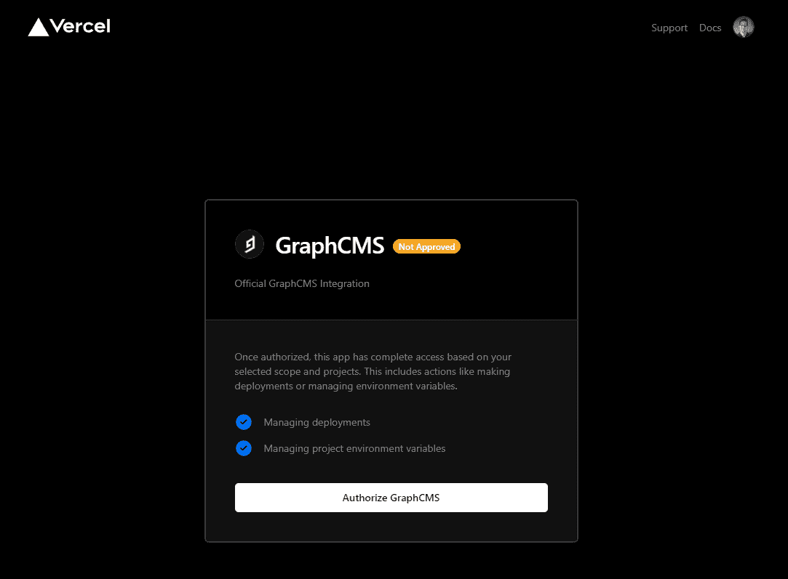

在“构建项目”部分，从下拉列表中选择您的 Vercel 项目。“显示名称”是将出现在内容页面侧面板中的内容。分支名称是您希望从 GitHub 部署到 Vercel 的分支——我使用`main`表示生产分支。

还有一个选项可以指定您希望在哪些模型上启用集成。在这种情况下，我将全部使用它们，因此选择“全选”，然后最后单击“启用”按钮:

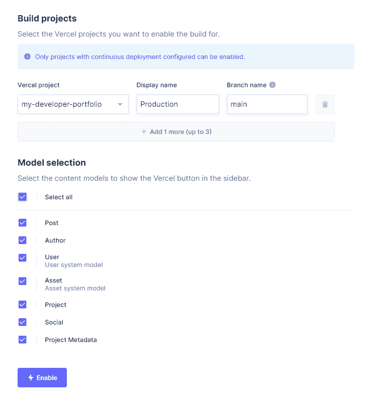

如果我现在转到 GraphCMS 项目的内容部分，并选择一个内容模型来编辑一个条目，有一个“开始构建产品”按钮，只要单击它，就会开始一个新的构建。

右边面板是作者模型和 Vercel 集成:

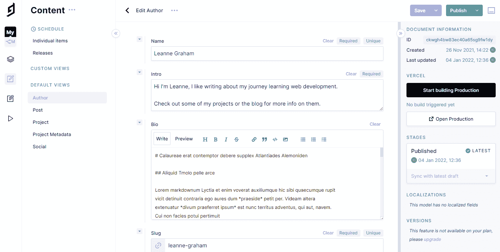

## 谷歌搜索控制台

可选步骤:如果您拥有自己的域名，这是一个可选步骤。让你的网站在搜索引擎上排名的一个好方法是使用谷歌搜索控制台。

[https://search.google.com/search-console](https://search.google.com/search-console)

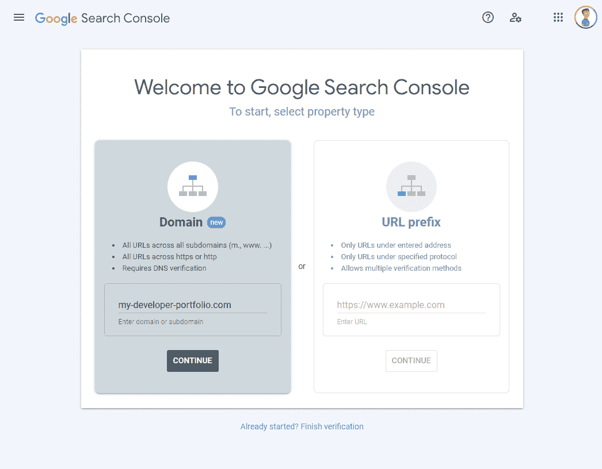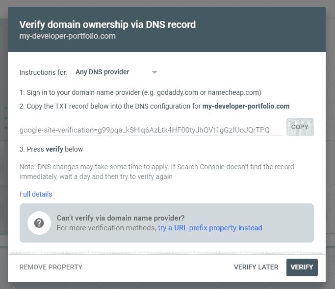

使用 Vercel CLI 将 TXT 记录添加到您的域中。您也可以在 Vercel 的 domains 部分手动添加它:

```
vercel dns add my-developer-portfolio.com @ TXT google-site-verification=g99pqa_kSHiq6AzLtk4HF00tyJhQVt1gGzfUoJQrTPQ
```

一旦你的站点被验证，你就可以添加你的站点地图并点击提交按钮。

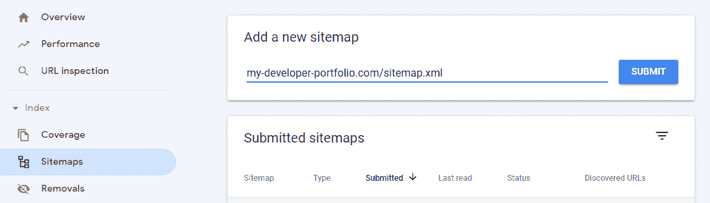

Add sitemap to Google search console

就是这样！你现在需要等待谷歌机器人做它的事情和索引你的网站。随着时间的推移，您应该会开始看到搜索查询。

## **资源**

以下是我在本指南中用来制作博客内容的一些资源。

*   带有 [Lorem.space 占位符图像生成器的图像](https://lorem.space/api)
*   用[Lorem markdown um(jaspervdj . be)](https://jaspervdj.be/lorem-markdownum/)进行降价
*   生物生成用[人物传记生成器(character-generator.org.uk)](https://www.character-generator.org.uk/bio/)
*   理想的封面图片尺寸:[各大社交媒体平台的理想封面图片尺寸(buffer.com)](https://buffer.com/library/ideal-cover-photo-size/)

你可以查看这些链接，了解更多关于 Svelte 和 SvelteKit 的信息

*   [https://kit.svelte.dev/docs](https://kit.svelte.dev/docs)
*   [https://svelte.dev/docs](https://svelte.dev/docs)

如果你想要这个项目的源代码，那么你可以查看 GitHub repo [的所有代码](https://github.com/GraphCMS/graphcms-sveltekit-portfolio-and-blog-starter)。如果您有任何问题，请随时记录问题或在 [Twitter](https://twitter.com/spences10) 上联系。

## 我们的成就

是时候总结一下我们取得的成绩了。我们已经从 hello world 发展到功能齐全的作品集和博客！

我们介绍了如何从 GraphQL API 获取数据，并在项目的页面上显示这些数据。然后，我们实现了一个 GraphQL 客户端来只检索我们需要的数据。

我们添加了所有重要的网站地图，这样网站就可以被像 Google 这样的搜索引擎发现和索引。

一个可选的方法是添加一个 RSS feed，这样任何使用 RSS 阅读器的人都可以被通知任何添加到网站的新内容。

最后，我们将完成的项目部署到 Vercel 上，向全世界展示。

## 谢谢

非常感谢您花时间阅读本指南。我希望它给了你开始用 Svelte 制作你自己的项目所需要的一切。

如果你喜欢这些内容，你可以在我的[博客](https://scottspence.com)上查看更多，或者你可以在[推特](https://twitter.com/spences10)上关注我。