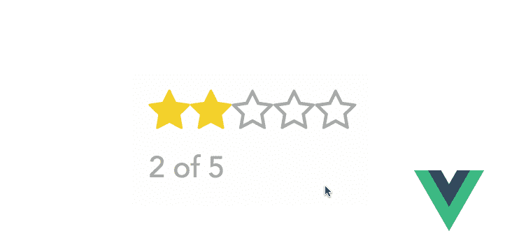
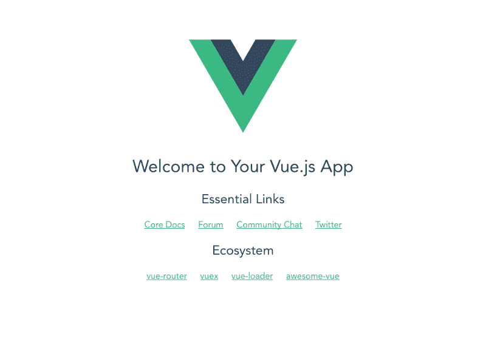

# 如何构建你的第一个 Vue.js 组件

> 原文：<https://www.freecodecamp.org/news/build-your-first-vue-js-component-2dc204bca514/>

莎拉·达扬

# 如何构建你的第一个 Vue.js 组件



我记得当年我拿起 CakePHP 的时候。我喜欢它的入门如此简单。这些文件不仅结构良好、详尽无遗，而且非常方便用户使用。多年后，这正是我在 Vue.js 中发现的。然而，与 Cake 相比，Vue 文档仍然缺少一样东西:**一个现实生活中的项目教程**。

不管一个框架有多好的文档记录，这对每个人来说都是不够的。阅读概念并不总是有助于你看到更大的图景，或者理解你如何利用它们来实际制造东西。如果你像我一样，你可以通过实践学得更好，当你需要的时候，你可以在编码的时候参考文档。

在本教程中，我们将构建一个**星级评定系统**组件。当我们需要的时候，我们将访问几个 Vue.js 概念**，**，我们将讨论*为什么*我们要使用它们。


***TL；*** *博士:这篇文章深入探讨了如何和为什么。旨在帮助你掌握 Vue.js 的一些核心概念，教你如何为未来的项目做设计决策。如果你想理解整个思维过程，请继续阅读。否则可以在 [CodeSandbox](https://codesandbox.io/s/38k1y8x375) 上看最终代码。*

### 入门指南

作为一个简单的脚本包含，Vue.js(理所当然地)以其可运行性而自豪，但是当你想使用[单文件组件](https://vuejs.org/v2/guide/single-file-components.html)时，事情就有点不同了。现在，你没有*有*以这种方式构建组件。您可以很容易地用`Vue.component`定义一个全局组件。

问题是，这带来了一些折衷，比如必须使用字符串模板，没有范围 CSS 支持，没有构建步骤(因此，没有预处理程序)。然而，我们想更深入地了解如何构建一个可以在实际项目中使用的实际组件。出于这些原因，我们将采用由 Webpack 支持的真实设置。

为了保持简单并减少配置时间，我们将使用 [vue-cli](https://github.com/vuejs/vue-cli) 和 [webpack-simple](https://github.com/vuejs-templates/webpack-simple) Vue.js 模板。

首先，您需要全局安装 vue-cli。启动您的终端并键入以下内容:

```
npm install -g vue-cli
```

现在，只需几次击键，就可以生成现成的 Vue.js 样板文件。继续输入:

```
vue init webpack-simple path/to/my-project
```

会问你几个问题。除了您应该回答是(`y`)的“使用 sass”之外，为所有选项选择默认值。然后，vue-cli 将初始化项目并创建`package.json`文件。完成后，您可以导航到项目的目录，安装依赖项，并运行项目:

```
cd path/to/my-projectnpm installnpm run dev
```

就是这样！Webpack 将开始在端口`8080`(如果可用)上为您的项目提供服务，并在您的浏览器中启动它。如果一切顺利，您应该会看到这样的欢迎页面。



### 我们到了吗？

差不多！要正确调试 Vue.js 组件，您需要合适的工具。继续安装 Vue.js devtools 浏览器扩展([Firefox](https://addons.mozilla.org/en-US/firefox/addon/vue-js-devtools)/[Chrome](https://chrome.google.com/webstore/detail/vuejs-devtools/nhdogjmejiglipccpnnnanhbledajbpd)/[Safari](https://github.com/vuejs/vue-devtools/blob/master/docs/workaround-for-safari.md))。

### 您的第一个组件

Vue.js 最好的特性之一是**单文件组件**(sfc)。它们允许您在一个文件中定义组件的结构、样式和行为，而没有通常混合 HTML、CSS 和 JavaScript 的缺点。

sfc 以`.vue`扩展名结尾，具有以下结构:

```
<template>  <!-- Your HTML goes here --></template>
```

```
<script>  /* Your JS goes here */<;/script>
```

```
<style>  /* Your CSS goes here */&lt;/style>
```

让我们开始制作我们的第一个组件:在`/src/components`中创建一个`Rating.vue`文件，并复制/粘贴上面的代码片段。然后，打开`/src/main.js`，修改现有代码:

```
import Vue from 'vue'import Rating from './components/Rating'
```

```
new Vue({  el: '#app',  template: '<Rating/>',  components: { Rating }})
```

最后，给你的`Rating.vue`添加一点 HTML:

```
<template>  <ul>    <li>One</li>    <li>Two</li>    <li>Three</li>  </ul></template>
```

现在在您的浏览器中查看页面，您应该会看到列表！Vue.js 附上你的`<Rati` ng >组件 t`o th`e # app eleme`nt in inde`x.html。如果你检查 HTML，你应该看不到任何迹象 o `f th` e #app 元素:Vue.js 用组件替换了它。

旁注:你有没有注意到你甚至不需要重新加载页面？这是因为 Webpack 的 [vue-loader](https://github.com/vuejs/vue-loader) 带有*热重装*功能。与*实时重装*或*浏览器同步*相反，*热重装*并不会在每次更改文件时刷新页面。相反，它监视组件的变化，只刷新它们，保持状态不变。

现在，我们已经花了一些时间进行设置，但是是时候我们实际编写有意义的代码了。

### 模板

我们将使用 [vue-awesome](https://www.npmjs.com/package/vue-awesome) ，这是用[字体 awesome 图标](http://fontawesome.io/)构建的 Vue.js 的 SVG 图标组件。这允许我们只加载我们需要的图标。继续用 npm(或纱线)安装它:

```
npm install vue-awesome
```

然后编辑您的组件，如下所示:

```
<template>  <div>    <ul>      <li><icon name="star"/></li>      <li><icon name="star"/></li>      <li><icon name="star"/></li>      <li><icon name="star-o"/></li>      <li><icon name="star-o"/></li>    </ul>    <span>3 of 5</span>  </div></template>
```

```
<script>import 'vue-awesome/icons/star'import 'vue-awesome/icons/star-o'
```

```
import Icon from 'vue-awesome/components/Icon'
```

```
export default {  components: { Icon }}</script>
```

好吧好吧，**让我们慢下来一会儿**解释这一切？

Vue.js 使用原生 ES6 模块来处理依赖关系和导出组件。在`<scri` pt >中的前两行分别阻塞了导入图标，这样你就不会在最终的包中找到你不需要的图标。第三个是导入图标组件 `from vue-a` wesome，这样你就可以在你的系统中使用它了。

是一个 Vue.js SFC，就像我们正在构建的一样。如果你打开这个文件，你会发现它的结构和我们的完全一样。

`export default`块导出一个对象文字作为我们组件的视图模型。我们在`components`属性中注册了`Icon`组件，这样我们就可以在本地使用它了。

最后，我们在 HTML `<templa` te >中使用了`Icon`，并向 `it` 传递了一个 name 属性来定义我们想要的图标。通过将组件转换成 kebab-case`(eg.: MyCom`component be`comes <my-c`component>，可以将组件用作自定义 HTML 标签。我们不需要在组件内部嵌套任何东西，所以我们使用了自结束标记。

**旁注**:你有没有注意到我们在 HTML 上加了一个包装`<d` iv >？那是因为我们还在根级别增加了 counter `in a` < span >，Vue.js 中的组件模板只接受一个根元素。如果你不尊重这一点，你会得到一个编译错误。

### 风格

如果您已经使用 CSS 有一段时间了，您会知道主要的挑战之一是必须处理它的全球性。嵌套一直被认为是这个问题的解决方案。现在我们知道它会很快导致特殊性问题，使样式难以覆盖，无法重用，并且是一个难以扩展的噩梦。

像 [BEM](http://getbem.com/) 这样的方法被发明出来，通过命名空间类来规避这个问题并保持低特异性。有一段时间，它是编写干净的、可伸缩的 CSS 的理想方式。然后，像 Vue.js 或 React 这样的框架和库出现了，并将**范围的样式**带到了桌面上。

React 有样式组件，Vue.js 有**组件范围的 CSS** 。它允许你编写特定于组件的 CSS，而不必想出技巧来保持它的包容性。您使用“普通”的类名编写常规 CSS，Vue.js 通过为 HTML 元素分配数据属性并将其附加到编译后的样式来处理作用域。

让我们在组件上添加一些简单的类:

```
<template>  <div class="rating">    <ul class="list">      <li class="star active"><icon name="star"/></li>      <li class="star active"><icon name="star"/></li>      <li class="star active"><icon name="star"/></li>      <li class="star"><icon name="star-o"/></li>      <li class="star"><icon name="star-o"/></li>    </ul>    <span>3 of 5</span>  </div></template>
```

并对其进行造型:

```
<style scoped>  .rating {    font-family: 'Avenir', Helvetica, Arial, sans-serif;    font-size: 14px;    color: #a7a8a8;  }  .list {    margin: 0 0 5px 0;    padding: 0;    list-style-type: none;  }  .list:hover .star {    color: #f3d23e;  }  .star {    display: inline-block;    cursor: pointer;  }  .star:hover ~ .star:not(.active) {    color: inherit;  }  .active {    color: #f3d23e;  }&lt;/style>
```

看到上面那个*范围的*属性了吗？这就是告诉 Vue.js 确定样式的范围，这样它们就不会泄露到其他地方。如果您直接在`index.html`中复制/粘贴 HTML 代码，您会注意到您的样式不适用:这是因为它们的作用域是组件！？

#### 预处理器呢？

Vue.js 使从普通 CSS 切换到您喜欢的预处理程序变得轻而易举。您所需要的只是正确的 Webpack 加载器和一个简单的`<sty` le >块属性。我们在生成项目时对“使用 sass”说了“是”，所以 vue-cli 已经为我们安装并配置了[sass-](https://github.com/webpack-contrib/sass-loader)加载器。现在，我们需要做的就是向 op`ening &`lt；样式>标签。

我们现在可以使用 Sass 来编写组件级样式，导入变量、颜色定义或混合等部分。如果您喜欢缩进语法(或“sass”符号)，只需在`lang`属性中将`scss`切换到`sass`。

### 行为

现在我们的组件看起来不错，是时候让它工作了。目前，我们有一个硬编码的模板。让我们设置一些初始模拟状态，并调整模板以反映它:

```
<script>  ...  export default {    components: { Icon },    data() {      return {        stars: 3,        maxStars: 5      }    }  }<;/script>
```

```
/* ... */
```

```
<template>  <div class="rating">    <ul class="list">      <li v-for="star in maxStars" :class="{ 'active': star <= stars }" class="star">        <icon :name="star <= stars ? 'star' : 'star-o'"/>      </li>    </ul&gt;    <span>3 of 5</span>  </div></template>
```

我们在这里做的是使用 Vue 的`data`来设置组件状态。你在`data`中定义的每一个属性都会变成**反应**:如果它改变了，就会反映在视图中。

我们正在制作一个可重用的组件，所以`data`需要是一个工厂函数，而不是一个对象文字。通过这种方式，我们获得了一个新的对象，而不是对几个组件共享的现有对象的引用。

我们的`data`工厂返回两个属性:`stars`，当前“活动”恒星的数量，和`maxStars`，组件的恒星总数。在此基础上，我们修改了模板，使其反映实际组件的状态。Vue.js 附带了一堆指令，允许您在模板中添加表示逻辑，而无需将它与普通的 JavaScript 混合。`v-for`指令循环遍历任何可迭代的对象(数组、对象文字、映射等)。).它也可以取一个数字作为要重复 *x* 次的范围。这就是我们对`v-for="star in maxStars"`所做的，所以我们为组件中的每个明星都设置了一个`<`李>。

您可能已经注意到一些属性以冒号为前缀:这是`v-bind`指令的简写，它将属性动态绑定到一个表达式。我们可以用它的长形式来写，`v-bind:class`。

当 star 处于活动状态时，我们需要在`<` li >元素上追加`active`类。在我们的例子中，这就意味着`ever` y <李>I`s les`s 比`ld hav` e 星寿这个活跃阶层。我们在:class 指令中使用了一个表达式`sion i`,当`the` 当前星比`s les`星时`only a` ppend 激活。我们使用了相同的条件，这一次使用了一个三元操作符，来定义用什么图标来表示图标。

#### 柜台呢？

既然我们的 star 列表绑定到了实际数据，现在我们也该为计数器做同样的事情了。最简单的方法是使用带有 mustache 语法的文本插值:

```
<span>{{ stars }} of {{ maxStars }}&lt;/span>
```

很直接，不是吗？现在，在我们的例子中，这样做的技巧。但是如果我们需要一个更复杂的 JavaScript 表达式，最好将其抽象在一个**计算属性**中。

```
export default {  ...  computed: {    counter() {      return `${this.stars} of ${this.maxStars}`    }  }}
```

```
/* ... */
```

```
<span>{{ counter }}&lt;/span>
```

这里，**这是矫枉过正**。我们可以不用模板内表达式，但仍然保持可读性。然而，当您必须处理更复杂的逻辑时，请记住计算属性。

我们需要做的另一件事是提供一种方法来隐藏我们不想要的计数器。最简单的方法是使用带有布尔值的`v-if`指令。

```
<span v-if="hasCounter">{{ stars }} of {{ maxStars }}&lt;/span>
```

```
/* ... */
```

```
export default {  ...  data() {    return {      stars: 3,      maxStars: 5,      hasCounter: true    }  }}
```

#### 交互性

我们几乎完成了，但是我们仍然需要实现组件中最有趣的部分:**反应**。我们将使用处理事件的 Vue.js 指令`v-on`和可以附加所有方法的 Vue.js 属性`methods`。

```
<template>  ...  <li @click="rate(star)" ...>  ...</template>
```

```
/* ... */
```

```
export default {  ...  methods: {    rate(star) {      // do stuff    }  }}
```

我们在`<`李>上加了一个`@click`属性，是`d for v-on`的简称:click。这个指令包含一个调用速率方法，我们在组件的属性中定义了这个方法。

***“等一下……这看起来和 HTML 的`onclick`属性非常熟悉。在 HTML 中使用内联 JavaScript 难道不应该是一种过时和糟糕的做法吗？”***

的确是这样，但是即使语法看起来很像`onclick`，比较两者将是一个错误。当你构建一个 Vue.js 组件时，你不应该把它看作是独立的 HTML/CSS/JS，而是一个使用多种语言的组件。当项目在浏览器中提供或为生产而编译时，所有的 HTML 和指令都被编译成普通的 JavaScript。如果您检查呈现的 HTML，您将看不到任何指令的迹象，也看不到任何`onclick`属性。Vue.js 编译了您的组件并创建了正确的绑定。

这也是为什么您可以直接从模板访问组件的上下文:因为指令被绑定到视图模型。与使用单独 HTML 的传统项目不同，模板是组件不可或缺的一部分。

回到我们的`rate`方法。我们需要将`stars`转换为被点击元素的索引，所以我们从`@click`指令中传递索引，我们可以做以下事情:

```
export default {  ...  methods: {    rate(star) {      this.stars = star    }  }}
```

在你的浏览器中检查页面，并尝试点击星星:**它的工作！**

如果你在你的浏览器 devtools 中打开 Vue 面板并选择`<Rati` ng >组件，你会看到当你点击星星时数据发生了变化。这表明 `your` stars proper **ty 重新活跃起来:当你对它进行变异时，它会将其变化发送到视图中。这个概念被称为数据绑定，如果你曾经使用过像 Backbone.js 或 Knockout 这样的框架，你应该很熟悉这个概念。不同之处在于，Vue.js 和 R **eact 一样，只在一个方向上执行:这就是所谓的单向数据绑定。但是这个话题值得写一篇自己的文章吗？****

在这一点上，我们可以称之为完成——但我们还可以做更多的工作来改善用户体验。

现在，我们实际上不能给零分，因为点击一颗星星会给它的指数设定一个比率。更好的方法是重新点击同一颗星星，让它切换当前状态，而不是保持活动状态。

```
export default {  ...  methods: {    rate(star) {      this.stars = this.stars === star ? star - 1 : star    }  }}
```

现在，如果被点击的星的索引等于当前值`stars`，我们减少它的值。否则，我们赋予它`star`的值。

如果我们想彻底，我们还应该添加一层控制，以确保`stars`永远不会被赋予一个没有意义的值。我们需要确保`stars`永远不会小于`0`，永远不会大于`maxStars`，并且是一个合适的数字。

```
export default {  ...  methods: {    rate(star) {      if (typeof star === 'number' && star <= this.maxStars && star >= 0) {        this.stars = this.stars === star ? star - 1 : star      }    }  }}
```

#### 传递道具

现在，组件的数据被硬编码在`data`属性中。如果我们希望我们的组件实际上是可用的，我们需要能够从它的实例传递自定义数据给它。在 Vue.js 中，我们用**道具**来做这件事。

```
export default {  props: ['grade', 'maxStars', 'hasCounter'],  data() {    return {      stars: this.grade    }  },  ...}
```

而在`main.js`:

```
new Vue({  el: '#app',  template: '<Rating :grade="3" :maxStars="5" :hasCounter="true"/>',  components: { Rating }})
```

这里有三点需要注意:

首先，我们使用`v-bind`简写从组件实例传递道具:这就是 Vue.js 所说的**动态语法**。当您想要传递一个字符串值时，您不需要它，因为文字语法(不带`v-bind`的普通属性)将起作用。但是在我们的例子中，因为我们传递数字和布尔值，所以这样做很重要。

`props`和`data`属性在编译时被合并，所以我们不需要改变在视图模型或模板中调用属性的方式。但是出于同样的原因，我们不能对`props`和`data`属性使用相同的名称。

最后，我们定义了一个`grade`属性，并将其作为值传递给`data`属性中的`stars`。我们之所以那样做，而不是直接使用`grade`道具，是因为当我们改变等级时，数值会发生突变。在 Vue.js 中，道具是从父母传递给孩子的，而不是相反，所以你不会不小心变异了父母的状态。这将违背[单向数据流](https://vuejs.org/v2/guide/components.html#One-Way-Data-Flow)原则，并使事情更难调试。这就是为什么你应该**而不是**尝试在子组件中变异一个道具。相反，定义一个本地的`data`属性，使用道具的初始值作为自己的值。

#### 最后润色

在我们结束今天之前，还有最后一个我们应该参观的 Vue.js 优点:**道具验证**。

Vue.js 允许您在将道具传递给组件之前对其进行控制。您可以执行四件主要的事情:**检查类型**，**需要定义一个属性**，**设置默认值**，以及**执行自定义验证**。

```
export default {  props: {    grade: {      type: Number,      required: true    },    maxStars: {      type: Number,      default: 5    },    hasCounter: {      type: Boolean,      default: true    }  },  ...}
```

我们使用类型检查来确保将正确类型的数据传递给组件。如果我们忘记使用动态语法来传递非字符串值，这将特别有用。我们还通过要求来确保`grade` prop 被通过。对于其他属性，我们定义了默认值，这样即使没有传递自定义数据，组件也能工作。

现在，我们可以通过执行以下操作来实例化组件:

```
<Rating :grade="3"/>
```

就是这样！您刚刚创建了第一个 Vue.js 组件，并探索了许多概念，包括使用 [vue-cli](https://github.com/vuejs/vue-cli) 、[单文件组件](https://vuejs.org/v2/guide/single-file-components.html)生成样板项目、在组件中导入组件、[作用域样式](https://vuejs.org/v2/guide/comparison.html#Component-Scoped-CSS)、[指令](https://vuejs.org/v2/guide/syntax.html#Directives)、[事件处理程序](https://vuejs.org/v2/guide/events.html#Method-Event-Handlers)、[计算属性](https://vuejs.org/v2/guide/computed.html#Computed-Properties)、[自定义方法](https://vuejs.org/v2/guide/instance.html#Data-and-Methods)、[单向数据流](https://vuejs.org/v2/guide/components.html#One-Way-Data-Flow)、[属性](https://vuejs.org/v2/guide/components.html#Props)和这只是 Vue.js 所能提供的皮毛！

这是一个相当密集的教程，所以不要担心，如果你不明白一切。再读一遍，在各节之间暂停，探索并[摆弄 CodeSandbox](https://codesandbox.io/s/38k1y8x375) 上的代码。如果你对教程有任何问题或评论，不要犹豫，在[推特](https://twitter.com/frontstuff_io)上打电话给我！

*最初发表于 [frontstuff.io](https://frontstuff.io/build-your-first-vue-js-component) 。*