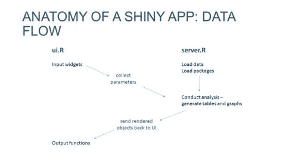
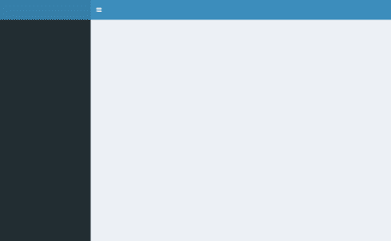
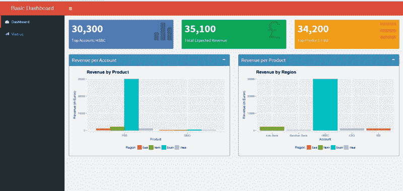
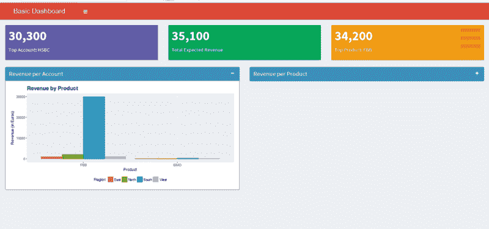

# 使用 Shiny 和 R 构建您的第一个 web 应用仪表板

> 原文：<https://www.freecodecamp.org/news/build-your-first-web-app-dashboard-using-shiny-and-r-ec433c9f3f6c/>

通过 AMR

# 使用 Shiny 和 R 构建您的第一个 web 应用仪表板


You will learn to build this dashboard.

R 拥有的漂亮礼物之一(Python 错过了，直到[破折号](https://plot.ly/products/dash/))是 [**闪亮**](http://shiny.rstudio.com/) 。 **Shiny** 是一个 **R** 包，它使得直接从 **R** 构建交互式 web 应用变得容易。仪表板很受欢迎，因为它们有助于企业从现有数据中获得洞察力。

在本帖中，我们将看到如何利用**闪亮的**来构建一个简单的销售收入仪表板。你需要安装[](https://cran.r-project.org/)**。**

#### **在 R 中加载包**

**您需要的软件包必须单独下载，并使用 **R** 安装[到](https://www.r-bloggers.com/installing-r-packages/)。下面列出的所有软件包都可以直接从 CRAN 安装，你可以选择使用哪个 CRAN 镜像。默认情况下，软件包依赖项也将被下载和安装。**

**一旦安装了包，您需要将它们加载到您的 **R** 会话中。使用了库和需求命令，同样，包依赖关系也由 **R** 自动加载。**

```
`# load the required packageslibrary(shiny)require(shinydashboard)library(ggplot2)library(dplyr)`
```

#### **样本输入文件**

**由于仪表板需要输入数据来可视化，我们将使用 [recommendation.csv](https://raw.githubusercontent.com/amrrs/sample_revenue_dashboard_shiny/master/recommendation.csv) 作为仪表板输入数据的示例。因为这是一个. csv 文件，所以使用了 read.csv 命令。中的第一行。csv 是一个标题行，所以使用 header=T。有两种方法可以将[推荐. csv](https://raw.githubusercontent.com/amrrs/sample_revenue_dashboard_shiny/master/recommendation.csv) 文件导入当前的 R 会话:**

1.  **打开这个链接—[recommendation . CSV](https://raw.githubusercontent.com/amrrs/sample_revenue_dashboard_shiny/master/recommendation.csv)**保存**在你[当前工作目录](http://stat.ethz.ch/R-manual/R-devel/library/base/html/getwd.html)下(Ctrl+S)，这个 R 代码就保存在那里。那么下面的代码将完美地工作。**

```
`recommendation <- read.csv('recommendation.csv',stringsAsFactors = F,header=T)head(recommendation)       Account Product Region Revenue1    Axis Bank     FBB  North    20002         HSBC     FBB  South   300003          SBI     FBB   East    10004        ICICI     FBB   West    10005 Bandhan Bank     FBB   West     2006    Axis Bank    SIMO  North     200`
```

**2.而不是阅读。csv 文件，您也可以使用相同的函数 *read.csv.* 从 URL (web)读取它。csv 已经上传到我的 Github 上，我们可以使用我们的 *read.csv* 中的链接来读取文件。**

```
`recommendation <- read.csv('https://raw.githubusercontent.com/amrrs/sample_revenue_dashboard_shiny/master/recommendation.csv',stringsAsFactors = F,header=T)head(recommendation)       Account Product Region Revenue1    Axis Bank     FBB  North    20002         HSBC     FBB  South   300003          SBI     FBB   East    10004        ICICI     FBB   West    10005 Bandhan Bank     FBB   West     2006    Axis Bank    SIMO  North     200`
```

#### **闪亮概述**

**每个**闪亮的**应用都有两个主要部分: **UI** 和**服务器**。UI 包含了前端的代码，比如按钮、图形、标签等等。**服务器**包含数据检索、操作和争论等后端代码。**

**

Image Courtesy: [Slideplayer](http://slideplayer.com/slide/9179790/)** 

**我们不再简单地只使用**闪亮的**，而是将它与 [**闪亮的仪表板**](https://rstudio.github.io/shinydashboard/) 搭配使用。 **shinydashboard** 是一个 **R** 包，顾名思义，它的工作是使构建带有**闪亮**的仪表板变得更容易。**

#### **创建填充的仪表板:UI**

**用 **shinydashboard** 构建的 **Shiny** 应用的 UI 部分有 3 个基本元素包装在 dashboardPage()命令中。最简单的**闪亮**代码带**闪亮仪表板****

```
`## app.R ##library(shiny)library(shinydashboard)ui <- dashboardPage(  dashboardHeader(),  dashboardSidebar(),  dashboardBody())server <- function(input, output) { }shinyApp(ui, server)`
```

**给这个应用程序**

**

Image Courtesy: [rstudio](http://rstudio.github.io/shinydashboard/get_started.html)** 

**让我们填充`dashboardHeader()`和`dashboardSidebar()`。代码包含注释，前缀为#。**

```
`#Dashboard header carrying the title of the dashboardheader <- dashboardHeader(title = "Basic Dashboard")  #Sidebar content of the dashboardsidebar <- dashboardSidebar(  sidebarMenu(    menuItem("Dashboard", tabName = "dashboard", icon = icon("dashboard")),    menuItem("Visit-us", icon = icon("send",lib='glyphicon'),              href = "https://www.salesforce.com")  ))`
```

**我们希望在仪表板中显示的 UI 元素填充了`dashboardPage()`。由于该示例是一个销售收入控制面板，让我们在顶部显示三个关键绩效指标(KPI)框，代表快速汇总，后面是两个方框图，代表详细视图。**

**为了一个接一个地对齐这些元素，我们在`fluidRow()`中定义它们。**

```
`frow1 <- fluidRow(  valueBoxOutput("value1")  ,valueBoxOutput("value2")  ,valueBoxOutput("value3"))frow2 <- fluidRow(   box(    title = "Revenue per Account"    ,status = "primary"    ,solidHeader = TRUE     ,collapsible = TRUE     ,plotOutput("revenuebyPrd", height = "300px")  )  ,box(    title = "Revenue per Product"    ,status = "primary"    ,solidHeader = TRUE     ,collapsible = TRUE     ,plotOutput("revenuebyRegion", height = "300px")  ) )# combine the two fluid rows to make the bodybody <- dashboardBody(frow1, frow2)`
```

**在上面的代码中，`valueBoxOutput()`用来显示 KPI 信息。`valueBoxOutput()`和`plotOutput()`写在**服务器**部分，用于 UI 部分显示剧情。`box()`是`shinydashboard`提供的一个功能，将图封装在一个盒子里，这个盒子有`title`、`solidHeader`、`collapsible`等功能。为了模块化，已经单独定义了两个`fluidRow()`函数，我们将它们组合在`dashbboardBody()`中。**

**因此，我们可以用下面的代码完成 **UI** 部分，包括标题、侧栏和页面:**

```
`#completing the ui part with dashboardPageui <- dashboardPage(title = 'This is my Page title', header, sidebar, body, skin='red')`
```

**`dashboardPage()`中`title`的值是浏览器页面/选项卡的标题，而`dashboardHeader()`中定义的标题是可见的仪表板标题。**

#### **创建填充的仪表板:服务器**

**随着 **UI** 部分的结束，我们将创建**服务器**部分，其中`valueBoxOutput()`和`plotOutput()`后面的程序和逻辑分别添加了`renderValueBox()`和`renderPlot()`。这些都包含在一个`server function`中，参数为`input`和`output` 。从 **UI** 接收`input`内的值(如`textBox` 值、`Slider` 值)。`output` 内的值被发送到 **UI** (如`plotOutput`、`valueBoxOutput`)。**

**下面是完整的**服务器**代码:**

```
`# create the server functions for the dashboard  server <- function(input, output) {   #some data manipulation to derive the values of KPI boxes  total.revenue <- sum(recommendation$Revenue)  sales.account <- recommendation %>% group_by(Account) %>% summarise(value = sum(Revenue)) %>% filter(value==max(value))  prof.prod <- recommendation %>% group_by(Product) %>% summarise(value = sum(Revenue)) %>% filter(value==max(value))#creating the valueBoxOutput content  output$value1 <- renderValueBox({    valueBox(      formatC(sales.account$value, format="d", big.mark=',')      ,paste('Top Account:',sales.account$Account)      ,icon = icon("stats",lib='glyphicon')      ,color = "purple")    })  output$value2 <- renderValueBox({     valueBox(      formatC(total.revenue, format="d", big.mark=',')      ,'Total Expected Revenue'      ,icon = icon("gbp",lib='glyphicon')      ,color = "green")    })output$value3 <- renderValueBox({    valueBox(      formatC(prof.prod$value, format="d", big.mark=',')      ,paste('Top Product:',prof.prod$Product)      ,icon = icon("menu-hamburger",lib='glyphicon')      ,color = "yellow")     })#creating the plotOutput content  output$revenuebyPrd <- renderPlot({    ggplot(data = recommendation,            aes(x=Product, y=Revenue, fill=factor(Region))) +       geom_bar(position = "dodge", stat = "identity") + ylab("Revenue (in Euros)") +       xlab("Product") + theme(legend.position="bottom"                               ,plot.title = element_text(size=15, face="bold")) +       ggtitle("Revenue by Product") + labs(fill = "Region")  })output$revenuebyRegion <- renderPlot({    ggplot(data = recommendation,            aes(x=Account, y=Revenue, fill=factor(Region))) +       geom_bar(position = "dodge", stat = "identity") + ylab("Revenue (in Euros)") +       xlab("Account") + theme(legend.position="bottom"                               ,plot.title = element_text(size=15, face="bold")) +       ggtitle("Revenue by Region") + labs(fill = "Region")  })}`
```

**到目前为止，我们已经定义了一个**闪亮的**应用的两个基本部分——**UI**和**服务器**。最后，我们要调用/运行**闪亮的**、**、**，以 **UI** 和**服务器**为其参数。**

```
`#run/call the shiny appshinyApp(ui, server)Listening on http://127.0.0.1:5101`
```

**在 [运行闪亮的应用](https://shiny.rstudio.com/reference/shiny/latest/runApp.html)之前，整个 **R** 文件必须保存为文件夹**内的`app.R`。还要记住将输入数据文件(在我们的例子中，`recommendation.csv)`放在与`app.R`相同的文件夹中。虽然有另一种有效的方法来用两个文件`ui.R`和`server.R`(可选的，`global.R`)构建**闪亮的**应用程序，但为了简洁起见，本文忽略了这一点，因为这是针对初学者的。****

**运行该文件后，**闪亮的** web 应用将在您的默认浏览器中打开，看起来类似于下面的截图:**

********

**希望在这个阶段，你已经有了这个示例**闪亮的** web 应用程序并开始运行。这里使用的代码和情节可以在[我的 Github](https://github.com/amrrs/sample_revenue_dashboard_shiny) 上获得。如果你对 **Shiny** 感兴趣，你可以从 DataCamp 的[用闪亮课程](https://www.datacamp.com/courses/building-web-applications-in-r-with-shiny?tap_a=5644-dce66f&tap_s=210728-e54afe)用 R 构建 Web 应用中了解更多。**