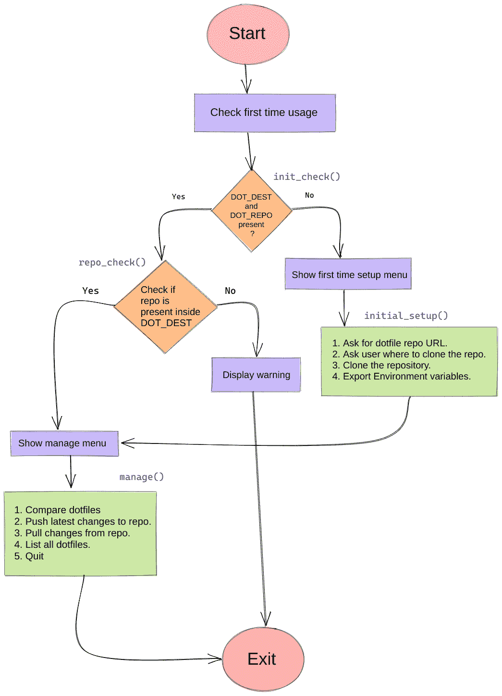
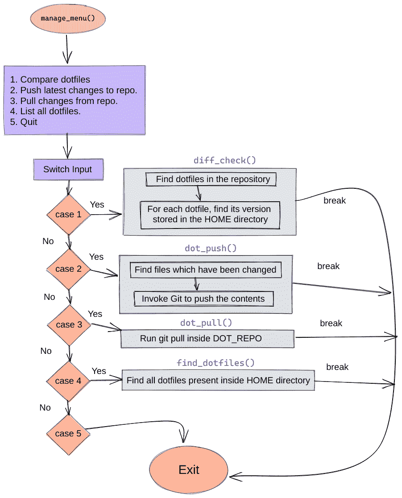

# 如何从头开始构建自己的 Linux 点文件管理器

> 原文：<https://www.freecodecamp.org/news/build-your-own-dotfiles-manager-from-scratch/>

作为一个新的 linux？用户，您可能会意识到您的系统中存在大量的配置文件。这些特殊文件被称为“点文件”。

在本教程中，我们将学习如何制作一个点文件管理器，并在 GitHub 上创建这些文件的备份。

这些是什么。你可能会问。我们为什么需要它们？

点文件通常与系统上安装的特定程序相关联，用于定制这些程序/软件。

例如，如果您将 [zsh](http://zsh.sourceforge.net/FAQ/) 作为默认 shell，那么您的主目录中将会有一个`.zshrc`文件。
其他一些例子包括:

1.  这个坏的 boi 用于配置你的 VIM 编辑器。
2.  `.bashrc`:默认可用，用于更改 bash 设置。
3.  `.bash_aliases`:这个文件一般用来存储你的命令别名。
4.  `.gitconfig`:存储与 Git 相关的配置。
5.  `.gitmessage`:用于在使用`git commit`时提供提交消息模板。

这些**。当你开始根据自己的需要定制 linux 时，点文件**会随着时间而改变。

如果在某些情况下你搞砸了什么，创建这些文件的备份是必要的？想要回到之前的稳定状态。这就是 VCS(版本控制软件)发挥作用的地方。

在这里，我们将学习如何通过编写一个简单的 shell 脚本并将我们的点文件存储在 GitHub 上来自动化这项任务。


Source : giphy.com

## 内容

*   [第一步，可视化脚本](#firststeps)
*   [获取依赖关系](#gettingdependencies)
*   [开始编码，一个模块接一个模块](#startcoding)
*   [爵士乐？？收起我们的剧本](#jazzingupourscript)
*   [最终结果](#theendresult)
*   [总结、总结](#summary)

## 第一步

哦，在我们继续之前，让我们给我们的脚本命名: **dotman** ，(点)file (man)ager。
你喜欢吗？？

在我们编写第一行代码之前，我们需要列出我们的需求，并设计我们的 shell 脚本应该如何工作。

### 我们的要求

我们将使 dotman 变得简单易用。它应该能够:

1.  找到我们系统中的点文件？。
2.  区分 git 存储库中的文件和系统中的文件。
3.  更新我们的点文件存储库(推送至远程或从中提取)。
4.  易于使用(我们不希望在一个脚本中有 5 个不同的参数)。

### 让我们想象一下



## 获取依赖关系

1.  我们需要 Git，因为我们可能想要回到以前的 dotfile 版本。另外，我们将把我们的点文件存储在 VCS 主机中(GitHub/GitLab/Bitbucket/Gittea)。
    没有安装 Git？通过下面的指南来学习如何根据你的系统安装它。

2.  `Bash`
    这将在你的 Linux/Unix/MacOS 机器上默认可用。
    通过检查版本`bash --version`来验证这一点。
    应该是这样的。不要太担心版本，因为我们的脚本对于 Bash > =3 会工作得很好。

```
GNU bash, version 4.4.20(1)-release (i686-pc-linux-gnu)
Copyright (C) 2016 Free Software Foundation, Inc.
License GPLv3+: GNU GPL version 3 or later <http://gnu.org/licenses/gpl.html>

This is free software; you are free to change and redistribute it.
There is NO WARRANTY, to the extent permitted by law. 
```

## 开始编码

现在一切都准备好了。启动您最喜欢的编辑器/IDE。


Source: giphy.com

我们需要声明一个 [she bang](https://en.wikipedia.org/wiki/Shebang_(Unix)) 来表示我们将调用一个解释器来执行。
在剧本的开头包括这样一行:

```
#!/usr/bin/env bash 
```

命令(程序)`env`作为新进程执行，然后调用作为参数提供的命令。

在我们的例子中,`bash`是由 env 进程自动启动的。这是它的`env`职责，找到`bash`在我们系统中的位置，并在脚本中替换它的路径。例如，你可以用`python`或`ruby`来代替`bash`。

现在只需更改文件权限，使我们的脚本可执行。

```
chmod +x dotman.sh 
```

我们将在这个脚本中使用函数式编程风格，也就是说，任务的每一部分都将包含在某个*函数()*中。
让我们按照上面的流程图，编写我们的第一个函数`init_check()`。

我们将只依赖用户的两个输入:

1.  `DOT_DEST`:存储库在本地系统中的位置。
2.  `DOT_REPO`:远程点文件仓库的 url。

这两个变量必须出现在默认的 shell 配置中(例如`.bashrc`)。我们将在本教程的后面学习如何做到这一点。

```
init_check() {
	# Check wether its a first time use or not
	if [[ -z ${DOT_REPO} && -z ${DOT_DEST} ]]; then
	    # show first time setup menu
		# initial_setup
	else
		# repo_check
	    # manage
	fi
} 
```

`-z`选项用于检查变量是否被设置(也就是说，它是否对我们的脚本可用)。如果不是，那么我们将调用我们的`initial_setup()`函数。否则，我们将检查存储库是否被克隆，是否存在于`DOT_DEST`文件夹中。

现在让我们编写`initial_setup`函数:

```
initial_setup() {
	echo -e "\n\nFirst time use, Set Up d○tman"
	echo -e "....................................\n"
	read -p "Enter dotfiles repository URL : " -r DOT_REPO

	read -p "Where should I clone $(basename "${DOT_REPO}") (${HOME}/..): " -r DOT_DEST
	DOT_DEST=${DOT_DEST:-$HOME}
	if [[ -d "$HOME/$DOT_DEST" ]]; then
		# clone the repo in the destination directory
		if git -C "${HOME}/${DOT_DEST}" clone "${DOT_REPO}"; then
			add_env "$DOT_REPO" "$DOT_DEST"
			echo -e "\ndotman successfully configured"
			goodbye
		else
			# invalid arguments to exit, Repository Not Found
			echo -e "\n$DOT_REPO Unavailable. Exiting"
			exit 1
		fi
	else
		echo -e "\n$DOT_DEST Not a Valid directory"
		exit 1
	fi
} 
```

很基本，对吧？现在，让我们一起经历这一切，了解发生了什么。

*   `read` startement 是一个 shell bulitin，用于从终端获取输入。`-p`选项指定输入前的提示。
*   读取后的下一行被称为[参数扩展](https://www.gnu.org/software/bash/manual/html_node/Shell-Parameter-Expansion.html)，如果用户没有输入点 _DEST，则默认值被指定为`/home/username/`(如果点 _DEST 未设置或为空，则替换$HOME 的扩展)否则，替换用户输入的值。
*   if 语句中的`-d`检查目录是否存在(或者从技术上讲),用户提供的目录在我们的系统中实际上是不是一个有效的路径。
*   在 git 中使用`-C`选项将存储库克隆到用户指定的路径。

现在让我们看看如何在函数`add_env()`中导出环境变量。

```
add_env() {
	# export environment variables
	echo -e "\nExporting env variables DOT_DEST & DOT_REPO ..."

	current_shell=$(basename "$SHELL")
	if [[ $current_shell == "zsh" ]]; then
		echo "export DOT_REPO=$1" >> "$HOME"/.zshrc
		echo "export DOT_DEST=$2" >> "$HOME"/.zshrc
	elif [[ $current_shell == "bash" ]]; then
		# assume we have a fallback to bash
		echo "export DOT_REPO=$1" >> "$HOME"/.bashrc
		echo "export DOT_DEST=$2" >> "$HOME"/.bashrc
	else
		echo "Couldn't export DOT_REPO and DOT_DEST."
		echo "Consider exporting them manually".
		exit 1
	fi
	echo -e "Configuration for SHELL: $current_shell has been updated."
} 
```

在您的终端中运行`echo $SHELL`将为您提供默认 shell 的路径。
`basename`命令用于打印我们的 SHELL 的“名称”(即没有任何前导/)的实际名称。

```
> echo $SHELL
/usr/bin/zsh
> basename $SHELL
zsh 
```

*   `export`是一个常用的语句:它允许您导出:)环境变量。
*   `>>`被称为重定向操作符，即语句**的输出 echo "export DOT_DEST=$2"** 被定向(追加)到`zshrc`文件的末尾。

现在，一旦用户完成了第一次设置，我们需要向他们展示“经理”选项。



```
manage() {
	while :
	do
		echo -e "\n[1] Show diff"
		echo -e "[2] Push changed dotfiles to remote"
		echo -e "[3] Pull latest changes from remote"
		echo -e "[4] List all dotfiles"
		echo -e "[q/Q] Quit Session"
		# Default choice is [1]
		read -p "What do you want me to do ? [1]: " -n 1 -r USER_INPUT
		# See Parameter Expansion
		USER_INPUT=${USER_INPUT:-1}
		case $USER_INPUT in
			[1]* ) show_diff_check;;
			[2]* ) dot_push;;
			[3]* ) dot_pull;;
			[4]* ) find_dotfiles;;
			[q/Q]* ) exit;;
			* )     printf "\n%s\n" "Invalid Input, Try Again";;
		esac
	done
} 
```

*   你已经熟悉了`read`。`-n 1`选项指定了允许的输入长度，在我们的例子中，用户只能输入 1、2、3、4、q 和 q 中的一个字符。

现在我们必须在主目录中找到所有的点文件。

```
find_dotfiles() {
	printf "\n"
	readarray -t dotfiles < <( find "${HOME}" -maxdepth 1 -name ".*" -type f )
	printf '%s\n' "${dotfiles[@]}"
} 
```

该功能分为两部分:

1.  `find`
    find 命令你猜对了，在我们的系统中搜索文件和目录。让我们一部分一部分来理解。

*   `-type f`选项指定我们只想搜索常规文件，而不是目录、字符或块或设备文件。
*   `-maxdepth`选项告诉 find 在起点以下最多下降 1 层(非负整数)目录。你可以用 2，3 等替换 1 来搜索子目录。
*   `-name`采用模式(glob)进行搜索。例如，您可以搜索所有的`.py`文件:`-name ".py"`。

2.  `readarray`(也是`mapfile`的同义词)
    将标准输入中的行读入索引数组变量`dotfiles`。
    `-t`选项从每一行读取的内容中删除任何尾部分隔符(默认换行符)。

> 注意:如果您有一个旧版本的 Bash (<4)，`readarray`可能不会作为内置文件出现。我们可以通过使用一个`while`循环来实现相同的功能。

```
while read -r value; do
    dotfiles+=($value)
done < <( find "${HOME}" -maxdepth 1 -name ".*" -type f ) 
```

我们现在要创建脚本中最重要的函数之一，`diff_check`。

```
diff_check() {

	if [[ -z $1 ]]; then
		declare -ag file_arr
	fi

	# dotfiles in repository
	readarray -t dotfiles_repo < <( find "${HOME}/${DOT_DEST}/$(basename "${DOT_REPO}")" -maxdepth 1 -name ".*" -type f )

	# check length here ?
	for (( i=0; i<"${#dotfiles_repo[@]}"; i++))
	do
		dotfile_name=$(basename "${dotfiles_repo[$i]}")
		# compare the HOME version of dotfile to that of repo
		diff=$(diff -u --suppress-common-lines --color=always "${dotfiles_repo[$i]}" "${HOME}/${dotfile_name}")
		if [[ $diff != "" ]]; then
			if [[ $1 == "show" ]]; then
				printf "\n\n%s" "Running diff between ${HOME}/${dotfile_name} and "
				printf "%s\n" "${dotfiles_repo[$i]}"
				printf "%s\n\n" "$diff"
			fi
			file_arr+=("${dotfile_name}")
		fi
	done
	if [[ ${#file_arr} == 0 ]]; then
		echo -e "\n\nNo Changes in dotfiles."
		return
	fi
}

show_diff_check() {
	diff_check "show"
} 
```

我们在这里的目标是找到存储库中已经存在的点文件，并将它们与主目录中可用的文件进行比较。

*   关键字`declare`让我们创建变量。`-a`选项用于创建数组，`-g`告诉 declare 在脚本中“全局”使用变量。
*   给我们数组的长度。

下一个重要的命令是`diff`，用于逐行比较文件。例如:

```
> echo -e "abc\ndef\nghi" >> fileA.txt
> echo -e "abc\nlmn\nghi" >> fileB.txt
> cat fileA.txt
abc
def
ghi
> cat fileB.txt
abc
lmn
ghi
> diff -u fileA.txt fileB.txt
--- fileA.txt	2020-07-17 16:24:16.138172662 +0530
+++ fileB.txt	2020-07-17 16:24:26.686075270 +0530
@@ -1,3 +1,3 @@
 abc
-def
+lmn
 ghi 
```

`dot_push()`功能。

```
dot_push() {
	diff_check
	echo -e "\nFollowing dotfiles changed : "
	for file in "${file_arr[@]}"; do
		echo "$file"
		cp "${HOME}/$file" "${HOME}/${DOT_DEST}/$(basename "${DOT_REPO}")"
	done

	dot_repo="${HOME}/${DOT_DEST}/$(basename "${DOT_REPO}")"
	git -C "$dot_repo" add -A

	echo -e "Enter Commit Message (Ctrl + d to save):"
	commit=$(</dev/stdin)

	git -C "$dot_repo" commit -m "$commit"

	# Run Git Push
	git -C "$dot_repo" push
} 
```

我们在这里通过使用`cp`命令将文件复制到我们的点文件 repo 来覆盖文件。

最后是`dot_pull()`功能:

```
dot_pull() {
	# pull changes (if any) from the host repo
	echo -e "\nPulling dotfiles ..."
	dot_repo="${HOME}/${DOT_DEST}/$(basename "${DOT_REPO}")"
	echo -e "\nPulling changes in $dot_repo\n"
	git -C "$dot_repo" pull origin master
} 
```

## 爵士乐吗？？我们的剧本

到目前为止，我们已经实现了最初的设想。但是你知道吗，少了点什么.......？

**颜色**


Source: tenor.com

有很多方法可以做到这一点，但最流行的是使用[转义序列](https://wiki.bash-hackers.org/scripting/terminalcodes)。但我们将使用一个名为`tput`的工具，它是一个人性化的界面，根据用户的终端输出颜色。它在 Linux/MacOS 中默认可用。
这里有一个简短的演示。

以**粗体**打印文本

```
echo "$(tput bold)This$(tput sgr0) word is bold" 
```

更改背景颜色。

```
echo "$(tput setab 10)This text has green background$(tput sgr0)" 
```

要更改前景色

```
echo "$(tput setaf 10)This text has blue color$(tput sgr0)" 
```

也可以组合属性。

```
echo "$(tput smul)$(tput setaf 10) This text is underlined & green $(tput rmul)$(tput sgr0)" 
```

让我把这个任务留给你:在脚本中添加你喜欢的颜色。
阅读[本](http://linuxcommand.org/lc3_adv_tput.php)指南，了解和探索更多关于 tput 的信息。

## 最终结果

我希望在这一点上你仍然支持我。但它是结束:(而且我们现在有一个好看的点文件管理器。


Source: giphy.com

现在只需运行脚本(如果还没有的话)来看看它的运行情况。

```
./dotman.sh 
```

需要参考的可以看我版本的 [**dotman**](https://github.com/Bhupesh-V/dotman/blob/master/dotman.sh) 。如果你对这个教程有任何问题，请随意发表，或者直接给我发电子邮件[。](mailto:varshneybhupesh@gmail.com)

[](https://github.com/Bhupesh-V/dotman)

我已经把它作为一个模板，所以你可以用它来破解你自己的 dotman 版本。

## 摘要

让我们总结一下我们在本教程中学到的一些重要的东西。

1.  使用`basename /path/to/dir/file/`从路径中获取文件名。
2.  使用`git -C /path/to/clone/to clone https://repo.url`将存储库克隆到与当前工作目录不同的目录。
3.  `echo $SHELL`可以用来确定你默认的 shell 是什么。
4.  使用`find`在您的 Linux 系统中搜索文件和文件夹。
5.  `diff`命令用于比较两个文件。类似于`git diff`。
6.  在函数内部声明的数组只能在该函数内部访问。使用`-g`选项使它们成为全局的，例如`declare -ag file_arr`。
7.  `tput`可用于在终端上显示彩色文本。

如果你喜欢这个教程，你可以在我的博客上阅读更多我的东西。你也可以在[推特](https://twitter.com/bhupeshimself)上和我联系。

快乐学习？