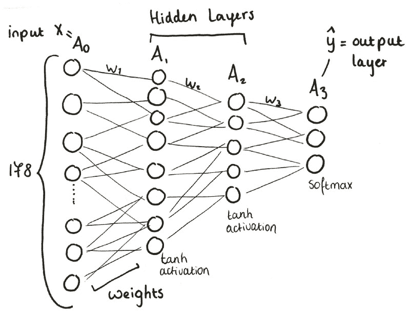
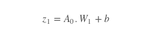
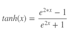
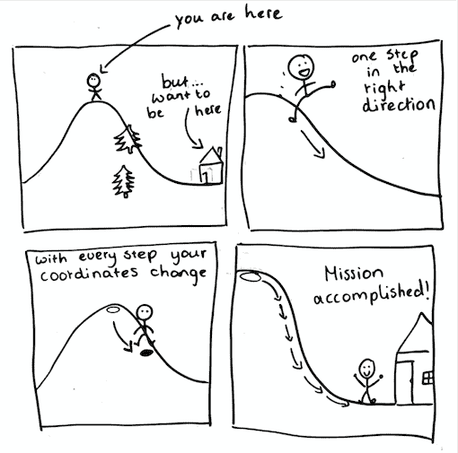
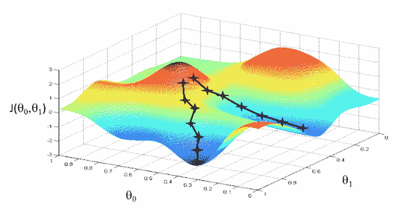
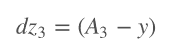
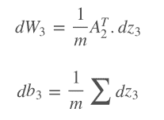
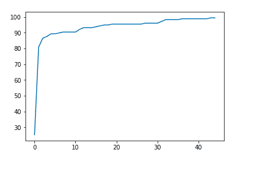
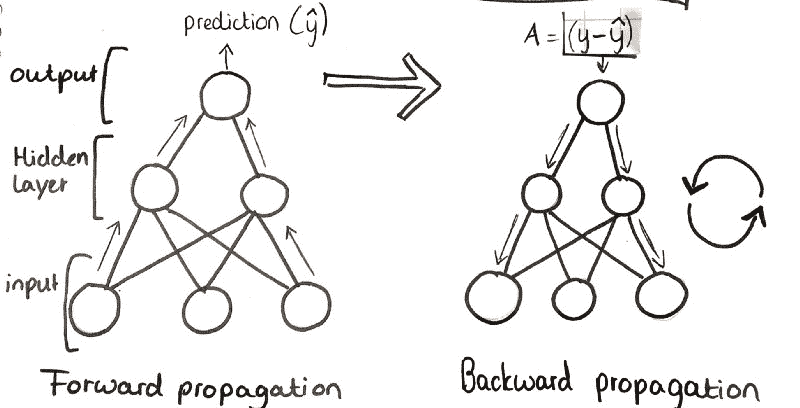

# 如何从零开始构建三层神经网络

> 原文：<https://www.freecodecamp.org/news/building-a-3-layer-neural-network-from-scratch-99239c4af5d3/>

达芙妮·科内利塞

# 如何从零开始构建三层神经网络


Photo by [Thaï Hamelin](https://unsplash.com/photos/ok6BBLD3b_0?utm_source=unsplash&utm_medium=referral&utm_content=creditCopyText) on [Unsplash](https://unsplash.com/search/photos/network?utm_source=unsplash&utm_medium=referral&utm_content=creditCopyText)

在这篇文章中，我将介绍构建一个三层****神经网络所需的步骤。**我将解决一个问题，并向您解释这个过程以及过程中最重要的概念。**

#### ****要解决的问题****

**意大利的一位农民在他的贴标机上遇到了一个问题:它把三种葡萄酒品种的标签搞混了。现在他还剩 178 瓶，没人知道是哪个品种生产的！为了帮助这个可怜的人，我们将建立一个基于酒的 13 个属性识别酒的分类器。**

****

**我们的数据被标记的事实(用三个栽培品种的标签之一)使得这成为一个 [**监督学习**](https://towardsdatascience.com/machine-learning-101-supervised-unsupervised-reinforcement-beyond-f18e722069bc) 的问题。本质上，我们想要做的是使用我们的输入数据(178 个未分类的酒瓶)，通过我们的[神经网络](https://en.wikipedia.org/wiki/Artificial_neural_network)，然后得到每个葡萄酒品种的正确标签作为输出。**

**我们将训练我们的算法，越来越好地预测(y-hat)哪个瓶子属于哪个标签。**

**现在是时候开始构建神经网络了！**

#### ****接近****

**构建神经网络几乎就像构建一个非常复杂的函数，或者拼凑一个非常困难的配方。在开始的时候，你必须要做的事情或步骤看起来让人不知所措。但如果你把每件事都分解，一步一步来，就没问题了。**

**

Overview of the 3 Layer neural network, a wine classifier** 

**简而言之:**

*   **输入层(x)由 178 个神经元组成。**
*   **A1，第一层，由 8 个神经元组成。**
*   **A2，第二层，由 5 个神经元组成。**
*   **A3，即第三层和输出层，由 3 个神经元组成。**

#### **第一步:通常的准备工作**

**导入所有必要的库(NumPy、skicit-learn、pandas)和数据集，并定义 x 和 y。**

```
`#importing all the libraries and dataset`
```

```
`import pandas as pdimport numpy as np`
```

```
`df = pd.read_csv('../input/W1data.csv')df.head()`
```

```
`# Package imports`
```

```
`# Matplotlib import matplotlibimport matplotlib.pyplot as plt`
```

```
`# SciKitLearn is a machine learning utilities libraryimport sklearn`
```

```
`# The sklearn dataset module helps generating datasets`
```

```
`import sklearn.datasetsimport sklearn.linear_modelfrom sklearn.preprocessing import OneHotEncoderfrom sklearn.metrics import accuracy_score`
```

#### **步骤 2:初始化**

**在我们使用我们的权重之前，我们必须初始化它们。因为我们还没有用于权重的值，所以我们使用 0 到 1 之间的随机值。**

**在 Python 中，`random.seed`函数生成“随机数”。然而，随机数并不是真正的随机。生成的数字是**伪随机**，这意味着这些数字是由一个复杂的公式生成的，使其看起来随机。为了生成数字，公式将以前生成的值作为输入。如果没有生成以前的值，它通常将时间作为第一个值。**

**这就是我们播种生成器的原因——确保我们总是得到相同的随机数。我们提供了一个固定值，数字生成器可以从这个值开始，在本例中是零。**

```
`np.random.seed(0)`
```

#### **步骤 3:正向传播**

**训练神经网络大致有两个部分。首先，你通过神经网络向前传播。也就是说，您正在向前“迈步”,并将这些结果与真实值进行比较，以获得您的输出与应有值之间的差异。你基本上可以看到神经网络是如何工作的，并找到错误。**

**在我们用伪随机数初始化权重之后，我们向前迈出线性的一步。我们通过将我们的输入 A0 乘以随机初始化权重的 [**点积**](https://en.wikipedia.org/wiki/Dot_product) 加上**偏差**来计算。我们一开始的偏差是 0。这表现为:**

****

**现在，我们将 z1(我们的线性步骤)通过我们的第一个**激活函数**。激活函数在神经网络中非常重要。本质上，它们将输入信号转换为输出信号——这就是为什么它们也被称为*传递函数。*他们通过将线性输入转换为非线性输出，将**非线性属性**引入到我们的函数中，使之有可能表示更复杂的函数。**

**有不同种类的激活功能(在本文的[中有详细解释)。对于这个模型，我们选择使用 **tanh** 激活函数来激活我们的两个隐藏层——A1 和 A2——这给了我们一个介于-1 和 1 之间的输出值。](https://towardsdatascience.com/activation-functions-and-its-types-which-is-better-a9a5310cc8f)**

**由于这是一个**多类分类问题**(我们有 3 个输出标签)，我们将对输出图层 A3 使用 **softmax** 函数，因为这将通过得出一个介于 0 和 1 之间的值来计算类的概率。**

**

tanh function** 

**通过将 z1 传递给激活函数，我们已经创建了第一个隐藏层 A1，它可以用作下一个线性步骤 z2 的计算输入。**

****

**在 Python 中，这个过程看起来像这样:**

```
`# This is the forward propagation functiondef forward_prop(model,a0):        # Load parameters from model    W1, b1, W2, b2, W3, b3 = model['W1'], model['b1'], model['W2'], model['b2'], model['W3'],model['b3']        # Do the first Linear step     z1 = a0.dot(W1) + b1        # Put it through the first activation function    a1 = np.tanh(z1)        # Second linear step    z2 = a1.dot(W2) + b2        # Put through second activation function    a2 = np.tanh(z2)        #Third linear step    z3 = a2.dot(W3) + b3        #For the Third linear activation function we use the softmax function    a3 = softmax(z3)        #Store all results in these values    cache = {'a0':a0,'z1':z1,'a1':a1,'z2':z2,'a2':a2,'a3':a3,'z3':z3}    return cache`
```

**最后，我们所有的值都存储在[缓存](https://en.wikipedia.org/wiki/Cache_(computing))中。**

#### ****步骤 4:反向传播****

**在我们通过我们的神经网络向前传播之后，我们向后传播我们的误差梯度以更新我们的权重参数。我们知道我们的错误，并希望尽可能地减少它。**

**我们通过使用**梯度下降**对误差函数相对于我们的神经网络的权重(W)进行**求导来做到这一点。****

**让我们用一个类比来形象化这个过程。**

**想象一下你下午去山里散步。但是现在一个小时过去了，你有点饿了，所以是时候回家了。唯一的问题是天很黑，而且有很多树，所以你既看不到你的家，也看不到你在哪里。哦，你把手机忘在家里了。**

**但是你记得你的房子在一个山谷里，是整个地区的最低点。所以如果你只是一步一步往山下走，直到感觉不到任何坡度，理论上应该就到了你家。**

**就这样，一步一步小心地往下走。现在把山想象成损失函数，你就是算法，试图找到你的家(即**最低点**)。每次你向下走一步，我们就更新你的位置坐标(算法**更新参数**)。**

****

**损失函数用山来表示。为了获得低损耗，该算法遵循损耗函数的斜率，即导数。**

**当我们下山时，我们正在更新我们的位置坐标。该算法更新神经网络的参数。通过接近最小点，我们正在接近我们的目标**最小化我们的误差。****

**实际上，梯度下降看起来更像这样:**

****

**我们总是从计算损失函数相对于 z 的斜率**开始，z 是我们采取的线性步骤的斜率。****

**符号如下:dv 是损失函数相对于变量 v 的导数。**

****

**接下来，我们计算损失函数相对于权重和偏差的**斜率。因为这是一个 3 层 NN，我们将对 z3，2，1 + W3，2，1 和 b3，2，1 重复这个过程。从输出层向后传播到输入层。****

****

**这个过程在 Python 中是这样的:**

```
`# This is the backward propagation functiondef backward_prop(model,cache,y):`
```

```
`# Load parameters from model    W1, b1, W2, b2, W3, b3 = model['W1'], model['b1'], model['W2'], model['b2'],model['W3'],model['b3']        # Load forward propagation results    a0,a1, a2,a3 = cache['a0'],cache['a1'],cache['a2'],cache['a3']        # Get number of samples    m = y.shape[0]        # Calculate loss derivative with respect to output    dz3 = loss_derivative(y=y,y_hat=a3)`
```

```
`# Calculate loss derivative with respect to second layer weights    dW3 = 1/m*(a2.T).dot(dz3) #dW2 = 1/m*(a1.T).dot(dz2)         # Calculate loss derivative with respect to second layer bias    db3 = 1/m*np.sum(dz3, axis=0)        # Calculate loss derivative with respect to first layer    dz2 = np.multiply(dz3.dot(W3.T) ,tanh_derivative(a2))        # Calculate loss derivative with respect to first layer weights    dW2 = 1/m*np.dot(a1.T, dz2)        # Calculate loss derivative with respect to first layer bias    db2 = 1/m*np.sum(dz2, axis=0)        dz1 = np.multiply(dz2.dot(W2.T),tanh_derivative(a1))        dW1 = 1/m*np.dot(a0.T,dz1)        db1 = 1/m*np.sum(dz1,axis=0)        # Store gradients    grads = {'dW3':dW3, 'db3':db3, 'dW2':dW2,'db2':db2,'dW1':dW1,'db1':db1}    return grads`
```

#### **第五步:培训阶段**

**为了达到**最佳权重和偏差**，这将给出我们想要的输出(三种葡萄酒品种)，我们将不得不**训练**我们的神经网络。**

**我觉得这个很直观。对于生活中几乎任何一件事，你都要训练和练习很多次，才能做好。同样，一个神经网络将不得不经历许多[时期](https://stackoverflow.com/questions/31155388/meaning-of-an-epoch-in-neural-networks-training)或迭代来给我们一个准确的预测。**

**当你在学习任何东西的时候，比方说你在读书，你有一定的速度。这个速度不应该太慢，因为读这本书需要很长时间。但是也不能太快，因为你可能会错过书中非常有价值的一课。**

**同样的，你要为模型指定一个“**学习率**”。学习率是更新参数的乘数。这决定了他们的变化速度。如果学习率低，训练时间会更长。然而，如果学习率太高，我们可能会错过一个最小值。学习率表示为:**

****

*   ****:=** 表示这是一个定义，而不是一个等式或者被证明的陈述。**
*   *****一个*** 是学习率叫做 *alpha***
*   ****dL(w)** 是总损失相对于我们重量的导数 **w****
*   ****da** 是 *alpha* 的导数**

**经过一些实验，我们选择了 0.07 的学习率。**

```
`# This is what we return at the endmodel = initialise_parameters(nn_input_dim=13, nn_hdim= 5, nn_output_dim= 3)model = train(model,X,y,learning_rate=0.07,epochs=4500,print_loss=True)plt.plot(losses)`
```

****

**最后，是我们的图表。您可以绘制您的准确性和/或损失，以获得您的预测准确性的漂亮图表。经过 4500 个历元后，我们的算法的准确率达到了 99.4382022472 %。**

#### **简要**

**我们首先将数据输入神经网络，然后对这些输入数据逐层执行若干矩阵运算。对于这三层中的每一层，我们将输入与权重进行点积，并添加一个偏差。接下来，我们通过选择的激活函数传递这个输出。**

**然后，该激活函数的输出被用作下一层的输入，以遵循相同的过程。因为我们有三层，所以这个过程重复三次。我们最终的输出是 **y-hat** ，这是对哪种葡萄酒属于哪个品种的 ***预测*** 。这是正向传播过程的结束。**

**然后，我们计算我们的预测(y-hat)和预期输出(y)之间的**差**，并在反向传播期间使用该误差值。**

**在反向传播过程中，我们采用我们的误差——我们的预测 y-hat 和 y 之间的差异——并通过数学方法将其反向推过神经网络。我们正在从错误中学习。**

**通过对我们在第一个过程中使用的函数求导，我们试图发现我们应该给**权重**什么值，以便实现**最佳可能预测**。本质上，我们想知道我们的重量值和我们得出的结果误差之间的关系。**

**经过多次历元或迭代后，神经网络学会了通过调整其参数来适应我们的数据集，从而给我们提供更准确的预测。**

**

Overview of Forward and Backwards propagation** 

**这篇文章的灵感来自于 2 月 7 日开始的布莱奇利机器学习训练营第一周的挑战。在接下来的九周里，我是 50 名将学习机器学习基础知识的学生之一。每周我们讨论一个不同的主题，并且必须提交一个挑战，这需要你真正理解这些材料。**

**如果您有任何问题或建议，请告诉我！**

**或者如果你想查看全部代码，你可以在 Kaggle 上的这里找到[。](https://www.kaggle.com/daphnecor/week-1-3-layer-nn?scriptVersionId=2495447)**

**深入了解神经网络的推荐视频:**

*   **[3Blue1Brown](https://www.youtube.com/watch?v=aircAruvnKk&list=PLZHQObOWTQDNU6R1_67000Dx_ZCJB-3pi) 的神经网络系列**
*   **Siraj Raval 的深度学习系列**