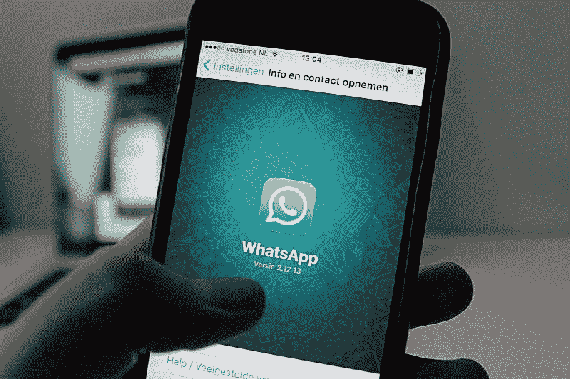
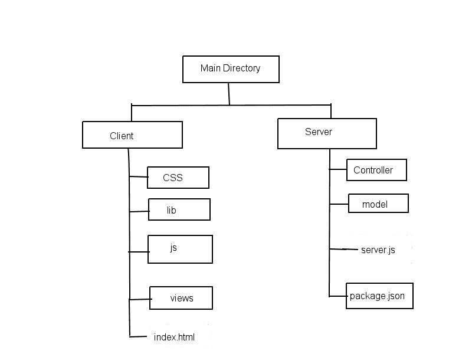
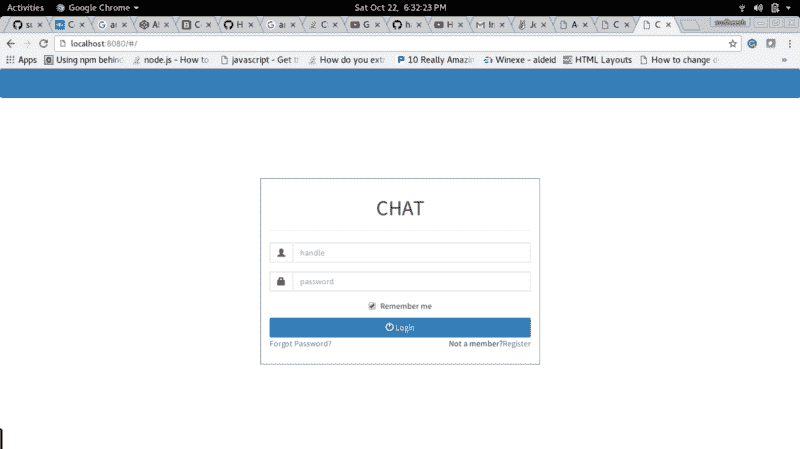
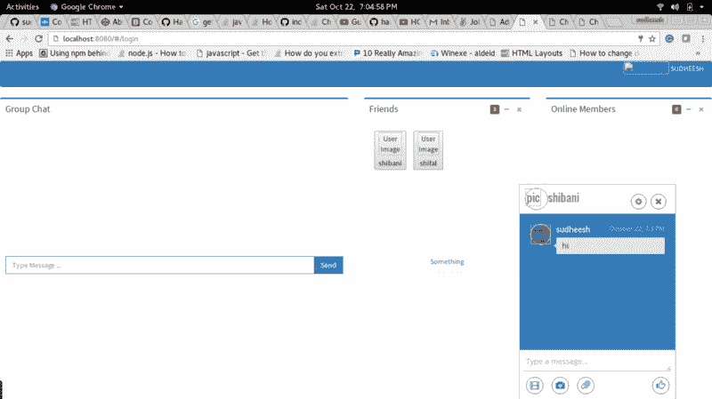

# 如何打造自己的实时聊天 app

> 原文：<https://www.freecodecamp.org/news/building-a-chat-application-with-mean-stack-637254d1136d/>

作者 Sudheesh Shetty

# 如何打造自己的实时聊天 app



消息应用程序越来越受欢迎。过去几年里，出现了 WhatsApp、Telegram、Signal 和 Line 等应用。

人们似乎更喜欢基于聊天的应用程序，因为它们允许实时交互。它们也为体验增添了个人色彩。

我最近参加了自由软件运动卡纳塔克邦在班加罗尔举办的研讨会，在那里我指导了一群大学生。

在互动过程中，我观察到一些事情:

1.  尽管鼓励学生与导师互动，但交流总是单向的。
2.  学生们经常羞于在会议中提问。
3.  在一对一的谈话中，他们更乐于提问和获得反馈。

所以我们必须找到一个解决方案来打破导师和学生之间的僵局。在这种情况下，本地聊天应用程序就派上了用场。人们喜欢匿名，这让他们有更多的权力来表达自己，随时随地提问。这是互联网上大多数流行论坛使用的相同咒语，如 Reddit 和 4chan。这些只是半匿名应用的几个巨大例子。

所以我开始思考这个想法。我想出了一些基本的要求和特点。

1.  用户通过给每个用户一个唯一的句柄(一个假名)来注册。只有句柄会显示给其他用户。因此，人们可以自由选择任何句柄，因此他们保持匿名。
2.  成员可以看到其他在线成员。他们可以选择公开，将消息广播给聊天中的所有在线成员。
3.  对于私人消息，发送者应该首先向其他成员发送请求。接受请求的其他成员可以与他们进行私人聊天。

### **使用的技术、工具**

1.  均值栈(Mongo，Express，Angular，Node)。
2.  支持实时一对一通信的套接字
3.  注册和登录的 AJAX

### 那么如何创建一个简单的聊天应用程序呢？

在本教程中，我将帮助您创建自己的聊天应用程序。您以后可以将它作为一个小部件集成到任何项目中！本教程不会专注于聊天应用程序的完整开发。但它会帮助你建立一个。

**先决条件:**你需要知道一些均值堆栈的基本知识，因为我们要利用它来构建一个均值堆栈。

首先，创建一个目录结构，如下所示。



**Directory structure of the project**

安装 [Node.js](https://nodejs.org/en/download/package-manager/) 和 [MongoDB](https://docs.mongodb.com/manual/administration/install-community/) 。

在本教程中，我们将使用 AngularJS 1。从[这里](https://angularjs.org/)下载 AngularJS 库，并复制到客户端目录下的 lib 文件夹。

如果你喜欢美化应用程序，你可以下载任何 CSS 库并复制到 lib 中。

### **构建服务器**

**第一步** —启动项目:

转到服务器目录并运行以下命令:

```
npm init
```

这将启动一个新项目。提供所需的所有细节。将会创建一个 *package.json* ，看起来像这样。

```
{
  "name": "chat",
  "version": "1.0.0",
  "description": "Chat application",
  "main": "server.js",
  "scripts": {
    "test": "echo \"Error: no test specified\" && exit 1"
  },
  "author": "Your name",
  "license": "ISC"
}
```

**第二步** —安装依赖项。

*   **socket.io** —是一个用于实时 web 应用的 *javascript* 库。它支持 web 客户端和服务器之间的实时双向通信。
*   **express** —是一个 *Node.js* 的 web 应用框架。它提供了开发 web 和移动应用程序的功能集。人们可以使用不同的中间件来响应 HTTP 请求，也可以呈现 HTML 页面。

```
npm install --save socket.io
npm install --save express
```

这将安装所需的依赖项，并将其添加到*package . JSON。*一个额外的字段将被添加到 *package.json* 中，如下所示:

```
"dependencies": {
    "express": "^4.14.0",
    "socket.io": "^1.4.8"
  }
```

**步骤 3 —** 创建服务器

创建一个服务于端口 3000 的服务器，并在被调用时发送 html。

通过传递 HTTP 对象初始化新的套接字连接。

事件*连接*将监听传入的套接字。

每个套接字发出 *disconnect* 事件，每当客户端断开连接时都会调用该事件。

*   **socket.on** 等待事件。每当该事件被触发时，回调函数被调用。
*   **io.emit** 用于向所有与之相连的套接字发出消息。

语法是:

```
socket.on('event', function(msg){})
io.emit('event', 'message')
```

创建一个名为 *server.js.* 的服务器，它应该:

*   在用户连接时向控制台打印一条消息
*   监听*聊天消息*事件，并将收到的消息广播到所有连接的套接字。
*   每当用户*断开连接时，*应该将消息打印到控制台。

服务器看起来会像这样:

```
var app = require('express')();
var http = require('http').Server(app);
var io = require('socket.io')(http);

app.get('/', function(req, res){
  res.sendfile('index.html');
});

io.on('connection', function(socket){
  console.log('user connected');
  socket.on('chat message', function(msg){
    io.emit('chat message', msg);
  });
  socket.on('disconnect', function(){
    console.log('user disconnected');
  });
});

http.listen(3000, function(){
  console.log('listening on *:3000');
});
```

### **构建客户端**

在客户端目录下创建 index.html，在 css 目录下创建 style.css，在 js 目录下创建 app.js。

***index . html:***

让我们编写一个简单的 HTML，它可以接收我们的消息并显示出来。

在你的 HTML 脚本中包含 *socket.io-client* 和 *angular.js* 。

```
<script src="/path/to/angular.js"></script>
<script src="/socket.io/socket.io.js"></script>
```

**socket.io** 为我们服务客户端。它默认连接到服务该页面的主机。最终的 HTML 看起来像这样:

```
<!doctype html>
<html ng-app="myApp">
  <head>
    <title>Socket.IO chat</title>
    <link rel="stylesheet" href="/css/style.css">
    <script src="/lib/angular/angular.js"></script>
    <script src="/socket.io/socket.io.js"></script>
    <script src="http://code.jquery.com/jquery-1.11.1.js">
    </script>
    <script src="/js/app.js"></script>
  </head>
  <body ng-controller="mainController">
    <ul id="messages"></ul>
    <div>
      <input id="m" ng-model="message" autocomplete="off" />
      <button ng-click="send()">Send</button>
    </div>
  </body>
</html>
```

***CSS/style . CSS:***

给它一些样式，使它看起来像一个聊天框。你可以利用任何图书馆。

```
* { margin: 0; padding: 0; box-sizing: border-box; }
body { font: 13px Helvetica, Arial; }
div { background: #000; padding: 3px; position: fixed; bottom: 0; width: 100%; }
div input { border: 0; padding: 10px; width: 90%; margin-right: .5%; }
div button { width: 9%; background: rgb(130, 224, 255); border: none; padding: 10px; }
#messages { list-style-type: none; margin: 0; padding: 0; }
#messages li { padding: 5px 10px; }
#messages li:nth-child(odd) { background: #eee; }
```

**js/app . js:**

创建 angular.js 应用程序并初始化套接字连接。

*   **socket.on** 监听特定的事件。每当调用该事件时，它都会调用一个回调函数。
*   **socket.emit** 用于向特定事件发出消息。

两者的基本语法都是:

```
socket.on(‘event name’, function(msg){});
socket.emit('event name', message);
```

因此，每当输入消息并单击按钮时，调用函数来发送消息。

每当套接字接收到消息时，就显示它。

JavaScript 将如下所示:

```
var app=angular.module('myApp',[]);

app.controller('mainController',['$scope',function($scope){
 var socket = io.connect();
 $scope.send = function(){
  socket.emit('chat message', $scope.message);
  $scope.message="";
 }
 socket.on('chat message', function(msg){
  var li=document.createElement("li");
  li.appendChild(document.createTextNode(msg));
  document.getElementById("messages").appendChild(li);
 });
}]);
```

### **运行应用程序**

转到我们的服务器所在的服务器目录。使用以下命令运行服务器:

```
node server.js
```

服务器开始在端口 3000 上运行。转到浏览器并键入以下 url:

```
http://localhost:3000
```

### **如何改进同一个应用**

您可以设计一个数据库来保存用户详细信息和消息。如果设计是可扩展的，以便您可以在以后添加更多功能，这将是一件好事。

您需要安装 Mongoose 或 MongoDB 模块来使用 Mongo 数据库:

```
npm install --save mongoose
```

或者:

```
npm install --save mongodb
```

这里是使用[mongose](http://mongoosejs.com/docs/index.html)和 [mongodb](https://docs.mongodb.com/getting-started/node/client/) 模块的文档。

下面是我的模式设计的样子:

```
{
 “_id” : ObjectId(“5809171b71e640556be904ef”),
 “name” : “Sudheesh Shetty”,
 “handle” : “sudheesh”,
 “password” : “556624370”,
 “phone” : “8888888888”,
 “email” : “sudheeshshetty@gmail.com”,
 “friends” : [
    {
      “name” : “abc”,
      “status” : “Friend”
    },
    {
      “name” : “xyz”,
      “status” : “Friend”
    }
 ],
 “__v” : 0
}
```

这里，每个成员的状态可以是:

*   朋友:声明该成员是朋友。
*   待定:如果成员尚未接受。
*   Blocked:如果该成员阻止了另一个成员。

假设成员拒绝了一个聊天请求。然后，发送者可以再次发送聊天请求。用户还可以通过创建额外的收藏来保存消息。每个文档都有消息、发送者、接收者和时间。

因此，根据您的特定需求以及您希望如何处理消息来设计您的数据库。

2.创建 REST APIs 来服务客户端。例如，发送主页的端点，用户可以从主页发出其他请求。

我的一些 API 端点是:

```
app.post(‘/register’,function(req,res){})

app.post(‘/login’,function(req,res){})

app.post(‘/friend_request’,function(req,res){})

app.post(‘/friend_request/confirmed’,function(req,res){})
```

3.想出一些很酷的附加功能并实现它们。

我创建了一个自己的聊天应用程序:

[**sudheeshshetty/Chat**](https://github.com/sudheeshshetty/Chat)
[*通过在 GitHub 上创建账号，为聊天开发做贡献。*github.com](https://github.com/sudheeshshetty/Chat)

快速浏览一下我的聊天应用程序:



Login screen



How it looks after login.

请看看它，如果你喜欢，在右上角给它一颗星。我有很多方法可以改进这个应用程序。如果你有任何建议，请送到 sudheeshshetty@gmail.com 给我。

如果你觉得这有帮助，你可以点击绿色的心跟随我，这样会有更多的人看到这一点。你也可以在 GitHub 和 [twitter](https://twitter.com/sudheeshshetty) 上关注我。