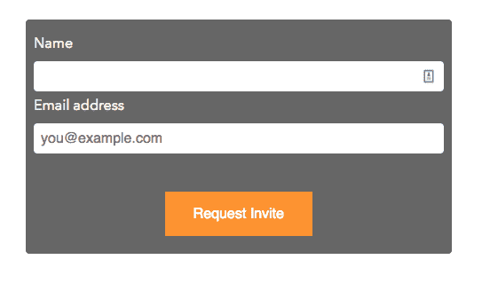
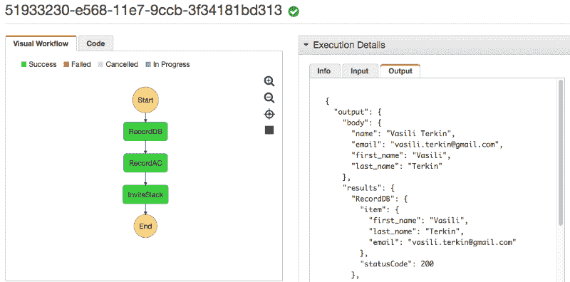

# 使用无服务器、步进功能和堆栈存储交换构建社区注册应用程序——第…

> 原文：<https://www.freecodecamp.org/news/building-a-community-sign-up-app-with-serverless-stepfunctions-and-stackstorm-exchange-episode-7c5f0e93dd6/>

作者:德米特里·齐明

# 使用无服务器、步进功能和堆栈存储交换构建社区注册应用程序——第 4 集

使用[无服务器框架](https://serverless.com/framework/)和来自 [StackStorm Exchange](https://exchange.stackstorm.org) 开源目录的现成功能，在 AWS 上构建一个真实世界的无服务器应用程序。

[第一集](https://medium.com/@dzimine/tutorial-building-a-community-on-boarding-app-with-serverless-stepfunctions-and-stackstorm-b2f7cf2cc419) | [第二集](https://medium.com/@dzimine/building-community-sign-up-app-with-serverless-stepfunctions-and-stackstorm-exchange-episode-2-b1efeb1b9bd6) | [第三集](https://medium.com/@dzimine/building-a-community-sign-up-app-with-serverless-stepfunctions-and-stackstorm-exchange-episode-6efb9c102b0a) |第四集

我们花了三集激动人心的情节来创建一个不平凡的无服务器应用程序。后端现在可以工作了，但是仍然缺少两样东西:一个 Web UI 和一个总结经验教训的最终讨论。让我们继续…在快速回顾了前几集之后:

*   在[第一集](https://medium.com/@dzimine/tutorial-building-a-community-on-boarding-app-with-serverless-stepfunctions-and-stackstorm-b2f7cf2cc419)中，我描述了我们正在构建的应用程序，引导你建立开发环境和创建一个无服务器项目，并展示了如何用[无服务器框架](https://serverless.com/framework)从 [StackStorm Exchange](https://exchange.stackstorm.org) 动作构建你的第一个 Lambda 函数。
*   在[第二集](https://medium.com/@dzimine/building-community-sign-up-app-with-serverless-stepfunctions-and-stackstorm-exchange-episode-2-b1efeb1b9bd6)中，我们添加了更多的动作:一个原生 Lambda 将用户信息记录到 DynamoDB，另一个来自 StackStorm Exchange 的动作调用 ActiveCampaign CRM 系统。您学习了更多的`serverless.yml`语法，并用 Lambda 函数实践了开发工作流。
*   在[第三集](https://medium.com/@dzimine/building-a-community-sign-up-app-with-serverless-stepfunctions-and-stackstorm-exchange-episode-6efb9c102b0a)中，我们用 StepFunction 连接了动作，学习了在步骤之间传递数据的技巧，努力调试 step function 的执行，最终获得了端到端的后端工作。

你可以从 [GitHub](https://github.com/dzimine/slack-signup-serverless-stormless/tree/DZ/3-add-stepfunction) 获得这一集的最终代码。

### 添加 Web 用户界面

我们需要一个 web 表单，接受用户名和电子邮件，并发布到我们的 StepFunction API 网关端点。我只是复制了我在[用 Python、StepFunctions 和 Web 前端无服务器](https://github.com/dzimine/slack-signup-serverless)探索无服务器时使用的那个。我承认，这是我从旧的[无服务器 Slack Invite](https://github.com/serverless-london/serverless-slack-invite) 项目中抢来的。

作为 Web 开发人员，你们肯定可以用 ReactJS 创建一些更优雅的东西——欢迎使用 PRs！无论您是构建自己的还是获取我的，都要这样做:创建一个目录`web`并将静态内容放在那里。

我使用`[http-server](https://www.npmjs.com/package/http-server)`快速查看我的静态表单:

```
cd webhttp-serverStarting up http-server, serving ./Available on:  http://127.0.0.1:8080
```

打开一个浏览器，在 [http://127.0.0.1:8080](http://127.0.0.1:8080) 查看表单，看到出来的是正确的，我们进入下一步。

如何将无服务器 web 前端部署到 AWS？通常，您将静态内容放在 S3 上，将其配置为服务于 web，让您的 web 应用程序调用您的后端端点，并记住在 API 网关端点上启用 CORS。

或者，您可以添加一个到 API 网关资源的路径，以提供来自 S3 存储桶的静态 web 内容。

**优点:** 1)不会干扰 CORS，2)不会调整你的 web 应用程序来指向正确的后端端点。额外的奖励:用[无服务器-apig-s3](https://github.com/sdd/serverless-apig-s3) 插件很容易做到。

缺点: 1)为 web 请求支付 API 网关费用 2)这个插件有点不稳定:对例子和小应用程序来说很好，但我不会把它用于任何类似生产的东西。

**PRO 提示:**对于高负载的严重 web 前端:部署到 CloudFront。或者使用类似 Netlify 的东西——看看最近来自 Serverless 的帖子[“如何用 Netlify 构建一个静态的无服务器站点”](https://serverless.com/blog/how-built-static-serverless-website-netlify/)。

在这里，我将使用 API 网关方法和 [serverless-apig-s3](https://github.com/sdd/serverless-apig-s3) 插件:我们不期望有大量负载。这很简单。手表:

安装插件(已经安装，已经完成):

```
npm install --save-dev serverless-apig-s3
```

更改`serverless.yml`。添加插件(已经完成)。添加[插件的配置](https://github.com/sdd/serverless-apig-s3):

```
...custom:  private: ${file(env.yml):private}  stage: ${opt:stage, self:provider.stage}  region: ${opt:region, self:provider.region}  apigs3:    dist: web    topFiles: true
```

```
...
```

```
plugins:  - serverless-plugin-stackstorm  - serverless-step-functions  - serverless-apig-s3
```

我们告诉插件选择我们的`web`目录，并把它放到 S3。`topFiles`标志告诉 API Gateway 在我们的端点暴露我们的`index.html`和`formsubmit.js`，在`/web/`下

现在用两个命令分别部署服务和客户端:

```
sls deploy
```

```
sls client deploy
```

部署服务将使用访问我们的 web 内容的路径来更新 API 网关。部署客户端会将 web 内容提升到一个 S3 桶。现在，您可以推断，如果您添加或删除 web 文件，而客户端部署不够，则需要完整的`sls deploy`。但是如果你只是改变网页文件，quick `sls client deploy`会把它们放到 AWS 上。

就是这样！
转到`https://YOUR-ENDPOINT.amazonaws.com/dev/web/index.html.`表格就在那里。按钮是橙色的。你输入用户信息和电子邮件，点击橙色按钮。绿色信息告诉你一切正常。很快你就收到了 Slack 的邀请。您在 AWS 控制台中检查 StepFunction 执行，看到一切都是绿色的。



**没有？！**最有可能的是，你击中了这个 [apig-s3 bug](https://github.com/sdd/serverless-apig-s3/issues/16) ，就像我一样。就像我做的一样，你需要手动完成最后一步。

打开 AWS 控制台->API 网关->资源->操作-部署 API。或者使用 AWS CLI:

```
# Find out your rest-api-id firstaws apigateway get-rest-apis
```

```
# Deploy the changes to the stage# Don't COPY-PASTE, it needs YOUR ID!aws apigateway create-deployment --rest-api-id  YOUR_API_ID  --stage-name dev
```

现在它对我起作用了。

**专业提示:**当一切都是从零开始部署时，该插件可以工作。但是如果你想再次`sls remove`和重新部署，你在移除堆栈时至少会碰到一个[其他插件错误](https://github.com/sdd/serverless-apig-s3/issues/11)。请看文章末尾关于如何正确清理的提示和技巧。



恭喜你！你做到了。你可能会跟进并构建自己的应用程序。你可能在某个时候因为沮丧或疲劳而放弃了它。你可能只是略读了课文和例子。但是如果你坚持到最后，你就知道了无服务器是危险的。

### 反射

在经历了这 4 集之后，你可能感觉到了:无服务器并不简单。当你构建一个无服务器的应用时，很多事情都会出错。

你可以责怪我:我确实犯了一些错误和遗漏(顺便说一句，非常感谢报道和评论！)

但是无服务器的复杂性并不全是我的错。我们将许多不同的服务(AWS 和第三方)与许多不同的框架和工具连接在一起。这些服务质量不一，也不方便(不要让我从 AWS StepFunction CLI 开始)。框架和工具仍在不断成熟(哪个无服务器插件让你最纠结？).

为什么要进入无服务器？因为对于某些类别的应用程序来说，它要便宜得多。这个社区注册就是一个很好的例子:我们曾经用 StackStorm 运行 StackStorm。它构建简单，像岩石一样坚固，但它每月花费 100 美元，甚至没有达到多区域可靠性。在无服务器的情况下，由于偶尔的负载模式，每月运行费用不到 1 美元。100 美元可以为我们购买大约 500 万份注册——这比我们需要的还要多！

在另一个极端，高可靠性要求的大容量应用程序也可能更好，因为它利用了“无限”的弹性，而自己构建和运行这些应用程序可能会很昂贵。我小心地使用“*可能*”和“*将*”，因为等式在不同的情况下有很大的不同。提前做好计算，观察你的负载模式，研究你的账单。

至于驯服复杂性，[无服务器框架](https://serverless.com/framework)有所帮助。要完全欣赏它，试着在没有它的情况下重做同样的应用程序。使其成为可靠、可重复、可审查的基础设施即代码。虽然无服务器框架不是唯一的游戏，但我特别喜欢它的可插拔架构和插件生态系统。

插件有助于解决核心无服务器框架没有覆盖的领域。使用插件，我们享受了构建 StepFuncions 和添加简单 web 前端的简单性(如果您还没有，尝试在没有插件的情况下重做)。还有更多:浏览并标记官方插件列表,在你的下一个项目中记住它们。

无服务器生态系统的最新成员 StackStorm Exchange 带来了一系列可重复使用的集成。虽然为 ActiveCampaign 抓取 API 或找到并使用未记录的 Slack API 调用并不难，但构建应用程序逻辑的工作价值很低。

探索已经存在的内容:虽然由于 StackStorm 植根于 IT 自动化，DevOps 集成占据主导地位，但我预计现在无服务器社区正在加入贡献和共同引导目录，多样性将会增长。

至此，我们正式完成了。尽情享受！

### 更多的提示和技巧

*   删除所有内容不会删除 DynamoDB 表。这是一个合理的默认值，但是当您尝试重新部署服务时，它会哭喊无法创建该表，因为它已经存在。删除:`aws dynamodb delete-table --table-name signup-stormless-dev`
*   由于 apig-s3 的一个 bug，`sls remove`将会报错桶不为空。移除堆叠时，手动移除腹板 s3 铲斗。`aws s3 rb s3://bucketname --force`
*   移除堆栈不会移除 DynamoDB 表。如果真的要从头开始，手动删除(先导出数据):
    `aws dynamodb delete-table --table-name slack-signup-dev`
*   有时`sls delete`没有清理干净。原因可能各不相同，但要找的地方是一样的。我告诉过你要掌握云的形成吗？去那里，找到一个删除失败的栈，找到原因，修复，删除栈。

希望这能帮助你学到一些新东西，发现一些有趣的东西，或者引发一些好的想法。请在这里的评论中分享你的想法，或者发微博给我[@ dz 亚胺](https://twitter.com/dzimine)。