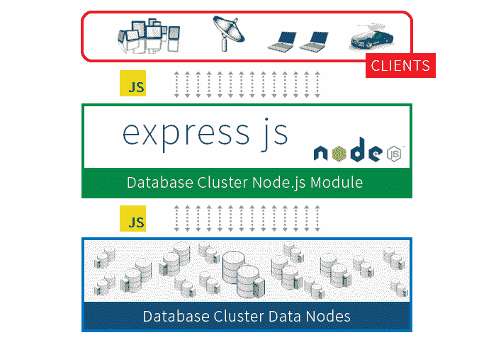

# 用 Express 和 MongoDB 构建 CRUD 应用程序—第 2 部分

> 原文：<https://www.freecodecamp.org/news/building-a-crud-application-with-express-and-mongodb-part-2-11d421bb0215/>

作者 Zell Liew

# 用 Express 和 MongoDB 构建 CRUD 应用程序—第 2 部分



本文是用 Express 和 MongoDB 创建 CRUD 应用程序的第二部分。我们将深入探讨[第一部分](http://www.zell-weekeat.com/crud-express-mongodb/) — **更新**和**删除**中没有涉及的最后两个操作。

事不宜迟，我们开始第二部分。

### CRUD —更新

**更新**操作在你想改变什么的时候使用。它只能由浏览器通过 **PUT** 请求来触发。像 **POST** 请求一样， **PUT** 请求可以通过 JavaScript 或者通过< form >元素触发。

让我们这次尝试通过 JavaScript 触发一个 **PUT** 请求，因为在上一篇文章中我们已经学习了如何通过一个< form >元素触发一个请求。

出于本教程的目的，我们将创建一个按钮，当点击它时，它会用达斯·维德写的引语替换尤达大师最后写的引语。

为此，我们首先在 index.ejs 文件中添加一个按钮:

```
<div>  <h2>Replace last quote written by Master Yoda with a quote written by Darth Vadar</h2>  <button id="update"> Darth Vadar invades! </button></div>
```

我们还将创建一个外部 JavaScript 文件，以便在单击按钮时执行 **PUT** 请求。根据明确的约定，这个文件放在一个名为 public 的文件夹中

```
$ mkdir public$ touch public/main.js
```

然后，我们必须告诉 Express，通过使用一个名为 express.static 的内置中间件，让公众可以访问这个公共文件夹

```
app.use(express.static('public'))
```

完成后，我们可以将 main.js 文件添加到 index.ejs 文件中:

```
<!-- ... --><script src="main.js"></script></body>
```

接下来，我们将在点击按钮时发送 **PUT** 请求:

```
// main.jsvar update = document.getElementById('update')
```

```
update.addEventListener('click', function () {  // Send PUT Request here})
```

在现代浏览器中，触发 **PUT** 请求的最简单方法是使用 [Fetch API](https://developer.mozilla.org/en/docs/Web/API/Fetch_API) 。它只在 [Firefox、Chrome 和 Opera](http://caniuse.com/#search=fetch) 上受支持，所以如果你想在实际项目中使用 Fetch，你可能想使用一个 [polyfill](https://github.com/github/fetch) 。

我们将向服务器发送以下获取请求。快速浏览一下，我会解释它的含义:

```
fetch('quotes', {  method: 'put',  headers: {'Content-Type': 'application/json'},  body: JSON.stringify({    'name': 'Darth Vader',    'quote': 'I find your lack of faith disturbing.'  })})
```

准备好理解为什么 Fetch 请求是这样写的了吗？:)

Fetch 接受两个参数。**第一个参数**是路径。在本例中，我们将请求发送到/quote，这将在我们的服务器上处理。

**第二个参数 options，**是一个可选对象，允许您控制许多不同的设置。我们上面使用的是方法、标题和主体。

我们将“方法”设置为“put ”,因为我们正在发送一个 PUT 请求。

这里的“Headers”指的是你要发送给服务器的 [HTTP 头](https://developer.mozilla.org/en-US/docs/Web/HTTP/Headers)。它是一个具有多个键值对的对象。

“正文”是指你发送给服务器的内容。

您可能会注意到，我们已经将内容类型设置为 application/json。我们还用 JSON.stringify 在正文中将达斯·维达的引用转换成 JSON。我们做这些步骤是因为我们要以 JSON 格式(在网上发送信息的标准格式)将达斯·维达的引用发送到服务器。

不幸的是，我们的服务器还不能读取 JSON 数据。我们可以通过使用 bodyparser.json()中间件来教它读取 JSON 数据:

```
app.use(bodyParser.json())
```

一旦我们完成了上面的所有工作，我们将能够通过使用 PUT 方法来处理这个 **PUT** 请求:

```
app.put('/quotes', (req, res) => {  // Handle put request })
```

那么，下一步就是学习如何在 MongoDB 中寻找尤达大师的最后一句引语，并把它改成达斯·维德的一句引语。

### 在 MongoDB 中更新集合

MongoDB 集合附带了一个名为 findOneAndUpdate 的方法，它允许我们从数据库中更改一个项目。它接受四个参数——查询、更新、选项和回调。

```
db.collections('quotes').findOneAndUpdate(  query,   update,   options,  callback)
```

**第一个参数 query** ，允许我们通过提供给它的键值对来过滤集合。我们可以通过将名称设置为 Yoda 来过滤 quotes 集合以获得大师 Yoda 的引用。

```
{  name: 'Yoda'}
```

**第二个参数 update，**告诉 MongoDB 如何处理更新请求。它使用 MongoDB 的[更新操作符](https://docs.mongodb.org/manual/reference/operator/update/)，比如$set、$inc 和$push。我们将使用$set 运算符，因为我们要把尤达的引语改成达斯·维德的引语:

```
{  $set: {    name: req.body.name,    quote: req.body.quote  }}
```

**第三个参数 options，**是一个可选参数，允许你定义附加的东西。因为我们要查找 Yoda 的最后一句话，所以我们将在选项内排序设置为{_id: -1}。这允许 MongoDB 从最新的条目开始搜索数据库。

```
{  sort: {_id:-1}}
```

我们的数据库中可能没有任何尤达大师的引语。发生这种情况时，MongoDB 默认不做任何事情。如果我们将 upsert 选项设置为 true，我们可以强制它创建一个新条目，这意味着如果没有找到条目，就插入(或保存):

```
{  sort: {_id: -1},  upsert: true}
```

最后一个参数是一个回调函数，一旦 MongoDB 用 Darth Vadar 的引用替换了 Yoda 的最后一个引用，它就允许你做一些事情。在这种情况下，我们可以将结果发送回 fetch 请求。

```
(err, result) => {  if (err) return res.send(err)  res.send(result)}
```

下面是我们在前面几个步骤中编写的完整的 findOneAndUpdate 命令:

```
app.put('/quotes', (req, res) => {  db.collection('quotes')  .findOneAndUpdate({name: 'Yoda'}, {    $set: {      name: req.body.name,      quote: req.body.quote    }  }, {    sort: {_id: -1},    upsert: true  }, (err, result) => {    if (err) return res.send(err)    res.send(result)  })})
```

现在，只要有人点击更新按钮，浏览器就会通过 Fetch 向我们的 Express 服务器发送一个 *PUT* 请求。然后，服务器通过将更改后的报价发送回 fetch 来做出响应。然后，我们可以通过使用 then 方法链接 fetch 来处理中的响应。这是可能的，因为 Fetch 返回一个 [Promise](https://developer.mozilla.org/en-US/docs/Web/JavaScript/Reference/Global_Objects/Promise) 对象。

检查 fetch 是否成功解析的正确方法是在响应对象上使用 okmethod。如果想读取从服务器发送的数据，可以返回 res.json():

```
fetch({ /* request */ }).then(res => {  if (res.ok) return res.json()}).then(data => {  console.log(data)})
```

如果您正在开发一个漂亮的 webapp，这是您使用 JavaScript 更新 DOM 的部分，这样用户可以立即看到新的变化。更新 DOM 超出了本文的范围，所以我们只需刷新浏览器来查看变化。

```
fetch({ /* request */ }).then(res => {  if (res.ok) return res.json()}).then(data => {  console.log(data)  window.location.reload(true)})
```

**创建**操作到此结束！让我们继续最后一个——**删除**。

### CRUD —删除

**删除**操作只能通过**删除**请求触发。这类似于**更新**请求，所以如果你理解我们之前做了什么，这很简单。

这一部分，让我们学习删除达斯·维达的第一句引言。为此，我们首先必须向 index.ejs 文件添加一个按钮。

```
<div>  <h2>Delete Darth Vader's first quote</h2>  <button id="delete"> Delete first Darth Vader quote </button></div>
```

然后，每当点击删除按钮时，我们将通过 Fetch 触发一个**删除**请求:

```
var del = document.getElementById('delete')
```

```
del.addEventListener('click', function () {  fetch('quotes', {    method: 'delete',    headers: {      'Content-Type': 'application/json'    },    body: JSON.stringify({      'name': 'Darth Vader'    })  })  .then(res => {    if (res.ok) return res.json()  }).  then(data => {    console.log(data)    window.location.reload()  })})
```

然后，我们可以在服务器端用 delete 方法处理该事件:

```
app.delete('/quotes', (req, res) => {  // Handle delete event here})
```

### 删除 MongoDB 中的条目

MongoDB 集合带有一个名为 findOneAndDelete 的方法，允许我们从数据库中删除一个项目。它接受三个参数——查询、选项和回调。这些参数与我们在更新 MongoDB 中的条目时在 findOneAndUpdate 中使用的参数完全相同。这里唯一的区别是选项中没有 upsert。

```
db.collections('quotes').findOneAndDelete(  query,   options,  callback)
```

记住，我们正试图删除达斯·维德的第一句话。为此，我们按名字“达斯·维德”过滤报价集合。因此，查询参数是:

```
{  name: req.body.name}
```

我们可以跳过 options 参数，因为我们不必颠倒排序顺序。然后，我们可以在回调函数中将响应发送回获取请求。

```
(err, result) => {  if (err) return res.send(500, err)  res.send('A darth vader quote got deleted')})
```

删除处理程序的完整代码如下:

```
app.delete('/quotes', (req, res) => {  db.collection('quotes').findOneAndDelete({name: req.body.name},   (err, result) => {    if (err) return res.send(500, err)    res.send('A darth vader quote got deleted')  })})
```

现在，只要有人点击删除按钮，浏览器就会通过 Fetch 向我们的 Express 服务器发送一个*删除*请求。然后，服务器通过发回一个错误或消息来响应。

和以前一样，我们可以在获取成功完成后重新加载网站。

```
fetch({ /* request */ }).then(res => {  if (res.ok) return res.json()}).then(data => {  console.log(data)  window.location.reload(true)})
```

**删除**操作到此结束！

### 包扎

现在，您已经了解了使用 Node 和 MongoDB 创建简单应用程序所需的所有知识。现在，去创造更多的应用程序吧，年轻的学徒。愿原力与你同在。