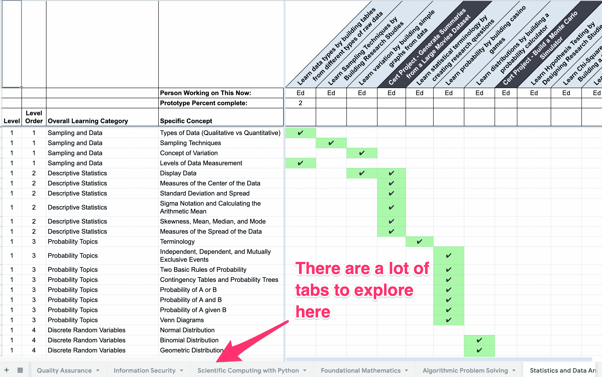
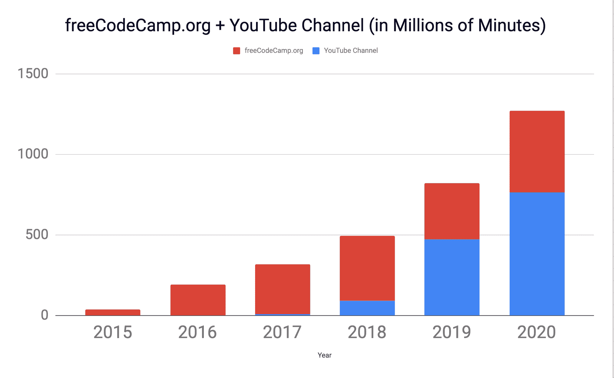

# 我们正在用高等数学和机器学习构建数据科学课程

> 原文：<https://www.freecodecamp.org/news/building-a-data-science-curriculum-with-advanced-math-and-machine-learning/>

我们正在开发深入的数据科学和机器学习课程。这些都会大量使用 Python。他们会教你开始做自己的研究和建立自己的模型所需的所有大学水平的数学知识。

目前，这些数据科学技能仅在全球少数几所大学教授。我们的目标是让任何人、任何地方都能够学习这些数据科学家在该领域使用的高级数学和机器学习概念。**免费。**以有趣、互动的方式。

## 2022 年 10 月 25 日更新:我们在这些课程上取得了相当大的进展。🏗️

我们有一个 40 门课程的完整列表，这些课程是我们正在开发的免费学士和副学士学位的一部分。你可以[阅读更多关于这些课程和未来工作的信息](https://www.freecodecamp.org/news/freecodecamp-math-computer-science-degree-update/)。

## 2021 年 7 月 15 日更新:我们已经达到了捐赠目标。🎉

我很高兴地宣布，社区已经成功实现了我们的数据科学课程承诺推动目标。我们从 2519 名捐助者那里筹集了 156667 美元。

我今天会见了达雷尔·西尔弗，他给了我一张巨额支票作为他的对等捐款。这实际上使每个人的捐款增加了一倍，总数达到 306，667 美元。

[https://giphy.com/embed/ZpRNOdDC4CrHDWai70](https://giphy.com/embed/ZpRNOdDC4CrHDWai70)

[通过 GIPHY](https://giphy.com/gifs/ZpRNOdDC4CrHDWai70)

非常感谢所有为认捐活动做出贡献的人。我们已经开始使用这些资金。

首先，我们带来了两名新成员。

Edward Patrowski 有近 20 年在高中和大学教授数学和计算机科学的经验。

他已经开始设计课程和制作 Jupyter 笔记本。我们将利用这些来教授微积分、统计学、线性代数以及其他支撑数据科学和机器学习的概念。

Kylie Ying 是麻省理工学院计算机科学研究生，从事机器学习和粒子物理方面的研究。

她正在创建一系列视频课程，这些课程将伴随构成数据科学课程的 Jupyter 笔记本。

在学术界和从事该领域工作的数据科学家的帮助下，Ed、Kylie 和其他贡献者已经开始[规划该课程的大部分内容。](https://docs.google.com/spreadsheets/d/1KXEJvgnAziiePMp2Ovf_ssDqCFFWYuycXWBNp91k3qM/edit?usp=sharing)

One of many sheets in our publicly viewable [curriculum planning document](https://docs.google.com/spreadsheets/d/1KXEJvgnAziiePMp2Ovf_ssDqCFFWYuycXWBNp91k3qM/edit#gid=959679268).

我们还使用 SymPy 构建了一个 [Jupyter 笔记本概念验证](https://mybinder.org/v2/gh/erictleung/data-science/HEAD),并使用自动化测试用例。在发布课程的第一个版本之前，我们将在未来几个月内进一步完善这一点。

## 数据科学课程将涵盖哪些内容？

您将能够通过数百个 Python 项目进行编程，获得以下方面的认证:

*   使用 Python 进行科学计算
*   基础数学(算术、代数、几何、三角学)
*   算法问题解决(数据结构，暴力，分治，最短路径，贪婪算法，动态规划)
*   描述统计学
*   数据工程(管道、ETL、存储、数据清理+异常检测方法)
*   探索性数据分析
*   一元和多元微积分
*   推理统计和概率
*   线性代数和矩阵代数
*   监督学习算法(分类、回归)
*   无监督学习算法(聚类、降维)
*   强化学习算法(神经网络)

您将能够在浏览器中或在操作系统中离线构建这些项目。您将使用装满交互式图表、数据集和自动化测试的 Jupyter 笔记本来检查您的代码。您将使用以下工具:

*   结构化查询语言
*   NumPy
*   我的天啊
*   交响乐
*   Matplotlib
*   熊猫
*   TensorFlow
*   Keras
*   和 scikit-learn

想象一下，能够在短短几千个小时内免费学习高等数学和计算机科学概念。这就是我们要通过利用这些最先进的 Python 生态系统工具来实现的目标。

## 观看演示视频(28 分钟观看)

[https://www.youtube.com/embed/xZbU6bCZFYo?feature=oembed](https://www.youtube.com/embed/xZbU6bCZFYo?feature=oembed)

## 这听起来雄心勃勃。freeCodeCamp 社区能做到这一点吗？

我们已经通过免费代码营社区 YouTube 频道上的课程教授了许多这些主题(如果你还没有订阅的话😉).主要的挑战将是把这些主题编织成一个有凝聚力的线性课程，并使其与自动化测试互动。

如果你对我们非营利组织的总体记录不熟悉，[请阅读我们的 2020 年年度报告](https://www.freecodecamp.org/news/freecodecamp-2021-year-in-numbers/)。仅去年一年，我们就在仅 498，000 美元的预算下提供了超过 13 亿分钟的学习时间。(也就是说，每捐赠一美元，就可以学习 50 个小时。)

People use freeCodeCamp a lot. We're growing about 60% year-over-year in minutes of usage.

## 你打算如何在浏览器中教授数学、数据科学和机器学习？

这些题目不好学。但是我们有策略将这些知识分解成可管理的部分。

最重要的设计决策是这样的:**为开发者优化**。我们没有考虑学校来设计课程，而是关注那些已经对网络开发有了基本了解的、有上进心的成人学习者。(如果他们还没有，他们可以只完成 freeCodeCamp 的前半部分课程。这是本数据科学课程的唯一先决条件。)

既然我们可以假设学习者已经知道如何编码，我们就可以用一种全新的方式来教数学。我们可以整合 Python，而不是使用传统的讲座或家庭作业——如铅笔、纸张和绘图计算器等工具。

这种实用的旋转给古老的解方程和证明定理的任务带来了新的意义。

## 如果我已经知道了其中的一些话题呢？我还能获得认证吗？

和 freeCodeCamp 的网络开发课程一样，大部分课程都是可选的。

如果您过去已经学习了其中的一些主题，那么您可以继续学习并构建认证项目。一旦你证明了你的知识，你就可以要求认证。

免费代码营的课程将保持直线，没有选修课。但是你可以在那一行选择你想开始的地方，如果你需要复习的话，你可以随时回溯。

## freeCodeCamp 不是已经在社区 YouTube 频道上涵盖了所有这些话题吗？

是的。在我们的社区 YouTube 频道上，我们有几乎所有这些主题的免费全日制课程。

视频比综合互动课程更容易制作。它们只是我们实现全面教授和认证数据科学家目标的第一步。

这些视频将是一个坚实的补充学习资源。它们非常适合在旅途中学习，它们深入研究了一些我们更实用的课程只会触及的概念。

## 如果我正在学习当前的 freeCodeCamp 课程怎么办？

没问题。你不会失去任何进步。

我们将把我们的一些认证转变为传统认证(像当前的数据可视化认证)转变为传统认证。但是您仍然拥有它，即使在我们发布新的认证之后，您仍然可以要求它。

## 发布路线图是什么？

请注意，freeCodeCamp 社区不设置公开发布日期。相反，我们推出新的课程，然后不断地维护和完善它。

以下是我们计划发布的内容:

**阶段#1** :我们将发布认证项目，您可以完成这些项目以获得每一项数据科学认证。我们还将发布视频课程，您可以结合其他学习资源来学习这些概念。

第二阶段:我们将公布每个认证的可选练习项目。这些将取代视频，我们将把视频转移到 freeCodeCamp 的补充学习资源部分。

我们认为我们可以在前两年完成大部分工作。然后...

第三阶段:我们将增加额外的可选练习项目，以提供更多的练习和重复。我们的最终目标是拥有比一个人一生所能合理完成的更多的编程实践。(你可能会说，我们已经通过项目 Euler 和 Rosetta 代码的客户端实现做到了这一点，但我们最终还需要数千年的数学知识。)

学习是一生的努力。freeCodeCamp 的课程将继续发展以反映这一点。

## 所有这些都是开源的吗？

是的。与 freeCodeCamp 的所有其他代码一样，它将使用极其宽松的 BSD-3 许可证进行许可。(它类似于麻省理工学院的许可证，但也保护我们的非营利组织免受假冒。)

和 freeCodeCamp 的其他课程一样，我们所有的课程都是知识共享许可的。准确地说是 [CC-BY-SA 4.0](https://creativecommons.org/licenses/by-sa/4.0/) 。本许可证是许可的，没有商业限制。没错。如果你愿意，你可以围绕免费代码营建立一个企业。

## 我如何参与这一新的数据科学课程？

如果您是教师、实践数据科学家或数学爱好者，[我们欢迎您的反馈](https://docs.google.com/forms/d/e/1FAIpQLScLiGgmYh2DxdTmPxS141J5knuOtcYN9ulOtBwsRbkuVwXRRQ/viewform?usp=sf_link)。

对于其他人，你应该支持我们的认捐活动。帮助我们为您、您的家人以及您在世界各地的邻居提供免费的开源数据科学课程。[捐到这里](https://www.freecodecamp.org/donate)。

## 我如何了解更多关于数据科学课程和认证的信息？

你很幸运。我上了 Changelog 播客(一个流行的开源播客)来谈论我们正在建立的这些新的认证。您可以在下面的嵌入式播客播放器中试听一下。(1 小时聆听):

按“播放”听我在 Changelog 播客上讲述数据科学课程