# 用 React 和 Elasticsearch 构建 GitHub Repo Explorer

> 原文：<https://www.freecodecamp.org/news/building-a-github-repo-explorer-with-react-and-elasticsearch-8e1190e59c13/>

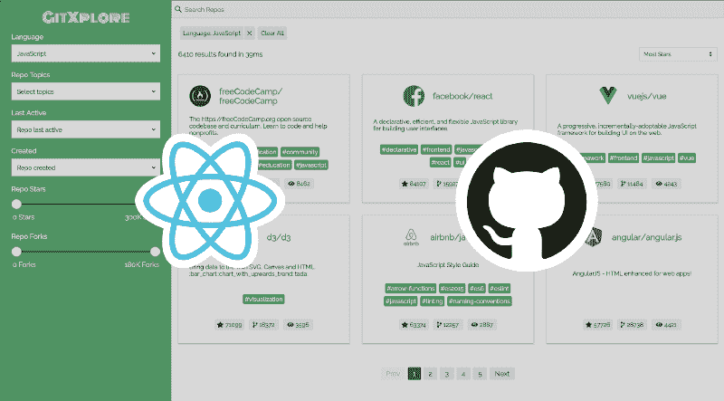

The [GitXplore](https://appbaseio-apps.github.io/gitxplore-app/) app

[Elasticsearch](https://www.elastic.co/products/elasticsearch) 是最受欢迎的[全文搜索](https://en.wikipedia.org/wiki/Full-text_search)引擎之一，可以让你快速搜索海量数据，而 [React](https://reactjs.org/) 可以说是[构建用户界面的最佳库](http://stateofjs.com/2017/front-end/results/)。在过去的几个月里，我一直在与人合作编写一个开源库， [**ReactiveSearch**](https://github.com/appbaseio/reactivesearch) ，它为 Elasticsearch 提供了 React 组件，并简化了构建搜索用户界面(UI)的过程。

这是我将在这个故事中构建的应用程序:

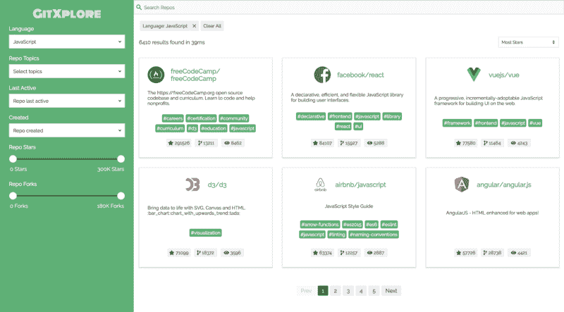

Check out the app on [CodeSandbox](https://codesandbox.io/s/github/appbaseio-apps/gitxplore-app/tree/master/)

### 弹性研究概述

Elasticsearch 是一个 [NoSQL](https://en.wikipedia.org/wiki/NoSQL) 数据库，可以在短时间内搜索大量数据。它通过检查每个文档中的所有单词，对以文档形式存储的数据(如对象)执行[全文搜索](https://en.wikipedia.org/wiki/Full-text_search)。

以下是 [Elasticsearch docs](https://www.elastic.co/guide/en/elasticsearch/reference/current/getting-started.html) 所说的:

> Elasticsearch 是一个高度可扩展的开源全文搜索和分析引擎。它允许您以接近实时的速度快速存储、搜索和分析大量数据。

即使你以前从未使用过 Elasticsearch，你也应该能够跟随这个故事，使用 React 和 ReactiveSearch 构建你自己的 Elasticsearch 支持的搜索。？

### 什么是反应式搜索？

[React search](https://github.com/appbaseio/reactivesearch)是一个用于 Elasticsearch 的 React UI 组件库。为了在 Elasticsearch 中搜索数据，需要编写 [**查询**](https://www.elastic.co/guide/en/elasticsearch/reference/current/query-dsl.html) 。然后，您需要在 UI 中格式化和呈现 JSON 数据。ReactiveSearch 简化了整个过程，因为您不需要担心编写这些查询。这使得专注于创建 UI 变得更加容易。

下面是一个生成带有类别特定建议的搜索框用户界面的示例:

```
<CategorySearch
  componentId="repo"
  dataField={["name", "name.raw"]}
  categoryField="language.raw"
/>
```

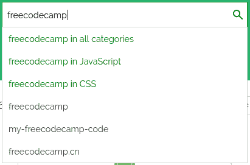

Component rendered from the above code

如果没有这个库，这可能会花费我们 100 多行代码，以及关于 [Elasticsearch Query DSL](https://www.elastic.co/guide/en/elasticsearch/reference/current/query-dsl.html) 的知识来构建这个查询。

在这篇文章中，我将使用库中的不同组件来构建最终的 UI。

在我们深入研究之前，你应该试一试最后的应用程序。下面是同样的[代码沙盒链接](https://codesandbox.io/s/github/appbaseio-apps/gitxplore-app/tree/master/)。

### 设置事物

在我们开始构建 UI 之前，我们需要包含 Elasticsearch 中 GitHub 存储库的数据集。ReactiveSearch 适用于任何弹性搜索索引，您可以轻松地[将它用于您自己的数据集](https://opensource.appbase.io/reactive-manual/getting-started/reactivebase.html)。

简而言之，你可以使用[我的数据集](https://opensource.appbase.io/dejavu/live/#?input_state=XQAAAAJDAQAAAAAAAAA9iIqnY-B2BnTZGEQz6wkFsoFSyhi0TotY1ZI3dCbzpZ5wZmCa4HoWjWiBHcRO1KpPWzrR3-ungbYF_FBD7IY3vlhuTW9dQQFtt3qksr-wGqyFf_qxW2Z3widjMRY5xGpv9lCIh4b5Dyi-O2wVMmUzKADc-0pG1tyzQ558Y_SoViZ27V2qq-px_fIGV-GVRTcrO-LdiYhDhtFK4tYVTak07UxRRvGaqeK3GI2sU7O67YnSdDZNv8_5pnc3SPxlPV9t9YdkGW3YkckG3LAVp03TbrSWI7GdN0fMZCgwqWv0FP1iNWHQrUW2v8-B___Y4BHg)或者通过跟随[这个链接](https://opensource.appbase.io/dejavu/live/#?input_state=XQAAAAJDAQAAAAAAAAA9iIqnY-B2BnTZGEQz6wkFsoFSyhi0TotY1ZI3dCbzpZ5wZmCa4HoWjWiBHcRO1KpPWzrR3-ungbYF_FBD7IY3vlhuTW9dQQFtt3qksr-wGqyFf_qxW2Z3widjMRY5xGpv9lCIh4b5Dyi-O2wVMmUzKADc-0pG1tyzQ558Y_SoViZ27V2qq-px_fIGV-GVRTcrO-LdiYhDhtFK4tYVTak07UxRRvGaqeK3GI2sU7O67YnSdDZNv8_5pnc3SPxlPV9t9YdkGW3YkckG3LAVp03TbrSWI7GdN0fMZCgwqWv0FP1iNWHQrUW2v8-B___Y4BHg)并点击*克隆这个应用*按钮来克隆它。这将允许您制作数据集的副本作为自己的应用程序。

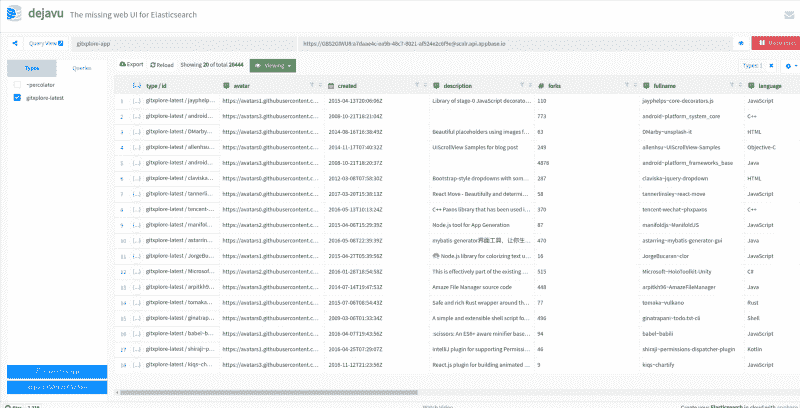

The GitHub repo [dataset](https://opensource.appbase.io/dejavu/live/#?input_state=XQAAAAJDAQAAAAAAAAA9iIqnY-B2BnTZGEQz6wkFsoFSyhi0TotY1ZI3dCbzpZ5wZmCa4HoWjWiBHcRO1KpPWzrR3-ungbYF_FBD7IY3vlhuTW9dQQFtt3qksr-wGqyFf_qxW2Z3widjMRY5xGpv9lCIh4b5Dyi-O2wVMmUzKADc-0pG1tyzQ558Y_SoViZ27V2qq-px_fIGV-GVRTcrO-LdiYhDhtFK4tYVTak07UxRRvGaqeK3GI2sU7O67YnSdDZNv8_5pnc3SPxlPV9t9YdkGW3YkckG3LAVp03TbrSWI7GdN0fMZCgwqWv0FP1iNWHQrUW2v8-B___Y4BHg)

在您输入应用程序名称后，克隆过程应该会开始将 26K+回购导入到您的帐户中。

所有回购都采用以下格式:

```
{
  "name": "freeCodeCamp",
  "owner": "freeCodeCamp",
  "fullname": "freeCodeCamp~freeCodeCamp",
  "description": "The https://freeCodeCamp.org open source codebase and curriculum. Learn to code and help nonprofits.",
  "avatar": "https://avatars0.githubusercontent.com/u/9892522?v=4",
  "url": "https://github.com/freeCodeCamp/freeCodeCamp",
  "pushed": "2017-12-24T05:44:03Z",
  "created": "2014-12-24T17:49:19Z",
  "size": 31474,
  "stars": 291526,
  "forks": 13211,
  "topics": [
    "careers",
    "certification",
    "community",
    "curriculum",
    "d3",
    "education",
    "javascript",
    "learn-to-code",
    "math",
    "nodejs",
    "nonprofits",
    "programming",
    "react",
    "teachers"
  ],
  "language": "JavaScript",
  "watchers": 8462
}
```

*   我们将使用 [create-react-app](https://github.com/facebookincubator/create-react-app.) 来设置项目。您可以通过在终端中运行以下命令来安装 create-react-app:

```
npm install -g create-react-app
```

*   安装完成后，您可以通过运行以下命令来创建一个新项目:

```
create-react-app gitxplore
```

*   项目设置完成后，您可以切换到项目目录并安装 ReactiveSearch 依赖项:

```
cd gitxplore
npm install @appbaseio/reactivesearch
```

*   您还可以添加 fontawesome CDN，我们将在一些图标中使用它，方法是在`</body>`标签结束前的`/public/index.html`中插入以下行:

```
<script defer         src="https://use.fontawesome.com/releases/v5.0.2/js/all.js"></script>
```

### 钻研代码

我将遵循一个简单的应用程序目录结构。以下是重要文件:

```
src
├── App.css               // App styles
├── App.js                // App container
├── components
│   ├── Header.js         // Header component
│   ├── Results.js        // Results component
│   ├── SearchFilters.js  // Filters component
│   └── Topic.js          // rendered by Results
├── index.css             // styles
├── index.js              // ReactDOM render
└── theme.js              // colors and fonts
public
└── index.html
```

如果你想在任何时候参考任何东西，这里有[最终回购](https://github.com/appbaseio-apps/gitxplore-app)的链接。

#### 1.添加样式

我为这个应用程序编写了响应样式，你可以把它们复制到你的应用程序中。打开你最喜欢的文本编辑器，分别从[这里](https://github.com/appbaseio-apps/gitxplore-app/blob/master/src/index.css)复制`/src/index.css`的样式，从[这里](https://github.com/appbaseio-apps/gitxplore-app/blob/master/src/App.css)复制`/src/App.css`的样式。

现在，创建一个文件`/src/theme.js`，在这里我们将为我们的应用程序添加颜色和字体:

```
const theme = {
	typography: {
		fontFamily: 'Raleway, Helvetica, sans-serif',
	},
	colors: {
		primaryColor: '#008000',
		titleColor: 'white'
	},
	secondaryColor: 'mediumseagreen',
};

export default theme;
```

Colors and Fonts for the app

#### 2.添加第一个 ReactiveSearch 组件

所有的 ReactiveSearch 组件都包装在一个容器组件 [**ReactiveBase**](https://opensource.appbase.io/reactive-manual/getting-started/reactivebase.html) 中，该容器组件将数据从 Elasticsearch 提供给子 ReactiveSearch 组件。

我们将在`/src/App.js`中使用它:

```
import React, { Component } from 'react';
import { ReactiveBase } from '@appbaseio/reactivesearch';
import theme from './theme';
import './App.css';
class App extends Component {
  render() {
    return (
      <section className="container">
        <ReactiveBase
          app="gitxplore-app"
          credentials="4oaS4Srzi:f6966181-1eb4-443c-8e0e-b7f38e7bc316"
          type="gitxplore-latest"
          theme={theme}
        >
          <nav className="navbar">
            <div className="title">GitXplore</div>
          </nav>
        </ReactiveBase>
      </section>
    );
  }
}
export default App;
```

对于`app`和`credentials`道具，你可以使用我在这里提供的。如果您之前在自己的应用程序中克隆了数据集，您可以从[应用程序的凭证页面](https://dashboard.appbase.io/credentials)获得它们。如果你已经熟悉 Elasticsearch，你可以转而传递一个`url`道具，指向[你自己的 Elasticsearch 集群 URL](https://opensource.appbase.io/reactive-manual/getting-started/reactivebase.html#props) 。

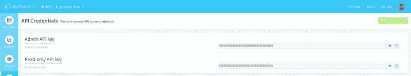

Getting app’s credentials from appbase.io [dashboard](https://dashboard.appbase.io/credentials). Just copy the Read-only API key

或者，你也可以从[应用仪表板](https://dashboard.appbase.io/apps)中复制你的应用的`credentials`。将鼠标悬停在你的应用卡上，点击*复制读取凭证*。

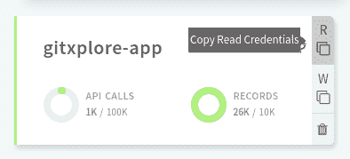

Alternative to above link: Copy the read credentials from [apps dashboard](https://dashboard.appbase.io/apps)

添加后，您会看到如下基本布局:


After adding the first ReactiveSearch component

#### 3.添加数据搜索


DataSearch component

接下来，我将添加一个[数据搜索](https://opensource.appbase.io/reactive-manual/search-components/datasearch.html)组件来搜索存储库。它创建了一个搜索 UI 组件，让我们可以轻松地搜索一个或多个字段。`/src/App.js`中更新后的`render`函数如下所示:

```
// importing DataSearch here
import { ReactiveBase, DataSearch } from '@appbaseio/reactivesearch';
...
<ReactiveBase ... >
// Adding the DataSearch here
    <div className="flex row-reverse app-container">
        <div className="results-container">
            <DataSearch
                componentId="repo"
                filterLabel="Search"
                dataField={['name', 'description', 'name.raw', 'fullname', 'owner', 'topics']}
                placeholder="Search Repos"
                autosuggest={false}
                iconPosition="left"
                URLParams
                className="data-search-container results-container"
                innerClass={{
                    input: 'search-input',
                }}
            />
        </div>
    </div>
</ReactiveBase>
...
```

`DataSearch`组件位于`ReactiveBase`组件内部，并从中接收所有必要的数据，因此我们不必自己编写 Elasticsearch 查询。周围的`div` s 添加一些`className`属性进行造型。这些只是给 app 增加了一个布局。你可以在`/src/App.css`体验我们之前创造的所有风格。您可能已经注意到，我们已经将一些道具传递给了`DataSearch`组件。

它们是这样工作的:

*   `componentId`:一个唯一的字符串标识符，我们稍后将使用它来连接两个不同的 ReactiveSearch 组件。
*   `filterLabel`:一个字符串值，稍后会出现在过滤器菜单中。
*   `dataField`:包含 Elasticsearch 字段的字符串数组，必须对其执行搜索。您可以检查数据集的[,看到这些字段也与列名匹配。这里指定的所有字段都与数据的结构相匹配，例如`name`是指回购的名称，`description`是指回购的描述，但是这里增加了一个带`.raw`的字段，`name.raw`是`name`字段的](https://opensource.appbase.io/dejavu/live/#?input_state=XQAAAAJiAQAAAAAAAAA9iIqnY-B2BnTZGEQz6wkFsg1HFhlgIIPlpmP5RRZ-FWEcoSd0PjkMiILXm8GQxirVSZVrDiQlmtqn4TuMTBL2E1thSmnTeiFPBGQoqmavHhOSSrRxNeEjhNKDeff0pgxw5r5nv8t-un2YUoHpv1HKzI9aZA8KH8WAmQ6XktDDO-Hn95KeD_KPXp_E76PZ04Hl6H6MrevzUojYDnGynyNwjmI07lj0kXZeqltXcATyP8PMY7ncPHlUw1p1cnfe2JXyFgzRzZcNo7xtVJiEPCuLLKzxYehuirtvUcy6oC_KC15q9kmkWssXUCkBr7dAugoFbtjO5zUdpOFWdcz2wcD3AA3--k7h&editable=false)[多字段](https://www.elastic.co/guide/en/elasticsearch/reference/current/multi-fields.html)。Elasticsearch 可以针对不同的目的以不同的方式索引相同的数据，我们可以使用这些数据来获得更好的搜索结果。
*   `placeholder`:设置输入框中的占位符值。
*   `autosuggest`:为 prop 设置一个`false`值会导致结果在结果中立即更新。
*   `iconPosition`:设置？图标。
*   `URLParams`:是一个`boolean`，它告诉组件将搜索词保存在浏览器的 URL 中，这样我们就可以共享特定搜索查询的 URL。例如，检查[这个链接](https://appbaseio-apps.github.io/gitxplore-app/?repo=%22react%22)以查看所有与“反应”相关的结果。
*   `className`:添加一个`class`用于使用 CSS 进行样式化。
*   `innerClass`:使用 CSS 将`class`添加到组件的不同部分进行样式化。这里，我在`input`框中添加了一个`class`来进行造型。详细描述可以在[文档](https://opensource.appbase.io/reactive-manual/search-components/datasearch.html#props)中找到。

有了这个，我们的应用程序应该有一个工作搜索栏:

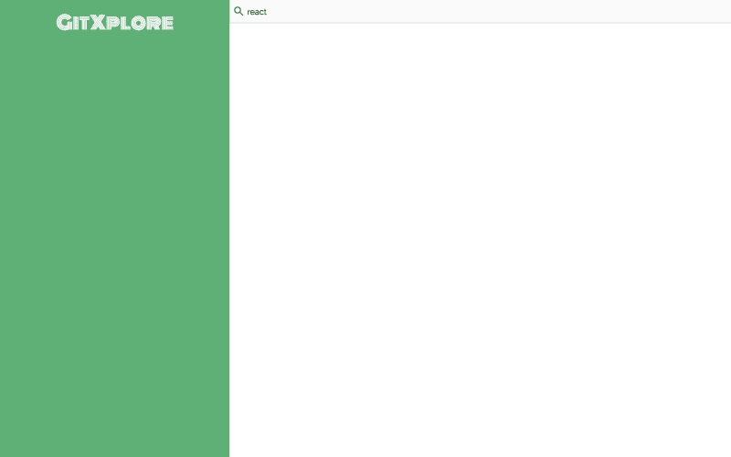

Adding DataSearch component

#### 4.添加结果视图

接下来，我们将在`/src/components/Results.js`添加`Results`组件，并将其导入`/src/App.js`。

下面是编写`Results`组件的方法:

```
import React from 'react';
import { SelectedFilters, ReactiveList } from '@appbaseio/reactivesearch';
const onResultStats = (results, time) => (
  <div className="flex justify-end">
    {results} results found in {time}ms
  </div>
);
const onData = (data) => (
  <div className="result-item" key={data.fullname}>
    {data.owner}/{data.name}
  </div>
);
const Results = () => (
  <div className="result-list">
    <SelectedFilters className="m1" />
    <ReactiveList
      componentId="results"
      dataField="name"
      onData={onData}
      onResultStats={onResultStats}
      react={{
        and: ['repo'],
      }}
      pagination
      innerClass={{
        list: 'result-list-container',
        pagination: 'result-list-pagination',
        resultsInfo: 'result-list-info',
        poweredBy: 'powered-by',
      }}
      size={6}
    />
  </div>
);
export default Results;
```

我从 ReactiveSearch 中导入了两个新组件，`SelectedFilters`和`ReactiveList`。 [SelectedFilters](https://opensource.appbase.io/reactive-manual/base-components/selectedfilters.html) 将在一个地方呈现我们的 ReactiveSearch 组件的过滤器:

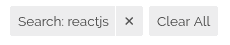

SelectedFilters renders removable filters

[反应列表](https://opensource.appbase.io/reactive-manual/result-components/reactivelist.html)呈现搜索结果。它的道具是这样工作的:

*   `dataField`:使用此处的`name`字段对结果进行排序。
*   `onData`:接受返回一个 [JSX](https://reactjs.org/docs/glossary.html#jsx) 的函数。每个结果都单独传递给该函数。这里我们正在生成一个基本的 UI，稍后我们会修改它。
*   `onResultStats`:与`onData`类似，但针对结果统计。向该函数传递找到的`results`和得到的`time`的数量。
*   `react`:`[react](https://opensource.appbase.io/reactive-manual/advanced/react.html)`道具告诉`ReactiveList`去监听`CategorySearch`组件所做的改变，这里我们提供了`CategorySearch`组件的`componentId`称为`repo`。稍后我们将在这里添加更多的组件。
*   `pagination`:一个`boolean`，它告诉反应列表将结果分成几页，每一页包含在`size`属性中指定的结果数。

现在我们可以在`/src/App.js`中`import`并使用`Results`组件。用`results-container`类把它加在`div`里面就行了。

```
...
import Results from './components/Results';
...
render() {
  return(
    ...
    <div className="results-container">
      <DataSearch ... />
      <Results />
    </div>
    ...
  )
}
```

有了这个组件，我们的搜索 UI 的一个基本版本应该开始组合在一起了:

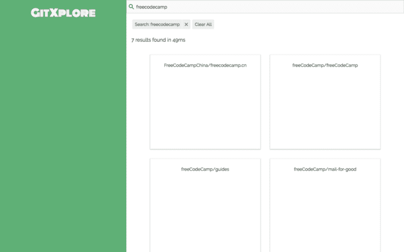

Adding the Results component

#### 5.添加标题组件

让我们在`/src/components/Header.js`创建一个`Header`组件，我们将使用它来呈现更多的搜索过滤器。

下面是如何创建一个简单的`Header`组件:

```
import React, { Component } from 'react';

import SearchFilters from './SearchFilters';

class Header extends Component {
	constructor(props) {
		super(props);
		this.state = {
			visible: false,
		};
	}

	toggleVisibility = () => {
		const visible = !this.state.visible;
		this.setState({
			visible,
		});
	}

	render() {
		return (
			<nav className={`navbar ${this.state.visible ? 'active' : ''}`}>
				<div className="title">GitXplore</div>
				<div className="btn toggle-btn" onClick={this.toggleVisibility}>Toggle Filters</div>
				<SearchFilters {...this.props} visible={this.state.visible} />
			</nav>
		);
	}
}

export default Header; 
```

我已经将`<nav>..</nav>`中的导航代码从`/src/App.js`移到了这里。Header 组件有一个在状态中切换可见性的方法。我们用它来添加一个类，让它在手机布局上占据整个屏幕。我还添加了一个调用`toggleVisibility`方法的切换按钮。

它还呈现另一个名为`SearchFilters`的组件，并传递来自父组件`App`的所有道具。让我们创建这个组件来看看实际情况。

创建一个新文件`/src/components/SearchFilters.js`:

```
import React from 'react';
const SearchFilters = () => (
    <div>
        Search filters go here!
    </div>
);
export default SearchFilters;
```

接下来，我将更新`App`组件以使用我们刚刚创建的`Header`组件。

#### 6.更新应用程序组件并处理状态中的主题

我们将在名为`currentTopics`的`App`组件中添加一个`state`变量，这将是应用程序中当前选定主题的数组。

然后我们将使用`currentTopics`并将它们传递给`Header`和`Results`组件:

```
import React, { Component } from 'react';
import { ReactiveBase, DataSearch } from '@appbaseio/reactivesearch';

import Header from './components/Header';
import Results from './components/Results';

import theme from './theme';
import './App.css';

class App extends Component {
	constructor(props) {
		super(props);
		this.state = {
			currentTopics: [],
		};
	}

	setTopics = (currentTopics) => {
		this.setState({
			currentTopics: currentTopics || [],
		});
	}

	toggleTopic = (topic) => {
		const { currentTopics } = this.state;
		const nextState = currentTopics.includes(topic)
			? currentTopics.filter(item => item !== topic)
			: currentTopics.concat(topic);
		this.setState({
			currentTopics: nextState,
		});
	}

	render() {
		return (
			<section className="container">
				<ReactiveBase
					app="gitxplore-app"
					credentials="4oaS4Srzi:f6966181-1eb4-443c-8e0e-b7f38e7bc316"
					type="gitxplore-latest"
					theme={theme}
				>
					<div className="flex row-reverse app-container">
						<Header currentTopics={this.state.currentTopics} setTopics={this.setTopics} />
						<div className="results-container">
							<DataSearch
								componentId="repo"
								filterLabel="Search"
								dataField={['name', 'description', 'name.raw', 'fullname', 'owner', 'topics']}
								placeholder="Search Repos"
								iconPosition="left"
								autosuggest={false}
								URLParams
								className="data-search-container results-container"
								innerClass={{
									input: 'search-input',
								}}
							/>
							<Results currentTopics={this.state.currentTopics} toggleTopic={this.toggleTopic} />
						</div>
					</div>
				</ReactiveBase>
			</section>
		);
	}
}

export default App;
```

Updating the App component

`setTopics`方法将设置传递给它的任何主题，我们将把它传递给`Header`组件。`toggleTopic`方法将从`currentTopics`的`state`中移除已经存在的主题，如果不存在则添加主题。

我们将把`toggleTopic`方法传递给`Results`组件:


Its starting to come together, cheers!

#### 7.添加更多过滤器

让我们在`/src/components/SearchFilters.js`中添加更多的过滤器。我将在这里使用 ReactiveSearch 的三个新组件，`MultiDropdownList`、`SingleDropdownRange`和`RangeSlider`。这些组件的使用方式与我们之前使用`DataSearch`组件的方式类似。

代码如下:

```
import React from 'react';
import PropTypes from 'prop-types';
import {
	MultiDropdownList,
	SingleDropdownRange,
	RangeSlider,
} from '@appbaseio/reactivesearch';

const SearchFilters = ({ currentTopics, setTopics, visible }) => (
	<div className={`flex column filters-container ${!visible ? 'hidden' : ''}`}>
		<div className="child m10">
			<MultiDropdownList
				componentId="language"
				dataField="language.raw"
				placeholder="Select languages"
				title="Language"
				filterLabel="Language"
			/>
		</div>
		<div className="child m10">
			<MultiDropdownList
				componentId="topics"
				dataField="topics.raw"
				placeholder="Select topics"
				title="Repo Topics"
				filterLabel="Topics"
				size={1000}
				queryFormat="and"
				defaultSelected={currentTopics}
				onValueChange={setTopics}
			/>
		</div>
		<div className="child m10">
			<SingleDropdownRange
				componentId="pushed"
				dataField="pushed"
				placeholder="Repo last active"
				title="Last Active"
				filterLabel="Last Active"
				data={[
					{ start: 'now-1M', end: 'now', label: 'Last 30 days' },
					{ start: 'now-6M', end: 'now', label: 'Last 6 months' },
					{ start: 'now-1y', end: 'now', label: 'Last year' },
				]}
			/>
		</div>
		<div className="child m10">
			<SingleDropdownRange
				componentId="created"
				dataField="created"
				placeholder="Repo created"
				title="Created"
				filterLabel="Created"
				data={[
					{
						start: '2017-01-01T00:00:00Z',
						end: '2017-12-31T23:59:59Z',
						label: '2017',
					},
					{
						start: '2016-01-01T00:00:00Z',
						end: '2016-12-31T23:59:59Z',
						label: '2016',
					},
					{
						start: '2015-01-01T00:00:00Z',
						end: '2015-12-31T23:59:59Z',
						label: '2015',
					},
					{
						start: '2014-01-01T00:00:00Z',
						end: '2014-12-31T23:59:59Z',
						label: '2014',
					},
					{
						start: '2013-01-01T00:00:00Z',
						end: '2013-12-31T23:59:59Z',
						label: '2013',
					},
					{
						start: '2012-01-01T00:00:00Z',
						end: '2012-12-31T23:59:59Z',
						label: '2012',
					},
					{
						start: '2011-01-01T00:00:00Z',
						end: '2011-12-31T23:59:59Z',
						label: '2011',
					},
					{
						start: '2010-01-01T00:00:00Z',
						end: '2010-12-31T23:59:59Z',
						label: '2010',
					},
					{
						start: '2009-01-01T00:00:00Z',
						end: '2009-12-31T23:59:59Z',
						label: '2009',
					},
					{
						start: '2008-01-01T00:00:00Z',
						end: '2008-12-31T23:59:59Z',
						label: '2008',
					},
					{
						start: '2007-01-01T00:00:00Z',
						end: '2007-12-31T23:59:59Z',
						label: '2007',
					},
				]}
			/>
		</div>
		<div className="child m10">
			<RangeSlider
				componentId="stars"
				title="Repo Stars"
				dataField="stars"
				range={{ start: 0, end: 300000 }}
				showHistogram={false}
				rangeLabels={{
					start: '0 Stars',
					end: '300K Stars',
				}}
				innerClass={{
					label: 'range-label',
				}}
			/>
		</div>
		<div className="child m10">
			<RangeSlider
				componentId="forks"
				title="Repo Forks"
				dataField="forks"
				range={{ start: 0, end: 180500 }}
				showHistogram={false}
				rangeLabels={{
					start: '0 Forks',
					end: '180K Forks',
				}}
				innerClass={{
					label: 'range-label',
				}}
			/>
		</div>
	</div>
);

SearchFilters.propTypes = {
	currentTopics: PropTypes.arrayOf(PropTypes.string),
	setTopics: PropTypes.func,
	visible: PropTypes.bool,
};

export default SearchFilters; 
```

我们上面创建的`SearchFilters`组件接受了来自`Header`组件的三个道具:`currentTopics`、`setTopics`和`visible`。`visible`道具只是用来加一个`className`做造型。

我们在这里使用的第一个组件是一个`[MultiDropdownList](https://opensource.appbase.io/reactive-manual/list-components/multidropdownlist.html)`，它呈现一个下拉组件来选择多个选项。第一个`MultiDropdownList`有一个`language.raw`的`dataField`。它会用存储库中所有可用的语言来填充自己。

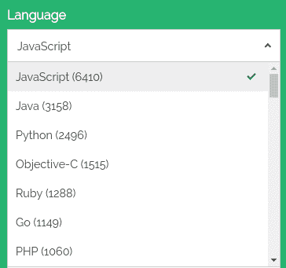

The language [MultiDropdownList](https://opensource.appbase.io/reactive-manual/list-components/multidropdownlist.html)

我们使用了另一个`MultiDropdownList`来呈现主题列表:

```
<MultiDropdownList
    componentId="topics"
    dataField="topics.raw"
    placeholder="Select languages"
    title="Repo Topics"
    filterLabel="Topics"
    size={1000}
    queryFormat="and"
    defaultSelected={currentTopics}
    onValueChange={setTopics}
/>
```

道具是这样工作的:

*   `componentId`:与前面的 ReactiveSearch 组件类似，这是一个惟一的标识符，我们稍后将把它关联到我们创建的用于获取搜索结果的`Results`组件中。
*   `dataField`:将组件映射到 Elasticsearch 中的`topics.raw`字段。
*   `placeholder`:未选择任何内容时，设置占位符值。
*   `title`:为 UI 中的组件添加标题。
*   `filterLabel`:设置可移动过滤器中组件的标签(我们在`Results`组件中使用的`SelectedFilters`)。
*   `size`:告诉组件在列表中最多呈现`1000`个项目。
*   `queryFormat`:当设置为`'and'`时，正如我们在这里使用的，它给出匹配所有选择的标签的结果(就像[交集](https://www.google.co.in/url?sa=t&rct=j&q=&esrc=s&source=web&cd=2&cad=rja&uact=8&ved=0ahUKEwjq2aSbmLLYAhUBP48KHW7QDVMQFghHMAE&url=https%3A%2F%2Fen.wikipedia.org%2Fwiki%2FIntersection_(set_theory)&usg=AOvVaw3o-ni_Iic1U3sedPMsJMqV))。
*   `defaultSelected`:设置组件中的选择项目。在这里，我们正在传递已经在`/src/App.js`存储在`state`中的`currentTopics`。
*   `onValueChange`:是一个函数，当我们改变它的值时，组件将调用这个函数。这里我们调用在 props 中收到的`setTopics`函数。因此，每当我们选择或取消选择组件中的一个值时，它就会更新主`App`组件的`state`中的`currentTopics`。

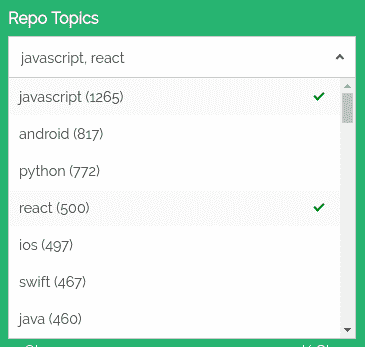

The topics MultiDropdownList component

我们在这里使用的下一个 ReactiveSearch 组件是一个`[SingleDropdownRange](https://opensource.appbase.io/reactive-manual/range-components/singledropdownrange.html)`。它使用了一种叫做`[data](https://opensource.appbase.io/reactive-manual/range-components/singledropdownrange.html#props)`的新道具。

它是这样工作的:

```
<SingleDropdownRange
    ...
    data={[
        { start: 'now-1M', end: 'now', label: 'Last 30 days' },
        { start: 'now-6M', end: 'now', label: 'Last 6 months' },
        { start: 'now-1y', end: 'now', label: 'Last year' },
    ]}
/>
```

`data`属性接受具有`start`和`end`值的对象数组，并在下拉列表中显示指定的`label`。它映射到数据集中的`pushed`字段，该字段是 Elasticsearch 中的[日期类型。在 Elasticsearch 中指定日期范围的一个很酷的方法是使用`now`关键字。`now`表示当前时间，`now-1M`表示之前一个月，`now-6M`表示之前六个月，`now-1y`表示之前一年`now`。](https://www.elastic.co/guide/en/elasticsearch/reference/current/date.html)

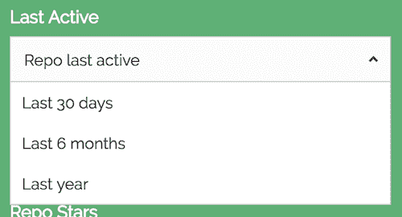

The pushed [SingleDropdownRange](https://opensource.appbase.io/reactive-manual/range-components/singledropdownrange.html) component

我为数据集中的`created`字段使用了另一个`SingleDropdownRange`组件。

这里，我在日期时间中为不同的年份指定了年份范围:

```
<SingleDropdownRange
    ...
    data={[
        {
            start: '2017-01-01T00:00:00Z',
            end: '2017-12-31T23:59:59Z',
            label: '2017',
        },
        {
            start: '2016-01-01T00:00:00Z',
            end: '2016-12-31T23:59:59Z',
            label: '2016',
        },
       ...
    ]}
/>
```

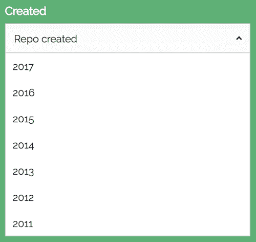

SingleDropdownRange component for the created field

我使用的第三个组件是一个呈现滑块 UI 的`[RangeSlider](https://opensource.appbase.io/reactive-manual/range-components/rangeslider.html)`。我已经习惯了`RangeSlider`组件，一个用于`stars`字段，另一个用于`forks`。

该组件引入的两个主要道具是`range`和`rangeLabels`:

```
<RangeSlider
    ...
    showHistogram={false}
    range={{ start: 0, end: 300000 }}
    rangeLabels={{
        start: '0 Stars',
        end: '300K Stars',
    }}
/>
```

*   `range` : prop 用`start`和`end`值指定数据的范围。
*   `rangeLabels` : prop 将标签显示在滑块下方。
*   `showHistogram`:是一个`boolean`道具，显示数据分布的直方图。这里我把它设置为`false`,因为不需要它。

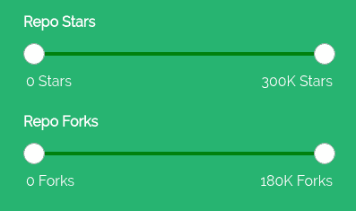

[RangeSlider](https://opensource.appbase.io/reactive-manual/range-components/rangeslider.html) components for the stars and forks fields

现在我们只需要将这些过滤器连接到`Results`组件。我们只需更新由`Results`组件呈现的`ReactiveList`中的一行，以包含这些组件的`componentId`。

更新我们在`Results`组件中渲染的`ReactiveList`中的`react`道具:

```
const Results = () => (
  <div className="result-list">
    <SelectedFilters className="m1" />
    <ReactiveList
      ... // updating the react prop here
      react={{
        and: ['language', 'topics', 'pushed', 'created', 'stars', 'forks', 'repo'],
      }}
    />
  </div>
);
```

这应该会更新所有过滤器的结果？

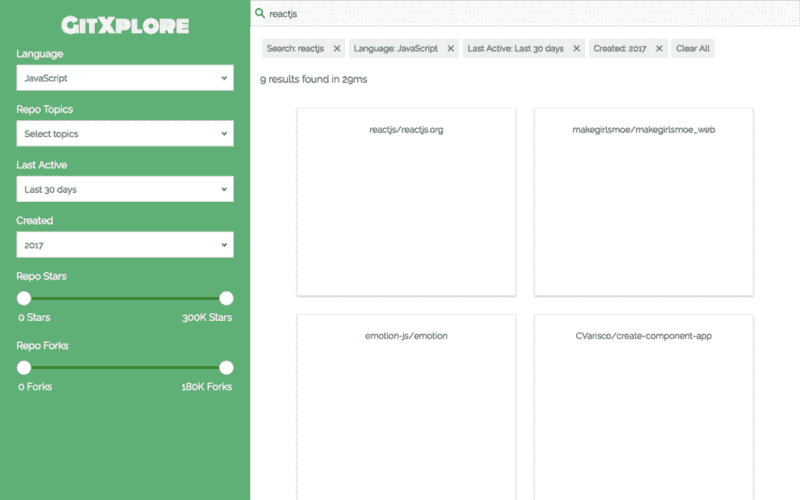

After connecting the filters in the ReactiveList component

#### 8.更新结果视图

到目前为止，我们只看到了结果的基本版本。作为这个应用程序的最后一部分，让我们给✌️的结果添加一些天赋

我们将在我们的`Results`组件中使用另一个组件来呈现不同的主题。

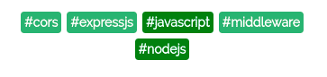

Topics component to render these little guys

以下是你如何在`/src/components/Topic`创建你自己的。随意添加自己的口味？

```
 import React, { Component } from 'react';
import PropTypes from 'prop-types';

class Topic extends Component {
	handleClick = () => {
		this.props.toggleTopic(this.props.children);
	}
	render() {
		return (
			<div className={`topic ${this.props.active ? 'active' : ''}`} onClick={this.handleClick}>
				#{this.props.children}
			</div>
		);
	}
}

Topic.propTypes = {
	children: PropTypes.string,
	active: PropTypes.bool,
	toggleTopic: PropTypes.func,
};

export default Topic;
```

Adding the Topic component

该组件呈现它的`children`并添加一个点击处理程序来切换主题，这将更新主`App`组件状态中的`currentTopics`。

接下来，我们只需要在`/src/components/Results.js`更新我们的`Results`组件:

```
import React from 'react';
import { SelectedFilters, ReactiveList } from '@appbaseio/reactivesearch';
import PropTypes from 'prop-types';

import Topic from './Topic';

const onResultStats = (results, time) => (
	<div className="flex justify-end">
		{results} results found in {time}ms
	</div>
);

const onData = (data, currentTopics, toggleTopic) => (
	<div className="result-item" key={data.fullname}>
		<div className="flex justify-center align-center result-card-header">
			
			<a className="link" href={data.url} target="_blank" rel="noopener noreferrer">
				<div className="flex wrap">
					<div>{data.owner}/</div>
					<div>{data.name}</div>
				</div>
			</a>
		</div>
		<div className="m10-0">{data.description}</div>
		<div className="flex wrap justify-center">
			{
				data.topics.slice(0, 7)
					.map(item => (
						<Topic
							key={item}
							active={currentTopics.includes(item)}
							toggleTopic={toggleTopic}
						>
							{item}
						</Topic>
					))
			}
		</div>
		<div className="flex">
			<div><div className="btn card-btn"><i className="card-icon fas fa-star" />{data.stars}</div></div>
			<div><div className="btn card-btn"><i className="card-icon fas fa-code-branch" />{data.forks}</div></div>
			<div><div className="btn card-btn"><i className="card-icon fas fa-eye" />{data.watchers}</div></div>
		</div>
	</div>
);

const Results = ({ toggleTopic, currentTopics }) => (
	<div className="result-list">
		<SelectedFilters className="m1" />
		<ReactiveList
			componentId="results"
			dataField="name"
			onData={data => onData(data, currentTopics, toggleTopic)}
			onResultStats={onResultStats}
			react={{
				and: ['language', 'topics', 'pushed', 'created', 'stars', 'forks', 'repo'],
			}}
			pagination
			innerClass={{
				list: 'result-list-container',
				pagination: 'result-list-pagination',
				resultsInfo: 'result-list-info',
				poweredBy: 'powered-by',
			}}
			size={6}
			sortOptions={[
				{
					label: 'Best Match',
					dataField: '_score',
					sortBy: 'desc',
				},
				{
					label: 'Most Stars',
					dataField: 'stars',
					sortBy: 'desc',
				},
				{
					label: 'Fewest Stars',
					dataField: 'stars',
					sortBy: 'asc',
				},
				{
					label: 'Most Forks',
					dataField: 'forks',
					sortBy: 'desc',
				},
				{
					label: 'Fewest Forks',
					dataField: 'forks',
					sortBy: 'asc',
				},
				{
					label: 'A to Z',
					dataField: 'owner.raw',
					sortBy: 'asc',
				},
				{
					label: 'Z to A',
					dataField: 'owner.raw',
					sortBy: 'desc',
				},
				{
					label: 'Recently Updated',
					dataField: 'pushed',
					sortBy: 'desc',
				},
				{
					label: 'Least Recently Updated',
					dataField: 'pushed',
					sortBy: 'asc',
				},
			]}
		/>
	</div>
);

Results.propTypes = {
	toggleTopic: PropTypes.func,
	currentTopics: PropTypes.arrayOf(PropTypes.string),
};

export default Results;
```

Adding some flair to the Results ?

我已经更新了`onData`函数来呈现更详细的结果。你还会注意到`ReactiveList`中一个新的`sortOptions`道具。这个 prop 接受一个对象数组，该数组呈现一个下拉菜单来选择您希望如何对结果进行排序。每个对象包含一个显示为列表项的`label`，一个对结果进行排序的`dataField`和一个可以是`asc`(升序)或`desc`(降序)的`sortBy`键。

就这样，你自己的 GitHub 资源库浏览器应该上线了！

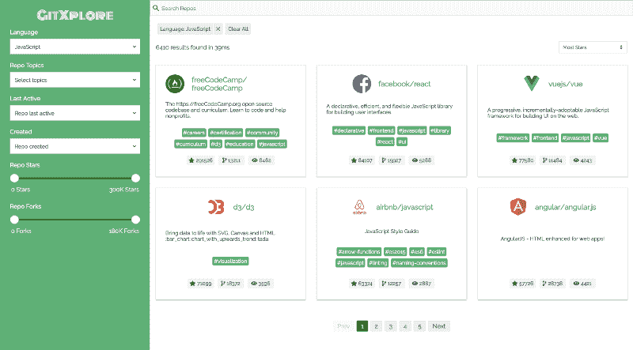

GitXplore [final app preview](https://appbaseio-apps.github.io/gitxplore-app/)

### 有用的链接

1.  GitXplore app [demo](https://appbaseio-apps.github.io/gitxplore-app/) 、 [CodeSandbox](https://codesandbox.io/s/github/appbaseio-apps/gitxplore-app/tree/master/) 和[源代码](https://github.com/appbaseio-apps/gitxplore-app)
2.  [反应搜索 GitHub 报告](https://github.com/appbaseio/reactivesearch)
3.  反应搜索[文档](https://opensource.appbase.io/reactive-manual/)

希望你喜欢这个故事。如果你有任何想法或建议，请告诉我，并在评论中分享你的应用程序版本！

* * *

你可以在 twitter 上关注我的最新消息。我也开始在我的个人[博客](https://divyanshu013.dev/)上发布更多最近的帖子。