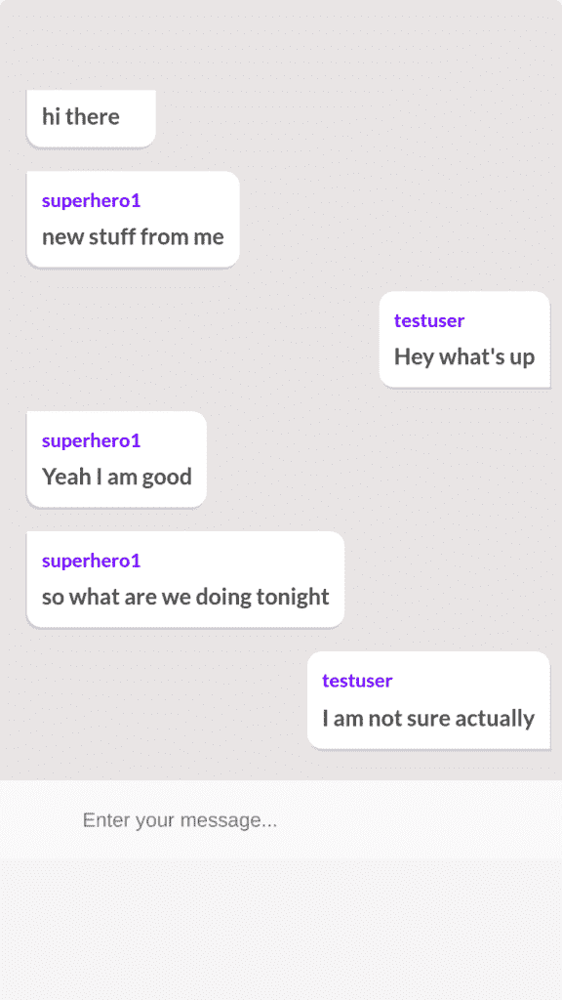
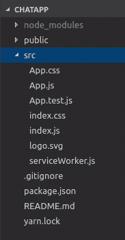
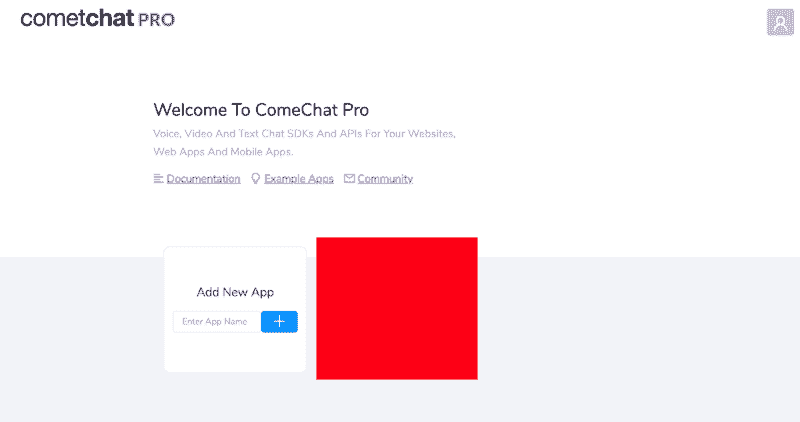
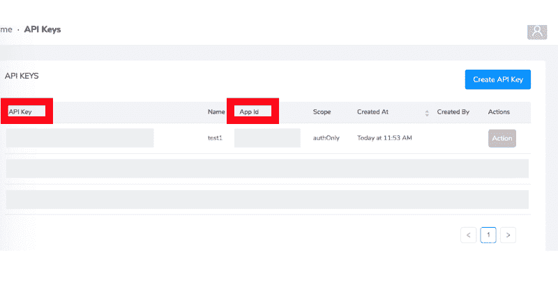
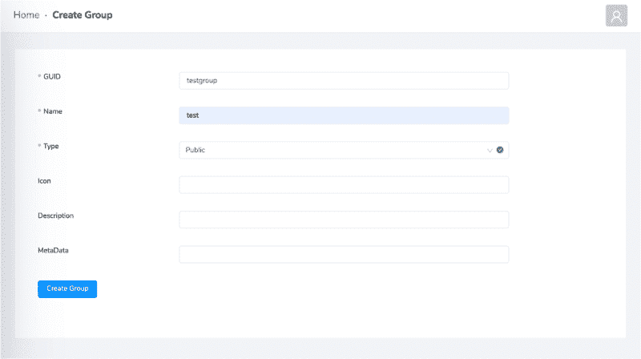
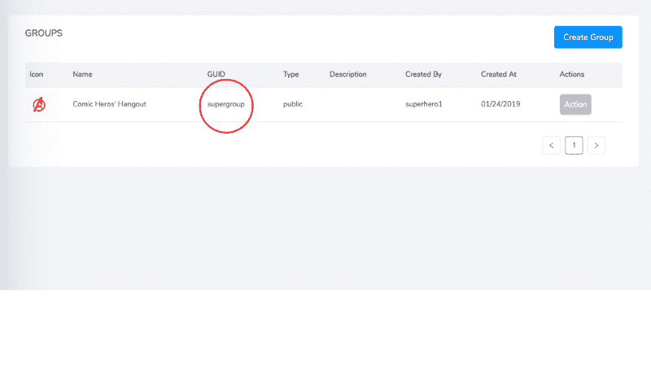
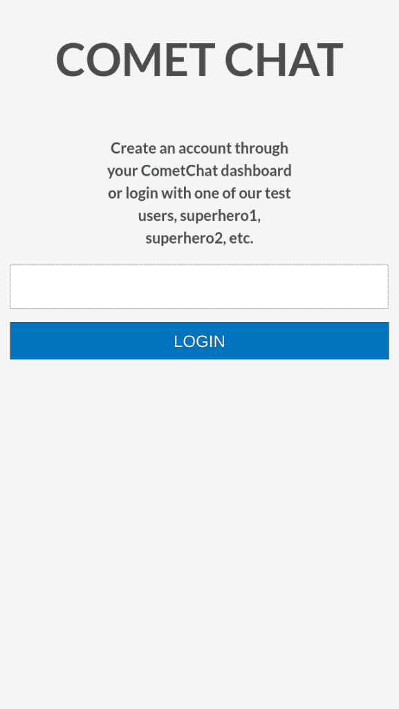

# 如何用 React.js 构建现代聊天应用

> 原文：<https://www.freecodecamp.org/news/building-a-modern-chat-application-with-react-js-558896622194/>

在本教程中，我将指导您使用 React、React Router 和 [CometChat Pro](https://www.cometchat.com/pro) 构建自己的群聊应用程序。是的，我们将使用 CometChat Pro 来处理聊天信息的实时发送和接收，而不是推出我们自己的服务器。

完成后，您应该有一个功能性的聊天应用程序，看起来像这样(当然，欢迎您在进行过程中进行调整和试验):



我将本教程组织成一系列步骤，以便于理解。如果你只是想检查代码，[点击这里](https://github.com/cometchat-pro-samples/react-comet-chat-app)。

### 设置项目

在我们走得太远之前，我们必须首先设置我们的 React 项目。为此，我们将使用一个不太知名的 gem，名为 Create React App。

最好的事？因为您已经安装了 npm，所以您可以使用 npx 在一个步骤中安装并运行 create-react-app:

`npx create-react-app chatapp // note: npm v5.2+`

运行此命令后，将创建一个名为“chatapp”的新文件夹，其结构如下:



此外，要使用 React，我们还需要安装 React 路由器和 CometChat Pro SDK。为此，转到 chatapp 目录并运行:

`npm install react-router-dom @cometchat-pro/chat --save`

### 添加 React 路由器

最后，我们的应用程序将有两个页面——一个名为`Login`的页面，用户将在其中登录，另一个名为`Groupchat`的页面，我们将在其中呈现聊天室。我们将使用 React Router 将用户路由到他们需要的页面。

要设置 React 路由器，我们必须首先在 index.js 文件中导入`Router` *包装器*组件。我称之为包装组件，因为我们将我们的`App`包装在`Router`组件中。

用以下代码片段替换 index.js:

```
import React from 'react';
import { BrowserRouter as Router } from 'react-router-dom'; // added
import ReactDOM from 'react-dom';
import './index.css';
import App from './App';
ReactDOM.render(
  <Router>
    <App />
  </Router>
  , document.getElementById('root'));
```

`index.js`是我们应用程序的入口点。它唯一真正的工作是呈现我们的 React 应用程序。我们的大多数“真正的”逻辑发生在一个名为 App.js 的文件中，我们接下来将修改这个文件。

在 App.js 中，我们必须导入额外的 React 路由器依赖项，这将使我们能够根据用户加载的路由呈现不同的组件。例如，如果用户转到“/login”路径，我们应该呈现 login 组件。同样，如果用户转到“/chat”路径，我们应该呈现`Groupchat`组件:

```
import React, { Component } from "react";
import { Route, Redirect, Switch } from "react-router-dom";
import "./App.css";
// the below components will be created shortly
import Login from "./components/Login";
import Groupchat from "./components/Groupchat";
class App extends Component {
  constructor(props) {
    super(props);
  }
render() {
    return (
      <Switch>
        <Redirect exact from="/" to="/login" />
        <Route path="/login" component={Login} />
        <Route path="/chat" component={Groupchat} />
      </Switch>
    );
  }
}
export default App;
```

如果你试图运行这段代码，它肯定会抛出一些错误，因为我们还没有制作`Login`和`Groupchat`组件。让我们现在做那件事。

### 创建登录组件

为了保持我们的项目整洁，创建一个名为`components`的文件夹来保存我们的定制组件。

然后，在新创建的文件夹中，使用以下代码创建一个名为 Login.js 的文件:

```
import React from "react";
class Login extends React.Component {
  constructor(props) {
    super(props);
    this.state = {
    };
  }
  render() {
    return ( 
      <div className="App">
        <h1>Login</h1>
      </div>
    );
  }
}
export default Login;
```

我们在这里所做的只是导出一个带有标题文本“Login”的组件。我们将很快充实这个组件，但目前，我们只是创建样板文件。

### 创建 Groupchat 组件

在同一个组件文件夹中，创建一个名为 Groupchat.js 的新组件:

```
import React from "react";
class Groupchat extends React.Component {
  constructor(props) {
    super(props);
  }
  render() {
    return <div className="chatWindow" />;
  }
}
export default Groupchat;
```

随着教程的深入，我们将把这个不起眼的组件开发成我们聊天应用程序的核心。

有了`Groupchat`和`Login`组件，您应该能够无错误地运行应用程序。在 localhost 上打开应用程序，导航到 localhost:3000/login，然后导航到 localhost:3000/chat，查看运行中的组件。

### 创建 CometChat 应用程序 ID 和 API 密钥

正如我在本教程开始时提到的，我们不会在本教程中推出我们自己的服务器。相反，我们将使用托管服务 [CometChat Pro](http://cometchat.com/pro) 。

在连接到 CometChat 之前，我们必须首先从仪表板创建一个 CometChat 应用程序:



创建应用程序后，点击“Explore ”,然后转到“API Keys”选项卡:



单击“创建 API 密钥”并填写表单，选择仅授权范围。从表中，您可以记下您的应用程序 ID 和应用程序密钥，我们很快就会用到它们。

### 创建 CometChat 组 ID

当我们打开仪表板时，让我们也创建一个*组*。通常你可以通过代码来实现这一点(例如，你可以允许用户通过你的应用程序为他们的团队或项目创建一个自定义的聊天组)，但是对于学习和测试来说，仪表板是很好的。

转到“Groups”选项卡，创建一个名为 testgroup 的新组:



像上次一样，您将被带回到一个表格，在那里您可以记下组 ID:



请记下来，因为我们在下一步中需要用到它。

### 创建配置文件

为了便于引用我们的配置，创建一个名为 config.js 的新文件并粘贴您的凭证:

```
export default {
  appId: "", //Enter your App ID
  apiKey: "", //Enter your API KEY
  GUID: "", // Enter your group UID
};
```

您现在可以关闭仪表板了。一旦你设置了 CometChat，所有的交互都是通过代码进行的。

### 创建一个 CometChat 管理器类

React 的一个优点是它有助于分离关注点。我们的组件可以完全专注于表示，而我们可以创建其他模块来处理诸如数据获取和状态管理之类的事情。

为了充分利用这一点，让我们创建一个名为“lib”的新文件夹，并在该新文件夹中创建一个名为 chat.js 的文件。这是我们与 CometChat 进行所有交互的地方:

```
import { CometChat } from "@cometchat-pro/chat";
import config from "../config";
export default class CCManager {
  static LISTENER_KEY_MESSAGE = "msglistener";
  static appId = config.appId;
  static apiKey = config.apiKey;
  static LISTENER_KEY_GROUP = "grouplistener";
  static init() {
    return CometChat.init(CCManager.appId);
  }
  static getTextMessage(uid, text, msgType) {
    if (msgType === "user") {
      return new CometChat.TextMessage(
        uid,
        text,
        CometChat.MESSAGE_TYPE.TEXT,
        CometChat.RECEIVER_TYPE.USER
      );
    } else {
      return new CometChat.TextMessage(
        uid,
        text,
        CometChat.MESSAGE_TYPE.TEXT,
        CometChat.RECEIVER_TYPE.GROUP
      );
    }
  }
  static getLoggedinUser() {
    return CometChat.getLoggedinUser();
  }
  static login(UID) {
    return CometChat.login(UID, this.apiKey);
  }
  static getGroupMessages(GUID, callback, limit = 30) {
    const messagesRequest = new CometChat.MessagesRequestBuilder()
      .setGUID(GUID)
      .setLimit(limit)
      .build();
    callback();
    return messagesRequest.fetchPrevious();
  }
  static sendGroupMessage(UID, message) {
    const textMessage = this.getTextMessage(UID, message, "group");
    return CometChat.sendMessage(textMessage);
  }
  static joinGroup(GUID) {
    return CometChat.joinGroup(GUID, CometChat.GROUP_TYPE.PUBLIC, "");
  }
  static addMessageListener(callback) {
    CometChat.addMessageListener(
      this.LISTENER_KEY_MESSAGE,
      new CometChat.MessageListener({
        onTextMessageReceived: textMessage => {
          callback(textMessage);
        }
      })
    );
  }
} 
```

除了允许我们创建关注点分离之外，这样表示代码也使它更容易消化。

让我从顶部开始解释本模块的一些重要部分:

*   `LISTENER_KEY_MESSAGE`–这是消息监听器所要求的。
*   `init()`–在应用程序的整个生命周期中只需要调用一次，它使用 appID 调用 CometChat `init`方法。
*   `getTextMessage(uid, text, msgType)`–它基于`CometChat.TextMessage`方法创建消息对象，它接受 UID(在我们的例子中是 GUID)和要发送的文本消息。
*   `getLoggedInUser()`–用于获取当前登录的用户。
*   `login()`–它用于基于 CometChat.login 方法登录用户，它接受 UID(在我们的例子中是 GUID)和 apiKey。
*   `getGroupMessages(GUID, callback, limit = 30)`–用于使用`CometChat.MessagesRequestBuilder()`方法从 CometChat 获取之前的组消息，该方法将 GUID 和 limit 作为参数。
*   `sendGroupMessage(UID, message)`–用于使用`CometChat.sendMessage()`方法发送消息，并接受 GUID 和消息作为参数。
*   `joinGroup(GUID)`–用于通过 GUID 加入选定的群组。
*   `addMessageListener(callback)`–使用`CometChat.addMessageListener()`收听消息(我提到过这叫做实时吗？)，它需要将`LISTENER_KEY_MESSAGE`作为参数，还需要一个在收到消息时调用的回调。

这里没有任何特定于这个应用程序的内容。您可以很好地利用这个模块，如果需要的话可以扩展它，并将其导入到另一个项目中。不过，一般来说，这只是 SDK 的一层薄薄的包装。

### 更新登录组件

有了所有的配置和聊天代码，我们现在可以从`Login`组件开始快速构建 UI。

提醒您一下，这是登录组件的外观:



如您所见，它的主要功能是向用户询问他们的姓名。一旦提供了名称，我们就呈现出`Groupchat`组件。

将`Login.js`替换为:

```
import React from "react";
import { Redirect } from "react-router-dom";
import chat from "../lib/chat";
import spinner from "../logo.svg";
class Login extends React.Component {
  constructor(props) {
    super(props);
    this.state = {
      username: "",
      isAuthenticated: false,
      user: null,
      isSubmitting: false,
      errorMessage: ""
    };
  }
  onSubmit = e => {
    if (this.state.username !== "") {
      e.preventDefault();
      this.login();
    }
  };
  login = () => {
    this.toggleIsSubmitting();
    chat
    .login(this.state.username)
    .then(user => {
      this.setState({
        user,
        isAuthenticated: true
      });
    })
    .catch(error => {
      this.setState({
        errorMessage: "Please enter a valid username"
      });
      this.toggleIsSubmitting();
      console.log(error);
    });
  };
  toggleIsSubmitting = () => {
    this.setState(prevState => ({
      isSubmitting: !prevState.isSubmitting
    }));
  };
  handleInputChange = e => {
    this.setState({
      username: e.target.value
    });
  };
  render() {
    if (this.state.isAuthenticated) {
      return (
        <Redirect
          to={{
            pathname: "/chat",
            state: { user: this.state.user }
          }}
        />
      );
    }
    return (
      <div className="App">
        <h1>COMETCHAT</h1>
        <p>Create an account through your CometChat dashboard or login with one of our test users, superhero1, superhero2, etc.</p>
        <form className="form" onSubmit={this.onSubmit}>
          <input onChange={this.handleInputChange} type="text" />
          <span className="error">{this.state.errorMessage}</span>
          {this.state.isSubmitting ? (
            
          ) : (
            <input
              type="submit"
              disabled={this.state.username === ""}
              value="LOGIN"
            />
          )}
        </form>
      </div>
    );
  }
}
export default Login;
```

除了表示性的 HTML，这里的大部分代码都致力于处理一个 [React 表单](https://reactjs.org/docs/forms.html)。

### 更新 Groupchat 组件

Groupchat 组件的职责比 Login 组件多得多。快速提醒一下，这是它的样子:


在很大程度上，`Groupchat`组件的工作是连接聊天库模块和我们将呈现给用户的 UI。例如，当用户发送一条消息时，我们调用`chat.sendMessage`,随着新消息的流入，调用一个回调函数:

```
import React from "react";
import { Redirect } from "react-router-dom";
import chat from "../lib/chat";
import config from "../config";
class Groupchat extends React.Component {
  constructor(props) {
    super(props);
this.state = {
      receiverID: "",
      messageText: null,
      groupMessage: [],
      user: {},
      isAuthenticated: true
    };
this.GUID = config.GUID;
  }
sendMessage = () => {
    chat.sendGroupMessage(this.GUID, this.state.messageText).then(
      message => {
        console.log("Message sent successfully:", message);
        this.setState({ messageText: null });
      },
      error => {
        if (error.code === "ERR_NOT_A_MEMBER") {
          chat.joinGroup(this.GUID).then(response => {
            this.sendMessage();
          });
        }
      }
    );
  };
scrollToBottom = () => {
    const chat = document.getElementById("chatList");
    chat.scrollTop = chat.scrollHeight;
  };
handleSubmit = event => {
    event.preventDefault();
    this.sendMessage();
    event.target.reset();
  };
handleChange = event => {
    this.setState({ messageText: event.target.value });
  };
getUser = () => {
    chat
      .getLoggedinUser()
      .then(user => {
        console.log("user details:", { user });
        this.setState({ user });
      })
      .catch(({ error }) => {
        if (error.code === "USER_NOT_LOGED_IN") {
          this.setState({
            isAuthenticated: false
          });
        }
      });
  };
messageListener = () => {
    chat.addMessageListener((data, error) => {
      if (error) return console.log(`error: ${error}`);
      this.setState(
        prevState => ({
          groupMessage: [...prevState.groupMessage, data]
        }),
        () => {
          this.scrollToBottom();
        }
      );
    });
  };
componentDidMount() {
    this.getUser();
    this.messageListener();
    // chat.joinGroup(this.GUID)
  }
render() {
    const { isAuthenticated } = this.state;
    if (!isAuthenticated) {
      return <Redirect to="/" />;
    }
    return (
      <div className="chatWindow">
        <ul className="chat" id="chatList">
          {this.state.groupMessage.map(data => (
            <div key={data.id}>
              {this.state.user.uid === data.sender.uid ? (
                <li className="self">
                  <div className="msg">
                    <p>{data.sender.uid}</p>
                    <div className="message"> {data.data.text}</div>
                  </div>
                </li>
              ) : (
                <li className="other">
                  <div className="msg">
                    <p>{data.sender.uid}</p>
                   <div className="message"> {data.data.text} </div>
                  </div>
                </li>
              )}
            </div>
          ))}
        </ul>
        <div className="chatInputWrapper">
          <form onSubmit={this.handleSubmit}>
            <input
              className="textarea input"
              type="text"
              placeholder="Enter your message..."
              onChange={this.handleChange}
            />
          </form>
        </div>
      </div>
    );
  }
}
export default Groupchat;<
```

这里有很多东西需要消化，所以让我们把重要的部分分解开来:

*   `sendMessage()`–该函数处理向组发送消息，传递 GUID 和存储在组件状态中的文本消息。如果用户不是该组的一部分，我们就请求加入该组，然后再次调用 sendMessage 函数。
*   `scrollToBottom()`–该函数将用作消息监听器的回调函数，它只是确保最新消息显示在聊天列表中。
*   `handleSubmit()`–调用 sendMessage 函数。
*   `getUser()`–调用 chat.getLoggedInUser()方法，并将用户对象存储在组件的状态中。
*   `messageListener()`–调用 chat.addMessageListener()函数，并将收到的每个新消息添加到`groupMessage`数组中，该数组存储在组件的状态中，并在应用程序中呈现。
*   `componentDidMount()`–调用 getUser 和 messageListener 函数。

最后，我们根据消息是我们的还是别人的来呈现一个类。这样，我们可以应用不同的风格，这是下一节的主题。

### 更新样式

如果你现在运行这个应用程序，它将会工作，但是到目前为止还没有 CSS，看起来会很奇怪。

这不是一个关于 CSS 的教程，所以我不会详细解释，但是为了帮助你理解，你可以将下面的内容粘贴到你的 App.css 文件中(你已经有一个了，因为它是由`create-react-app`早先生成的):

```
.App {
  text-align: center;
  display: flex;
  width: 100%;
  flex-direction: column;
  align-items: center;
  justify-content: center;
  height: 50vh;
}
.App p{
  font-size: 12px;
  width: 50%;
}
.App-logo {
  animation: App-logo-spin infinite 0.5s linear;
  height: 10vmin;
}
.form {
  display: flex;
  flex-direction: column;
}
.form input[type="text"] {
  width: 300px;
  height: 30px;
  margin-bottom: 10px;
}
.form input[type="submit"] {
  padding: 5px;
  height: 30px;
  border: none;
  background-color: #187dbc;
  color: #fff;
}
.form input[type="submit"]:hover {
  border: #fff;
  cursor: pointer;
  background-color: #000;
  color: #fff;
}
.error{
  color: red;
  font-size: 10px;
  text-align: center;
}
@keyframes App-logo-spin {
  from {
    transform: rotate(0deg);
  }
  to {
    transform: rotate(360deg);
  }
}
.message {
  font-size: 15px !important;
}
body {
  background-color: #f5f5f5;
  font: 600 18px/1.5 -apple-system, BlinkMacSystemFont, "Segoe UI", Lato,
    Oxygen-Sans, Ubuntu, Cantarell, "Helvetica Neue", sans-serif;
  color: #4b4b4b;
}
.container {
  display: grid;
  grid-template-columns: repeat(4, 1fr);
  grid-template-rows: repeat(1, 50px);
  grid-gap: 3px;
  margin-top: 15px;
}
.group {
  background: #4eb5e5;
  grid-column-start: 1;
  grid-column-end: 2;
  grid-row-start: 1;
  grid-row-end: 190;
  border-radius: 5px;
}
.chatWindow {
  display: grid;
  grid-column-start: 2;
  grid-column-end: 9;
  grid-row-start: 1;
  grid-row-end: 190;
  background: rgb(233, 229, 229);
  border-radius: 5px;
}
.chatInputWrapper {
  display: grid;
  grid-row-start: 190;
  grid-row-end: 190;
}
::-webkit-scrollbar {
  display: none;
}
/* M E S S A G E S */
.chat {
  list-style: none;
  background: none;
  margin: 0;
  padding: 0 0 50px 0;
  margin-top: 60px;
  margin-bottom: 10px;
  max-height: 400px;
  overflow: scroll;
  scroll-behavior: smooth;
}
.chat li {
  padding: 0.5rem;
  overflow: hidden;
  display: flex;
}
.chat .avatar {
  position: relative;
  display: block;
  z-index: 2;
}
.chat .avatar img {
  background-color: rgba(255, 255, 255, 0.9);
  -webkit-touch-callout: none;
  -webkit-user-select: none;
  -moz-user-select: none;
  -ms-user-select: none;
}
.chat .uid img {
  background-color: rgba(255, 255, 255, 0.9);
  -webkit-touch-callout: none;
  -webkit-user-select: none;
  -moz-user-select: none;
  -ms-user-select: none;
}
.chat .day {
  position: relative;
  display: block;
  text-align: center;
  color: #c0c0c0;
  height: 20px;
  text-shadow: 7px 0px 0px #e5e5e5, 6px 0px 0px #e5e5e5, 5px 0px 0px #e5e5e5,
    4px 0px 0px #e5e5e5, 3px 0px 0px #e5e5e5, 2px 0px 0px #e5e5e5,
    1px 0px 0px #e5e5e5, 1px 0px 0px #e5e5e5, 0px 0px 0px #e5e5e5,
    -1px 0px 0px #e5e5e5, -2px 0px 0px #e5e5e5, -3px 0px 0px #e5e5e5,
    -4px 0px 0px #e5e5e5, -5px 0px 0px #e5e5e5, -6px 0px 0px #e5e5e5,
    -7px 0px 0px #e5e5e5;
  box-shadow: inset 20px 0px 0px #e5e5e5, inset -20px 0px 0px #e5e5e5,
    inset 0px -2px 0px #d7d7d7;
  line-height: 38px;
  margin-top: 5px;
  margin-bottom: 20px;
  cursor: default;
  -webkit-touch-callout: none;
  -webkit-user-select: none;
  -moz-user-select: none;
  -ms-user-select: none;
}
.other .msg {
  order: 1;
  border-top-left-radius: 0px;
  box-shadow: -1px 2px 0px #d4d4d4;
}
.other:before {
  content: "";
  position: relative;
  top: 0px;
  right: 0px;
  left: 40px;
  width: 0px;
  height: 0px;
  border: 5px solid #fff;
  border-left-color: transparent;
  border-bottom-color: transparent;
}
.self {
  justify-content: flex-end;
  align-items: flex-end;
}
.self .msg {
  order: 1;
  border-bottom-right-radius: 0px;
  box-shadow: 1px 2px 0px #d4d4d4;
}
.self .avatar {
  order: 2;
}
.self .avatar:after {
  content: "";
  position: relative;
  display: inline-block;
  bottom: 19px;
  right: 0px;
  width: 0px;
  height: 0px;
  border: 5px solid #fff;
  border-right-color: transparent;
  border-top-color: transparent;
  box-shadow: 0px 2px 0px #d4d4d4;
}
.msg {
  background: white;
  min-width: fit-content;
  padding: 10px;
  border-radius: 10px;
  box-shadow: 0px 2px 0px rgba(0, 0, 0, 0.07);
}
.msg p {
  font-size: 0.8rem;
  margin: 0 0 0.2rem 0;
  color: rgb(81, 84, 255);
}
.msg img {
  position: relative;
  display: block;
  width: 450px;
  border-radius: 5px;
  box-shadow: 0px 0px 3px #eee;
  transition: all 0.4s cubic-bezier(0.565, -0.26, 0.255, 1.41);
  cursor: default;
  -webkit-touch-callout: none;
  -webkit-user-select: none;
  -moz-user-select: none;
  -ms-user-select: none;
}
@media screen and (max-width: 800px) {
  .msg img {
    width: 300px;
  }
}
@media screen and (max-width: 550px) {
  .msg img {
    width: 200px;
  }
}
.msg time {
  font-size: 0.7rem;
  color: #ccc;
  margin-top: 3px;
  float: right;
  cursor: default;
  -webkit-touch-callout: none;
  -webkit-user-select: none;
  -moz-user-select: none;
  -ms-user-select: none;
}
.msg time:before {
  content: " ";
  color: #ddd;
  font-family: FontAwesome;
  display: inline-block;
  margin-right: 4px;
}
::-webkit-scrollbar {
  min-width: 12px;
  width: 12px;
  max-width: 12px;
  min-height: 12px;
  height: 12px;
  max-height: 12px;
  background: #e5e5e5;
}
::-webkit-scrollbar-thumb {
  background: rgb(48, 87, 158);
  border: none;
  border-radius: 100px;
  border: solid 3px #e5e5e5;
  box-shadow: inset 0px 0px 3px #999;
}
::-webkit-scrollbar-thumb:hover {
  background: #b0b0b0;
  box-shadow: inset 0px 0px 3px #888;
}
::-webkit-scrollbar-thumb:active {
  background: #aaa;
  box-shadow: inset 0px 0px 3px #7f7f7f;
}
::-webkit-scrollbar-button {
  display: block;
  height: 26px;
}
/* T Y P E */
input.textarea {
  width: 100%;
  height: 50px;
  background: #fafafa;
  border: none;
  outline: none;
  padding-left: 55px;
  padding-right: 55px;
  color: #666;
  font-weight: 400;
}
```

### 结论

用`npm start`和 low 运行应用程序，看，你的聊天应用程序就完成了。至少，基本的功能已经到位。有了 CometChat，你可以很容易地扩展应用程序，使其包括“谁在线名单”、直接消息、媒体消息和一系列其他功能。

*本文最初发表在 Cometchat 的[博客](https://www.cometchat.com/tutorials/build-a-modern-chat-application-with-react)上。*