# 用 Express 和 MongoDB 构建简单的 CRUD 应用程序

> 原文：<https://www.freecodecamp.org/news/building-a-simple-crud-application-with-express-and-mongodb-63f80f3eb1cd/>

作者 Zell Liew

# 用 Express 和 MongoDB 构建简单的 CRUD 应用程序


很长一段时间，我都不敢涉足后端开发。我感到害怕，因为我缺乏编程方面的学术背景。

我记得当我最终鼓起勇气尝试后端开发的时候。我很难理解 Express、MongoDB 和 Node.js 的文档，所以我放弃了。

我最终回去解决了我的困惑。现在，一年后，我明白了如何使用这些工具。所以，我决定写这个全面的教程，这样你就不必经历我经历过的同样的头痛。

### CRUD、Express 和 MongoDB

对于一个一生中从未接触过任何服务器端编程的人来说，CRUD、Express 和 MongoDB 是很大的词汇。在深入教程之前，让我们快速介绍一下它们是什么。

[**Express**](http://www.google.com/) 是一个在 Node.js 之上构建 web 应用的框架，它简化了 Node 中已经可用的服务器创建过程。如果您想知道，Node 允许您使用 JavaScript 作为服务器端语言。

[**MongoDB**](https://www.mongodb.org/) 是一个数据库。这是您为 web 网站(或应用程序)存储信息的地方。

[**CRUD**](https://en.wikipedia.org/wiki/Create,_read,_update_and_delete) 是创建、读取、更新和删除的缩写。它是我们让服务器执行的一组操作(分别是 POST、get、PUT 和 DELETE)。每个操作都是这样做的:

*   **创造(后)** —制造某物
*   **阅读(获取)** _-获取某物
*   **更新(上传)** —改变一些东西
*   删除(删除)–删除某物

如果我们将 CRUD、Express 和 MongoDB 放在一个图表中，它看起来会是这样的:

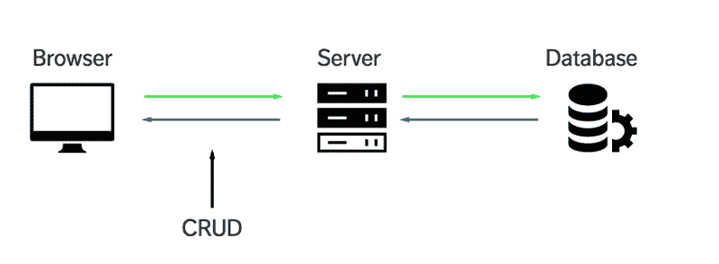

CRUD、Express 和 MongoDB 现在对你来说更有意义吗？

太好了。我们继续吧。

### 我们正在建造的东西

我们将构建一个简单的列表应用程序，允许你跟踪列表中的事情(比如待办事项列表)。

嗯，待办事项有点无聊。不如我们列一份《星球大战》角色的引语清单？太棒了，不是吗？在继续本教程之前，请随意快速浏览一下[演示](https://crud-express-mongo.herokuapp.com/)。同样，[这也是](https://github.com/zellwk/crud-express-mongo)你可以找到应用程序完成代码的地方。

顺便说一下，我们构建的不是一个性感的单页应用程序。在本教程中，我们主要关注如何使用 CRUD、Express 和 Mongo DB，所以，更多的是服务器端的东西。我不打算强调风格。

开始学习本教程需要两件东西:

1.  您不应该害怕在 shell 中输入命令。如果你现在是，看看这篇文章。
2.  您需要安装[节点](https://nodejs.org/)。

要检查是否安装了 Node，请打开命令行并运行以下代码:

```
$ node -v
```

如果你安装了节点，你应该得到一个版本号。如果你没有，你可以从 [Node 的网站](https://nodejs.org/)下载安装程序，或者通过[家酿](http://brew.sh/) (Mac)和[巧克力](https://chocolatey.org/) (Windows)这样的软件包管理器下载。

### 入门指南

首先为这个项目创建一个文件夹。随便你怎么称呼它。导航到该目录后，运行 npm init 命令。

这个命令创建一个 package.json 文件，帮助您管理我们在本教程后面安装的依赖项。

```
$ npm init
```

只要在出现的所有内容中点击回车。我将在我们进行的过程中讨论您需要了解的内容。

### 人生中第一次运行 Node

使用 node 最简单的方法是运行 node 命令，并指定文件的路径。让我们创建一个名为 server.js 的文件来运行 node。

```
$ touch server.js
```

当执行 server.js 文件时，我们要确保它运行正常。为此，只需在 server.js 中编写一条 console.log 语句:

```
console.log('May Node be with you')
```

现在，在命令行中运行 node server.js，您应该会看到您记录的语句:

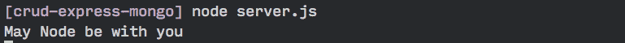

太好了。现在让我们继续学习如何使用 Express。

### 使用快递

我们首先必须安装 Express，然后才能在应用程序中使用它。安装 Express 非常简单。我们所要做的就是用 Node 附带的节点包管理器(npm)运行一个 install 命令。

在命令行中运行 NPM install express-save 命令:

```
$ npm install express --save
```

完成后，您应该会看到 npm 已经将 Express 保存为 package.json 中的一个依赖项。

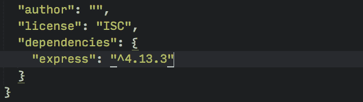

接下来，我们通过要求在 server.js 中使用 express。

```
const express = require('express');const app = express();
```

我们要做的第一件事是创建一个浏览器可以连接的服务器。我们可以借助 Express 提供的监听方法来做到这一点:

```
app.listen(3000, function() {  console.log('listening on 3000')})
```

现在，运行 node server.js 并在浏览器上导航到 localhost:3000。您应该会看到一条消息，上面写着“无法获取/”。

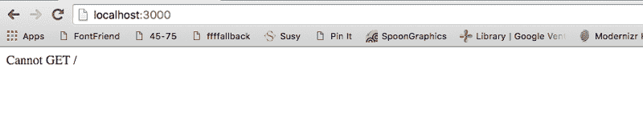

这是个好兆头。这意味着**我们现在可以通过浏览器**与我们的 express 服务器通信。这是我们开始 CRUD 操作的地方。

### CRUD —读取

无论何时访问网页，浏览器都会执行**读取**操作。在幕后，浏览器向服务器发送一个 **GET** 请求来执行读取操作。我们看到“cannot get /”错误的原因是因为我们还没有从服务器向浏览器发回任何东西。

在 Express 中，我们用 GET 方法处理一个 **GET** 请求:

```
app.get(path, callback)
```

**第一个参数 path** 是 GET 请求的路径。它是你的域名后面的任何东西。

当我们访问 localhost:3000 时，我们的浏览器实际上是在寻找 localhost:3000/。这种情况下的路径参数是/。

**第二个参数是一个回调函数**，它告诉服务器当路径匹配时做什么。它接受两个参数，一个请求对象和一个响应对象:

```
app.get('/', function (request, response) {  // do something here})
```

现在，让我们将“Hello World”写回浏览器。我们通过使用响应对象附带的 send 方法来实现这一点:

```
app.get('/', function(req, res) {  res.send('Hello World')})// Note: request and response are usually written as req and res respectively.
```

我将开始编写 ES6 代码，并向您展示如何在这个过程中转换到 ES6。首先，我将函数()替换为 [ES6 箭头函数](https://developer.mozilla.org/en/docs/Web/JavaScript/Reference/Functions/Arrow_functions)。下面的代码与上面的代码相同:

```
app.get('/', (req, res) => {  res.send('hello world')})
```

现在，通过执行以下操作来重新启动服务器:

1.  在命令行中按 CTRL + C 停止当前服务器。
2.  再次运行 node server.js。

然后，在浏览器上导航到 localhost:3000。你应该可以看到一个字符串，上面写着“Hello World”。

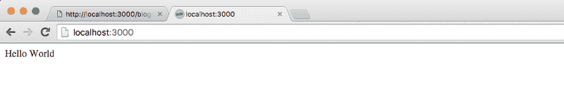

太好了。让我们改变我们的应用程序，让我们为浏览器提供一个 index.html 页面。为此，我们使用 res 对象提供的 sendFile 方法。

```
app.get('/', (req, res) => {  res.sendFile(__dirname + '/index.html')  // Note: __dirname is the path to your current working directory. Try logging it and see what you get!   // Mine was '/Users/zellwk/Projects/demo-repos/crud-express-mongo' for this app.})
```

在上面的 sendFile 方法中，我们告诉 Express 提供一个 index.html 文件，这个文件可以在您的项目文件夹的根目录中找到。我们还没有那份文件。让我们现在就做吧。

```
touch index.html
```

让我们也在 index.html 文件中放一些文本:

```
<!DOCTYPE html><html lang="en"><head>  <meta charset="UTF-8">  <title>MY APP</title></head><body>  May Node and Express be with you.   </body></html>
```

重启服务器并刷新浏览器。现在您应该可以看到 HTML 文件的结果了。

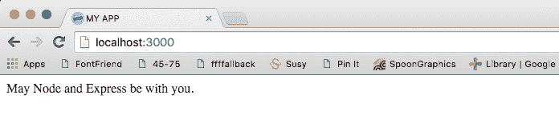

简而言之，这就是 Express 如何处理一个 **GET** 请求(**读作**操作)。

此时，您可能已经意识到，每当您对 server.js 进行更改时，都需要重新启动您的服务器。这是一个极其繁琐的过程，所以让我们快速绕道，通过使用一个名为 [nodemon](http://nodemon.io/) 的包来简化它。

### 输入 Nodemon

**每当您保存服务器使用的文件时，Nodemon 会自动重启服务器**。我们可以使用以下命令安装 Nodemon:

```
$ npm install nodemon --save-dev
```

注意:我们在这里使用— save-dev 标志的原因是因为我们在开发时只使用 Nodemon。这个标志会将 Nodemon 保存为 package.json 文件中的 devDependency。

继续，nodemon 的行为与 node 完全相同，这意味着我们可以通过调用 nodemon server.js 来运行我们的服务器。但是，我们现在不能在命令行中这样做，因为 Nodemon 没有安装-g 标志。

还有一种运行 Nodemon 的方法—我们可以从 node_modules 文件夹中执行 Nodemon。代码如下所示:

```
$ ./node_modules/.bin/nodemon server.js
```

这很难打。一种简单的方法是在 package.json 中创建一个脚本键。

```
{  // ...   "scripts": {    "dev": "nodemon server.js"  }  // ...}
```

现在，可以运行 npm run dev 来触发 nodemon server.js。

回到正题。接下来我们将讨论**创建**操作。

### CRUD —创建

如果一个 **POST** 请求被发送到服务器，那么 **CREATE** 操作仅由浏览器执行。这个 POST 请求可以用 JavaScript 或者通过一个<表单>元素触发。

在教程的这一部分，让我们看看如何使用

为此，首先必须创建一个

1.  动作属性
2.  方法属性
3.  并命名表单中所有元素的属性

```
<form action="/quotes" method="POST">  <input type="text" placeholder="name" name="name">  <input type="text" placeholder="quote" name="quote">  <button type="submit">Submit</button></form>
```

action 属性告诉浏览器在我们的 Express 应用程序中导航到哪里。在本例中，我们导航到/quotes。方法属性告诉浏览器请求发送什么。在本例中，这是一个 POST 请求。

在我们的服务器上，我们可以用 Express 提供的 post 方法处理这个 POST 请求。它采用与 GET 方法相同的参数:

```
app.post('/quotes', (req, res) => {  console.log('Hellooooooooooooooooo!')})
```

重启你的服务器(希望你已经设置了 Nodemon，这样它会自动重启)并刷新你的浏览器。然后，在表单元素中输入一些内容。你应该能看到 hello ooo ooo ooo ooo ooo！在命令行中。

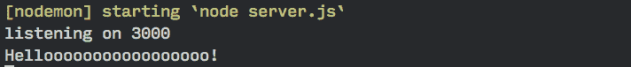

太好了，我们知道快递正在为我们处理表格。下一个问题是，我们如何用 Express 获得输入值？

原来，Express 本身并不处理从

```
$ npm install body-parser --save
```

Express 允许我们使用 use 方法将像 body-parser 这样的中间件添加到我们的应用程序中。在处理 Express 时，您会经常听到中间件这个术语。这些东西基本上是插件，它们在被我们的应用程序处理之前改变请求或响应对象。确保将 body-parser 放在 CRUD 处理程序之前！

```
const express = require('express')const bodyParser= require('body-parser')const app = express()
```

```
app.use(bodyParser.urlencoded({extended: true}))
```

```
// All your handlers here...
```

body-parser 中的 urlencoded 方法告诉 body-parser 从

现在，您应该能够看到 req.body 对象中表单字段的所有内容。试着做一个 console.log，看看它是什么！

```
app.post('/quotes', (req, res) => {  console.log(req.body)})
```

您应该能够在命令行中获得类似于以下内容的对象:

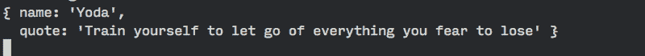

嗯。尤达大师发话了！我们一定要记住尤达的话。这很重要。我们希望能够在下次加载索引页面时检索到它。

进入数据库，MongoDB。

### MongoDB

如果我们想将 MongoDB 用作我们的数据库，我们首先必须通过 npm 安装它。

```
npm install mongodb --save
```

一旦安装完毕，我们就可以通过 Mongo 连接到 MongoDB。客户端的连接方法如下面的代码所示:

```
const MongoClient = require('mongodb').MongoClient
```

```
MongoClient.connect('link-to-mongodb', (err, database) => {  // ... start the server})
```

下一步是获得到我们数据库的正确链接。大多数人将他们的数据库存储在云服务上，比如 MongoLab。我们也会这么做。

所以，继续用 MongoLab 创建一个帐户吧。(是免费的)。完成后，创建一个新的 MongoDB 部署，并将计划设置为沙箱。

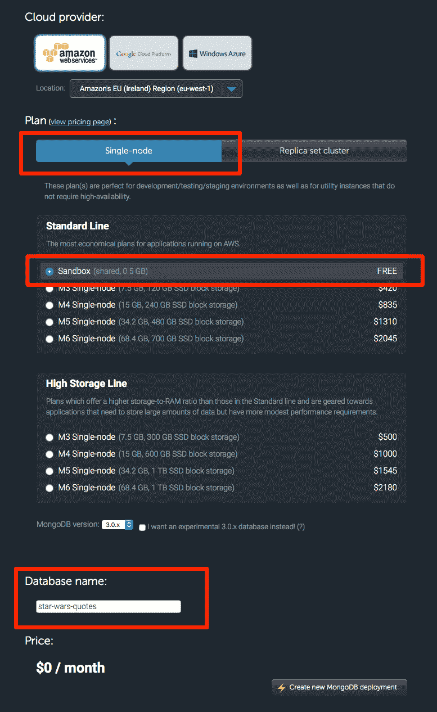

一旦完成了部署的创建，就进入部署并创建一个数据库用户和数据库密码。**记住数据库用户和数据库密码**,因为您将使用它来连接您刚刚创建的数据库。

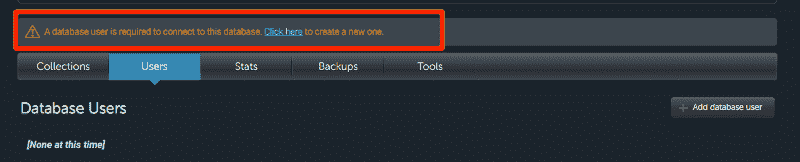

最后，获取 MongoDB url 并将其添加到您的 MongoClient.connect 方法中。确保使用您的数据库用户和密码！

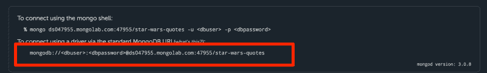

```
MongoClient.connect('your-mongodb-url', (err, database) => {  // ... do something here})
```

接下来，我们希望仅在数据库连接时启动服务器。因此，让我们将 app.listen 移到 connect 方法中。我们还将创建一个 db 变量，允许我们在处理来自浏览器的请求时使用数据库。

```
var db
```

```
MongoClient.connect('your-mongodb-url', (err, database) => {  if (err) return console.log(err)  db = database  app.listen(3000, () => {    console.log('listening on 3000')  })})
```

我们已经完成了 MongoDB 的设置。现在，让我们创建一个 quotes 集合来存储应用程序的报价。

顺便说一下，**collection 是存储东西**的指定位置。您可以创建任意数量的收藏。它可以是诸如“产品”、“报价”、“杂货”或你选择的任何其他标签。

我们可以在调用 MongoDB 的 db.collection()方法时使用字符串 quotes 来创建 quotes 集合。在创建 quotes 集合时，我们还可以同时用 save 方法将第一个条目保存到 MongoDB 中。

**一旦我们完成保存，我们必须将用户重定向到某个地方**(否则他们将永远等待我们的服务器移动)。在这种情况下，我们将把它们重定向回/，这将导致它们的浏览器重新加载。

```
app.post('/quotes', (req, res) => {  db.collection('quotes').save(req.body, (err, result) => {    if (err) return console.log(err)
```

```
 console.log('saved to database')    res.redirect('/')  })})
```

现在，如果您在

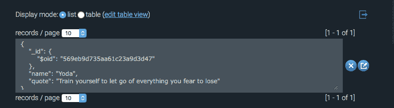

呼呼！既然我们在集合中已经有了一些引用，为什么不试着在它们登陆我们的页面时向我们的用户展示呢？

### 向用户显示报价

我们必须做两件事来向用户显示存储在 MongoLab 中的报价。

1.  从 MongoLab 获取报价
2.  使用模板引擎显示报价

让我们一步一步来。

我们可以通过使用 collection 方法中的 find 方法从 MongoLab 获取报价。

```
app.get('/', (req, res) => {  var cursor = db.collection('quotes').find()})
```

find 方法返回一个游标(一个 Mongo 对象),如果您注销它，这个游标可能没有意义。

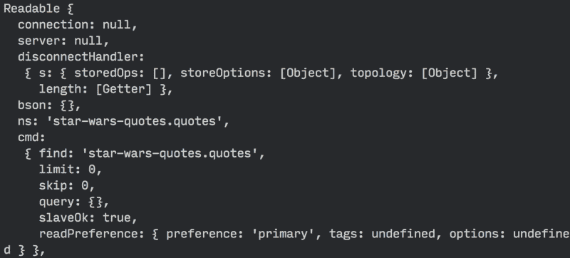

好消息是，这个游标对象包含了我们数据库中的所有报价。它还包含许多其他属性和方法，使我们能够轻松地处理数据。一种这样的方法是 toArray 方法。

toArray 方法接受一个回调函数，该函数允许我们用从 MongoLab 中检索到的引用做一些事情。让我们尝试对结果执行 console.log()，看看我们会得到什么！

```
db.collection('quotes').find().toArray(function(err, results) {  console.log(results)  // send HTML file populated with quotes here})
```

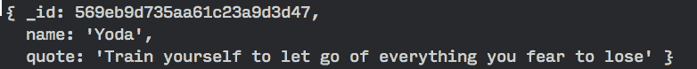

太好了！您现在可以看到一组引号(我现在只有一个)。我们已经完成了第一部分——从 MongoLab 获取数据。下一部分是生成一个包含我们所有报价的 HTML。

我们不能提供我们的 index.html 文件，并期望报价神奇地出现，因为没有办法添加动态内容到一个 HTML 文件。我们可以做的是使用模板引擎来帮助我们。一些流行的模板引擎包括 Jade、嵌入式 JavaScript 和 Nunjucks。

我已经在另一篇文章中广泛地写了关于模板引擎的方式和原因。如果你不知道什么是模板引擎，你可能想去看看。我个人使用(并推荐)Nunjucks 作为我选择的模板引擎。请随意查看帖子，找出原因。

对于本教程，我们将使用[嵌入式 JavaScript](http://www.embeddedjs.com/) (ejs)作为我们的模板引擎，因为这是最容易开始的。你会发现它很熟悉，因为你已经知道 HTML 和 JavaScript。

我们可以使用 EJS，首先安装它，然后将 Express 中的视图引擎设置为 ejs。

```
$ npm install ejs --save
```

```
app.set('view engine', 'ejs')
```

一旦设置好视图引擎，我们就可以开始生成带有报价的 HTML 了。这个过程也叫**渲染**。我们可以使用内置于响应对象呈现中的呈现对象来实现这一点。它具有以下语法:

```
res.render(view, locals)
```

**第一个参数，views** ，是我们正在渲染的文件的名称。该文件必须放在视图文件夹中。

**第二个参数，locals** ，是一个将数据传递给视图的对象。

让我们首先在 views 文件夹中创建一个 index.ejs 文件，这样我们就可以开始填充数据了。

```
$ mkdir views$ touch views/index.ejs
```

现在，将下面的代码放在 index.ejs 中。

```
<ul class="quotes">  <% for(var i=0; i<quotes.length; i++) {%>    <li class="quote">      <span><%= quotes[i].name %></span>      <span><%= quotes[i].quote %></span>    </li>  <% } %></ul>
```

明白我说你会觉得熟悉的意思了吗？在 EJS，你可以在标签中编写 JavaScript。如果使用标签，还可以将 JavaScript 输出为字符串。

在这里，你可以看到我们基本上是在引号数组中循环，并用引号[i]创建字符串。姓名和引文[i].引文。

在我们从 index.ejs 文件开始之前，还有一件事要做。记得将 index.html 文件中的

```
<!DOCTYPE html><html lang="en"><head>  <meta charset="UTF-8">  <title>MY APP</title></head><body>  May Node and Express be with you.
```

```
 <ul class="quotes">  <% for(var i=0; i<quotes.length; i++) {%>    <li class="quote">      <span><%= quotes[i].name %></span>      <span><%= quotes[i].quote %></span>    </li>  <% } %>  </ul>
```

```
 <form action="/quotes" method="POST">    <input type="text" placeholder="name" name="name">    <input type="text" placeholder="quote" name="quote">    <button type="submit">Submit</button>  </form></body></html>
```

最后，在处理 **GET** 请求时，我们必须呈现这个 index.ejs 文件。这里，我们将结果(一个数组)设置为我们在上面的 index.ejs 中使用的 quotes 数组。

```
app.get('/', (req, res) => {  db.collection('quotes').find().toArray((err, result) => {    if (err) return console.log(err)    // renders index.ejs    res.render('index.ejs', {quotes: result})  })})
```

现在，刷新你的浏览器，你应该能看到尤达大师的语录。

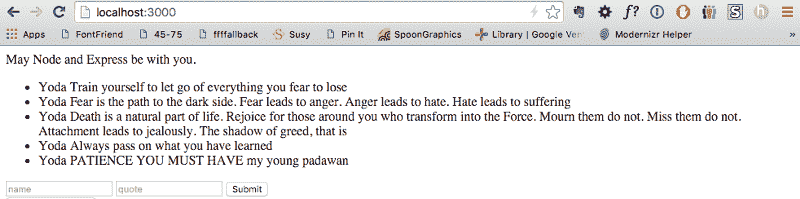

嗯。如果你一步一步地遵循教程，直到现在，你可能只有一个引用。我之所以有多处引用，是因为我在开发应用程序时默默地添加了更多。

### 包扎

我们在短短的 3000 字中涉及了很多内容。以下是总结这一切的几个要点。你有…

*   创建了一个快速服务器
*   学会了执行创建和读取操作
*   从 MongoDB 学会了保存和读取
*   学会了使用嵌入式 JS 这样的模板引擎。

还有两个操作要做，但是我们将把它留给下一篇文章。抓到你了！

这篇文章在 www.zell-weekeat.com 第一次出现在我的博客上。如果你想要更多这样的文章，可以看看