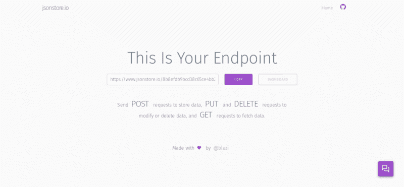

# 如何只用 HTML 和 JavaScript 构建一个简单的网址缩写器

> 原文：<https://www.freecodecamp.org/news/building-a-simple-url-shortener-with-just-html-and-javascript-6ea1ecda308c/>

作者帕拉什·鲍里

# 如何只用 HTML 和 JavaScript 构建一个简单的网址缩写器


你之前可能用过网址缩写器，比如 [bit.ly](https://bit.ly) ， [goo.gl](https://goo.gl) 。它们有助于缩短长网址，这样你就可以轻松地与你的朋友、家人或同事分享。

你可能想知道这些东西是如何工作的。为了理解这一点，我们需要仔细研究一下 URL 缩短器——所以我们将构建一个简单的 URL 缩短器！有了这个任务，我们将学习一些新的东西，并了解网址缩写是如何工作的。

今天，我们将构建一个简单的 URL 缩短器，它不需要数据库系统来托管。相反，我们将使用 [jsonstore.io](https://jsonstore.io) 。我假设你已经知道一些基本的 HTML & JavaScript。

所以事不宜迟，让我们开始建设。。。

### 从 HTML 开始

我们只需要一个文本输入框、一个按钮和一个脚本标签来创建我们的 URL 缩写器。

首先创建一个名为`index.html`的 HTML 文件，因为只需要这两个元素(一个文本输入框和一个按钮)。

所以让我们开始添加我们的三个主要元素:

```
<html> <body> <input type=”url” id=”urlinput”> <button onclick=”shorturl()”>Short The URL</button> <script src=”main.js”></script> </body></html>
```

正如我在上面的代码中展示的，我已经创建了一个简单的 HTML 文件。在 body 标签中，只有三个元素:一个`input`、一个`button`和一个`script`。

第一个元素是`input`，我们将在这里输入/粘贴我们的长 URL。我给了它一个 id 名`urlinput`,这样就可以很容易地在 JavaScript 中访问它。

下一个元素是一个`button`。当我们点击这个按钮时，我们的长 URL 将被缩短，因为它有一个`onclick`功能，当我们点击这个按钮时将被执行。在`shorturl()`函数中，将会有缩短 URL 所需的命令。

最后，我们有一个名为`main.js`的`script`，所有主要的 JavaScript 代码都在这里。上面提到的`shorturl()`功能也会有。

现在，我们的 HTML 部分已经完成了。让我们开始写一些 JavaScript

### 开始写一些 JavaScript

如上所示，我们需要一些 JavaScript 来创建我们的 URL 缩短器。

**步骤 0:** 正如我提到的，我们将使用 **jsonstore.io** 来存储关于我们的长 URL 的信息。我们将需要一个 **jsonstore.io** **端点** URL 来存储数据，因此您可以访问 [jsonstore.io](https://jsonstore.io) ，在那里您会看到如下内容:



在文本*这是您的端点*下，您可以看到一个带有长 URL 的文本框，如下所示:

`[https://www.jsonstore.io/8ba4fd855086288421f770482e372ccb5a05d906269a34da5884f39eed0418a1](https://www.jsonstore.io/8ba4fd855086288421f770482e372ccb5a05d906269a34da5884f39eed0418a1)`

点击紫色的*复制*按钮。

所以现在，让我们开始写一些 JavaScript。。。

创建一个名为`main.js`的 JavaScript 文件，并开始执行以下步骤。

首先，我们必须将复制的链接保存为变量:

```
var endpoint = "https://www.jsonstore.io/8ba4fd855086288421f770482e372ccb5a05d906269a34da5884f39eed0418a1";
```

然后，我们需要生成一些随机字符串，这样我们就可以在短 URL 和长 URL 之间创建一个链接。

> *假设我们有一个随机的 URL `abcd`，我们简单的 URL 缩短器位于 https://shortner.com 的[上，我们用那个随机的 URL 缩短了 https://google.com](https://shortner.com)[的 URL](https://google.com)。因此，无论何时我们去[https://shortner.com/#abcd](https://shortner.com/#abcd)我们都会被重定向到[https://google.com](https://google.com)*

所以，现在我们创建一个名为`getrandom()`的函数:

```
function getrandom(){    var random_string = Math.random().toString(32).substring(2, 5) + Math.random().toString(32).substring(2, 5);    return random_string()}
```

别担心，我会帮你理解上面的代码。

首先，我们启动了一个名为`getrandom`的函数。然后我们初始化一个名为`random_string`的变量，并给它一个值。

`Math`是一个内置的 Javascript 对象，允许我们对数字执行数学任务。首先我们从`Math`调用了`random`函数，`Math.random()`返回一个介于 0(含)和 1(不含)之间的随机数。

> *点击可以从[了解更多关于`Math`对象的信息。](https://www.w3schools.com/js/js_math.asp)*

然后我们使用`toString()`将返回的数字转换成一个字符串，我们给它一个参数 32，这样我们就得到一个正确的字符串，而不是二进制、十六进制或八进制。

然后我们也使用`substring(2,5)`来分割字符串并保持字符串的大小。然后我们再次按照相同的过程获得随机字符串的另一个块，最后我们使用`+`将字符串的两个块相加。

不要忘记添加一个返回随机字符串的`return`语句。

> 请记住，这不是生成随机字符串的唯一方法。你也可以用下面提到的方法来达到目的:

```
function getrandom() {    var text = “”;    var possible = “ABCDEFGHIJKLMNOPQRSTUVWXYZabcdefghijklmnopqrstuvwxyz0123456789”; 
```

```
 for (var i = 0; i < 5; i++)        text += possible.charAt(Math.floor(Math.random() * possible.length));    return text;}
```

现在返回到`index.html`并添加 JQuery，因为如果我们使用 JQuery，将更容易实现我们的目标。将它添加到 body 标签的末尾，但是在`main.js` script 标签之前。

现在再次回到`main.js`。

让我们创建一个名为`geturl`的函数，它将从输入框中获取值，对其进行验证，然后返回值:

```
function geturl(){     var url = document.getElementById(“urlinput”).value;     var protocol_ok = url.startsWith(“http://”) || url.startsWith(“https://”) || url.startsWith(“ftp://”);     if(!protocol_ok){         newurl = “http://”+url;         return newurl;     }else{         return url;     }
```

在`geturl`函数中，我们首先将输入框的值存储在`url`变量中。然后我们检查 URL 协议是否正常。如果协议没有以`http://`、`https://`或`ftp://`开头，我们在 URL 的开头添加`http://`，然后返回 URL。

> 实际上这不是一个安全的方法。你应该使用正则表达式来验证你的 URL！但是我想让这篇文章简单易懂。

现在我们需要另一个函数来改变地址栏中的散列，所以让我们创建它:

```
function genhash(){    if (window.location.hash == “”){        window.location.hash = getrandom();    }}
```

首先，我们检查散列位置是否为空。如果它是空的，我们就在地址栏中添加一个随机散列。

> *举例:如果我们的 URL 是[https://example.com/#abcd](https://example.com/#abcd)，那么`window.location.hash`的值将是`#abcd`。*

接下来，我们将处理我们的主函数`shorturl()`，让我们开始吧…

```
function shorturl(){    var longurl = geturl();    genhash();    send_request(longurl);}
```

首先，我们将长 URL 存储在`longurl`变量中。然后，我们在地址栏中添加一个随机散列，这样我们就可以将该 URL 用作短 URL。接下来我们调用带有参数`longurl`的`send_request()`。在这个函数中，我们向 **jsonstore** 发送一个 JSON 请求，以存储带有短 URL 链接的长 URL。所以现在让我们创建`send_request()`函数。

```
function send_request(url) {    this.url = url;    $.ajax({        ‘url’: endpoint + “/” + window.location.hash.substr(1),        ‘type’: ‘POST’,        ‘data’: JSON.stringify(this.url),        ‘dataType’: ‘json’,        ‘contentType’: ‘application/json; charset=utf-8’    })}
```

这里我们使用 JQuery 将 JSON 请求发送到**端点+"/" +我们来自地址栏的随机字符串 hash。**举个例子:

`[https://www.jsonstore.io/8ba4fd855086288421f770482e372ccb5a05d906269a34da5884f39eed0418a1/abcd](https://www.jsonstore.io/8ba4fd855086288421f770482e372ccb5a05d906269a34da5884f39eed0418a1/abcd)`

因此，每当我们向上述 URL 发送 get 请求时，我们将获得长 URL 作为`data`。

**重要**:在`shorturl()`功能之前加`send_request()`功能，否则不起作用。

> 要了解更多关于 JQuery 的 Ajax 功能，请点击[这里](https://www.w3schools.com/jquery/ajax_ajax.asp)。要了解更多关于 JSON 的信息，请点击[这里](https://developer.mozilla.org/en-US/docs/Learn/JavaScript/Objects/JSON)。

现在我们将使用代码获取链接到地址栏中输入的短 URL 的长 URL:

```
var hashh = window.location.hash.substr(1)
```

```
if (window.location.hash != "") {    $.getJSON(endpoint + "/" + hashh, function (data) {        data = data["result"];
```

```
if (data != null) {            window.location.href = data;        }
```

```
});
```

然后每当我们把短网址放在地址栏时，上面提到的代码就会被执行(例如[https://shorturl.com/#abcd](https://shorturl.com/#abcd))。

首先，我们将 URL 的哈希值存储在`hashh`变量中。

> *举例:如果我们的短 URL 是[https://shorted.com/#abcd](https://shorted.com/#abcd)，hash 的值将是 **#abcd。***

然后我们检查散列位置是否为空。如果它不为空，我们向地址`endpoint` + `hashh`发送一个 get 请求。

> *举例:* `[https://www.jsonstore.io/8ba4fd855086288421f770482e372ccb5a05d906269a34da5884f39eed0418a1/abcd](https://www.jsonstore.io/8ba4fd855086288421f770482e372ccb5a05d906269a34da5884f39eed0418a1/abcd)`

和往常一样，如果一切正常，我们将从 JSON 数组数据中获取长 URL，然后用`data["result"]`提取结果。

> *数据的值会和这个`{"result":longurl,"ok":true}`差不多，这里长 URL 就是你缩短的 URL。*

我们的网址缩短器就要完成了！在输入框中复制粘贴一个长 URL，然后点击**缩短 URL** 按钮！从地址栏复制链接—这是你的短网址！


### 一些有用的技巧

*   我们可以添加一个功能，当用户点击**缩短 URL** 按钮时，使用像 [SimpleCopy](https://github.com/kyle-rb/simplecopy) 或 [ClipboardJS](https://clipboardjs.com/) 这样的库来自动复制短 URL——他们会复制当前在地址栏中的短 URL。
*   如果使用 SimpleCopy，我们可以在`shorturl()`函数的末尾添加`simplecopy(window.location.href);`，每当它缩短一个 URL 时，就复制这个短 URL。
*   这个简单的 URL 缩短器依赖于第三方库，如 **jsonstore** ，所以用它来缩短一些机密的长 URL 并不是一个好主意。
*   您可以在 Github/Gitlab 页面中托管整个项目，并设置一个简单的 CNAME。就这样——您全新的个人网址缩写工具已经准备好了！你可以使用任何静态网站托管服务来托管你的网址缩写。
*   你可以在 [GITHUB](https://github.com/bauripalash/simpleurlshortener) 上找到该项目的完整源代码

今天到此为止！这是我的第一个技术指南，所以我为任何错误道歉。

如果你发现任何问题或错误，请在下面的评论中告诉我？。

或者在[脸书](http://fb.me/bauripalash)或[推特上 ping ee！](https://twitter.com/bauripalash)

和平！