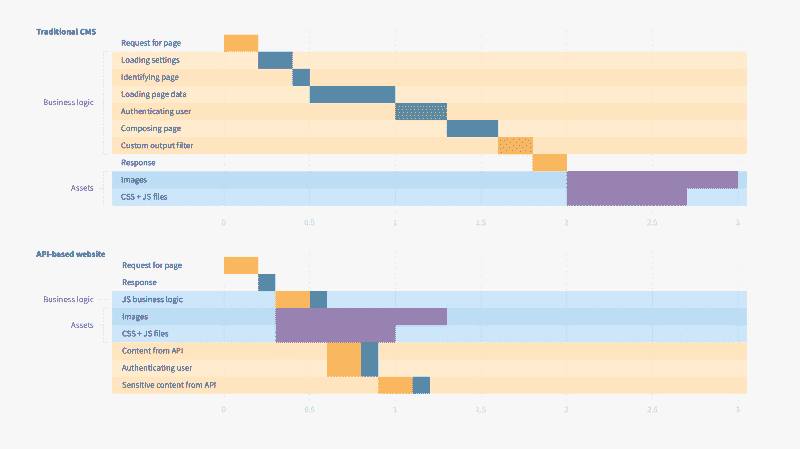
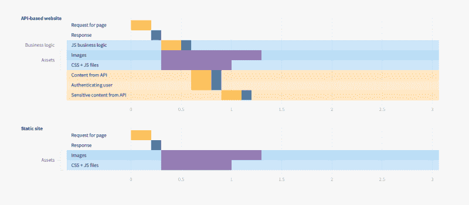

# 用 CMS 建立一个超级快速安全的网站没什么大不了的。或者是？

> 原文：<https://www.freecodecamp.org/news/building-a-super-fast-and-secure-website-with-a-cms-is-no-big-deal-or-is-it-5ac915c691f2/>

by Ondřej Polesný

# 用 CMS 建立一个超级快速安全的网站没什么大不了的。或者是？

我能破坏你的网站吗？你那里有我可以利用的剩余脚本吗？有没有办法窃取你的凭证，改变你的网站内容？我可以访问私人信息吗？没有吗？你确定吗？或者，我永远也不会知道，因为你的页面需要很长时间才能加载？

在创建网站的某个时候，你需要考虑性能和安全性。不管你是在你的个人网站上工作，还是在你客户的网站上工作。这与备份本地文件是一样的。有些人会定期备份，有些人还没有丢失过任何备份，所以不太倾向于这样做。

### 传统 CMS

如果您使用的是传统的内容管理系统(CMS ),情况会更复杂。这些系统包含许多功能。他们需要涵盖任何网站可能有的所有潜在用例。这意味着代码。很多代码。成千上万的文件。而且，这还不是全部——管理界面需要为您提供一个漂亮的 UI 来配置所有这些功能。潜在的，另外几千个文件。

#### 安全性

这不是你的代码，对吧？所以应该已经安全了。嗯，许多 CMS 供应商尽力确保他们的实现是安全的。他们还得处理很多文件。而且，每个文件都可能包含一个错误、一些遗留的代码，或者可能是一个暴露数据库的 querystring 参数。这本身就可能造成潜在的漏洞。

使用开源 CMS 可能更危险，因为实现是众所周知的。是的，你可以认为开源是有利的。任何人都可以贡献和修复发现的问题。但是，这只涵盖了已知的问题。攻击者可能会将他们的攻击隐藏起来。即使发现并修复了问题，你仍然需要投入大量的精力来确保你的网站是最新的。每次发布安全修补程序时，您都必须执行升级。

如果你对真实世界的统计数据感兴趣，可以看看 Sucuri 的[黑客网站报告。](http://bit.ly/2CVdyYP)

那么，攻击者想对你的网站做什么呢？从本质上说，他们希望获得您的数据，以便通过以下方式滥用您的网站:

*   通过一个脚本访问你的数据库。这通常是自定义剩余脚本、测试页面等的情况。
*   泄露和滥用你的秘密数据。对于其他服务或数据库的各种密钥和凭证，配置文件是一个典型的存储选项。
*   修改你的网站内容。
*   使您的网站无法访问，即关闭网站。

#### 表演

当你在传统的 CMS 上实现你的网站时，你通常需要定制它，所以有 CMS 的文件和你的定制文件。所有这些都需要编译，然后与预编译的库一起，在服务器真正开始处理对您的网站的请求之前，放到服务器内存中。或者更糟的是，如果你使用的是基于 PHP 等解释型语言的解决方案，那么就要为每个请求解释所有代码。

无论如何，你的网站看起来运行良好，为什么这应该是一个问题？嗯，因为:

*   您为您的服务器计算能力付费
*   您编译并复制了您从未打算使用的功能的代码
*   你的网站访问者等待回应

这些网站的第一个字节的时间可以超过 1 秒。当然，它是可以优化的，但是这样一来，您就要花费时间和金钱来找出如何减轻性能问题，并且通常最终会提高 CPU 和内存，或者更糟，添加额外的服务器。

使用[谷歌页面速度](http://bit.ly/2ESQuww)检查你的网站，或者使用[速度曲线](http://bit.ly/2EQyse6)获得更详细的分析，看看你的网站做得怎么样。

### 基于 API 的网站

建立在 API 之上的网站具有很大的灵活性。问问自己，需要内容管理吗？如果是这样，你可以使用无头 CMS。是否需要[存储表单提交](http://bit.ly/2P0gidP)？完美，使用表单服务。您是否正在为 mountain hotel 构建网站，并希望显示天气预报？有一个天气服务和它的 API。

用于此类网站的文件数量与其功能相对应。但是，内容编辑的管理界面呢？别担心。headless CMS 为您处理这一部分，不需要您托管或维护额外的代码。

#### 安全性

使用 API 服务时，您不需要在网站上安装管理服务。您可以在构建网站时配置所有组件。比如应该显示三天天气预报的天气组件。或者主页上应该有四篇博客文章。其余的动态内容可以在 headless CMS 中管理。

这种方法的主要好处是不需要数据库。没错，攻击者无法访问任何一个数据存储点。

如果你的网站是基于 JavaScript 的，那么它的实现基本上是开放的。它可以被编译，但是提供给浏览器的任何内容都是可读的。这是另一个优点。是的，任何人都可以直接查询服务端点。无论如何，你从他们那里得到的发布内容都会显示在你的网站上，只是变成了更好的视觉效果。这就像网站上的新闻文章和 RSS 阅读器一样。对于敏感内容，您总是可以通过另一个服务对每个用户进行身份验证，获得他们唯一的访问令牌，并使用它通过安全协议请求敏感内容。

如果您记住 JS 实现对每个人都是开放的，并且以正确的方式对待敏感数据，那么为了使您的网站安全，您需要做的工作就会少得多。没有数据库并通过安全渠道使用所有的 API 服务几乎为潜在的攻击者关上了所有的大门。

#### 表演

在这种情况下，web 服务器只提供资产。应用程序的业务逻辑存储在一个 JS 文件中。访问者浏览器通过异步请求收集来自不同端点的内容。

从第三方服务获取内容的异步请求？那一定很慢，对吧？当然，他们需要一些时间。但是，他们的交付端点通常是为了速度而构建的，托管在云中，非常灵活。你也可以挑一个使用 CDN 进行交付的无头 CMS，其中一个就是 [Kentico Cloud](http://bit.ly/2QzUALM) 。这样，请求将总是由地理上离您的每个访问者最近的数据中心来处理。

即使您使用多个服务来构建一个页面，这些请求都是异步的。游客只等最慢的一个。当使用传统 CMS 在服务器上编写页面时，与数据库和其他服务的所有通信通常是同步的。因此，服务器会等待每个事务完成，然后再开始另一个事务。并且，在所有这些完成之后，所有的东西都被放在一起，作为一个大的响应发送回去。

Traditional CMS — 3s; API based website — 1.3s

看看 web 服务器处理传入请求花了多长时间(浅黄色背景)。一直以来，访问者都在积极地等待，而不能开始下载图像和其他资源。只有在收到响应后，访问者的浏览器才会知道它们。

基于 API 的网站要快得多，因为静态 HTML 文件的初始响应是即时的。浏览器将网站的业务逻辑作为资产之一下载，并生成所有后续的对内容的异步请求。访问者可以更快地看到一个完全呈现的页面，他们也可以看到正在发生的事情。当他们等待服务器渲染的页面时，他们看到的只是浏览器地址栏中的预加载程序。在这种情况下，基于 API 的网站的整体性能提高了 50%以上。根据网站的实施情况，它可以高得多。

### 静态网站

那么，如果我们已经有了一个基于 API 的网站，为什么还要费心去解决性能问题呢？

因为 web 服务器只提供静态文件和资产，所以它的性能很好。事实上，当网站在访问者的浏览器中呈现时，动态内容是稍后收集的，这可能会导致一些伪像。访问者可能会看到一个空组件，当它从异步请求中接收数据时，这个组件就会被填充，等等。网速慢的人或者使用旧电脑的人可能会觉得这很烦人。

对此我们能做些什么？不，我们不会添加任何预加载程序。当你看到一个无限的预加载器只是不停地旋转，旋转，旋转，你是什么感觉？我们可以让我们的网站保持静态，同时保持动态。

静态网站的概念是关于你的网站的输出。从内容开始。编辑通常不会经常更新内容。该网站需要在每一个单独的请求(像传统的 CMS 做)组成。这个想法类似于缓存——将生成的数据或页面存储在内存中。但是静态网站走得更远。每次编辑发布内容时，都会生成整个网站、包含所有内容的所有页面。因此，如果您的博客中有 153 篇博文，那么网站现在将有 153 个静态页面(加上一些其他页面，如主页、联系人等)。

你打算如何管理 153 页？你不知道。您仍然只管理单个动态页面的实现。静态站点是通过将您的实现与来自 headless CMS 的内容相结合而生成的。所以当有新的内容时，网站会自动重新生成。

你可以看到，与基于动态 API 的网站相比，速度的优势并不显著。然而:

*   你的访问者会在第一次回复中得到页面和所有内容。他们不会看正在创建的页面。他们的浏览器不需要为内容创建额外的异步请求
*   所有后续请求的行为都是一样的
*   访问者在一组非常快速的静态页面之间导航
*   一些静态网站生成工具为访问者提供了额外的酷功能，如预加载链接页面(这使得导航到它们变得即时)或在完全下载之前显示低质量的图像

所有这些都会给你的访问者留下一个速度极快的网站的印象。

当然每个网站都不一样。您可能需要一些个性化功能，或者想要显示敏感内容。在这些情况下，你可以结合两种方法。拥有一个静态网站，并且仍然使用基于 API 的服务来交付因访问者而异的内容。

### 结论

每个站点的性能和安全性都非常重要。传统的 CMS 通常比基于 API 的网站需要更多的资源，但是它们提供了更多现成的功能。

另一方面，基于 API 的网站速度更快，也更安全。它们能让你节省主机费用，并为你的访客提供更好的体验。

如今，静态网站大受欢迎，因为它们的表现是迄今为止最好的。它们还允许你基于 JavaScript 构建部分静态部分动态的站点，这些站点可以被搜索引擎很好地索引。

你的网站已经静态了吗？你使用过静态站点生成器吗？请在下面的评论区告诉我你的经历。

在我的下一篇文章中，我将向你展示如何使用静态站点生成器在 Vue.js 上构建一个网站。

#### 该系列的其他文章:

1.  [第一次如何开始创建一个令人印象深刻的网站](http://bit.ly/2Duglu1)
2.  如何为你的网站决定最好的技术？
3.  [如何用 Vue.js 和最少的努力启动你的网站](http://bit.ly/2zLRE8a)
4.  [如何将无头 CMS 与一个 Vue.js 网站混合，并且零付费](http://bit.ly/2CyDnhX)
5.  [如何在 API 网站上安全提交表单](http://bit.ly/2P0gidP)
6.  用 CMS 建立一个超级快速安全的网站没什么大不了的。或者是？
7.  [如何用 Vue.js 快速生成静态网站](http://bit.ly/2PN46Jy)
8.  [如何快速建立静态站点的构建流程](http://bit.ly/2Dv2UGS)