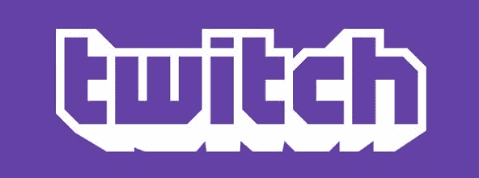
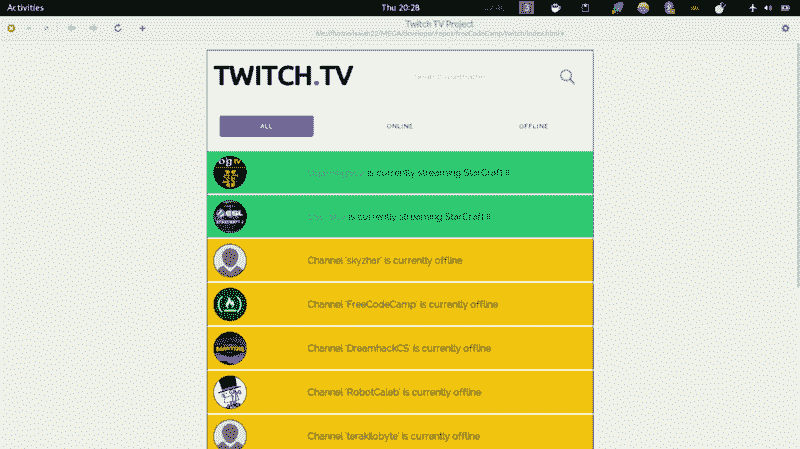
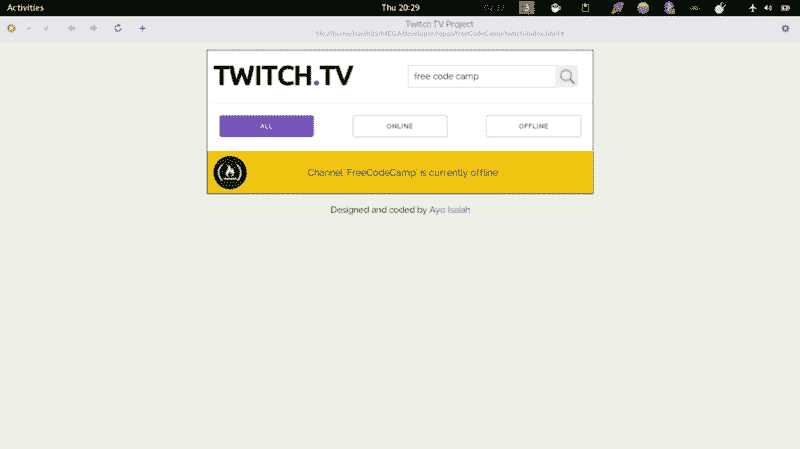

# 构建 TwitchTV 状态应用程序

> 原文：<https://www.freecodecamp.org/news/building-a-twitchtv-app-project-8824d61fe7a5/>

作者 Ayo Isaiah

# 构建 TwitchTV 状态应用程序



上周，我处理了最后一个中间前端项目，其中包括使用 Twitch API 构建一个 [TwitchTv 应用程序](https://www.freecodecamp.com/challenges/use-the-twitchtv-json-api)来显示一组 Twitch Streamers 的状态。

这些是这个项目的用户故事:

1.  用户可以在 Twitch.tv 上看到自由代码营当前是否正在播放。
2.  用户可以点击状态输出，直接被发送到免费代码阵营的 Twitch.tv 频道。
3.  如果 Twitch streamer 当前正在流，用户可以看到关于他们正在流的内容的更多细节。
4.  如果流媒体工具关闭了他们的 Twitch 帐户(或者该帐户从未存在过)，用户将会看到一个占位符通知。

#### 设计

我的应用程序的设计与项目描述中给出的[示例应用程序](https://codepen.io/FreeCodeCamp/full/Myvqmo/)非常相似。

唯一的主要区别是页面顶部的搜索输入，我把它放在第五个用户故事的顶部(下面会有更多的介绍)。

我使用了 [Skeleton](http://getskeleton.com/) 来帮助完成基本的样式和响应，这样所有东西在桌面和移动上都很好看。

对于个人资料图片，我使用了背景图片而不是标签。这是因为只需将背景尺寸设置为 cover，就可以让图像缩放到其容器的大小，而与尺寸无关。

这是我在做[随机报价生成器项目](http://ayoisaiah.com/random-quote-generator/)时学到的，很高兴在这里再次实践它。



### 思维过程

首先，我创建了一个 Twitch Streamers 数组，并使用 for 循环遍历数组，发出连续的 AJAX 请求，这样我就可以获取每个 streamer 的数据。

```
var twitchStreamers = ["dreamhackcs", "skyzhar", "freecodecamp", "faceittv", "comster404", "brunofin", "terakilobyte", "robotcaleb", "sheevergaming", "esl_sc2", "ogamingsc2", "jacksofamerica"];
```

```
...
```

```
for (var i = 0; i < twitchStreamers.length; i++) {        ajax();}
```

```
...
```

```
function ajax () {        $.ajax({            url: "https://api.twitch.tv/kraken/streams/" + twitchStreamers[i] + "?callback=?",            dataType: "jsonp",            data: {                format: "json"            },
```

```
 success: function (data) {                fetchData(data);            },
```

```
 error: function () {                console.log("unable to access json");            }        });    }
```

如果 AJAX 请求成功，它调用另一个函数 *fetchData()* ，该函数简单地从 JSON 输出中获取所需的数据，比如每个通道的用户名、状态、url 和显示图片，并调用 *updateHTML()* 函数，该函数简单地获取数据并更新 DOM。

```
function fetchData (data) {
```

```
 if (data.stream === null) {            url = data._links.channel.substr(38);            updateOfflineUsers();        }
```

```
 else if (data.status == 422 || data.status == 404) {            status = data.message;            updateHTML(".unavailable");        }
```

```
 else {            if (data.stream.channel.logo !== null) {                picture = 'url("' + data.stream.channel.logo + '")';            }
```

```
 else {                picture = 'url("https://cdn.rawgit.com/ayoisaiah/freeCodeCamp/master/twitch/images/placeholder-2.jpg")';            }            url = data._links.channel.substr(38);            status = "<a href='https://twitch.tv/" + url + "' target='_blank'" + "'>" + data.stream.channel.display_name +  "</a>" + " is currently streaming " + data.stream.game;            updateHTML(".online");        }    }
```

对于离线流，有一个额外的步骤。我不得不使用[https://api.twitch.tv/kraken/channels/](https://api.twitch.tv/kraken/channels/)进行另一个 API 调用来获取每个通道的数据，因为第一个调用(使用【https://api.twitch.tv/kraken/streams/】T2)没有提供关于离线流的任何信息，除了它们当时不活动的事实。

```
function updateOfflineUsers () { //If users are offline, make new ajax request to find user info        $.ajax({            url: "https://api.twitch.tv/kraken/channels/" + url,            dataType: "jsonp",            data: {format: "json"},            success: function (json) {                status = "Channel " + "'<a href='" + json.url + "' target='_blank'" + "'>" + json.display_name + "</a>'" + " is currently offline";                if (json.logo !== null) {                    picture = 'url("' + json.logo + '")';                }                else {                    picture = 'url("https://cdn.rawgit.com/ayoisaiah/freeCodeCamp/master/twitch/images/placeholder-2.jpg")';                }                updateHTML(".offline");            }        });    }
```

一旦我有了这些，四个用户故事就完成了，我准备好了。此时，我将项目标记为已完成，但不久之后，我认为稍微扩展一下应用程序的功能会非常酷。

这时我添加了第五个用户故事:

*   用户可以搜索 TwitchTv Streamers 并查看它们是否在线。

因此，我创建了一个搜索函数，它接受用户的输入，并使用它来进行 API 调用:

```
function search () {        $(".online, .offline, .unavailable").empty();        showAll();          var searchQuery = $(".search-twitch").val();        var user = searchQuery.replace(/[^A-Z0-9_]/ig, "");        $.ajax({            url: "https://api.twitch.tv/kraken/streams/" + user,            dataType: "jsonp",            data: {                format: "json"            },
```

```
 success: function (data) {                fetchData(data);                                }        });    }
```

我使用了一点正则表达式来删除用户查询中的特殊字符和空格，只留下数字、字母和下划线。我认为这很重要，因为 Twitch 不允许用户名中有特殊字符(如$，&，e.t.c)或空格，所以有必要过滤掉这些字符。

它还有助于如果用户搜索类似“freecodecamp”(用空格分隔整个单词)而不是“free code camp”，它仍然会返回预期的相关结果。



这就是这个项目的大部分内容。可以在 Codepen 上查看[最终版本](http://codepen.io/ayoisaiah/full/MyGjpz/)。

#### 关键外卖

就在我写这篇博文的时候，我的脑海中不断浮现出几种改善应用程序用户体验的方法，所以我从这个项目中得到的主要收获是:

软件永远不会完成。 [这是一个过程，它总是在进化](http://scripting.com/davenet/1995/09/03/wemakeshittysoftware.html)。

#### 下一步是什么

现在，我正在努力争取在接下来的几天内完成 FCC 的[中级算法脚本](https://www.freecodecamp.com/map-aside#nested-collapseIntermediateAlgorithmScripting)部分，这样我就可以快速进入高级算法部分。

我的(短期)目标仍然是在 5 月底之前获得[前端认证](http://www.freecodecamp.com/challenges/claim-your-front-end-development-certificate)，如果一切顺利的话，我应该可以在那之前获得认证。祝我好运。

如果你想和我联系，你可以在[推特](https://twitter.com/ayisaiah)或[电子邮件](mailto:ayisaiah@gmail.com)上找到我。这篇文章一个版本发表在我的个人博客上。