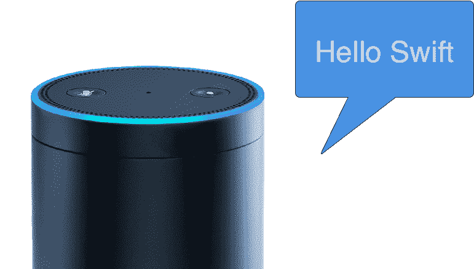
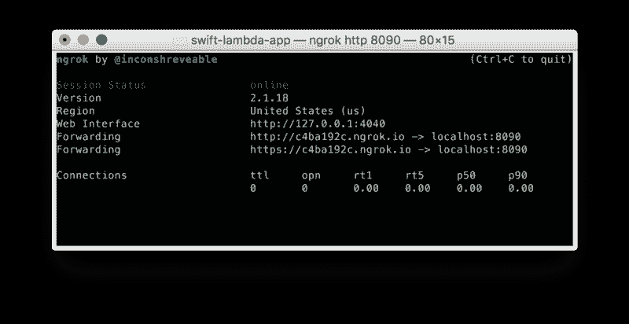
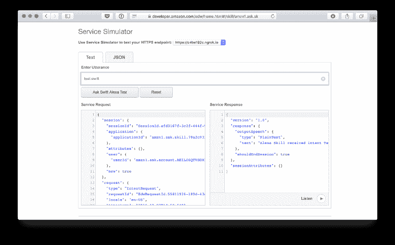
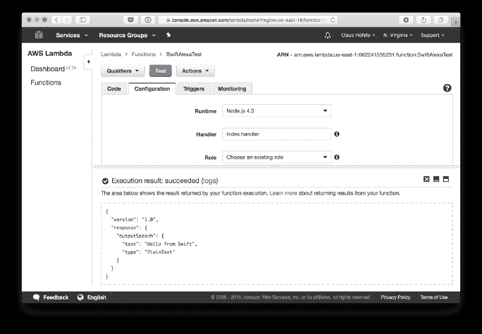

# 在 Swift 中培养 Alexa 技能

> 原文：<https://www.freecodecamp.org/news/building-alexa-skills-in-swift-3d596aa0ee95/>

克劳斯·霍费尔



# 在 Swift 中培养 Alexa 技能

#### 如何使用 Swift 为 Amazon Echo 开发定制技能

Alexa 语音服务是亚马逊的云服务，它理解自然语言，允许用户通过使用语音与设备进行交互。你通常会将 Alexa 与亚马逊的语音扬声器联系起来，例如 [Echo](https://www.amazon.com/Amazon-Echo-Bluetooth-Speaker-with-WiFi-Alexa/dp/B00X4WHP5E) ，但 Alexa 可能会在任何带有麦克风和扬声器的连接设备上运行。

不像苹果的 Siri，其扩展被限制在特定的领域，Alexa 的 API 允许开发者实现广泛的定制语音服务，称为“技能”。使用 Swift 允许 iOS 开发人员(比如我)扩展他们现有的技能组合，以包括服务器端编程，并参与到语音用户界面的趋势中。

### 佐料

简单来说，Alexa 向你的技能发送一个带有用户意图的 JSON 消息，你的代码用一个 JSON 消息来回答，这个消息决定了 Alexa 将向用户回答什么。

因为我更喜欢在 Swift 中实现这个功能，所以我使用了自己编写的 Swift 库 [AlexaSkillsKit](https://github.com/choefele/AlexaSkillsKit) 。它负责解析来自 Amazon 的 JSON 请求，生成适当的响应，并提供方便的方法来处理 Alexa 特性。

自定义技能的代码可以作为独立的 web 服务或 AWS Lambda 函数运行。使用 Lambda，Amazon 的无服务器计算平台，Amazon 将负责扩展和运行您的 Swift 代码——这就是我将使用这种部署类型完成技能的原因。然而，正如您将看到的，web 服务选项在发展您的技能时非常有用。

注意，开箱即用，Lambda 只支持用 JavaScript (Node.js)、Python 和 Java 编写的代码。但是很容易将其扩展到用任何编程语言编写的可执行文件。我的文章[无服务器 Swift](https://medium.com/@claushoefele/serverless-swift-2e8dce589b68#.ts7aama46) 提供了如何做到这一点的分步指南。

总之，你需要以下的 Alexa 技能:

*   使用 [AlexaSkillsKit](https://github.com/choefele/AlexaSkillsKit) 在 Swift 中实现您的技能功能
*   使用 [AWS 控制台](https://aws.amazon.com/console/)用 Swift 代码设置的 Lambda 函数
*   在触发你的 Lambda 功能的 Alexa 控制台中配置的一个 Alexa 技能

请注意，Alexa 控制台和 AWS 控制台是两个独立的服务，您需要注册。

### 示例项目

为了简化您的第一步，我用一个示例应用程序创建了一个 repo。 [swift-lambda-app](https://github.com/choefele/swift-lambda-app) 包含代码和脚本，帮助您快速开始在 swift 中编写自定义 Alexa 技能并将其部署到 AWS Lambda。

示例应用程序使用标准的 Swift 包管理器目录布局和[包文件](https://github.com/choefele/swift-lambda-app/blob/master/Package.swift)，因此 *swift 构建*、 *swift 测试*和 *swift 包生成-xcodeproj* 按预期工作。查看 [SPM 文档](https://github.com/apple/swift-package-manager/blob/master/Documentation/Usage.md)了解更多信息。

有三个目标:

*   这是一个实现自定义 Alexa 技能的代码库。这是一个独立的库，所以它可以被其他两个目标使用。此外，库默认启用了`ENABLE_TESTABILITY`，这允许您在单元测试中访问内部方法和属性。
*   **Lambda** :部署到 Lambda 的命令行可执行文件。该程序使用*标准输入*和*标准输出*来处理数据。
*   **服务器**(仅限 macOS):为了简化定制 Alexa 技能的实现，服务器提供了一个到 Alexa Skill 目标的 HTTP 接口。这个 HTTP 服务器可以通过 [ngrok](https://ngrok.com/) 公开展示，并在 Alexa 控制台中配置，这使你能够在开发计算机上运行代码来开发和调试 Alexa 技能。这个目标只是 macOS，因为它不可能干净地分离目标依赖关系，而且我不想将用于服务器开发的库链接到用于部署的 Lambda 可执行文件。

对于开发，我推荐一种针对库目标的[测试驱动开发](https://en.wikipedia.org/wiki/Test-driven_development)方法，因为这导致代码变更的最快周转。上传到 Lambda 来快速验证更改并不是一个真正的选择，因为上传时间很慢。然而，如下所述，通过 HTTPS 公开您的功能，使您能够以稍微不同的方式测试和调试您的功能。

### 实现自定义的 Alexa 技能

从实现 *RequestHandler* 协议开始。AlexaSkillsKit 解析来自 Alexa 的请求，并将数据传递给该协议所需的方法。

```
public protocol RequestHandler {        func handleLaunch(request: LaunchRequest, session: Session, next: @escaping (StandardResult) -> ())
```

```
 func handleIntent(request: IntentRequest, session: Session, next: @escaping (StandardResult) -> ())
```

```
 func handleSessionEnded(request: SessionEndedRequest, session: Session, next: @escaping (VoidResult) -> ())}
```

例如，[启动请求](https://developer.amazon.com/public/solutions/alexa/alexa-skills-kit/docs/custom-standard-request-types-reference#launchrequest)将导致 AlexaSkillsKit 调用 *handleLaunch()* 方法。

```
import Foundationimport AlexaSkillsKit
```

```
public class AlexaSkillHandler : RequestHandler {    public init() {}    public func handleLaunch(request: LaunchRequest, session: Session, next: @escaping (StandardResult) -> ()) {        let standardResponse = generateResponse(message: "Hello Swift")        next(.success(standardResponse: standardResponse, sessionAttributes: session.attributes))    }}
```

在请求处理程序中，您的定制技能可以实现您的技能所需的任何逻辑。为了启用异步代码(例如调用另一个 HTTP 服务)，结果通过 *next* 回调传递。*下一个*接受一个或者是*的枚举。成功*并包含 Alexa 响应或*。出现问题时的故障*。

为了简单起见，我们会传回一条消息，Alexa 会大声对用户说:

```
func generateResponse(message: String) -> StandardResponse {    let outputSpeech = OutputSpeech.plain(text: message)    return StandardResponse(outputSpeech: outputSpeech)}
```

### 使用本地 HTTP 服务器调试代码

作为 Swift 服务器的一部分，调用 *RequestHandler* 是通过亚马逊的 HTTPS API 完成的，Alexa 服务通过 POST 请求调用您的服务器。在下面的代码中， [Kitura](https://github.com/IBM-Swift/Kitura) 被用作一个 web 框架，但是任何其他的 web 框架也同样适用:

```
import Foundationimport AlexaSkillsKitimport AlexaSkillimport Kiturarouter.all("/") { request, response, next in    var data = Data()    let _ = try? request.read(into: &data)    let requestDispatcher = RequestDispatcher(requestHandler: AlexaSkillHandler())    requestDispatcher.dispatch(data: data) { result in        switch result {        case .success(let data):            response.send(data: data).status(.OK)        case .failure(let error):            response.send(error.message).status(.badRequest)        }        next()    }}Kitura.addHTTPServer(onPort: 8090, with: router)Kitura.run()
```

要运行本地 HTTPS 服务器，请执行以下操作:

*   通过运行*快速构建*来确保示例构建成功
*   使用 *swift 包 generate-xcodeproj* 生成 Xcode 项目
*   打开生成的 Xcode 项目，选择服务器方案，运行产品(CMD-R)。这将在端口 8090 启动一个服务器
*   通过*brew buck 安装 ngrok* 安装 ngrok。该工具允许您将本地 HTTP 服务器暴露给互联网
*   运行 *ngrok http 8090* 复制 ngrok 生成的 HTTPS URL(看起来类似 https://c4ba192c.ngrok.io)



ngrok 将您的本地服务器暴露给公共互联网，从而允许 Alexa 语音服务调用您在 Xcode 中运行的自定义技能。

### 配置 Alexa 技能

要将您的自定义技能连接到 Alexa:

*   去 Alexa 控制台创建一个新技能
*   技能类型:自定义交互模型
*   意图:`{"intents": [{"intent": "TestIntent"}]}`
*   示例语句:“TestIntent test swift”
*   SSL 证书:选择“我的开发端点是拥有来自证书颁发机构的通配符证书的域的子域”
*   服务端点类型: *HTTPS(使用来自 ngrok 的 URL)*

现在你可以在 Alexa 控制台的服务模拟器中使用语句“test swift”来测试技能。这将调用您的本地服务器，允许您在与 Alexa 服务交互时修改和调试您的代码。



### 为您的代码运行测试

在上传到 Lambda 之前，值得在 Linux 环境中运行您的单元测试，并运行模拟执行环境的集成测试。该示例提供了[*run-unit-tests . sh*](https://github.com/choefele/swift-lambda-app/blob/master/run-unit-tests.sh)来执行前者，提供了[*run-integration-tests . sh*](https://github.com/choefele/swift-lambda-app/blob/master/run-integration-tests.sh)来执行后者。

*run-unit-tests.sh* 在基于 Ubuntu 的 Swift Docker 容器中构建并测试 Lambda 目标，因为目前还没有针对 Amazon Linux(基于 RHEL)的 Swift 编译器。如果您提供了运行程序所需的所有依赖项，那么在不同的 Linux 发行版上构建的可执行文件是相互兼容的。因此，脚本使用 *ldd* 捕获运行可执行文件所需的所有共享库。

为了证明最终的包能够工作， *run-integration-tests.sh* 在一个 Docker 容器中运行 Swift 代码的发布版本，该容器接近 Lambda 的执行环境(不幸的是，[亚马逊只提供了一些 Docker 映像](https://hub.docker.com/_/amazonlinux/)，它们不一定与 [Lambda 使用的](http://docs.aws.amazon.com/lambda/latest/dg/current-supported-versions.html)相匹配)。

与 Lambda 的集成是通过一个小的 [Node.js 脚本](https://github.com/choefele/swift-lambda-app/blob/master/Shim/index.js)完成的，该脚本使用 *child_process* 模块来运行 Swift 可执行文件。该脚本遵循亚马逊的建议，让[在 AWS Lambda](https://aws.amazon.com/blogs/compute/running-executables-in-aws-lambda/) 中运行任意可执行文件。

在[配置 Travis](https://github.com/choefele/swift-lambda-app/blob/master/.travis.yml) 之后，您可以为每次提交运行相同的集成脚本。

### 将您的代码部署到 Lambda

对于 Lambda，您需要创建一个可执行文件，它从 *stdin* 获取输入，并将输出写入 *stdout* 。这可以通过下面的代码来完成:

```
import Foundationimport AlexaSkillsKitimport AlexaSkilldo {    let data = FileHandle.standardInput.readDataToEndOfFile()    let requestDispatcher = RequestDispatcher(requestHandler: AlexaSkillHandler())    let responseData = try requestDispatcher.dispatch(data: data)    FileHandle.standardOutput.write(responseData)} catch let error as MessageError {    let data = error.message.data(using: .utf8) ?? Data()    FileHandle.standardOutput.write(data)}
```

请注意，这段代码使用了与 HTTP 服务器相同的 *RequestHandler* ,从而最小化了开发环境的差异。

要将代码部署到 Lambda:

*   运行 *run-integration-tests.sh* 在。构建/lambda/lambda.zip，其中包含上传到 lambda 所需的所有文件
*   在美国东部/北弗吉尼亚地区的 [AWS 控制台](https://console.aws.amazon.com/lambda/home)中创建一个新的 Lambda 函数(对于欧洲，使用欧盟/爱尔兰)
*   使用 Alexa 技能包触发器
*   Runtime: NodeJS 4.3
*   代码条目类型:ZIP 文件(上传上一步中的 lambda.zip 文件)
*   处理程序:index.handler
*   角色:从模板创建或使用现有角色

一旦上传了 Lambda 函数，您就可以在 AWS 控制台中使用测试操作，例如通过使用 Start Session 操作。



### 为 Lambda 配置 Alexa 技能

创建了 Lambda 函数后，你现在可以创建一个 Alexa 技能了。如果您之前已经为本地 HTTP 服务器创建了一个 Alexa 技能，唯一的区别是服务端点:

*   去 Alexa 控制台创建一个新技能
*   技能类型:自定义交互模型
*   意图:`{"intents": [{"intent": "TestIntent"}]}`
*   示例语句:“TestIntent test swift”
*   服务端点类型: *AWS Lambda ARN* (从 AWS 控制台使用 Lambda 函数的 ARN)

现在，您可以在 Alexa 控制台中使用“test swift”来测试技能。关于配置 Alexa 技能的更多细节可以在亚马逊的开发者门户网站上找到。

### 包扎

查看 GitHub 上的 [swift-lambda-app](https://github.com/choefele/swift-lambda-app) repo，获取在 swift 中开发和部署简单 Alex 技能的代码和脚本。在以后的文章中，我将提供更多关于如何编写有用技能的细节。同时，如果你有任何问题，可以浏览[亚马逊的文档](https://developer.amazon.com/public/solutions/alexa/alexa-skills-kit/docs/alexa-skills-kit-interface-reference)或者在[推特](https://twitter.com/claushoefele)上联系我。