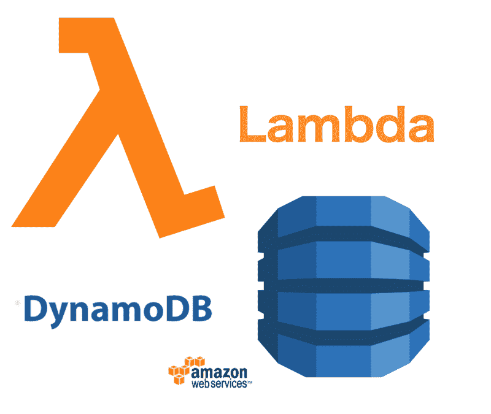
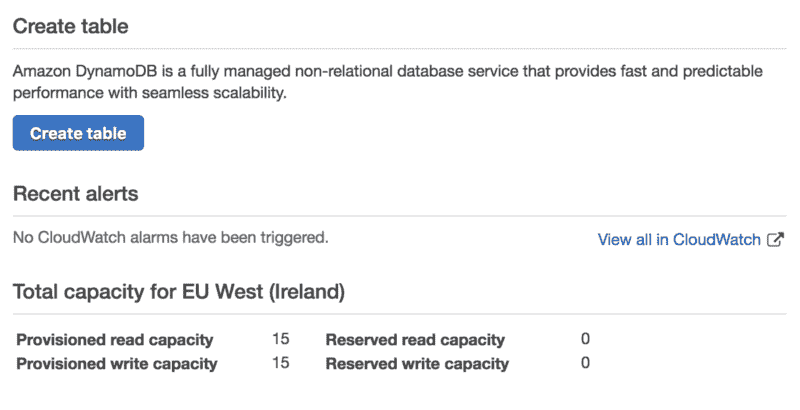
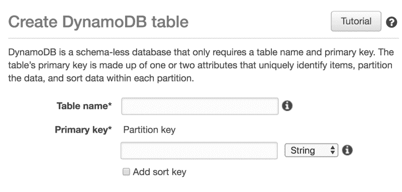
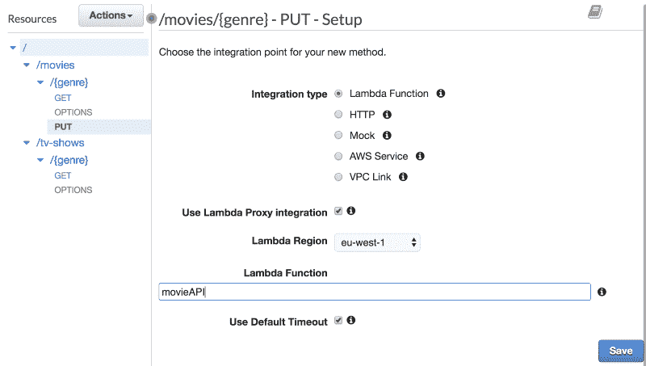
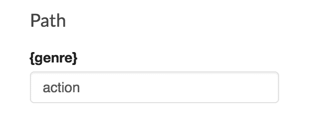
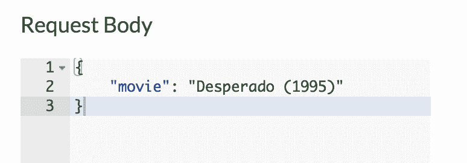
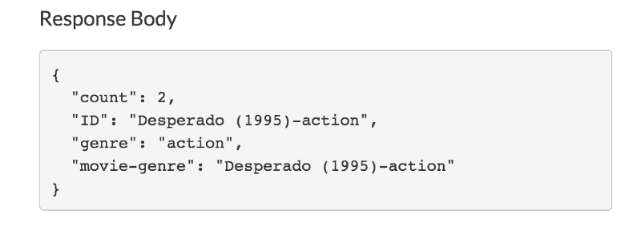

# 如何使用 AWS Lambda 将 DynamoDB 集成到您的 API 中

> 原文：<https://www.freecodecamp.org/news/building-an-api-with-lambdas-and-api-gateway-part-2-7c674a0eb121/>

作者:萨姆·威廉姆斯

# 如何使用 AWS Lambda 将 DynamoDB 集成到您的 API 中



在本教程的第一部分[，我们创建了一个 API，它将请求传递给 Lambda，后者返回该流派的热门电视节目或电影。现在我们将使用 DynamoDB 让用户为他们最喜欢的类型投票。](https://medium.freecodecamp.org/building-an-api-with-lambdas-and-api-gateway-11254e23b703)

如果你还没有阅读这个系列的第一部分，那么[在这里查看一下](https://medium.freecodecamp.org/building-an-api-with-lambdas-and-api-gateway-11254e23b703)！

### DynamoDB

DynamoDB 是由 Amazon 创建的非关系数据库，我们可以用它来存储用户的投票。它也很棒，因为我们可以使用 Lambdas 预装的 **aws-sdk** 轻松访问它。

我们需要做的第一件事是创建一个表来存储电影投票。在 AWS 中导航到 DynamoDB，然后单击“创建表”。



在下一页，我们将命名我们的表并提供一个主键。主键需要是唯一的，这样我们就不会有两个具有相同键的记录。我们可以将该表称为“movie-api ”,并将主键设置为“movie-genre ”,因为每部电影在每种类型中只能出现一次。

我们现在已经在 DynamoDB 中设置了所有需要设置的内容，这样我们就可以回到我们的代码中了。

### 添加发电机处理器

使用 **aws-sdk** 上的`documentClient`来获取数据并将数据放入 Dynamo 表，但是请求的结构非常具体。为了使我们的生活更容易，我们可以创建一个 Dynamo 处理程序来完成所有的格式化。

首先在“movie API”Lambda 中创建一个名为“dynamo.js”的新文件。在这个文件中，我们首先要求 **aws-sdk** 并创建我们的`documentClient`。

```
const AWS = require('aws-sdk');
```

```
let documentClient = new AWS.DynamoDB.DocumentClient({    'region': 'eu-west-1'});
```

我们现在想要创建并导出一个包含三个方法的类:一个`get`、一个`write`和一个`update`。

```
module.exports = class DB {    get(key, value, table) {}    write(ID, data, table) {}    async increment(ID, table) {}}
```

我们将从创建我们的`get`方法开始。我们需要做的第一件事是检查我们有一个有效的`key` *、* `value`和`table`。

```
if (!table) throw 'table needed';if (typeof key !== 'string') throw `key was not string and was ${JSON.stringify(key)} on table ${table}`;if (typeof value !== 'string') throw `value was not string and was ${JSON.stringify(value)} on table ${table}`;
```

因为我们希望这个方法是基于承诺的，所以我们需要返回一个`new Promise`。

```
return new Promise((resolve, reject) => {})
```

为了从 Dynamo 获取数据，我们需要向文档客户机传递一组参数。这些参数需要包括`TableName`和`Key` *。*

```
let params = {    TableName: table,    Key: {[key]: value}};
```

我们将这些**参数**传递给`documentClient` ，如果有错误则传递给`reject`，如果没有错误则传递给`resolve` 。

```
documentClient.get(params, function(err, data) {    if (err) {        console.log(`There was an error fetching the data for ${key} ${value} on table ${table}`, err);        return reject(err);    }    return resolve(data.Item);});
```

对`write`方法进行类似的处理。我们检查**参数**是否有效，创建**参数**，并将它们传递给`documentClient` *。*

```
return new Promise((resolve, reject) => {    if (typeof ID !== 'string') throw `the id must be a string and not ${ID}`;    if (!data) throw "data is needed";    if (!table) throw 'table name is needed';
```

```
 let params = {        TableName: table,        Item: { ...data, ID: ID }    };
```

```
 documentClient.put(params, function(err, result) {        if (err) {            console.log("Err in writeForCall writing messages to dynamo:", err);            console.log(params);            return reject(err);        }        console.log('wrote data to table ', table)        return resolve({ ...result.Attributes, ...params.Item });    });});
```

`increment`方法简单多了。为了递增，我们尝试获取该键的数据，将计数加 1，然后将其写回数据库。如果我们得不到数据，或者数据上没有计数，那么我们假设需要将计数设置为 0。

```
async increment(ID, table) {    if (!table) throw 'table needed';    if (!ID) throw 'ID needed';    let data;    try {        data = await this.get('movie-genre', ID, table);        if (!data.count) throw 'no count in data'    } catch (err) {            data = { "movie-genre": ID, count: 0 };    };    let newData = { ...data, count: data.count + 1 };    return this.write(ID, newData, table);}
```

### 修改我们的λ

现在我们有了一个简单的方法来获取、写入和更新我们的发电机表。我们可以用这个来让我们的用户投票。在“index.js”中，我们首先需要导入新的 Dynamo 类，并创建它的一个实例。

```
const DB = require('./dynamo');const Dynamo = new DB();
```

现在，在我们的`putMovie` 中，我们可以添加允许用户投票的逻辑。我们需要得到的两个东西是来自主体的`movie`和来自路径参数的`genre`。然后我们将这些组合起来创建我们的`movie-genre` ID。然后它被传递到`Dynamo.increment`中，表名为`movie-api`，我们的`putMovie`就完成了。

```
const putMovie = async event => {    let { movie } = JSON.parse(event.body);    let genre = event.pathParameters.genre;    let ID = `${movie}-${genre}`;    return Dynamo.increment(ID, 'movie-api')}
```

为了让它在我们收到`Put` 请求时工作，我们需要稍微修改一下我们的基本处理函数。

```
if (event.httpMethod === 'PUT') {    let response = await putMovie(event)    return done(response);}
```

因为我们已经将 **AWS** 添加到我们的 Lambda 中，所以我们需要在 Lambda 文件夹中运行`npm init`，然后运行`npm install — save aws-sdk`。这可以在本地完成并上传，或者使用 Cloud9 完成。

### 添加 API 网关方法

有了这个新函数，我们可以向我们的 API 添加一个新方法。在 API Gateway 中，我们可以选择我们的“movieAPI”，然后选择“/movies/{ genre }”*。*点击“Actions”—>“Create Meth*o*d”，选择添加一个“PUT”方法。



这个“放”可以针对我们的“movie API”*、*勾选“使用 Lambda 代理集成”。一旦保存，我们可以测试它。在方法上，我们可以点击“测试”并输入包含电影的类型和主体。当我们点击“测试”时，我们得到一个包含电影和新计数的响应。由于这是第一次投票，计数值将为 1。



第二次运行测试将使这部电影的投票数增加 1。



### 修改*获取*的方法

现在我们有了一个新的投票系统，我们可以更新我们的“GET”*来使用这个新数据。我们需要得到所要求类型的所有电影，并按投票顺序排列。*

*我们首先需要制定一个新的发电机方法。该方法将扫描每个条目，并挑选出符合我们标准的条目。*

```
*`scan(key, value, table) {    return new Promise((resolve, reject) => {        let params = {             TableName: table,             FilterExpression: `${key} = :value`,             ExpressionAttributeValues: { ':value': value }         };         documentClient.scan(params, function(err, data) {             if (err) reject(err);             resolve(data);         });    });}`*
```

*我们现在可以修改我们的`getMovie` 函数来使用这个新的 Dynamo 方法。我们需要传递流派、选定的电影和当前计数。*

```
*`const getMovie = async event => {    let genre = event.pathParameters.genre;    let data = await Dynamo.scan('genre', genre, 'movie-api');    let result = data.Items.sort((a,b) => b.count - a.count);    result = result.map(({count, ID, genre})=> { return {count, ID, genre}});    return data;}`*
```

*最后要做的是在 out `getMovie` 函数之前添加一个`await`，以便它处理异步数据库扫描。*

```
*`let response = await getMovie(event);`*
```

#### *测试*

*当我们点击这个新的“GET”端点时，我们会收到数据库中所有电影的有序列表。*

```
*`[  {    "count": 2,    "ID": "Desperado (1995)-action",    "genre": "action"  },  {    "count": 1,    "ID": "Team America (2004)-action",    "genre": "action"  }]`*
```

### *摘要*

*我们现在已经构建了一个 API，可以处理“GET”和“PUT”请求，从 Dynamo 数据库中存储和检索数据。您还可以为其他使用 Dynamo 的 API 重用大量 Dynamo 类代码。*

### *想练习一下吗？*

*如果你喜欢这样，为什么不试着为电视节目实现一个类似的设置呢？如果你做了，那么让我知道进展如何！*

*你也可以改进这个 API，确保`Desperado (1995)`和`desperado (1995)`都计入同一部电影，或者只允许某种格式的电影标题。*

*如果你喜欢这个，那么一定要为它鼓掌，订阅更多的亚马逊教程和指南。**下篇见，继续编码！***

**