# 如何使用 Apache NiFi、MiNiFi、C2 服务器、MQTT 和 Raspberry Pi 构建 IIoT 系统

> 原文：<https://www.freecodecamp.org/news/building-an-iiot-system-using-apache-nifi-mqtt-and-raspberry-pi-ce1d6ed565bc/>

由 Abdelkrim Hadjidj

# 如何使用 Apache NiFi、MiNiFi、C2 服务器、MQTT 和 Raspberry Pi 构建 IIoT 系统


Photo by [Brent De Ranter](https://unsplash.com/photos/VNQl_4OmZJw?utm_source=unsplash&utm_medium=referral&utm_content=creditCopyText) on [Unsplash](https://unsplash.com/search/photos/build?utm_source=unsplash&utm_medium=referral&utm_content=creditCopyText)

您认为构建一个先进的工业物联网原型需要多长时间，它可以:

*   从传感器收集数据到每个工厂的网关
*   将传感器数据从一个或几个工厂转移到云或数据中心
*   向所有边缘设备自动热部署新配置
*   支持大规模数据量和端到端安全性

使用正确的工具，您可以在不到一个小时的时间内构建这样的系统！在这篇博文中，我将向您展示如何使用 Raspberry Pi 硬件和开源软件(MQTT broker、Apache NiFi、MiNiFi 和 MiNiFi C2 服务器)实现一个高级 IIoT 原型。我将重点介绍架构、连接性、数据收集和自动重新配置。

本文是关于物联网的一系列文章的开始。边缘处理和数据分析将是后续文章的主题，敬请关注:)

### 工业物联网架构

物联网参考架构有很多。通常，在工业环境中，您无法直接接触传感器和控制系统。网关是用来连接 OT 和 IT 世界的桥梁。因此，IIoT 架构通常包括边缘设备、网关、区域集线器以及存储/处理系统。

下图显示了我们系统的整体架构以及我们将在每个级别使用的软件工具。

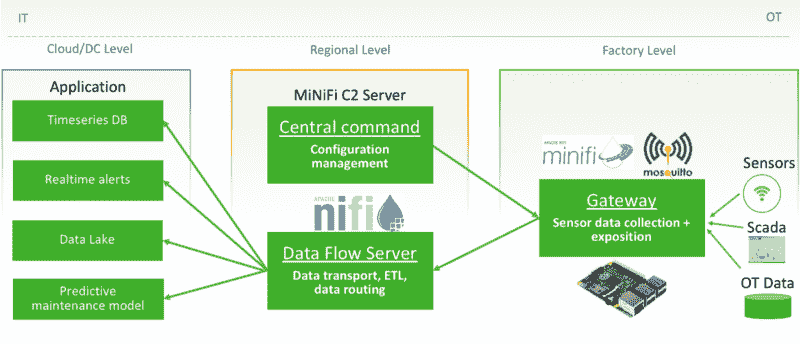

IIoT architecture

**在边缘级别**，传感器收集数字世界的信息，并通过各种有线和无线协议(串行、RS-485、MODBUS、CAN 总线、OPC UA、BLE、WiFi 等)将其发送到网关。在我们的示例中，我们将使用各种传感器(光线、温度、摄像机、加速度计等等)，这些传感器通过 WiFi 向网关发送数据。

**网关**是运行 Mosquitto 代理和 MiNiFi 代理的 Raspberry Pi。[mosquito](https://mosquitto.org/)是一个开源的轻量级消息代理，我们用它通过 MQTT 协议来公开传感器数据。MQTT 占地面积极小，这使得它适合物联网应用和资源受限的硬件，如电话或微控制器。

Apache MiNiFi——Apache NiFi 的子项目——是一个轻量级代理，它实现了 Apache NiFi 的核心特性，侧重于边缘的数据收集。

MiNiFi 的设计目标是:体积小、资源消耗低、代理集中管理、边缘智能。MiNiFi 可以通过站点到站点协议(S2S)与 NiFi 轻松集成，以构建端到端的流量管理解决方案，该解决方案是可扩展的、安全的，并提供信息(出处)的完整监管链。

在我们的系统中，MiNiFi 将订阅 Mosquitto broker 的所有主题，并将每个新消息转发给区域一级的 NiFi。我们也可以使用它来连接到 SCADA 系统或任何其他 OT 数据提供者。

**在地区层面，**我们有两个组成部分:

[Apache NiFi](https://nifi.apache.org/) 是一个强大的数据流平台，拥有 200 多个现成的连接器。由于它的用户界面，设计数据流变得快速和容易。

NiFi 不以权力换取简单。事实上，它是一个高度可扩展的分布式系统，具有有保证的交付、背压和负载分布。这些特性使 NiFi 成为物联网应用的绝佳工具，在这些应用中，网络质量可能具有挑战性。

在我们的系统中，NiFi 扮演着从每个工厂收集数据并将其发送到几个系统和应用程序(HDFS、HBase、卡夫卡、S3 等等)的核心角色。

[MiNiFi C2 服务器(MiNiFi command&Control)](https://cwiki.apache.org/confluence/display/MINIFI/C2+Design+Proposal)是 Apache NiFi 目前正在开发的另一个子项目。它的作用是为野外成百上千的 MiNiFi 代理提供一个中心配置点。C2 服务器管理应用程序的版本类别(MiNiFi 流配置),并通过 Rest API 公开它们。MiNiFi 代理可以以定义的频率连接到此 API 以更新其配置。

一旦数据到达公司服务器、**云或数据中心**，就有大量的应用程序可以实施。实时监控、过程分析和优化或预测性维护就是几个例子。数据处理和用例实现将在以后的文章中讨论。

### 系统实现

让我们开始构建我们的原型。

#### 准备树莓 Pi: MQTT 和 MiNiFi

要安装 Mosquitto MQTT 代理和 MiNiFi 代理，请在您的 Raspberry Pi 上运行以下命令。

为了具有较小的尺寸，MiNiFi 封装了最少的一组默认处理器。通过在 lib 目录中部署 NAR (NiFi 归档文件),可以添加任何 NiFi 处理器。在下面块的最后一个命令中，我添加了 MQTT 处理器的 NAR。

```
sudo apt-get update#install and run Mosquitto broker on default port 1883sudo apt-get install mosquittomosquitto#install and prepare MiNiFi agentwget http://apache.crihan.fr/dist/nifi/minifi/0.4.0/minifi-0.4.0-bin.tar.gztar -xvf minifi-0.4.0-bin.tar.gzcd minifi-0.4.0#add mqtt processorwget https://github.com/ahadjidj-hw/NiFi/raw/master/nifi-mqtt-nar-1.5.0.nar -P ./lib/
```

默认情况下，配置 MiNiFi 代理需要编辑文件。/conf/config.yml 以包含所用处理器及其配置的列表。配置可以手动编写，或者使用 NiFi UI 设计，并将流导出为模板。模板是一个 XML 文件，我们需要用 [MiNiFi 工具包](https://nifi.apache.org/minifi/minifi-toolkit.html)将它转换成 YML 文件。这里有一个[配置文件](https://github.com/apache/nifi-minifi/blob/master/minifi-bootstrap/src/test/resources/config.yml)的例子，它跟踪一个文件，并通过 S2S 将每一行发送到远程 NiFi。

对于我们的项目，我们不会使用这些手动步骤。由于许多 MiNiFi 代理在地理上分散的工厂上运行，因此不可能在每次需要更改配置时手动停止、编辑 config.yml，然后重新启动每个代理。

MiNiFi 使用一个*“Change Ingestor”*通知代理潜在的新配置。可变电阻器是可插拔模块，目前 OOTB 支持三种电阻器:

*   文件更改存储
*   RestChangeIngestor
*   PullHttpChangeIngestor

我们将使用 PullHttpChangeIngestor 每隔一段时间查询一次 C2 服务器，并下载任何可用的新配置。要配置此吸入器，请编辑文件。/conf/bootstrap.conf，取消对相应行的注释，并将 ingestor 属性设置如下:

```
nifi.minifi.notifier.ingestors=org.apache.nifi.minifi.bootstrap.configuration.ingestors.PullHttpChangeIngestor
```

```
# Hostname on which to pull configurations from
```

```
nifi.minifi.notifier.ingestors.pull.http.hostname=c2-server
```

```
# Port on which to pull configurations from
```

```
nifi.minifi.notifier.ingestors.pull.http.port=10080
```

```
# Path to pull configurations from
```

```
nifi.minifi.notifier.ingestors.pull.http.path=/c2/config
```

```
# Query string to pull configurations with
```

```
nifi.minifi.notifier.ingestors.pull.http.query=class=iot-minifi-raspberry-agent
```

```
# Period on which to pull configurations from, defaults to 5 minutes if commented out
```

```
nifi.minifi.notifier.ingestors.pull.http.period.ms=60000
```

使用这种配置，每个 MiNiFi 代理将每 1 分钟查询位于[http://C2-Server:10080/C2/config](http://nifi-dev:10080/c2/config)的 C2 服务器 REST API，并请求“iot-minifi-raspberry-agent”类的最新配置。

注意:1 分钟的频率仅用于演示目的。你不会如此频繁地更新你的代理。

现在不要启动您的代理，让我们转到区域级别并配置 MiNiFi C2 服务器和 NiFi。

#### 安装和配置迷你 C2 服务器

在可从 MiNiFi 代理访问的公共服务器上安装 MiNiFi C2 服务器。您可以将分层 C2 部署用于网络受限的应用程序，如下面几行所述。运行以下命令安装 C2 服务器:

```
wget http://apache.crihan.fr/dist/nifi/minifi/0.4.0/minifi-c2-0.4.0-bin.tar.gztar -xvf minifi-c2-0.4.0-bin.tar.gzcd minifi-c2-0.4.0
```

C2 服务器通过按类组织的 REST API 公开 MiNiFi 应用程序。C2 支持可插拔的“配置提供程序”,目前支持:

*   **CacheConfigurationProvider，** which 查看文件系统或 S3 上的目录
*   **DelegatingConfigurationProvider，**委托给另一个 C2 服务器，以允许分层的 C2 结构
*   **NiFiRestConfigurationProvider，**，它通过 REST API 从 NiFi 实例中提取模板

将 C2 服务器配置为使用 NiFi 作为配置提供者。编辑文件。/conf/minifi-c2-context.xml 并提供 nifi 服务器地址 [http://nifi-dev:8080](http://nifi-dev:8080)

#### 安装和配置 NiFi 服务器

在可以从 C2 服务器访问的服务器上安装 NiFi 并运行它。

```
wget http://apache.crihan.fr/dist/nifi/1.6.0/nifi-1.6.0-bin.tar.gztar -xvf nifi-1.6.0-bin.tar.gzcd nifi-1.6.0./bin/nifi.sh start
```

让我们连接到位于[http://NiFi-dev:8080/NiFi/](http://nifi-dev:8080/nifi/)的 NiFi UI，并创建将在 MiNiFi 代理中运行的流。但在此之前，在根画布上添加一个输入端口，并将其命名为“from Raspberry MiNiFi”。这是 NiFi 从 MiNiFi 接收流文件的地方。

添加一个 consumeMQTT 处理器订阅 Mosquitto broker，订阅 *iot/sensors* 下的所有话题。注意，这里的 tcp://raspberrypi:1883 等价于 tcp://localhost:1883，因为这个流将在 raspberrypi 上运行。

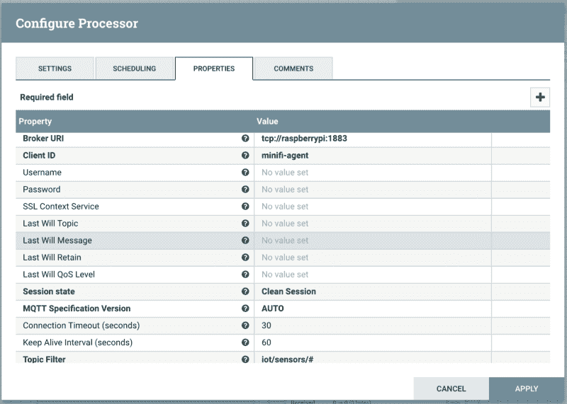

使用 UpdateAttribute 处理器添加一个 *"version"* 属性，我们将使用它来显示重新配置特性。您可以添加任何想要的属性:时间戳、代理名称、位置等等。

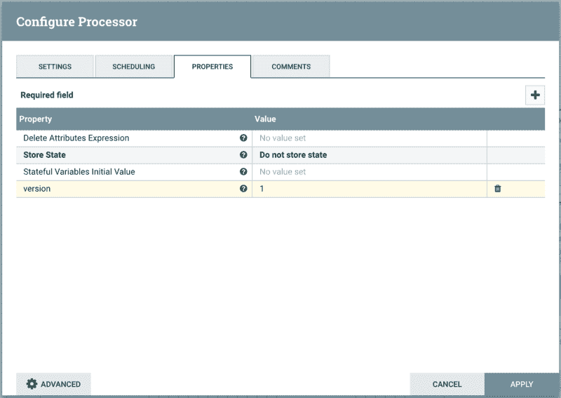

最后，添加一个远程进程组(RPG ),将消费的事件发送给 NiFi。连接这三个处理器。

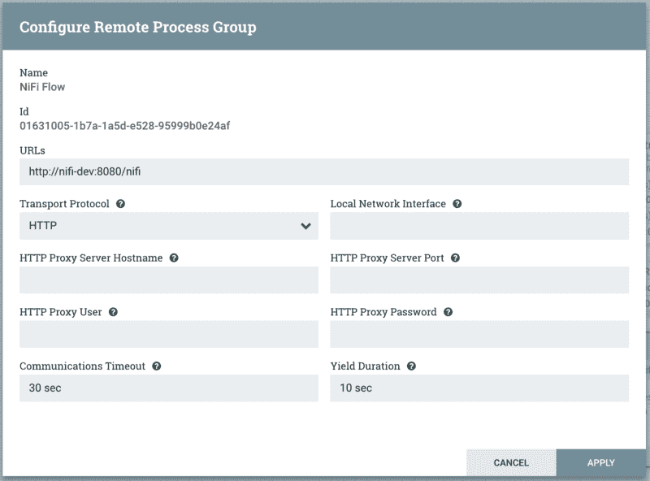

您的流程现在看起来像下面的截图。左边的流将在 NiFi 中运行，以接收来自 MiNiFi 的数据。这里的正确流程仅用于设计，将有效地在每个 Raspberry Pi 上运行。

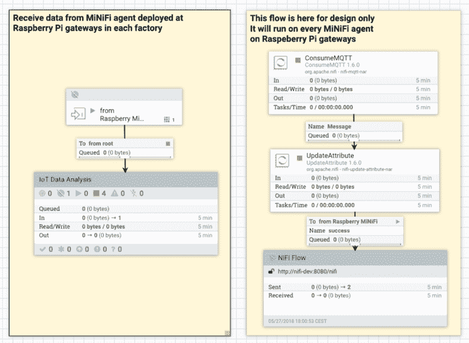

将右流另存为模板，命名为“iot-minifi-raspberry-agent.v1”。这里的命名约定非常重要。我们必须使用与 MiNiFi 引导配置中使用的类名相同的名称。

### 部署并启动应用程序

在 Raspberry Pi 上启动 MiNiFi 代理之前，让我们看看 C2 服务器是否配置良好。在您的网络浏览器中打开以下 URL:[http://C2-server:10080/C2/config？class = IOT-minifi-raspberry-agent&版本=1](http://c2-server:10080/c2/config?class=iot-minifi-raspberry-agent&version=1) 。C2 服务器回复了一个包含我们构建的模板配置的文件，格式为 YML。太好了。

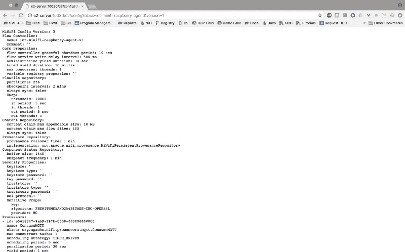

Results of C2 Rest API call

如果查看 C2 日志，可以看到服务器收到了一个带有参数{ class =[IOT-minifi-raspberry-agent]，version=[1]}的查询

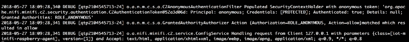

C2 server logs after the Rest API call

现在，架构的不同组件(MQTT、MiNiFi、NiFi 和 C2)之间的通信正常工作了，使用以下命令在 Raspberry Pi 上启动 MiNiFi 代理:

```
./bin/minifi.sh start
```

几秒钟后，您会看到以下 C2 服务器日志。主机 192.168.1.50(这是树莓 Pi 的 IP 地址)请求 C2 服务器给它最新版本的类“iot-minifi-raspberry-agent”。与我们之前通过网络浏览器进行的通话相比，您会注意到 MiNiFi 代理没有指定版本。如果您现在在打开 MiNiFi 代理配置。/conf/config.yml 您将找到与我们从 C2 Rest API 中检索到的相同的 conf 文件。

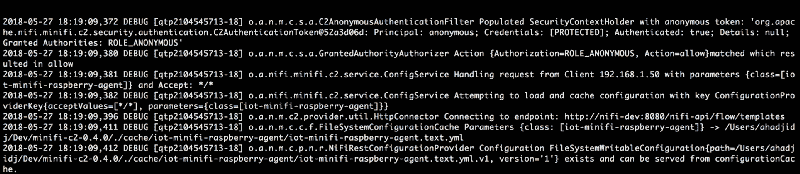

C2 Server logs

此外，MQTT 显示 MiNiFi 代理连接到代理并订阅了主题 iot/sensors/#

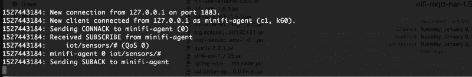

MQTT Logs after MiNiFi agent start

完美！IIoT 系统运行良好。现在让我们启动传感器来生成数据并在 MQTT 中发布。然后，MiNiFi 将开始消费数据并将其发送给 NiFi，如下图所示，我们已经收到了 196 条消息。

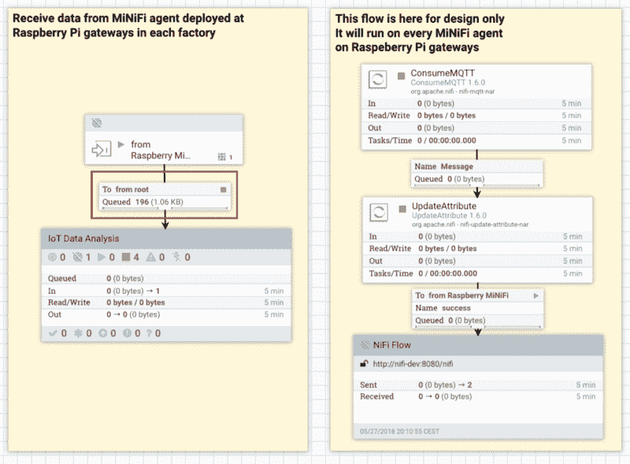

现在让我们用 NiFi 的起源特性来检查其中一条消息。该数据来自光传感器*“IOT/sensors/light intensity/z”*，应用版本为 1。

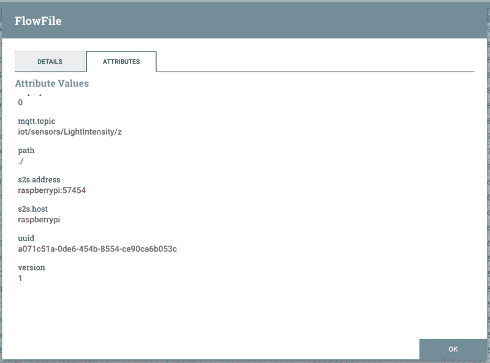

### 自动热重新部署

现在，我们的 IIoT 正在运行，数据从每个工厂流向我们的数据中心，让我们部署一个新的应用程序。对于我们的测试，我们将对我们的 MiNiFi 代理配置做一个小的修改。转到 NiFi web UI 并编辑 updateAttribute 处理器。将“版本”属性设置为 2 而不是 1，并将流保存在新模板“iot-minifi-raspberry-agent.v2”中。仅此而已！新应用程序将自动部署。

你可以看到下面的 C2 服务器日志显示，一个新版本的 V2 被发现。C2 服务器的缓存中没有该版本，并开始下载和转换过程。

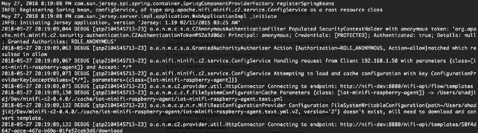

C2 Server reaction to a new template

然后，MiNiFi 代理检测新配置，备份以前的配置，部署新配置，然后重新启动。


现在让我们看看来自代理的数据。在下面的出处 UI 中可以看到，这个数据来自一个陀螺仪，有一个应用版本 2。

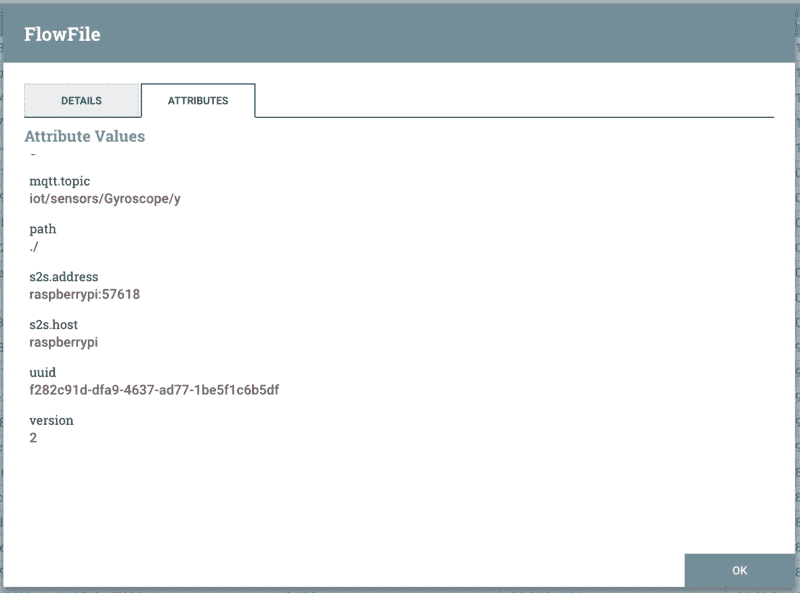

### 结论

Apache NiFi 及其生态系统(MiNiFi 和 C2 服务器)是端到端物联网数据管理的强大工具。它可用于轻松快速地构建具有灵活架构和高级功能(自动热部署、数据来源、背压等)的高级物联网应用。

在以后的文章中，我将向您展示如何使用这些数据、保护平台以及实现高级边缘处理场景。同时，您可以阅读[这篇文章](https://medium.com/@abdelkrim.hadjidj/best-practices-for-using-apache-nifi-in-real-world-projects-3-takeaways-1fe6912101db)了解跨国汽车制造商雷诺如何在 IIoT 项目中使用 Apache NiFi，以及他们采用了哪些最佳实践。

感谢阅读。一如既往，欢迎反馈和建议。

如果你觉得这篇文章很有用，请给它一些掌声，并关注我以获取更多大数据和物联网文章！

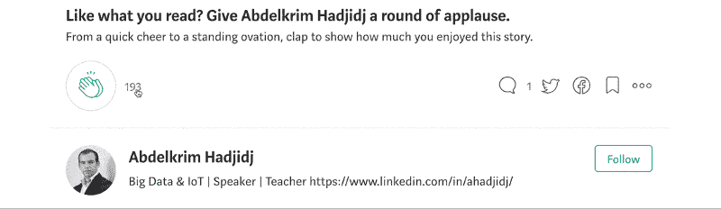

Claps and subscription