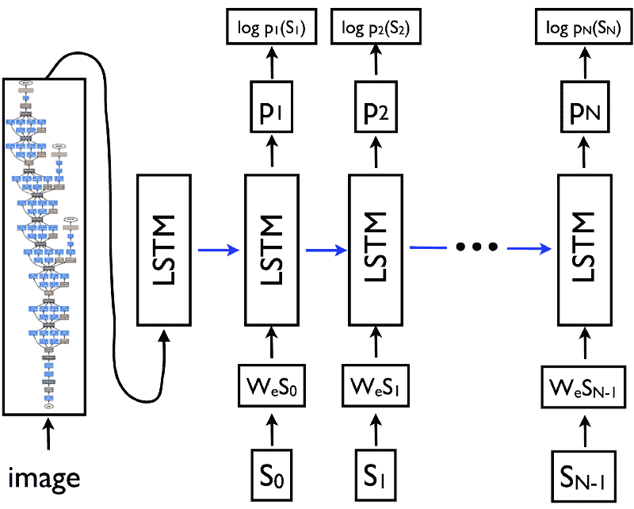
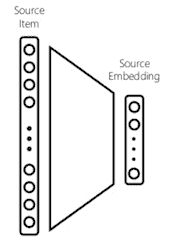
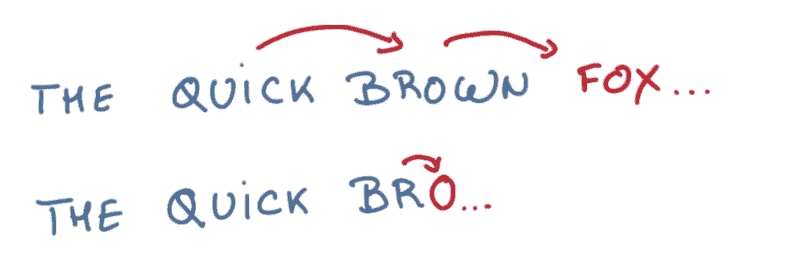
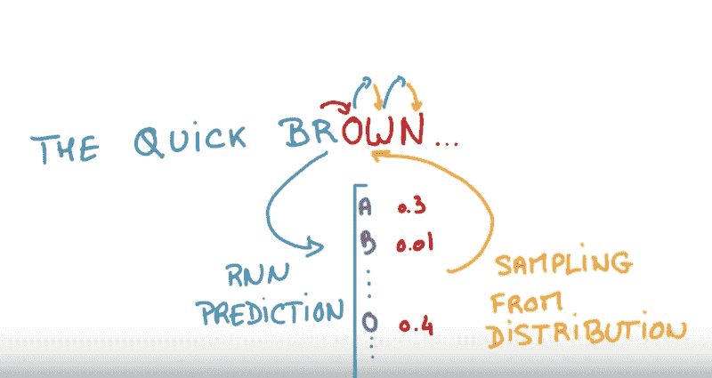
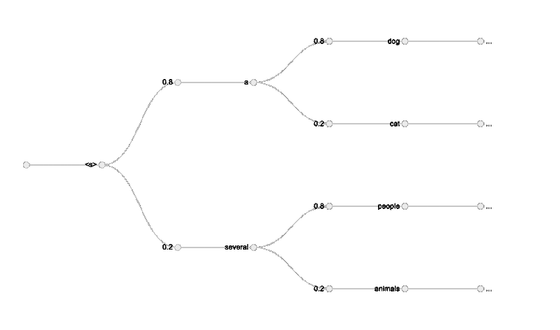
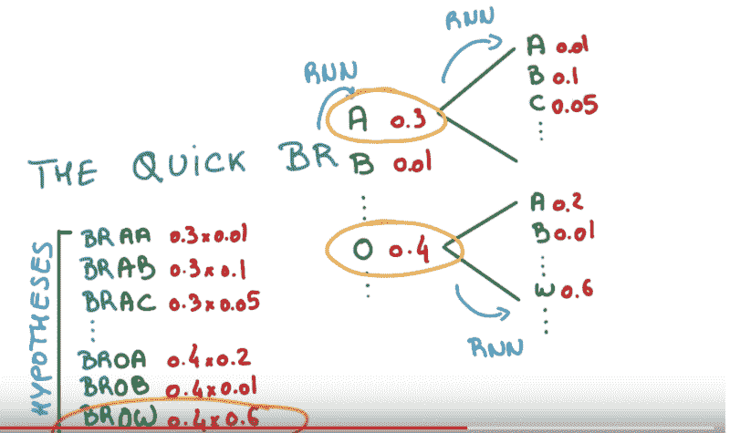
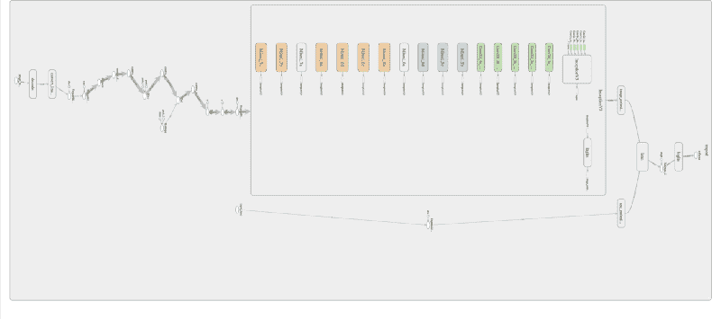

# 在 Tensorflow 中构建深度学习的图像字幕生成器

> 原文：<https://www.freecodecamp.org/news/building-an-image-caption-generator-with-deep-learning-in-tensorflow-a142722e9b1f/>

科尔·默里

# 在 Tensorflow 中构建深度学习的图像字幕生成器


Generated Caption: A reader successfully completing this tutorial

在我的[上一篇教程](https://hackernoon.com/building-a-facial-recognition-pipeline-with-deep-learning-in-tensorflow-66e7645015b8)中，你学习了如何用卷积神经网络在 Tensorflow 中创建面部识别管道。在本教程中，您将了解如何将**卷积神经网络** (CNN)和**长短期记忆** (LSTM)结合起来，创建一个图像字幕生成器，并为您自己的图像生成字幕。

### 概观

*   图像字幕模型架构介绍
*   作为搜索问题的字幕
*   在 Tensorflow 中创建标题

#### 先决条件

*   卷积神经网络的基本理解
*   对 LSTM 的基本了解
*   对张量流的基本理解

### 图像字幕模型架构介绍

#### CNN 和 LSTM 的结合

2014 年，谷歌的研究人员发布了一篇论文，[展示和讲述:一个神经图像字幕生成器](https://arxiv.org/pdf/1411.4555.pdf)。当时，这种架构在 MSCOCO 数据集上是最先进的。它利用 CNN + LSTM 获取图像作为输入并输出字幕。



A CNN-LSTM Image Caption Architecture [source](https://arxiv.org/pdf/1411.4555.pdf)

#### 使用 CNN 进行图像嵌入

卷积神经网络可用于创建密集的特征向量。这种密集向量也称为嵌入，可以用作其他算法或网络的特征输入。

对于图像标题模型，这种嵌入成为图像的密集表示，并将被用作 LSTM 的初始状态。



Mapping input to embedding [source](https://www.slideshare.net/BhaskarMitra3/vectorland-brief-notes-from-using-text-embeddings-for-search)

#### LSTM

LSTM 是一种递归神经网络架构，通常用于具有时间依赖性的问题。它成功地能够捕获关于先前状态的信息，以通过其存储单元状态更好地通知当前预测。

LSTM 由三个主要部分组成:遗忘门、输入门和输出门。这些门中的每一个都负责改变细胞记忆状态的更新。


An unrolled LSTM [source](https://colah.github.io/posts/2015-08-Understanding-LSTMs/)

为了更深入地了解 LSTM，请访问克里斯·奥拉的帖子。

#### **以图像为初始状态的预测**

在句子语言模型中，LSTM 预测句子中的下一个单词。类似地，在字符语言模型中，给定先前看到的字符的上下文，LSTM 试图预测下一个字符。



Sentence and character model predictions [source](https://www.youtube.com/watch?v=UXW6Cs82UKo)

在图像标题模型中，您将创建图像的嵌入。然后，该嵌入将作为初始状态被馈入 LSTM。这成为语言模型的第一个先前状态，影响下一个预测单词。

在每个时间步长，LSTM 考虑前一个单元状态，并输出序列中最可能的下一个值的预测。重复该过程，直到结束标记被采样，表示字幕结束。



Sampling characters from an LSTM. [source](https://www.youtube.com/watch?v=UXW6Cs82UKo)

### **作为搜索问题的字幕**

生成标题可以看作是一个图搜索问题。在这里，节点是单词。边是从一个节点移动到另一个节点的概率。寻找最佳路径包括最大化句子的总概率。

采样并选择最可能的下一个值是一种产生字幕的[贪婪](https://en.wikipedia.org/wiki/Greedy_algorithm)方法。这在计算上是高效的，但是会导致次优的结果。

给定所有可能的单词，计算所有可能的句子并确定最佳句子在计算上/空间上都是不高效的。这排除了使用诸如深度优先搜索或宽度优先搜索的搜索算法来寻找最佳路径。



[source](http://blog.murraycole.com/wp-content/uploads/2018/04/sentence_explore_graph.png.png)

#### **光束搜索**

波束搜索是一种广度优先的搜索算法，探索最有希望的节点。它生成所有可能的下一条路径，每次迭代只保留前 N 个最佳候选路径。

由于要扩展的节点数量是固定的，所以该算法是空间高效的，并且比最佳优先搜索允许更多的潜在候选。



Beam search for building a sentence. [source](https://www.youtube.com/watch?v=UXW6Cs82UKo)

### 回顾

到目前为止，您已经学习了如何创建一个模型架构，在给定一幅图像的情况下生成一个句子。这是通过利用 CNN 来创建密集嵌入并将其作为初始状态馈送给 LSTM 来实现的。此外，您还学习了如何使用波束搜索生成更好的句子。

在下一节中，您将学习从 Tensorflow 中预先训练的模型生成标题。

### 在 Tensorflow 中创建标题

```
# Project Structure
```

```
├── Dockerfile├── bin│ └── download_model.py├── etc│ ├── show-and-tell-2M.zip│ ├── show-and-tell.pb│ └── word_counts.txt├── imgs│ └── trading_floor.jpg├── medium_show_and_tell_caption_generator│ ├── __init__.py│ ├── caption_generator.py│ ├── inference.py│ ├── model.py│ └── vocabulary.py└── requirements.txt
```

#### 环境设置

这里，您将使用 **Docker** 来安装 **Tensorflow** 。

Docker 是一个简化部署的容器平台。它解决了在不同的服务器环境中安装软件依赖关系的问题。如果你是 Docker 新手，可以在这里阅读更多[。要安装 Docker，请运行:](https://www.docker.com/)

```
curl https://get.docker.com | sh
```

安装 Docker 后，您将创建两个文件。一个用于 Python 依赖的 **requirements.txt** 和一个用于创建 Docker 环境的**Docker 文件**。

要构建这个映像，请运行:

```
$ docker build -t colemurray/medium-show-and-tell-caption-generator -f Dockerfile .
```

```
# On MBP, ~ 3mins# Image can be pulled from dockerhub below
```

如果您想避免从源代码构建，可以使用以下命令从 dockerhub 中提取图像:

```
docker pull colemurray/medium-show-and-tell-caption-generator # Recommended
```

#### 下载模型



Show and Tell Inference Architecture [source](http://blog.murraycole.com/wp-content/uploads/2018/04/show_and_tell_inception_expanded.png)

下面，您将下载模型图和预先训练的重量。这些权重来自对 2MM 迭代的 [MSCOCO 数据集](http://cocodataset.org/#home)的训练会话。

要下载，请运行:

```
docker run -e PYTHONPATH=$PYTHONPATH:/opt/app -v $PWD:/opt/app \-it colemurray/medium-show-and-tell-caption-generator \python3 /opt/app/bin/download_model.py \--model-dir /opt/app/etc
```

接下来，创建一个模型类。这个类负责加载图形，创建图像嵌入，并在模型上运行推理步骤。

#### **下载词汇**

训练 LSTM 时，标准做法是对输入进行标记化。对于句子模型，这意味着将每个唯一的单词映射到一个唯一的数字 id。这允许模型利用 softmax 分类器进行预测。

下面，您将下载用于预训练模型的词汇表，并创建一个类来将其加载到内存中。这里，行号表示令牌的数字 id。

```
# File structure# token num_of_occurrances
```

```
# on 213612# of 202290# the 196219# in 182598
```

```
curl -o etc/word_counts.txt https://raw.githubusercontent.com/ColeMurray/medium-show-and-tell-caption-generator/master/etc/word_counts.txt
```

为了将这个词汇表存储在内存中，您将创建一个负责将单词映射到 id 的类。

#### 创建字幕生成器

要生成标题，首先要创建一个标题生成器。这个字幕生成器利用波束搜索来提高生成的句子的质量。

在每次迭代中，生成器传递 LSTM 的前一状态(初始状态是图像嵌入)和前一序列，以生成下一个 softmax 向量。

前 N 个最可能的候选者被保留并在下一个推断步骤中使用。这个过程一直持续到达到最大句子长度或者所有句子都生成了句子结束标记。

接下来，您将加载展示和讲述模型，并使用它和上面的标题生成器来创建候选句子。这些句子将与它们的对数概率一起打印出来。

#### 结果

要生成标题，您需要向脚本传递一个或多个图像。

```
docker run -v $PWD:/opt/app \-e PYTHONPATH=$PYTHONPATH:/opt/app \-it colemurray/medium-show-and-tell-caption-generator  \python3 /opt/app/medium_show_and_tell_caption_generator/inference.py \--model_path /opt/app/etc/show-and-tell.pb \--input_files /opt/app/imgs/trading_floor.jpg \--vocab_file /opt/app/etc/word_counts.txt
```

您应该会看到输出:

```
Captions for image trading_floor.jpg: 0) a group of people sitting at tables in a room . (p=0.000306) 1) a group of people sitting around a table with laptops . (p=0.000140) 2) a group of people sitting at a table with laptops . (p=0.000069)
```


Generated Caption: a group of people sitting around a table with laptops

### 结论

在本教程中，您学习了:

*   如何将卷积神经网络和 LSTM 结合起来为图像生成字幕
*   如何利用波束搜索算法考虑多个字幕并选择最可能的句子。

此处完成代码[。](https://github.com/ColeMurray/medium-show-and-tell-caption-generator)

**接下来的步骤**:

*   试着用你自己的图像
*   阅读[展示和讲述文件](https://arxiv.org/abs/1411.4555)
*   创建一个 API 来提供字幕

### 行动号召:

如果你喜欢这个教程，请关注并推荐！

有兴趣了解更多关于深度学习/机器学习的知识吗？查看我的其他教程:

- [在 Tensorflow 中用深度学习构建面部识别管道](https://hackernoon.com/building-a-facial-recognition-pipeline-with-deep-learning-in-tensorflow-66e7645015b8)

[-深度学习 CNN 的 Tensorflow 与 GPU](https://medium.com/p/cba6efe0acc2)

[-在谷歌计算引擎上使用 Keras 进行深度学习](https://medium.com/google-cloud/keras-inception-v3-on-google-compute-engine-a54918b0058)

[-在谷歌计算引擎上使用 Apache Spark 的推荐系统](https://medium.com/google-cloud/recommendation-systems-with-spark-on-google-dataproc-bbb276c0dafd)

你可以在其他地方找到我:

——推特:[https://twitter.com/_ColeMurray](https://twitter.com/_ColeMurray)