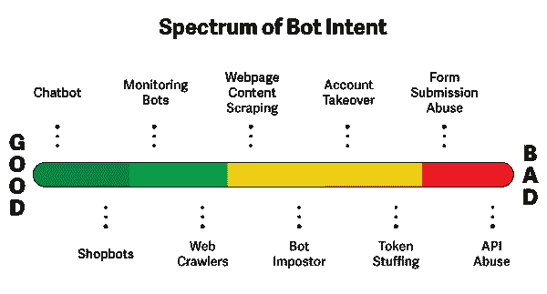

# 如何建立一个机器人并自动化你的日常工作

> 原文：<https://www.freecodecamp.org/news/building-bots/>

大多数工作都有重复的任务，你可以自动完成，这样可以节省一些宝贵的时间。这使得自动化成为一项需要掌握的关键技能。

一小组熟练的自动化工程师和领域专家可能能够自动化整个团队的许多最乏味的任务。

在本文中，我们将使用 Python——一种强大且易于学习的编程语言——探索工作流自动化的基础。我们将使用 Python 编写一个简单而有用的小自动化脚本，它将清理给定的文件夹，并将每个文件放入相应的文件夹中。

我们的目标不是一开始就写出完美的代码或创建理想的架构。
我们也不会建造任何“非法”的东西。相反，我们将看看如何创建一个脚本，自动清理一个给定的文件夹及其所有文件。

# 目录

1.  [自动化领域以及从哪里开始](#areas-of-automation-and-where-to-start)
    *   简单自动化
    *   公共 API 自动化
    *   API 逆向工程
2.  [自动化的伦理考量](#ethical-considerations)
3.  [创建目录清理脚本](#creating-a-directory-clean-up-script)
4.  [机器人创建和自动化日常工作的完整指南](#a-complete-guide-to-bot-creation-and-automating-your-everyday-work)

## 自动化领域和起点

让我们从定义什么样的自动化开始。

自动化的艺术适用于大多数部门。对于初学者来说，它有助于从一堆文档中提取电子邮件地址，这样你就可以发送电子邮件了。或者更复杂的方法，比如优化大公司内部的工作流程和过程。

当然，从小的个人脚本到取代实际人员的大型自动化基础设施需要一个学习和改进的过程。所以让我们看看你可以从哪里开始你的旅程。

### 简单的自动化

简单的自动化允许快速和直接的入口点。这可以涵盖小的独立过程，如项目清理和目录内文件的重组，或者工作流的一部分，如自动调整已保存文件的大小。

### 公共 API 自动化

公共 API 自动化是最常见的自动化形式，因为如今我们可以使用对 API 的 HTTP 请求来访问大多数功能。比如你想让家里自制的智能花园自动浇水。

要做到这一点，你需要检查当天的天气，看看你是否需要浇水，或者是否有降雨。

### API 逆向工程

基于 API 逆向工程的自动化在实际的机器人和下面“道德考虑”部分的图表中的“机器人冒名顶替者”部分更常见。

通过对 API 进行逆向工程，我们了解了应用程序的用户流。一个例子可以是登录在线浏览器游戏。

通过理解登录和认证过程，我们可以用自己的脚本复制这种行为。然后我们可以创建自己的接口来使用应用程序，即使他们自己没有提供。

无论你的目标是什么，都要考虑它是否合法。

你不想给自己惹麻烦，是吗？？

## 道德考量

GitHub 上的某个人曾经联系过我，告诉我:

> "喜欢和参与是数字货币，而你正在让它们贬值."

这一直困扰着我，并让我质疑我为这一目的开发的工具。

事实上，这些互动和参与可以自动化和“伪造”越来越多，导致一个扭曲和破碎的社交媒体系统。

如果不使用机器人和其他参与系统，那些产生有价值的好内容的人对其他用户和广告公司来说是不可见的。我的一个朋友想到了下面这个与但丁的“九层地狱”有关的联想，随着你越来越接近成为一个有社会影响力的人，你会越来越意识不到整个系统实际上是多么的破碎。

我想在这里与大家分享，因为我认为这是我在 InstaPy 上与有影响力的人积极合作时所目睹的极其准确的表现。

**第一关:冷宫-** 如果你根本不玩机器人
**第二关:调情** -当你手动喜欢并追随尽可能多的人，让他们追随你回来/ 喜欢你的帖子
**第三级:阴谋** -当你加入一个电报群来喜欢并评论 10 张照片，这样接下来的 10 个人就会喜欢并评论你的照片
**第四级:不忠** -当你使用一个低成本的虚拟助手来喜欢并代表你关注
**第五级:情欲-** 当你使用一个机器人来给予喜欢时， 并且不要收到任何喜欢作为回报(但你不为此付费)
**第 6 级:滥交——**当你用一个机器人给 50+个喜欢来获得 50+个喜欢，但你不为此付费——例如一个 Chrome 扩展
**第 7 级:贪婪或极度贪婪**——当你用一个机器人在 200–700 张照片之间点赞/关注/评论时， 忽视被封禁的机会
**第 8 级:卖淫**——当你付钱给一个不知名的第三方服务来为你进行自动的互惠点赞/关注，但他们使用你的账户来点赞/关注
**第 9 级:欺诈/异端**——当你购买关注者和点赞，并试图把自己作为一个有影响力的人卖给品牌

社交媒体上的 bot 级别如此普遍，以至于**如果你不 bot，你将被困在第一级，中间状态**，没有追随者增长，相对于你的同龄人来说参与度较低。

在经济理论中，这被称为囚徒困境和零和游戏。如果我不跳而你跳，你就赢了。如果你不 bot，我 bot，我赢了。如果没有人僵尸，所有人都赢了。但是由于没有激励每个人不去 bot，每个人都 bot，所以没有人赢。

> 意识到这一点，永远不要忘记这整个工具对社交媒体的影响。



Source: SignalSciences.com

我们想避免处理道德问题，仍然致力于自动化项目。这就是为什么我们会创建一个简单的目录清理脚本来帮助你整理杂乱的文件夹。

## 创建目录清理脚本

我们现在想看一个非常简单的脚本。它会根据文件扩展名将这些文件移动到相应的文件夹中，从而自动清理给定的目录。

所以我们想做的是:


### 设置参数解析器

因为我们正在处理操作系统的功能，比如移动文件，所以我们需要导入`os`库。除此之外，我们想给用户一些控制什么文件夹被清理。为此，我们将使用`argparse`库。

```
import os
import argparse
```

导入两个库之后，让我们首先设置参数解析器。确保为每个添加的参数提供描述和帮助文本，以便在用户键入`--help`时提供有价值的帮助。

我们的论点将被命名为`--path`。名称前面的双破折号告诉库这是一个可选参数。默认情况下，我们希望使用当前目录，因此将默认值设置为`"."`。

```
parser = argparse.ArgumentParser(
    description="Clean up directory and put files into according folders."
)

parser.add_argument(
    "--path",
    type=str,
    default=".",
    help="Directory path of the to be cleaned directory",
)

# parse the arguments given by the user and extract the path
args = parser.parse_args()
path = args.path

print(f"Cleaning up directory {path}")
```

这已经完成了参数解析部分——它非常简单易读，对吗？

让我们执行脚本并检查错误。

```
python directory_clean.py --path ./test 

=> Cleaning up directory ./test
```

一旦执行，我们可以看到目录名被打印到控制台，完美。
现在让我们使用`os`库来获取给定路径的文件。

### 从文件夹中获取文件列表

通过使用`os.listdir(path)`方法并为其提供一个有效的路径，我们获得了该目录中所有文件和文件夹的列表。

在列出文件夹中的所有元素后，我们想要区分文件和文件夹，因为我们不想清理文件夹，只清理文件。

在这种情况下，我们使用 Python list comprehension 遍历所有元素，如果它们满足作为文件或文件夹的给定要求，就将它们放入新的列表中。

```
# get all files from given directory
dir_content = os.listdir(path)

# create a relative path from the path to the file and the document name
path_dir_content = [os.path.join(path, doc) for doc in dir_content]

# filter our directory content into a documents and folders list
docs = [doc for doc in path_dir_content if os.path.isfile(doc)]
folders = [folder for folder in path_dir_content if os.path.isdir(folder)]

# counter to keep track of amount of moved files 
# and list of already created folders to avoid multiple creations
moved = 0
created_folders = []

print(f"Cleaning up {len(docs)} of {len(dir_content)} elements.")
```

一如既往，让我们确保我们的用户得到反馈。因此，添加一个 print 语句，向用户指示将移动多少文件。

```
python directory_clean.py --path ./test 

=> Cleaning up directory ./test
=> Cleaning up 60 of 60 elements.
```

重新执行 python 脚本后，我们现在可以看到我创建的`/test`文件夹包含 60 个将要移动的文件。

### 为每个文件扩展名创建一个文件夹

下一步也是更重要的一步是为每个文件扩展名创建一个文件夹。我们想这样做，通过检查我们所有的过滤文件，如果他们有一个扩展名，没有文件夹，创建一个。

`os`库帮助我们实现更好的功能，比如分割给定文档的文件类型和路径，提取路径本身和文档名称。

```
# go through all files and move them into according folders
for doc in docs:
    # separte name from file extension
    full_doc_path, filetype = os.path.splitext(doc)
    doc_path = os.path.dirname(full_doc_path)
    doc_name = os.path.basename(full_doc_path)

	print(filetype)
    print(full_doc_path)
    print(doc_path)
    print(doc_name)

    break
```

上面代码末尾的 break 语句确保了如果我们的目录包含几十个文件，我们的终端不会收到垃圾邮件。

设置好之后，让我们执行我们的脚本来查看类似如下的输出:

```
python directory_clean.py --path ./test 

=> ...
=> .pdf
=> ./test/test17
=> ./test
=> test17
```

我们现在可以看到，上面的实现分离了文件类型，然后从完整路径中提取部分内容。

既然我们现在有了 filetype，我们可以检查是否已经存在具有该类型名称的文件夹。

在此之前，我们要确保跳过一些文件。如果我们使用当前目录`"."`作为路径，我们需要避免移动 python 脚本本身。一个简单的 if 条件可以解决这个问题。

除此之外，我们不想移动[隐藏文件](https://www.lifewire.com/what-is-a-hidden-file-2625898)，所以让我们也包括所有以点开始的文件。macOS 上的`.DS_Store`文件就是一个隐藏文件的例子。

```
 # skip this file when it is in the directory
    if doc_name == "directory_clean" or doc_name.startswith('.'):
        continue

    # get the subfolder name and create folder if not exist
    subfolder_path = os.path.join(path, filetype[1:].lower())

    if subfolder_path not in folders:
    	# create the folder
```

一旦我们处理了 python 脚本和隐藏文件，我们现在可以继续在系统上创建文件夹。

除了检查之外，如果当我们读取目录的内容时，文件夹已经存在，那么在开始时，我们需要一种方法来跟踪我们已经创建的文件夹。这就是我们宣布`created_folders = []`名单的原因。它将作为内存来跟踪文件夹的名称。

为了创建一个新文件夹，`os`库提供了一个名为`os.mkdir(folder_path)`的方法，该方法采用一个路径并在那里创建一个具有给定名称的文件夹。

这个方法可能会抛出一个异常，告诉我们这个文件夹已经存在。所以我们也要确保捕捉到这个错误。

```
if subfolder_path not in folders and subfolder_path not in created_folders:
        try:
            os.mkdir(subfolder_path)
            created_folders.append(subfolder_path)
            print(f"Folder {subfolder_path} created.")
        except FileExistsError as err:
            print(f"Folder already exists at {subfolder_path}... {err}")
```

在设置了文件夹创建之后，让我们重新执行我们的脚本。

```
python directory_clean.py --path ./test 

=> ...
=> Folder ./test/pdf created.
```

在第一次运行时，我们可以看到一个日志列表，告诉我们已经创建了具有给定文件扩展名类型的文件夹。

### 将每个文件移动到正确的子文件夹中

现在的最后一步是将文件移动到新的父文件夹中。

使用操作系统操作时需要理解的一件重要事情是，有时操作是无法撤消的。例如，删除就是这种情况。因此，首先只记录我们的脚本在执行时会实现的行为是有意义的。

这就是为什么在这里对`os.rename(...)`方法进行了注释。

```
# get the new folder path and move the file
    new_doc_path = os.path.join(subfolder_path, doc_name) + filetype
    # os.rename(doc, new_doc_path)
    moved += 1

    print(f"Moved file {doc} to {new_doc_path}")
```

在执行了我们的脚本并看到正确的日志记录之后，我们现在可以删除我们的`os.rename()`方法之前的注释散列，并对它进行最后一次尝试。

```
# get the new folder path and move the file
    new_doc_path = os.path.join(subfolder_path, doc_name) + filetype
    os.rename(doc, new_doc_path)
    moved += 1

    print(f"Moved file {doc} to {new_doc_path}")

print(f"Renamed {moved} of {len(docs)} files.")
```

```
python directory_clean.py --path ./test 

=> ...
=> Moved file ./test/test17.pdf to ./test/pdf/test17.pdf
=> ...
=> Renamed 60 of 60 files.
```

这个最后的执行将会把所有的文件移动到它们相应的文件夹中，我们的目录将会被很好的清理，而不需要手动操作。

在下一步中，我们现在可以使用我们上面创建的脚本，例如，安排它在每周一执行，以清理我们的 Downloads 文件夹，获得更多的结构。

**这正是我们在[我们的机器人创建和工作流自动化 Udemy 课程](https://www.udemy.com/course/the-complete-guide-to-bot-creation/)中创建的后续内容。**

## [机器人创建和自动化日常工作的完整指南](https://www.udemy.com/course/the-complete-guide-to-bot-creation/)

费利克斯和我制作了一个**在线视频课程，教你如何根据我们在制作 **InstaPy** 和他的 **Travian-Bot** 中所学的知识来创建自己的机器人**。事实上，他**甚至因为太有效而被强制取下。**

### [立即加入并开始学习](https://www.udemy.com/course/the-complete-guide-to-bot-creation/)。

[https://www.youtube.com/embed/zw20WBPjsr0?feature=oembed](https://www.youtube.com/embed/zw20WBPjsr0?feature=oembed)

Promo Video for Udemy Course

如果您有任何问题或反馈，请随时通过 [Twitter](https://twitter.com/timigrossmann) 或直接在课程的[讨论部分联系我们？](https://www.udemy.com/course/the-complete-guide-to-bot-creation/)