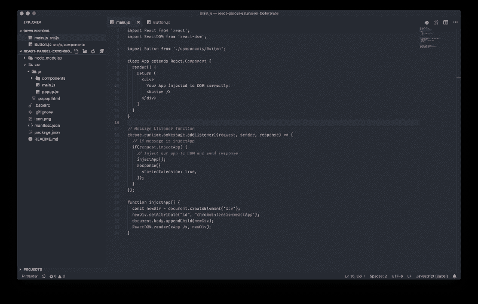
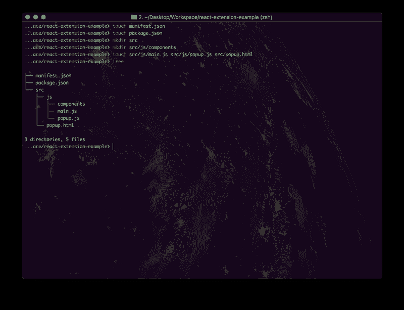
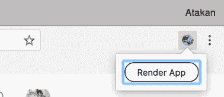
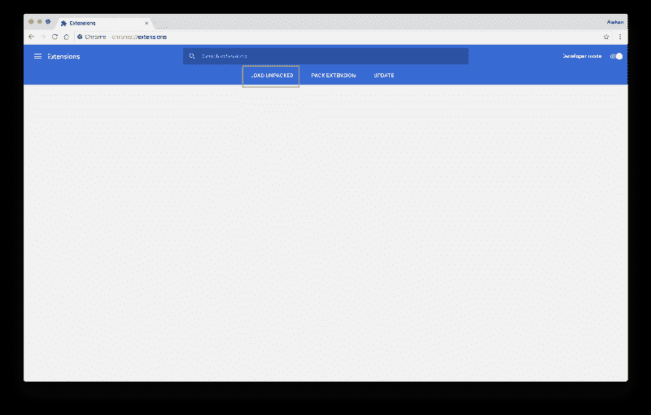
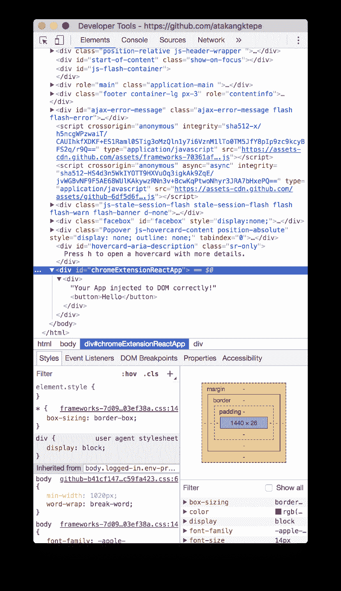

# 如何用 React + Parcel 构建 Chrome 扩展

> 原文：<https://www.freecodecamp.org/news/building-chrome-extensions-in-react-parcel-79d0240dd58f/>

作者:阿塔坎·戈克泰佩

# 如何用 React + Parcel 构建 Chrome 扩展


Thanks to [Umut](https://github.com/partyconfetti) for Hero Image

这个月，我开始开发我的新产品。它有助于将任何网站转换成 JSON、XML、CSV 或任何其他格式。我写了自己的 Chrome 扩展来指向网站中的字段。

大多数文章都展示了如何在弹出窗口中呈现它。在本文中，我们将直接在内容中呈现我们的应用程序(使用[内容脚本](https://developer.chrome.com/apps/content_scripts))。我将向您展示如何使用 ReactJS 和 package 从头开始编写 chrome 扩展。我假设你对 JavaScript 有基本的了解。

> **注:**如果不想看这篇文章，只想开始编码，可以在最后找到 Git repo。

#### 场景

当用户单击弹出窗口中的渲染元素按钮时，我们需要在访问的网站上渲染我们的应用程序。

那么，我们开始吧。

### 我们的项目会是什么样子



A finished version of a project

```
├── icon.png
├── manifest.json
├── node_modules
├── .babelrc
├── package.json
└── src
    ├── build 
    │   └── main.js [We will use that build file as content script]
    ├── js [Where our development file is stored]
    │   ├── components [We are storing components in this folder]
    │   │   └── Header.js
    │   ├── main.js [Our main file, that renders our app]
    │   └── popup.js [Our javascript file for popup]
    └── popup.html [Our html file for rendering popup after clicking the icon in the bar]
```

### 步骤 1:创建项目文件

首先，创建`manifest.json`，因为我们需要这个文件来提供关于 Chrome 扩展的信息。

每个扩展都有一个 **JSON** 格式的清单文件，名为`manifest.json`，它提供了诸如名称、版本和权限等重要信息。

这是它的样子:

```
{
  "manifest_version": 2,

  "name": "Name of your chrome extension",
  "description": "Description of your chrome extension.",
  "version": "1.0",

  "browser_action": {
    "default_icon": "icon.png",
    "default_popup": "src/popup.html"
  },

  "permissions": [
    "activeTab",
    "tabs"
  ],

  "content_scripts": [
    {
      "matches": ["http://*/*", "https://*/*"],
      "js": ["src/build/main.js"]
    }
  ]
}
```

manifest.json

创建清单文件后，我们需要配置我们的项目环境和结构。

让我们开始创建项目结构——打开您的终端，按照我的步骤操作！

#### 步骤 2:创建 package.json

如您所见，有两个脚本`build`和`watch`

*   命令监视您的`main.js`并编译是否有变化或者依赖项是否从`main.js`导入。
*   `build`命令将你的文件构建到`src/build/main.js`文件中。

```
{
  "name": "extension-name",
  "version": "0.1.0",
  "description": "Description",
  "main": "src/js/main.js",
  "scripts": {
    "build": "parcel build src/js/main.js -d src/build/ -o main.js",
    "watch": "parcel watch src/js/main.js -d src/build/ -o main.js"
  },
  "author": "Atakan Goktepe",
  "dependencies": {
    "babel-preset-env": "^1.6.1",
    "babel-preset-react": "^6.24.1",
    "parcel-bundler": "^1.6.2",
    "react": "^16.2.0",
    "react-dom": "^16.2.0"
  }
}
```

package.json

#### 步骤 3:创建文件和文件夹

*   创建源文件夹

```
mkdir src
```

*   在`src`文件夹中创建一个组件文件夹

```
mkdir src/js/components
```

*   创建`main.js`、`popup.js`和`popup.html`文件

```
touch src/js/main.js src/js/popup.js src/popup.html
```



Project Structure

#### 步骤 4:编写弹出窗口



Popup

当用户点击扩展的图标时，弹出窗口出现在 Chrome 工具栏的顶部。

当弹出窗口中出现`startApp`消息时，React 应用程序将在内容中呈现。弹出窗口将与应用程序共享一条`startApp`消息。

用以下 HTML 编辑您的`popup.html`文件:

```
<!doctype html>
<!--
 This page is shown when the extension button is clicked, because the
 "browser_action" field in manifest.json contains the "default_popup" key with
 value "popup.html".
 -->
<html>
  <head>
    <title>Getting Started Extension's Popup</title>
    <style type="text/css">
      body {
        margin: 10px;
        white-space: nowrap;
      }

      #container {
        align-items: center;
        display: flex;
        justify-content: space-between;
      }

      .start {
        border: 1px solid #000;
        border-radius: 15px;
        padding: 5px 15px;
        cursor: pointer;
      }
    </style>

    <script src="js/popup.js"></script>
  </head>

  <body>
    <div id="container">
     <!--
      Render react app in the visited website when the .start button is clicked.
     -->
      <button class="start">
        Render App
      </button>
    </div>
  </body>
</html>
```

popup.html

在弹出菜单中有一个按钮，当用户被点击时，它向我们的`main.js`文件发送一条消息。

用以下代码编辑您的`popup.js`文件:

```
window.onload = () => {
  const $startButton = document.querySelector('.start');

  $startButton.onclick = () => {
    // Get active tab
    chrome.tabs.query({
      active: true,
      currentWindow: true,
    }, (tabs) => {
      // Send message to script file
      chrome.tabs.sendMessage(
        tabs[0].id,
        { injectApp: true },
        response => window.close()
      );
    });
  };
}
```

popup.js

方法与监听器共享消息。我们的听众在`main.js`工作。

#### 步骤 5:渲染 React 应用程序

此时，`main.js`应该监听来自`popup.js`的消息。

我们可以用`chrome.runtime.onMessage.addListener`方法监听消息。下面是我们的`main.js`文件的样子:

```
import React from 'react';
import ReactDOM from 'react-dom';

class App extends React.Component {
  render() {
    return (
      <div> Your App injected to DOM correctly! </div>
    )
  }
}

// Message Listener function
chrome.runtime.onMessage.addListener((request, sender, response) => {
  // If message is injectApp
  if(request.injectApp) {
    // Inject our app to DOM and send response
    injectApp();
    response({
      startedExtension: true,
    });
  }
});

function injectApp() {
  const newDiv = document.createElement("div");
  newDiv.setAttribute("id", "chromeExtensionReactApp");
  document.body.appendChild(newDiv);
  ReactDOM.render(<App />, newDiv);
}
```

main.js

#### 让我们看看我们在`main.js`中做了什么:

1.  导入的 React 和 ReactDOM 库。
2.  创建了一个用于呈现 React 元素的 App 类。
3.  增加了一个事件监听器功能，用于监听来自`popup.js`的消息
4.  创建了一个创建 div 的`injectApp`函数，并将其注入到一个 body 中。我们在里面渲染了我们的`<App` / >组件。

### 测试它

要测试您的扩展:

*   如果您没有构建您的文件，那么通过运行`npm run build`命令来构建它们
*   转到“chrome://extensions”
*   检查“开发者模式”切换器
*   点击“加载解压缩”按钮，然后选择您的项目文件夹。



哇哦！您已经为 Google Chrome 创建了一个扩展。你真棒！



Your extension rendered!

打开你的开发者工具，看看主体的末端——你的元素成功渲染了！

### 源代码

这是最后的回购:

[**atakangktepe/react-parcel-extension-boilerplate**](https://github.com/atakangktepe/react-parcel-extension-boilerplate)
[*react-Parcel-extension-boilerplate-一个用 ReactJS 和 Parcel 构建的 Chrome 扩展样板(在内容中渲染…*github.com](https://github.com/atakangktepe/react-parcel-extension-boilerplate)

### 搞定了。

感谢您阅读本教程。这是我的第一篇英文文章！如果已经有帮助，请点击拍手键推荐？或者(更好)分享一下。？？

在 [Twitter](https://twitter.com/GoktepeAtakan) 和 [Github](https://github.com/atakangktepe) 上关注我！