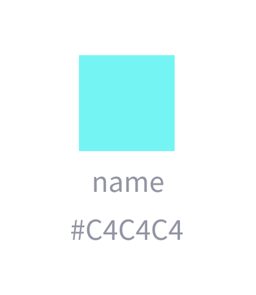
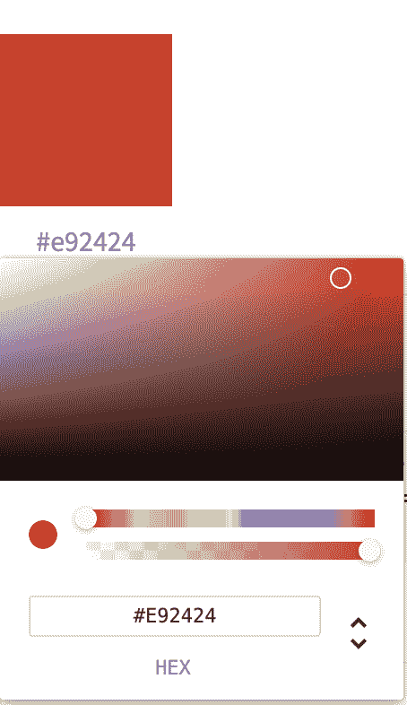
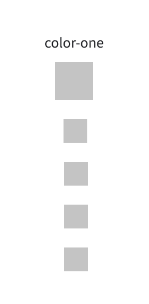
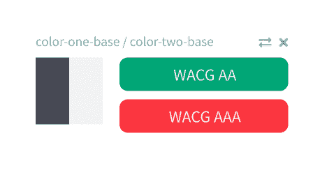

# 使用 React Spring 和 Tinycolor 构建丰富多彩、富有弹性的组件

> 原文：<https://www.freecodecamp.org/news/building-colorful-springy-components-using-react-spring-and-tinycolor/>

最近，我决定构建一个 web 应用程序来允许设计者和开发者生成颜色的变体并检查颜色的可访问性。在这篇文章中，我想给你演示一下我是如何构建我将在那个应用中使用的一些组件的。

该应用程序的完整源代码可以在本文末尾找到，还有一个链接，指向一个包含所有描述组件的 Storybook 实例。

## 属国

为了帮助我构建这些组件，我使用了 [Tinycolor](https://github.com/bgrins/TinyColor) ，这是一个具有一系列颜色实用函数的库，您可以使用它来操作、转换和表示颜色。

我也使用过 [React Spring](https://www.react-spring.io/) ，这是一个基于 Spring 物理学的库，允许你非常容易地将动画添加到你的项目中。

## 彩色瓷砖



Color Tile Designs

我们列表中最简单的组件，色块将作为其他组件的构建块。这个组件的职责是显示一种颜色，以及它的名称和十六进制值。

```
const TILE_SIZES = {
  sm: "2.5rem",
  md: "4rem",
  lg: "6rem"
};

const ColorTile = ({
  color,
  name,
  hideName,
  hideHex,
  size,
  className,
  customTileStyle,
  ...otherProps
}) => {
  const containerClass = cx(styles.container, className);

  const tileClass = cx(styles.tile, {
    "margin-bottom--xxs": !hideName || !hideHex
  });
  const dimension = TILE_SIZES[size];
  const tileStyle = {
    "--color-tile-width": dimension,
    "--color-tile-height": dimension,
    "--color-tile-bg": color,
    "--color-tile-border-color": "transparent",
    ...customTileStyle
  };
  const tile = <div style={tileStyle} className={tileClass} />;

  const nameClass = cx("text--colors-grey-lighten-30", {
    "margin-bottom--xxs": !hideHex
  });

  const hex = useMemo(() => tinycolor(color).toHexString(), [color]);
  return (
    <div className={containerClass} {...otherProps}>
      {tile}
      {!hideName && <small className={nameClass}>{name}</small>}
      {!hideHex && (
        <small className="text--colors-grey-lighten-30">{hex}</small>
      )}
    </div>
  );
};

ColorTile.propTypes = {
  /**
   * Color to display
   */
  color: PropTypes.string.isRequired,
  /**
   * Name of the color
   */
  name: PropTypes.string,
  /**
   * Hide the name text if true
   */
  hideName: PropTypes.bool,
  /**
   * Hide the hex color value display if true
   */
  hideHex: PropTypes.bool,
  /**
   * Size of the tile
   */
  size: PropTypes.oneOf(["sm", "md", "lg"]),
  /**
   * Custom styles to apply to the tile element
   */
  customTileStyle: PropTypes.object
};

ColorTile.defaultProps = {
  size: "md",
  hideName: true,
  hideHex: true,
  customTileStyle: {}
};
```

Color Tile Implementation

#### 实施说明

1.  如果你不熟悉优秀的 [classnames](https://www.npmjs.com/package/classnames) 库，第 17 行和第 19 行可能看起来有点奇怪。基本上，类名库允许你连接 CSS 类并有条件地应用于你的元素。
2.  在第 36 行，你可以看到我们计算了传入的颜色的十六进制字符串。因为我们使用 CSS 中直接传递的颜色属性，它可以是任何可接受的 CSS 颜色格式，而不仅仅是十六进制。例如，它可以是 rgba 字符串。这就是 Tinycolor 的用武之地。我们可以给它这些格式中的任何一种，它会返回一个格式良好的十六进制字符串，我们可以将它与我们的图块一起显示。
3.  继续看第 36 行，您可能已经注意到计算十六进制字符串的函数被包装在`useMemo`中。这是因为我们只想在颜色改变时计算这个值。我们可以避免重新计算任何其他道具的变化，这可能会导致重新渲染。我还在学习新的 Hooks API，所以这可能不是最合适的`useMemo`用法，因为它可能不是一个特别昂贵的操作，但我认为这是一个处理它的好方法。你可以在这里了解更多关于`useMemo`功能或者钩子的一般[。](https://reactjs.org/docs/hooks-reference.html#usememo)

```
.tile {
  width: var(--color-tile-width);
  height: var(--color-tile-height);
  background-color: var(--color-tile-bg);
  border: 3px solid var(--color-tile-border-color);
  cursor: pointer;
}

.container {
  display: inline-flex;
  flex-direction: column;
  align-items: center;
}
```

Color Tile Styling

#### 造型说明

我们瓷砖的造型非常简单。我们有瓷砖本身，它的尺寸和颜色来自我们传入的变量。

然后，我们有一个容器来保存图块、颜色名称和十六进制值。这是一个简单的 flex 容器，保持我们的元素对齐。

## 颜色选择器



Color Picker Designs

对于我们的拾色器，我们将重用色块组件，以及来自 [react-color](https://casesandberg.github.io/react-color/) 包的拾色器。

```
import React, { useState } from "react";
import PropTypes from "prop-types";
import { ChromePicker } from "react-color";

import ColorTile from "../ColorTile/ColorTile";

import styles from "./ColorPicker.module.scss";

const ColorPicker = ({ color, onChange, className, tileClassName }) => {
  const [isPickerOpen, setPickerOpen] = useState(false);

  const onSwatchClick = () => {
    setPickerOpen(!isPickerOpen);
  };

  const onColorChange = color => {
    onChange(color.hex);
  };

  return (
    <div className={className}>
      <ColorTile
        color={color}
        onClick={onSwatchClick}
        hideHex={false}
        size="lg"
        className={tileClassName}
      />

      {isPickerOpen && (
        <div className={styles.popover}>
          <div className={styles.cover} onClick={onSwatchClick} />
          <ChromePicker color={color} onChangeComplete={onColorChange} />
        </div>
      )}
    </div>
  );
};

ColorPicker.propTypes = {
  /**
   * Currently selected color value
   */
  color: PropTypes.string,
  /**
   * Callback fn for when the color changes
   */
  onChange: PropTypes.func,
  /**
   * Custom classes to apply to the color tile
   */
  tileClassName: PropTypes.string
};

ColorPicker.defaultProps = {
  onChange: () => {}
};

export default ColorPicker;
```

Color Picker Implementation

#### 实施说明

我们的颜色选择器由一个显示当前所选颜色及其十六进制值的`ColorTile`和一个来自`react-color`库的`ChromePicker`组成，后者实际上允许我们选择一种颜色。

我们有一些状态来控制`ChromePicker`是否可见，还有一个回调函数来让任何使用我们的选择器的组件知道颜色何时改变。`react-color`在颜色变化时提供了很多信息，但是十六进制值对于我的目的来说已经足够了，正如你在第 17 行看到的。

## 颜色列表



Color List Designs

我们的颜色列表组件接受一个颜色列表，并将它们呈现为一个包含颜色块的列表。我们的颜色列表旨在将基色显示为稍大的图块，其余的图块表示基色的变体，显示为较小的图块。我们还允许命名我们的列表，这将用于显示基本颜色的名称。

我们的颜色列表也带来了本演练的“弹性”部分。瓷砖将在进入时使用 React Spring？

```
const ROW_DIRECTION = "row";
const COL_DIRECTION = "col";
const ALL_DIRECTIONS = [ROW_DIRECTION, COL_DIRECTION];

/**
 * Renders a list of colors
 */
const ColorPaletteList = ({
  name,
  colors,
  direction,
  onColorClick,
  onColorDoubleClick,
  animationRef,
  getCustomTileStyle,
  renderTileBy,
  ...otherProps
}) => {
  const headingClass = cx("margin-bottom--xs", {
    "text--align-left": direction === ROW_DIRECTION,
    "text--align-center": direction === COL_DIRECTION
  });

  const containerClass = cx({
    [styles.containerCol]: direction === COL_DIRECTION,
    [styles.containerRow]: direction === ROW_DIRECTION
  });

  const tileClass = cx({
    "margin-bottom--xs": direction === COL_DIRECTION,
    "margin-right--xs": direction === ROW_DIRECTION
  });

  const trailMargin =
    direction === COL_DIRECTION ? "marginBottom" : "marginRight";
  const trails = useTrail(colors.length, {
    from: { [trailMargin]: 20, opacity: 0 },
    to: { [trailMargin]: 0, opacity: 1 },
    ref: animationRef
  });

  return (
    <div {...otherProps}>
      <h4 className={headingClass}>{name || ""}</h4>
      <div className={containerClass}>
        {trails.map((trailProps, idx) => {
          const color = colors[idx];
          const onClick = () => onColorClick(color);
          return (
            <animated.div
              key={`animated-tile-${color.name}-${idx}`}
              style={trailProps}
            >
              {renderTileBy(color, tileClass, onClick, false, false)}
            </animated.div>
          );
        })}
      </div>
    </div>
  );
};

ColorPaletteList.propTypes = {
  /**
   * Name of the list
   */
  name: PropTypes.string,
  /**
   * The list of colors to display
   */
  colors: PropTypes.arrayOf(
    PropTypes.shape({
      color: PropTypes.string,
      name: PropTypes.string,
      isMain: PropTypes.bool
    })
  ).isRequired,
  /**
   * Determines the layout of the tiles
   */
  direction: PropTypes.oneOf(ALL_DIRECTIONS),
  /**
   * Callback for when a color in the list is clicked
   */
  onColorClick: PropTypes.func,
  /**
   * Ref used to hook into the animation
   */
  animationRef: PropTypes.object,
  /**
   * Pass custom styles for a particular color tile
   */
  getCustomTileStyle: PropTypes.func,
  /**
   * Render prop to render the color tile
   */
  renderTileBy: PropTypes.func
};

ColorPaletteList.defaultProps = {
  direction: COL_DIRECTION,
  onColorClick: () => {},
  onColorDoubleClick: () => {},
  getCustomTileStyle: () => ({}),
  renderTileBy: (color, className, onClick, hideName, hideHex) => (
    <ColorTile
      key={color.name}
      color={color.color}
      name={color.name}
      size={color.isMain ? "lg" : "md"}
      className={className}
      onClick={onClick}
      hideName={hideName}
      hideHex={hideHex}
    />
  )
};
```

Color List Implementation

#### 实施说明

1.  在第 34–40 行，你可以看到我们使用`useTrail`实现了 React Spring。你可以在这里阅读更多关于步道的信息。我们将颜色块容器上的边距设为动画，根据列表是列对齐还是行对齐，这可能是右边或底部的边距。
2.  在第 39 行，你可以看到我们传递了一个对动画的引用。这是为了让我们可以传递一个引用到我们的颜色列表来延迟动画。如果我们想从一个父组件中触发一个特定的动画序列，这将是非常有用的。

```
.containerCol {
  display: flex;
  flex-direction: column;
  justify-content: center;
  align-items: center;
}

.containerRow {
  display: flex;
  flex-direction: row;
  align-items: center;
  flex-wrap: wrap;
}
```

Color List Styling

## 颜色对



Color Pair Designs

颜色对组件采用两种颜色，并并排显示它们以及一些可访问性信息。这个想法是，开发者或设计师将颜色配对，以确保它们在用作背景/前景组合时一起工作。

```
const AccessiblePair = ({
  background,
  foreground,
  hideCloseBtn,
  onCloseBtnClick,
  closeBtnIcon,
  ...otherProps
}) => {
  const title = `${background.name}/${foreground.name}`;

  const bgTileStyle = {
    "--tile-color": background.color
  };

  const fgTileStyle = {
    "--tile-color": foreground.color
  };

  const tileContainerClass = cx(styles.tileContainer, "margin-right--sm");
  const titleContainerClass = cx(
    styles.titleContainer,
    "margin-bottom--xxs",
    "text--colors-grey-lighten-30"
  );

  const isAAPass = tinycolor.isReadable(background.color, foreground.color, {
    level: "AA",
    size: "small"
  });
  const isAAAPass = tinycolor.isReadable(background.color, foreground.color, {
    level: "AAA",
    size: "small"
  });

  const aaDisplayText = "WCAG AA";
  const aaaDisplayText = "WCAG AAA";
  const aaPillType = isAAPass ? "success" : "error";
  const aaaPillType = isAAAPass ? "success" : "error";

  const examplePillStyle = {
    "--pill-background": background.color,
    "--pill-color": foreground.color
  };

  return (
    <div {...otherProps}>
      <div className={titleContainerClass}>
        <small className={styles.title}>{title}</small>
        {!hideCloseBtn && (
          <FontAwesomeIcon icon={closeBtnIcon} onClick={onCloseBtnClick} />
        )}
      </div>
      <div className={styles.mainContent}>
        <div className={tileContainerClass}>
          <div style={bgTileStyle} className={styles.tile} />
          <div style={fgTileStyle} className={styles.tile} />
        </div>

        <div className={styles.pillContainer}>
          <Pill type={aaPillType} className="margin-bottom--xxs">
            {aaDisplayText}
          </Pill>
          <Pill type={aaaPillType} className="margin-bottom--xxs">
            {aaaDisplayText}
          </Pill>
          <Pill style={examplePillStyle}>This is how text will look</Pill>
        </div>
      </div>
    </div>
  );
};

AccessiblePair.propTypes = {
  /**
   * The background color
   */
  background: colorShape.isRequired,
  /**
   * The foreground color
   */
  foreground: colorShape.isRequired,
  /**
   * Set to true to hide the close button
   */
  hideCloseBtn: PropTypes.bool,
  /**
   * Callback for when the close button is clicked
   */
  onCloseBtnClick: PropTypes.func,
  /**
   * FontAwesome icon to use for the close button
   */
  closeBtnIcon: PropTypes.string
};

AccessiblePair.defaultProps = {
  hideCloseBtn: false,
  onCloseBtnClick: () => {},
  closeBtnIcon: "times"
};
```

Color Pair Implementation

#### 实施说明

如前所述，我们的颜色对组件采用背景色和前景色，在第 26–33 行，您可以看到我们使用 Tinycolor 来确定颜色对的可访问性。

我们使用一个简单的药丸组件来显示结果，药丸的类型由结果决定。我在这里没有展示药丸的源代码，但是它是一个非常标准的组件，你可以在任何组件库中找到(Bootstrap、Material 等)。

你可以在这里了解更多关于可访问性和 WCAG 的信息[。](https://www.w3.org/WAI/standards-guidelines/wcag/)

## 结论和源代码

我希望你能从这个演练中学到一些东西。我强烈推荐在你的下一个项目中研究我在这里提到的库。特别是，如果没有优秀的 Tinycolor 包，我的应用程序将需要更长的时间来创建。

> *完整应用的源代码可以在[这里](https://github.com/stephan-mclean/project-color)找到。*

> *一个包含所有组件的故事书实例可以在[这里](https://rainbo-components.netlify.com/)找到。*

如果你对设计、代码或其他方面有任何反馈，我很乐意听到。

非常感谢你看我的文章！

*原文发表[此处](https://medium.com/better-programming/building-colorful-springy-components-using-react-spring-and-tinycolor-1086c6594203)。*