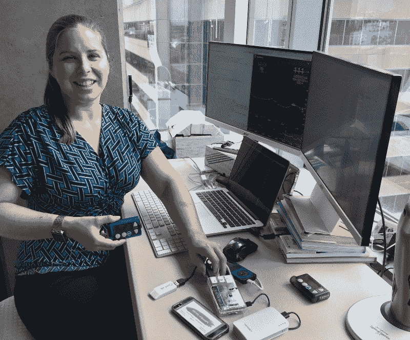
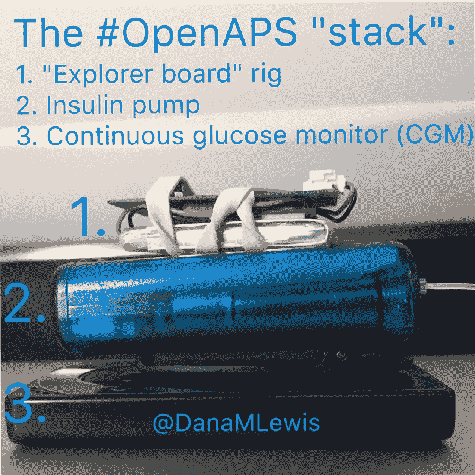
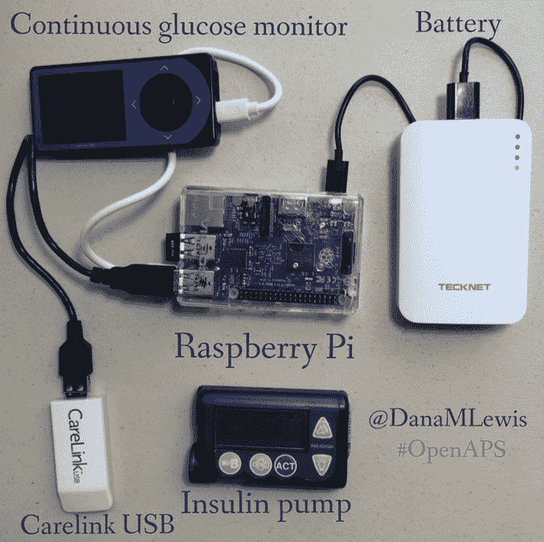

# 构建在线社区:OpenAPS

> 原文：<https://www.freecodecamp.org/news/building-online-communities-openaps-96475c235f7e/>

作者:吉特

[Explore more than 50,000 engineering & science communities on Gitter.](https://gitter.im/explore/tags/curated:frontend)

# 构建在线社区:OpenAPS

Dana Lewis 是 [OpenAPS](https://openaps.org/) (开放式人工胰腺系统)的创始人，这是一个开放透明的努力，旨在使人工胰腺技术广泛应用。

我们采访了她，以了解更多关于她的故事。您可以访问 Gitter 上的 OpenAPS [频道了解更多信息。](https://gitter.im/nightscout/intend-to-bolus)

Dana Lewis and the OpenAPS rig.

你好，黛娜！给我们介绍一下你自己和 OpenAPS 项目。什么是 OpenAPS &背后有什么故事？

# [OpenAPS](http://www.openaps.org/) 是一项开源运动，旨在使人工胰腺技术更广泛、更快地得到应用。“人工胰腺”(也被认为是一种“混合闭环”)使用现有的胰岛素泵和连续葡萄糖监测器为 1 型糖尿病患者自动输送胰岛素。现在，没有商业上可行的选择，所以人们坚持使用“标准疗法”，这意味着自己做所有的剂量计算。当血糖水平一直在变化时，这真的很难做到；晚上人们睡觉的时候真的很难！

我( [@DanaMLewis](http://twitter.com/danamlewis) )自己也患有 1 型糖尿病超过 14 年，知道这有多难。几年前，我不再只是说“哦，我无能为力”来改进我现有的医疗设备，而是开始寻找解决现实生活中问题的变通方法。我首先使用开源代码从我的 CGM 中实时提取数据，并通过将这些数据发送到我的手机来发出更响的警报。(这段开源代码最终演变成了 [Nightscout](http://nightscout.info/) ，这是一个非常棒的远程 CGM 数据监控工具。)

我们的“更响的警报”系统[将](https://diyps.org/2016/05/12/how-i-designed-a-diy-closed-loop-artificial-pancreas/)演变成了一个“[开环](https://diyps.org/2014/02/07/a-diy-artificial-pancreas-system/)系统，其中包含我们随后开发的剂量决定算法。 [Scott](http://twitter.com/scottleibrand) 然后我意识到我们可以利用其他人的开源代码直接向我的胰岛素泵发送命令(加上一个像树莓派和无线电棒这样的小型计算机),最终[创造出一个闭环人工胰腺系统](https://diyps.org/2014/12/15/how-does-a-closed-loop-artificial-pancreas-work-when-you-diy-or-diyps-closed-loop-is-working/)。2014 年 12 月我第一次为自己“闭环”，2015 年 2 月我们[推出了](https://diyps.org/2015/02/07/diyps-openaps/) OpenAPS。我们不能商业分销医疗设备或完整的软件系统，因为这是由美国食品和药物管理局监管的活动；但我们希望找到一种分享知识的方式，这样如果其他人想建立自己的闭环，他们就可以这样做，直到将来有东西可以商业化。这就是我们所做的，也是 OpenAPS 今天存在的原因。

OpenAPS 有许多功能，但请将其视为一个生态系统，您可以将现有的胰岛素泵和 CGM 与其他商用硬件和开源软件配对，以帮助自动化胰岛素输送，从而降低糖尿病日常生活的整体风险。

作为一个团体，你们有什么共同的目标？

我们的主要共同目标是减轻 1 型糖尿病患者的生活负担。糖尿病患者的生活很艰难。不仅仅是身体上，还有情感上。认知负担对整个家庭起着很大的作用，因为无论是抚养患有糖尿病的孩子长大的父母，还是成年人和他们所爱的人，糖尿病都会影响每个人。# WeAreNotWaiting 运动是#OpenAPS 之外的一个更广泛的社区，它说“我们不能为了更好的工具和解决方案等上一年又一年，所以我们将尽一切努力让糖尿病患者今天过得更轻松”。

“向前支付”是另一个共同的目标。我们都在利用其他人捐赠给社区的工具和想法，所以我们都热衷于以任何方式回报这些工具和想法。这可能包括为代码或文档贡献 PRs，或者转身帮助 Gitter 中询问你上周所学内容的人。对于我们中的许多人来说，“向前支付”是我们第一次接触开源。

The OpenAPS Stack

这些天来，你个人最感兴趣的项目相关问题是什么？

OpenAPS 目前全球至少有(n=1)*127+人在使用 DIY 闭环系统。因为这些是(n=1)项工作，每个人都必须构建自己的系统(这也是出于安全原因)，所以需要不断改进和调整 Github 上的设置过程文档。不过，我们已经走了很长一段路。当有人抱怨文档不完美时，我笑着指出，我们最初是用零文档构建第一个闭环的:至少一些不完美的文档比没有要好！然后我们一起努力修改文档。许多人第一次向文档库发出拉请求，这是他们对开源的第一次贡献——但希望不是最后一次！

另一个常见的问题是时间。每个人都在业余时间研究这个，而且我们白天都有工作。因此，我们改进[代码](https://github.com/openaps/oref0/)、[文档](https://github.com/openaps/docs)和[支持其他人](https://gitter.im/nightscout/intend-to-bolus)建立他们自己的系统的集体工作在晚上、周末、清晨和休息时间进行。但是有了一个全球性的社区，通常会有人一直在线，并且能够回答问题，这很好！

自项目开始以来取得了哪些进展，你能分享一些特别成功的故事吗？

Scott 和我建立了我的第一个闭环，然后和 Ben West 一起工作，他建立了 openaps 工具包，让其他人更容易建立他们自己的系统。openaps 工具包本身就是一个巨大的成功，因为它基本上是一个构建模块，任何人都可以用来构建一个从兼容的糖尿病设备中读取数据的系统。

OpenAPS 文档也是一个成功，因为它是一个不断发展的、活生生的文档集，不一定有未来发展的清晰路线图。每当我们添加新的硬件选项或软件工具时，它都会发生变化(这是很常见的)，因此令人印象深刻的是，该文档仍然有用，并且仍然支持人们进行设置。我感到非常自豪的是，这些文档的水平使得以前没有任何技术经验的人可以使用它，并了解他们需要做什么，以便为自己建立一个闭环系统。

**Gitter 上的 OpenAPS 频道主要讨论了哪些问题？**

Gitter 中有许多不同的房间供社区使用，但使用最频繁的房间是大多数 OpenAPS 设置对话发生的房间。我们使用 Gitter 主要是为了那些正在完成安装过程的人，但是我们也用它来主持关于正在添加的新文档的讨论，以及在合并到代码的开发分支之前正在测试和讨论的新特性。

什么因素促成了你所在社区的成功？主要挑战是什么？

OpenAPS 社区的成功是参与者的证明。这包括 Ben 在幕后的[年](https://www.youtube.com/watch?v=n0KUgieLPNw&feature=youtu.be)的工作和对帮助我们许多人了解开源和相关工具的积极支持(包括从一开始就鼓励我们使用 Gitter 和 Github)；敬斯科特孜孜不倦地帮助我(尽管他本人并没有糖尿病！)不仅建立了我的第一个闭环，而且使它成为世界上任何愿意建立自己闭环的人的一个选项；感谢为文档和构建新的硬件和软件工具做出贡献的几十个人。没有这些了不起的人，我们就不会有今天。

一些挑战涉及时间限制。其他原因包括我们在监管的灰色地带工作。从技术上讲，美国食品和药物管理局监管商业销售的医疗设备。在我们的案例中，没有医疗设备被分发，每个做 DIY 的人都在单独构建自己的系统。但是社区中的一些人担心他们会因为自己制造工具来帮助自己控制糖尿病而被起诉。因此，对不必要的诉讼或监管的恐惧本身是个人层面的挑战。

是的，有些挑战是技术性的——尽管我们已经看到[几十个没有技术经验的人努力完成过程](https://diyps.org/2015/04/08/making-and-diying-continued/)并为自己构建系统，但也有几十个人确信自己做不到，也不愿意尝试。但是，由于这不是一个 FDA 批准的系统，自己做的要求将一直存在，所以对于那些不愿意尝试或出于其他良好原因决定这种类型的系统不适合他们的人，他们将不得不等待商业批准的选项变得可用。

根据您的经验，您是否认为开源社区在过去几年中发生了变化和发展？如果有，如何实现？

我只在最近三年左右的时间里参与了开源项目。但我最感激的一件事是我从本、斯科特、[克里斯·汉纳曼](https://github.com/channemann)、[皮特·施瓦姆](http://github.com/ps2)、[奥斯卡·皮尔森](https://github.com/oskarpearson)和[内特·拉克莱夫特](https://github.com/loudnate)等人那里得到的热情支持和合作，他们总是愿意回答问题并分享他们的知识。我发现这种令人敬畏的精神在开源的每个领域都非常普遍，我认为这对开源社区的发展和壮大有很大的影响。

对于想创建一个专注于医疗保健的在线开源社区的人，你有什么建议？

以你的目标为中心。我不认为这是关于建立一个社区，而是支持和领导这个社区，这个社区是从一个共享的项目或目的感中成长起来的。对我们来说，共同的目标是让糖尿病患者的生活更轻松，让所有人更容易获得人工胰腺技术。我也建议使用现有的工具。我们使用(也非常喜欢)Gitter 的原因之一是因为它的准入门槛很低:内容是公开的，所以任何人都可以在准备好加入或提出第一个问题之前观察或潜伏和学习。最好有一个集中的讨论场所，而不是让关键的对话分散在许多渠道。

你还有什么要补充的吗？

对于任何有兴趣了解更多 OpenAPS 的人来说，[阅读 OpenAPS 参考设计](https://openaps.org/reference-design/)是一个很好的起点，其次是[open APS 常见问题](https://openaps.org/frequently-asked-questions/)。如果您对 DIY 糖尿病和开源社区感兴趣，我们很乐意为您介绍它们！欢迎在 dana@OpenAPS.org 给我留言，或者通过 [Gitter](https://gitter.im/nightscout/intend-to-bolus) 联系我们。

**谢谢！**