# 如何在 iOS 上使用 VoiceOver 为每个人构建应用程序

> 原文：<https://www.freecodecamp.org/news/building-products-for-everyone-voiceover-on-ios-accessibility-tutorial-2f5282e943ef/>

作者杰文·N

# 如何在 iOS 上使用 VoiceOver 为每个人构建应用程序

#### 辅助功能入门

总有一些话题人们谈得不够多。有时候，那些话题恰好是最重要的。可访问性就是其中之一。

### 目标

这篇文章讨论了为什么可访问性很重要，以及你如何能够站在 VoiceOver 用户的立场上。

### 介绍

人们有残疾。

很多人都有残疾。

残疾很正常。

残疾不一定是像骨折这样戏剧性的事情。可能是右肩疼痛使我无法进行运动 a。因此，我无法进行运动 a。另一方面，运动 B 与运动 a 一样是有效的肩部运动。并且，对于患有或不患有右肩疼痛的人来说都是可能的。

在美国，六分之一的人有一种或多种残疾。

是的，六分之一。环顾房间。从一数到六。你们中的一个统计上有残疾。

残疾是真实而相关的。

每个人最终都会自然地随着时间而退化。随着时间的推移，大脑、肌肉、眼睛和耳朵的工作方式不同。一切都随着时间而变化。人类也没什么不同。

让我们谈谈为什么可访问性很重要，以及如何开始构建考虑到可访问性的应用程序。

### 为什么要构建一个可访问的应用程序？

#### 好处#1:感觉很棒

做大事的感觉真好。你可以让这个世界比你发现它的时候更好一点。没有什么比像婴儿一样熟睡更好的了，因为你知道你今天已经为这个世界付出了一切，换来了更包容的明天。根据你的意识形态产生积极的影响总是感觉很棒。

#### 好处#2:受众规模

如果您可以通过简单地支持可访问性用户来增加 16.7%的收入，会怎么样？那听起来像是一个非常公平的交易。

如果一家公司每年赚 100，000，000 美元，那么通过实现可访问性功能，他们可以赚 117，000，000 美元。这是通过让更广泛的用户可以使用该应用程序来实现的。

事情是这样的，没有人想被排除在一个伟大的聚会之外。如果你有一个很棒的聚会，你可能会邀请很多很棒的人。如果你有一个很棒的应用程序，你可能也想让很多人体验你的杰作。

说邀请函发出去了。邀请函到达邮箱。受邀者开心地打开邀请函，尖叫着 YES！直冲云霄。

现在让我们来谈谈如何到达你的聚会:每个人都有自己喜欢的交通方式。人们可以乘坐汽车、摩托车、直升机、私人飞机或喷气背包旅行。

现在想象一下，如果你不参加 jetpackers，你的派对会有多悲惨。所以，你决定把喷气背包航线注册到你家。因此，喷气背包现在可以顺道拜访你的队伍了。

多棒啊。你的派对变得更加有趣，jetpackers 也开始享受派对。每个人都赢了。

如果你的应用程序不支持某些使用方式，那么人们可能会发现很难导航你的应用程序。他们会决定完全不使用你的应用。我们可以缓解这种情况，并让喷气包装工上船。

#### 好处 3:构建一个易访问的应用程序很难

关于开发辅助功能的常见抱怨:

*   发展速度慢
*   资源不足
*   “我不知道从哪里开始”的想法

这些都是有根据的观点。

说服你周围的人给你时间和空间在你的应用程序中实现辅助功能是需要努力的。

需要勇气来让 CEO 相信易访问性是值得的。

即使你说服所有人关注可访问性，你可能仍然会留下一页关于下一步该做什么的问题。鉴于可访问性很少被提及的事实，你的研究可能不会像你希望的那样有帮助。

事实是:

> 是的。

> 这很难。

> 但是，努力是好的。

事情是这样的。在你的应用中加入辅助功能是正确的做法。除了做正确的事情之外，添加辅助功能可以帮助你的应用和公司向前迈进，并使自己与众不同。

说出五家关注构建无障碍应用的公司。

我会等…

没错。可能不到五年。

如果构建易访问的应用程序很容易，那么每个人都会这么做，因为它能接触到更多的受众。

但是因为构建可访问的应用程序很难，所以你可以让自己与众不同。你做了大多数人不愿做的事。然而，对一些用户来说，这种影响可能会改变他们的生活。

#### 好处 4:发现你的应用程序的设计缺陷

每个 iOS 设备都有内置的 VoiceOver 功能。VoiceOver 是 iOS 的屏幕阅读器。屏幕阅读器使人们能够听屏幕上的文字。对于用眼睛阅读有困难的人，他们也可以用耳朵吸收信息。

VoiceOver 帮助您发现应用程序设计缺陷。在本文的后面，您将学习如何使用 VoiceOver。

要发现应用程序的设计缺陷，你只需要打开 VoiceOver 来导航应用程序。VoiceOver 功能打开通常意味着用户几乎看不到屏幕上的内容。这意味着你应该能够在没有视觉依赖的情况下导航。

然后，回答以下问题:

*   app 听起来对吗？
*   app 从 A 点到 B 点是否花费太多时间？
*   app 是否只根据声音按时间顺序呈现 UI 和布局？

这些问题可以通过 VoiceOver 明确地暴露出来，可以给你新的设计视角。您可以使用 VoiceOver 来帮助改进应用程序的导航、简单性和组织。

#### 好处 5:用口碑传播你的应用

口口相传是最伟大的信息传播机制之一。曾经想要引起某人的注意吗？最好的方法之一就是做一个介绍。这是因为口碑可以维系很多信任。

想象一下一个叫乔恩·马克的人。他碰巧视力不好。他正在使用不可访问的应用程序 A、不可访问的应用程序 B 和不可访问的应用程序 c。所有这些应用程序碰巧都是为有视觉障碍的人设计的。

乔恩是一个有能力的人。乔恩有朋友。乔恩和他的朋友们正在走向老年。

一天晚上，无障碍应用程序出现了。该应用程序的设计考虑到了广泛的受众。乔恩使用无障碍应用程序。他喜欢它。

Jon 与朋友、家人和同事分享无障碍应用程序。

乔恩对着扩音器说话。易访问的应用程序通过口碑传播。无障碍应用胜出。琼恩和他的人民也赢了。这是一个双赢的局面。

当你的应用程序与众不同时，人们希望分享你的应用程序。人们分享你的应用程序是因为它反映了他们的一些情况。

你的用户很重要，所以让他们觉得自己很重要。

是时候采取行动了。

### 从哪里开始

让我们了解一下您的 VoiceOver 用户可能会如何使用您的应用程序。

我们将在 iOS 上设置 VoiceOver。

#### 在 iOS 上设置 VoiceOver

解锁您的 iOS 设备。

打开**设置** app。

轻击**通用**。

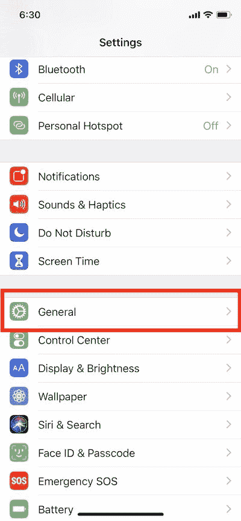

点击**可访问性**。

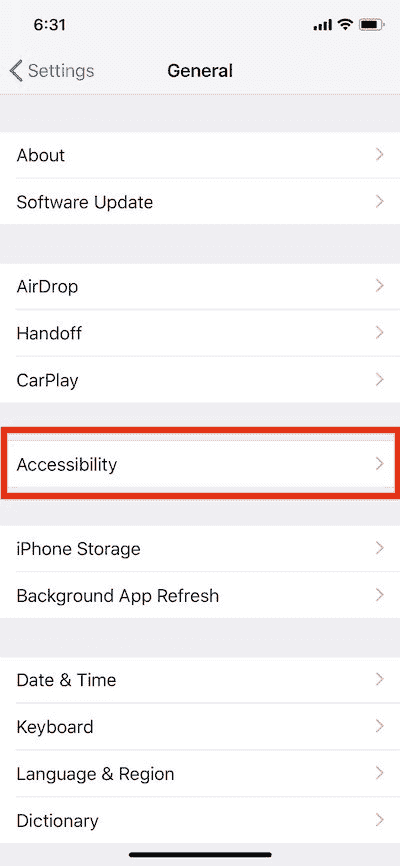

点击**辅助功能快捷方式**。

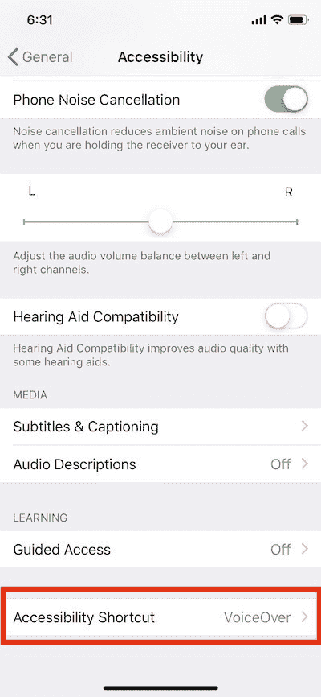

您应该会看到内置辅助功能的列表。

点击**画外音**。

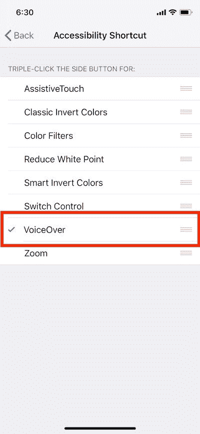

太好了。

现在，从**设置**应用向上滑动进入主页布局。

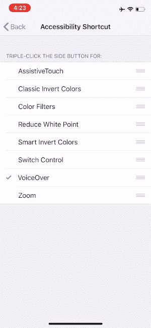

### 使用 VoiceOver 导航 iOS

是时候试试画外音了。以下是使用 VoiceOver 的四种有用手势:

1.向左或向右滑动—导航用户界面

2.双击—选择

3.向上或向下滑动—从可用选项中选择(如果有)

4.轻轻一抖，从底部向上滑动—退出到主页

让我们戴上行动帽。让我们开始使用画外音。

**连按三次**电源按钮。

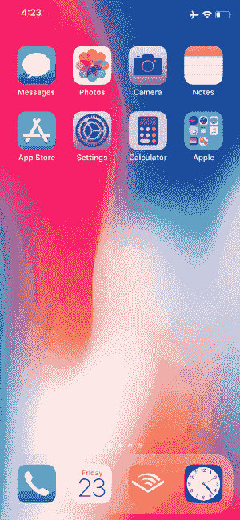

VoiceOver 已打开。

现在，向右滑动，直到选择了**设置**应用。

双击打开**设置**应用。

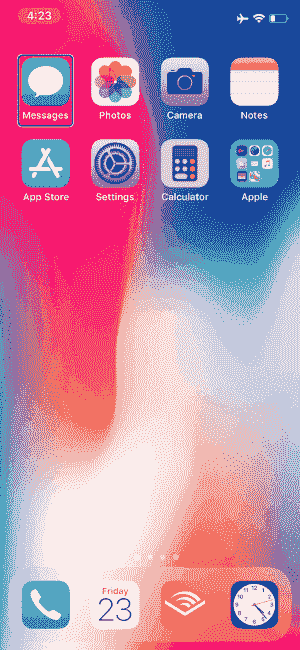

太好了。

现在，向右滑动直到选择**常规**。

双击选择**通用**。

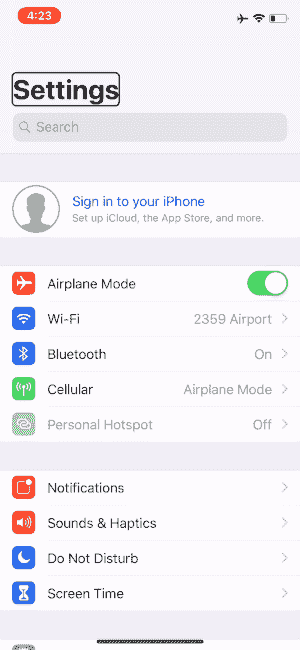

向右滑动，直到选择**辅助功能**。

双击选择**辅助功能**。

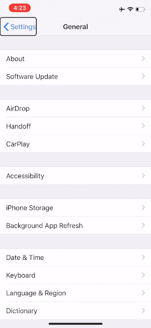

向右滑动，直到选择了 **VoiceOver** 。

双击选择**画外音**。

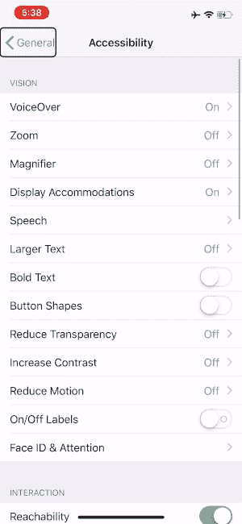

向右滑动，直到选择了**语速**的滑块。

用一个手指快速向上或向下滑动来调整说话速度。

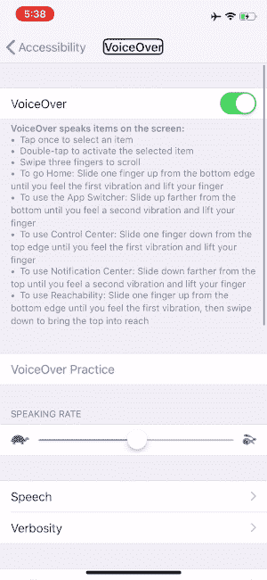

一旦你达到了你想要的语速，只需轻轻一抖就可以从底部向上滑动，退出到主页。

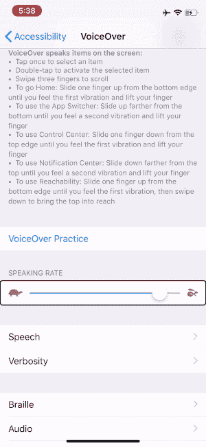

事实证明，画外音非常实用。你几乎可以把 iOS 上的任何东西变成有声读物。

我确实发现自己每天都在使用 VoiceOver 来阅读 iOS 上的文本。这减少了认知负荷。同时，由于阅读和听力的结合，它可以增加理解能力。

你太棒了。你刚刚迈出了最艰难的一步。少有人走过的那一步。第一步。恭喜你，你增强了自己的同情心，并把自己放在更多人的位置上。您将有望开发出更加出色的应用。

### 挑战:蒙住眼睛使用你的应用程序

这里有一个方法来测试你的应用程序的可访问性。

打开 VoiceOver。

三指连击。

这将打开窗帘模式，你的屏幕变成漆黑一片。

现在，打开窗帘模式，使用 VoiceOver 导航您的应用程序。

当你的应用程序在窗帘模式下导航毫不费力时，你就拥有了一个特别容易访问的应用程序。

### 结束语

我相信让应用变得可访问将人类推向正确的方向。为所有用户打造卓越的应用体验是应用开发者和用户的双赢。

我希望看到更多我们喜欢的应用程序完全支持辅助功能。

如果你觉得这篇文章有帮助，请分享这篇文章。

### 特别感谢

感谢 Daud A、Kane C、Esther H、Todd K、Tim C、Tim I、Lilit B、Cliff W 和 Shawn 使这篇文章成为可能。

### 企业解决方案

有兴趣的企业，推荐你[接触 2359 媒体企业解决方案](http://2359media.com/contacts/)。