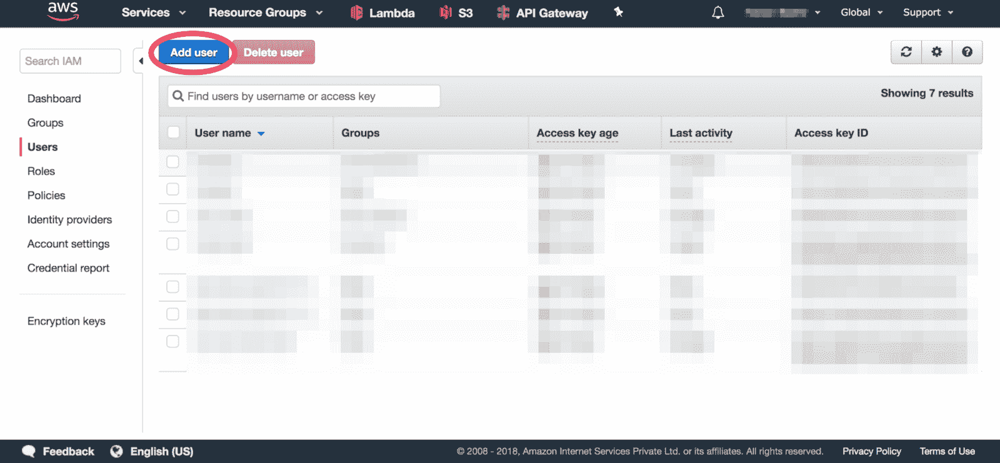
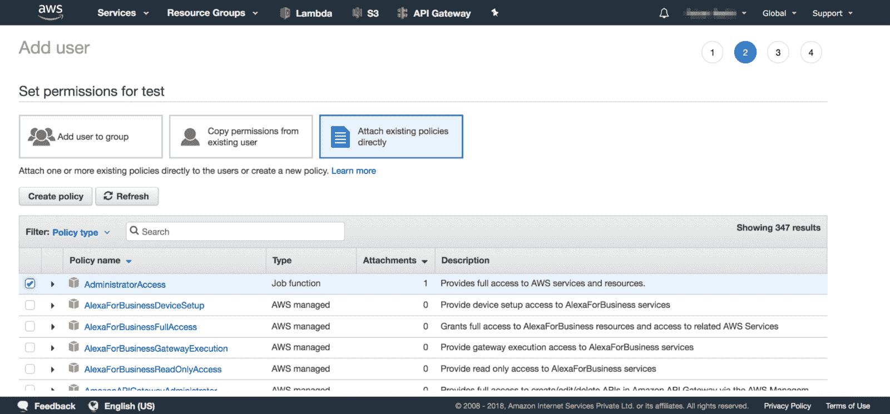
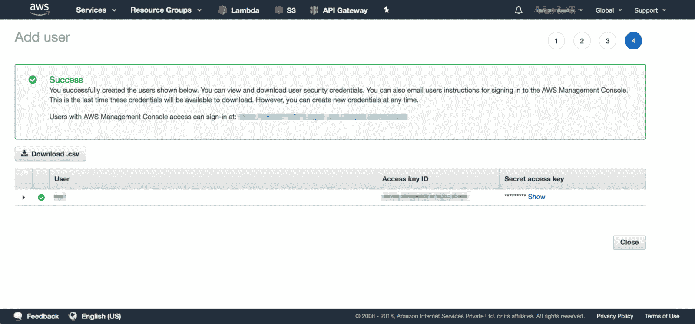
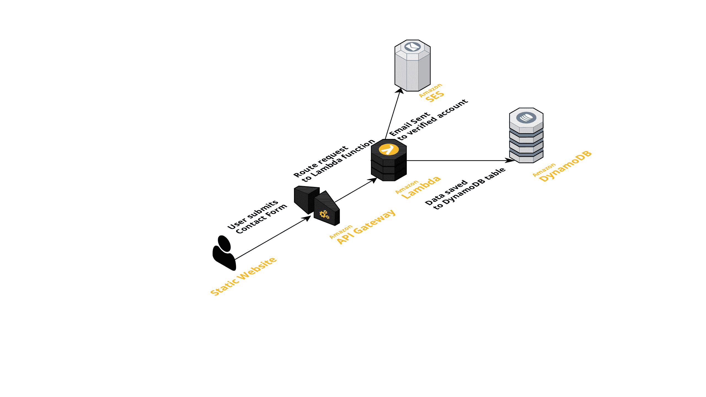
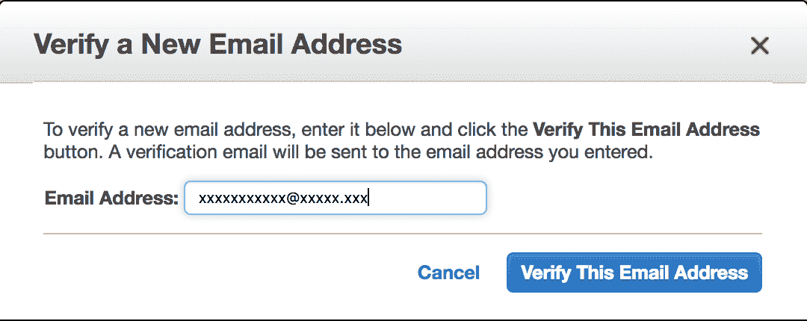
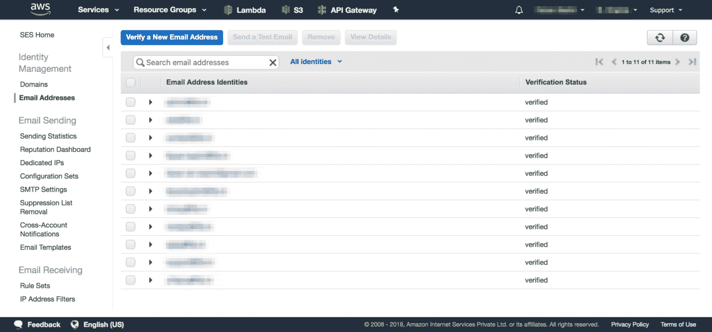
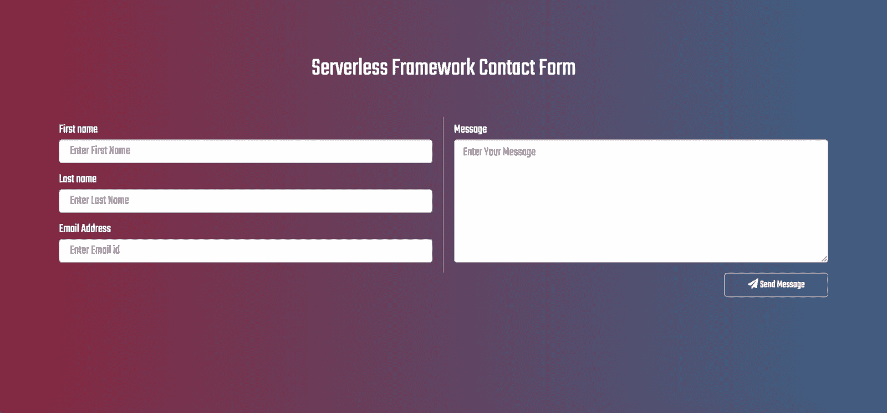

# 为静态网站构建无服务器联系表单

> 原文：<https://www.freecodecamp.org/news/building-serverless-contact-form-for-static-websites/>


Photo by [Caleb George](https://unsplash.com/photos/AtvuPUenaeI?utm_source=unsplash&utm_medium=referral&utm_content=creditCopyText) on [Unsplash](https://unsplash.com/?utm_source=unsplash&utm_medium=referral&utm_content=creditCopyText)

### 介绍

几年前，AWS 推出了静态托管服务 S3，这是静态网站托管的典范转移。技术是非常清楚的，所有的静态资产(HTML、CSS 和 JS)将驻留在一个 S3 桶中来托管你令人印象深刻的网站。一个很酷的想法，我个人很喜欢，真的。如果没有那个超级重要的联系表单，在 S3 上托管会很酷，但是你的联系表单会是一个笑话，除非你有另一个服务器来处理来自那个表单的 AJAX 请求。一旦你准备好了服务，S3 的解决方案就一点也不吸引人了。

在尖端技术时代，总有令人瞠目结舌的创新出现。一项令人惊叹的技术创新恰好是无服务器的。这并不是说不涉及服务器，而是您现在可以不太关心它们了。无服务器可以是一个适当的和可行的解决许多问题的方案，它是最完美的静态托管联系形式的解决方案。坚持读完这篇文章，你将能够以最廉价和最简单的方式处理你的网站表单。

* * *

### 无服务器框架


Source: [https://serverless.com/](https://serverless.com/)

> **无服务器是您部署和操作无服务器架构的工具包。专注于您的应用，而不是您的基础设施。**

> **——【Serverless.com】**

无服务器技术的瑞士军刀。Serverless Framework 是用 Node.js 编写的免费开源 web 框架。Serverless 是第一个专门为在 AWS Lambda 上构建应用程序而开发的框架，AWS Lambda 是 Amazon Web Services 提供的无服务器计算平台。目前，使用无服务器框架开发的应用程序可以部署到其他 FaaS 服务提供商。以下是无服务器框架支持的无服务器云服务列表:

*   [****AWSλ****](https://aws.amazon.com/lambda/)
*   [****谷歌云功能****](https://cloud.google.com/functions/)
*   [****天蓝色功能****](https://azure.microsoft.com/en-us/services/functions/)
*   [****IBM open whisk****](https://www.ibm.com/cloud-computing/bluemix/openwhisk)
*   [****Auth0 网页任务****](https://webtask.io/)
*   [****甲骨文 Fn 项目****](https://fnproject.io/)
*   [****](https://spotinst.com/)
*   **[](https://kubeless.io/)**

* * *

### ****无服务器框架入门****

****显然，您对开始使用无服务器框架非常兴奋，让我们切入正题，从安装无服务器开始。****

****设置无服务器很简单。您需要通过 npm 安装它，并将其链接到您的 AWS 帐户。****

#### ****1.全局安装无服务器****

****是时候动手做无服务器的东西了。****

```
**`$ npm install serverless -g`**
```

****此命令在本地计算机上全局安装无服务器。现在，您可以从终端使用无服务器命令。****

********注意:**** 运行 Linux，可能要以 sudo 的身份运行上面的命令。****

#### **2.在 AWS 控制台中创建 IAM 用户**

**到你的 [AWS 控制台](https://console.aws.amazon.com/)，你会发现 [IAM 服务](https://console.aws.amazon.com/iam/home)列在“安全、身份&合规”组下面。在 IAM 控制面板中，单击“用户”选项卡，然后单击“添加用户”按钮。**

**

AWS IAM Dashboard User Tab** 

**创建一个新用户，并通过单击编程访问复选框，允许用户 ****编程访问**** 。接下来，在 permissions 部分，您需要向用户添加一组权限。从“直接附加现有策略”下的可用选项列表中，选中 ****管理员访问**** 。**

****

**创建用户后，您将可以访问用户的 ****访问密钥 ID**** 和 ****秘密访问密钥**** 。在下一步中，您将需要使用这些密钥。**

****

******注意:**** 这些是您不想因失误而丢失的凭证，请记住您已经向该用户提供了****administrator access****。拥有 ****管理员权限**** 的用户可以用你的 AWS 账户做几乎所有的事情。**

#### **3.将无服务器配置为使用 IAM 凭据**

**太好了！有了这些密钥，您可以设置无服务器框架来访问您的 AWS 帐户。切换到您的终端，使用以下命令配置无服务器:**

```
`$ sls config credentials --provider aws --key xxxxxxxxxxxxxx --secret xxxxxxxxxxxxxx --profile <username>`
```

**现在您的无服务器安装知道什么帐户 AWS 连接。**

******注:**** `sls`是`serverless`命令的别名。你可以两者并用达到同样的效果。但是`sls`有点酷。**

#### **4.创建服务**

**将无服务器框架与您的 AWS 帐户连接起来，您可以在瞬间建立一个无服务器项目。启动终端并发出以下命令:**

```
`$ sls create --template aws-python --path <your-folder-path>`
```

**`--template`标志用于指定具有给定设置的预设模板。在上面的命令中，模板`aws-python`将设置项目，配置为使用 AWS 作为提供者，Python 作为运行时。该命令会自动生成预置值的`serverless.yml`、`handler.py`和`.gitignore`文件。**

**配置在`serverless.yml`文件中定义。这个文件是无服务器框架中最重要的文件。这几乎是不可思议的，因为它可以加速您在其中定义的基础架构。自动生成的`serverless.yml`文件的内容如下所示:**

```
`service: <your-service-name>

provider:  
  name: aws  
  runtime: python2.7

functions:  
  hello:    
    handler: handler.hello`
```

**`provider`部分定义了与服务提供商相关的一切，还有更多属性可以进一步配置，你可以在这里[查看](https://serverless.com/framework/docs/providers/aws/guide/serverless.yml/)。在自动生成的`serverless.yml`文件中，您需要在`provider`部分下添加两个重要的标签，如下所示:**

```
`region: <your-aws-region>
profile: <aws-username-with-programmatic-access>`
```

**`functions`属性用来声明无服务器函数，你可以在这个属性下声明多个函数。上面的例子声明了一个存在于`handler.py`文件中的名为`hello`的函数。浏览到`handler.py`文件，您会发现类似这样的内容:**

```
`import json
def hello(event, context):    
	body = {
    	"message": "Go Serverless v1.0! Your function executed      successfully!",        
        "input": event    
    }
    response = {
    	"statusCode": 200,        
        "body": json.dumps(body)    
    }
    return response`
```

* * *

### **无服务器应用**

**我们的无服务器解决方案利用 AWS 基础设施，它由 API 网关、Lambda 函数、DynamoDB 和简单电子邮件服务(SES)组成。为了实现这一最终结果，我们将使用之前介绍的无服务器框架。**

**

Architecture of the Serverless app** 

*   ******静态网站—**** 亚马逊 S3 提供了一个健壮而简单的 web 服务器。您的应用程序的所有静态 HTML、CSS 和 JS 文件都可以从 S3 提供。我们静态网站上的联系表单是使用 AJAX 提交的。**
*   ******API Gateway—****API Gateway 是应用程序的事件源，它充当我们的联系表单和无服务器 lambda 函数之间的桥梁。它将请求从联系人表单路由到 lambda 函数。API 网关还执行访问控制、监控、API 版本控制和流量管理等任务。**
*   ******AWS Lambda—****AWS Lambda 是动作发生的地方。Lambda 函数运行在无状态的计算容器中，这些容器是事件触发的、受管理的和短暂的。在我们的示例中，我们使用 lambda 函数通过 SES 发送电子邮件，并将请求内容存储在 DynamoDB NoSQL 数据库中。**
*   ******【简单邮件服务(SES)——****亚马逊基于云的邮件发送服务。可扩展的电子邮件服务，您可以使用 SES 发送营销和交易电子邮件。在我们的示例中，我们使用 SES 通过一个经过验证的电子邮件地址发送电子邮件。**
*   ******dynamo db—****dynamo db 提供了一个来自亚马逊的可扩展的、一致的、完全托管的非关系数据库。在我们的示例中，我们使用 DynamoDB 来存储和检索从静态联系人表单接收的消息。**

**您可以在这里找到演示应用程序的源代码。继续克隆它吧！**

**[**faizanbashir/python-ses-dynamodb-Contact Form**](https://github.com/faizanbashir/python-ses-dynamodb-contactform)
[*python-SES-dynamo db-Contact Form-server less 框架 SES 和 dynamo db 联系形式*github.com](https://github.com/faizanbashir/python-ses-dynamodb-contactform)**

* * *

### **应用程序演练**

**在 AWS 上实际部署之前，让我们先浏览一下演示应用程序。**

#### **1.解密 serverless.yml 文件**

**`serverless.yml`文件定义了应用程序需要使用和交互的服务。无服务器功能可以执行的资源和动作列在`****iamRoleStatements****` 属性下。它列出了操作和资源。**

```
`iamRoleStatements:
  - Effect: "Allow"
    Action:
      - ses:SendEmail      
      - ses:SendRawEmail    
    Resource: "*"  
  - Effect: "Allow"    
    Action:      
      - dynamodb:Scan      
      - dynamodb:PutItem    
    Resource: "arn:aws:dynamodb:${opt:region, self:provider.region}:*:table/${self:provider.environment.DYNAMODB_TABLE}"`
```

**在`serverless.yml`中，我们允许无服务器功能使用上面定义的`ses:SendEmail`和`dynamoDB:PutItem`动作。**

**由于 Lambda 在云中运行无服务器功能，我们需要在某个地方定义这些功能。使用`****functions****`属性定义函数。在我们的示例应用程序中，我们定义了附加到它们的事件。**

```
`functions:  
  sendMail:    
    handler: handler.sendMail
    description: Send Email using AWS SES Service
    events:
      - http:          
        path: sendMail          
        method: post          
        integration: lambda          
        cors: true          
        response:            
          headers:              
            "Access-Control-Allow_Origin": "'*'"  

  list:    
    handler: handler.list    
    description: List all the contact form submissions    
    events:      
      - http:          
        path: list          
        method: get          
        integration: lambda          
        cors: true          
        response:            
          headers:              
            "Access-Control-Allow_Origin": "'*'"`
```

**无服务器框架的另一大特点是，它将在 AWS API 网关中创建一个 API，并将其与相关的 Lambda 函数相链接。这是使用在`events`属性中定义的`http`属性来完成的。**

#### **2.创建资源**

**使用无服务器框架，您可以创建像 DynamoDB 表这样的资源，就像我们在这里所做的那样。这段代码负责用给定的配置创建一个 DynamoDB 表。**

```
`resources:  
  Resources:    
    ContactFormDynamoDbTable:      
      Type: 'AWS::DynamoDB::Table'      
      DeletionPolicy: Retain      
      Properties:        
        AttributeDefinitions:          
          -            
            AttributeName: id            
            AttributeType: S        
        KeySchema:          
          -            
            AttributeName: id            
            KeyType: HASH        
        ProvisionedThroughput:          
          ReadCapacityUnits: 1          
          WriteCapacityUnits: 1        
        TableName: ${self:provider.environment.DYNAMODB_TABLE}`
```

#### **3.窥视无服务器功能**

**演示应用程序是用 ****python**** 编写的，它使用[****boto 3****](https://github.com/boto/boto3)AWS SDK 通过 ses 发送电子邮件，并在 DynamoDB 上执行读/写操作。**

**当从`/sendMail`路径上的联系表单接收到`POST`请求时，触发`sendMail`功能。`list`功能由对`serverless.yml`文件中定义的`/list`路径的`GET`请求触发。**

* * *

### **构建应用程序**

**现在，您已经在您的机器上设置并配置了无服务器框架，是时候开始工作了。**

#### **1.克隆应用程序**

**让我们从从 Github 克隆应用程序开始。**

```
`$ git clone https://github.com/faizanbashir/python-ses-dynamodb-contactform
$ cd python-ses-dynamodb-contactform`
```

#### **2.向 SES 核实电子邮件地址**

**快速验证您打算从 SES 发送的电子邮件。你所需要做的就是添加一个电子邮件地址，AWS 会给你发送一个验证邮件地址的链接。**

****

**验证电子邮件地址后，该电子邮件的“验证状态”将显示为“已验证”。**

****

#### **3.配置应用程序**

**您需要用您的帐户具体细节来配置`serverless.yml`以使其工作。替换`serverless.yml`中的`region`、`profile`和`SENDER_EMAIL`属性，如下图所示:**

```
`provider:  
  name: aws  
  runtime: python2.7  
  region: <aws-region>  
  profile: <aws-user>  
  ...
environment:  
  SENDER_EMAIL: <verified-email-address>`
```

**厉害！配置完成后，您可以将注意力转向应用程序的部署。**

#### **4.部署到 AWS**

**一切就绪现在你可以用一个命令来部署应用程序，这不是很酷吗？**

```
`$ sls deploy -v`
```

**如果您严格遵循本教程，将需要一两分钟的时间来执行，最后它会为您提供一个用于调用我们的函数的端点列表。它看起来会像这样:**

```
`endpoints:
POST - https://xxx.execute-api.xx.amazonaws.com/development/sendMail
GET - https://xxxx.execute-api.xx.amazonaws.com/development/list`
```

#### **5.测试端点**

**现在我们有了端点，让我们测试应用程序，看看它是否工作。`/sendMail`端点期望 JSON 格式的输入。**

```
`$ curl --header "Content-Type: application/json" \--request POST \--data '{"firstname": "John", "lastname": "Doe", "email": "john@doe.com", "message": "Hi there"}'\https://xxx.execute-api.xx.amazonaws.com/development/sendMail`
```

**如果发送了电子邮件，并且条目被写入 DynamoDB，那么请求将会以这样的响应退出。**

```
`> "Email Sent!"`
```

**现在，让我们用部署应用程序后得到的`GET`端点来测试`/list`端点。**

```
`$ curl https://xxxx.execute-api.xx.amazonaws.com/development/list`
```

**`/list`端点响应将如下所示:**

```
`> {"body": [{"firstname": "John", "lastname": "Doe", "email": "john@doe.com", "updatedAt": 1529425349731, "message": "Hi there", "id": "f651c404-73dc-11e8-bf3e-be54be0b5d22", "createdAt": 1529425349731}], "statusCode": 200}`
```

#### **6.联系方式**

**随着无服务器功能正常工作，我们可以继续将它集成到我们的静态联系人表单中。静态表单代码在`public`文件夹中。**

**在你最喜欢的 IDE 中打开`index.html`文件，用`/sendMail`端点更新`URL`变量，你就可以开始了。**

```
`//Insert your lambda function URL here
var URL = "https://xxx.execute-api.xx.amazonaws.com/development/sendMail";`
```

**使用浏览器中的`file:///<path>/<to>/<folder>/index.html`导航到页面或上传到 S3 桶并启用静态托管。**

```
`$ aws s3 sync public s3://your-bucket-name`
```

**

Serverless Contact Form** 

**用一杯卡布奇诺、拿铁或<insert-your-favorite-drink>犒劳自己。多亏了无服务器，你刚刚实现了一个很酷的方法来保持你的网站在静态主机上处理你的表单。</insert-your-favorite-drink>**

* * *

### **事后思考**

**无服务器绝对是未来的发展方向，不仅仅是静态的联系方式。无服务器已经为你打开了一个机会的宇宙，联系方式只是开始。如何使用无服务器的网站分析，访客计数器或点击跟踪？**

**无尽的机会在等着你。在无服务器中开始你的下一个项目，这将是一个令人敬畏的旅程。**

* * *

***原载于*[*www . server less ops . io*](https://www.serverlessops.io/blog/serverless-contact-form-for-static-websites)*。***