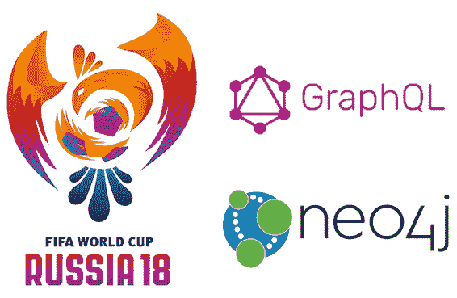
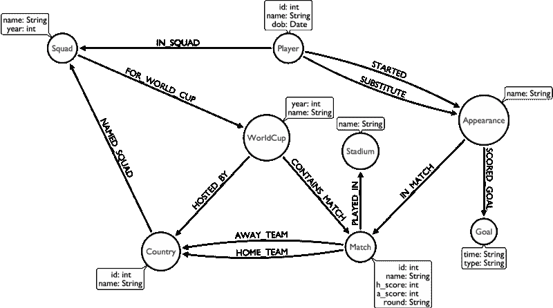
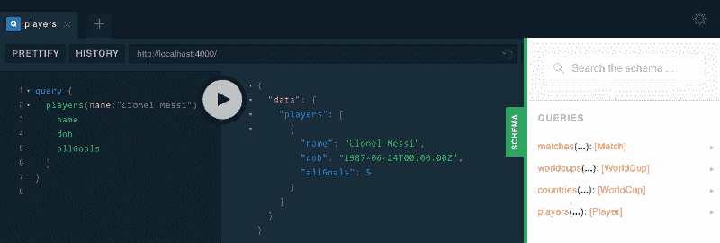
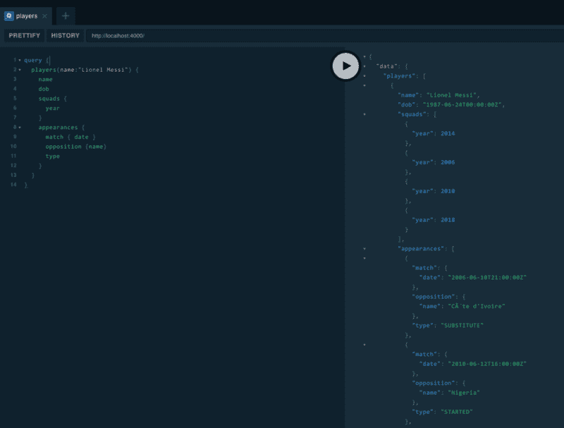
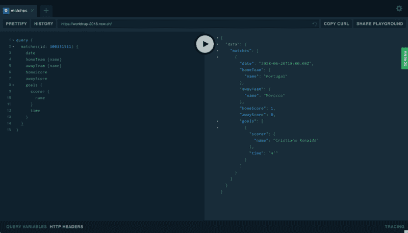
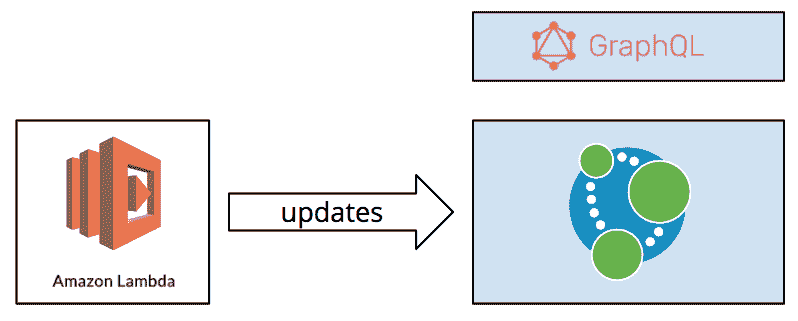
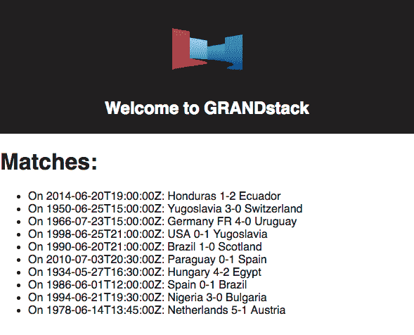
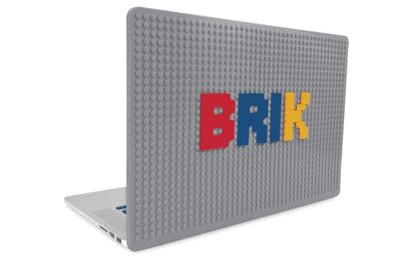

# 我们如何构建 2018 世界杯 GraphQL API

> 原文：<https://www.freecodecamp.org/news/building-the-2018-world-cup-graphql-api-fab40ccecb9e/>

迈克尔·亨格

# 我们如何构建 2018 世界杯 GraphQL API

在 2018 年世界杯第二轮比赛开始后，我们想创造一种**简单的方式**让人们回答所有关于参赛球队的问题。



### TL；速度三角形定位法(dead reckoning)

我们为 2018 年世界杯创建了一个 Neo4j 支持的 GraphQL API。这里可以玩[。](https://worldcup-2018.now.sh/)

### 构建 Neo4j 支持的 GraphQL API

我们已经创建了一个包含所有世界杯数据 的[数据库，供人们使用和查询，但我们希望让不知道 Neo4j 查询语言 Cypher 的人也能访问这些数据。](https://medium.com/neo4j/world-cup-2018-graph-19fbac0a75db)

GraphQL 来救援了！

在此之前，我们先来看看我们创建的 Neo4j 图表模型。



**WorldCup** 节点位于我们图表的中间，模型的所有其他部分都围绕着它。我们每个锦标赛都有一个世界杯节点。

接下来，我们有主办国**国家**，它通过**主办国**关系连接到世界杯节点。**比赛**也属于世界杯**、**比赛，每个**国家**命名一个**球员阵容**代表他们参加世界杯比赛*。*

对于他们作为首发或替补参加的每场比赛，玩家都连接到一个**外观**节点。如果他们进了一个**球，**外观节点将连接到那个进球节点。

### grandstock 初学者工具包

好了 Neo4j 说够了，让我们回到 GraphQL。

GRANDstack 将*Graph QL、 **R** eact、 **A** pollo 和**N**eo4j**D**database*组合成一个易于使用的包，用于快速构建 API 和应用。它使用 GraphQL 模式将 GraphQL 查询自动转换为**单个** Neo4j 查询，并能够从带注释的模式中自动生成所有查询、变异和字段。


GRANDstack Logo

我们使用[grands stack . io starter kit](https://github.com/grand-stack/grand-stack-starter/tree/master/api)在我们现有的 Neo4j 数据库之上创建了一个 GraphQL API。

它由两部分组成:后端`api`和前端`ui`。后端服务于 GraphQL API 和 GraphQL Playground(一个非常简洁的 GraphQL 查询浏览器和编辑器)，它还提供数据模式、文档和自动完成。

我们把它分支到我们自己的仓库，然后合并回一个[分支`worldcup`](https://github.com/grand-stack/grand-stack-starter/tree/worldcup) 供你使用。

第一步是创建一个 **GraphQL 模式**。您可以在下面看到我们得出的结果，这与我们上面的图表模型非常吻合。

最小的模式如下所示:

我们用一些特定于 GRANDstack 的 Neo4j 扩展对其进行了相当多的扩展，以获得一些可选的映射等等。

[**grand-stack/grand-stack-starter**](https://github.com/grand-stack/grand-stack-starter/blob/worldcup/api/src/graphql-schema.js)
[*grand-stack-starter-grand stack 全栈应用的简单启动项目*github.com](https://github.com/grand-stack/grand-stack-starter/blob/worldcup/api/src/graphql-schema.js)

一旦我们定义了模式，我们就更新我们的。env 文件指向我们的 Neo4j 云(https://neo4j.com/cloud/)托管的数据库。

```
NEO4J_URI=bolt://c27d992b.databases.neo4j.ioNEO4J_USER=worldcupNEO4J_PASSWORD=worldcup
```

您可以通过执行`yarn && yarn start`在本地运行它。这将启动位于 [http://localhost:4000，](http://localhost:4000,)的游乐场，您可以在这里开始玩一些查询。

我们可以编写一些查询来查找世界上最好的玩家。



GraphQL Playground

当然我们可以找到更多关于他的信息。



Result for details on Messi

### 部署到 zeit.now

现在我们准备部署。我们可以将我们的服务部署到任何托管 Node.js 应用程序的地方，但是@Will。Lyon 推荐了[Zeit Now](https://zeit.co/now)——这是一个伟大且易于使用的服务，用于托管您的应用程序，为小型项目提供易于使用的免费计划。

我们只需安装服务，然后在我们的目录中运行`now`命令进行部署。对于稳定的 URL，您可以将项目命名为固定的名称。

GraphQL 服务器部署在 https://worldcup-2018.now.sh/的[，现在可以使用了。让我们看看可以对数据集运行的查询类型。](https://worldcup-2018.now.sh/)

#### 葡萄牙对摩洛哥

当我写这篇文章的时候，**葡萄牙**正在和**摩洛哥比赛。**我们可以通过在上面定义的操场中执行这个 GraphQL 查询来检查最新的分数。



Portugal vs. Morocco results

葡萄牙目前 1 比 0 领先，克里斯蒂亚诺·罗纳尔多进球也就不足为奇了。

#### 克里斯蒂亚诺是谁？

如果我们想了解更多关于克里斯蒂亚诺的信息，我们也可以查询球员。例如，以下查询将向我们显示他的出生日期和他在世界杯上进了多少球，以及他这次进了多少球:

所以他在 2018 年世界杯上进了 4 个球，总共进了 7 个球，这意味着他在本届世界杯上的进球数比历届加起来还要多！

#### 德国在 1990 年的得分

尽管德国队在本届世界杯上开局并不顺利，但我们可以写一个怀旧的查询来找出 1990 年世界杯决赛的比分:

#### 1966 年的糟糕时期:(

或者我们可以回顾一下 1966 年，正如我的同事马克强迫我做的那样:

### 保持数据新鲜

比赛进行时，数据库每隔几分钟就会通过 Lambda 作业更新一次，所以无论何时查询，数据都应该是相当新鲜的。



### React UI

前端`ui`基本上只是一个 React app，它使用 Apollo Client 来查询我们的 API，并将结果呈现在组件中。

请注意，现在的 React 代码真的很丑很恐怖。我们把这个挑战留给你，让你使用**世界杯 GraphQL API** 构建漂亮的网络和/或移动应用。:)



my (ugly) world cup screen

当然你也可以使用 Vue 或者 Angular 或者其他你喜欢的 ui 框架。

它连接到在`.env`文件中提供的 URL，在这里我们只放置我们的本地`http://localhost:4000`或者我们的 now.sh URI。

```
REACT_APP_GRAPHQL_URI=https://worldcup-2018.now.sh/
```

同样，一个单独的`now`命令也可以部署我们的 UI。在我们的情况下，我们不需要它，但 Zeit 现在有支持，如果你有任何秘密凭证。



### grandstock 马拉松

幸运的是， [GRANDstack Hackathon](https://blog.grandstack.io/announcing-the-grandstack-online-hackathon-for-graphql-europe-2018-7d256ebf68e1) 仍在**进行，以收集伟大的想法**，并且有一些非常酷的奖品供您提交。

> 非常感谢我的同事马克·尼达姆(Mark Needham)做了这么多把数据和模型放在一起的艰苦工作。