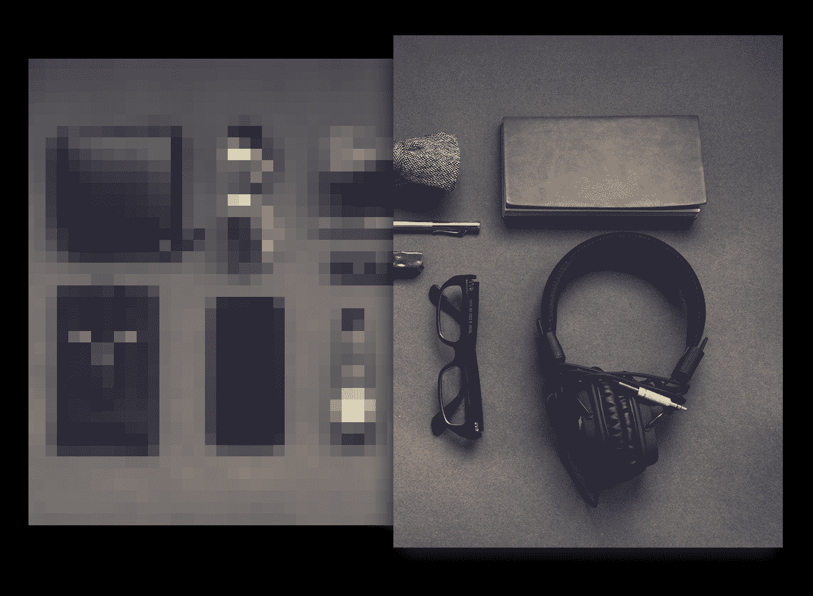

# 为 Tueri.io 构建 React 图像优化组件

> 原文：<https://www.freecodecamp.org/news/building-the-react-image-optimization-component-for-tueri-io/>



面对现实吧，图像优化很难。我们想让它变得轻松。

当我们开始构建 React 组件时，有几个问题需要解决:

*   基于父容器自动决定任何设备的图像宽度。

*   使用用户浏览器支持的最佳图像格式。

*   自动图像延迟加载。

*   自动低质量图像占位符(LQIP)。

哦，对于 React 开发人员来说，使用起来必须毫不费力。

## 这是我们想出来的:

```
 
```

简单对吗？让我们开始吧。

## 计算图像大小:

创建一个`<figure />`元素，检测宽度并构建一个图像 URL:

```
class Img extends React.Component {

    constructor(props) {
        super(props)
        this.state = {
            width: 0
        }
        this.imgRef = React.createRef()
    }

    componentDidMount() {
        const width = this.imgRef.current.clientWidth
        this.setState({
            width
        })
    }

    render() {

        // Destructure props and state
        const { src, alt, options = {}, ext = 'jpg' } = this.props
        const { width } = this.state

        // Create an empty query string
        let queryString = ''        

        // If width is specified, otherwise use auto-detected width
        options['w'] = options['w'] || width

        // Loop through option object and build queryString
        Object.keys(options).map((option, i) => {
            return queryString +=  `${i < 1 ? '?' : '&'}${option}=${options[option]}`
        })

        return(
            <figure ref={this.imgRef}>
                { 
                    // If the container width has been set, display the image else null
                    width > 0 ? (
                        
                    ) : null 
                }
            </figure>
        )

    }
}

export default Img 
```

这将返回以下 HTML:

```
<figure>
    
</figure> 
```

## 使用最好的图像格式:

接下来，我们需要添加对检测 WebP 图像的支持，并让 Tueri 服务以 WebP 格式返回图像:

```
class Img extends React.Component {

    constructor(props) {
        // ...
        this.window = typeof window !== 'undefined' && window
        this.isWebpSupported = this.isWebpSupported.bind(this)
    }

    // ...

    isWebpSupported() {
        if (!this.window.createImageBitmap) {
            return false;
        }
        return true;
    }

    render() {

        // ...

        // If a format has not been specified, detect webp support
        // Set the fm (format) option in the image URL
        if (!options['fm'] && this.isWebpSupported) {
            options['fm'] = 'webp'
        }

        // ...

        return (
            // ...
        )

    }
}

// ... 
```

这将返回以下 HTML:

```
<figure>
    
</figure> 
```

## 自动图像延迟加载:

现在，我们需要找出`<figure />`元素是否在视窗中，另外我们添加了一个小的缓冲区，这样图像就可以在滚动到视图中之前加载。

```
 class Img extends React.Component {

   constructor(props) {
       // ...
       this.state = {
           // ...
           isInViewport: false
           lqipLoaded: false
       }
       // ...
       this.handleViewport = this.handleViewport.bind(this)
   }

   componentDidMount() {
       // ...
       this.handleViewport()
       this.window.addEventListener('scroll', this.handleViewport)
   }

   handleViewport() {
       // Only run if the image has not already been loaded
       if (this.imgRef.current && !this.state.lqipLoaded) {
           // Get the viewport height
           const windowHeight = this.window.innerHeight
           // Get the top position of the <figure /> element
           const imageTopPosition = this.imgRef.current.getBoundingClientRect().top
           // Multiply the viewport * buffer (default buffer: 1.5)
           const buffer = typeof this.props.buffer === 'number' && this.props.buffer > 1 && this.props.buffer < 10 ? this.props.buffer : 1.5
           // If <figure /> is in viewport
           if (windowHeight * buffer > imageTopPosition) {
               this.setState({
                   isInViewport: true
               })
           }
       }
   }

   // ...

   componentWillUnmount() {
       this.window.removeEventListener('scroll', this.handleViewport)
   }

   render() {

       // Destructure props and state
       // ...
       const { isInViewport, width } = this.state

       // ...

       return (
           <figure ref={this.imgRef}>
               { 
                   // If the container width has been set, display the image else null
                   isInViewport && width > 0 ? (
                        { this.setState({ lqipLoaded: true }) } }
                           // ...
                       />
                   ) : null 
               }
           </figure>
       )

   }
}

export default Img 
```

## 自动低质量图像占位符(LQIP):

最后，当图像在视窗中时，我们希望加载 1/10 大小的模糊图像，然后在加载全尺寸图像时淡出占位符图像:

```
class Img extends React.Component {

    constructor(props) {
        // ...
        this.state = {
            // ...
            fullsizeLoaded: false
        }

        // ...

    }

    // ...

    render() {

        // Destructure props and state
        // ...
        const { isInViewport, width, fullsizeLoaded } = this.state

        // ...

        // Modify the queryString for the LQIP image: replace the width param with a value 1/10 the fullsize
        const lqipQueryString = queryString.replace(`w=${ width }`, `w=${ Math.round(width * 0.1) }`)

        // Set the default styles. The full size image should be absolutely positioned within the <figure /> element
        const styles = {
            figure: {
                position: 'relative',
                margin: 0
            },
            lqip: {
                width: '100%',
                filter: 'blur(5px)',
                opacity: 1,
                transition: 'all 0.5s ease-in'
            },
            fullsize: {
                position: 'absolute',
                top: '0px',
                left: '0px',
                transition: 'all 0.5s ease-in'
            }
        }

        // When the fullsize image is loaded, fade out the LQIP
        if (fullsizeLoaded) {
            styles.lqip.opacity = 0
        }

        return(
            <figure
                style={ styles.figure }
                // ...
            >
                {
                    isInViewport && width > 0 ? (
                        <React.Fragment>

                            {/* Load fullsize image in background */}
                             { this.setState({ fullsizeLoaded: true }) } }
                                style={ styles.fullsize }
                                src={`https://cdn.tueri.io/${ src }/${ kebabCase(alt) }.${ ext }${ queryString }`}
                                alt={ alt }
                            />

                            {/* Load LQIP in foreground */}
                             { this.setState({ lqipLoaded: true }) } }
                                style={ styles.lqip }
                                src={`https://cdn.tueri.io/${ src }/${ kebabCase(alt) }.${ ext }${ lqipQueryString }`} 
                                alt={ alt } 
                            />
                        </React.Fragment>
                    ) : null
                }            
            </figure>
        )

    }
}

// ... 
```

## 将所有这些放在一起:

轻松实现图像优化。只需将常规的``元素换成 Tueri ``元素，再也不用担心优化了。

```
import React from 'react'
import PropTypes from 'prop-types'
import { TueriContext } from './Provider'
import kebabCase from 'lodash.kebabcase'

class Img extends React.Component {

    constructor(props) {
        super(props)
        this.state = {
            isInViewport: false,
            width: 0,
            height: 0,
            lqipLoaded: false,
            fullsizeLoaded: false
        }

        this.imgRef = React.createRef()
        this.window = typeof window !== 'undefined' && window 
        this.handleViewport = this.handleViewport.bind(this)       
        this.isWebpSupported = this.isWebpSupported.bind(this)

    }

    componentDidMount() {

        const width = this.imgRef.current.clientWidth

        this.setState({
            width
        })

        this.handleViewport()

        this.window.addEventListener('scroll', this.handleViewport)

    }

    handleViewport() {
        if (this.imgRef.current && !this.state.lqipLoaded) {
            const windowHeight = this.window.innerHeight
            const imageTopPosition = this.imgRef.current.getBoundingClientRect().top
            const buffer = typeof this.props.buffer === 'number' && this.props.buffer > 1 && this.props.buffer < 10 ? this.props.buffer : 1.5
            if (windowHeight * buffer > imageTopPosition) {
                this.setState({
                    isInViewport: true
                })
            }

        }
    }

    isWebpSupported() {
        if (!this.window.createImageBitmap) {
            return false;
        }
        return true;
    }

    componentWillUnmount() {
        this.window.removeEventListener('scroll', this.handleViewport)
    }

    render() {

        // Destructure props and state
        const { src, alt, options = {}, ext = 'jpg' } = this.props
        const { isInViewport, width, fullsizeLoaded } = this.state

        // Create an empty query string
        let queryString = ''

        // If width is specified, otherwise use auto-detected width
        options['w'] = options['w'] || width

        // If a format has not been specified, detect webp support
        if (!options['fm'] && this.isWebpSupported) {
            options['fm'] = 'webp'
        }

        // Loop through option prop and build queryString
        Object.keys(options).map((option, i) => {
            return queryString +=  `${i < 1 ? '?' : '&'}${option}=${options[option]}`
        })

        // Modify the queryString for the LQIP image: replace the width param with a value 1/10 the fullsize
        const lqipQueryString = queryString.replace(`w=${ width }`, `w=${ Math.round(width * 0.1) }`)

        const styles = {
            figure: {
                position: 'relative',
                margin: 0
            },
            lqip: {
                width: '100%',
                filter: 'blur(5px)',
                opacity: 1,
                transition: 'all 0.5s ease-in'
            },
            fullsize: {
                position: 'absolute',
                top: '0px',
                left: '0px',
                transition: 'all 0.5s ease-in'
            }
        }

        // When the fullsize image is loaded, fade out the LQIP
        if (fullsizeLoaded) {
            styles.lqip.opacity = 0
        }

        const missingALt = 'ALT TEXT IS REQUIRED'

        return(
            // Return the CDN domain from the TueriProvider
            <TueriContext.Consumer>
                {({ domain }) => (
                    <figure
                        style={ styles.figure }
                        ref={this.imgRef}
                    >
                        {
                            // 
                            isInViewport && width > 0 ? (
                                <React.Fragment>

                                    {/* Load fullsize image in background */}
                                     { this.setState({ fullsizeLoaded: true }) } }
                                        style={ styles.fullsize }
                                        src={`${ domain }/${ src }/${ kebabCase(alt || missingALt) }.${ ext }${ queryString }`}
                                        alt={ alt || missingALt }
                                    />

                                    {/* Load LQIP in foreground */}
                                     { this.setState({ lqipLoaded: true }) } }
                                        style={ styles.lqip }
                                        src={`${ domain }/${ src }/${ kebabCase(alt || missingALt) }.${ ext }${ lqipQueryString }`} 
                                        alt={ alt || missingALt } 
                                    />
                                </React.Fragment>
                            ) : null
                        }            
                    </figure>
                )}

            </TueriContext.Consumer>
        )

    }
}

Img.propTypes = {
    src: PropTypes.string.isRequired,
    alt: PropTypes.string.isRequired,
    options: PropTypes.object,
    ext: PropTypes.string,
    buffer: PropTypes.number
}

export default Img 
```

## 观看它的实际应用:

在 CodeSandbox 上试用现场演示:

[https://codesandbox.io/embed/qjzqw7w3q?fontsize=14](https://codesandbox.io/embed/qjzqw7w3q?fontsize=14)

* * *

*最初发布于[tueri . io](https://tueri.io/blog/2019-03-21-building-the-react-image-optimization-component/?utm_source=Freecodecamp&utm_medium=Post&utm_campaign=)*