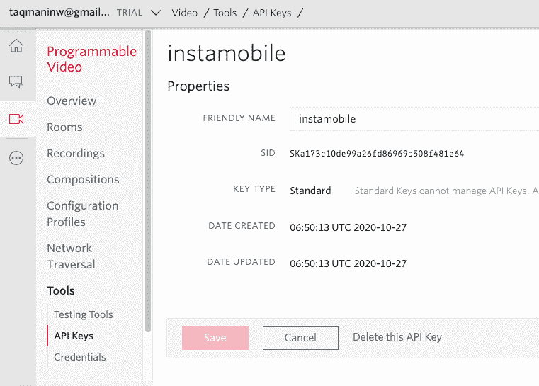
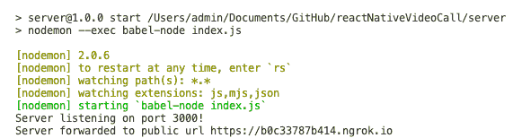
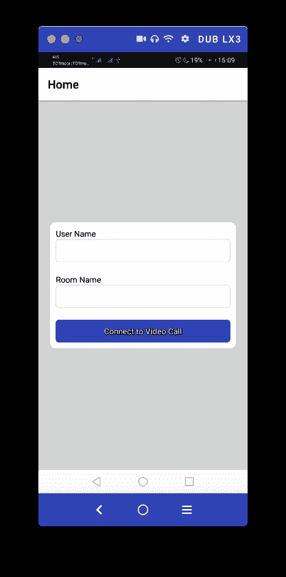
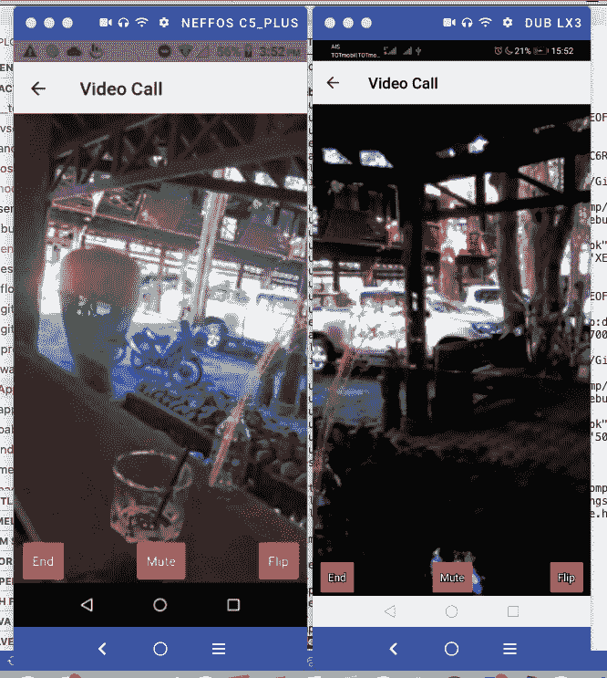

# 如何向 React 原生应用添加视频通话

> 原文：<https://www.freecodecamp.org/news/building-video-call-app-in-react-native/>

在新冠肺炎疫情期间，视频通话已经成为一项必不可少的日常活动。通过使用聊天应用、音频通话和视频通话等功能，我们能够与朋友和家人保持联系。

现在，让我们创建自己的 React 本机应用程序，让我们可以进行视频通话。

在本教程中，我们将学习如何使用 Twilio 可编程视频呼叫 API 在 React 原生应用中实现视频呼叫功能。

这个过程非常简单。我们将简单地创建一个视频会议室，并邀请其他人加入该房间。为此，我们需要使用摄像机和麦克风。因此，我们需要使用真正的智能手机设备进行测试。

我们将要用来访问 Twilio API 的主包是[react-native-Twilio-video-webrtc](https://github.com/blackuy/react-native-twilio-video-webrtc)包。

### 要求

*   [Twilio 账户](https://www.twilio.com/)
*   至少两台 iOS 或 Android 设备用于测试。
*   [React 原生环境设置](https://reactnative.dev/docs/environment-setup)。

*我们开始吧！*

## 如何获得您的 Twilio API 密钥

为了获得 Twilio API 密钥，您需要一个 Twilio 帐户。为此，请访问此 [URL](https://www.twilio.com/console/video/project/api-keys/) 。设置您的帐户后，您需要转到下面截图指示的位置:



## 如何设置服务器来处理获取访问令牌

为了获取访问令牌，我们需要创建一个新的节点服务器项目。为此，我们需要通过运行以下命令来安装必要的软件包:

```
yarn add dotenv express ngrok nodemon twilio
```

接下来，我们需要在环境变量文件中添加 Twilio 凭证。env，如下面的代码片段所示:

```
PORT=3000
ACCOUNT_SID=AC5ceb0847c50c91b143ce07
API_KEY_SID=SKa173c10de99a26fd86969b
API_KEY_SECRET=Czv7IjNIZJis8s7jb5FePi
```

现在我们需要创建一个 API 端点。首先，我们需要导入必要的包并创建对象实例来获取访问令牌，如下面的代码片段所示:

```
import 'dotenv/config';
import express from 'express';

import twilio from 'twilio';
import ngrok from 'ngrok';
const AccessToken = twilio.jwt.AccessToken;
const VideoGrant = AccessToken.VideoGrant;

const app = express();
```

这里，我们将创建一个 API 端点来获取访问令牌。通过使用 Express 实例提供的 get 方法，我们需要创建一个用访问令牌进行响应的端点函数。

在函数内部，我们需要用 Twillio 凭证创建一个新的实例。然后，我们需要添加从移动设备上的注册屏幕接收到的用户名作为身份属性。

最后，我们将授予用户访问权限，以便他们可以使用视频，然后将 JWT 令牌返回到设备。在下面的代码片段中有完成这一切的代码:

```
app.get('/getToken', (req, res) => {
  if (!req.query || !req.query.userName) {
    return res.status(400).send('Username parameter is required');
  }
  const accessToken = new AccessToken(
    process.env.ACCOUNT_SID,
    process.env.API_KEY_SID,
    process.env.API_KEY_SECRET,
  );

  // Set the Identity of this token
  accessToken.identity = req.query.userName;

  // Grant access to Video
  var grant = new VideoGrant();
  accessToken.addGrant(grant);

  // Serialize the token as a JWT
  var jwt = accessToken.toJwt();
  return res.send(jwt);
}); 
```

我们还向互联网公开了我们创建的端点 API，用于 east 访问。为此，我们可以使用以下代码片段中的代码:

```
app.listen(process.env.PORT, () =>
  console.log(`Server listening on port ${process.env.PORT}!`),
);

ngrok.connect(process.env.PORT).then((url) => {
  console.log(`Server forwarded to public url ${url}`);
}); 
```

最后，我们需要运行服务器，如下图所示:



这里，我们已经成功地创建了一个 API 端点来返回访问令牌。

## 如何配置我们的 React 本地项目

在我们的 React Native 项目中，我们需要手动设置包，并配置访问 Android 和 iOS 平台的摄像头和麦克风的权限。

但是首先，我们需要安装必要的包，它们是`react-navigation`和`react-native-twilio-video-webrtc`，在我们的项目终端中运行以下命令:

```
yarn add @react-navigation/native @react-navigation/stack react-native-reanimated react-native-gesture-handler react-native-screens react-native-safe-area-context @react-native-community/masked-view react-native-dotenv react-native-permissions <https://github.com/blackuy/react-native-twilio-video-webrtc> 
```

### iOS 的设置

对于 iOS，我们需要手动设置软件包。首先，我们需要在 Podfile 上将 **IOS 目标增加到 11。这很有必要，因为 [Twilio 的原生视频 SDK 只支持 iOS 11.0+](https://www.twilio.com/docs/video/ios#prerequisites) :**

```
platform :ios, '11.0'
require_relative '../node_modules/@react-native-community/cli-platform-ios/native_modules' 
```

在 Podfile 中，我们需要按照下面的代码片段设置一个权限请求:

```
permissions_path = '../node_modules/react-native-permissions/ios'
  pod 'Permission-Camera', :path => "#{permissions_path}/Camera.podspec"
  pod 'Permission-Microphone', :path => "#{permissions_path}/Microphone.podspec" 
```

然后，我们需要打开 info.plist 并添加代码，按照下面代码片段中的指示请求摄像头和麦克风访问权限:

```
 <key>UIViewControllerBasedStatusBarAppearance</key>
	<false/>
  <key>NSCameraUsageDescription</key>
  <string>We require your permission to access the camera while in a video call</string>
  <key>NSMicrophoneUsageDescription</key>
  <string>We require your permission to access the microphone while in a video call</string> 
```

现在我们已经完成了 iOS 设置。

### Android 设置

首先，我们需要将下面一行代码添加到**中。/android/settings.gradle** 文件:

```
project(':react-native-twilio-video-webrtc').projectDir = new File(rootProject.projectDir, '../node_modules/react-native-twilio-video-webrtc/android') 
```

此外，我们需要向**添加包实现代码。/android/app/build.gradle** 文件:

```
implementation project(':react-native-twilio-video-webrtc') 
```

最后，我们需要将它导入到**[MainApplication.java](http://mainapplication.java)**文件中:

```
import com.twiliorn.library.TwilioPackage; 
```

然后，我们需要使用下面这段代码来激活这个包:

```
@Override
protected List getPackages() {
  @SuppressWarnings("UnnecessaryLocalVariable")
  List packages = new PackageList(this).getPackages();
  //  add the following code
  packages.add(new TwilioPackage());
  return packages;
} 
```

### 如何构建登记室屏幕

在这里，我们将创建一个名为“Register Room”的屏幕，它将允许我们在我们的视频呼叫 React 本机应用程序中注册一个房间。

首先，我们需要导入必要的包，如下面的代码片段所示:

```
import React, {useState, useRef, useEffect, useContext} from 'react';
import {
  StyleSheet,
  View,
  Text,
  StatusBar,
  TouchableOpacity,
  TextInput,
  Alert,
  KeyboardAvoidingView,
  Platform,
  ScrollView,
  Dimensions,
} from 'react-native';

import {
  TwilioVideoLocalView,
  TwilioVideoParticipantView,
  TwilioVideo,
} from 'react-native-twilio-video-webrtc';

import {NavigationContainer} from '@react-navigation/native';
import {createStackNavigator} from '@react-navigation/stack'; 
```

*   react-navigation:处理注册屏幕和视频通话屏幕的导航。
*   react-native:这个包允许我们处理访问摄像头和麦克风的权限。
*   react-native-twilio-Video-webrtc:这允许我们访问 Twilio 的视频调用可编程 API。

### 如何初始化实例和变量

首先，我们将为 react-navigation 创建一个实例。然后，我们将初始化状态和上下文变量来分发状态，如下面的代码片段所示:

```
const Stack = createStackNavigator();
const initialState = {
  isAudioEnabled: true,
  status: 'disconnected',
  participants: new Map(),
  videoTracks: new Map(),
  userName: '',
  roomName: '',
  token: '',
};

const AppContext = React.createContext(initialState);

const dimensions = Dimensions.get('window'); 
```

### 引导导航

在 **App.js** 文件中，我们将创建一个导航容器栈。使用`Stack`组件，我们将使用上下文将状态分配到每个屏幕，如下面的代码片段所示:

```
export default () => {
  const [props, setProps] = useState(initialState);

  return (
    <>
      <StatusBar barStyle="dark-content" />
      <AppContext.Provider value={{props, setProps}}>
        <NavigationContainer>
          <Stack.Navigator>
            <Stack.Screen name="Home" component={HomeScreen} />
            <Stack.Screen name="Video Call" component={VideoCallScreen} />
          </Stack.Navigator>
        </NavigationContainer>
      </AppContext.Provider>
    </>
  );
}; 
```

### 如何创建注册屏幕

注册屏幕将有一个模态对话框来获取用户的凭证，并允许用户加入视频通话室。

首先，我们需要从上下文中获取道具到 **register.js** 文件，如下面的代码片段所示:

```
import React, {useState, useRef, useEffect, useContext} from 'react';
import {
  checkMultiple,
  request,
  requestMultiple,
  PERMISSIONS,
  RESULTS,
} from 'react-native-permissions';

const RegisterScreen = ({navigation}) => {
  const {props, setProps} = useContext(AppContext); 
```

接下来，我们需要创建一个函数来处理摄像头和麦克风权限。下面的代码片段提供了该函数的代码:

```
const _checkPermissions = (callback) => {
    const iosPermissions = [PERMISSIONS.IOS.CAMERA, PERMISSIONS.IOS.MICROPHONE];
    const androidPermissions = [
      PERMISSIONS.ANDROID.CAMERA,
      PERMISSIONS.ANDROID.RECORD_AUDIO,
    ];
    checkMultiple(
      Platform.OS === 'ios' ? iosPermissions : androidPermissions,
    ).then((statuses) => {
      const [CAMERA, AUDIO] =
        Platform.OS === 'ios' ? iosPermissions : androidPermissions;
      if (
        statuses[CAMERA] === RESULTS.UNAVAILABLE ||
        statuses[AUDIO] === RESULTS.UNAVAILABLE
      ) {
        Alert.alert(
          'Error',
          'Hardware to support video calls is not available',
        );
      } else if (
        statuses[CAMERA] === RESULTS.BLOCKED ||
        statuses[AUDIO] === RESULTS.BLOCKED
      ) {
        Alert.alert(
          'Error',
          'Permission to access hardware was blocked, please grant manually',
        );
      } else {
        if (
          statuses[CAMERA] === RESULTS.DENIED &&
          statuses[AUDIO] === RESULTS.DENIED
        ) {
          requestMultiple(
            Platform.OS === 'ios' ? iosPermissions : androidPermissions,
          ).then((newStatuses) => {
            if (
              newStatuses[CAMERA] === RESULTS.GRANTED &&
              newStatuses[AUDIO] === RESULTS.GRANTED
            ) {
              callback && callback();
            } else {
              Alert.alert('Error', 'One of the permissions was not granted');
            }
          });
        } else if (
          statuses[CAMERA] === RESULTS.DENIED ||
          statuses[AUDIO] === RESULTS.DENIED
        ) {
          request(statuses[CAMERA] === RESULTS.DENIED ? CAMERA : AUDIO).then(
            (result) => {
              if (result === RESULTS.GRANTED) {
                callback && callback();
              } else {
                Alert.alert('Error', 'Permission not granted');
              }
            },
          );
        } else if (
          statuses[CAMERA] === RESULTS.GRANTED ||
          statuses[AUDIO] === RESULTS.GRANTED
        ) {
          callback && callback();
        }
      }
    });
  }; 
```

然后，我们需要在每次应用程序启动时调用这个权限检查函数。为此，我们需要调用`useEffect`钩子内的函数，如下面的代码片段所示:

```
useEffect(() => {
    _checkPermissions();
  }, []); 
```

最后，我们需要创建一个简单的表单，它有两个输入，接受房间名和用户名。然后，我们需要将输入发送到服务器，以便在 Twilio API 上注册。下面的代码片段提供了相关代码:

```
return (
    <KeyboardAvoidingView
      behavior={Platform.OS === 'ios' ? 'padding' : 'height'}
      style={styles.container}>
      <ScrollView contentContainerStyle={styles.container}>
        <View style={styles.form}>
          <View style={styles.formGroup}>
            <Text style={styles.text}>User Name</Text>
            <TextInput
              style={styles.textInput}
              autoCapitalize="none"
              value={props.userName}
              onChangeText={(text) => setProps({...props, userName: text})}
            />
          </View>
          <View style={styles.formGroup}>
            <Text style={styles.text}>Room Name</Text>
            <TextInput
              style={styles.textInput}
              autoCapitalize="none"
              value={props.roomName}
              onChangeText={(text) => setProps({...props, roomName: text})}
            />
          </View>
          <View style={styles.formGroup}>
            <TouchableOpacity
              disabled={false}
              style={styles.button}
              onPress={() => {
                _checkPermissions(() => {
                  fetch(`https://ae7a722dc260.ngrok.io/getToken?userName=${props.userName}`)
                    .then((response) => {
                      if (response.ok) {
                        response.text().then((jwt) => {
                          setProps({...props, token: jwt});
                          navigation.navigate('Video Call');
                          return true;
                        });
                      } else {
                        response.text().then((error) => {
                          Alert.alert(error);
                        });
                      }
                    })
                    .catch((error) => {
                      console.log('error', error);
                      Alert.alert('API not available');
                    });
                });
              }}>
              <Text style={styles.buttonText}>Connect to Video Call</Text>
            </TouchableOpacity>
          </View>
        </View>
      </ScrollView>
    </KeyboardAvoidingView>
  ); 
```

我们将得到如下模拟器截图所示的结果:



在这里，我们可以注意到我们的 Register Room 屏幕，它带有一个模态表单，我们可以在其中输入房间名和用户名，以便注册到服务器上运行的 Twilio API。

### 如何构建视频通话屏幕

在视频通话屏幕中，我们将有两个窗口，一个显示我们自己的摄像头视图，另一个显示接收者的摄像头视图。

首先，我们需要初始化上下文来接受状态。然后，我们将使用`useRef`钩子创建一个引用变量来访问状态，如下面的代码片段所示:

```
const VideoCallScreen = ({navigation}) => {
  const twilioVideo = useRef(null);
  const {props, setProps} = useContext(AppContext); 
```

接下来，我们需要使用来自`twilioVideo`对象的`connect`方法初始化连接，按照下面的代码片段提供房间名称和访问令牌:

```
useEffect(() => {
    twilioVideo.current.connect({
      roomName: props.roomName,
      accessToken: props.token,
    });
    setProps({...props, status: 'connecting'});
    return () => {
      _onEndButtonPress();
    };
  }, []); 
```

现在，我们需要为视频通话屏幕创建主体模板。这里，我们仅在连接建立并使用条件渲染进行流式传输时显示参与者的摄像机视图。下面的代码片段提供了这方面的全部代码:

```
{(props.status === 'connected' || props.status === 'connecting') && (
        <View style={styles.callWrapper}>
          {props.status === 'connected' && (
            <View style={styles.grid}>
              {Array.from(props.videoTracks, ([trackSid, trackIdentifier]) => (
                <TwilioVideoParticipantView
                  style={styles.remoteVideo}
                  key={trackSid}
                  trackIdentifier={trackIdentifier}
                />
              ))}
            </View>
          )}
        </View>
      )} 
```

接下来，我们需要创建一些函数来控制视频中的特性，比如结束通话、静音以及切换前后摄像头。下面的代码片段提供了所需功能的编码实现:

```
const _onEndButtonPress = () => {
    twilioVideo.current.disconnect();
    setProps(initialState);
  };

  const _onMuteButtonPress = () => {
    twilioVideo.current
      .setLocalAudioEnabled(!props.isAudioEnabled)
      .then((isEnabled) => setProps({...props, isAudioEnabled: isEnabled}));
  };

  const _onFlipButtonPress = () => {
    twilioVideo.current.flipCamera();
  }; 
```

这里，我们使用了`twilioVideo`实例提供的`disconnect`、`setLocalAudioEnabled`和`flipCamera`方法来触发所需的视频内特性。

现在我们需要渲染出一些按钮来触发这些功能。为此，我们需要使用以下代码片段中的代码:

```
 <View style={styles.optionsContainer}>
        <TouchableOpacity style={styles.button} onPress={_onEndButtonPress}>
          <Text style={styles.buttonText}>End</Text>
        </TouchableOpacity>
        <TouchableOpacity style={styles.button} onPress={_onMuteButtonPress}>
          <Text style={styles.buttonText}>
            {props.isAudioEnabled ? 'Mute' : 'Unmute'}
          </Text>
        </TouchableOpacity>
        <TouchableOpacity style={styles.button} onPress={_onFlipButtonPress}>
          <Text style={styles.buttonText}>Flip</Text>
        </TouchableOpacity>
      </View> 
```

最后一步是添加被配置为处理和观察所有视频调用事件的`TwilioVideo`组件。下面的代码片段提供了总体配置的`TwilioVideo`组件:

```
 <TwilioVideo
        ref={twilioVideo}
        onRoomDidConnect={() => {
          setProps({...props, status: 'connected'});
        }}
        onRoomDidDisconnect={() => {
          setProps({...props, status: 'disconnected'});
          navigation.goBack();
        }}
        onRoomDidFailToConnect={(error) => {
          Alert.alert('Error', error.error);
          setProps({...props, status: 'disconnected'});
          navigation.goBack();
        }}
        onParticipantAddedVideoTrack={({participant, track}) => {
          if (track.enabled) {
            setProps({
              ...props,
              videoTracks: new Map([
                ...props.videoTracks,
                [
                  track.trackSid,
                  {
                    participantSid: participant.sid,
                    videoTrackSid: track.trackSid,
                  },
                ],
              ]),
            });
          }
        }}
        onParticipantRemovedVideoTrack={({track}) => {
          const videoTracks = props.videoTracks;
          videoTracks.delete(track.trackSid);
          setProps({...props, videoTracks});
        }}
      /> 
```

如果我们能够在一个房间中的用户之间建立适当的连接，我们将得到以下结果:



上面的截图展示了一个房间中两个参与者之间的视频通话。

这样，我们就成功地在 React 原生应用中实现了视频通话功能。

## 结论

本教程旨在提供关于如何在 React 原生应用程序中设置视频通话的初级学习资源。我们通过使用 Twilio 的可编程视频呼叫 API 来实现这一点。

我们不仅讨论了 React 本机部分，还在一个单独的节点服务器项目中讨论了整个 API 实现。

现在，下一步可以添加高级功能，如启动匿名呼叫或多人视频通话室。

为了获得功能灵感和合适的视频通话应用程序，您可以查看提供具有强大功能的[视频聊天应用程序](https://www.instamobile.io/app-templates/video-chat-app-in-react-native/)状态的 [instamobile.io](http://instamobile.io) 。

*下次见，伙计们，编码快乐！*