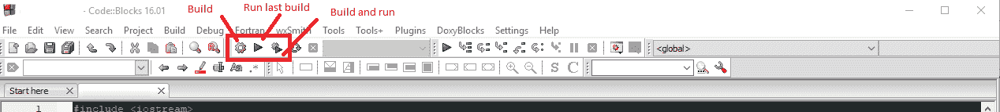

# C++编译器讲解:编译器是什么，怎么用？

> 原文：<https://www.freecodecamp.org/news/c-compiler-explained-what-is-the-compiler-and-how-do-you-use-it/>

## C++编译器简介

为了开始使用 C++，你需要学习一些关于编译器和 C++如何在你的计算机上运行的知识。

总而言之，计算机只理解一种语言，即机器语言。机器语言完全由二进制位组成，即 0 和 1。

虽然用二进制编程是可能的，但这将是极其乏味和耗时的。所以，我们人类开发编程语言是为了让软件开发变得更容易。

汇编语言与机器语言是直接一对一的。C、C++、COBOL 之类的语言稍微高一点，需要向下编译。它甚至更高。像 JavaScript 和 Python 这样的语言有一些组件在编译之前被翻译成 C++或其他低级语言，这实际上使它们成为比 C 或 C++更“高级”的语言。

因为计算机体系结构是由只能处理二进制 1 和 0 的电子开关和电缆组成的，所以你需要一个编译器来将你的代码从高级 C++翻译成 CPU 可以理解的机器语言。

## 编译器如何工作

编译器是实用程序，它把你的代码转换成可执行的机器代码文件。

当您对代码运行编译器时，首先，预处理器读取源代码(您刚刚编写的 C++文件)。预处理器搜索任何预处理器指令(以#开头的代码行)。预处理器指令使预处理器以某种方式改变你的代码(通常是通过添加一些库或者另一个 C++文件)。

接下来，编译器逐行处理预处理后的代码，将每一行翻译成适当的机器语言指令。这还会发现源代码中存在的任何语法错误，并向命令行抛出一个错误。

最后，如果没有错误，编译器会创建一个目标文件，其中包含在您的机器上运行所需的机器语言二进制文件。虽然编译器刚刚创建的目标文件可能足以在您的计算机上执行某些操作，但它仍然不是您的 C++程序的可执行文件。要达到一个可执行的程序，还有最后一个重要步骤。

C++包含一个庞大的库来帮助执行困难的任务，如 I/O 和硬件操作。您可以在预处理器指令中包含这些库，但是预处理器不会自动将它们添加到您的代码中。

为了得到最终的可执行程序，另一个叫做链接器的工具必须将你的目标文件与运行代码所必需的库函数结合起来。

你可以把它想象成拥有建造一栋房子所需要的所有材料。编译器制作了所有的模块，但是链接器是把它们粘在一起最终创建一个房子的人。一旦完成，您现在就有了一个功能正常的可执行文件！

## **如何编译文件**

假设你有一个名为`helloWorld.cpp`的 C++文件…

### **如果你在 Windows 上**

#### **使用与 IDE 类似的代码块**

就像单击构建和运行按钮一样简单，它们会在项目文件夹中创建一个文件。

#### **使用命令提示符**

1.  打开一个开发人员命令提示符——对于这一步，您需要有 Microsoft Visual Studio 或其他一些 IDE，使您能够从命令行编译您的程序。你也可以在线搜索 C++编译器。
2.  直接导航到源代码
3.  在您的源代码上运行编译器(假设您使用的是 Microsoft Visual Studio 编译器)`cl /EHsc helloWorld.cpp`

这将创建一个目标文件，并自动链接它。如果您在同一个文件夹中查找，您将看到一个 hellWorld.exe 可执行文件(注意扩展名为 exe)。

1.  在提示符下键入`helloWorld`来运行可执行文件

或者，许多 ide 允许快速构建和查看您的程序。这可能更容易，因为您的 windows 版本可能没有预打包编译器实用程序。

### **如果你用的是 Linux 或者 OSX**

1.  打开终端窗口并导航到源代码目录
2.  在源代码上运行编译器`g++ helloWorld.cpp -o helloWorld`

这将创建一个对象文件，并自动为您链接它。查看文件夹，您会看到一个 helloWorld.exe 可执行文件(注意扩展名为 exe)。

1.  在终端窗口中键入`./helloWorld`来运行可执行文件

g++是标准的 Linux 编译器，是一个非常有用的工具。它与操作系统打包在一起。

注意:要直接编译和执行你的代码，运行`g++ -o helloWorld helloWorld.cpp; ./helloWorld`这样当你需要多次编译和运行你的代码时，向上箭头键-enter。

有许多不同类型的编译器。列出的两个是通常与 Windows 或 Linux/OSX 打包在一起的两个。

## 关于 C++的更多信息

*   [c++编程简介](https://www.freecodecamp.org/news/the-c-plus-plus-programming-language/)
*   [c++中的面向对象编程](https://www.freecodecamp.org/news/object-oriented-programming-in-c/)
*   [用 C++和 Java 解释的图形算法和数据结构](https://www.freecodecamp.org/news/graph-algorithms-and-data-structures-explained-with-java-and-c-examples/)
*   [如何用 VS 代码编译你的 C++代码](https://www.freecodecamp.org/news/how-to-compile-your-c-code-in-visual-studio-code/)