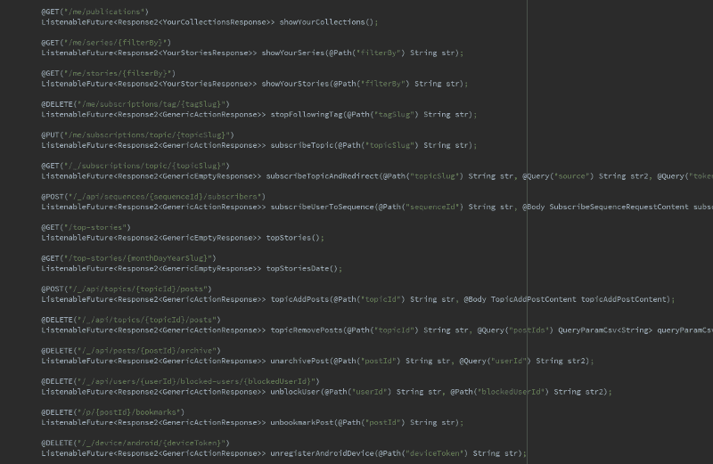

# 缓存欺骗:我如何在 Medium 中发现一个漏洞并帮助他们修复它

> 原文：<https://www.freecodecamp.org/news/cache-deception-how-i-discovered-a-vulnerability-in-medium-and-helped-them-fix-it-31cec2a3938b/>

尤瓦尔·什普林茨

# 缓存欺骗:我如何在 Medium 中发现一个漏洞并帮助他们修复它

I drew that masterpiece myself

在我的[上一篇文章](https://hackernoon.com/dont-publish-yet-reverse-engineering-the-medium-app-and-making-all-stories-in-it-free-48c8f2695687)中，我试图展示逆向工程 Android 应用程序是多么强大和酷。我是通过展示如何修改 Medium 的应用程序来做到这一点的，这样所有会员需要的故事都可以免费获得。

嗯，故事还有点复杂:)

在努力实现我的预期目标时，我发现了大量的 API 端点，Medium 在它们的代码中声明了这些端点，经过短暂的迭代后，这些端点暴露了一个明显的缓存欺骗漏洞。我对这一发现感到特别兴奋，因为基于缓存的攻击异常可怕，这本来可以成为我的故事的一个很好的补充。

不幸的是，它花了媒体三个月的时间和一对夫妇的提醒作出回应，所以我不得不等待公开披露了一点。

在这篇文章中，我将尝试直观地解释什么是缓存欺骗，描述 Medium 的错误，并引用两篇关于基于缓存的攻击的优秀文章。

### 缓存欺骗

Web 浏览器缓存服务器的静态响应，这样它们就不需要再次请求它们，从而节省了时间和带宽。

类似地，服务器和 cdn(例如内容交付网络，Cloudflare)也缓存响应(它们自己的响应)，因此它们不需要浪费时间再次处理它们。CDN 可以立即向客户端返回响应，从而减少服务器负载和响应时间，而不是将 CDN 已经知道其响应的请求(即静态图像)传递给服务器。

当服务器缓存静态响应时，每个人都从中受益。但是当服务器缓存包含一些敏感信息的非静态响应时会发生什么呢？从现在开始，服务器将开始向每个人提供缓存的响应，因此，其中的任何敏感信息都是公开的！

这就是所谓的缓存欺骗——利用配置不当的缓存规则，让服务器缓存敏感数据。例如，敏感数据被缓存后，攻击者可能会回来囤积这些数据。

### 缓存用户配置文件

Medium 使用库改进将他们的 HTTP APIs 转换为 Android 应用程序的 Java 接口，因此基本上每个端点都很好地位于代码中，并指定了所有可用的参数。我将它们全部提取到一个列表中，最终大约有 900 个端点。

Some extracted endpoints

这个列表是一个真正的宝藏，所以我不能阻止自己花一些时间来重复它。除此之外，我还寻找以用户控制的输入结尾的 URL，因为缓存服务有一个常见的错误配置，即缓存每个看起来像文件的资源路径。请记住，我们的目标是找到既包含敏感信息又被 Medium 的服务器缓存的端点。因此，找到一个正在被缓存的 API 端点将会非常好。

事实证明，Medium 确实缓存了默认情况下看起来像文件的路径，但只针对站点根目录下的资源，如`https://medium.com/niceImage.png`这样的 URL。

幸运的是，我漂亮的列表包含一个满足上述需求的端点— **用户资料页面**。通过将我的用户名设置为“yuval.png”，我的个人资料页面网址就变成了`https://medium.com/@yuval.png`，当有人访问时，它的响应会在那里缓存一段时间(4 个小时，然后服务器就把它丢弃了)。这实际上是整个错误，设置用户名以文件扩展名结尾——以使个人资料页面被缓存。

从访问我的个人资料页面的缓存响应中可以提取哪些敏感信息？

*   CSRF 代币。这些都嵌入在返回的文档中。([跨站请求伪造简单的话](https://stackoverflow.com/a/33829607)
*   查看我的个人资料的人的信息。还可以从返回的文档中提取当前登录的用户。

事实上，每个缓存的响应存在 4 个小时，并阻止其他响应被缓存，这不是问题，因为通过使用一个简单的脚本，用户名可以重复更改(并生成尚未缓存的新 URL)。

请注意，如果用户重复输入“阻止用户”选项(再次使用脚本)，他们也可能会在自己的个人资料页面上隐藏该选项。这样做是可行的，因为用户无法选择在自己的个人资料中阻止自己，所以当他们收到为帐户所有者创建的缓存响应时，其他人也不会有这样的选择。

### 报告时间线

我把我的报告通过他们的昆虫赏金计划发给了 Medium，这是时间表:

8 月 24 日——发送了我的初步报告，并收到了一封自动发送的电子邮件，邮件中说 Medium 将尝试在 48 小时内回复我。

9 月 14 日—询问他们是否有不清楚的地方，因为他们还没有回复。

11 月 1 日——发布了另一条消息，说如果我的报告被拒绝，我没意见，并要求回应，这样我就知道他们收到了。

11 月 20 日—媒体的回应！为迟到道歉，奖励我的虫子 100 美元和一件衬衫。

我猜他们花了一段时间，因为缓存欺骗不是人们通常报告的那种错误——但我只是希望得到快速的回应，要求我更多的解释或什么的。我以为没人在看他们的收件箱。

这个 bug 只被奖励了 100 美元，因为 Medium 的程序很小，而不是因为它很烂

### 基于缓存的攻击—进一步阅读

基于缓存的攻击早已为人所知，但在 Omer Gil 和 James Kettle 最近出版的两部杰出作品之前，人们大多认为这只是理论上的。如果你觉得这个主题很有趣，不要错过这些:

#### [网络缓存欺骗攻击](http://omergil.blogspot.com/2017/02/web-cache-deception-attack.html) — Omer Gil，2017 年 2 月

在 PayPal 上演示时，Omer 称这种新的惊人的攻击载体为缓存欺骗。

#### [实用网页缓存中毒](https://portswigger.net/blog/practical-web-cache-poisoning) —詹姆斯·凯特尔，2018 年 8 月

缓存中毒多年前就已为人所知，但通过发表他的广泛研究，詹姆斯使其变得可行。请查看他的后续文章，主题为“[绕过 Web 缓存中毒对策](https://portswigger.net/blog/bypassing-web-cache-poisoning-countermeasures)”。

下次见…
？？？