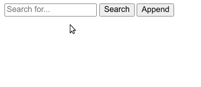

# 不能将输入值传递给 JavaScript 变量

> 原文：<https://www.freecodecamp.org/news/cant-pass-an-input-value-into-a-javascript-variable/>

想象一下下面的场景——你有一个简单的输入和一个按钮。当用户在输入中键入内容并按下按钮时，来自输入的文本应该被记录到控制台。

这是你目前掌握的情况:

```
<input id="search" placeholder="Search for..."></input>
<button value='send' id="submit" onclick="myFunction()">Search</button>

<div id="alpha"></div>
```

```
function myFunction() {
  const test = document.getElementById("search").value;
}

console.log(test);
```

但是当你加载页面时，你会在控制台中看到`Uncaught ReferenceError: test is not defined`。

这是怎么回事，为什么不能在`myFunction`之外访问`test`变量？

## JavaScript 中的范围

你不能在`myFunction`之外访问`test`的原因是由于[范围](https://developer.mozilla.org/en-US/docs/Glossary/Scope)。描述范围的另一种方式是上下文。

因为`test`是在`myFunction`中定义或创建的，所以它只在`myFunction`本身的上下文或范围内可用。试图在`myFunction`之外登录`test`会导致错误。

换句话说，`test`变量是函数作用域的，只能从`myFunction`内部记录。

解决这个问题的一个简单方法是从`myFunction`中记录`test`。然后，每当按下按钮时，输入的当前值将被记录到控制台:

```
function myFunction() {
  const test = document.getElementById("search").value;
  console.log(test);
}
```

你可以在这里阅读更多关于 JavaScript 中作用域的内容:[JavaScript 中作用域的介绍](https://www.freecodecamp.org/news/an-introduction-to-scope-in-javascript-cbd957022652/)

## 如何在函数外部访问变量

虽然不可能从定义变量的函数之外直接访问函数范围内的变量，但是有一些方法可以在程序的其余部分使用`test`的值。

### 将`test`的值存储为全局变量

全局作用域是程序的最顶层，在所有其他函数之外。全局范围内的变量在程序的其余部分都是可用的。

因此，使`test`随处可用的一个简单方法是将其保存为一个全局变量。例如:

```
let test = '';

function myFunction() {
  test = document.getElementById("search").value;
}

function myOtherFunction() {
  console.log(test);
}
```

然后，当调用`myOtherFunction`时，您将能够访问`test`的值。但是这是假设输入中已经有一些文本，并且在`myOtherFunction`之前调用了`myFunction`，它设置了`test`的值。

这就是对异步 JavaScript 的扎实理解派上用场的地方。在本文中阅读更多关于它的内容:[异步 JavaScript 的发展:从回调，到承诺，再到异步/等待](https://www.freecodecamp.org/news/the-evolution-of-async-javascript-from-callbacks-to-promises-to-async-await-e73b047f2f40/)

### 从函数返回测试

从定义它的原始函数外部访问`test`的另一种方法是简单地从该函数返回它。然后，当您从另一个函数调用它时，您将可以访问`test`。

然后，您可以创建另一个按钮，将`test`的值附加到页面上，并将`myOtherFunction`附加到该按钮上。

例如:

```
<input id="search" placeholder="Search for..."></input>
<button value='send' id="submit" onclick="myFunction()">Search</button>
<button value='append' id="append" onclick="myOtherFunction()">Append</button>

<div id="alpha"></div>
```

```
function myFunction() {
  const test = document.getElementById("search").value;
  return test;
}

function myOtherFunction() {
  const myDiv = document.getElementById("alpha");
  myDiv.innerText = myFunction();
}
```

这就是它的作用:

