# 职业转换者如何获得你梦想中的技术工作

> 原文：<https://www.freecodecamp.org/news/career-switchers-guide-to-your-dream-tech-job/>

在这篇文章中，我将讨论一些专业建议，帮助你在理想公司的面试中脱颖而出，充分利用你的工作机会。

# 简介——从华尔街到谷歌总部

2019 年 3 月 31 日，我被一家初创对冲基金裁员。在过去的 10 多年里，我一直是金融行业的定量软件开发人员，我不想再做同样的工作。我开始追随我的激情，并在人工智能、机器学习和深度学习领域找到我的下一份工作。

在接下来的 6 个月里，我朝着这个目标努力工作。到 2019 年 9 月，我有多个与机器学习相关的现场面试和要约，包括来自谷歌和脸书的要约。

我是这样做的。希望它能鼓励和帮助其他潜在的职业转换者进行这种转变。你换工作的回报可能是双重的，智力上和经济上。

The Googleplex: Google’s Worldwide Headquarters

# 文章摘要

如果你时间不够，这里有一个对我有效的快速 5 步食谱。

*   **:做一个你热爱的项目，并在网上展示**
*   ******学习**** :集中练习算法和数据结构编码和系统设计问题**
*   ****:利用多种渠道落地面试****
*   ********面试**** :在电话和现场面试中保持冷静****
*   ******谈判**** :在谈判报价和组队时知道自己想要什么**

**如你所见，这是一个简单的 5 步食谱。然而，完成每一步都需要大量的**努力工作**。详情请继续阅读。**

# **[关于我](https://www.linkedin.com/in/dctian)**

**这里有一点关于我的，因为我认为这个指南对和我有相似背景的人最有帮助。**

**换句话说，我是一名在非技术行业工作的经验丰富的软件工程师/开发人员，我希望跳槽到西海岸(旧金山湾区或西雅图)的一家顶级技术公司。**

**如果你没有软件工程工作经验，上面的食谱应该对你仍然有效。你只需要比有编码经验的人更加努力地工作。**

**我毕业于加拿大滑铁卢大学，是一名计算机工程师。在我早期的职业生涯中，我是微软和甲骨文的软件工程师。然后我在读完 MBA 后转行进入了量化金融行业。**

**在过去的 10 多年里，我在美国银行、瑞士联合银行、Citadel 和一些小公司担任定量开发人员/分析师。但是从 2016 年开始，当我第一次偶然发现机器学习(ML)和深度学习的时候，我就爱上了它。我知道我最终想要一份人工智能/人工智能领域的工作。**

**2019 年 4 月，我开始了这次转行的全职准备。下周我将搬到湾区，加入人工智能和人工智能领域的领导者之一谷歌。**

**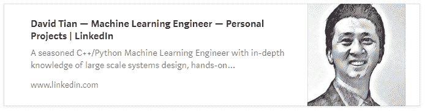

[https://www.linkedin.com/in/dctian](https://www.linkedin.com/in/dctian)** 

# **成功的 5 个简单步骤**

## **第一步:策划——做一个很酷的项目并展示出来**

**2019 年 2 月，我的好朋友伊戈尔鼓励我创建一个很酷的项目并写下它。当时，我没有任何好主意。我从未在网上发表过任何东西，也不知道从哪里开始。**

**但在 4 月初，当我和家人在墨西哥度假时，一天晚上我突然有了一个启示，我想制造一辆自动驾驶汽车。鉴于我之前没有机器人或电子方面的经验，我开始建造一辆可以在我的客厅里运行的[深度学习/自动驾驶机器人汽车 DeepPiCar](https://towardsdatascience.com/tagged/deep-pi-car) 。**

**一个月后，在我成功制造了自动驾驶汽车后，我开始写一篇关于走向数据科学的 6 篇博文，教别人如何制造一辆汽车。**

**几周之内，我的博客就收到了超过 10，000 次的浏览，全世界读者的反应是压倒性的。我觉得我两个月的辛苦工作——一个月造汽车，另一个月写博客——非常值得。** 

**

DeepPiCar running in my living room** 

**然而，我并没有意识到它对我职业生涯的全面影响，直到我参加面试并提供团队匹配电话，面试官问我“你为什么想从目前的行业跳槽？”我准备好了谈话要点！**

**我不仅能够告诉他们我对 AI/ML 的热情，而且当我从背包中拿出我的车(是的，实际上是**机器人车)并把它放在面试官手中时，我可以从他们的眼中看到兴奋！他们中的许多人甚至说他们愿意和他们的孩子一起制造这样一辆车。****

**然后我告诉他们，我已经在网上发布了完整的带源代码的分步说明(在我的简历中有链接),供他们遵循。我很确定他们不会在事后把我的简历放进回收站。；-)**

**我的一些朋友让我推荐一些好的项目。以下是我的一些建议:**

*   **如果你想过渡到前端开发，创建一个与流行的开源框架有很多交互性的酷网站，比如 [React](https://reactjs.org/) 和 [Angular](https://angular.io/) 。**
*   **如果你对服务器端开发感兴趣，尝试使用分布式服务器技术创建一个网络爬虫或搜索引擎，如[卡珊德拉](http://cassandra.apache.org/)、[动物园管理员](https://zookeeper.apache.org/)、 [Memcached](https://memcached.org/) 和[弹性搜索](https://www.elastic.co/webinars/getting-started-elasticsearch)等**
*   **如果你对移动设备感兴趣，试着创建并发布一个苹果/安卓应用。注意，在苹果的 App Store 上发布一个应用，要比谷歌的 Play Store 花的时间长得多。**
*   **如果你对 AI/ML 感兴趣，就拿现有的计算机视觉或者自然语言处理深度学习模型中的一个，试着用它做一个产品出来。比如我拿了一个预先训练好的[物体检测模型 SSD](https://arxiv.org/abs/1512.02325) ，把它改装成我的 DeepPiCar 的交通标志检测器。如果你是人工智能/人工智能的新手，一定要阅读 DeepPiCar 的[第 1 部分，在那里我列出了几个人工智能课程和资源来帮助你入门。](https://towardsdatascience.com/deeppicar-part-1-102e03c83f2c?source=---------5-----------------------)**
*   **如果你对机器人感兴趣，试着用树莓 Pi 或 Nvidia Jetson Nano 制造一些很酷的机器人。一定要用新的[树莓派 4](https://www.raspberrypi.org/products/raspberry-pi-4-model-b/) 或者[杰特森纳米](https://developer.nvidia.com/embedded/jetson-nano-developer-kit)。Raspberry 被制造商更广泛地使用，并享有更好的支持，而 Jetson Nano 板载 GPU，因此它可能更适合[深度学习项目](https://www.sparkfun.com/products/15365)。**
*   **如果你没有任何项目想法，不要绝望。你可以随时为上面提到的开源项目做出贡献，如果你对 AI/ML 感兴趣，还可以为 TensorFlow 或 T2 py torch 做出贡献。你可能认为你需要成为一名专家来为这些众所周知的开源项目做贡献。你没有。实际上，在每一个开源项目中，都有相当多的小特性和简单的 bug 修复是为新手们设计的。这样，在处理更复杂的问题之前，您可以熟悉代码库和提交过程。**

**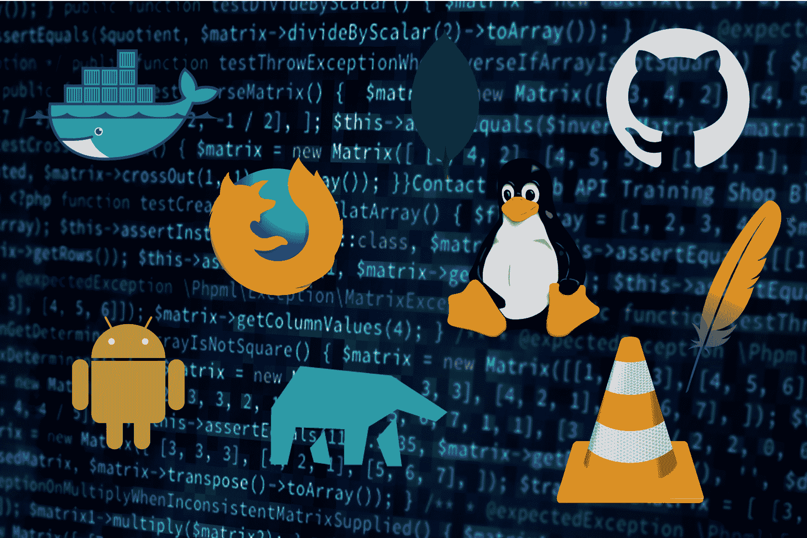

Top Open-Source Projects** 

**一旦你完成了你的项目，一定要让全世界都知道它！你只要在 GitHub 上发布你完成的代码就够了吗？不要！因为大多数人更喜欢先阅读关于你的代码做什么的博客。**

**漂亮的、精心制作的博客是你项目的绝佳营销材料，更重要的是，对你来说！**

**是的，用漂亮的图片和图表写精美的博客需要很长时间。我花了整个五月的时间写了 6 篇文章。我估计总共大约 200 小时或 30 小时/篇。如果你是全职工作，也许可以写一篇写得很好的博客，作为你项目的概述。**

**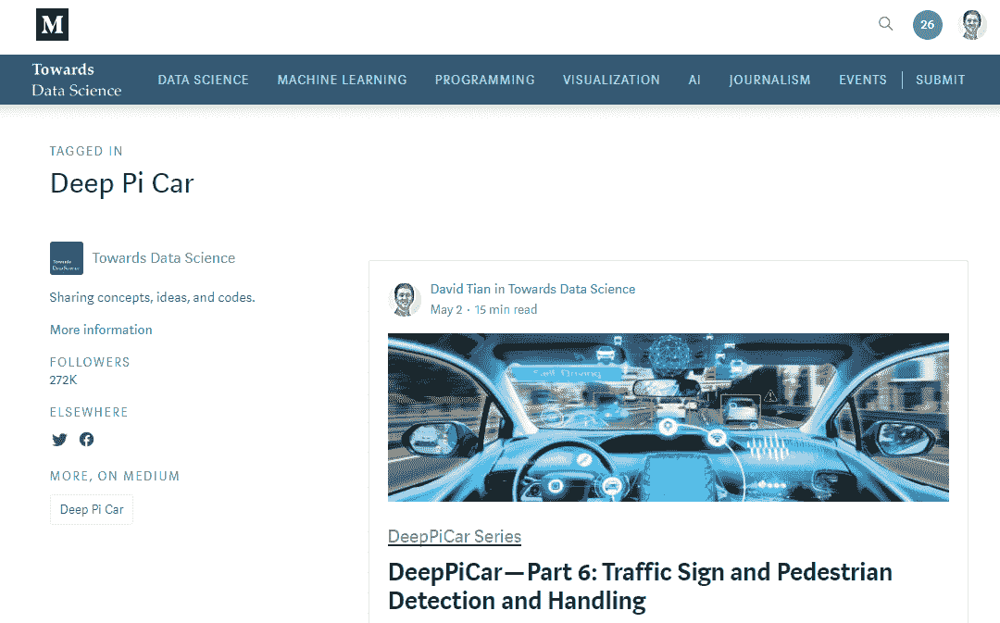

DeepPiCar’s Blog Series** 

**要记住的一点是，你必须享受你正在做的事情，而不是仅仅为了找到一份工作而去做这个项目。如果你对你所建立的东西有热情，当你和面试官交谈时，它会闪耀出来。**

## **第二步:努力学习，聪明学习**

### **算法和数据结构**

**如果有一项技能是你需要在技术面试中掌握的，那就是算法和数据结构(A&DS)编码技能。不管你面试的是大公司还是小公司，他们都会询问你的编码技能，尽管大多数公司不会在意你使用哪种编程语言。**

**我最喜欢的编程语言是 C++和 Python，但是对于编码面试，我推荐 Python。它非常简洁，与非常冗长的 C++相比，你可以用这么少的代码行做这么多的事情。有大量的资源可以让你为 A&DS 做好准备。我使用了以下资源:**

**[****破解编码面试书** **(CtCI)****](https://amzn.to/2LLxmSm) :这本书大约 700 页，仅售 30 美元。如果您需要重温一下& DS 概念，这是一个极好的起点。除了概念之外，它给出了一系列带有完整解决方案的从简单到中等水平的练习题。我花了大约 2 到 3 周的时间在这上面，花了 1 到 2 整天在每一个与 DS 相关的章节上。我跳过了数学/脑筋急转弯/OOD/C++/Java/SQL 的章节，因为它们与 DS 无关。**

**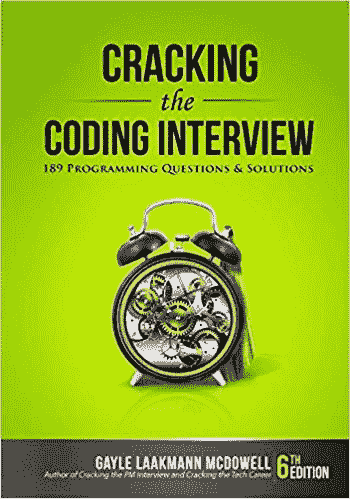**

****:我也大量使用了 LeetCode (LC)，因为我觉得 CtCI 没有给我足够的练习。Leetcode 可能是最全面和最有组织的编码面试问题的在线数据库，拥有超过 1000 个简单、中等和困难的问题。每个问题都有一个唯一的编号。(例如 LC#1 是 TwoSum)很多网上的帖子只是简单地把自己的面试问题称为 LC #xxx，而不是把整个问题打出来。****

****我强烈建议每月花费 30 美元注册 LeetCode Premium，因为它可以让您访问所有的 LC 问题和解决方案。我觉得这很有帮助，我注册了 99 美元的年度会员，因为我认为这是“我大脑的健身房会员费”****

****我完成了 100 多个 LeetCode 问题(35 个简单，60 个中等，14 个困难)。我的实际面试问题中，大约 90%或者它们的细微变化都可以在 LeetCode 上找到。大多数情况下，直到事后我才知道它们来自 Leetcode。但是由于我练习了足够多的 LC 中等题，我能够解决相同难度的问题。最后，我觉得我永远做不够 LC 中等题，因为直到今天，我仍然在一些 LC 中等题中挣扎。****

****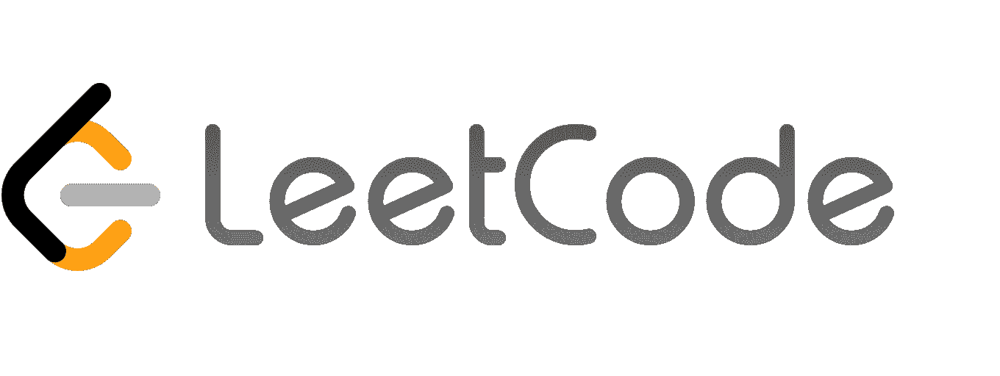****

****[****图沙尔罗伊的 LeetCode 硬解****](https://www.youtube.com/watch?v=l3hda49XcDE&list=PLrmLmBdmIlpuE5GEMDXWf0PWbBD9Ga1lO) :图沙尔其实是苹果公司的一名工程经理。他在还是软件工程师的时候就制作了这些视频。我想说，观看他的视频不仅教会了我这些算法，还教会了我如何 ****清晰地呈现**** 复杂的想法/算法。当我在现场面试中做白板编码时，这对我帮助很大。****

**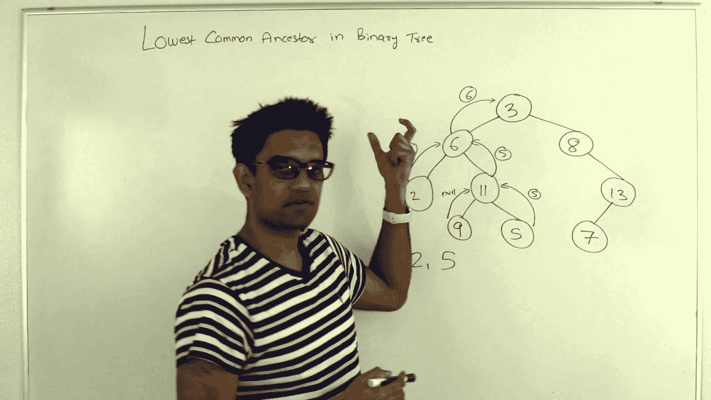**

**请注意，大多数面试官会给 LC 中等水平的问题，因为要求某人在 20-30 分钟内解决中等问题是非常公平的。我建议在你第一次电话面试之前，至少做 20 个简单的和 30 个中等难度的问题。我在完成 CtCI 的书之后和开始 LC 之前做了我的第一次电话采访，并立即被屠杀。**

**此外，我还为每个练习题计时，就好像我在面试一样。然而，我使用了一个 IDE，带有自动完成功能和一个调试器。你不会在实际的面试中得到这些，所以我通常会在练习时设置更严格的时间限制，大约 30 分钟/问题，而不是 45 分钟。您可以选择仅使用常规的文本编辑器甚至白板来模拟真实的测试环境。看你个人喜好了。**

### **系统设计**

**你需要掌握的第二重要的技能是系统设计。通常，一次现场面试会要求你设计一个大型分布式系统，比如网飞视频服务系统，或者 WhatsApp 即时通讯系统，或者 Instagram stories 等等。**

**这项测试是软硬技能的混合。这是一个很难的技能测试，因为你需要了解很多常用的分布式系统组件，如分布式数据库、分布式内存缓存、分布式配置管理器、分布式文件存储和分布式搜索引擎等。，以及何时是使用它们的正确时机。**

**这也是一个软技能测试，因为你需要能够画出清晰的图表来说明你的设计，并口头讨论和辩护你的设计。有人告诉我，如果你通过现场面试，系统设计面试会严重影响你获得的职位级别(也就是说，它可能会决定你获得的是四级还是五级工程职位)。**

**以下是我使用的资源:**

*   ****
*   ****[****高拉夫·森的系统设计 YouTube 频道****](http://youtube.com/watch?v=quLrc3PbuIw&list=PLMCXHnjXnTnvo6alSjVkgxV-VH6EPyvoX) :看完 CtCI 的系统设计章节，感觉很没有成就感。然后偶然发现了高拉夫的频道，里面有 22 个视频。我把他所有的视频下载到我的笔记本电脑上，在漫长的飞机旅途中观看。伙计，这家伙太好了(而且很有趣)，把事情解释得这么清楚！大约 10 个视频是对单个分布式系统组件的深入描述，其余的是关于如何构建网飞、Tinder 或脸书系统等的实际用例讨论。****

**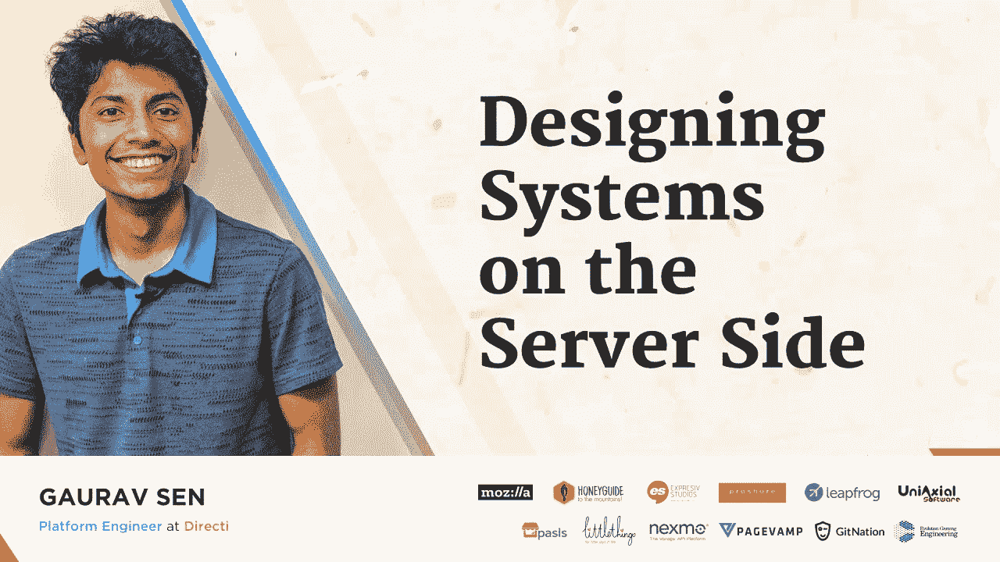**

*   **[****图沙尔·罗伊的系统设计视频****](https://www.youtube.com/watch?v=UzLMhqg3_Wc&list=PLrmLmBdmIlps7GJJWW9I7N0P0rB0C3eY2) ****:**** 虽然图沙尔非常擅长 LC 难题，但他也有 5 部出色的系统设计视频。我建议在 Gaurav 之后看这些视频，因为 Gaurav 为您提供了系统设计的坚实基础，而 Tushar 的视频则提供了一些这方面的知识。**

**就我个人而言，由于我以前从事过相当多的分布式系统工作，所以即使我没有使用过上面视频中提到的一些新技术，我也能够很快地掌握总体思路。看了足够多的视频后，我能够将大多数分布式系统归纳为以下几层:**

*   **客户端(PC/移动应用程序、浏览器)**
*   **处理客户端请求的分布式负载平衡器**
*   **基于位置的内容交付网络(CDN)或内存缓存，可将大量相对静态的内容(视频和图像)快速交付给地理位置更靠近 CDN/缓存的客户端。**
*   **一系列处理各种业务逻辑的微服务，如认证、服务/保存用户内容、在用户之间传递消息。**
*   **微服务之间的通信通过分布式消息传递系统发送。**
*   **保存用户内容和消息的分布式数据库。或者，在数据库之前添加一个分布式缓存层，以提高读/写吞吐量。**

### **行为问题**

**我认为行为问题是面试中最容易的部分。不幸的是，他们在面试评估中也是分量最少的。果不其然，科技公司知道，在行为面试中，摆出“好人”的形象，说正确的话是很容易的。但是训练自己成为一名优秀的程序员要困难得多。**

**对于职业转换者来说，要准备的最重要的问题当然是，“你为什么想换行业？”希望有了你在第一步中建立的项目，你可以通过展示你的项目和你对新行业和你申请的公司的热情来解决这个问题。**

****

**以下是一些需要准备的其他行为问题:**

*   **你为什么想为我的公司/集团工作？**
*   **举一个你达成的目标的例子，告诉我你是如何实现的。**
*   **举例说明一个你没有达到的目标，以及你是如何处理的。**
*   **描述一下工作中的压力情况，以及你是如何处理的。**
*   **你有没有遇到过没有足够工作可做的情况？**
*   **你犯过错误吗？你是怎么处理的？**
*   **描述一个你和同事/老板/下属意见不合的情况，你是如何处理的？**

**所有行为问题的关键是以积极的方式结束。例如，即使你被问及与同事的分歧或事业上的失败，也要如实描述发生了什么，但更重要的是提及你从中吸取了什么教训。谈谈当类似的情况再次出现时，它如何帮助你成为一名更有效的团队成员/工程师。**

## **第三步。通过多种渠道申请**

**6 月初，就在我在 DeepPiCar 上发表博客之后，我开始密切关注湾区的 ML 工程师就业市场。与此同时，我开始了我为期一个月的密集全职编码准备(总共约 200 小时)。**

**到了六月底，尽管我还没有完全准备好，我还是开始向公司申请。原因是在我投简历和电话面试之间有 1-2 周的准备时间。通过多种渠道，我联系了 20 多家公司，进行了 30 多次电话采访。有时候同一个公司的多次电话面试。**

### **简历——首先列出相关的内容**

**我不会过多讨论简历写作，因为已经有很多关于简历写作的好文章了。我的重点是如何从职业转换者的角度来做这件事，这样招聘人员就能很快发现你非常适合新的行业/工作职能。**

**请记住，我正从金融领域的 quant 开发人员转变为技术领域的 ML 工程师——所以这是双重的棘手问题，因为这既是角色的转变，也是行业的转变。再次，我的项目来拯救。我把它们列在我工作经历的顶部，作为“个人项目”。是的，尽管它们不完全是“工作”，但它们是我的工作，并且与我下一份工作的目标高度相关。**

**你应该知道大多数招聘人员不会看简历的第一页。如果他们不能在 10-20 秒内找到他们想要的关键词，你的简历就会被扔到一边。我还在简历第一页的上半部分列出了与新工作相关的技能(以及所有关键词)。见下文。**

**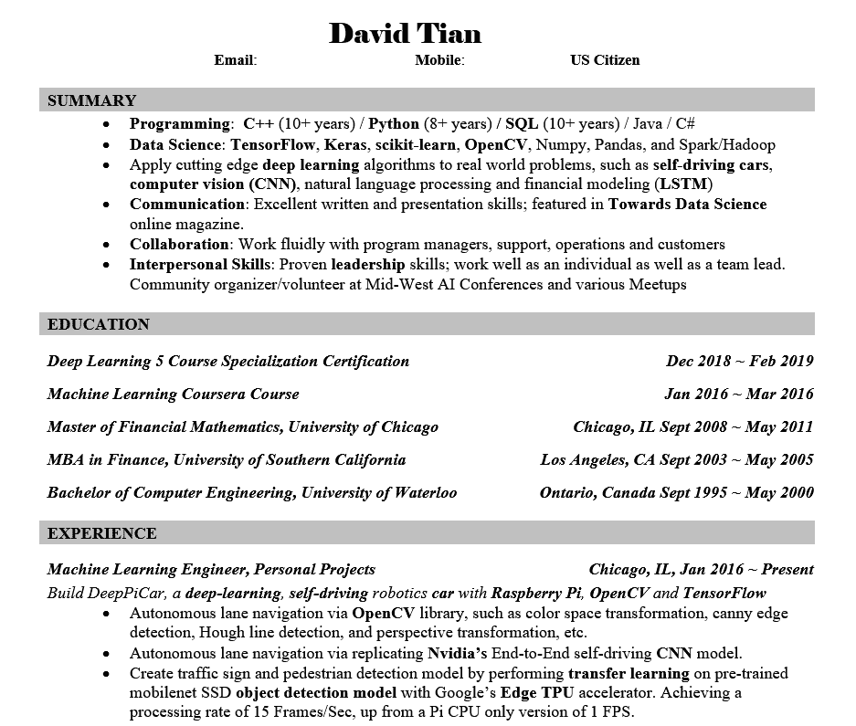**

**LinkedIn——让他们来找你！**

**最好的求职申请是那些你永远不必寄出的申请。在我在 LinkedIn 上发布了我的 DeepPiCar 博客帖子之后，我很兴奋地收到了这么多来自招聘人员的消息/电话，包括一些大型自动驾驶公司的消息/电话，问我是否对他们的 ML 工程师角色感兴趣。**

**我对媒体博客和 LinkedIn 帖子的力量感到惊讶。但是一定要在 LinkedIn 的隐私设置中将自己标记为“对机会开放”，这样招聘人员就可以很容易地找到你。当招聘人员联系我时，我几乎总能得到一次电话面试。**

**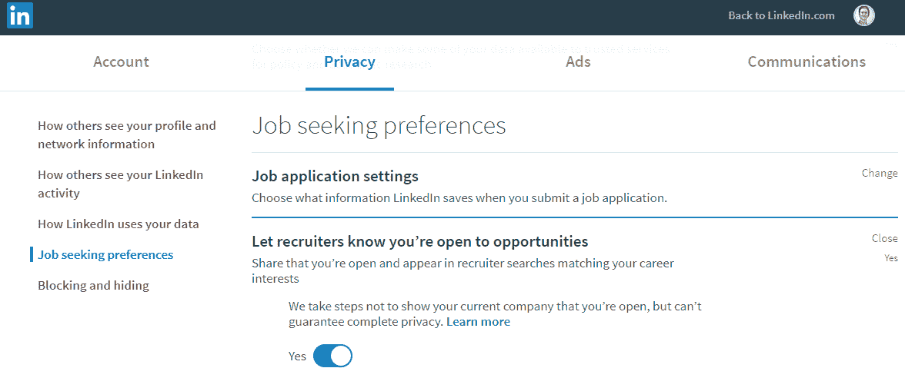**

**内部推荐——有一个强有力的倡导者**

****

**我认为第二好的工作申请是由内部推荐提交的。我在脸书和谷歌都有一个内部推荐人。我第一次脸书面试失败得很惨，但因为我的推荐人给了我一份强有力的推荐信，脸书提出让我再试一次。幸运的是，一个月后我通过了第二次电话筛选。**

**对于谷歌，这甚至更令人惊讶。部分是因为我的强烈推荐，部分是因为我告诉他们我还有其他现场面试，他们直接跳过我去现场面试，尽管我是一个远程候选人(顺便说一下，我住在芝加哥)。**

**所以我建议你找任何一个在你想加入的科技公司工作的家庭成员/朋友/同学。如果他们都不在那里工作，也许他们知道谁在那里工作。请让你的朋友把你介绍给他们，也许让他们通过内部推荐提交你的简历。这样你获得电话面试的机会就高多了。**

**另一个方法是明智地使用你的 LinkedIn 网络。你可以寻找在特定公司工作的人，并请你们共同的朋友介绍你们俩认识。如果没有，给这个人发一封 LinkedIn 邮件。**

**注意，如果你发送大量 LinkedIn 邮件，你需要 LinkedIn Premium。我注册了大约 3 个月的 LinkedIn Premium(大约 30 美元/月)，能够直接与更多的人联系。一些联系导致了面试。附带的好处是，我收到了比以前更多的招聘信息，因为我相信 LinkedIn 算法将我排在了非付费用户之前。**

### **第三方招聘机构**

**总的来说，我觉得这次大多数第三方机构都没有很好地为我找工作。作为参考，当我过去寻找金融工作时，我专门使用高管猎头公司，结果很好。但大多数科技巨头都不使用第三方招聘机构。唯一对我有效的代理是 [TripleByte](https://triplebyte.com/iv/Wzwz8pq/cp/header) 和 [DeepLearning.ai](http://deeplearning.ai/) ，我将在下面讨论。**

### **三字节 —跳过电话面试**

**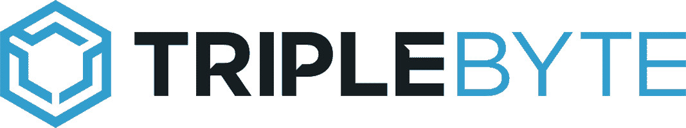**

**TripleByte 是一家独特的招聘机构。它对候选人的吸引力在于，一旦候选人通过 TripleByte 全面的 2 小时现场技术筛选测试，他们就可以直接去许多公司现场工作。它对公司来说也很有吸引力，因为 TripleByte 为他们淘汰了大多数弱候选人，为他们的工程师节省了几个小时的电话筛选时间。**

**当我通过 TripleByte 的测试时，我可以从大约 200 家公司中进行选择。他们大多是小型创业公司，但也有不少大公司，如苹果、Adobe、美国运通等。最后面试了[苹果 Siri 组](https://www.apple.com/siri/)(大) [Zoox](https://zoox.com/) (中) [Determined.ai](https://determined.ai/) (小)现场。他们都在做惊人的工程工作。**

**我强烈建议通过三字节的过程，因为它确定了我的弱点，并使我免于许多小时的电话筛选和相关的头痛。[在这里参加 TripleByte 的在线测试](https://triplebyte.com/iv/Wzwz8pq/cp/header)。**

### **[DeepLearning.ai](http://deeplearning.ai/) 和[worker a . ai](http://Workera.ai)——有抱负的数据科学家/ML 工程师的福音**

**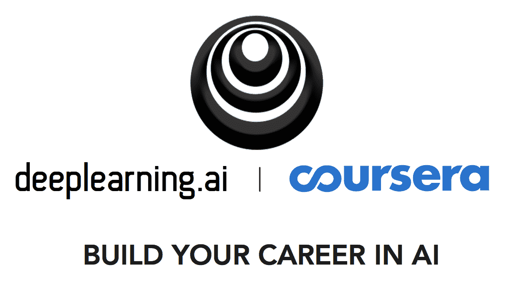**

**如果你是一名有抱负的数据科学家/ML 工程师，你一定听过或上过吴恩达的机器学习/深度学习课程之一，由 Coursera/Deep Learning.ai 提供**

**其实 DeepLeaning.ai 有两部分:一部分是教育，大家都很了解，另一部分( [Workera.ai](http://workera.ai/) )是招聘，大家都不太了解。那是因为 Workera.ai 相当新，2019 年年中才开始。他们没有 TripleByte 那么多附属公司，但我相信他们正在迅速加大这方面的努力。他们还会让你做个测试。**

**Workera.ai 和 TripleByte 的测试之间的差异有两个方面。首先，它是为数据科学家(DS)/ML 工程师设计的测试，其中 TripleByte 为一般软件工程师和 ML 工程师设计了测试——ML 工程师测试是全新的。**

**第二，Workera.ai 测试没有约束力，这意味着通过测试不会让你直接进入现场面试。相反，Workera.ai 会把你介绍给一些下属公司的 DS/ML 团队，并把你带到队伍的最前面。但是你还是要经历整个电话/现场面试的过程。**

**我觉得它仍然非常有价值，因为吴恩达在湾区深度学习领域的声誉和网络相当广泛。我最后采访了 Pinterest 和 T2 的 ML 团队。如果我直接申请的话，我想我不会得到任何一家公司的面试机会。[点击此处申请 Workera.ai 的资深工程师人工智能项目](https://workera.ai/candidates/)。**

### **在线求职公告板——不要过分依赖它们**

****

**为了扩大搜索范围，我还在 LinkedIn、GlassDoor、Indeed 和 ZipRecruiter 等一些在线求职网站上设置了求职提醒，这样只要有符合我搜索标准的新职位发布，它们就会通知我。随着时间的推移，我确实在申请后接到了一些电话面试。**

**总的来说，我发现信噪比有点低，这意味着我会收到很多日常电子邮件，但很少有顶级公司的好工作职能。但是不要完全忽略这个渠道。最初你需要广撒网，也许你会通过这条渠道抓到一些鱼**

### **直接应用—实际上不起作用**

**在过去，人们会给公司寄一封漂亮的附有简历的求职信，并期望得到人力资源部的回复。但是这一次，这种方法对我完全不起作用！**

**我确定了大约 10 家我想去工作的公司(大多是自动驾驶汽车公司)，并直接在他们公司的网站上申请，在职业页面下。令我惊讶的是，我没有收到任何回复，甚至没有一封拒绝邮件！**

**幸运的是，在网上申请每家公司并不需要那么长时间。我会说，仍然适用于任何你感兴趣的公司，但不要屏息等待回音。**

### **分阶段申请工作**

**试着申请一些你不太感兴趣或者你认为在第一阶段更容易进入的公司。然后在稍后阶段申请你梦想的工作/公司。如果你得到了工作机会，你可以利用第一阶段来练习、提高，甚至利用这些机会从你梦想中的公司获得更好的工作机会。**

**这听起来可能很有争议，似乎是一种非常“唯物主义”的方法，但想想看:许多人会在一家声望较低的公司工作，计划获得经验，然后在几年后进入一家更有声望的公司。谁知道呢，如果你没有得到你梦想中的工作，至少你有一些机会可以从你的第一阶段公司中选择。**

### **变得有条理:记一本日志**

**当你通过这么多渠道申请时，很难跟踪你申请了哪些公司，以及你在每个公司处于哪个阶段。**

**为了帮助解决这个问题，我保留了一份详细的采访日志。它由面试阶段(申请、面试、录用、拒绝等)和公司组成。每个公司本质上都是一个页面，有背景信息和按时间顺序排列的事件列表，比如电话和面试。这样，我可以看到我申请和面试了哪些公司，这样我就可以做适当的跟进。**

**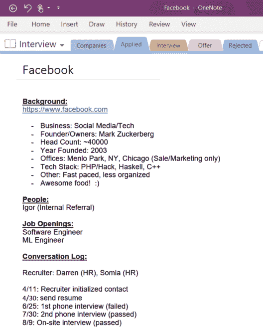**

# **第四步:面试**

## **4.1 电话采访**

### **初次人力资源电话**

**通常，与公司的第一次接触是招聘人员的电子邮件。招聘人员会问你第一次打电话的时间，这通常是一个“合适”的电话，你可以在电话中讨论你的兴趣和背景，以及为什么你非常适合这个角色。不要过分强调细节。这很可能是一个简短的电话，招聘人员会让你进入下一阶段，即技术性电话面试。**

### **在技术电话面试之前**

****

**在技术电话面试的前一两天，一定要仔细阅读 [Glassdoor](http://glassdoor.com/) 和 [Leetcode](https://leetcode.com/) 上之前为该公司询问的面试问题。对于像谷歌和脸书这样的大公司来说，这不是很好，因为有数百个以前问过的问题。**

**但对于较小的公司来说，这多少有些效果。我会浏览 Glassdoor 上的许多帖子，并抄下任何具体的技术问题。然后我会试着解决所有的问题。在电话面试中，很少会碰到网上发布的问题，但是做好这家公司过去的问题可以让你更好地准备这家公司的电话面试。**

**这类似于在参加同一个教授的期末考试之前练习往年的期末问题——问题可能不同，但问题的风格和类型是相似的。**

### **技术电话采访**

****

**技术电话面试是一个艰难的时刻。这个舞台的设计是为了把有能力的候选人和能力较差的候选人分开。我读到过，只有大约 10-20%的候选人能够通过顶级科技公司的技术电话筛选。**

**标尺仅仅是一个编码测试，而不是你说得有多好，不是你在当前工作中有多有经验，不是你知道多少编程语言，甚至不是你的个人项目。大多数面试官只是想让你用你最熟悉的编程语言完成一次编码练习。**

**我个人不太认同这是找到最好工程师的最好方式。例如，我和许多非常有经验的软件工程师一起工作过。有些是 GUI/app 开发专家，有些是 C++专家，有些是低级 Linux 专家，但他们中的许多人告诉我，他们会在定时算法和数据结构(A&DS)编码测试中惨败。**

**但既然这是城里唯一的游戏，为了打入科技行业， ****你得“破解编码面试”**** …**

**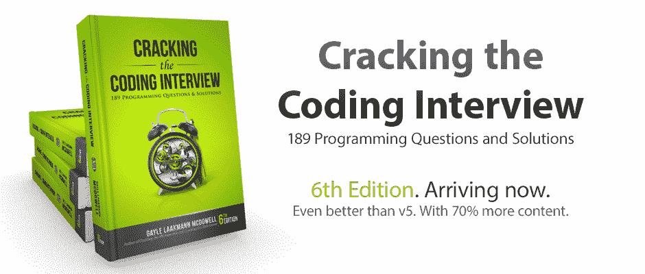**

**编码练习总是通过共享的在线记事本完成，比如 CoderPad 或 Google Docs，你和面试官可以同时输入。**

**虽然一些公司，如谷歌和脸书，只要求你写下正确的算法，不会要求你运行你的代码，但许多公司希望你在 45-60 分钟的时间内拿出完全正常工作的代码。**

**除了共享记事本，大多数公司只进行语音通话，而一些公司通过 Zoom/Skype 视频通话进行电话面试。**

**就我个人而言，电话屏幕对我来说是面试过程中最难的部分。作为参考，我只通过了大约 50%的技术电话屏幕。它们很难，因为:**

*   **45-60 分钟的时间窗口通常对我来说很紧，因为我打字不太快。(信不信由你，我在白板编码方面更快，原因我将在现场采访部分讨论。)**
*   **你需要在整个通话过程中一边与面试官交谈一边编码。大多数人，包括我自己，更喜欢先讨论一个设计/方法，然后默默的键入代码和调试。但是如果你在实施阶段 20-30 分钟不说话，那就非常尴尬了。**
*   **在线记事本是基于文本的，不是白板。所以很难画一个图表或者用图形来说明你的代码工作流程。**
*   **在线记事本不是 ide。虽然大多数在线记事本，如 CoderPad，可以进行不错的语法高亮和缩进，但它们并不是成熟的 ide。例如，他们不能自动完成单词。它们不能在你输入的时候突出明显的语法错误，当然也不支持逐行调试。所以很多时候，我不得不求助于“老忠实”的打印语句进行调试，这是非常缓慢和笨拙的。**
*   **语音通话是非可视的。当我试图在电话中解释我的方法时，我无法画出一幅画，也无法通过面试官的面部表情或肢体语言来判断我是否在正确的轨道上。**

**以下是我为克服上述困难所做的工作:**

*   ******使用好的手机耳机。**** 这应该很明显，因为你想腾出双手来编码！因此，购买一个好的蓝牙耳机，并确保在电话面试前充满电。**
*   ******尽量减少“闲聊”**** 。在我最初的几次面试中，我会努力给面试官留下一个好印象。所以我会花大约 5-7 分钟谈论我的背景，我的经历，然后是我的自动驾驶汽车。有时候，面试官会问我几个问题，可能会拖到前 10 分钟！我很快发现，所有这些“闲聊”时间占用了分配给我的 45 分钟面试时间，这意味着我有更少的时间来解决编码问题。事实上，大多数面试官只是为了评估你的编码技能，而你丰富的工作经验此时与他们并不相关。所以我学会了在开始的时候把“闲聊”缩短到不到两分钟，把我的问题留到面试的最后。事实上，如果我成功地完成了编码问题，面试官通常更愿意和我聊得比 45 分钟更久。另一方面，如果你“搞砸”了编码面试，聊天不会改变面试的结果。请注意，这条建议也适用于现场面试。**

****

*   ******使用两台显示器。**** 一台显示器用于共享记事本，另一台用于谷歌搜索和 IDE 等。现在大多数笔记本电脑都有外接显示器的端口。当你编码时，确保你的笔记本电脑至少连接了一个外部显示器，这样你就不用在窗口之间来回切换了。**
*   ******使用外接鼠标**** 。如果你使用笔记本电脑，一定要购买外置鼠标。对我来说，使用外部鼠标显著提高了我选择、复制和粘贴代码的能力。**

****

*   ******使用一个 IDE**** 。即使您是在共享记事本中编写代码，有时为了排除故障，最好还是将代码复制粘贴到您的 IDE 中，修复语法错误和 bug，然后将工作代码复制回共享记事本中。大多数面试官不会介意，只要你能在分配的时间内让代码工作。他们也想看到你成功！在你的电话面试之前，确保建立一个空的项目，在那里你可以快速粘贴代码并运行。你不想把宝贵的面试时间花在创建项目和设置运行参数上。打开 IDE 还意味着您可以在面试结束时直接粘贴代码，这样您就可以保存问题和解决方案的副本以供进一步分析。**

**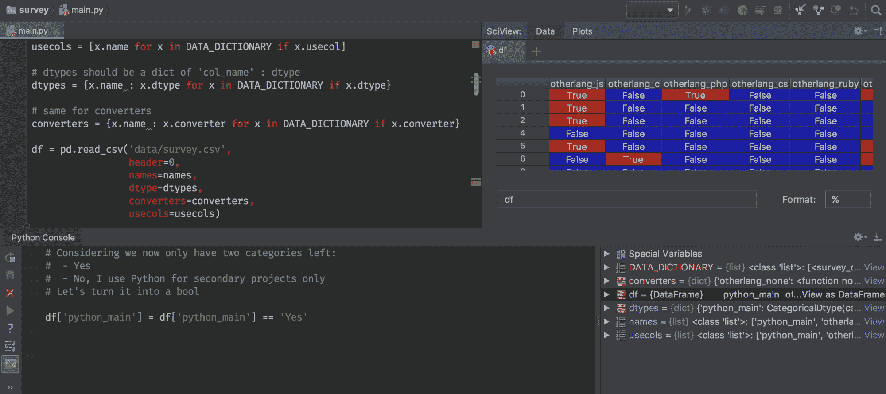**

*   ******使用一种编程语言，省去你敲**** 的麻烦。这里的大部分提示都是为了帮助你节省打字时间，这样你就可以花更多的时间考虑解决方案。所以，试着 ****选择一门只需很少打字就能做很多事情的语言**** 。我最擅长的语言是 C++和 Python。我所有的面试都选择 Python，除非面试官特别要求使用 C++，因为与 C++相比，它更具表现力。**
*   ******善用谷歌。这是电话面试相对于现场面试的一个优势，因为你可以谷歌一下！如果你不太熟悉某个函数的 API，或者某个语言的特定语法，可以随意谷歌一下。据了解，你可以在电话面试时谷歌。见鬼，如果你的面试官很懒，一字不差地从 LC 那里抓了一个问题，那么恭喜你！；-)******
*   ******在开始实施之前，与面试官彻底讨论你的方法**** 。在我最初的几次面试中，我会在对要做的事情有一个粗略的想法后开始编码，认为我可以在编码时充实细节。这不是个好主意。在你与面试官的第一次讨论中，试着说出尽可能多的细节。这个**实际上会为你以后的** 节省很多时间。面试官当然非常熟悉解决问题的所有好的和坏的方法。如果你提出一个次优的或不正确的方法，他们可能会引导你到一个更好的方法和/或指出你忘记考虑的错误/死角。这可以为您节省大量的实施时间。但是一定要尽可能多地报道你自己的关键案例，因为如果面试官不得不指出遗漏的关键案例，你会被扣分。**
*   ******解决问题胜过不解决问题**** 。当你在寻找最优解时，这句话可能不那么明显。有时，如果我不能想出最优的解决方案，我会提出并完成一个次优的解决方案。无论如何，我提出了一些可行的解决方案(尽管不是最理想的),这给了面试官一个不错的数据点来比较我和其他人。在某些情况下，面试官在事后告诉我，我认为可能的“最佳”解决方案并不存在！正如我从自己失败的经历中学到的，没有一个可行的解决方案肯定会是一次失败的面试。**

**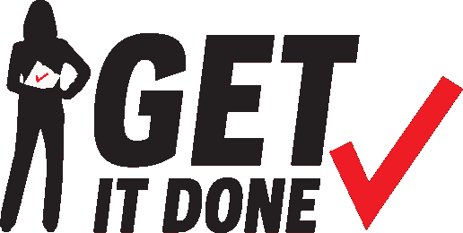**

**请记住，在这一点上，您不应该将注意力集中在系统设计问题上，因为这些问题只在现场访谈中被问到，因为它需要白板来绘制图表。**

### **在线编码测试**

**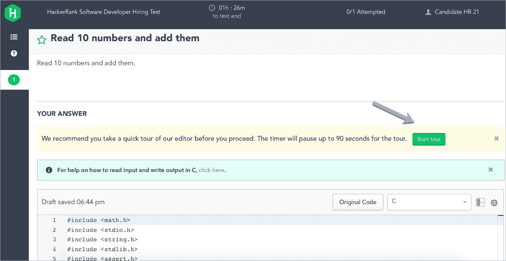**

**我遇到过很少的科技公司仍然提供在线编码测试，比如 HackerRank 或 Codility，尽管相当多的金融公司仍然提供这些测试。之所以要进行这些测试，是为了节省招聘公司的人力。**

**通常，你会从公司的招聘人员那里得到一个在线测试的链接。通常有 3-5 个编码问题，您需要在 2-3 小时内完成。您需要在招聘人员发送电子邮件后的 7-10 天内随时完成。在您进行测试时，没有人会忽略您，您需要通过大多数测试用例才能通过这一阶段。**

**以下是一些在线编码测试的技巧:**

*   ******使用 IDE**** :你可以完全在你喜欢的 IDE 中编写和测试你的代码，然后粘贴到在线测试页面运行正式的测试用例。**
*   ******看完所有问题再开始**** 。一些在线测试的设计使得大多数人无法在规定的时间内完成所有的问题。所以，在开始任何问题之前，一定要阅读所有的问题，并首先从较简单的问题开始，这样你就可以完成尽可能多的问题。**
*   ******先把它弄好**** 。对于大多数在线测试来说，时间是一种稀缺资源。所以目标通常是通过尽可能多的测试用例，不一定是所有的测试用例。如果你有一个可行的解决方案，它应该可以通过大多数的测试。如果您的解决方案不是最省时的，您可能会在一些测试用例上超时，这很好。继续解决下一个问题，如果你还有时间，再回来。(注意:在编写生产级代码时，不要这样做。对于产品级的代码，一定要花时间来纠正和清理算法，并添加足够的文档，以便您和其他人可以在将来维护您的代码。)**
*   ******保存一份问题和你的答案**** 以备将来分析。这应该是你保存所有面试问题的惯例，不管它们是电话/在线/现场问题。**

### **带回家的项目**

**一些公司在技术电话屏幕之前，或代替技术电话屏幕，提供带回家的项目。我有两家公司给我带回家的项目，都是机器学习相关的。我发现这些项目更有趣，也与我申请的工作更相关。因此，我希望更多的公司会提供带回家的项目，而不是技术电话屏幕。**

**但我确实明白，它可能不那么有效或公平，因为 1)公司不知道你或你的 ML 专家朋友是否做了该项目，2)即使你自己做了，你花了多长时间？**

****

**对于带回家的项目，因为你通常需要花很多时间在上面，确保你明智地使用你的时间。**

**对于一家你真正感兴趣的公司，是的，花 8-10 个小时做好编码和记录你的方法和设计决策的工作。对于 [Scale.ai](http://scale.ai/) 的项目，我花了至少 10 个小时在他们的项目上——尽管说明书告诉我只花大约 2-3 个小时。我这样做是因为我认为这很有趣，而且我通过探索不同的 ML 方法学到了很多东西。**

**对于你不那么感兴趣的公司，不要花那么多时间，把时间留到更多的 LC 问题上，这样一般情况下可以更好的准备编码面试。**

### **面试日程安排**

**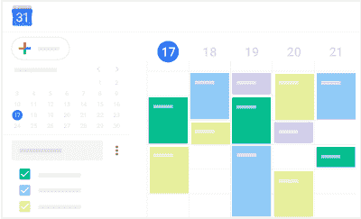**

**一旦你做了几次电话面试，你应该会收到一些现场面试的邀请。在电话面试的开始阶段，你的成功率会有些低。我前 4 到 5 次电话面试都失败了。然后我意识到我需要专注于练习更多的动态编程和递归算法。**

**你的经历可能不一样，但是在面试过程中收到拒绝邮件的时候不要气馁。向招聘人员寻求反馈，多学习。有很多公司可以让你去尝试。**

**以下是一些面试安排的技巧:**

*   ******保留详细的面试日志**** :这是第二步提到的同一个日志。现在是时候开始记录每次面试中讨论的时间和内容了。**
*   ******将所有面试放入你的日历，并设置提醒/提醒**** 。你不想因为忘记了而错过一次面试。另外，一定要确认面试时区。为了简单起见，我总是按照招聘人员所在的时区(通常是太平洋时间)与他们沟通。**
*   ****安排至少 30 分钟的连续电话面试。这是因为一些面试官可能会迟到 5-10 分钟，一些面试官可能会允许面试超过时间限制 5-10 分钟。因此，如果你安排了两个连续的电话面试，你可能不得不缩短一个或者错过另一个电话。另外，你需要 5-10 分钟的休息时间来理清思路，写下采访笔记。****
*   ********要求第二次机会。**** 这可能是一个鲜为人知的事实。如果你第一次电话面试失败，许多公司会给你第二次机会。大多数人不会自动提供，但如果你友好地提出要求，他们会提供。所以一定要问，但要安排在第一次面试后几周，这样你就有足够的时间学习。通常不会有第三次机会，除非你等 6 个月。****
*   ******错开你的面试。**** 我分阶段错开面试。我把我认为比较容易通过的公司放在前期，把比较难通过和比较知名的放在后期，大概是 2-3 周后。这样，如果你发现自己在某些方面有所欠缺，你有 2-3 周的时间来研究它们。**
*   ******聚类你的现场面试。**** 因为我面试的大多数公司都在旧金山湾区，所以我尽量把所有的现场面试安排在 1-2 周内，这样我就可以飞一次就能完成所有的现场面试。例如，我在湾区的现场面试持续了整整两周，在此期间，我面试了 6 家公司——每周 3 次面试。如果一些公司知道你会在城里参加其他面试，他们会更愿意带你去现场。还有，他们不用给你付机票钱。不同的公司支付了一些酒店的住宿费用，我不得不支付其他的住宿费用。这对我来说很好，因为它节省了我很多时间，我能够将所有的现场面试集中在一起，所以我可以在大约相同的时间听到他们所有人的决定。**

## **4.2 现场访谈**

****

**现场面试前 2-3 周，开始关注系统设计问题。许多公司允许你在通过电话面试后 4-6 周内安排现场面试。这应该给你足够的时间准备 A&DS 和系统设计问题。**

**通常，每家公司的现场面试都有 4 到 5 个 45 分钟的面试环节——上午 2 个，午餐 2 个，下午 2 到 3 个。将有 1 次系统设计、1 次行为和 2-3 次 A&DS 编码面试。很少有公司会问你数学或脑筋急转弯的问题，所以我不会花太多时间准备。**

### **系统设计面试**

**

Gaurav Sen Designing WhatsApp** 

**这在第二步:面试准备中有所涉及。如果你看了我推荐的所有系统设计 YouTube 视频，并能将其归纳为一个类似于我所概述的框架，你的情况会很好。**

******阐明规格。**** 系统设计问题的一个重要技巧是在早期阐明系统的特性和功能。您希望定义一组不太琐碎也不太复杂的特性，这样您就无法在 45 分钟内完成。**

**例如，当被要求设计一个即时消息应用程序时，一定要提到基本功能，例如:**

*   **用户认证(这应该在大多数系统中)**
*   **一对一消息传递**
*   **群发消息**
*   **用户活动状态**
*   **离线消息(如果你有时间的话)**

**对于 45 分钟的会议，我不会提及这些不重要的功能:**

*   **语音通话**
*   **视频通话**
*   **多人通话**
*   **个人时间表(即脸书的故事)**

**当然，如果你被要求设计 Skype，你必须设计语音和视频通话，但我不会仅仅为了将功能集限制在可管理的范围内而包括共享电脑桌面。**

******小心弧线球。**** 在面试中，要注意奇怪的问题，并能聪明地回答。**

****

**例如，当我在脸书面试时，有人问我如何设计一个简化版的谷歌搜索。我接着在白板上画了一个非常好的高级设计。然后面试官给了我一个难题:**

**面试官:“那么你认为你需要多少台服务器？”**

**我:“嗯，这取决于有多少人在使用它，以及服务器有多强大……”**

**面试官:“你为什么需要知道服务器有多强大？”**

**我:“我的想法是，实际使用情况有点像分子，服务器硬件能力就像分母，服务器的数量取决于这两个数字。”**

**面试官:“不，服务器的硬件规格无关紧要。”**

**我:“硬件规格当然很重要。如果我可以用 10 台强大的服务器托管一项服务，我可能需要 100 台笔记本电脑来托管同样的服务”**

**面试官:“硬件规格无关紧要。”**

**在这一点上，我不知所措，因为我认为他是相当不合理的。经过长时间尴尬的停顿，我几乎要放弃了。**

**我:“你说硬件规格不重要是什么意思？”**

**面试官:“假装你不知道一台服务器的硬件规格，你怎么算出你需要多少台服务器？”**

**哦，他是这个意思？？！！他不是说硬件规格无关紧要，他只是说我们不知道确切的硬件规格。**

**我:“哦，在这种情况下，我必须对服务器的吞吐量进行基准测试，所需的服务器数量大致是最大使用量除以单台服务器的吞吐量。我现在走的路对吗？”**

**我可以看到他微微点头。**

**这个故事的寓意是为了说明弄清楚面试官在问你什么/告诉你什么是多么重要。你可以用自己的话向他们重复问题/陈述。如果你真的卡住了，问问他们刚才说的是什么意思。也许他们会用不同的方式重新表述问题/陈述，这样你就能理解并继续。**

**记住很多面试官的母语都不是英语，所以他们所说的**和 ****他们想说的**** 可能不完全吻合。同样，许多受访者(包括你在内)也不是以英语为母语的人，所以他们听到的**和 ****也可能与他们认为听到的**** 不完全相符。******

**让面试官用不同的方式说同样的事情可能会极大地帮助被面试者理解面试官真正的意思。**

### **白板 A&DS 编码访谈**

**

Tushar Roy talking about Trie Data Structure** 

**现场 A&DS 问题几乎全部在白板上完成。包括我自己在内的许多人最初都害怕白板编码，因为在真实的工作环境中，谁会在白板上写详细的代码呢？！**

**但是当我经历所有这些现场采访时，我发现白板编码在某种意义上比电话采访更容易。我将在下面介绍一些专门针对白板编码的技术。**

******用图解/图表/表格说明你的算法。**** 有句老话叫“一图胜千行码”，或者类似的话。在你写代码之前，试着说明你的代码如何与图表一起工作。这将给你的面试官一个你的代码可能看起来像什么的路线图，并允许他们指出他们看到的任何潜在的问题。**

**一旦你完成了编码，试着用边上的图表一行一行地浏览你的代码，这样你就可以向面试官展示你的实现与你想要做的相匹配。一定要观看 [****图沙尔·罗伊的 leet code Hard Solutions****](https://www.youtube.com/watch?v=l3hda49XcDE&list=PLrmLmBdmIlpuE5GEMDXWf0PWbBD9Ga1lO)**YouTube 视频，学习如何在白板上展示想法。****

********将白板分割成若干部分**** 。出于上一篇技巧文章中提到的原因，我建议将白板分成至少 2-3 个垂直部分。一个部分是为图表保留的，其他部分是为代码保留的。这样，您可以在编码之前/期间/之后参考图表。****

******别多心句法细节**** 。如果你被允许用任何编程语言编码(因为这是标准)，那么面试官不应该对你的代码的语法非常挑剔。例如，如果您在 C++/Java 中遗漏了结尾分号，或者在 Python 中遗漏了结尾冒号，这没什么大不了的，只要您的缩进是正确的。或者如果你拼错或缩短了一个内置函数的名字，这也没什么大不了的，只要面试官明白你的意图。相反，在电话面试中，你却享受不到同样的奢侈。**

******使用缩短的变量/函数名**** 。因为用记号笔写出长名字会花费很长时间和很大空间，所以告诉你的面试官一个变量的全名和含义，然后在你的代码中使用简称。这将为您节省大量宝贵的时间以及宝贵的白板空间。**

******不断寻求反馈**** 。这是现场面试的众多好处之一，因为你可以很容易地判断面试官的反馈。当我展示我的设计或方法时，我会定期检查面试官的面部表情，并漫不经心地问:“我的思路对吗？”或者“看起来怎么样？”通常，面试官都很乐于助人，给你一些反馈，或者至少点头或皱眉。如果你错了，他们肯定会让你知道，如果你问的话。**

**正如我几次艰难地发现的那样，当我不寻求反馈时，一些面试官会让我完成整个实施，然后在最后指出一些重大缺陷。结果，那些面试我都惨败了。所以尽量在编码****寻求反馈**** 之前尽可能多的 sh 出你的设计。**

****

### **其他现场面试技巧**

**这些非技术提示中的一些可能是常识，但我将列出它们作为提醒。**

******最后问好问题**** 。在每次面试结束时，你可能不会有很多时间提问。所以这些问题要简短有力。面试是一个双向的过程——公司试图从你那里获取信息，用于他们的评估过程，你也需要对这些公司做同样的事情，这样当你得到录用通知时，你就可以做出最明智的决定。**

**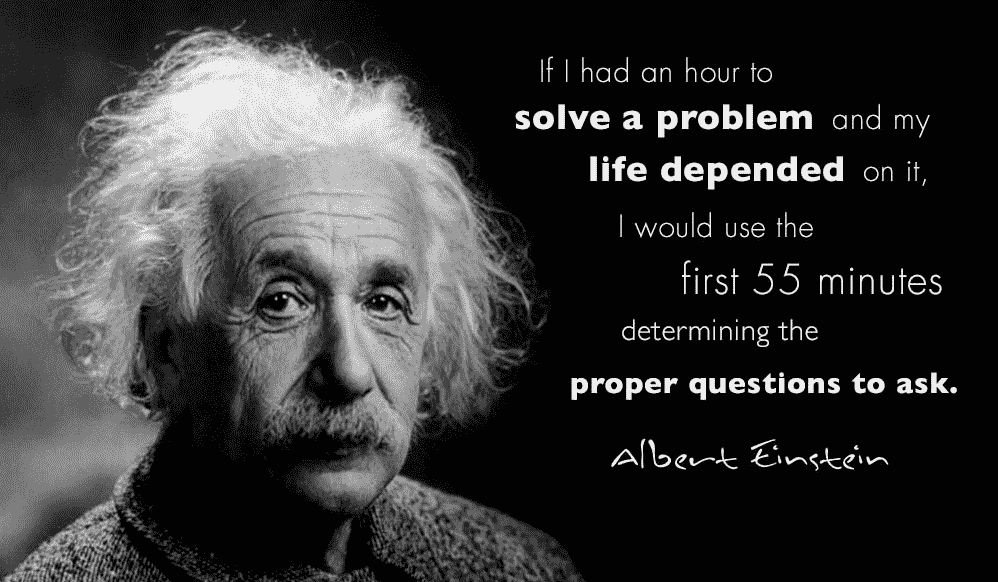**

**以下是我喜欢问的典型问题:**

*   **你能告诉我你的背景和你在现在的团队做什么吗？**
*   **你能告诉我在你的小组/公司里的技术栈和发展过程吗？一旦面试官提到一些编程语言或工具，你可以回应说你也使用过这些技术。**
*   **你的团队/公司的理想人选是什么？一旦面试官提到理想候选人的一些特征，你可以回应说你也有这些特征，并给出一个快速的例子来支持它。**
*   **推销一下自己。这可能并不适用于所有人。我还利用面试结束时的“提问”时间，向面试官展示了我的自动驾驶机器人汽车和该汽车的几个 YouTube 视频。我认为结果出乎意料的好，因为我看到大多数面试官在他们手里拿着真正的车时都非常惊喜。**

******保持水分**** 。面试的时候你会说很多话，会出很多汗(不自觉的)，所以你总是想时刻保持水分。这意味着在每次面试后都要重新斟满你的杯子，当你不在白板上写字的时候就喝一小口。我发现咖啡因(咖啡/茶/可乐)非常有效地让我保持最佳状态。**

****

******乘洗手间休息**** 。每次面试后，一定要去洗手间休息一下。不幸的是，这些 45-60 分钟的面试通常是连续的，中间没有休息。所以在下一次会议开始之前，一定要问一个。你希望能够走路和伸展一下你的腿，更重要的是，洗手洗脸，这样你就可以精神饱满地去参加下一次面试。但是不要休息太久，因为休息时间会占用你接下来的 45 分钟。**

******记笔记**** 。我总是详细记录我的采访。因为你的大部分面试都是连续进行的，所以你唯一能做笔记的时间就是在洗手间休息的时候。:)带上你的手机，迅速记下一些问题和你的方法，这样你可以在一天结束后提醒自己。这应该不会超过 1 分钟。**

******午餐吃得清淡。**** 午餐很难不暴饮暴食，因为许多顶级科技公司都有很棒的免费食物！脸书甚至有免费的冰淇淋！虽然在那里尝试所有的免费食物很诱人，但你需要记住 ****你不只是去那里吃一次**** 而是去面试和 ****获得工作，这样你就可以每天都在那里吃**** ！**

**不暴饮暴食的两个原因:第一，你想在下午的会议中保持清醒，不感到昏昏欲睡。第二，你想花大部分时间和你的午餐伙伴聊天。虽然对于一些公司(谷歌/脸书)，你的午餐伙伴的反馈并不是要约决定的一部分，但很多时候，他们是公司的高层，所以他们的意见可能很重要，你想留下一个好印象。**

****

******包点零食**** 。与最后一点相反的是，对于我的一些现场采访来说，无论是有意还是由于时间冲突，午餐都安排在下午 1:30-2 点，或者干脆不吃了！到那时我会很饿，而且会跑得气喘吁吁。所以我学会了随身携带一根格兰诺拉燕麦卷和几块巧克力，这样我就可以在面试间隙快速吃点东西。**

**带几份简历 :是的，大多数面试官都会带一份你的简历。不过偶尔遇到面试官没带简历复印件，我就给了他们一份。对于技术面试来说，这可能没那么重要，但这是一个很好的姿态。**

******剖验分析**** 。当你完成一天的面试后，不要马上放松。当你记忆犹新的时候，回到酒店/家里，立即记下尽可能多的面试细节，包括面试官的名字/背景，所有被问到的问题，你的方法，面试官对你问题的回答等等。以电子方式(而不是在纸质记事本上)完成，这样以后更容易搜索和存档。**

**还有，在以后的时间里，重新审视所有的面试问题，得到优化的解决方案，思考下次如何提高自己的表现。如果你在 LC 上找到面试问题，一定要用公司名称标记问题，这样其他人可以从你的经历中受益。**

****

**以上只是一些提示和技巧，可以帮助你稍微扭转局势。你仍然需要集中练习 A&DS 问题，并学会快速识别每个问题的方法。**

**例如，知道什么时候在树/图中使用 BFS 或 DFS，什么时候使用递归或迭代算法，什么时候在处理之前对数据进行排序或索引，等等。并且总是知道你的算法在时间和空间上的复杂性。我在五月下旬开始准备面试，六月下旬进行第一次电话面试，八月下旬完成最后一次现场面试——这是我人生中最紧张的三个月。**

**如果你们谁问我遇到的具体面试问题，很遗憾，我不能在这里透露。但我在 LeetCode 上标记了所有相关的面试问题，作为匿名回馈在线社区的一种方式。我希望你在面试后也会这样做。**

# **第五步。报价谈判和团队匹配**

## **5.1 要约谈判**

**如果你正在读这篇文章，你可能已经收到了至少一份工作邀请。哇，恭喜你！**

**如果你还没有收到任何报价，现在就停止阅读，回去做更多的 LeetCode 和采访！；-)**

****

### **优惠套餐的组成部分**

**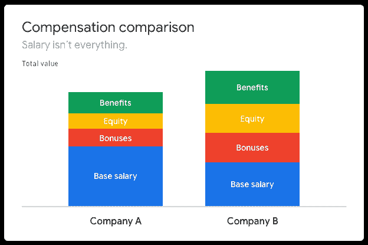

Source: levels.fyi** 

**这些都是科技公司报价的典型组成部分。我将给出一个中级软件工程师(SWE)的例子，通常是 3-5 年的经验(YoE)。**

*   ******签约奖金**** :这是你刚开始工作就拿到的钱，不是你签了 offer 信就能拿到的。例如，一次性支付 3 万美元。**
*   ******底薪**** :这是每个月进入你银行账户的钱。比如 15 万美元/年。**
*   ****:这是你基本工资的一个百分比，通常是 10-30%，每年发放。例如，20%，对于 150，000 美元的基本工资，这是 30，000 美元。****
*   ******股票期权或股票授予:大公司倾向于授予在授予时有价值的股票(称为限制性股票单位，rsu)。初创公司倾向于给予股票期权，这在授予时价值很低，但可能有很大的潜力。例如，价值 300，000 美元的股票在 4 年内授予，因此每年授予 75，000 美元。******
*   ********搬迁套餐**** (如果你需要搬迁):这通常包括 1)为你的家人提供几周的公司住房，2)搬迁你的所有物品，3)帮助出售和购买房屋，以及可选的 4)一些现金来帮助支付其他与搬迁相关的费用。搬迁套餐是基于你的家庭构成、位置、层次。这通常是没有商量余地的。****

******【TC】****年化总薪酬这是使所有报价套餐具有可比性的一个数字。**

**TC =基本工资+年度奖金+年度股票奖励+摊销签约奖金(假设你在 3 年内摊销签约奖金)**

**我们中级 SWE 的 TC**

**= 15 万美元+3 万美元+7.5 万美元+3 万美元/3 = 26.5 万美元**

**请注意，搬迁套餐不被视为 TC 计算的一部分，因为预计您将花费大部分(如果不是全部)搬迁套餐。**

### **了解你的水平**

**即使你了解你的工作环境，公司也可能会在特定的层面上对你进行面试。例如，一个四年制的工程师可能在谷歌、E3 或 E4 脸书面试三级或四级，在微软面试 59-62 级。**

******问招聘人员你面试的**** 是什么级别。但这可能不是你将得到的工作级别。例如，你可能在 E4 的脸书面试，最后，招聘委员会可能会决定你的表现不够出色，不适合 E4，但足以接受 E3 的邀请。所以 ****再问招聘人员**** 你的工作待遇是什么级别。有了这个水平，你就可以搞清楚 TC 的期望值和范围了。(见下文)**

**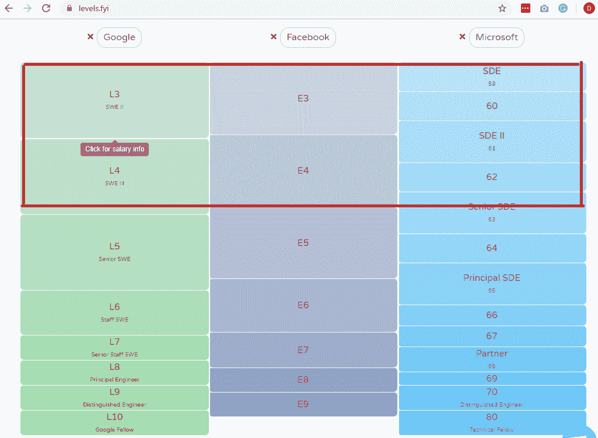**

### **了解你的市场价值**

**如果你不知道你当前的市场价值，你就不能谈判。多年来，公司一直对薪酬信息保密，因此候选人在信息方面处于巨大劣势。**

**幸运的是，近年来，薪酬信息已经民主化，许多网站从许多候选人那里众包，然后按级别、工作职能和地点呈现匿名的薪酬数据。一个著名的网站是 [levels.fyi](http://levels.fyi/) 。**

**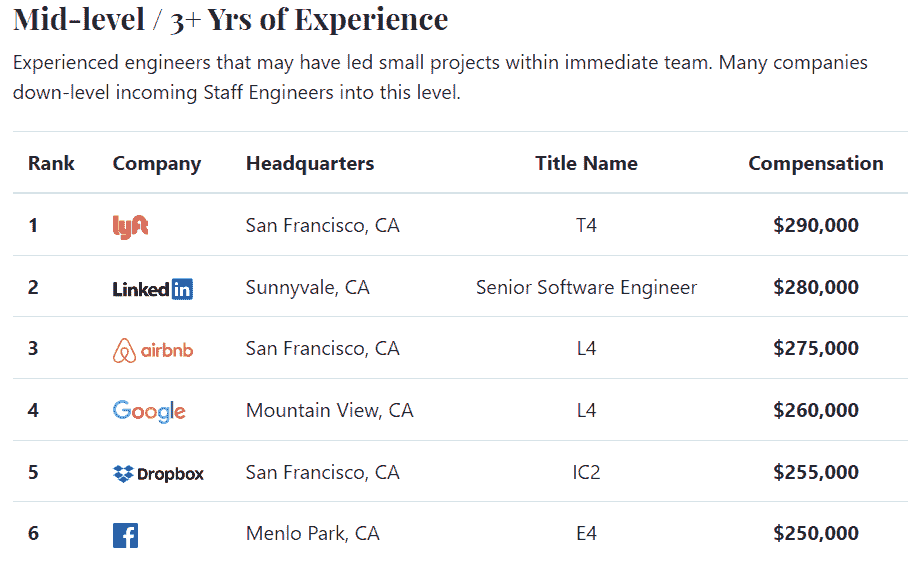

Top Compensation for 3–5 YoE SWE. Source: levels.fyi** **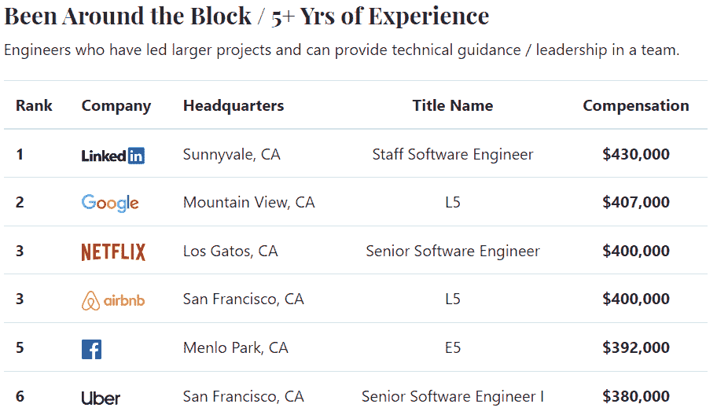

Top Compensation for 5+ YoE SWE. Source: levels.fyi** 

**正如你在上面看到的，所有高薪工作都在旧金山湾区。年同比增长 3-5%的 SWE 可以赚取高达 290，000 美元的 TC，年同比增长 5%以上的 SWE 可以赚取超过 400，000 美元。**

**对于任何非湾区的工程师来说，30 万至 40 万美元的总薪酬可能令人瞠目结舌。但是请记住，海湾地区的住房是美国最昂贵的大都市地区。加州帕洛阿尔托的房价中值为 280 万美元(来源:Zillow.com)，旧金山大都会区的房价中值为 110 万美元(来源:[censusreporter.com](https://censusreporter.org/profiles/31400US4186041884-san-francisco-redwood-city-south-san-francisco-ca-metro-division/))。正因为如此，很多人的工资都要高得多。**

**相比之下，纽约曼哈顿的房价中值为 120 万美元(来源:Zillow.com)，纽约/新泽西州的房价中值仅为 44 万美元。(来源:[censusreporter.com](https://censusreporter.org/profiles/31000us35620-new-york-newark-jersey-city-ny-nj-pa-metro-area/))**

**有了 levels.fyi、您的级别(从上一步获得)和公司名称，您可以清楚地看到报告的平均 TC 及其范围。例如，对于湾区的 Google L4 SWE，报告的平均 TC 约为 26 万美元，范围从 20 万美元到 32 万美元。因此，如果你收到谷歌 L4 的报价在 20 万美元左右，那么你知道你有谈判的空间。**

**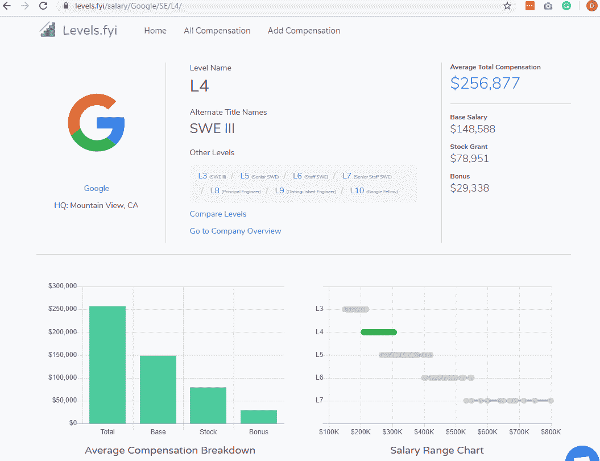**

### **创业公司**

****

**Levels.fyi 是比较更成熟的公司(上市公司或私营公司)报价的一个很好的工具，因为公司的股权部分可以用美元进行评估，具有更高的确定性。**

**但对于早期创业公司，你无法在 Levels.fyi 上找到可靠的数据点。通常情况下，要么给你 1)一定比例的公司股票，要么给你 2)一定数量的股票期权。公司招聘人员或首席执行官可能会告诉你，即使你的股权部分现在价值很低，但如果公司在 3-5 年内上市，它的价值可能会增加 20-50 倍。**

**事实上，这些股权成分很难评估，在未来几年内非常不流动，没有货币价值，当 90%的初创公司失败时，它们的价值实际上为零。(来源:福布斯)。**

**我收到了一些早期创业公司的邀请。典型的薪酬方案是轻现金(即低基本工资和奖金)，重股权(大量具有巨大潜在支出的期权…或者什么都没有)。这是有道理的，因为大多数早期创业公司不盈利，他们支付的任何现金工资/奖金都会耗尽手头的现金，或者用风险投资(VC)的话说，烧掉他们的跑道。**

**尽管我收到邀请的初创公司做了非常令人兴奋的工作，前景看起来非常有希望——其中一家有谷歌风投作为支持者——但我最终还是选择了谷歌，因为我需要大公司的确定性和稳定性。毕竟，我很快就要有一个上大学的孩子了。我不能在加入一家初创公司几年后，眼睁睁地看着它失败，我的股权被抹去。**

**然而，如果我更年轻，没有孩子，我肯定会为一家初创公司工作，并努力实现全垒打。如果我失败了，我就不会有养家糊口的压力，也仍然有足够的时间重新开始。如果我妻子的收入足以支撑我们整个家庭的开支，那么我也可以为初创公司工作，因为它有潜在的好处。用金融术语来说，这被称为[多样化](https://www.investopedia.com/terms/d/diversification.asp)——通过将高风险股票与更安全的股票或债券结合起来，你实际上可以获得更高的[风险调整回报](https://www.investopedia.com/terms/r/riskadjustedreturn.asp)。**

### **第一次打电话时不要接受提议**

****

**当你第一次得到一个职位时，招聘人员总是在电话里告诉你职位的细节(基本工资、奖金、股权等)。这被称为“口头要约”。你在第一次电话中要做的是感谢招聘人员，写下所有的工作细节，重复给招聘人员确认，并要求他们在电子邮件中向你发送这份工作细节。然后挂了。**

**记住，不要当场接受这份工作。(如果这是你梦寐以求的工作，挂了电话后你可以上蹿下跳。)有时候，招聘人员会拒绝给你发任何书面或电子邮件。如果是这种情况，那就给他们发邮件，附上你刚刚写下的报价细节，让他们确认你听到的是否正确。他们通常会给予肯定的回答。**

**这一点很重要，因为一旦有了书面的东西，招聘人员就不能轻易收回他们刚刚在电话里告诉你的话。**

**很多时候，招聘人员会在电话里催促你立即口头接受这份工作，或者给你 24 小时的最后期限。不要咬！你应该总是试图通过谈判获得更好的报价。**

### **出价协商—多个出价**

****

**要约谈判就像玩高赌注扑克——事实上，我们在这里谈论的是数万美元——既令人兴奋又充满压力。对于像我这样的一些人来说，这也很可怕。然而，有了 level.fyi 提供的信息，如果招聘人员的出价太低，你可以说他是在虚张声势。**

**为了在出价谈判过程中发挥杠杆作用，再给出一个强有力的出价，或者用扑克术语来说，一手好牌，会有所帮助。许多招聘人员非常愿意尝试匹配竞争性的报价。他们可以向招聘/薪酬委员会提交竞争性报价，作为为你提供更好报价的有力理由。**

**在这种情况下，你可以尝试让这些公司哄抬你的薪酬。这很正常，因为当一种商品有需求时，我们周围每天都会发生竞价，比如在股票市场、易贝和谷歌广告中。竞标过程确保商品以公平的市场价格进行估价。**

### **要约谈判——只有一个要约**

**即使你没有什么优势——比如只有一份工作机会或者很低的工作机会——你也可以告诉招聘人员你真的对这家公司很感兴趣，但是你的期望薪水实际上是 XYZ 美元。招聘人员可能会要求你证明这个数字的合理性，你可以说这个数字来自 levels.fyi，或者你的朋友/同事有类似的 YoE，他们的 TC 是$XYZ。**

**如果你表现得很专业，最初的报价很可能会有所提高。仅仅因为你试图谈判，公司就收回最初的报价是极不可能的。毕竟公司投入大量的精力去寻找一个合格的候选人，所以不希望因为一个小小的涨幅而失去一个好的候选人。所以 ****你要求更多的补偿不会有什么损失，很好**** 。**

### **要约谈判——钱不是谈判桌上唯一的东西**

**记住 ****钱不是唯一可以谈判的**** 。公司能给你的任何东西都在谈判桌上。**

**例如，你可以要求为不同的团队工作(比如核心团队而不是支持相关团队)，不同的职位(比如高级软件工程师而不是软件工程师)，不同的工作职能(比如研究工程师而不是软件工程师)，更多的带薪休假，在家工作的弹性时间，或者更好的安置方案。**

**当然，这因公司而异。较大的公司可能不太灵活，但可能无法与较大公司的货币补偿相匹配的较小公司可能更愿意考虑这些替代需求。还是那句话，如果你做得好，问问也无妨。**

### **提议谈判——不要太贪心**

**在与招聘人员反复沟通了几轮后，如果你觉得没有太多的谈判空间，就不要再要求更多了。大公司的招聘人员每天都会看到这种情况，可能不会太介意。对于较小的公司，招聘人员可能会直接与你的招聘经理甚至是老板/创始人合作。如果你讨价还价太过激烈，可能会被认为太贪婪。所以即使他们雇佣了你，他们也可能会对你有负面的看法。 ****懂得知足**** 。**

### **提供拖延战术**

****

**如果谈判后你对任何报价都不满意，你应该设法推迟接受报价。如果一些职位的工作职能非常有吸引力，但薪酬太低，而另一些职位的薪酬很好，但你不喜欢这些工作职能，这种情况就会发生。**

**推迟一份工作会让你有更多的时间去面试和获得那份完美的工作。但它确实有风险，因为空缺职位可能随时被填补。但对于大型科技公司来说，这种风险微乎其微，因为它们总是在招人。如果你需要推迟报价，这里有一些策略可以尝试。(免责声明:我没有全部尝试过，有些是有人向我建议的。)**

*   **与团队/同事见面:要求打电话、喝咖啡或吃晚餐，与团队的其他成员见面或从同事那里学到更多。这是一个很好的方式，不仅可以表现出兴趣，还可以获得关于公司/团队文化的强烈信号。**
*   **索取产品演示:索取产品演示是表达兴趣的另一个好方法。这也是评估技术挑战、产品路线图和公司产品导向程度的好方法。你通常可以将此与和团队成员共进午餐结合起来。**
*   **询问各种与股票/期权相关的问题，如公司目前的估值、上一轮融资、公司的退出计划/策略以及期权行使时间表等**

**以上这些策略对大多数公司来说最有效。对于一些大型科技公司来说，一旦他们决定给你一份工作，这份工作通常至少在几个月内是有效的，因为你已经达到了他们的技术标准，他们会很乐意随时雇佣一名优秀的软件工程师。你的招聘人员可能不愿意告诉你这一点，因为他们想尽快接近你，但你可以从其他来源了解，如谷歌搜索和盲人应用程序。**

**最后，记住所有的招聘人员都希望看到你被公司录用。能够接近候选人(即将合格的候选人转化为员工)是他们的绩效指标之一，与招聘人员的绩效奖金挂钩。所以 ****把你的招聘人员当成你的拥护者，而不是你的对手**** 。**

## **5.2 团队匹配/选择**

**不要仅仅因为现在工资最高就选择一份工作。 虽然薪酬是你做出聘用决定过程中的一个重要因素，但更重要的可能是工作如何影响你的职业生涯。我将讨论如何选择一家公司/团队，从长远来看，最大限度地发挥你的职业潜力。**

### **团队匹配流程**

****

**对于许多公司(包括苹果/微软/许多其他公司)，你将与几个特定的团队进行面试。当你得到这份工作时，它将会是那些团队中的一个。**

**然而，对于一些公司，如谷歌和脸书，他们面试大多数候选人作为通用软件，只有在候选人获得聘用后，才试图将候选人与团队匹配。由于我只经历过与这两家公司的团队匹配过程，下面我就谈谈我的体会。**

**脸书首先提供一份确定的书面聘用合同，然后将你匹配到一个团队。团队匹配也可能发生在你加入之前，当你接到招聘经理的电话时，或者在你加入之后，在第一个 4-6 周的定向/训练营阶段。这个过程的好处是候选人知道他们的提议是坚定的。缺点是，你冒着加入的风险，然后在新兵训练营期间找不到你喜欢的球队。但我的脸书朋友告诉我，这种情况不太可能发生。**

**另一方面，谷歌的工作方式非常不同。他们不像脸书那样有一个长时间的训练营地。他们首先向你发出口头邀请，然后在 发出正式书面邀请之前，要求你与一个团队 ****匹配。即使在你与一个团队匹配之后，招聘委员会也可以拒绝/修改此聘用。甚至最终的薪酬也可以由薪酬委员会根据最初的口头提议进行修改。******

**我从许多网上的帖子中了解到，这是一个漫长而艰难的过程。我个人发现，团队匹配过程确实漫长而令人沮丧，耗时 1.5 个月。有一次，我真的认为它不会成功，我想加入另一家公司。**

**如果谷歌像脸书一样先给我一份确定的书面邀请，压力会小得多，因为我肯定会知道我将为谷歌工作，我所要做的就是找到一个团队。幸运的是，事情对我来说很顺利，因为我最终与我选择的一组人匹配，在那之后不久，各种委员会批准了我的提议。**

### **如何选择团队**

****

**以下是我在面试或录用阶段问自己的问题。你不需要向面试官问这些确切的问题，但你希望从你与公司/团体的面试/对话中找到这些问题的答案。**

1.  ******我将加入哪个小组？**** 我想加入一家公司的“核心”团队——一个公司投入了大量精力和资源的团队。这些通常是其旗舰产品组或高增长组。在这些团体中工作提供了稳定性和/或成长性。**
2.  ******我将为这家公司/集团做什么类型的工作？**** 我寻找可以在以后的职业生涯中转移的工作经验。我更喜欢使用公开可用的工具和技术，而不是公司的专有技术。例如，如果我要开发一个广告推荐机器学习系统，我确信我可以很容易地找到另一家也想改进其广告/产品推荐系统的公司。然而，我不会对用公司专有的脚本语言来自动化一些内部流程感兴趣。**
3.  **在这家公司/集团工作，我能学到什么？ 工作是双向的。我希望能够为我的公司做出很多贡献。与此同时，我想从我的工作中学到很多东西，这样无论我什么时候找下一份工作，我的技能都会很受欢迎。我相信 AI/ML、计算机视觉、云计算、自动驾驶汽车和 AR/VR 技能在未来会有很高的需求，所以我想在我的下一份工作中学习这些技能。**
4.  **我对这份工作有热情吗？ 如果你对自己的工作没有激情，无论工作报酬有多高，你都不会快乐，也不会付出 120%的努力。我对量化金融充满热情，因为看到数学和技术改变整个行业很酷。但是 10+年过去了，我现在的激情在 AI/ML。真的很棒，很神奇，你不需要告诉电脑具体该怎么做。你所要做的就是给它输入数据，它会比别人用代码做得更好。**
5.  ******我喜欢我的经理和同事吗？他们喜欢我吗？你想要一个欣赏你并在新工作中支持你的经理。你也想享受和队友在一起的时光，因为你每天会和他们在一起 8 个多小时，甚至比你和家人在一起的时间还要长！******

**很多时候，并不是以上都能满足。那你就要权衡一下各自的利弊。但是如果上面的一个给你一个危险信号，我会认真考虑放弃那个职位。**

**我最终选择去谷歌的 Pixel 手机的相机组，因为它提供了我非常热爱的三样东西:计算机视觉、机器学习和硬件。这些正是我的机器人自动驾驶汽车项目的全部内容！此外，据我所知，谷歌现在正深入致力于其硬件和智能家居战略，其中 Pixel 手机将成为该生态系统的核心部分。**

## **最后的想法**

****

**谢谢你读到这里。过去的 6 个月对我来说是一段不平凡的旅程。通过我的个人项目和密集的面试准备，我相信我现在是一个更好的工程师(或者至少是一个更好的面试者。；-)我呈现的是我自己的教训和经验。**

**我发现，A&DS 问题是任何科技面试的核心，除了通过练习更多的 LC 问题，没有任何捷径可以让你做得更好。一旦你在 A&DS 和系统设计问题上表现不错，我在本文中提出的建议应该有助于你扭转局势。**

**我建议你把这篇文章标上书签，因为在接下来的 2-6 个月里，随着你求职的进展，你会需要参考这篇文章。后期的一些提示，直到你真正到了那个阶段，才会有太大的意义。例如，你可能需要做一些电话采访来欣赏第四步中提出的建议，你当然不应该在得到任何报价之前考虑第五步报价谈判。**

**如果你正在经历面试，请在下面留下评论，让我知道我的哪些建议有效或者不太有效，这样其他人也会受益。也请在评论中提出新的建议。谢谢！**

## **资源**

**这是我在求职过程中使用的资源附录(按字母顺序排列)。希望你也会发现它们很有帮助。**

**[****盲人****](https://www.teamblind.com/) :这是一款允许不同公司(大部分是科技公司)员工匿名发布问题和答案的应用。人们通常会讨论职业决策、公司文化、面试和薪酬等。**

**我发现这个平台有好有坏。这很好，因为你得到了更坦诚的回答/回应，有时还能得到内部消息。这是不好的，因为有些人因为匿名而写下攻击性的回应，而且环境有时可能是有毒的。你已经被警告了。**

**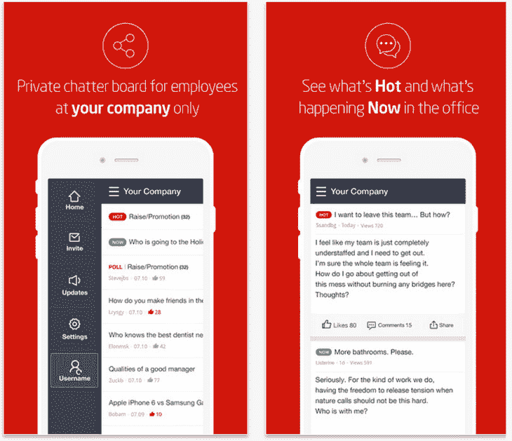**

**[****Coursera****](https://www.coursera.org/) :了解自己热衷的科目。这是免费的或象征性收费。我在那里上了机器学习和深度学习课程。**

**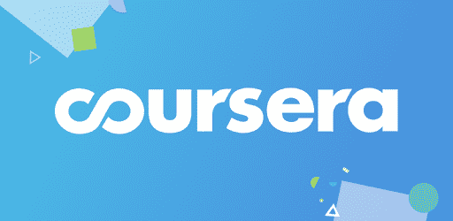**

**[****deep learning . ai****T5****和****](http://deeplearning.ai/) **[Workera **。艾**](https://www.freecodecamp.org/news/career-switchers-guide-to-your-dream-tech-job/Workera.ai)****

*   **如果您对计算机视觉(CV)或自然语言处理(NLP)中的深度学习技术感兴趣，请参加深度学习系列的 5 门课程**
*   **通过他们的筛选测试，被推荐给顶级科技公司 ML 团队的招聘经理**

**[****编程面试要素****](https://amzn.to/31O2JBe) ****书:**** 这是另一本优秀的面试备考书，类似于 CtCI 的书。但它更适合有经验的工程师，而 CtCI 可以被几乎没有算法背景的初学者阅读。**

**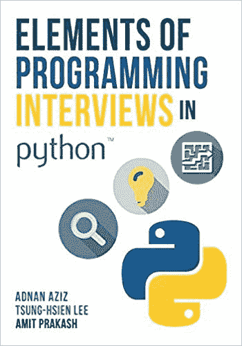**

**[****GeeksForGeeks****](https://www.geeksforgeeks.org/):和 LeetCode 一样，这也是一个非常全面的 A & DS 问题和解答的网站。这个网站是免费的，有时包含 LeetCode 中没有的面试问题。**

**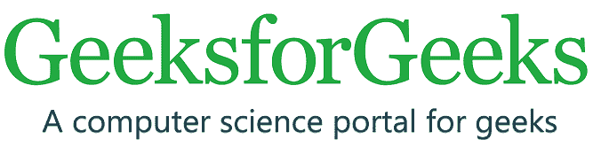**

**[****玻璃门****](https://www.glassdoor.com/index.htm)**

**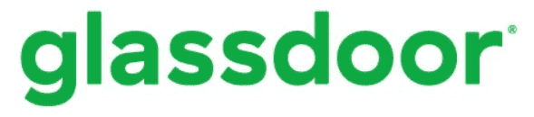**

*   **查看公司的员工评价**
*   **查找以前的面试问题**
*   **设置职务提醒以接收新的职务更新**

**[****谷歌搜索****](https://www.google.com/) :人生任何问题的起点。还需要我多说吗？**

**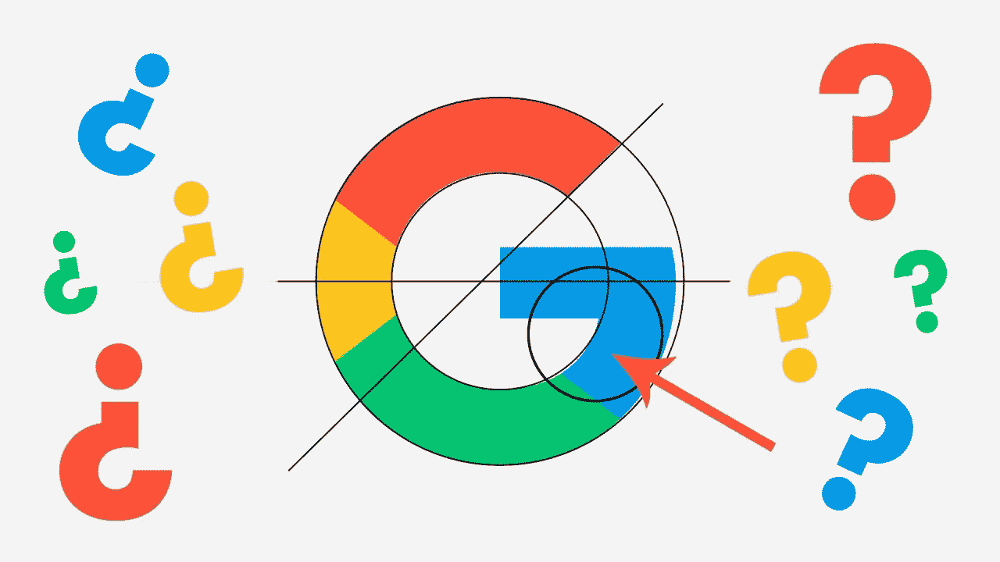**

****内部员工:永远试着联系你的朋友，或者朋友的朋友，他们在你想申请的公司工作。他们将是你最有效的线人和拥护者。[在 LinkedIn](https://www.linkedin.com/in/dctian/) 上联系我，如果你很合适，我很乐意推荐你去谷歌，或者我在其他顶级科技公司工作的朋友。****

********

*   ****练习 A&DS 问题****
*   ****使用 leet code Premium(35 美元/月或 99 美元/年，带优惠券)来查找特定公司过去提出的面试问题。我建议支付年度会员费。就当是你编码大脑的健身房会员吧。****

****[****level . FYI****](https://levels.fyi/):该网站按公司、资历、地点和工作职能列出了众包薪酬信息，因此你会知道你是否得到了公司的公平报价。当然，这只对大公司有效，因为有更多的数据点。****

**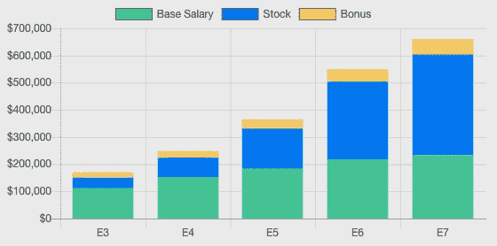**

**[****领英****](http://linkedin.com/) :**

*   **查找人员的专业和教育背景**
*   **打开“向新机会开放”设置，以便招聘人员可以找到您。**
*   **使用 LinkedIn Premium 联系你感兴趣的人**
*   **设置职务提醒以接收新的职务更新**

**[****中型** / **博客网站****](https://medium.com/) :**

*   **阅读教程和方法来帮助你的个人项目**
*   **在媒体或其他地方写博客，展示你自己的个人项目**

****

**[****triple byte****](https://triplebyte.com/iv/Wzwz8pq/cp/header):跳过电话面试，如果你通过了他们的技术筛选，直接去现场。参见上面的详细描述**

**[****YouTube****](https://youtube.com/)**

****

*   **当您处理个人项目时，请观看教程和操作指南**
*   **观看系统设计和算法视频**
*   **注意:在面试准备期间，不要分心，看几个小时的视频来找乐子**

**仅此而已。这是一项艰巨的任务。但是如果你投入时间和精力，你就能做到。**