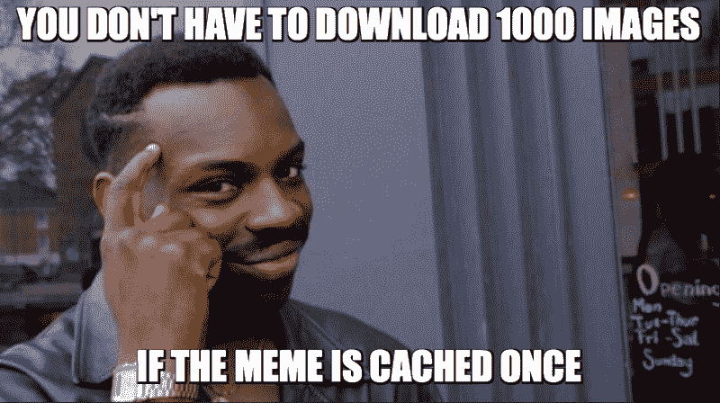
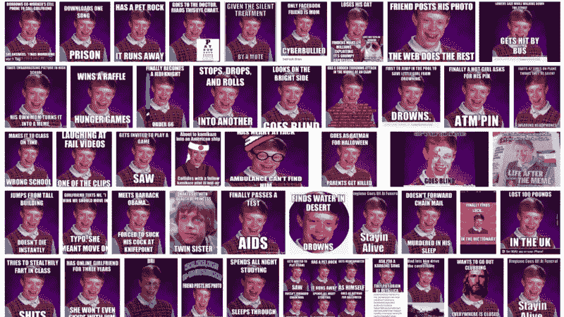
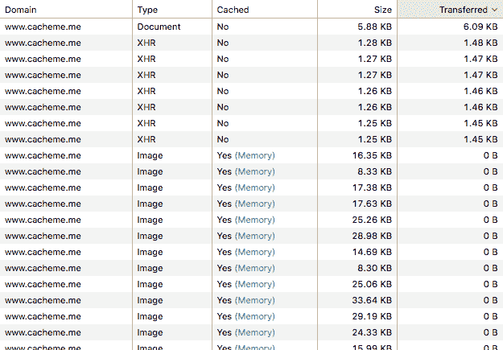
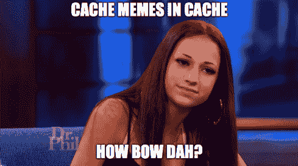
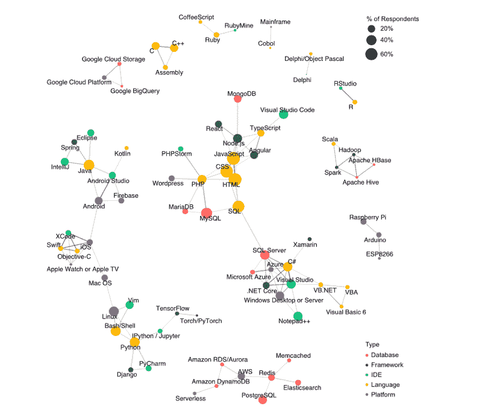
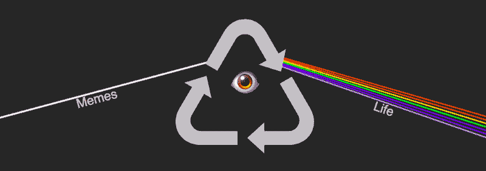

# 新的迷因秩序:用简单的浏览器缓存改变游戏

> 原文：<https://www.freecodecamp.org/news/changing-the-meme-game-bcd24a07dc3e/>

菲利普著

# 新的迷因秩序:用简单的浏览器缓存改变游戏



即使在 2018 年，也不是所有的人都能使用 3G 互联网，并被困在一个没有记忆的世界里。是时候停止这种疯狂了。

如果你不熟悉**迷因**的概念，迷因通常是一个与特定背景或想法相关联的图像。

给这些图像添加不同的文本——模因——通常被用作嘲笑人类行为或描述情景的一种方式。模因在网上广泛传播，尤其是通过社交媒体和图片平台。


Your typical next door Meme

### 有一个问题

这些迷因中的每一个都被使用了数百万次，制造了数百万个笑话。现在，所有的搜索引擎、社交媒体和图片平台都单独加载这些图片。这导致了**兆字节**的流量，并需要你手机的数据容量。



Search results for “Bad Luck Brian”

### 我的想法

我想出了一个主意，把最常用的迷因图片保存一次，然后动态地添加其余的文字。

这对迷因很有用，因为图像保持不变，只有文字发生了变化。

巨大的优势是减少了数据传输。十到十五个“正常”图像可以轻松传输 1MB 的数据。同样 1MB 的数据传输量，我可以加载 1000 个迷因甚至更多，因为佩林的文字比图片要轻得多。

因此，举例来说，这篇中型文章的第二个迷因被保存为图像，大小超过 80kB，但也可以保存为

1.**图片:** "success_kid.jpg "

2.**置顶文:**《饮酒之重夜》

3.**底部文字:**“醒来时有钥匙、钱包和电话”

只要“success_kid.jpg”图像以前被缓存过一次，这将只需要 0.1kB 的空间。如果图像不在浏览器缓存中，它将被下载一次。然后，它可以重复使用，永远没有任何进一步的数据传输。

用户受益于加载时间和数据使用量的大幅减少。有了这个系统，即使你的移动提供商限制了你的带宽也没关系——你仍然可以疯狂地四处游荡。该系统还可以节省手机的存储空间。



Each “Type XHR” = 15 Memes, Document = Code for layout and functionality

为了加载 **100** 个迷因，总共只传输了 **15kB** ，因为图像已经被“缓存”(“传输” **0B** )并且 15 个帖子需要不到 **1.5kB** 的数据。网站本身不到 **10kB** 。我通过以下方式实现了这一目标:

1.**不使用**任何插件/库，编写本地代码。

2.**通常不使用**图像创建布局和高质量图像。

3.保持一切简单明了。

由于迷因是如此的轻量级，保持布局和功能精简是有意义的，这样网站就紧凑而快速。

世界各地的人们都有加载网页的问题，因为打开它们需要太多时间。[平均网页约为 2.300kB](https://www.wired.com/2016/04/average-webpage-now-size-original-doom/) ，图像板或视频平台通常无法访问，因为内容太大，无法通过弱连接或节流连接下载。

我希望这个缓存系统能够提供一个需要更少数据使用的替代方案。是时候让互联网和人们的生活变得更加美好了，让每个人都能在任何时候接触到这种互联网文化。

文章的其余部分是关于技术实现和一点我自己。如果你只是想看看这个项目，就去 **CacheMe.me** (打开 Menu(☰，确保查看离线 Memeviewer 等工具)→小工具)。

### 技术部分

为了演示这个想法，我创建了一个小例子。我用了 10 个典型的迷因，之后，用随机生成的数字用了无数个迷因(没人有时间生成无限个真实的例子)。

**要将这个例子变成真正的 meme 机器**，查询一个数据库并追加返回的内容。如果你想看完整的例子，请查看我的 [GitHub](https://github.com/Cachememe/Cachememes) 。前端(HTML、CSS、JS、Kotlin 和 Swift)无论如何都将是开源的。

#### 前端

本文将**关注**这个概念的 web 实现。有一个 Android 的应用程序，但我不会在这篇文章中进入任何细节。如果你想让我写点什么，请留言。

**Html/CSS:** 我用作 meme 容器的`<d` iv >需要有 CSS pro`perty position:rel`ative；所以文本会放在图像的`, and text-align:`中心，使文本居中对齐(谁会猜到)。

```
/* CSS class for the top and bottom meme text */.text1, .text2 {   left: 0;   font-family: Impact,sans-serif /*sans-serif as fallback*/;   width: 100%;   color: white;   position: absolute;   z-index: 99;   pointer-events: none;   text-align: center;   -webkit-text-stroke: 1px #000 }
```

文本得到一个`font-family: Impact; color: white; -webkit-text-stroke: 1px #000`来实现典型的迷因风格的文本。与 meme 容器`position:relative`结合使用的`position:absolute`属性用于将文本置于图像之上。通过添加像`z-index:99`和`pointer-events:none`这样的属性，我让这个迷因感觉更像一个普通的图像。

```
<!-- The Meme structure in its natural shape --><h2>title</h2><div style=”position: relative;text-align: center;”>  <span class=”text1">first text</span>    <span class=”text2">second text</span></div>
```

**JavaScript:** 为了获得更多/无止境的内容，我在这种情况下用 Ajax/XHR 调用一个函数(这样站点就不会重载)。这将向服务器发送请求以获取更多内容。如果响应是 HTML 格式的，我会像这样直接附加它:

```
function get_memes() {   var xhr = new XMLHttpRequest();   xhr.open('GET', "url");   xhr.onload = function () {     if (xhr.status === 200) {// if the response is already HTMLdocument.getElementsByTagName("body").[0].insertAdjacentHTML("beforeend", xhr.responseText)}   };xhr.send();};
```

如果`resposeText`是 JSON 格式的，我首先解析响应文本，然后从`for-loop`中的内容创建 HTML，如下所示:

```
...var meme collection = JSON.parse(xhr.responseText)for (var i = 0; i <= meme_collection.length; i++) {  var o = '<h2>title</h2><div style="position: relative;"><span class="text1">'+meme_collection[i]["text1"]+'</span><span class="text2">'+meme_collection[i]["text2"]+'</span></div>'
```

```
 document.getElementsByTagName("body").[0].insertAdjacentHTML("beforeend", o)}
```

最棒的是:我甚至不需要写一个函数来缓存图片，每个网络浏览器默认都会这么做。您可以简单地重用相同的图像链接和？奇迹已经发生了。



#### 后端

数据节省的效果是前端(HTML/XML)构造方式的结果——因此后端与数据节省效果并不真正相关。基本上，只需要一个返回 HTML 或 JSON 格式数据(顶部文本、底部文本、图像名称)的服务器。

对于我的项目，我选择了 [**Django**](https://www.djangoproject.com) (一个 Python web 框架)。我还集成了一些 [**Golang**](https://golang.org) 。Django/Python 一般负责平台(用户、内容和 HTML ),而 Golang 则负责处理 API 请求并为客户端提供 JSON。两种编程语言都使用相同的 **PostgreSQL** 数据库**。**

### 谁的钱

我叫 Philipp，去年开始在学业旁边学习编码。我一直想学习如何编码，但是害怕编码，因为我认为它非常抽象和复杂。我说对了一部分。有 web、移动和桌面应用程序开发，每一种都需要不同的技能。有大量不同的语言、框架和库，每个人都建议学习不同的东西。



Major topics in programming and how they are connected. From [StackOverflow Survey](https://insights.stackoverflow.com/survey/2018/#technology-how-technologies-are-connected)

幸运的是，我遇到了 [freeCodeCamp](https://www.freecodecamp.org) ，这是学习和进入编码的一个很棒的起点。我可以自己决定何时何地学习，最重要的是，清晰的课程路线让我知道下一步该学什么。看到其他人有类似的问题总是有帮助的，我不是唯一一个努力解决“简单”算法的人。

freeCodeCamp 社区足够支持我度过最初几周/几个月的挫折，并引导我开始自己的项目。在完成我的前端证书后，我开始进入 Python，6 个月后，我能够在一家年轻的公司获得一个完整的初级职位(兼职，因为我必须完成我的学业)。

感谢整个编程社区。如果没有 freeCodeCamp、StackOverflow、GitHub，我也不会走这么远。也感谢我所有的迷因人类伙伴，当没有其他人的时候，你的迷因在那里。



**The new Meme order**

要享受一些缓存的迷因，并加入这场革命，请前往 [CacheMe.me](https://www.cacheme.me) 或下载[安卓应用](https://play.google.com/store/apps/details?id=com.herokuapp.meme_maschine.low_data)！