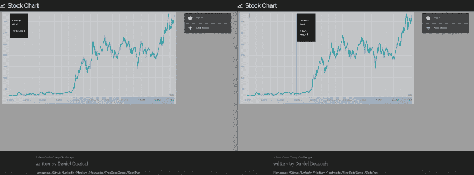
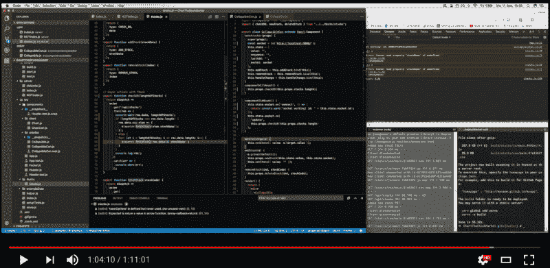

# 我如何为 freeCodeCamp 挑战创建一个跟踪股票市场的应用程序。

> 原文：<https://www.freecodecamp.org/news/chart-the-stock-market-with-react-redux-react-vis-and-socket-io-18caf312693c/>

丹尼尔·多伊奇

# 我如何为 freeCodeCamp 挑战创建一个跟踪股票市场的应用程序。


Photo by peggy pardo on Unsplash — [https://unsplash.com/photos/a6z2tYFEjR8](https://unsplash.com/photos/a6z2tYFEjR8)

我正在开发一个来自自由代码营课程的应用程序，我想其他人可能会觉得它很有趣。在本文中，您可以阅读构建过程的完整文档。尽情享受吧！

> 失败并不是必然的罪恶。事实上，它一点也不邪恶。这是做新事情的必然结果。”

> *——艾德·卡姆尔*

### 挑战

对于这个特殊的挑战，我必须建立一个应用程序，允许监控各种股票。你可以在这里阅读更多关于完整挑战[的内容。现在让我们开始吧。](https://www.freecodecamp.org/challenges/chart-the-stock-market)

用户故事非常简单:

*   我可以查看一个图表，显示每只新增股票的近期趋势线。
*   我可以根据股票代号添加新股票。
*   我可以移除股票。
*   当任何其他用户添加或删除股票时，我可以实时看到变化。为此，您需要使用 WebSockets。

看起来是这样的:



Charting the Stock Market in real-timewith websockets

### 路标

当我把[作为我的最后一个全栈应用](https://github.com/DDCreationStudios/Writing/blob/master/articles/LearningsFirstFullStack.md)时，我知道从后端开始会导致一些问题，当你以后在前端工作时。所以这一次，我决定从前端开始，从后端结束。

以下是我使用的路线图:

1.  使用 create-react-app 设置环境
2.  布置基本的反应组件结构
3.  建立 Redux 生态系统
4.  检查所有组件，将它们分成容器组件，并将所有组件与 Redux store 连接起来
5.  用 React-Vis 构建图表组件
6.  使用 socket.io 构建后端
7.  使前端适应 WebSockets
8.  部署到 Heroku

### 前端

我将强调关键的基石—这不是一个循序渐进的教程。

#### 使用 create-react-app 包进行设置

对于这个项目，我想使用[这个样板文件](https://github.com/facebookincubator/create-react-app),因为我以前使用过很多次，但从来没有在全栈项目中使用过。虽然预配置的结构有一些限制，但好处远远超过问题。

基本上，它提供了一个环境:

*   反应、JSX、ES6 和流语法支持。
*   提供 ES6 之外的额外语言，如对象扩展操作符。
*   有一个开发服务器，用于查找常见错误。
*   直接从 JavaScript 导入 CSS 和图像文件。
*   有自动前缀 CSS，所以不需要-webkit 或者其他前缀。
*   有一个构建脚本，将 JS、CSS 和图像与 sourcemaps 捆绑在一起用于生产。
*   为您提供离线优先服务人员和 web 应用清单，满足所有渐进式 Web 应用标准。

很早以前，我不得不退出配置来修改 WebPack 配置。

问题是我想为 Materializecss 添加 jQuery 但总是有问题。

以下是一些解决方案:

*   在 ES6 中导入 jquery:[这里](https://stackoverflow.com/questions/37213647/es6-code-not-working-with-jquery)。
*   在 WebPack 配置中提供 jquery 插件:[这里](https://github.com/erikras/react-redux-universal-hot-example/issues/596)。

#### 反应，还原，反应

这一次，我想使用 [react-vis](https://github.com/uber/react-vis) 来可视化图表。这是一个基于 D3 的可视化库，由优步开发。总结并引用他们的文档:

> *react 组件的集合，用于呈现常见的数据可视化图表，如线形图/面积图/条形图、热图、散点图、等高线图、饼图和圆环图、太阳图、雷达图、平行坐标和树形图。*

一些显著的特征:

*   **简约**。在开始构建您的第一个可视化之前，react-vis 不需要任何关于数据可视化库的深入知识。
*   **灵活性**。react-vis 为不同的图表提供了一套基本的构建模块。例如，它有单独的 X 轴和 Y 轴组件。这为需要图表布局的应用程序提供了高级别的控制。
*   **易用性**。该库提供了一组默认值，可由自定义用户的设置覆盖。
*   **与 React** 整合。react-vis 支持 react 的生命周期，并且不会创建不必要的节点。

我遇到并解决的一些实际问题是:

*   让 react-vis 图表反应灵敏，就像[这个](https://github.com/uber/react-vis/issues/262)
*   要在 react-vis 中正确使用渐变，请确保将它们包含在绘图中，并调整参考点。检查一下这个。
*   使用 LineSeries 而不是 LineMarkSeries 以获得更好的性能(查看[这个相同的链接](http://uber.github.io/react-vis/#/documentation/series-reference/line-series)

在这一点上，应用程序已经相当不错了。现在我必须检查最后一个用户故事，它使用“web socket”后端显示了现实生活中的变化。

### 后端

对于数据，我使用了来自 Quandl 的开放 API。

服务器:index.js:

#### 设置数据库(由 mLab 托管的 MongoDB)

只需设置 mLab 帐户，并为新应用程序创建一个收藏。制作一个 mongoose 模型来简化与数据库的交互，如下所示:

```
const mongoose = require('mongoose');
```

```
var Schema = mongoose.Schema;
```

```
var stockSchema = new Schema({  stockName: String});
```

```
module.exports = mongoose.model('stockModel', stockSchema);
```

然后将 express 服务器连接到 mLab。

要解决关于过时的 mongoose 开放连接的警告，请使用 openURI。

更多信息，请参见[此处](http://mongoosejs.com/docs/connections.html)。

#### 路线

设置一条路线，以便在默认情况下消耗生产制造 index.html。设置另一个路由来检查数据库的内容，并在响应中返回它。

#### 添加 Websocket

使用套接字文档来设置侦听器，以便:

*   显示连接
*   显示断开
*   将数据保存到数据库
*   从数据库中删除数据

确保将监听器功能与 mongoose 模型集成在一起，以利用 MongoDB 的强大功能。

顺便说一下——因为我在这个问题上花了差不多一周的时间:

使用`socket.BROADCAST.emit`向所有套接字发送消息！

更多[见这里](https://stackoverflow.com/questions/9837998/socket-io-client-not-receiving-messages-from-server)。

### 使前端适应 WebSocket

这里您必须克服的“问题”是根据套接字发出的动作来呈现组件。

对于这些配置，关键是处理组件本身和 ducks (Redux 文件)中的问题。

我通过将容器组件与 socket.io 客户机连接起来并监听变化来解决这个问题。我用`componentDidMount`生命周期做了这件事。每当套接字发出一条消息时，组件就通过向 Redux 文件分派动作来查询数据库。

在 Redux 文件中，我从数据库中获取数据，并将其与应用程序的当前存储进行比较。根据这个比较，应用程序再次从 Quandl 服务获取所有数据。这样，每个新的套接字客户机都可以自己检查，并且总是拥有最新的数据。

请注意:我不确定这是否是 Redux/react 应用程序的最佳实践，因为我在异步操作中处理了很多逻辑。随时指出错误或误解的概念！:)

#### ducks/stocks.js 中的异步操作(代码片段):

```
// Async actions with thunkexport function checkDB(stocks) {	return dispatch =>		axios			.get('/api/stocks')			.then(res => {				if (stocks.length === 0) {					res.data.map(elem => {						dispatch(fetchStock(elem.stockName));					});				} else if (res.data.length < stocks.length) {					dispatch(removeStock(stocks.length - 1));				} else {					let diff = [];					res.data.map((item, i) => {						if (i < stocks.length) {							if (res.data[i].stockName !== stocks[i].dataset.dataset_code) {								diff.push({									stockName: item.stockName								});							}						} else if (i === stocks.length) {							diff.push({								stockName: item.stockName							});						} else {							diff = [];						}					});
```

```
 diff.map(elem => {						dispatch(fetchStock(elem.stockName));					});					diff = [];					// console.log(res);				}			})			.catch(err => {				console.warn(err);			});}
```

```
export function fetchStock(stockCode) {	return dispatch =>		axios			.get(				`https://www.quandl.com/api/v3/datasets/WIKI/${stockCode}.json?api_key=${process					.env.REACT_APP_QUANDL_KEY}`			)			.then(res => {				dispatch(addStock(res.data));				// console.log(res.data);			})			.catch(err => {				console.error(err);				toastr['warning'](' ', 'Stock Code cannot be found!');			});}
```

```
export function newStock(stockCode, socket) {	socket.emit('update', stockCode);	return dispatch =>		axios			.get(				`https://www.quandl.com/api/v3/datasets/WIKI/${stockCode}.json?api_key=${process					.env.REACT_APP_QUANDL_KEY}`			)			.then(res => {				dispatch(addStock(res.data));				// console.log(res.data);			})			.then(socket.emit('addStock', stockCode))			.catch(err => {				console.error(err);				toastr['warning'](' ', 'Stock Code cannot be found!');			});}
```

```
export function deleteStock(ind, stockCode) {	const socket = socketIOClient('https://createdd-stockmarketchart.herokuapp.com/');	socket.emit('removeStock', stockCode);	return dispatch => {		dispatch(removeStock(ind));		console.log(`Deleted ${stockCode}`);	};}
```

#### 可折叠容器— CollapsibleCon.js

### 部署到 Heroku

对于在 Heroku 的部署，重要的是:

*   在使用 webpack 服务器时使用 create-react-app buildpack
*   在 express 服务器上使用自己的 websocket 时使用 nodeJs buildpack
*   要设置环境变量

### 看结果

*   **看直播 app [这里](https://createdd-stockmarketchart.herokuapp.com/)。**
*   **看这里的开源代码[。](https://github.com/DDCreationStudios/ChartTheStockMarket)**
*   **看这里的 5 分钟延时[。](https://www.youtube.com/watch?v=iPnyrrWJpLU)**
*   **点击此处查看 1 小时放松编码课程[。](https://www.youtube.com/watch?v=8d6829bIxYg)**



See the whole building process on Youtube

感谢阅读我的文章！如果你喜欢它，请给我一些掌声，让更多的人看到它。欢迎留下任何反馈。