# 绘制水域图(pt。2):JavaScript 图表库的比较

> 原文：<https://www.freecodecamp.org/news/charting-the-waters-pt-2-a-comparison-of-javascript-charting-libraries-96e9fb79b856/>

作者:蔡曼迪

# 绘制水域图(pt。2):JavaScript 图表库的比较

#### 深入研究 D3.js、Dygraphs、Chart.js 和 Google Charts

我在标题图片中创建的图表代码在 [GitHub](https://github.com/mandicai/boscc-charts) 上。

当我开始创建图表和可视化数据时，我只知道“考虑用[画布](https://canvasjs.com/)处理大型数据集”和“ [D3](https://d3js.org/) 很神奇”。我不知道存在一个完整的图表库生态系统。这些库是免费的、可用的，并附有完整的示例和文档。

更重要的是，每个库在图表种类、学习曲线、定制级别和开箱即用的交互性方面都有自己的优缺点。那么如何决定呢？

我将在本文中比较几个流行的 JavaScript 图表库，具体是 [**D3.js**](https://d3js.org/) **、 [Dygraphs](http://dygraphs.com/)** 、 **[Chart.js](https://www.chartjs.org/)** 和 [**Google Charts**](https://developers.google.com/chart/) 。期望学习如何创建一个 JavaScript 图表，对上述因素(各种图表、定制等)的库进行高级比较。)，以及我认为最适合每个图表库的用例。

但是首先，快速介绍一下为什么可视化数据变得越来越重要。欢迎大家跳到并排比较(`Ctrl+F` “我们来比较一下！”).

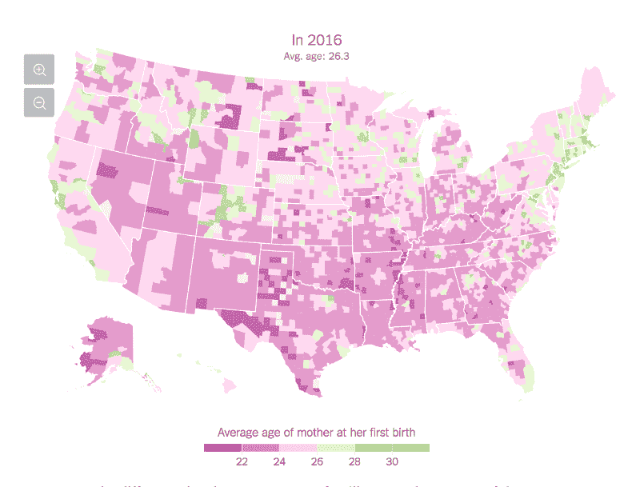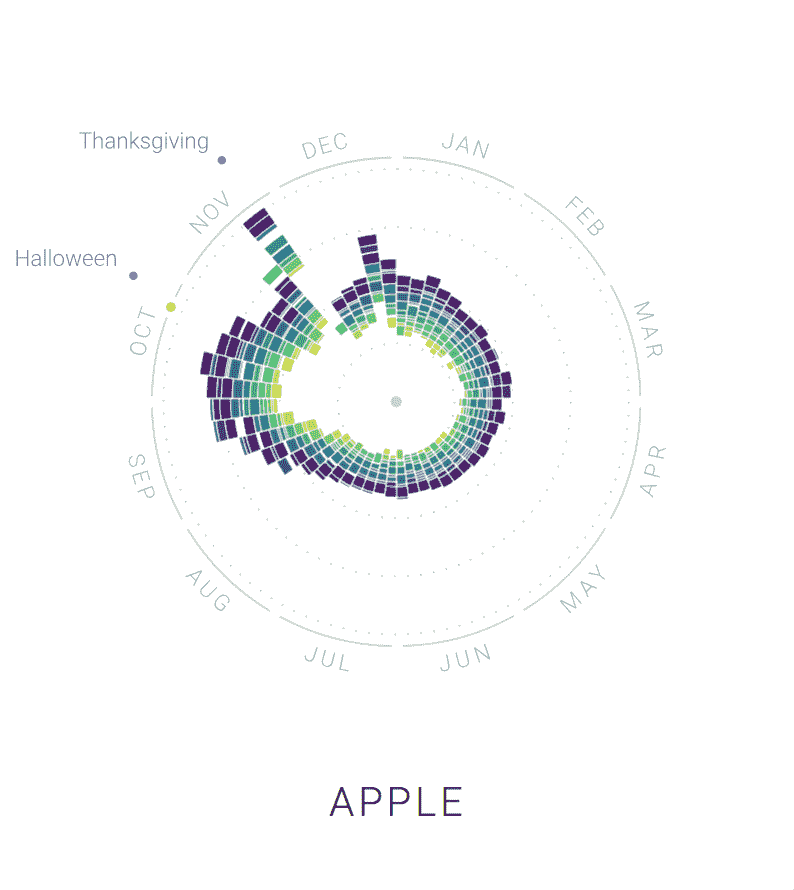

Source: [The Upshot](https://www.nytimes.com/interactive/2018/08/04/upshot/up-birth-age-gap.html), [The Rhythm of Food](http://rhythm-of-food.net/), and [Wait But Why](https://waitbutwhy.com/2016/01/horizontal-history.html)

### **为什么要绘制图表和可视化数据？**

我一直认为数据可视化是一种更好的方式来**学习**和**吸引**观众。不是每个人都天生擅长通过文本吸收信息。当我试图从一组单词中提取数字时，我的眼睛变得呆滞。文本还假设你熟悉它所用的语言。我在大学里纠结于课本阅读。非英语母语的人也过得很艰难，这似乎是有道理的。

或者，每当我在成堆的信息中看到一个漂亮的、清晰的图表时，我会立即抓住概念，并且更好地记住它们。

我们的大脑无法快速、彻底地理解大块的文本或成堆的 Excel 表格。但他们擅长的是识别相似性、对称性、对象之间的联系和连续性，这是数据可视化的基础。想想格式塔原则。

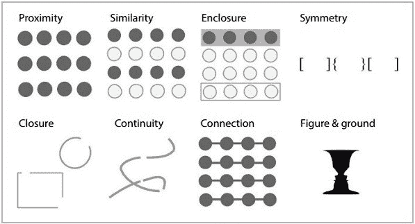

Gestalt Principles (Source: [FusionCharts](https://www.fusioncharts.com/blog/how-to-use-the-gestalt-principles-for-visual-storytelling-podv/))

下面是来自[劳动统计局](https://www.bls.gov/lau/#tables)的一些数据片段，这些数据是关于 2016 年美国各县的失业率(用 FIPS 代码表示)。

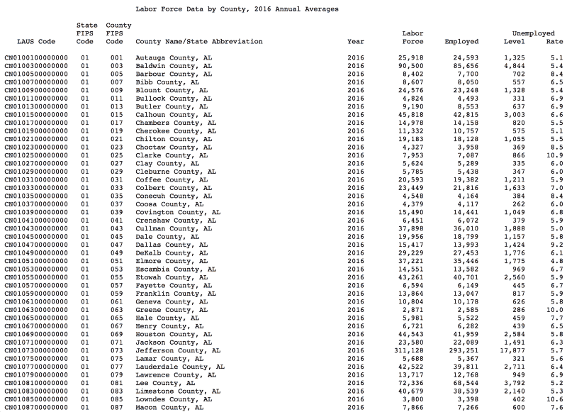

Source: [Bureau of Labor Statistics](https://www.bls.gov/lau/#tables)

为了发现趋势或捕捉异常值，普通人会花大量时间盯着这些数据。他们可能会扫描每一行，然后在另一张纸上重写数字。不理想。

但是如果我们把数据想象成一张地理地图，就像迈克·博斯托克在他的[可观察笔记本](https://beta.observablehq.com/@mbostock/d3-choropleth)中所做的那样:

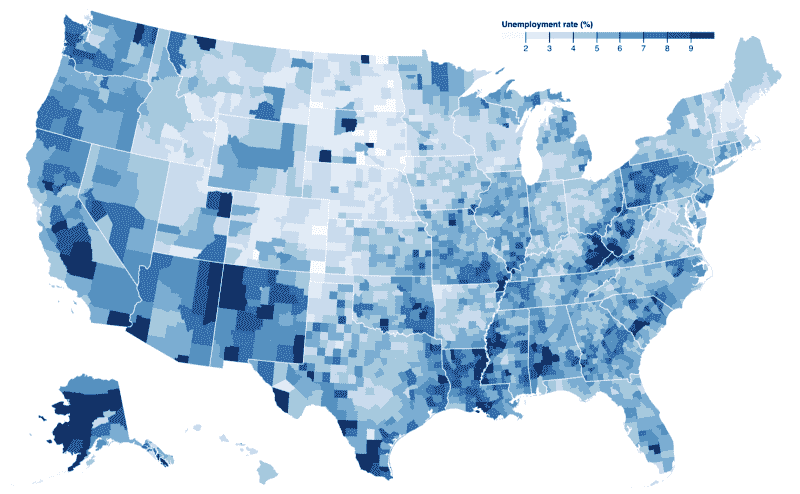

Source: [D3 Chloropleth](https://beta.observablehq.com/@mbostock/d3-choropleth)

你可以立即看到高失业率的热点。你现在已经在**秒内检测到有趣的模式，而不是几个小时。**理解时间的差异可能意味着放弃一个看似“不可理解”的数据集，或者*继续你的调查*。创建准确和可访问的可视化还允许观众捕捉数据集中的不一致或漏洞，这**使数据更加可靠**。

### **图表剖析**

在开始库比较之前，我认为 JavaScript 图表的基本“解剖”需要一个概述。在研究这些库的时候，我注意到除了 D3*之外，所有的库都采用了相同的模式来生成图表。

1.  将图表库导入 HTML。
2.  创建一个带有 ID 标识符的`<d` iv >，比如“my-first-chart”。
3.  在 JS 中获取和加载数据。您也可以直接在 JS 中定义数据。确保您已经在 HTML 中链接了这个 JS 文件。
4.  将数据、`<d` iv >容器和一个 options 对象传递给图表生成器函数。
5.  有些库，比如 Google Charts，需要调用`draw()`来绘制生成的图表。
6.  使用`http-server -c-1 -p 8000`将代码发布到 Python 服务器上，并在`localhost:8000`看到您的第一个图表。

**例题**

*   [基本动态图示例](http://dygraphs.com/tutorial.html)
*   [基础 D3.js 示例](http://bl.ocks.org/d3noob/b3ff6ae1c120eea654b5)
*   [基础 Chart.js 示例](https://www.chartjs.org/docs/latest/)
*   [基本谷歌图表示例](https://developers.google.com/chart/interactive/docs/quick_start)

*D3 主要用于制图，但它更像是一个工具包的集合，而不是标准的制图库。更好的解释见[这篇文章](https://medium.com/@mbostock/why-you-should-use-d3-ae63c276e958)。

### **我们来对比一下！**

选择任何库时，我都喜欢从这些评估问题开始:

*   学习曲线是怎样的？(文档质量、代码复杂性)
*   我可以在多大程度上定制我的图表？
*   图书馆得到积极支持了吗？
*   这个库接受什么类型的数据？
*   提供了哪些互动模式？
*   图书馆提供响应图表吗？

### **学习曲线**

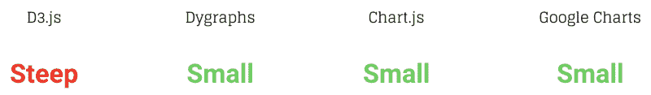

Dygraphs、Chart.js、Google Charts 的学习曲线相对较小。如果你需要在几个小时内快速制作图表，它们是很棒的。

D3 的学习曲线最高，原因是它提供了细粒度的低级控制。它更像是一个编写良好的高级助手函数库。D3 理论上可以和其他图表库结合使用。

为了进一步探索，我使用来自 [meteoblue](https://www.meteoblue.com/en/weather/forecast/week/boston_united-states-of-america_4930956) 的波士顿天气数据创建了一个跨越所有 4 个图书馆的相同图表。代码在 [GitHub](https://github.com/mandicai/boscc-charts) 上。

Top row: D3, Dygraphs, Bottom row: Chart.js, Google Charts

….并记录了制作每个图表所需的代码行:

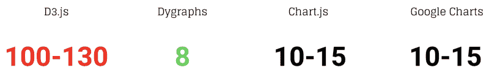

代码行支持学习曲线的原始比较。D3 需要更多的行来启动和运行一个基本的图表，但是提供了更多的定制机会。

### **定制**

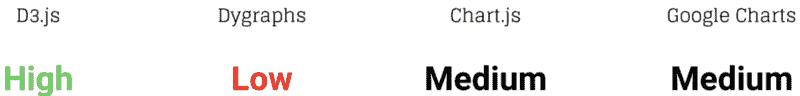

D3 在定制领域大放异彩。D3 的粒度和模块化正是为什么设计者和开发者喜欢它作为惊人和独特的可视化的媒介。 [Chart.js](https://www.chartjs.org/docs/latest/configuration/) 和 [Google Charts](https://developers.google.com/chart/interactive/docs/customizing_charts) 提供了许多可以传递给生成器函数的选项，比如图例字体大小和线条粗细。

### **主动开发**

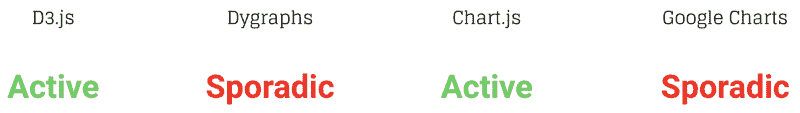

我将库开发定义为发布的频率和库维护者对开放问题和改进反馈的响应。一个支持性的大型用户社区也是一个优势。随着 JavaScript 生态系统的发展，使用鼓励健康的变化和责任。

查看各自的 GitHub 库，我发现 Dygraphs 和 Google Charts 的发布和解决的问题比 D3 和 Chart.js 更零星。D3 不会很快停止开发。它的创作者和贡献者最近在 2018 年发布了一个主要版本(v5.0)。他们仍然积极地为可视化社区做贡献。Chart.js 的最新版本也发生在最近的 2018 年。该版本解决了问题并增强了功能。它们在发行说明中有完整的记录。

### **数据类型**

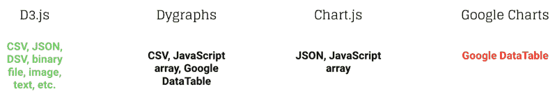

这是不言自明的。有趣的事实:我使用了 D3 的[获取库](https://github.com/d3/d3-fetch)来获取数据。我使用了其他库来绘制它。D3 为数据可视化中使用的几乎所有常见数据格式都提供了 fetch 函数。

### **交互性**

Dygraphs、Chart.js 和 Google Charts 都有一些现成的交互功能，比如工具提示、缩放和事件。很难引入高度定制的交互，因为每个库都被如此封装。有了 D3，你接受了复杂而独特的交互是可能的。代价是简单的交互，比如工具提示，也必须从头开始构建。

### **响应度**

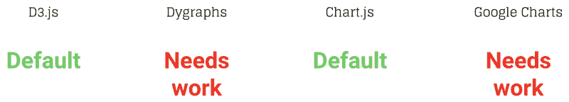

Chart.js 和 D3 提供了开箱即用的响应图表(对于 D3，为`svg`容器指定一个`viewBox`而不是`width`和`height`)。Dygraphs 和 Google Charts 需要一些额外的工作来创建响应图表，比如将`position: relative`添加到图表容器或者在`$(window).resize()`上重新绘制图表。

Dygraphs responsive char t(检查图表容器以查看 CSS 类)

[响应式谷歌图表堆栈溢出线程](https://stackoverflow.com/questions/8950761/google-chart-redraw-scale-on-window-resize)

### **最适合用于？**

最后但同样重要的是，我列出了我认为每个库最适合的用例:

All screenshots taken from each library’s respective examples section

如果你: **a)需要一个高度定制的可视化工具,**和/或【】b)想要助手函数与其他库一起使用，D3 是值得投资的。

我喜欢时间序列的动态图，因为用户可以平移序列，默认情况下**可以看到日期和相应的点**。您还可以通过[突出显示特定时间段](http://dygraphs.com/gallery/#g/highlighted-weekends)，通过[选择时间范围](http://dygraphs.com/gallery/#g/range-selector)。

Chart.js 允许你创建**简单、美观的**图表，在加载时无缝地弹出到页面中。

最后，与其他图书馆相比，谷歌图表提供了最多样的现成图表。除了标准图表，Google Charts 还支持[地理地图](https://developers.google.com/chart/interactive/docs/gallery/geochart)、[树状图](https://developers.google.com/chart/interactive/docs/gallery/treemap)、[桑基图](https://developers.google.com/chart/interactive/docs/gallery/sankey)等。

### 3，2，1 …回顾一下！

我们已经讨论了数据可视化为什么强大的许多原因**、使用图表库创建图表的基本结构和步骤以及 4 个流行 JavaScript 库的**详细比较**。**

**在你选择了一个库并生成了一些可视化之后，最重要的一步是**沟通**，然后**迭代**。把你的图表给其他人看，问他们能解释什么，不能解释什么。倾听他们的反馈，不断调整你的图表。它们是教学工具，教学工具应该随着内容和观众的变化而不断发展。**

**感谢您的阅读！**

**- — — — — — — — — — — — — — — — — — — — — — — — — — — — — — — —**

**我创建的图表的代码在 GitHub 上。**

**下面是引出本文的[演示幻灯片](https://www.slideshare.net/MandiCai/visualizing-your-data-in-javascript)。**

**如果你想了解散景和 D3，请查看[绘制水域图:散景和 D3 之间](https://medium.freecodecamp.org/charting-the-waters-between-bokeh-and-d3-73b3ee517478)。**

**如果您有任何建议或反馈，请发表评论。**