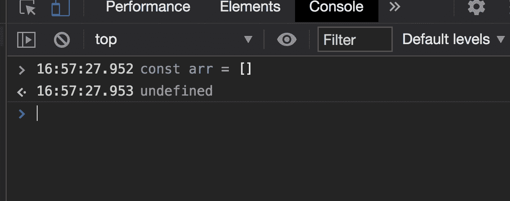
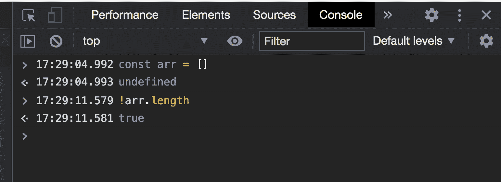
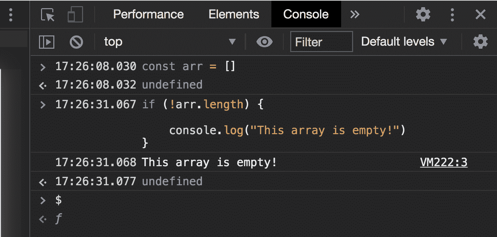
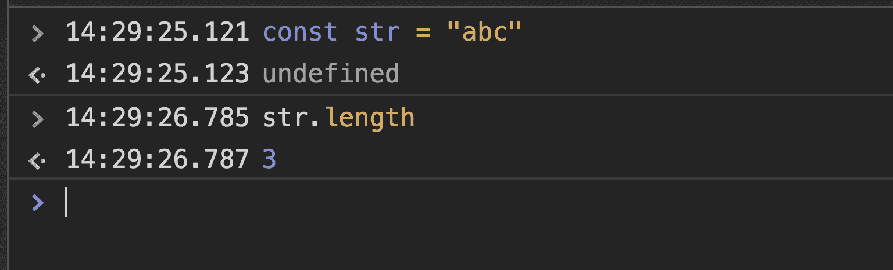
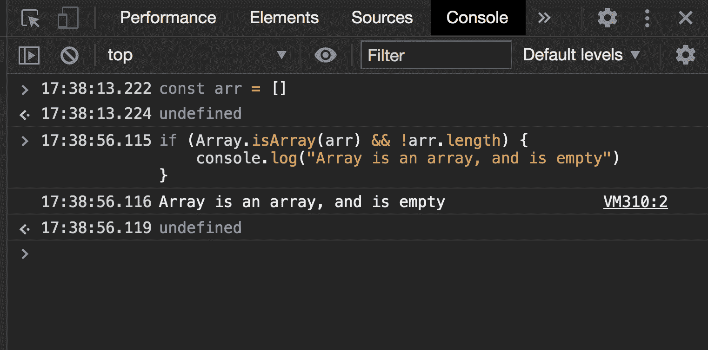

# 如何用？长度

> 原文：<https://www.freecodecamp.org/news/check-if-javascript-array-is-empty-or-not-with-length/>

当你用 JavaScript 编程时，你可能需要知道如何检查一个数组是否为空。

若要检查数组是否为空，可以使用。长度属性。

length 属性设置或返回数组中元素的个数。通过知道数组中元素的数量，可以判断它是否为空。一个空数组中会有`0`个元素。

让我们看一些例子。

## 。长度示例语法

```
Const myArray = [‘Horses’, ‘Dogs’, ‘Cats’];
```

这里我们创建一个指向数组的变量。

使用 length 属性，我们可以检查数组的长度:

```
myArray.length
```

这将返回 3，因为数组中有 3 项。

来检查数组是否为空。长度，我们可以用三种方法。

### 。长度示例一

首先，让我们创建一个没有元素的新数组。

```
const arr = []
```

现在我们可以通过使用`.length`来检查数组是否为空。

```
arr.length
```

这将返回 0，因为数组中有 0 项。

### 。长度示例二

我们还可以显式地检查数组是否为空。

`if (arr.length === 0) { console.log("Array is empty!") }`

如果我们的数组是空的，上面的消息将被记录。如果数组中有元素，那么`if`块中的代码将不会运行。

下面是使用. length 检查数组是否为空的第三种方法。

### 。长度示例三

通过结合使用 length 属性和 JavaScript 中的逻辑“not”运算符，可以将“！”符号，我们可以检查数组是否为空。

`!`运算符对表达式求反。也就是说，如果一个数组是空的，我们可以用它来返回`true`。

对于这个例子，让我们打开 JavaScript 控制台。要在 Chrome 中打开你的控制台，你可以点击 inspect-> Console。

首先，创建一个数组，其中没有任何项目。



接下来，让我们使用逻辑“非”操作符，以及我们的。属性来测试数组是否为空。



如果我们没有使用“not”操作符，`arr.length`就会返回`0`。添加运算符后，如果其操作数为`false`，将返回`true`。因为 arr.length 是`0`，或者 false，所以它返回`true`。

让我们用一个`if`语句来使用它，如果我们的数组是空的，就打印出一条消息。



当检查一个数组是否为空时，最好也检查这个数组是否确实是一个数组。

为什么？

因为可能会出现这样的情况，当您希望检查数组的长度时，却得到了一个不同的数据类型，例如，一个字符串:



因为`length property`可以用于其他数据类型，所以最好也检查一下您的数组是否确实是您所期望的数组。

我建议你也使用`Array.isArray()`方法来确认你的数组是一个数组。此方法确定传入的内容是否是数组。如果传入的是一个数组，这个方法将返回`true`。

让我们将这个方法添加到我们的示例中。

### 如何使用 Array.isArray()方法



## 一段视频解释了如何用？长度

[https://scrimba.com/scrim/cpJWbLud?embed=freecodecamp,mini-header,no-sidebar](https://scrimba.com/scrim/cpJWbLud?embed=freecodecamp,mini-header,no-sidebar)

## 包扎

在本文中，我们了解到可以用各种方式在 JavaScript 中使用`length`属性来检查数组是否为空。属性返回数组中的项数。

我们还了解到，在使用`.length`属性时，最好也使用`Array.isArray`方法，以检查传递的值是否是您所期望的数组。