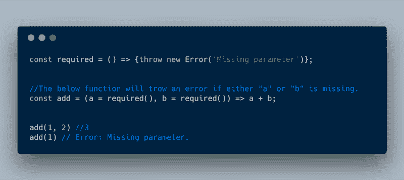
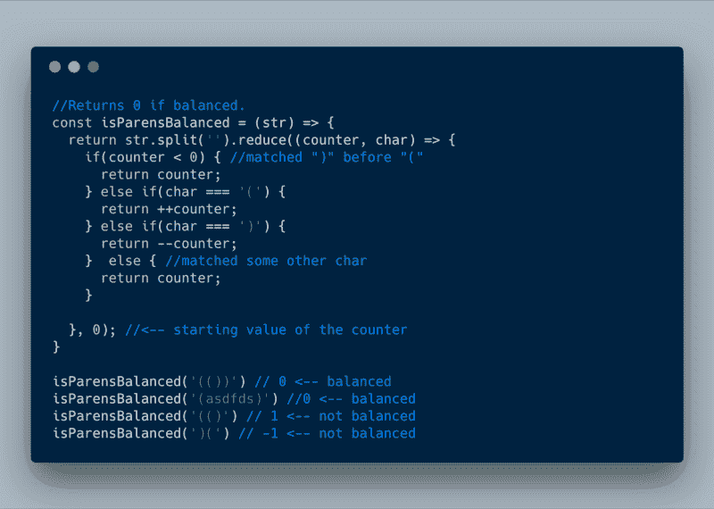
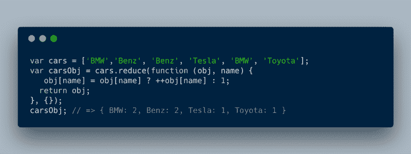
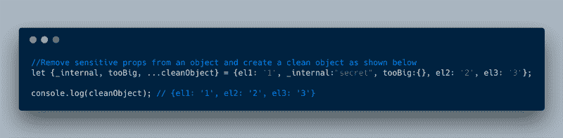
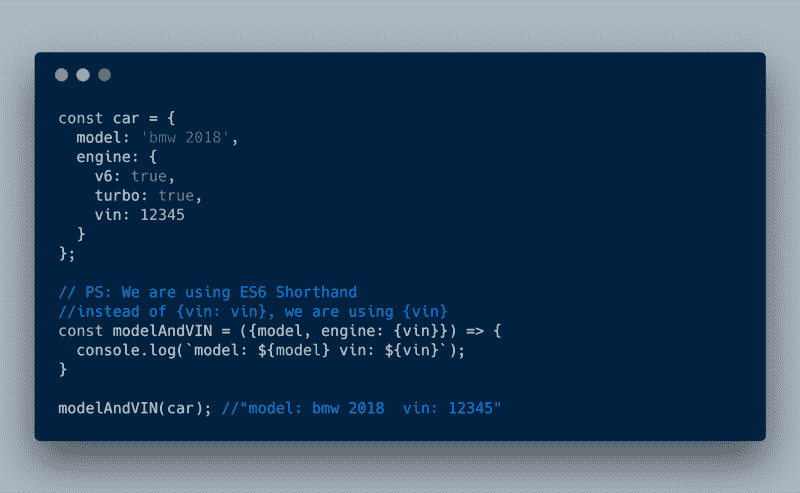
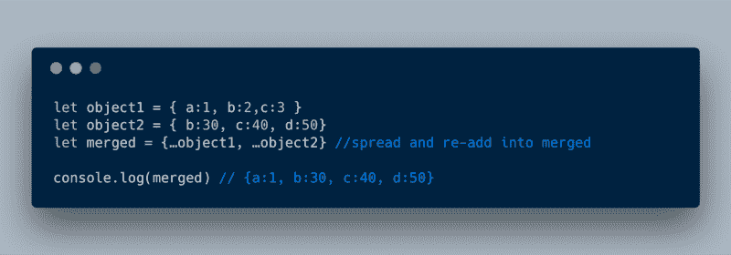
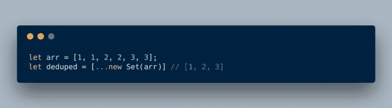
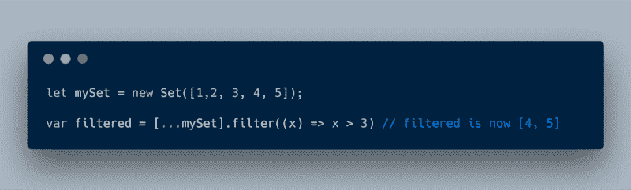
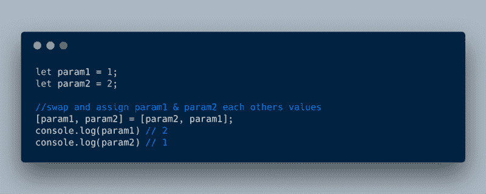
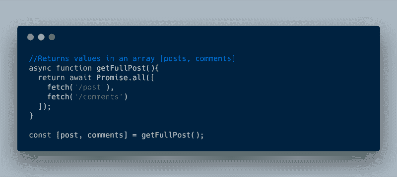

# 查看这些有用的 ECMAScript 2015 (ES6)提示和技巧

> 原文：<https://www.freecodecamp.org/news/check-out-these-useful-ecmascript-2015-es6-tips-and-tricks-6db105590377/>

作者 rajaraodv

# 查看这些有用的 ECMAScript 2015 (ES6)提示和技巧


Photo by [Glenn Carstens-Peters](https://unsplash.com/photos/npxXWgQ33ZQ?utm_source=unsplash&utm_medium=referral&utm_content=creditCopyText) on [Unsplash](https://unsplash.com/search/photos/computer?utm_source=unsplash&utm_medium=referral&utm_content=creditCopyText)

EcmaScript 2015(又名 ES6)已经问世好几年了，各种各样的新功能都可以以巧妙的方式使用。我想列出并讨论其中的一些，因为我想你会发现它们很有用。

如果你知道其他的建议，请在评论中告诉我，我很乐意补充。

### 1.强制要求的参数

ES6 提供了[默认参数值](https://developer.mozilla.org/en-US/docs/Web/JavaScript/Reference/Functions/Default_parameters),允许您设置一些默认值，以便在调用函数时不使用该参数。

在下面的例子中，我们将`required()`函数设置为`a`和`b`参数的默认值。这意味着如果`a`或`b`没有通过，那么`required()`函数将被调用，你将得到一个错误。



```
const required = () => {throw new Error('Missing parameter')};
```

```
//The below function will trow an error if either "a" or "b" is missing.const add = (a = required(), b = required()) => a + b;
```

```
add(1, 2) //3add(1) // Error: Missing parameter.
```

### 2.浩浩荡荡的“减少”

Array 的 r [educe](https://developer.mozilla.org/en-US/docs/Web/JavaScript/Reference/Global_Objects/Array/reduce) 方法非常通用。它通常用于将项目数组转换为单个值。**但是你可以用它做更多的事情。**

> **？提示:大多数技巧依赖于初始值是一个数组或一个对象，而不是一个简单的值，如字符串或变量。**

**2.1 使用 reduce 同时进行贴图和过滤***

假设你有一个情况，你有一个条目列表，你想更新每个条目(也就是[映射](https://developer.mozilla.org/en-US/docs/Web/JavaScript/Reference/Global_Objects/Array/map)，然后只过滤几个条目(也就是[过滤](https://developer.mozilla.org/en-US/docs/Web/JavaScript/Reference/Global_Objects/Array/filter))。但是这意味着你需要运行这个列表两次！

在下面的例子中，我们希望将数组中的项目值加倍，然后只选取那些大于 50 的项目。注意我们如何使用强大的 reduce 方法来进行双重(映射)和过滤？那是相当有效的。


```
const numbers = [10, 20, 30, 40];
```

```
const doubledOver50 = numbers.reduce((finalList, num) => {    num = num * 2; //double each number (i.e. map)    //filter number &gt; 50  if (num > 50) {    finalList.push(num);  }  return finalList;}, []);
```

```
doubledOver50; // [60, 80]
```

#### 2.2 使用“reduce”代替“map”或“filter”

如果你仔细看看上面的例子(来自 2.1)，你会知道 reduce 可以用来过滤或映射项目！**？**

#### **2.3 使用 reduce 来平衡**括号

这是 reduce 函数有多用途的另一个例子。给定一个带括号的字符串，我们想知道它们是否平衡，即有相等数量的“(“和”)”，以及“(”是否在“)”之前。

我们可以很容易地在 reduce 中做到这一点，如下所示。我们简单地保存一个初始值为 0 的变量`counter`。如果我们点击了`(`，我们就向上计数；如果我们点击了`)`，我们就向下计数。如果它们是平衡的，那么我们应该以`0`结束。



```
//Returns 0 if balanced.const isParensBalanced = (str) => {  return str.split('').reduce((counter, char) => {    if(counter < 0) { //matched ")" before "("      return counter;    } else if(char === '(') {      return ++counter;    } else if(char === ')') {      return --counter;    }  else { //matched some other char      return counter;    }      }, 0); //<-- starting value of the counter}
```

```
isParensBalanced('(())') // 0 <-- balancedisParensBalanced('(asdfds)') //0 <-- balanced
```

```
isParensBalanced('(()') // 1 <-- not balancedisParensBalanced(')(') // -1 <-- not balanced
```

#### 2.4 计算重复数组项(转换数组→对象)

有时，您需要计算重复的数组项或将数组转换为对象。为此，您可以使用 reduce。

在下面的例子中，我们想要计算每种类型的汽车的数量，并将这个数字放入一个对象中。



```
var cars = ['BMW','Benz', 'Benz', 'Tesla', 'BMW', 'Toyota'];
```

```
var carsObj = cars.reduce(function (obj, name) {    obj[name] = obj[name] ? ++obj[name] : 1;  return obj;}, {});
```

```
carsObj; // => { BMW: 2, Benz: 2, Tesla: 1, Toyota: 1 }
```

使用 reduce 还可以做更多的事情，我鼓励你阅读 MDN [上列出的例子。](https://developer.mozilla.org/en-US/docs/Web/JavaScript/Reference/Global_Objects/Array/Reduce)

### **3。对象析构**

#### 3.1 删除不需要的属性

有时候，您想要删除不需要的属性，可能是因为它们包含敏感信息或者太大。我们可以简单地将这些属性提取到变量中，并将有用的属性保存在 ***rest*** 参数中，而不是遍历整个对象来删除它们。

在下面的例子中，我们想要删除`_internal`和`tooBig` 属性。我们可以将它们分配给`_internal`和`tooBig`变量，并将剩余的变量存储在一个 ***rest*参数** `cleanObject`中，以备后用。



```
let {_internal, tooBig, ...cleanObject} = {el1: '1', _internal:"secret", tooBig:{}, el2: '2', el3: '3'};
```

```
console.log(cleanObject); // {el1: '1', el2: '2', el3: '3'}
```

#### **3.2 析构函数参数中的嵌套对象**

在下面的例子中，`engine`属性是`car`对象的嵌套对象。如果我们对`engine`的`vin`属性感兴趣，我们可以很容易地析构它，如下所示。



```
var car = {  model: 'bmw 2018',  engine: {    v6: true,    turbo: true,    vin: 12345  }}
```

```
const modelAndVIN = ({model, engine: {vin}}) => {  console.log(`model: ${model} vin: ${vin}`);}
```

```
modelAndVIN(car); // =&gt; model: bmw 2018  vin: 12345
```

#### 3.3 合并对象

ES6 带有一个扩展操作符(用三个点表示)。它通常用于解构数组值，但也可以用于对象。

在下面的例子中，我们使用 spread 操作符在一个新对象中展开。第二个对象中的属性键将覆盖第一个对象中的属性键。

在下面的例子中，来自`object2`的属性键`b and c`覆盖了来自`object1`的属性键



```
let object1 = { a:1, b:2,c:3 }let object2 = { b:30, c:40, d:50}let merged = {…object1, …object2} //spread and re-add into mergedconsole.log(merged) // {a:1, b:30, c:40, d:50}
```

### 4.设置

#### 4.1 使用集合的去杜平阵列

在 ES6 中，您可以使用集合轻松删除重复项，因为集合只允许存储唯一值。



```
let arr = [1, 1, 2, 2, 3, 3];let deduped = [...new Set(arr)] // [1, 2, 3]
```

#### 4.2 使用数组方法

将集合转换成数组就像使用扩展操作符(`…`)一样简单。您也可以在集合上轻松使用所有的数组方法！

假设我们有一个如下所示的集合，我们想`filter`它只包含大于 3 的项目。



```
let mySet = new Set([1,2, 3, 4, 5]);
```

```
var filtered = [...mySet].filter((x) => x > 3) // [4, 5]
```

### 5.数组析构

很多时候，函数可能在一个数组中返回多个值。我们可以很容易地通过使用数组析构来获取它们。

#### 5.1 交换值



```
let param1 = 1;let param2 = 2;
```

```
//swap and assign param1 & param2 each others values[param1, param2] = [param2, param1];
```

```
console.log(param1) // 2console.log(param2) // 1
```

#### 5.2 从一个函数接收并分配多个值

在下面的例子中，我们在`/post`获取一篇文章，在`/comments`获取相关评论。因为我们使用的是`async / await`，这个函数在一个数组中返回结果。使用数组析构，我们可以简单地将结果直接赋给相应的变量。



```
async function getFullPost(){  return await Promise.all([    fetch('/post'),    fetch('/comments')  ]);}
```

```
const [post, comments] = getFullPost();
```

#### 如果这有用，请点击拍手？下面扣几下，以示支持！⬇⬇⬇ ?？

### 我的其他帖子

[*https://medium.com/@rajaraodv/latest*](https://medium.com/@rajaraodv/latest)

#### *ECMAScript 2015+*

1.  *[*ECMAScript 2016、2017、2018*](https://medium.freecodecamp.org/here-are-examples-of-everything-new-in-ecmascript-2016-2017-and-2018-d52fa3b5a70e) 中一切*新*的例子*
2.  *[*看看这些有用的 ECMAScript 2015 (ES6)提示和技巧*](https://medium.freecodecamp.org/check-out-these-useful-ecmascript-2015-es6-tips-and-tricks-6db105590377)*
3.  *[*ES6*](https://medium.com/@rajaraodv/5-javascript-bad-parts-that-are-fixed-in-es6-c7c45d44fd81#.7e2s6cghy)中修复的 5 个 JavaScript“坏”部分*
4.  *[*ES6 中的“类”是新的“坏”的部分吗？*](https://medium.com/@rajaraodv/is-class-in-es6-the-new-bad-part-6c4e6fe1ee65#.4hqgpj2uv)*

#### *终端改进*

1.  *[](https://medium.freecodecamp.org/jazz-up-your-bash-terminal-a-step-by-step-guide-with-pictures-80267554cb22)*如何让你的终端变得更有趣**
2.  **[*用七个步骤让你的“ZSH”码头焕然一新——视觉指南*](https://medium.freecodecamp.org/jazz-up-your-zsh-terminal-in-seven-steps-a-visual-guide-e81a8fd59a38)**

#### **万维网**

1.  **[](https://medium.freecodecamp.org/a-fascinating-and-messy-history-of-the-web-and-javascript-video-8978dc7bda75)*一段精彩纷呈的网络和 JavaScript 历史***

#### ***虚拟 DOM***

1.  ***[*虚拟 DOM 的内部运作*](https://medium.com/@rajaraodv/the-inner-workings-of-virtual-dom-666ee7ad47cf)***

#### **反应性能**

1.  **[*两种快速缩减 React App 生产规模的方法*](https://medium.com/@rajaraodv/two-quick-ways-to-reduce-react-apps-size-in-production-82226605771a#.6lepbl7ae)**
2.  **[*用 Preact 代替 React*](https://medium.com/@rajaraodv/using-preact-instead-of-react-70f40f53107c#.7fzp0lyo3)**

#### **函数式编程**

1.  **[*JavaScript 是图灵全集——解释*](https://medium.com/@rajaraodv/javascript-is-turing-complete-explained-41a34287d263#.6t0b2w66p)**
2.  **[*JS 中的函数式编程—结合实例(上)*](https://medium.com/@rajaraodv/functional-programming-in-js-with-practical-examples-part-1-87c2b0dbc276#.fbgrmoa7g)**
3.  **[*JS 中的函数式编程—结合实例(下)*](https://medium.freecodecamp.org/functional-programming-in-js-with-practical-examples-part-2-429d2e8ccc9e)**
4.  **[*Redux 为什么需要还原器是“纯函数”*](https://medium.com/@rajaraodv/why-redux-needs-reducers-to-be-pure-functions-d438c58ae468#.bntrywxrf)**

#### **网络包**

1.  **[*Webpack —令人困惑的部分*](https://medium.com/@rajaraodv/webpack-the-confusing-parts-58712f8fcad9#.6ot6deo2b)**
2.  **[*Webpack &热模块更换【HMR】*](https://medium.com/@rajaraodv/webpack-hot-module-replacement-hmr-e756a726a07#.y667mx4lg)*(引擎盖下)***
3.  **[*Webpack 的 HMR 和 React-Hot-Loader —失踪手册*](https://medium.com/@rajaraodv/webpacks-hmr-react-hot-loader-the-missing-manual-232336dc0d96#.fbb1e7ehl)**

#### **Draft.js**

1.  **[*为什么选择 Draft.js，为什么要投稿*](https://medium.com/@rajaraodv/why-draft-js-and-why-you-should-contribute-460c4a69e6c8#.jp1tsvsqc)**
2.  **[*draft . js 如何表示富文本数据*](https://medium.com/@rajaraodv/how-draft-js-represents-rich-text-data-eeabb5f25cf2#.hh0ue85lo)**

#### **反应和还原:**

1.  **[*逐步构建 React Redux 应用指南*](https://medium.com/@rajaraodv/step-by-step-guide-to-building-react-redux-apps-using-mocks-48ca0f47f9a#.s7zsgq3u1)**
2.  **[*React Redux CRUD App 构建指南*](https://medium.com/@rajaraodv/a-guide-for-building-a-react-redux-crud-app-7fe0b8943d0f#.g99gruhdz) *(3 页 app)***
3.  **[*在 React Redux 应用中使用中间件*](https://medium.com/@rajaraodv/using-middlewares-in-react-redux-apps-f7c9652610c6#.oentrjqpj)**
4.  **[*添加一个健壮的表单验证来反应 Redux 应用程序*](https://medium.com/@rajaraodv/adding-a-robust-form-validation-to-react-redux-apps-616ca240c124#.jq013tkr1)**
5.  **[*用 JWT 令牌保护 React Redux 应用*](https://medium.com/@rajaraodv/securing-react-redux-apps-with-jwt-tokens-fcfe81356ea0#.xci6o9s6w)**
6.  **[*在 React Redux 应用中处理交易邮件*](https://medium.com/@rajaraodv/handling-transactional-emails-in-react-redux-apps-8b1134748f76#.a24nenmnt)**
7.  **[*解剖一个 React Redux App*](https://medium.com/@rajaraodv/the-anatomy-of-a-react-redux-app-759282368c5a#.7wwjs8eqo)**
8.  **[*Redux 为什么需要还原器是“纯函数”*](https://medium.com/@rajaraodv/why-redux-needs-reducers-to-be-pure-functions-d438c58ae468#.bntrywxrf)**
9.  **[*两种快速缩减 React App 生产规模的方法*](https://medium.com/@rajaraodv/two-quick-ways-to-reduce-react-apps-size-in-production-82226605771a#.6lepbl7ae)**