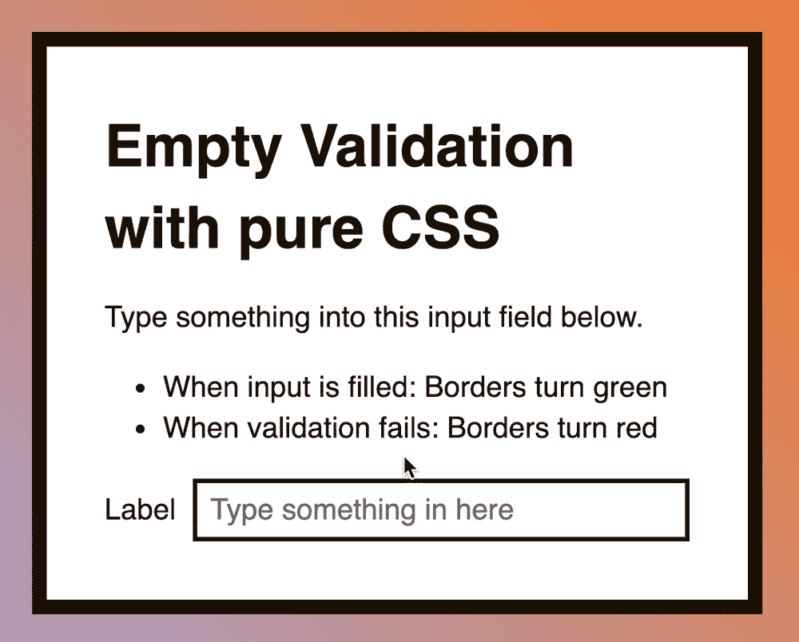

# 如何用 JavaScript 检查输入是否为空

> 原文：<https://www.freecodecamp.org/news/checking-if-an-input-is-empty-with-javascript-d41ed5a6195f/>

作者 Zell Liew

# 如何用 JavaScript 检查输入是否为空

上周，我分享了如何用 CSS 检查一个输入是否为空。今天，我们来谈谈同样的事情，但是用 JavaScript。

简单多了。

这是我们正在建造的:


### 验证输入的事件

如果您想在用户输入字段时验证输入，您可以使用`input`事件。

```
const input = document.querySelector('input')input.addEventListener('input', evt => {  // Validate input})
```

如果希望在用户提交表单时验证输入，可以使用`submit`事件。确保使用`preventDefault`阻止默认行为。

如果不阻止默认行为，浏览器会将用户导航到 action 属性中声明的 URL。

```
const form = document.querySelector('form')form.addEventListener('submit', evt => {  evt.preventDefault()
```

```
// Validate input})
```

### 验证输入

我们想知道输入是否为空。就我们的目的而言，空意味着:

1.  用户没有在字段中键入任何内容
2.  用户键入了一个或多个空格，但没有键入其他字符

在 JavaScript 中，通过/失败条件可以表示为:

```
// Empty' ''  ''   '
```

```
// Filled'one-word''one-word '' one-word'' one-word ''one phrase with whitespace''one phrase with whitespace '' one phrase with whitespace'' one phrase with whitespace '
```

检查这个很容易。我们只需要使用`trim`方法。`trim`删除字符串前后的任何空格。

```
const value = input.value.trim()
```

如果输入有效，可以将`data-state`设置为`valid`。如果输入无效，可以将`data-state`设置为`invalid`。

```
// This is JavaScript 
```

```
input.addEventListener('input', evt => {  const value = input.value.trim()
```

```
if (value) {    input.dataset.state = 'valid'  } else {    input.dataset.state = 'invalid'  }})
```

```
/* This is CSS */
```

```
/* Show red borders when filled, but invalid */input[data-state="invalid"] {  border-color: hsl(0, 76%, 50%);}
```

```
/* Show green borders when valid */input[data-state="valid"] {  border-color: hsl(120, 76%, 50%);}This isn’t the end yet. We have a problem.
```

当用户在字段中输入文本时，输入验证开始。但是，如果用户删除了字段中的所有文本，输入仍然无效。

如果用户删除了所有文本，我们不想让输入无效。他们可能需要一点时间来思考，但是无效状态引发了不必要的警报。



为了解决这个问题，我们可以在输入之前检查用户是否输入了任何文本。

```
input.addEventListener('input', evt => {  const value = input.value
```

```
if (!value) {    input.dataset.state = ''    return  }
```

```
const trimmed = value.trim()
```

```
if (trimmed) {    input.dataset.state = 'valid'  } else {    input.dataset.state = 'invalid'  }})
```

这里有一支笔供你使用:

参见 [CodePen](https://codepen.io/) 上 Zell Liew ( [@zellwk](https://codepen.io/zellwk) )用 JavaScript 进行的 Pen [空验证。](https://codepen.io/zellwk/pen/EObQpr/)

感谢阅读。这篇文章对你有帮助吗？如果是的话，我希望你能考虑分享它。你可能会帮助其他人。非常感谢！

本文最初发布在 *[我的博客](https://zellwk.com/blog/check-empty-input-js)。*
如果你想要更多的文章来帮助你成为更好的前端开发人员，请注册我的[时事通讯](https://zellwk.com/)。