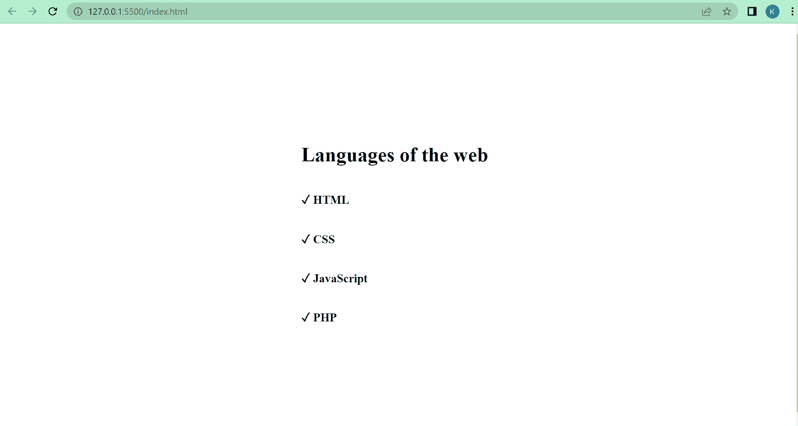
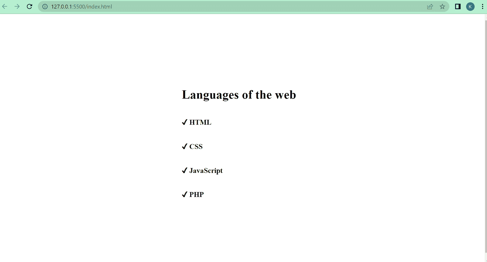
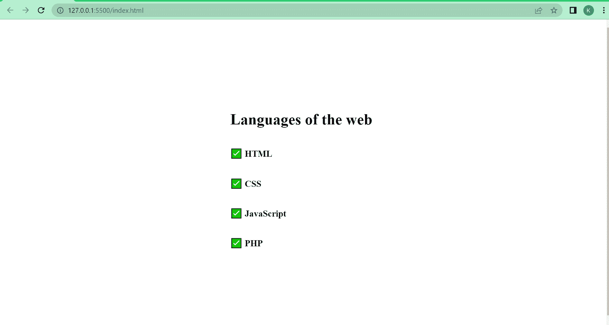
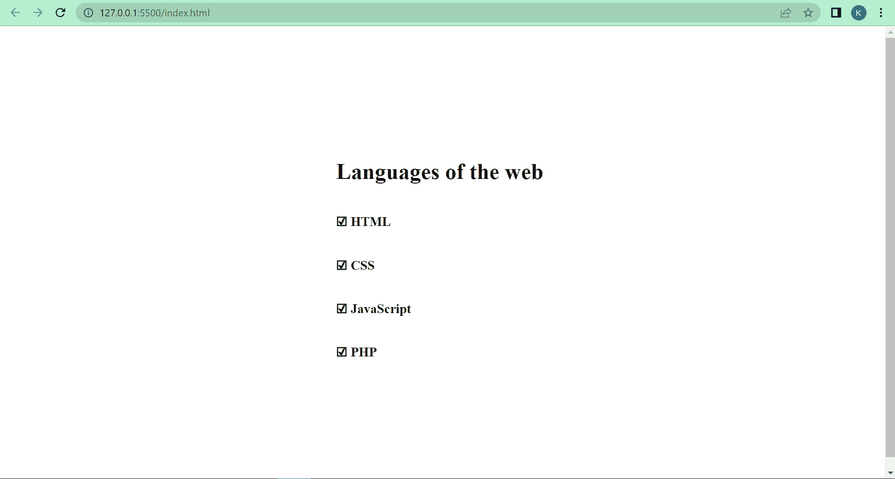
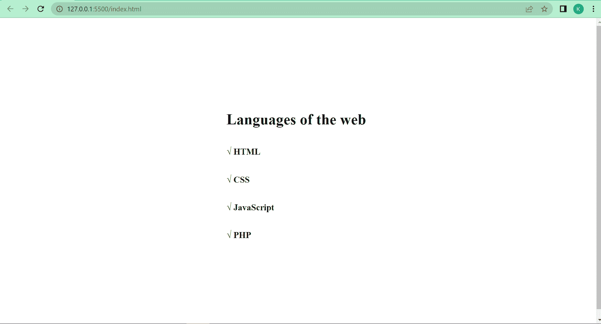

# 复选标记符号–复选标记 Unicode 的 HTML

> 原文：<https://www.freecodecamp.org/news/checkmark-symbol-html-for-checkmark-unicode/>

如果你看一下你的键盘，你会发现没有键来输入勾号。

您可以决定从 internet 上复制复选标记符号，并将其直接粘贴到您的 HTML 代码中，但更简单的方法是使用适当的 Unicode 字符或 HTML 字符实体。

如果你想知道 Unicode 和 HTML 字符实体是什么，它们都是代表不同表情符号、符号和字符的一段文本。

在您的 web 项目中，您可能希望显示一个表示同意或同意的复选标记。因此，在本文中，我将向您展示如何使用适当的 Unicode 和 HTML 字符实体在您的 web 项目中添加复选标记。我还将向您展示复选标记符号的其他 4 种变体。

## 复选标记的 Unicode 和 HTML 字符

用于显示复选标记的 Unicode 字符是`U+2713`。如果您决定使用这个 Unicode 在 HTML 中显示一个复选标记，并像这样键入，您键入的内容将如下所示:

```
 <h1>Languages of the web</h1>
 <h3>U+2713 HTML</h3>
 <h3>U+2713 CSS</h3>
 <h3>U+2713 JavaScript</h3>
 <h3>U+2713 PHP</h3> 
```

**那么，如何使用 U+2713 Unicode 来显示勾号符号呢？**

移除`U+`并用一个与符号(`&`)、井号(#)和`x`代替。然后输入 2713，再输入一个分号。于是，就变成了`&#x2713;`。

```
 <h1>Languages of the web</h1>
 <h3>&#x2713; HTML</h3>
 <h3>&#x2713; CSS</h3>
 <h3>&#x2713; JavaScript</h3>
 <h3>&#x2713; PHP</h3> 
```



您也可以使用 HTML 字符实体来显示复选标记符号。这是`&#10003;`或`&check;`:

```
<h1>Languages of the web</h1>
<h3>&check; HTML</h3>
<h3>&#10003; CSS</h3>
<h3>&#10003; JavaScript</h3>
<h3>&check; PHP</h3> 
```


## 复选标记符号的其他变体

除了传统的`U+2713`、`&#10003;`或`&check;`之外，还有其他变体，如:

### `&#1004;`更醒目的对勾

```
<h1>Languages of the web</h1>
<h3>&#10004; HTML</h3>
<h3>&#10004; CSS</h3>
<h3>&#10004; JavaScript</h3>
<h3>&#10004; PHP</h3> 
```



### u+2705-`&#x2705;`用于白色重勾号

```
<h1>Languages of the web</h1>
<h3>&#x2705; HTML</h3>
<h3>&#x2705; CSS</h3>
<h3>&#x2705; JavaScript</h3>
<h3>&#x2705; PHP</h3> 
```



### u+2611-`&#x2611;`用于选票勾号

```
<h1>Languages of the web</h1>
<h3>&#x2611; HTML</h3>
<h3>&#x2611; CSS</h3>
<h3>&#x2611; JavaScript</h3>
<h3>&#x2611; PHP</h3> 
```



### u+221 a–`&#x221A;`表示平方根复选标记

```
<h1>Languages of the web</h1>
<h3>&#x221A; HTML</h3>
<h3>&#x221A; CSS</h3>
<h3>&#x221A; JavaScript</h3>
<h3>&#x221A; PHP</h3> 
```



## 结论

本文向您展示了复选标记的 Unicode 字符串，如何使用它，以及它的其他变体。

您还了解了复选标记符号的等效 HTML 字符实体，以防您不想用 Unicode 字符串显示它。

现在，在代码中插入一些复选标记。