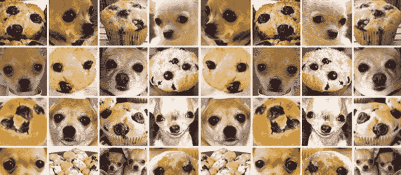
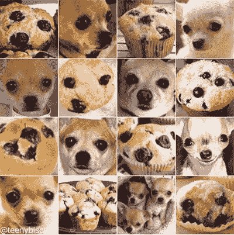
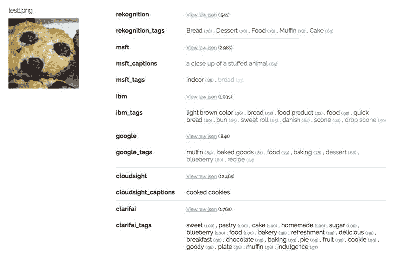
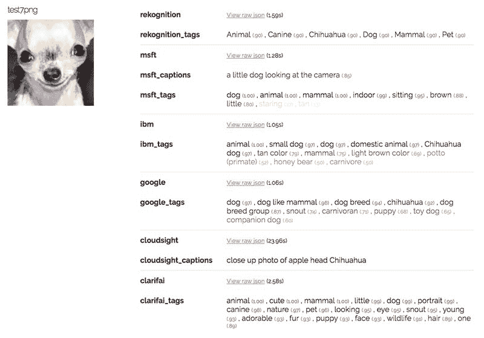
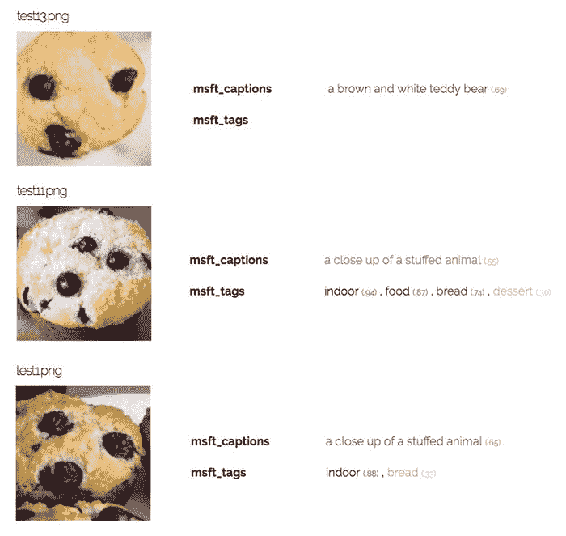
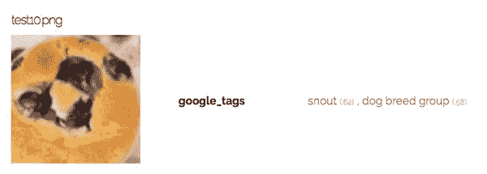

# 吉娃娃还是松饼？我对最佳计算机视觉 API 的探索

> 原文：<https://www.freecodecamp.org/news/chihuahua-or-muffin-my-search-for-the-best-computer-vision-api-cbda4d6b425d/>

作者:姚

# 吉娃娃还是松饼？我对最佳计算机视觉 API 的探索

这个流行的网络迷因展示了吉娃娃和松饼惊人的相似之处。这些图像通常在人工智能(AI)行业(包括我自己)的演示中共享。

但有一个问题我还没看到有人回答，那就是现代人工智能在消除类似吉娃娃或松饼的图像的不确定性方面有多好？为了娱乐和教育，我今天将调查这个问题。

自从 1957 年[感知器算法](https://en.wikipedia.org/wiki/Perceptron)被发明以来，二进制分类已经成为可能。如果你认为人工智能现在被炒作了，1958 年,*纽约时报*报道说，这项发明是计算机的开端，它将“能够行走、说话、看、写、自我复制并意识到自己的存在”虽然感知器机器，如 [Mark 1](https://blog.knoldus.com/2017/09/12/introduction-to-perceptron-neural-network/) ，是为图像识别而设计的，但实际上它们只能辨别线性可分的模式。这阻止了他们学习大多数视觉媒体中的复杂模式。

难怪世界幻灭，随之而来的是一个 AI 冬天。此后，[多层感知](https://en.wikipedia.org/wiki/Multilayer_perceptron)(20 世纪 80 年代流行)和[卷积神经网络](https://en.wikipedia.org/wiki/Convolutional_neural_network)(1998 年由 [Yann LeCun](http://yann.lecun.com/) 首创)在图像识别任务上大大优于[单层感知](http://lcn.epfl.ch/tutorial/english/perceptron/html/intro.html)。

凭借像 [ImageNet](http://www.image-net.org/) 这样的大型标签数据集和强大的 [GPU](https://en.wikipedia.org/wiki/Graphics_processing_unit) 计算，像 [AlexNet](https://papers.nips.cc/paper/4824-imagenet-classification-with-deep-convolutional-neural-networks.pdfhttps://papers.nips.cc/paper/4824-imagenet-classification-with-deep-convolutional-neural-networks.pdf) 、 [VGG](https://arxiv.org/pdf/1409.1556.pdf) 、 [Inception](https://www.cv-foundation.org/openaccess/content_cvpr_2015/papers/Szegedy_Going_Deeper_With_2015_CVPR_paper.pdf) 和 [ResNet](https://arxiv.org/pdf/1512.03385.pdf) 这样的更先进的神经网络架构已经在计算机视觉领域实现了最先进的性能。

#### 计算机视觉和图像识别 API

如果你是一名机器学习工程师，通过使用 [Keras/Tensorflow](https://keras.io/applications/) 或 [PyTorch](http://pytorch.org/) 中预先训练的模型和权重，很容易试验和微调这些模型。如果你不习惯独自调整神经网络，你很幸运。几乎所有领先的技术巨头和有前途的初创公司都声称要通过提供易于使用的计算机视觉 API 来“民主化人工智能”。

哪个最好？要回答这个问题，您必须清楚地定义您的业务目标、产品用例、测试数据集和成功的度量标准，然后才能比较这些解决方案。

作为严肃调查的替代，我们至少可以通过区分吉娃娃和松饼的玩具问题来测试每个平台的不同行为，从而获得一个高层次的感觉。

#### 进行测试

为了做到这一点，我将规范迷因分成 16 个测试图像。然后我使用由工程师 [Gaurav Oberoi](https://goberoi.com/) 编写的[开源代码](https://github.com/goberoi/cloudy_visionhttps://github.com/goberoi/cloudy_vision)来整合来自不同 API 的结果。每个图像都通过上面列出的六个 API，这些 API 返回高可信度标签作为它们的预测。例外的是微软，它返回标签和标题，以及 [Cloudsight](https://cloudsight.ai/) ，它使用人机混合技术只返回一个标题。这就是为什么 Cloudsight 可以为复杂的图像返回异常准确的标题，但处理时间要长 10-20 倍。

下面是输出的一个例子。要查看所有 16 张吉娃娃与松饼图像的结果，[点击这里](http://www.topbots.com/downloads/code/vision/chihuahua_vs_muffin/)。

API 表现如何？除了[微软](https://www.microsoft.com/en-ca)把这个松饼误认为填充动物，其他所有 API 都认为这个图像是食物。但是对于食物是面包、蛋糕、曲奇还是松饼没有达成一致。Google 是唯一一个成功识别 muffin 是最有可能的标签的 API。

让我们看一个吉娃娃的例子。

同样，API 做得相当好。所有的人都意识到这个图像是一只狗，尽管他们中的一些人错过了确切的品种。

尽管如此，还是有明显的失败。微软三次返回了一个明显错误的标题，将松饼描述为填充动物或泰迪熊。

谷歌是最终的松饼标识符，在测试集的 7 幅松饼图像中，有 6 幅返回“松饼”作为其最高可信度标签。其他 API 没有返回“muffin”作为任何松饼图片的第一个标签，而是返回不太相关的标签，如“面包”、“饼干”或“纸杯蛋糕”。

然而，尽管取得了一系列成功，谷歌在这个特定的松饼图像上确实失败了，返回了“猪嘴”和“狗品种群”作为预测。

即使是世界上最先进的机器学习平台也会被我们滑稽的吉娃娃对松饼挑战绊倒。当谈到弄清楚什么是食物和什么是 Fido 时，一个蹒跚学步的人类胜过了深度学习。

#### 那么哪个计算机视觉 API 最好呢？

为了找到这个难以捉摸的谜的答案，你必须前往 top bots[阅读原文全文](https://www.topbots.com/chihuahua-muffin-searching-best-computer-vision-api/)！